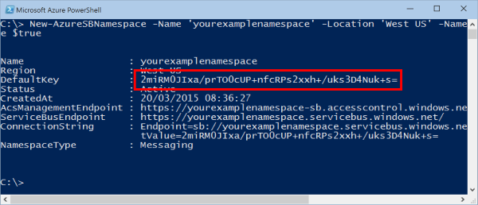

<properties
    pageTitle="So verwenden Sie Servicebuswarteschlangen mit Ruby | Microsoft Azure"
    description="Erfahren Sie, wie Servicebuswarteschlangen in Azure verwenden. Codebeispielen in Ruby geschrieben wurde."
    services="service-bus"
    documentationCenter="ruby"
    authors="sethmanheim"
    manager="timlt"
    editor=""/>

<tags
    ms.service="service-bus"
    ms.workload="na"
    ms.tgt_pltfrm="na"
    ms.devlang="ruby"
    ms.topic="article"
    ms.date="10/04/2016"
    ms.author="sethm"/>

# <a name="how-to-use-service-bus-queues"></a>So verwenden Sie Servicebuswarteschlangen

[AZURE.INCLUDE [service-bus-selector-queues](../../includes/service-bus-selector-queues.md)]

Dieses Handbuch beschreibt das Servicebuswarteschlangen verwenden. Die Beispiele in Ruby geschrieben sind und die Azure Gem verwenden. Die Szenarios dieser gehören **Erstellen von Warteschlangen, senden und Empfangen von Nachrichten**und **Löschen von Warteschlangen**. Weitere Informationen zu Servicebuswarteschlangen finden Sie im Abschnitt für die [Nächsten Schritte](#next-steps) .

## <a name="what-are-service-bus-queues"></a>Was sind Servicebuswarteschlangen?

Servicebuswarteschlangen unterstützt ein *vermittelten messaging* Kommunikationsmodell. Mit Warteschlangen führen Sie die Komponenten einer verteilten Anwendung nicht direkt miteinander kommunizieren; Stattdessen exchange sie Nachrichten über eine Warteschlange, die als ein fungiert. Eine Nachricht Producer (Absender) übergibt eine Nachricht in der Warteschlange und deren fortgesetzt.
Asynchrone Nachricht Consumer (Empfänger) die Nachricht aus der Warteschlange abruft und diesen verarbeitet. Der Hersteller hat keine Antwort vom Consumer warten, um weiterhin verarbeiten und weiteren Nachrichten senden. Warteschlangen bieten **First In, das erste Out (FIFO)** Nachrichtenübermittlung an einen oder mehrere verschiedenen Consumer. D. h., Nachrichten in der Regel empfangen und verarbeitet werden von den Empfängern in der Reihenfolge, in der er in der Warteschlange hinzugefügt wurden, und jeder Nachricht empfangen und nur eine Nachricht Consumer verarbeiteten ist.


Servicebuswarteschlangen sind eine allgemeine Technologie, die für eine Vielzahl von Szenarien verwendet werden kann:

-   Kommunikation zwischen Web- und Worker Rollen in einer [mit mehreren Ebenen Azure-Anwendung](service-bus-dotnet-multi-tier-app-using-service-bus-queues.md).
-   Kommunikation zwischen lokalen apps und Azure gehostet apps in einer [Hybrid-Lösung](service-bus-dotnet-hybrid-app-using-service-bus-relay.md).
-   Kommunikation zwischen Komponenten einer verteilten Anwendung lokal in anderen Organisationen oder Abteilungen einer Organisation ausgeführt.

Verwenden von Warteschlangen kann ermöglichen es Ihnen, Ihre Anwendungen besser zu skalieren, und aktivieren Weitere Stabilität bei Ihrer Architektur.

## <a name="create-a-namespace"></a>Erstellen Sie einen namespace

Um zu beginnen, Servicebuswarteschlangen in Azure verwenden, müssen Sie zuerst einen Namespace erstellen. Ein Namespace stellt einen Bereiche Container zum Adressieren Dienstbus Ressourcen innerhalb Ihrer Anwendung bereit. Sie müssen den Namespace über die Befehlszeile Schnittstelle erstellen, da es sich bei Azure-Portal nicht den Namespace mit einem ACS-Verbindung erstellt wird.

So erstellen Sie einen namespace

1. Öffnen einer Azure Powershell-Konsole an.

2. Geben Sie den folgenden Befehl aus, um einen Namespace Dienstbus erstellen. Geben Sie einen eigenen Namespacewert aus, und geben Sie den gleichen Bereich als Ihrer Anwendung.

    ```
    New-AzureSBNamespace -Name 'yourexamplenamespace' -Location 'West US' -NamespaceType 'Messaging' -CreateACSNamespace $true

    
    ```

## <a name="obtain-management-credentials-for-the-namespace"></a>Verwaltung von Anmeldeinformationen für den Namespace zu erhalten

Um Management Vorgänge ausführen, beispielsweise eine Warteschlange erstellen, klicken Sie auf den neuen Namespace, müssen Sie die Verwaltung Anmeldeinformationen für den Namespace beziehen.

Das PowerShell-Cmdlet, die, das Sie ausgeführt haben, um den Azure Service Bus Namespace erstellen, zeigt den Schlüssel an, die, den Sie verwenden können, um den Namespace zu verwalten. Kopieren Sie den Wert **DefaultKey** ein. Dieser Wert werden Sie in Ihrem Code später in diesem Lernprogramm verwendet.



> [AZURE.NOTE] Sie können auch Schlüssel suchen, wenn Sie melden Sie sich bei der [Azure-Portal](https://portal.azure.com/) , und navigieren Sie zu der Verbindungsinformationen für Ihren Dienstbus Namespace.

## <a name="create-a-ruby-application"></a>Erstellen Sie eine Anwendung Ruby

Erstellen einer Ruby Anwendung. Anweisungen finden Sie unter [Erstellen einer Anwendung Ruby auf Azure](/develop/ruby/tutorials/web-app-with-linux-vm/).

## <a name="configure-your-application-to-use-service-bus"></a>Konfigurieren der Anwendungs Dienstbus verwendet.

Um Azure-Dienstbus verwenden, herunterladen Sie und verwenden Sie das Paket Ruby Azure, das eine Reihe von Komfort Bibliotheken enthält, die mit der Speicher REST-Dienste kommunizieren.

### <a name="use-rubygems-to-obtain-the-package"></a>Verwenden Sie RubyGems, um das Paket zu erhalten.

1. Verwenden Sie eine Line Schnittstelle wie **PowerShell** (Windows), **Terminal** (Mac) oder **Bash** (Unix).

2. Geben Sie im Befehlsfenster zum Installieren der Gem und Abhängigkeiten "Gem installieren Azure" ein.

### <a name="import-the-package"></a>Das Paket importieren

Verwenden einen Texteditor, fügen Sie Folgendes an den Anfang der Ruby Datei für den Speicher verwenden möchten:

```
require "azure"
```

## <a name="set-up-an-azure-service-bus-connection"></a>Einrichten einer Verbindungs Azure Service

Das Azure Modul liest die Umgebungsvariablen **AZURE\_SERVICEBUS\_NAMESPACE** und **AZURE\_SERVICEBUS\_ACCESS_KEY** Informationen, die Verbindung zu Ihren Dienstbus Namespace erforderlich. Wenn dieser Variablen nicht festgelegt werden, müssen Sie die Namespaceinformationen vor der Verwendung von **Azure::ServiceBusService** mit den folgenden Code angeben:

```
Azure.config.sb_namespace = "<your azure service bus namespace>"
Azure.config.sb_access_key = "<your azure service bus access key>"
```

Legen Sie für den Wert, auf den Wert, die, den Sie erstellt, und nicht die gesamte URL haben. Verwenden Sie beispielsweise **"Yourexamplenamespace"**, nicht "yourexamplenamespace.servicebus.windows.net" ein.

## <a name="how-to-create-a-queue"></a>So erstellen Sie eine Warteschlange

Das Objekt **Azure::ServiceBusService** ermöglicht es Ihnen für die Arbeit mit Warteschlangen. Verwenden Sie die **create_queue()** -Methode, um eine Warteschlange zu erstellen. Im folgende Beispiel wird eine Warteschlange erstellt oder Fehler ausgegeben.

```
azure_service_bus_service = Azure::ServiceBusService.new
begin
  queue = azure_service_bus_service.create_queue("test-queue")
rescue
  puts $!
end
```

Sie können auch ein Objekt **Azure::ServiceBus::Queue** mit weiteren Optionen übergeben, womit Sie die Warteschlange-Standardeinstellungen, wie etwa Nachrichtzeit, live oder maximale Warteschlangengröße außer Kraft setzen können. Im folgenden Beispiel wird gezeigt, wie die Größe der maximalen 5 GB und der Uhrzeit in eine Minute live festlegen:

```
queue = Azure::ServiceBus::Queue.new("test-queue")
queue.max_size_in_megabytes = 5120
queue.default_message_time_to_live = "PT1M"

queue = azure_service_bus_service.create_queue(queue)
```

## <a name="how-to-send-messages-to-a-queue"></a>Informationen zum Senden von Nachrichten an eine Warteschlange

Senden eine Nachricht an eine Warteschlange Dienstbus Anwendung Anrufe die **Senden\_Warteschlange\_message()** Methode für das Objekt **Azure::ServiceBusService** . Nachrichten Servicebuswarteschlangen gesendete zu (und von erhaltene) sind **Azure::ServiceBus::BrokeredMessage** -Objekte und verfügen über eine Reihe von Standardeigenschaften (wie z. B. **Bezeichnungsfeld** und **Zeit\_auf\_live**), ein Wörterbuch, das zum Halten von bestimmter Eigenschaften für benutzerdefinierte Anwendung verwendet wird und ein Datenblock willkürliche Anwendung. Anwendung kann Hauptteil der Nachricht festlegen, indem Sie einen Zeichenfolgenwert wie die Nachricht, und alle erforderlichen Standardeigenschaften werden mit Standardwerten aufgefüllt.

Im folgenden Beispiel wird veranschaulicht, wie eine Testnachricht an die Warteschlange mit dem Namen "Test-Warteschlange" mit senden **Senden\_Warteschlange\_message()**:

```
message = Azure::ServiceBus::BrokeredMessage.new("test queue message")
message.correlation_id = "test-correlation-id"
azure_service_bus_service.send_queue_message("test-queue", message)
```

Servicebuswarteschlangen unterstützt eine maximale Nachrichtengröße 256 KB im [Standard Ebene](service-bus-premium-messaging.md) und 1 MB im [Premium Ebene](service-bus-premium-messaging.md)an. Die Kopfzeile, die die von Standardfarben und benutzerdefinierten Anwendungseigenschaften enthält, kann eine maximale Größe von 64 KB haben. Es gibt keine Beschränkung für die Anzahl der Nachrichten in einer Warteschlange frei, aber ein Linienende auf die Gesamtgröße der Nachrichten frei, indem Sie eine Warteschlange vorhanden ist. Diese Warteschlangengröße wird zum Zeitpunkt der Erstellung, mit einer Obergrenze von 5 GB definiert.

## <a name="how-to-receive-messages-from-a-queue"></a>Zum Empfangen von Nachrichten aus einer Warteschlange

Nachrichten werden empfangen aus einem Warteschlange mithilfe der **empfangen\_Warteschlange\_message()** Methode für das Objekt **Azure::ServiceBusService** . Standardmäßig werden Nachrichten lesen und gesperrt, ohne dass Sie aus der Warteschlange gelöscht. Sie können jedoch löschen Nachrichten aus der Warteschlange gelesen werden durch Festlegen der **: Peek_lock** Option auf **false**.

Das Standardverhalten wird das Lesen und Löschen einen Vorgang zwei Phasen, die auch Möglichkeit zur Unterstützung von Applications, die fehlende Nachrichten tolerieren. Wenn Dienstbus eine Anforderung empfängt, findet die nächste Nachricht verbraucht werden, wenn es, sperren, um zu verhindern, dass andere Nutzer, die sie empfangen und gibt es dann an die Anwendung. Nach die Anwendung endet Verarbeiten der Nachricht (oder zuverlässig für die Verarbeitung von zukünftigen gespeichert), abgeschlossen den endgültigen des Prozesses empfangen durch Einwahl ist **Löschen\_Warteschlange\_message()** Methode und über die die Nachricht als Parameter gelöscht werden soll. Die **Löschen\_Warteschlange\_message()** Methode kennzeichnen der Nachricht als verbraucht und aus der Warteschlange zu entfernen.

Wenn die **: anheften\_Sperren** Parameter auf **falsch**lesen festgelegt ist, und löschen die Nachricht wird die einfachste Modell und die besten Ergebnisse für Szenarien, die in der Anwendung tolerieren kann nicht verarbeiten einer Nachricht im Fall eines Fehlers. Um dies zu verstehen, sollten Sie ein Szenario, in dem der Verbraucher gibt die Anforderung empfangen und dann stürzt ab, bevor Sie ihn aufbereiten, aus. Da Dienstbus markiert haben, die Nachricht als verbraucht, wenn die Anwendung neu gestartet und beginnt erneut Verarbeitung von Nachrichten, wird es die Meldung verpasst haben, die vor der Absturz verbraucht wurde.

Im folgende Beispiel wird veranschaulicht, wie empfangen und Verarbeiten von Nachrichten mithilfe von **empfangen\_Warteschlange\_message()**. Im Beispiel zuerst empfängt und Löschen einer Nachricht mithilfe von **: anheften\_Sperren** auf **false**, legen Sie es erhält eine weitere Nachricht und löscht die Nachricht mit **Löschen\_Warteschlange\_message()**:

```
message = azure_service_bus_service.receive_queue_message("test-queue",
  { :peek_lock => false })
message = azure_service_bus_service.receive_queue_message("test-queue")
azure_service_bus_service.delete_queue_message(message)
```

## <a name="how-to-handle-application-crashes-and-unreadable-messages"></a>Behandlung von Anwendung stürzt ab und kann nicht gelesen werden Nachrichten

Dienstbus Funktionsumfang Sie ordnungsgemäß von Fehlern in Ihrer Anwendung oder Ansprechpartner Verarbeiten einer Nachricht wiederherstellen können. Eine Empfänger-Anwendung kann nicht zum Verarbeiten der Nachricht aus irgendeinem Grund, und er kann Aufrufen der **Entsperren\_Warteschlange\_message()** Methode für das Objekt **Azure::ServiceBusService** . Dadurch wird die Dienstbus Entsperren die Nachricht in der Warteschlange und Verfügbarmachen erneut, von der gleichen in Anspruch nehmen Anwendung oder von einer anderen in Anspruch nehmen Anwendung empfangen werden.

Es ist ebenfalls ein Timeout einer Nachricht in der Warteschlange gesperrt, und bei der Anwendung, zum Verarbeiten der Nachricht, bevor Sie auftritt das Sperrungstimeout läuft ab (z. B., wenn die Anwendung stürzt ab), Dienstbus die Nachricht automatisch die Sperre aufhebt und erneut empfangen werden bereitgestellt.

Den Fall, dass die Anwendung stürzt ab, nach dem Verarbeiten der Nachricht, aber vor der **Löschen\_Warteschlange\_message()** wird aufgerufen, und klicken Sie dann die Nachricht wird an die Anwendung erneut, wenn sie neu gestartet wird. Dies wird häufig **Mindestens einmal Verarbeitung**bezeichnet; d. h., jeder Nachricht wird mindestens einmal verarbeitet, aber in bestimmten Situationen die gleiche Nachricht erneut werden kann. Wenn Sie das Szenario doppelte Verarbeitung tolerieren kann, sollten Entwickler an ihrer Anwendung, doppelte Nachrichtenübermittlung behandeln zusätzliche Logik hinzufügen. Dies geschieht häufig mit Hilfe der **Nachricht\_Id** Eigenschaft der Nachricht, die über die Übermittlungsversuche konstant bleibt.

## <a name="next-steps"></a>Nächste Schritte

Die Grundlagen des Servicebuswarteschlangen bearbeitet haben, führen Sie die folgenden Links, um weitere Informationen.

-   Übersicht über [Warteschlangen, Themen, und Abonnements](service-bus-queues-topics-subscriptions.md).
-   Besuchen Sie das [Azure SDK für Ruby](https://github.com/Azure/azure-sdk-for-ruby) Repository GitHub.

Einen Vergleich zwischen Azure Servicebuswarteschlangen erläutert in diesem Artikel und Azure Warteschlangen erläuterten im Artikel [wie Warteschlange-Speicher von Ruby verwenden](../storage/storage-ruby-how-to-use-queue-storage.md) finden Sie unter [Azure Warteschlangen und Azure Bus Servicewarteschlangen - verglichen und Contrasted](service-bus-azure-and-service-bus-queues-compared-contrasted.md)
 
