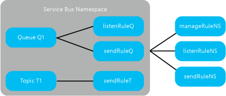

<properties 
    pageTitle="Access Signatur Authentifizierung für Dienstbus freigegeben | Microsoft Azure"
    description="Details zu SAS-Authentifizierung mit Dienstbus."
    services="service-bus"
    documentationCenter="na"
    authors="sethmanheim"
    manager="timlt"
    editor="" />
<tags 
    ms.service="service-bus"
    ms.devlang="na"
    ms.topic="article"
    ms.tgt_pltfrm="na"
    ms.workload="na"
    ms.date="10/02/2016"
    ms.author="sethm" />

# <a name="shared-access-signature-authentication-with-service-bus"></a>Access Signatur Authentifizierung für Dienstbus freigegeben

[Freigegebene Access Signatur (SAS)](service-bus-sas-overview.md) Authentifizierung ermöglicht Applikationen unter Verwendung einer Zugriffstaste so konfiguriert, dass auf den Namespace oder in der messaging Entität (Warteschlange oder Thema) denen bestimmte Rechte zugeordnet sind mit Dienst authentifiziert. Dieser Taste können dann ein Token SAS generieren, die Clients wiederum Dienstbus authentifizieren verwenden können.

SAS-ist Authentifizierung in Azure SDK, Version 2.0 und höher unterstützt. Weitere Informationen zu Dienstbus Authentifizierung finden Sie unter [Service Bus Authentifizierung und Autorisierung](service-bus-authentication-and-authorization.md).

## <a name="concepts"></a>Konzepte

SAS-Authentifizierung in Dienstbus umfasst die Konfiguration eines cryptographic Schlüssels mit zugeordneten Berechtigungen für eine Ressource Dienstbus. Clients beanspruchen Zugriff auf Dienstbus Ressourcen durch ein Token SAS präsentieren. Dieses Token besteht aus den Ressourcen-URI zugegriffen wird, und eine Ablauf mit dem konfigurierten Schlüssel signiert.

Sie können freigegebene Access Signatur Autorisierungsregeln Dienstbus [weiterleitet](service-bus-fundamentals-hybrid-solutions.md#relays), [Warteschlangen](service-bus-fundamentals-hybrid-solutions.md#queues), [Themen](service-bus-fundamentals-hybrid-solutions.md#topics)und [Hubs Ereignis](service-bus-fundamentals-hybrid-solutions.md#event-hubs)konfigurieren.

SAS Authentifizierung verwendet die folgenden Elemente:

- [Freigegebene Access Autorisierungsregel](https://msdn.microsoft.com/library/azure/microsoft.servicebus.messaging.sharedaccessauthorizationrule.aspx): A 256-Bit-cryptographic Primärschlüssel in Base64 Darstellung, einer optionalen sekundären Schlüssel und einen Namen und dazugehörige Rechte (eine Sammlung von *Abhören*, *Senden*oder *Verwalten* von Informationsrechten).

- [Freigegebene Access Signatur](https://msdn.microsoft.com/library/azure/microsoft.servicebus.sharedaccesssignaturetokenprovider.sharedaccesssignature.aspx) Token: mithilfe der HMAC-SHA256 einer Zeichenfolge Ressource aus der URI der Ressource, die zugegriffen werden kann und ein Ablauf, mit dem cryptographic Schlüssel generiert. Die Signatur und andere Elemente, die in den folgenden Abschnitten beschrieben werden in einer Zeichenfolge bilden das Token [SharedAccessSignature](https://msdn.microsoft.com/library/azure/microsoft.servicebus.sharedaccesssignaturetokenprovider.sharedaccesssignature.aspx) formatiert.

## <a name="configuration-for-shared-access-signature-authentication"></a>Konfiguration für Access-Signatur freigegebene Authentifizierung

Sie können die Regel [SharedAccessAuthorizationRule](https://msdn.microsoft.com/library/azure/microsoft.servicebus.messaging.sharedaccessauthorizationrule.aspx) auf Dienstbus Namespaces, Warteschlangen oder Themen konfigurieren. Konfigurieren eines [SharedAccessAuthorizationRule](https://msdn.microsoft.com/library/azure/microsoft.servicebus.messaging.sharedaccessauthorizationrule.aspx) auf ein Abonnement Dienstbus wird derzeit nicht unterstützt, jedoch können Sie Regeln, die so konfiguriert ist, klicken Sie auf einen Namespace oder Thema Sichern des Zugriffs auf Abonnements. Ein Arbeitsbeispiel, die diese Prozedur veranschaulicht, finden Sie unter der Stichprobe [mithilfe von freigegebenen Access Signatur (SAS) Authentifizierung mit Service Bus Abonnements](http://code.msdn.microsoft.com/Using-Shared-Access-e605b37c) .

Auf einem Dienstbus Namespace, Warteschlange oder das Thema kann maximal 12 solche Regeln konfiguriert werden. Regeln, die auf einen Namespace Dienstbus konfigurierten gelten für alle Personen, die in diesem Namespace.



In dieser Abbildung gilt die Autorisierung *ManageRuleNS*, *SendRuleNS*und *ListenRuleNS* , die Regeln für Warteschlange Q1 und Thema T1, gelten während *ListenRuleQ* und *SendRuleQ* gelten nur, wenn die Warteschlange Q1 und *SendRuleT* nur Thema T1.

Die wichtigsten Parameter ein [SharedAccessAuthorizationRule](https://msdn.microsoft.com/library/azure/microsoft.servicebus.messaging.sharedaccessauthorizationrule.aspx) werden wie folgt aus:

|Parameter|Beschreibung|
|---|---|
|*Schlüssel*|Eine Zeichenfolge, die Autorisierungsregel beschreibt.|
|*PrimaryKey*|Base64-codierte 256-Bit-Primärschlüssel für signieren und überprüfen das SAS Token.|
|*Sekundärer Schlüssel*|Ein base64-codierte 256-Bit-sekundären Schlüssel für das Signieren und überprüfen das SAS Token.|
|*AccessRights*|Eine Liste von Zugriffsrechten durch die Autorisierungsregel. Diese Rechte können eine Sammlung von Listen, senden und verwalten Berechtigungen sein.|

Wenn Sie ein Namespace Dienstbus bereitgestellt wird, ist eine [SharedAccessAuthorizationRule](https://msdn.microsoft.com/library/azure/microsoft.servicebus.messaging.sharedaccessauthorizationrule.aspx), mit der [Schlüssel](https://msdn.microsoft.com/library/azure/microsoft.servicebus.messaging.sharedaccessauthorizationrule.keyname.aspx) legen Sie auf **RootManageSharedAccessKey**, standardmäßig erstellt.

## <a name="regenerate-and-revoke-keys-for-shared-access-authorization-rules"></a>Neu zu generieren Sie und widerrufen Sie Schlüssel für die Autorisierung des freigegebenen Regeln

Es wird empfohlen, dass Sie die Schlüssel für das Objekt [SharedAccessAuthorizationRule](https://msdn.microsoft.com/library/azure/microsoft.servicebus.messaging.sharedaccessauthorizationrule.aspx) regelmäßig neu generieren. Applikationen sollte [PrimaryKey](https://msdn.microsoft.com/library/azure/microsoft.servicebus.messaging.sharedaccessauthorizationrule.primarykey.aspx) in der Regel ein Token SAS generieren verwenden. Wenn die Tasten neu erstellt, sollten Sie die [Sekundärer Schlüssel](https://msdn.microsoft.com/library/azure/microsoft.servicebus.messaging.sharedaccessauthorizationrule.secondarykey.aspx) mit dem alten Primärschlüssel ersetzen und generieren einen neuen Product Key als neue Primärschlüssel. So können Sie weiterhin verwenden Token für die Autorisierung, die mit dem alten Primärschlüssel ausgestellt wurden, und die noch nicht abgelaufen.

Wenn ein Schlüssel ist beschädigt, und Sie die Tasten widerrufen müssen, können Sie sowohl die [PrimaryKey](https://msdn.microsoft.com/library/azure/microsoft.servicebus.messaging.sharedaccessauthorizationrule.primarykey.aspx) und die [Sekundärer Schlüssel](https://msdn.microsoft.com/library/azure/microsoft.servicebus.messaging.sharedaccessauthorizationrule.secondarykey.aspx) von einer [SharedAccessAuthorizationRule](https://msdn.microsoft.com/library/azure/microsoft.servicebus.messaging.sharedaccessauthorizationrule.aspx), ersetzen sie durch neuen Schlüssel wiederherstellen. Dieses Verfahren bewirkt, dass alle mit dem alten Schlüssel signierte Token ungültig.

## <a name="generating-a-shared-access-signature-token"></a>Generieren einer freigegebenen Access Signatur token

Jeder Client, der den signierenden Tasten in der gemeinsamen Zugriff Autorisierungsregel angegebenen zugreifen kann das Token SAS generieren. Es wird wie folgt formatiert:

```
SharedAccessSignature sig=<signature-string>&se=<expiry>&skn=<keyName>&sr=<URL-encoded-resourceURI>
```

Die **Signatur** für das SAS Token wird mithilfe des HMAC-SHA256 Hashs einer Zeichenfolge in Zeichen mit der Eigenschaft [PrimaryKey](https://msdn.microsoft.com/library/azure/microsoft.servicebus.messaging.sharedaccessauthorizationrule.primarykey.aspx) einer Regel Autorisierung berechnet. Die Vorzeichen Zeichenfolge besteht aus einer Ressource URI und ein Ablauf, formatiert wie folgt:

```
StringToSign = <resourceURI> + "\n" + expiry;
```

Beachten Sie, dass die codierte URI-Ressource für diesen Vorgang verwendet werden sollen. Ressourcen-URI ist die vollständige URI der Ressource Dienstbus, die Zugriff in Anspruch genommen wird. Beispielsweise `http://<namespace>.servicebus.windows.net/<entityPath>` oder `sb://<namespace>.servicebus.windows.net/<entityPath>`; d. h., `http://contoso.servicebus.windows.net/contosoTopics/T1/Subscriptions/S3`.

Nach Ablauf wird als die Anzahl der Sekunden seit der Epoche 00:00:00 UTC auf 1. Januar 1970 dargestellt.

Die freigegebenen Autorisierungsregel zum Signieren verwendet, muss auf Einheit angegeben, indem Sie diesen URI oder eine hierarchische übergeordneten konfiguriert sein. Beispielsweise `http://contoso.servicebus.windows.net/contosoTopics/T1` oder `http://contoso.servicebus.windows.net` im vorherigen Beispiel.

Ein Token SAS gilt für alle Ressourcen, die unter der `<resourceURI>` in der Zeichenfolge in Zeichen verwendet werden.

Der [Schlüssel](https://msdn.microsoft.com/library/azure/microsoft.servicebus.messaging.sharedaccessauthorizationrule.keyname.aspx) im SAS Token bezieht sich auf **Schlüssel** der gemeinsamen Zugriff Autorisierungsregel verwendet, um das Token zu erzeugen.

Die *URL-codierte ResourceURI* muss der in der Zeichenfolge in Zeichen während der Berechnung der Signatur verwendete URI identisch sein. Sie sollten [Prozentzeichen codierten](https://msdn.microsoft.com/library/4fkewx0t.aspx).

## <a name="how-to-use-shared-access-signature-authentication-with-service-bus"></a>Verwenden von freigegebenen Access Signatur Authentifizierung mit Dienstbus

Die folgenden Szenarien enthalten Konfiguration von Autorisierungsregeln, die zweiten Generation SAS Token und Clientautorisierung.

Für ein vollständiges Arbeitsbeispiel einer Dienstbus-Anwendung, zeigt die Konfiguration und verwendet SAS Autorisierung, finden Sie unter [freigegebene Access Signatur Authentifizierung mit Dienstbus](http://code.msdn.microsoft.com/Shared-Access-Signature-0a88adf8). Eine verwandte Beispiel für das die Verwendung von SAS Autorisierungsregeln auf Namespaces oder Themen Dienstbus Abonnements gesichert konfiguriert ist hier verfügbar: [Verwenden von freigegebenen Access Signatur (SAS) Authentifizierung mit Service Bus Abonnements](http://code.msdn.microsoft.com/Using-Shared-Access-e605b37c).

## <a name="access-shared-access-authorization-rules-on-a-namespace"></a>Access Autorisierung des freigegebenen Regeln auf einen namespace

Operationen für Dienstbus Namespace-Stammverzeichnisses ist Zertifikatauthentifizierung erforderlich. Sie müssen ein Zertifikat Management für Ihr Abonnement Azure hochladen. Um ein Zertifikat Management hochladen möchten, klicken Sie im linken Bereich des [Azure klassischen Portal][]auf **Einstellungen** . Weitere Informationen zu Zertifikaten Azure Management finden Sie unter der [Azure Zertifikate (Übersicht)](../cloud-services/cloud-services-certs-create.md#what-are-management-certificates).

Der Endpunkt für den Zugriff auf freigegebene Access Autorisierungsregeln auf einen Namespace Dienstbus sieht wie folgt aus:

```
https://management.core.windows.net/{subscriptionId}/services/ServiceBus/namespaces/{namespace}/AuthorizationRules/
```

Führen Sie zum Erstellen eines Objekts [SharedAccessAuthorizationRule](https://msdn.microsoft.com/library/azure/microsoft.servicebus.messaging.sharedaccessauthorizationrule.aspx) auf einen Namespace Dienstbus einen Beitrag Vorgang auf diesen Endpunkt, wobei die Regelinformationen als JSON oder XML serialisiert. Beispiel:

```
// Base address for accessing authorization rules on a namespace
string baseAddress = @"https://management.core.windows.net/<subscriptionId>/services/ServiceBus/namespaces/<namespace>/AuthorizationRules/";

// Configure authorization rule with base64-encoded 256-bit key and Send rights
var sendRule = new SharedAccessAuthorizationRule("contosoSendAll",
    SharedAccessAuthorizationRule.GenerateRandomKey(),
    new[] { AccessRights.Send });

// Operations on the Service Bus namespace root require certificate authentication.
WebRequestHandler handler = new WebRequestHandler
{
    ClientCertificateOptions = ClientCertificateOption.Manual
};
// Access the management certificate by subject name
handler.ClientCertificates.Add(GetCertificate(<certificateSN>));

HttpClient httpClient = new HttpClient(handler)
{
    BaseAddress = new Uri(baseAddress)
};
httpClient.DefaultRequestHeaders.Accept.Add(
    new MediaTypeWithQualityHeaderValue("application/json"));
httpClient.DefaultRequestHeaders.Add("x-ms-version", "2015-01-01");

// Execute a POST operation on the baseAddress above to create an auth rule
var postResult = httpClient.PostAsJsonAsync("", sendRule).Result;
```

In ähnlicher Weise, eine GET-Operation für den Endpunkt mit die Autorisierungsregeln, die so konfiguriert ist, klicken Sie auf den Namespace lesen.

Aktualisieren oder Löschen einer bestimmten Autorisierungsregel, verwenden Sie den folgenden Endpunkt aus:

```
https://management.core.windows.net/{subscriptionId}/services/ServiceBus/namespaces/{namespace}/AuthorizationRules/{KeyName}
```

## <a name="accessing-shared-access-authorization-rules-on-an-entity"></a>Zugreifen auf die Autorisierung des freigegebenen Regeln auf einem Element

Sie können ein [Microsoft.ServiceBus.Messaging.SharedAccessAuthorizationRule](https://msdn.microsoft.com/library/azure/microsoft.servicebus.messaging.sharedaccessauthorizationrule.aspx) Objekt so konfiguriert, dass auf einem Dienstbus Warteschlange oder ein Thema über die Sammlung [AuthorizationRules](https://msdn.microsoft.com/library/azure/microsoft.servicebus.messaging.authorizationrules.aspx) in den entsprechenden [QueueDescription](https://msdn.microsoft.com/library/azure/microsoft.servicebus.messaging.queuedescription.aspx), [TopicDescription](https://msdn.microsoft.com/library/azure/microsoft.servicebus.messaging.topicdescription.aspx)oder [NotificationHubDescription](https://msdn.microsoft.com/library/azure/microsoft.servicebus.notifications.notificationhubdescription.aspx) Objekte zugreifen.

Im folgende Code veranschaulicht, wie Autorisierungsregeln für eine Warteschlange hinzugefügt werden.

```
// Create an instance of NamespaceManager for the operation
NamespaceManager nsm = NamespaceManager.CreateFromConnectionString( 
    <connectionString> );
QueueDescription qd = new QueueDescription( <qPath> );

// Create a rule with send rights with keyName as "contosoQSendKey"
// and add it to the queue description.
qd.Authorization.Add(new SharedAccessAuthorizationRule("contosoSendKey", 
    SharedAccessAuthorizationRule.GenerateRandomKey(), 
    new[] { AccessRights.Send }));

// Create a rule with listen rights with keyName as "contosoQListenKey"
// and add it to the queue description.
qd.Authorization.Add(new SharedAccessAuthorizationRule("contosoQListenKey",
    SharedAccessAuthorizationRule.GenerateRandomKey(),
    new[] { AccessRights.Listen }));

// Create a rule with manage rights with keyName as "contosoQManageKey"
// and add it to the queue description.
// A rule with manage rights must also have send and receive rights.
qd.Authorization.Add(new SharedAccessAuthorizationRule("contosoQManageKey",
    SharedAccessAuthorizationRule.GenerateRandomKey(),
    new[] {AccessRights.Manage, AccessRights.Listen, AccessRights.Send }));

// Create the queue.
nsm.CreateQueue(qd);
```

## <a name="using-shared-access-signature-authorization"></a>Verwenden von freigegebenen Access Signatur Autorisierung

Applikationen mit Azure .NET SDK mit den Dienst Bus .NET Bibliotheken können SAS Autorisierung über die [SharedAccessSignatureTokenProvider](https://msdn.microsoft.com/library/azure/microsoft.servicebus.sharedaccesssignaturetokenprovider.aspx) -Klasse. Der folgende Code veranschaulicht die Verwendung des Sicherheitstokens Anbieters zum Senden von Nachrichten an eine Warteschlange Dienstbus.

```
Uri runtimeUri = ServiceBusEnvironment.CreateServiceUri("sb", 
    <yourServiceNamespace>, string.Empty);
MessagingFactory mf = MessagingFactory.Create(runtimeUri, 
    TokenProvider.CreateSharedAccessSignatureTokenProvider(keyName, key));
QueueClient sendClient = mf.CreateQueueClient(qPath);

//Sending hello message to queue.
BrokeredMessage helloMessage = new BrokeredMessage("Hello, Service Bus!");
helloMessage.MessageId = "SAS-Sample-Message";
sendClient.Send(helloMessage);
```

Applikationen können Sie auch SAS für die Authentifizierung mithilfe einer Verbindungszeichenfolge SAS in Methoden, die Verbindungszeichenfolgen zu akzeptieren.

Beachten Sie, dass SAS Autorisierung zur Verwendung mit Dienstbus Relays Sie SAS Tasten, die so konfiguriert ist, klicken Sie auf den Namespace Dienstbus verwenden können. Wenn Sie ein Relay explizit auf das Namespaceobjekt ([NamespaceManager](https://msdn.microsoft.com/library/azure/microsoft.servicebus.namespacemanager.aspx) mit einem [RelayDescription](https://msdn.microsoft.com/library/azure/microsoft.servicebus.messaging.relaydescription.aspx)) zu erstellen, können Sie die SAS Regeln nur für die Weiterleitung festlegen. Um SAS Autorisierung mit Dienstbus Abonnements verwenden, können Sie SAS-Taste zu einem Thema oder einen Namespace Dienstbus konfiguriert.

## <a name="rights-required-for-service-bus-operations"></a>Für die Vorgänge Dienstbus erforderliche Berechtigungen

Die folgende Tabelle zeigt die Zugriffsrechte für verschiedene Operationen Dienstbus Ressourcen erforderlich.

|Vorgang|Anfordern erforderlich|Beanspruchen Umfang|
|---|---|---|
|**Namespace**|||
|Konfigurieren der Autorisierungsregel auf einen namespace|Verwalten|Alle Namespaces Adresse|
|**Service-Registrierung**|||
|Richtlinien für Private auflisten|Verwalten|Alle Namespaces Adresse|
|Relay|||
|Klicken Sie auf einen Namespace überwacht werden soll|Abhören|Alle Namespaces Adresse|
|Senden von Nachrichten an eine Zuhörer bei einem namespace|Senden|Alle Namespaces Adresse|
|**Warteschlange**|||
|Erstellen einer Warteschlange|Verwalten|Alle Namespaces Adresse|
|Löschen einer Warteschlange|Verwalten|Eine gültige Warteschlangenadresse|
|Warteschlangen auflisten|Verwalten|/$ Ressourcen/Warteschlangen|
|Beschreibung der Warteschlange abrufen|Senden oder verwalten können.|Eine gültige Warteschlangenadresse|
|Autorisierungsregel für eine Warteschlange konfigurieren|Verwalten|Eine gültige Warteschlangenadresse|
|In der Warteschlange senden|Senden|Eine gültige Warteschlangenadresse|
|Empfangen von Nachrichten aus einer Warteschlange|Abhören|Eine gültige Warteschlangenadresse|
|Abbrechen Sie oder abgeschlossen Sie Nachrichten, nachdem Sie die Nachricht in anheften-Sperrmodus empfängt.|Abhören|Eine gültige Warteschlangenadresse|
|Zurückstellen einer Nachricht Aufgabenergebnisse|Abhören|Eine gültige Warteschlangenadresse|
|Für unzustellbare Nachrichten einer Nachricht|Abhören|Einer beliebigen gültigen Warteschlangenadresse|
|Erhalten einer Nachricht Warteschlange Sitzung zugeordneten Zustands|Abhören|Einer beliebigen gültigen Warteschlangenadresse|
|Legen Sie den Status einer Nachricht Warteschlange Sitzung zugeordnet|Abhören|Eine gültige Warteschlangenadresse|
|**Thema**|||
|Erstellen Sie ein Thema|Verwalten|Alle Namespaces Adresse|
|Löschen eines Themas|Verwalten|Gültige Thema Adressen|
|Themen auflisten|Verwalten|/$ Ressourcen/Themen|
|Abrufen der Beschreibung Thema|Senden oder verwalten können.|Gültige Thema Adressen|
|Konfigurieren von Autorisierungsregel für ein Thema|Verwalten|Gültige Thema Adressen|
|Mit dem Thema senden|Senden|Gültige Thema Adressen|
|**Abonnement**|||
|Erstellen Sie ein Abonnement|Verwalten|Alle Namespaces Adresse|
|Abonnement löschen|Verwalten|.. /myTopic/Subscriptions/mySubscription|
|Auflisten von Abonnements|Verwalten|.. / MyTopic/Abonnements|
|Beschreibung des Abonnements erhalten|Abhören oder verwalten können.|.. /myTopic/Subscriptions/mySubscription|
|Abbrechen oder Nachrichten nach dem Empfangen der Nachricht in anheften-Sperrmodus durchführen|Abhören|.. /myTopic/Subscriptions/mySubscription|
|Zurückstellen einer Nachricht Aufgabenergebnisse|Abhören|.. /myTopic/Subscriptions/mySubscription|
|Für unzustellbare Nachrichten einer Nachricht|Abhören|.. /myTopic/Subscriptions/mySubscription|
|Ruft den Status einer Sitzung Thema zugeordnet|Abhören|.. /myTopic/Subscriptions/mySubscription|
|Legen Sie den Status einer Sitzung Thema zugeordnet|Abhören|.. /myTopic/Subscriptions/mySubscription|
|**Regel**|||
|Erstellen einer Regel|Verwalten|.. /myTopic/Subscriptions/mySubscription|
|Löschen einer Regel|Verwalten|.. /myTopic/Subscriptions/mySubscription|
|Auflisten von Regeln|Abhören oder verwalten können.|.. /myTopic/Subscriptions/mySubscription/Rules|
|**Benachrichtigung Hubs**|||
|Erstellen eines Benachrichtigung Hubs|Verwalten|Alle Namespaces Adresse|
|Erstellen Sie oder aktualisieren Sie der Registrierung für ein aktives Gerät|Abhören oder verwalten|.. /notificationHub/Kategorien / {Kategorie} / Registrierungen|
|Aktualisieren von PNS Informationen|Abhören oder verwalten|.. /notificationHub/Kategorien / {Kategorie} / Registrierungen/updatepnshandle|
|Senden Sie an eine Benachrichtigung hub|Senden|.. / NotificationHub/Nachrichten|

## <a name="next-steps"></a>Nächste Schritte

Eine Übersicht über SA-in Dienstbus finden Sie unter [Freigegebene Access Signaturen](service-bus-sas-overview.md).

Weitere Hintergrundinformationen zur Dienstbus-Authentifizierung finden Sie unter [Dienstbus Authentifizierung und Autorisierung](service-bus-authentication-and-authorization.md) .

[Azure klassischen-portal]: http://manage.windowsazure.com