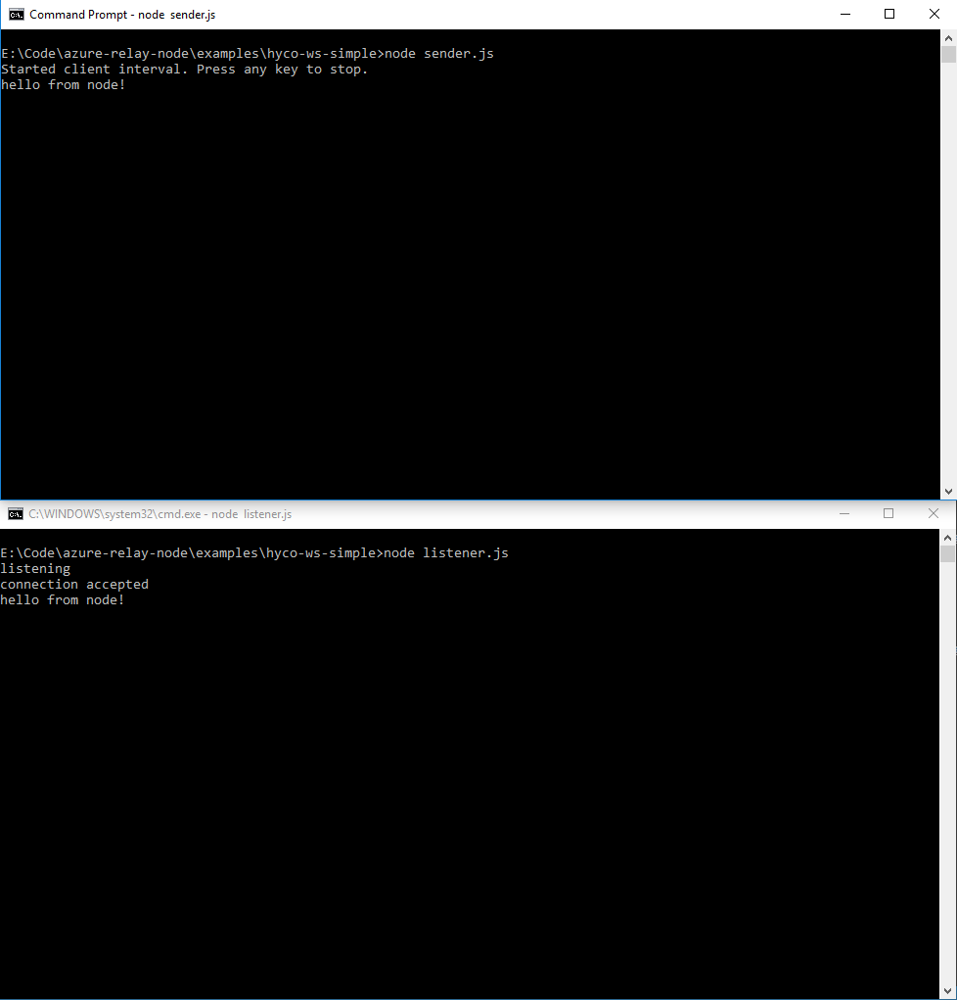

<properties
    pageTitle="Erste Schritte mit Relay Hybrid Verbindungen | Microsoft Azure"
    description="So schreiben Sie eine Knoten Console-Anwendung für Hybrid-Verbindungen"
    services="service-bus"
    documentationCenter="node"
    authors="jtaubensee"
    manager="timlt"
    editor=""/>

<tags
    ms.service="service-bus"
    ms.devlang="tbd"
    ms.topic="hero-article"
    ms.tgt_pltfrm="node"
    ms.workload="na"
    ms.date="10/28/2016"
    ms.author="jotaub"/>

# Erste Schritte mit Relay Hybrid Verbindungen

[AZURE.INCLUDE [relay-selector-hybrid-connections](../../includes/relay-selector-hybrid-connections.md)]

## Was realisiert werden sollen

Da Hybrid Verbindungen gleichzeitig als Client und Server-Komponente erforderlich ist, erstellen wir zwei Console-Anwendungen in diesem Lernprogramm. Hier sind die Schritte aus:

1. Erstellen Sie einen Relay Namespace, mit dem Azure-Portal an.

2. Erstellen einer in Verbindung mit dem Azure-Portal an.

3. Schreiben Sie einem Server Console-Anwendung Nachrichten empfangen werden sollen.

4. Schreiben eines Clients Console-Anwendung zum Senden von Nachrichten an.

## Erforderliche Komponenten

1. [Node.js](https://nodejs.org/en/) (in diesem Beispiel wird Knoten 7.0 verwendet).

2. Ein Azure-Abonnement.

[AZURE.INCLUDE [create-account-note](../../includes/create-account-note.md)]

## 1. erstellen Sie 1. einen Namespace mit dem Azure-portal

Wenn Sie bereits einen Relay Namespace erstellt haben, wechseln Sie zu im Abschnitt [Erstellen einer Verbindung Hybrid mithilfe des Azure-Portals](#2-create-a-hybrid-connection-using-the-azure-portal) .

[AZURE.INCLUDE [relay-create-namespace-portal](../../includes/relay-create-namespace-portal.md)]

## 2. erstellen Sie eine in Verbindung mit dem Azure-portal

Wenn Sie bereits eine Hybrid Verbindung erstellt haben, wechseln Sie zu Abschnitt [Server-Anwendung erstellen](#3-create-a-server-application-listener) .

[AZURE.INCLUDE [relay-create-hybrid-connection-portal](../../includes/relay-create-hybrid-connection-portal.md)]

## 3 Erstellen Sie 3 eine Server-Anwendung (Zuhörer)

Um Abhören und Empfangen von Nachrichten aus dem Relay werden wir eine Node.js Console-Anwendung schreiben.

[AZURE.INCLUDE [relay-hybrid-connections-dotnet-get-started-server](../../includes/relay-hybrid-connections-node-get-started-server.md)]

## 4 Erstellen Sie 4 eine Clientanwendung (Absender)

Zum Senden von Nachrichten an das Relay werden wir eine Node.js Console-Anwendung schreiben.

[AZURE.INCLUDE [relay-hybrid-connections-dotnet-get-started-client](../../includes/relay-hybrid-connections-node-get-started-client.md)]

## 5 führen Sie 5 die Anwendung

1. Führen Sie die Server-Anwendung.

2. Führen Sie die Clientanwendung, und geben Sie Text.

3. Stellen Sie sicher, dass die Server-Anwendung Konsole den Text gibt, der in der Clientanwendung eingegeben wurde.

Herzlichen Glückwunsch, Sie haben eine End-to-End-Hybrid Verbindungen Anwendung erstellt.

## Nächste Schritte:

- [Relay häufig gestellte Fragen](relay-faq.md)
- [Erstellen Sie einen namespace](relay-create-namespace-portal.md)
- [Erste Schritte mit .NET](relay-hybrid-connections-dotnet-get-started.md)
- [Erste Schritte mit Knoten](relay-hybrid-connections-node-get-started.md)