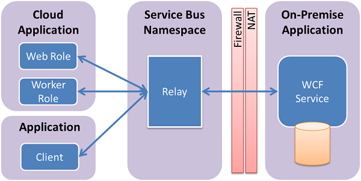

<properties
    pageTitle="So verwenden Sie das Relay Dienstbus mit .NET | Microsoft Azure"
    description="Erfahren Sie, wie den Azure-Dienstbus Relay-Dienst verwenden, um zwei Clientanwendungen gehostet an unterschiedlichen Standorten eine Verbindung herstellen."
    services="service-bus"
    documentationCenter=".net"
    authors="sethmanheim"
    manager="timlt"
    editor=""/>

<tags
    ms.service="service-bus"
    ms.workload="na"
    ms.tgt_pltfrm="na"
    ms.devlang="dotnet"
    ms.topic="article"
    ms.date="09/16/2016"
    ms.author="sethm"/>


# <a name="how-to-use-the-azure-service-bus-relay-service"></a>So verwenden Sie den Relaydienst Azure-Dienstbus

Dieser Artikel beschreibt, wie den Dienstbus Relay Service verwendet. Die Beispiele sind in c# geschrieben und Windows Communication Foundation (WCF) API Erweiterungen innerhalb der Dienstbus-Assemblys verwenden. Weitere Informationen zu den Dienstbus Relay finden Sie unter Übersicht über die [messaging Dienstbus weitergeleitet](service-bus-relay-overview.md) .

[AZURE.INCLUDE [create-account-note](../../includes/create-account-note.md)]

## <a name="what-is-the-service-bus-relay"></a>Was ist das Relay Dienstbus?

Der Dienst [Dienstbus *Relay* ](service-bus-relay-overview.md) können Sie Hybrid Applications erstellen, die in einer Azure Datacenter und in Ihrer eigenen lokalen Enterprise-Umgebung ausgeführt werden. Das Relay Dienstbus erleichtert dies ermöglicht es Ihnen sicher Windows Communication Foundation (WCF)-Dienste verfügbar machen, die in einem Netzwerk Ihres Unternehmens Enterprise für die öffentliche Cloud befinden, ohne eine Firewall-Verbindung zu öffnen, oder Einfluss Änderungen an einer Infrastruktur Unternehmensnetzwerk werden müssen.



Dienstbus Relay ermöglicht das Hosten von WCF-Diensten in Ihrer vorhandenen Enterprise-Umgebung. Sie können dann delegieren, warten auf eingehende Sitzungen und Besprechungsanfragen auf diese WCF-Dienste zum Dienst Dienstbus in Azure ausgeführt. So können Sie diese Dienste in Azure ausgeführten Anwendungscode oder mobilen Arbeitskräften oder extranet Partner-Umgebungen verfügbar zu machen. Dienstbus ermöglicht es Ihnen sichere Weise steuern, wer die folgenden Dienste auf einer abgestimmte Ebene zugegriffen werden kann. Es ermöglicht das leistungsfähige und sicheren Anwendungsfunktionalität und Daten von Ihrem vorhandenen Enterprise-Lösung verfügbar zu machen und zu nutzen, aus der Cloud.

In diesem Artikel veranschaulicht, wie das Relay Dienstbus zum Erstellen eines WCF-Webdiensts, die mit einer TCP-Kanal Bindung, die eine sichere Konversation zwischen zwei Parteien implementiert verfügbar gemacht werden.

## <a name="create-a-service-namespace"></a>Erstellen Sie einen Namespace service

Um mit der Dienstbus Relay in Azure zu beginnen, müssen Sie zuerst einen Namespace erstellen. Ein Namespace stellt einen Bereiche Container zum Adressieren Dienstbus Ressourcen innerhalb Ihrer Anwendung bereit.

So erstellen Sie einen Namespace service

[AZURE.INCLUDE [service-bus-create-namespace-portal](../../includes/service-bus-create-namespace-portal.md)]

## <a name="get-the-service-bus-nuget-package"></a>Abrufen des Dienst Bus NuGet-Pakets

Der [Dienst Bus NuGet-Paket](https://www.nuget.org/packages/WindowsAzure.ServiceBus) ist die einfachste Möglichkeit, die Bus-API abzurufenden und so konfigurieren Sie die Anwendung mit allen die Abhängigkeiten Dienstbus. Um die NuGet-Paket in Ihrem Projekt zu installieren, führen Sie folgende Schritte aus:

1.  Klicken Sie im Explorer-Lösung mit der rechten Maustaste **Verweise**und dann auf **NuGet-Pakete verwalten**.
2.  Suchen Sie nach "Dienstbus", und wählen Sie das Element **Microsoft Azure-Dienstbus** . Klicken Sie auf **Installieren** , um die Installation durchzuführen, und dann schließen Sie das Dialogfeld folgende:

    

## <a name="use-service-bus-to-expose-and-consume-a-soap-web-service-with-tcp"></a>Verwenden von Dienstbus verfügbar gemacht und einen SOAP-Webdienst mit TCP nutzen

Um einen vorhandenen SOAP WCF-Webdienst für die externen Ernährung bereitzustellen, müssen Sie den Dienst Bindungen und Adressen ändern. Diese Änderungen auf Ihre Konfigurationsdatei erfordern möglicherweise, oder Ändern von Code, je nachdem wie Sie einrichten und Ihre WCF-Dienste konfiguriert haben könnten erfordert. Beachten Sie, dass WCF ermöglicht es, dass Sie mehrere Netzwerkendpunkte über den gleichen Dienst, besitzen, damit die vorhandenen internen Endpunkte beim Hinzufügen von Dienstbus Endpunkte für den externen Zugriff zur gleichen Zeit aufbewahrt werden können.

In dieser Aufgabe Sie erstellen ein einfaches WCF-Diensts und Hinzufügen einer Dienstbus Zuhörer darauf. In dieser Übung wird davon ausgegangen mit Visual Studio vertraut, und können daher nicht über alle Details zum Erstellen eines Projekts von durchlaufen. Schwerpunkt sie stattdessen den Code ein.

Gehen Sie bevor Sie beginnen folgende Schritte aus folgendermaßen vor, um Ihre Umgebung einzurichten:

1.  Erstellen Sie in Visual Studio eine, die zwei Projekte: "Client" und "Service", in die Lösung enthält.
2.  Hinzufügen des Microsoft Azure Service Bus NuGet-Pakets an beide Projekte. Dieses Paket fügt alle die notwendigen Verweise auf Ihren Projekten hinzu.

### <a name="how-to-create-the-service"></a>So erstellen Sie den Dienst

Erstellen Sie zuerst den Dienst selbst. Alle WCF-Webdienst besteht aus mindestens drei unterschiedlichen Teilen:

-   Definition eines Vertrags, die beschreibt, welche Nachrichten ausgetauscht werden, und welche Vorgänge sind, aufgerufen werden.
-   Implementierung der genannten Vertrag.
-   Host, der WCF-Webdienst hostet und macht mehrere Endpunkte verfügbar.

In diesem Abschnitt die Codebeispielen Adresse jede dieser Komponenten.

Der Vertrag definiert die einem Vorgang, `AddNumbers`, die zwei Zahlen addiert und gibt als Ergebnis zurück. Die `IProblemSolverChannel` Schnittstelle kann der Client die Proxy Lebensdauer einfacher zu verwalten. Erstellen eine solche Schnittstelle gilt als bewährte Methode. Es ist eine gute Idee, dieser Vertragsdefinition in einer separaten Datei setzen, damit dieser Datei aus Ihrer sowohl "Client" und "Service" Projekten verwiesen werden kann, aber Sie können auch den Code in beide Projekte kopieren.

```
using System.ServiceModel;

[ServiceContract(Namespace = "urn:ps")]
interface IProblemSolver
{
    [OperationContract]
    int AddNumbers(int a, int b);
}

interface IProblemSolverChannel : IProblemSolver, IClientChannel {}
```

Mit den Vertrag angeordnet werden soll ist die Implementierung einfach.

```
class ProblemSolver : IProblemSolver
{
    public int AddNumbers(int a, int b)
    {
        return a + b;
    }
}
```

### <a name="configure-a-service-host-programmatically"></a>Konfigurieren Sie einen Diensthost programmgesteuert

Mit den Vertrag und die Implementierung direkte können Sie jetzt den Dienst hosten. Gehostet tritt innerhalb einer [System.ServiceModel.ServiceHost](https://msdn.microsoft.com/library/azure/system.servicemodel.servicehost.aspx) -Objekt, das sorgt dafür, dass Instanzen des Diensts verwalten und hostet die Endpunkte, die Nachrichten empfangen werden. Im folgende Code konfiguriert den Dienst mit einer regulären lokalen Endpunkt und einen Endpunkt Dienstbus Erläutern Sie die Darstellung, nebeneinander von internen und externen Endpunkten an. Ersetzen Sie die Zeichenfolge *Namespace* mit Ihrem Namespacenamen und *YourKey* mit der SAS-Taste, die Sie im vorherigen Schritt Setup für Ihren Kunden.

```
ServiceHost sh = new ServiceHost(typeof(ProblemSolver));

sh.AddServiceEndpoint(
   typeof (IProblemSolver), new NetTcpBinding(),
   "net.tcp://localhost:9358/solver");

sh.AddServiceEndpoint(
   typeof(IProblemSolver), new NetTcpRelayBinding(),
   ServiceBusEnvironment.CreateServiceUri("sb", "namespace", "solver"))
    .Behaviors.Add(new TransportClientEndpointBehavior {
          TokenProvider = TokenProvider.CreateSharedAccessSignatureTokenProvider("RootManageSharedAccessKey", "<yourKey>")});

sh.Open();

Console.WriteLine("Press ENTER to close");
Console.ReadLine();

sh.Close();
```

Im Beispiel erstellen Sie zwei Endpunkte, die auf derselben Vertrag Implementierung befinden. Eine lokale und eine bis Dienstbus Erwarteter ist. Die wichtigsten Unterschiede zwischen den beiden sind die Bindungen; [NetTcpBinding](https://msdn.microsoft.com/library/azure/system.servicemodel.nettcpbinding.aspx) für der lokalen Version und [NetTcpRelayBinding](https://msdn.microsoft.com/library/azure/microsoft.servicebus.nettcprelaybinding.aspx) für den Endpunkt Dienstbus und die Adressen. Der lokale Endpunkt verfügt über eine lokale Netzwerkadresse mit einem distinct Port. Der Endpunkt Dienstbus verfügt über eine Endpunktadresse zusammengestellt, die Zeichenfolge `sb`, Ihren Namespacenamen und den Pfad "Solver". Das Ergebnis ist der URI `sb://[serviceNamespace].servicebus.windows.net/solver`, den Endpunkt als einen Dienst Bus TCP-Endpunkt einen vollqualifizierten externen DNS-Namen zu identifizieren. Setzen Sie den Code, ersetzen den Platzhalter in der `Main` Funktion der **Service** -Anwendung, haben Sie einen funktionsübergreifendes Dienst. Wenn Sie den Dienst ausschließlich auf Dienstbus anhören möchten, entfernen Sie die lokale Endpunkt Deklaration.

### <a name="configure-a-service-host-in-the-appconfig-file"></a>Konfigurieren von einem Diensthost in der App

Sie können auch mithilfe der App Host konfigurieren. Im nächsten Beispiel wird der Dienst hosten von Code in diesem Fall angezeigt.

```
ServiceHost sh = new ServiceHost(typeof(ProblemSolver));
sh.Open();
Console.WriteLine("Press ENTER to close");
Console.ReadLine();
sh.Close();
```

Die Endpunktdefinitionen in der App verschieben. NuGet-Paket hat einen Bereich von Definitionen in der App, die die erforderliche Konfiguration Erweiterungen für Dienstbus sind bereits hinzugefügt. Im folgende Beispiel, also die genaue Entsprechung des vorherigen Code sollte direkt unter dem Element **system.serviceModel** angezeigt werden. In diesem Codebeispiel wird davon ausgegangen, dass Ihre Namespace des Projekts C#- **Dienst**heißt.
Ersetzen Sie die Platzhalter mit Ihrem Dienstbus Dienstnamespace und SAS-Taste.

```
<services>
    <service name="Service.ProblemSolver">
        <endpoint contract="Service.IProblemSolver"
                  binding="netTcpBinding"
                  address="net.tcp://localhost:9358/solver"/>
        <endpoint contract="Service.IProblemSolver"
                  binding="netTcpRelayBinding"
                  address="sb://namespace.servicebus.windows.net/solver"
                  behaviorConfiguration="sbTokenProvider"/>
    </service>
</services>
<behaviors>
    <endpointBehaviors>
        <behavior name="sbTokenProvider">
            <transportClientEndpointBehavior>
                <tokenProvider>
                    <sharedAccessSignature keyName="RootManageSharedAccessKey" key="<yourKey>" />
                </tokenProvider>
            </transportClientEndpointBehavior>
        </behavior>
    </endpointBehaviors>
</behaviors>
```

Nachdem Sie diese Änderungen vorgenommen haben, Starten des Diensts wie zuvor, jedoch mit zwei live Endpunkten: von einem lokalen und einem überwacht in der Cloud.

### <a name="create-the-client"></a>Erstellen Sie den Kunden

#### <a name="configure-a-client-programmatically"></a>Konfigurieren eines Clients programmgesteuert

Wenn Sie den Dienst nutzen, können Sie einen WCF-Client mithilfe eines Objekts [ChannelFactory](https://msdn.microsoft.com/library/system.servicemodel.channelfactory.aspx) erstellen. Dienstbus verwendet eine Token-basierte implementieren Modell mit SAS. Die [TokenProvider](https://msdn.microsoft.com/library/azure/microsoft.servicebus.tokenprovider.aspx) -Klasse stellt eine Sicherheitstokenanbieter mit integrierten Factorymethoden, die einige bekannte token Anbieter zurückgeben. Im folgende Beispiel wird die Methode [CreateSharedAccessSignatureTokenProvider](https://msdn.microsoft.com/library/azure/microsoft.servicebus.tokenprovider.createsharedaccesssignaturetokenprovider.aspx) den Erwerb von entsprechenden SAS Token verarbeitet verwendet. Den Namen und Schlüssel sind diejenigen aus dem Portal für Ihren Kunden, wie im vorherigen Abschnitt beschrieben.

Zunächst verweisen, oder kopieren Sie die `IProblemSolver` Vertrag Code vom Dienst in Ihrem Clientprojekt.

Klicken Sie dann ersetzen Sie den Code in der `Main` Methode des Clients, ersetzen den Platzhaltertext erneut mit Ihrem Dienstbus Namespace und SAS-Taste.

```
var cf = new ChannelFactory<IProblemSolverChannel>(
    new NetTcpRelayBinding(),
    new EndpointAddress(ServiceBusEnvironment.CreateServiceUri("sb", "namespace", "solver")));

cf.Endpoint.Behaviors.Add(new TransportClientEndpointBehavior
            { TokenProvider = TokenProvider.CreateSharedAccessSignatureTokenProvider("RootManageSharedAccessKey","<yourKey>") });

using (var ch = cf.CreateChannel())
{
    Console.WriteLine(ch.AddNumbers(4, 5));
}
```

Können Sie jetzt den Client und den Dienst, führen sie die (führen Sie zuerst den Dienst) erstellen, und der Client Ruft den Dienst und **9**druckt. Sie können Client und Server auf unterschiedlichen Computern ausführen, auch über Netzwerke, und die Kommunikation funktionieren weiterhin. Client-Code kann auch in der Cloud oder lokal ausgeführt werden.

#### <a name="configure-a-client-in-the-appconfig-file"></a>Konfigurieren eines Clients in der App

Mit dem folgende Code veranschaulicht, wie den Client mithilfe der App zu konfigurieren.

```
var cf = new ChannelFactory<IProblemSolverChannel>("solver");
using (var ch = cf.CreateChannel())
{
    Console.WriteLine(ch.AddNumbers(4, 5));
}
```

Die Endpunktdefinitionen in der App verschieben. Im folgende Beispiel, das den zuvor aufgeführten Code identisch ist, sollte direkt unter dem Element **system.serviceModel** angezeigt werden. Hier müssen wie zuvor, Sie die Platzhalter mit Ihrem Dienstbus Namespace und SAS-Taste ersetzen.

```
<client>
    <endpoint name="solver" contract="Service.IProblemSolver"
              binding="netTcpRelayBinding"
              address="sb://namespace.servicebus.windows.net/solver"
              behaviorConfiguration="sbTokenProvider"/>
</client>
<behaviors>
    <endpointBehaviors>
        <behavior name="sbTokenProvider">
            <transportClientEndpointBehavior>
                <tokenProvider>
                    <sharedAccessSignature keyName="RootManageSharedAccessKey" key="<yourKey>" />
                </tokenProvider>
            </transportClientEndpointBehavior>
        </behavior>
    </endpointBehaviors>
</behaviors>
```

## <a name="next-steps"></a>Nächste Schritte

Die Grundlagen des Diensts Relay Dienstbus bearbeitet haben, führen Sie die folgenden Links, um weitere Informationen.

- [Dienstbus weitergeleitet messaging (Übersicht)](service-bus-relay-overview.md)
- [Azure Service Bus-Architektur im Überblick](../service-bus-messaging/service-bus-fundamentals-hybrid-solutions.md)
- Herunterladen von Dienstbus Beispiele aus [Azure Beispiele][] oder finden Sie unter den [Überblick Dienstbus Beispiele][].

  [Shared Access Signature Authentication with Service Bus]: ../service-bus-messaging/service-bus-shared-access-signature-authentication.md
  [Azure Beispiele]: https://code.msdn.microsoft.com/site/search?query=service%20bus&f%5B0%5D.Value=service%20bus&f%5B0%5D.Type=SearchText&ac=2
  [Übersicht über Dienstbus Beispiele]: ../service-bus-messaging/service-bus-samples.md