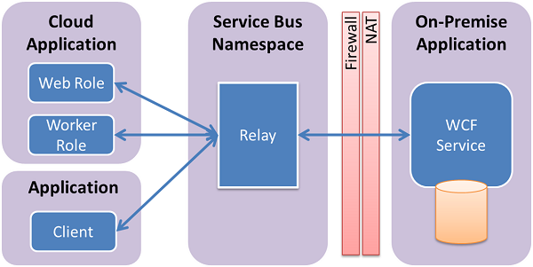

<properties
    pageTitle="Übersicht über die Dienstbus Relay | Microsoft Azure"
    description="Übersicht über die Dienstbus Relay."
    services="service-bus"
    documentationCenter=".net"
    authors="sethmanheim"
    manager="timlt"
    editor=""/>

<tags
    ms.service="service-bus"
    ms.workload="na"
    ms.tgt_pltfrm="na"
    ms.devlang="multiple"
    ms.topic="get-started-article"
    ms.date="09/01/2016"
    ms.author="sethm"/>

# Übersicht über Dienstbus relay

Eine wichtige Komponente des Dienstbus ist ein zentrales (aber hochgradig Lastenausgleich) *Relay* -Dienst, der ermöglicht es Ihnen, Hybrid Applications erstellen, die in einer Azure Datacenter und in Ihrer eigenen lokalen Enterprise-Umgebung ausgeführt werden.  Das Relay Dienstbus unterstützt eine Vielzahl von anderen Transportprotokolle und Standards-Webdiensten. Dies umfasst SOAP, ws-*, und sogar REST. Der Relay Service erleichtert Ihre Hybrid Applications ermöglicht es Ihnen sicher Windows Communication Foundation (WCF)-Dienste verfügbar machen, die befinden sich in einem Netzwerk Ihres Unternehmens Enterprise für die öffentliche Cloud, ohne eine Firewall-Verbindung zu öffnen oder muss eine Infrastruktur Unternehmensnetzwerk Einfluss geändert werden. 

Der Relaydienst unterstützt herkömmliche unidirektionale messaging, Anforderung/Antwort messaging und Peer-to-Peer-messaging. Darüber hinaus unterstützt Verteilung von Ereignissen im Internet-Gültigkeitsbereich Szenarien veröffentlichen/abonnieren und bidirektionale Socketkommunikation für höhere Punkt Effizienz aktivieren. 

Im weitergeleitete messaging Muster ein lokalen Dienst an den Relaydienst über einen ausgehenden Port verbindet und ein Sockets bidirektionale Kommunikation verknüpft an eine bestimmte Rendezvous Adresse erstellt. Der Client kann dann mit dem lokalen Dienst durch Senden von Nachrichten an den Relaydienst verwendet die Adresse Rendezvous kommunizieren. Der Relay Service, klicken Sie dann "Nachrichten an den lokalen Dienst über bidirektionale Sockets bereits direkte leiten". Der Client benötigt eine direkte Verbindung mit dem lokalen Dienst nicht, ist es nicht erforderlich zu wissen, wo sich der Dienst befindet, und der lokalen Dienst benötigt keine eingehenden Ports in der Firewall geöffnet.

Sie einleiten die Verbindung zwischen Ihrem Dienst lokal und den Relaydienst mit einer Reihe von WCF "Relay" Bindungen. Hintergrundinformationen ordnen Sie die Relay Bindungen neue Transport Bindungselemente so ausgelegt, dass WCF-Kanal-Komponenten, die in der Cloud Dienstbus integriert werden soll. 

## Nächste Schritte

Details zu den Dienstbus Relay finden Sie unter den folgenden Themen.

- [Azure Service Bus-Architektur im Überblick](../service-bus-messaging/service-bus-fundamentals-hybrid-solutions.md)
- [So verwenden Sie den Dienst Bus Relaydienst](service-bus-dotnet-how-to-use-relay.md)

 