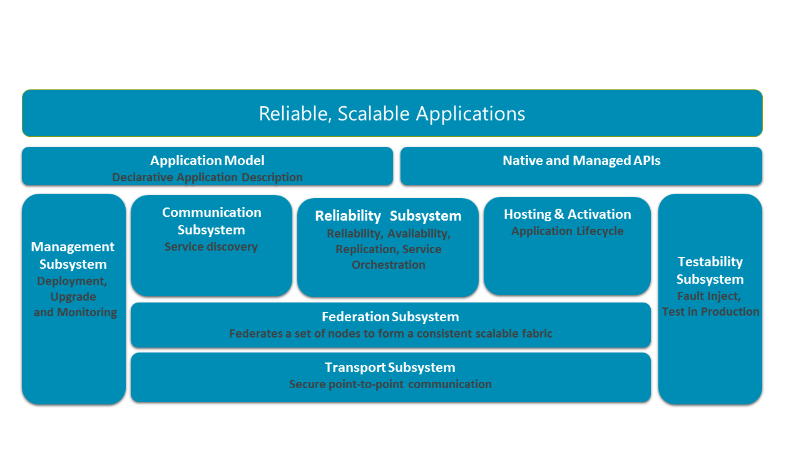

<properties
   pageTitle="Dienst Fabric Architektur | Microsoft Azure"
   description="Dienst ist, ist eine verteilte Systeme Plattform zur Erstellung skalierbarer, zuverlässiger und einfach verwaltete Applikationen für die Cloud verwendet. In diesem Artikel wird die Architektur Dienst Fabric."
   services="service-fabric"
   documentationCenter=".net"
   authors="rishirsinha"
   manager="timlt"
   editor="rishirsinha"/>

<tags
   ms.service="service-fabric"
   ms.devlang="dotnet"
   ms.topic="article"
   ms.tgt_pltfrm="NA"
   ms.workload="NA"
   ms.date="06/09/2016"
   ms.author="rsinha"/>

# Dienst Fabric Architektur

Dienst Fabric ist zu überlagerte Teilsystemen integriert. Diese Teilsystemen ermöglichen es Ihnen, Schreiben von Applications, die sind:

* Hochgradig verfügbar
* Skalierbare
* Verwaltbare
* Getestet werden

Das folgende Diagramm veranschaulicht die wichtigsten Teilsystemen Dienst Stoffbahn.

In einem verteilten System ist die Option für die sichere Kommunikation zwischen Knoten in einem Cluster entscheidend. Ist Sie an der Basis des Stapels Transportsubsystem, das sicheren Kommunikation zwischen Knoten bereitstellt. Über den Transport liegt Subsystem Teilsystems Föderation, in denen die verschiedenen Knoten in einer einzelnen Entität (Cluster genannt) Cluster für damit Fabric Service defekte erkennen, Füllzeichen Wahl ausführen und konsistente routing bereitstellen können. Teilsystems Zuverlässigkeit oberhalb von Teilsystems Föderation ist verantwortlich für die Zuverlässigkeit der Dienst Fabric-Diensten über Verfahren, wie z. B. Replikation, ressourcenverwaltung und Failover. Teilsystems Föderation zugrunde liegt auch das Teilsystem gehostet und Aktivierung, das des Lebenszyklus einer Anwendung auf einem einzelnen Knoten verwaltet. Das Verwaltungsteilsystem die Verwaltung des Lebenszyklus von Applications und-Diensten. Teilsystems Prüfbarkeit hilft Entwickler ihre Dienste durch simulierten Fehlern vor und nach der Bereitstellung von Applications und Diensten Herstellung Umgebungen testen. Dienst Fabric ermöglicht das Speicherorte über deren Kommunikationssubsystems zu beheben. Die Anwendung programming Modelle für Entwickler verfügbar gemacht werden auf diese Teilsystemen zusammen mit der Anwendungsmodell Werkzeuge aktivieren überlappende.

## Transportsubsystem
Das Transportsubsystem implementiert einen Punkt Kommunikation Datagrammkanal an. Dieser Kanal wird für die Kommunikation in Dienst Fabric Zuordnungseinheiten sowie der Kommunikation zwischen dem Dienst Fabric Cluster und Clients verwendet. Es unterstützt unidirektionale und Anforderung-Antwort Kommunikation Mustern befinden, die Grundlage für die Implementierung von dabei in den Layer Föderation bietet. Das Transportsubsystem sichert die Kommunikation mithilfe von X509 Zertifikate oder Windows-Sicherheit. Dieses Subsystem wird intern vom Dienst Fabric verwendet und ist nicht für Entwickler für die Anwendung Programmierung direkt zugänglich.

## Föderation subsystem
Um Informationen zu einer Gruppe von Knoten in einem verteilten System Grund, müssen Sie eine einheitliche Ansicht des Systems verfügen. Teilsystems Föderation verwendet die Kommunikation primitive durch das Transportsubsystem bereitgestellt und die verschiedenen Knoten zu einem einzigen einheitlichen Cluster, dem sie zur Ursache kann aneinandergefügt. Es stellt die verteilte Systeme primitive durch die anderen Teilsystemen - Erkennung von Fehlern, Füllzeichen Wahl und konsistente routing erforderlich. Teilsystems Föderation basiert auf verteilten Hashtabellen mit einem 128-Bit-token Leerzeichen. Teilsystems erstellt ein Suchtopologie Anrufen über die Knoten, mit jedem Knoten Anrufen eine Teilmenge der token Speicherplatz für den Besitz reserviert werden. Für die Erkennung von Fehlern verwendet der Layer ein Leasingmechanismus basierend auf Herz zu übertreffen und Arbitration. Teilsystems Föderation garantiert auch über komplizierte Verknüpfung und Abweichung-Protokolle, die nur ein einzelner Besitzer für ein Token zu einem beliebigen Zeitpunkt vorhanden ist. Dies bieten Füllzeichen Wahl und konsistente Weiterleitung Garantien.

## Zuverlässigkeit subsystem
Teilsystems Zuverlässigkeit bietet Methode, mit den Status eines Diensts Dienst Fabric durch die Verwendung der _Replicator_, _Failover-Manager_und _Ressourcen Lastenausgleich_hoch verfügbar zu machen.

* Der Replikations-Dienstes wird sichergestellt, dass ändert sich in der primären Dienst Replikation automatisch auf sekundäre Replikations repliziert werden Bewahrung der Konsistenz zwischen der primären und sekundären Replikate in einer Replikatgruppe Dienst. Der Replikations-Dienstes ist für die Verwaltung von Quorum zwischen den Replikaten bestimmen. Es arbeitet mit der Failovereinheit beim Abrufen der Liste der Vorgänge repliziert und der Agent neu konfiguriert, bietet es die Konfiguration des Replikatsatzes. Die Konfiguration zeigt an, welche Replikate die Vorgänge repliziert werden müssen. Fabric-Dienst bietet einem standardmäßigen Hersteller aufgerufen Fabric Replicator, die von der Programmierung Modell-API verwendet werden können, um den Dienststatus hochgradig verfügbar und zuverlässig zu gestalten.
* Der Failover-Manager ist sichergestellt, dass wenn Knoten hinzugefügt oder aus dem Cluster entfernt werden, wird die Last automatisch über den verfügbaren Knoten verteilt. Wenn ein Knoten im Cluster fehlschlägt, wird der Dienst Replikate zum Verwalten der Verfügbarkeit automatisch neu Cluster konfigurieren.
* Ressourcenmanager Dienst Replikate über Fehler bei der Domäne im Cluster platziert und stellt sicher, dass alle Failover Einheiten funktionsfähig sind. Ressourcenmanager gleicht auch Service-Ressourcen auf dem zugrunde liegenden freigegebenen Pool von Cluster-Knoten, um optimale gleichmäßige Last Verteilung zu erzielen.

## Verwaltungsteilsystem
Das Verwaltungsteilsystem bietet End-to-End-Dienst und Anwendung Lifecycle Management. PowerShell-Cmdlets und administrative APIs ermöglichen Ihnen können bereitstellen, bereitstellen, patch, aktualisieren, und heben Sie Ihre Bereitstellung von Applications ohne Verlust der Verfügbarkeit. Das Verwaltungsteilsystem führt dies über die folgenden Dienste.

* **Cluster-Manager**: Dies ist der primären Dienst, der mit der Failover-Manager aus Zuverlässigkeit die Applikationen für die Knoten basierend auf den Dienst Platzierung Einschränkungen gelten interagiert. Ressourcenmanager bei Failover Subsystem ist sichergestellt, dass die Einschränkungen nie unterbrochen werden. Der Cluster-Manager Verwaltung des Lebenszyklus von der Applications aus Erbringung heben nicht bereitstellen. Integriert mit den Diagnose-Manager, um sicherzustellen, dass die Verfügbarkeit der Anwendung nicht aus einer Perspektive semantische Gesundheit bei Upgrades verloren.
* **Diagnose-Manager**: mit diesem Service können Gesundheit für die Überwachung von Applications, Services und Cluster Einheiten. Cluster Einheiten (wie etwa Knoten, den Servicepartitionen und Replikate) können Informationen im Gesundheitswesen, melden, die dann in der zentralen Gesundheit Store aggregiert wird. Diese Informationen im Gesundheitswesen bietet eine Momentaufnahme Gesundheit für insgesamt Point-in-Time-Dienste und Knoten verteilt über mehrere Knoten im Cluster, sodass Sie alle erforderlichen Maßnahmen ergreifen. Gesundheit Abfrage APIs können Sie die Systemereignisse Abfragen gemeldet Teilsystems Dienststatus. Die Gesundheit-Abfrage, die APIs die unformatierten Gesundheitsdaten in den Dienststatus Store oder die zusammengefasster zurückgeben interpretiert Gesundheitsdaten für eine bestimmte Cluster Entität.
* **Abbildung Store**: diesen Dienst bietet Speicherung und Verteilung von der Anwendungsbinärdateien. Dieser Dienst bietet eine einfache verteilte Dateispeicher, wo die Applikationen geladen und von heruntergeladen werden.

## Hostinganbieter subsystem
Der Cluster-Manager informiert Hostinganbieter Teilsystems (ausgeführt wird, auf den einzelnen Knoten) auf welche Dienste es für einen bestimmten Knoten verwalten muss. Teilsystems Hostinganbieter klicken Sie dann die Verwaltung des Lebenszyklus der Anwendung auf dem betreffenden Knoten an. Es interagiert mit der Zuverlässigkeit und Gesundheit Komponenten, um sicherzustellen, dass die Replikate richtig gesetzt und sind fehlerfrei.

## Kommunikationssubsystems
Dieses Teilsystem bietet zuverlässigen messaging innerhalb der Cluster und Service Discovery durch den Naming Service. Der Dienst Naming Service Namen an einem Speicherort im Cluster aufgelöst und ermöglicht Benutzern, die Namen der Dienste und Eigenschaften zu verwalten. Mithilfe von Naming Service, können Clients sicher kommunizieren mit alle Knoten im Cluster einen Dienstnamen auflösen und Dienstmetadaten abzurufen. Verwenden eines einfachen Naming-Clients-API, können Benutzer Dienst Stoffbahn Dienste und Clients zum Auflösen von der aktuellen Netzwerkspeicherort trotz Knoten Dynamik oder die erneut ändern der Größe der Cluster zur entwickeln.

## Prüfbarkeit subsystem
Prüfbarkeit ist eine Sammlung von Tools, die speziell zum Testen von Diensten auf Dienst Fabric basiert. Lassen Sie die Tools einen Entwickler einfach auslösen aussagekräftige Fehlern und Ausführen von Testszenarien zum Testen und überprüfen Sie die zahlreichen Zustände und Übergänge, bei denen ein Dienst in der Audiodatei, alle gesteuert und sichere Weise auftreten wird. Prüfbarkeit enthält auch ein Verfahren, um mehr Tests, die durchlaufen kann über verschiedene mögliche Fehler ohne Verlust der Verfügbarkeit auszuführen. Dies bietet Ihnen eine Test Produktionsumfeld.
