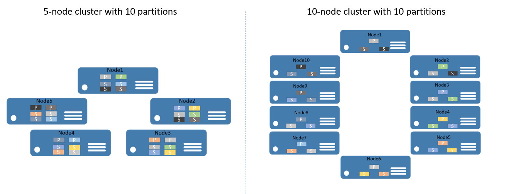
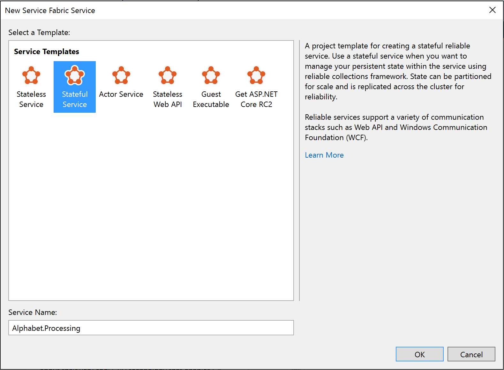
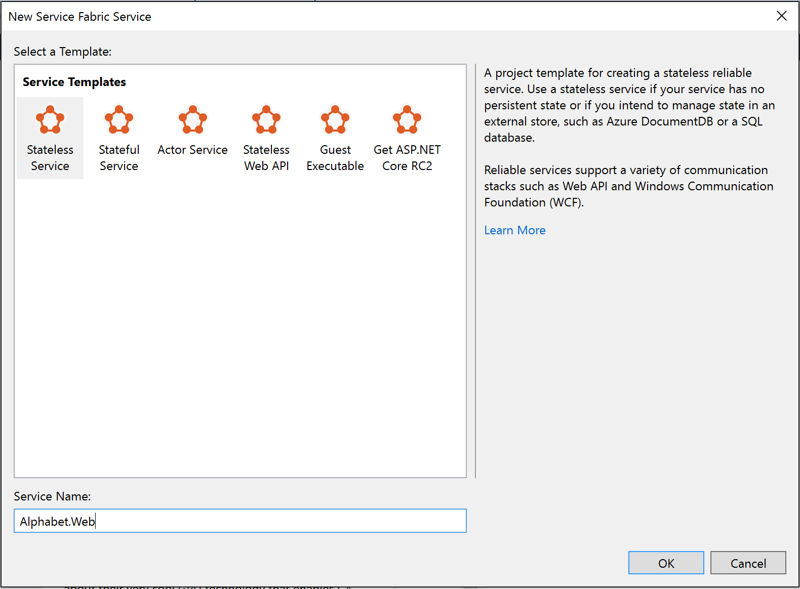

<properties
   pageTitle="Dienst Fabric Services Partitionierung | Microsoft Azure"
   description="Beschreibt, wie dynamische Dienste Service Fabric unterteilen. Partitionen ermöglicht die Speicherung von Daten auf den lokalen Computern, damit die Daten und berechnen zusammen skaliert werden können."
   services="service-fabric"
   documentationCenter=".net"
   authors="msfussell"
   manager="timlt"
   editor=""/>

<tags
   ms.service="service-fabric"
   ms.devlang="dotnet"
   ms.topic="article"
   ms.tgt_pltfrm="NA"
   ms.workload="NA"
   ms.date="10/22/2016"
   ms.author="msfussell"/>

# <a name="partition-service-fabric-reliable-services"></a>Partition Dienst Fabric zuverlässigen services
Dieser Artikel enthält eine Einführung in die grundlegenden Konzepte Aufteilung zuverlässigen Azure Service Fabric-Dienste. In dem Artikel verwendeten Quellcode steht auch auf [GitHub](https://github.com/Azure-Samples/service-fabric-dotnet-getting-started/tree/master/Services/AlphabetPartitions).

## <a name="partitioning"></a>Partitionierung
Partitionierung ist nicht mit Service Fabric. Tatsächlich ist es ein Muster Core skalierbare Dienste zu erstellen. In eine breitere sinnvoll können wir über das Aufteilen von als Konzept der Division von Bundesstaat (Daten) vorstellen und berechnen in kleineren barrierefreien Einheiten um Skalierbarkeit und Leistung zu verbessern. Einen bekannten Aufteilung in der Formularansicht [Datenpartitionierung][wikipartition], auch als Sharding bezeichnet.


### <a name="partition-service-fabric-stateless-services"></a>Partition Dienst Fabric zustandsloser Dienste
Für zustandsloser Dienste können Sie denken Sie an einer Partition wird eine logische Einheit, die eine oder mehrere Instanzen eines Diensts enthält. Abbildung 1 zeigt einen statusfreien Dienst mit fünf Instanzen auf einem Cluster mithilfe einer Partition verteilt.


Es gibt wirklich zwei Arten von statusfreie Dienst Lösungen. Die erste ist ein Dienst, der Zustand extern, beispielsweise in einer Azure SQL-Datenbank (wie einer Website, die die Sitzungsinformationen und Daten speichert) beibehalten. Die zweite ist Berechnung nur Dienste (wie einem Taschenrechner oder das Bild Thumbnailing), die keine beständigen Zustand verwaltet werden.

In entweder Fall, einen statusfreien Dienst Partitionierung ist ein sehr seltene Szenario--Skalierbarkeit, und Verfügbarkeit normalerweise durch Hinzufügen weitere Instanzen erzielt werden. Nur dann mehrere Partitionen für statusfreie Dienstinstanzen empfiehlt es sich ist, wenn Sie Inhalte Weiterleitung Anfragen entsprechen müssen.

Ein Beispiel sollten Sie einen Fall, in dem Benutzer-IDs in einem bestimmten Bereich nur eine Instanz von bestimmter Dienst realisiert werden sollte. Wenn Sie einen statusfreien Dienst aufteilen konnte ein weiteres Beispiel für ist, wenn Sie eine wirklich partitionierten Back-End-(z. B. sharded SQL-Datenbank haben) und möchten Sie steuern, welche Dienstinstanz sollte die Datenbank Shard – schreiben oder Ausführen anderer vorbereitenden Schritte innerhalb der statusfreien Dienst, der die gleiche vorherigen Informationen erforderlich sind, wie in die Back-End-verwendet wird. Diese Typen von Szenarien können auch auf verschiedene Arten gelöst werden und nicht unbedingt erforderlich Dienst Partitionierung.

Im restlichen diese Anleitung behandelt dynamische Dienste.

### <a name="partition-service-fabric-stateful-services"></a>Dynamische Partition Dienst Fabric-Dienste
Dienst Fabric erleichtert die skalierbare dynamische Services entwickeln, indem Sie eine herausragende Möglichkeit zum Partition Bundesstaat (Daten). Im Prinzip, können Sie zu einem Teil eines dynamische Dienst als Einheit Maßstab vorstellen, die hochgradig zuverlässigen bis [Replikate](service-fabric-availability-services.md) , die verteilt und über die Knoten in einem Cluster verteilt ist.

Im Kontext der Dienst Fabric dynamische Dienste Partitionierung verweist auf die Vorgehensweise zum bestimmen, dass eine bestimmte Servicepartition für einen Teil der vollständigen Zustand des Diensts verantwortlich ist. (Wie bereits erwähnt, ist eine Partition eine Reihe von [Replikate](service-fabric-availability-services.md)). Eine gute an Fabric Service ist, dass sie die Partitionen auf verschiedenen Knoten platziert. Dies ermöglicht es ihnen, mit einem Knoten Ressource schränken bereichern. Anforderungen Daten wächst Partitionen vergrößern und Dienst Fabric gleicht Partitionen über Knoten aus. Dadurch wird die kontinuierliche Nutzung der Hardware-Ressourcen.

Um ein Beispiel zu erhalten, Angenommen Sie, dass Sie beginnen mit einem Cluster mit 5 Knoten und ein Dienst, der 10 Partitionen und ein Ziel von drei Replikaten erhalten konfiguriert ist. In diesem Fall Dienst Fabric Saldo und verteilen Sie die Replikate über den Cluster – möchten und mit zwei primären [Replikate](service-fabric-availability-services.md) pro Knoten landen würden.
Wenn Sie nun 10 Knoten durch den Cluster zu skalieren müssen, würde Dienst Fabric die primäre [Replikate](service-fabric-availability-services.md) über alle 10 Knoten neu zu verteilen. Ebenso, wenn Sie wieder auf 5 Knoten skaliert, würde Dienst Fabric alle Replikate über die 5 Knoten neu zu verteilen.  

Abbildung 2 zeigt die Verteilung der 10 Partitionen vor und nach dem Cluster skalieren.



Daher wird die Skalierung erreicht, da Anfragen von Clients auf Computern verteilt werden, allgemeine Leistung der Anwendung verbessert wurde und Konflikte für den Zugriff auf Datenblöcke wird verringert.

## <a name="plan-for-partitioning"></a>Planen der Verwendung von Partitionierung
Vor dem Dienst implementieren, sollten Sie immer die Partitionierungsstrategie, die zum Skalieren erforderlich ist. Es gibt verschiedene Arten, aber alle Fokussierung auf was die Anwendung zu erzielen muss. Für den Kontext dieses Artikels sehen Sie sich einige der wichtigen Aspekte.

Ein guter Ansatz ist die Struktur des Staates anzustellen, die als ersten Schritt aufgeteilt werden soll.

Sehen wir uns ein einfaches Beispiel. Wenn Sie einen Dienst für eine countywide Umfrage erstellen wollten, konnten Sie eine Partition für jede Stadt den Kanton erstellen. Klicken Sie dann, kann die stimmen für jede Person in den Ort in der Partition gespeichert, die dieser Stadt entspricht. Abbildung 3 stellt eine Reihe von Personen und den Ort, in dem sie sich befinden.


Wie das Auffüllen von Orten stark variiert, können Sie einige Partitionen, die eine große Datenmenge (z. B. Frankfurt am Main) enthalten und andere Partitionen mit sehr kleinen Bundesstaat (z. B. Kirkland) einhandeln. Was ist die Auswirkungen dieser Probleme Partitionen mit ungleiche Datenmengen Zustand?

Wenn Sie wieder zum Beispiel vorstellen, können Sie leicht erkennen, dass die Partition, der die stimmen für Seattle mehr Datenverkehr als die Kirkland eine abruft. Standardmäßig wird sichergestellt Dienst Fabric über dieselbe Anzahl von primären und sekundären Replikate auf den einzelnen Knoten auftritt. Daher können Sie Knoten einhandeln, die Replikate bei den ersten Schritten mehr Datenverkehr und andere enthalten, die weniger Datenverkehr dienen. Sie sollten vorzugsweise wichtiges und kalte Volltonfarben wie folgt in einem Cluster zu vermeiden.

Um dies zu vermeiden, sollten Sie zwei Faktoren aus einem vorherigen Sicht vorgehen:

- Versuchen Sie, den Zustand aufgeteilt, damit sie alle partitionsübergreifend gleichmäßig verteilt ist.
- Laden der Bericht aus jeder der Replikate für den Dienst. (Informationen, schauen Sie sich in diesem Artikel auf [Metrik und Laden](service-fabric-cluster-resource-manager-metrics.md)). Dienst Fabric ermöglicht das Bericht Laden von Diensten wie Speichermenge oder die Anzahl der Einträge verbraucht. Basierend auf den Kennzahlen gemeldet, erkennt Fabric Dienst an, dass einige Partitionen dienen als andere höhere lädt und gleicht Cluster indem Replikate in besser geeignet-Knoten verschieben aus, sodass insgesamt kein Knoten überlastet ist.

Manchmal können nicht Sie wissen, wie viele Daten in eine bestimmte Partition gehört. Damit im Allgemeinen wird empfohlen, ist beides – verteilt zunächst durch eine Partitionierungsstrategie eingeführt, die die Daten gleichmäßig über die Partitionen und die Sekunde, durch hohe Auslastung reporting.  Bei der ersten Methode wird verhindert, dass im Beispiel Abstimmungsoptionen während der zweiten hilft, temporäre Differenzen in Access oder laden interpolierten über einen Zeitraum beschriebene Situationen.

Ein weiterer Aspekt der Planung von Partition besteht darin, die richtige Anzahl von Partitionen zunächst auswählen.
Im Hinblick auf Dienst Fabric Annahme, der angefangen einer höheren Anzahl von Partitionen als erwartet für Ihr Szenario verhindert.
Die maximale Anzahl von Partitionen Voraussetzung tatsächlich Ansatz eignet.

In Ausnahmefällen landen Sie möglicherweise benötigen weitere Partitionen als Sie zunächst ausgewählt haben. Wie Sie die Partitionsanzahl nach dem Vorfall nicht ändern können, müssen Sie einige erweiterte Partition Ansätze, erstellen eine neue Service-Instanz der gleichen Diensttyp anwenden. Sie möchten auch müssen einige clientseitige Logik implementieren, die die Anforderungen an die richtige Service-Instanz, die auf Grundlage des clientseitigen Kenntnisse, die Ihren Clientcode verwalten müssen weitergeleitet.

Ein weiterer Aspekt für die Planung Partitionierung ist der verfügbaren Computerressourcen. Während der Zustand muss und gespeichert werden sollen, sind Sie gebunden, denen Sie folgen:

- Grenzwerte für Netzwerk-Bandbreite
- Speicherlimits System
- Datenträger von Speichergrenzwerten

Was passiert, wenn die Ressource Einschränkungen in einem laufenden Cluster auftreten können? Die Antwort ist, dass Sie einfach, den Cluster zu der neuen Bedürfnisse skaliert werden können.

[Im Planungshandbuch Kapazität](service-fabric-capacity-planning.md) bietet Anleitung für bestimmen, wie viele Knoten Ihren Cluster muss.

## <a name="get-started-with-partitioning"></a>Erste Schritte mit Verteilung
In diesem Abschnitt beschrieben, wie mit den Dienst Verteilung Schritte.

Fabric-Dienst bietet eine Auswahl an drei Partitionsschemas an:

- Einem Bereich Partitionierung (auch als UniformInt64Partition bezeichnet).
- Benannte Partitionierung. Mit diesem Modell normalerweise Applikationen haben Daten, die bucketed werden können, in eine begrenzte festlegen. Einige allgemeine Beispiele für Datenfelder, die als benannte Partition Schlüssel wäre Regionen, Postleitzahlen, Kundengruppen oder andere Business Begrenzung.
- Einzelne Partitionierung. Einzelne Partitionen werden in der Regel verwendet werden, wenn der Dienst keine weiteren routing erforderlich ist. Beispielsweise verwenden zustandsloser Dienste dieses Partitionierungsschema standardmäßig an.

Mit dem Namen und einzelne Partitionierungsschemas sind spezielle Formen von ausgeschöpft Partitionen. Standardmäßig einem Bereich die Visual Studio-Vorlagen für Dienst Fabric verwenden Partitionierung, wie es am häufigsten und sinnvoll ist. Der Rest der in diesem Artikel liegt der Schwerpunkt auf das ausgeschöpft Partitionierungsschema.

### <a name="ranged-partitioning-scheme"></a>Partitionierungsschema einem Bereich
Hiermit wird zum Angeben eines Bereichs für ganze Zahlen (identifiziert durch eine niedrige und hohe Schlüssel) und eine Anzahl von Partitionen (n). N Partitionen, jeweils einen übereinander Teilbereich des Partition Key Zahlenbereiche verantwortlich erstellt. Beispielsweise würde ein ausgeschöpft Partitionierungsschema mit einem niedrig Schlüssel von 0, eine hohe Schlüssel 99 und die Anzahl der 4 vier Partitionen erstellen wie unten dargestellt.


Ein gemeinsames Konzept ist zum Erstellen eines Hashwertes anhand eines eindeutigen Schlüssels innerhalb des Datensatzes auf. Einige allgemeine Beispiele für Schlüssel wäre eine Identifikationsnummer Fahrzeug (VIN), eine Personalnummer oder eine eindeutige Zeichenfolge. Mithilfe dieser eindeutigen Schlüssel erzeugt Sie dann einen Hashcode, Modulo Key Bereich, als den Key verwendet. Sie können die oberen und unteren Grenzen des Bereichs zulässiger Key angeben.


### <a name="select-a-hash-algorithm"></a>Wählen Sie einen Hashalgorithmus aus.
Ein wichtiger hashing ist Ihre Hashalgorithmus auswählen. Eine Rolle spielt, ob das Ziel besteht darin, ähnliche Tasten benachbart (Ort hashing vertrauliche) – gruppieren oder wenn Aktivität gestreut alle partitionsübergreifend (Verteilung hashing) verteilt werden soll, das häufiger.

Die Eigenschaften eines guten Verteilung hashing Algorithmus sind, dass es einfach ist zu berechnen, es einige Konflikte enthält und die Tasten gleichmäßig verteilt. Ein gute Beispiel für eine effiziente Hashalgorithmus ist der Hashalgorithmus [FNV-1](https://en.wikipedia.org/wiki/Fowler%E2%80%93Noll%E2%80%93Vo_hash_function) .


Eine gute Ressource für allgemeine Hash Algorithmus Auswahlmöglichkeiten ist der [Wikipedia-Seite auf Hashfunktionen](http://en.wikipedia.org/wiki/Hash_function).

## <a name="build-a-stateful-service-with-multiple-partitions"></a>Erstellen Sie einen dynamische Dienst mit mehreren Partitionen
Lassen Sie uns Erstellen Ihrer ersten zuverlässigen dynamische Dienst mit mehreren Partitionen. In diesem Beispiel erstellen Sie eine sehr einfache Anwendung, in dem Sie alle Nachnamen zu speichern, die mit dem gleichen Buchstaben in der gleichen Partition starten möchten.

Bevor Sie keinen Code schreiben, müssen Sie die Partitionen und Partition Tasten anzustellen. 26 Partitionen (eine für jeden Buchstaben im Alphabet), aber was über die Höchst- und Schlüssel erforderlich?
Wie wir Literal eine Partition pro Buchstaben verwenden möchten, können wir 0 als niedrig Schlüssel und 25 als hohe Schlüssel, verwendet werden als einzelnen Buchstaben einen eigenen Schlüssel ist.


>[AZURE.NOTE] Dies ist ein vereinfachte Szenario, wie es in der Praxis wäre die Verteilung ungleiche. Nachnamen, beginnend mit dem Buchstaben "S" oder "M" werden häufiger als die beginnend mit "X" oder "J".


1. Öffnen Sie **Visual Studio** > **Datei** > **neue** > **Projekt**.
2. Klicken Sie im Dialogfeld **Neues Projekt** wählen Sie die Fabric Service-Anwendung.
3. Rufen Sie das Projekt "AlphabetPartitions".
4. Klicken Sie im Dialogfeld **erstellen einen Dienst** wählen Sie **Stateful** -Dienst aus, und nennen Sie diese "Alphabet.Processing", wie in der nachstehenden Abbildung gezeigt.

    

5. Legen Sie die Anzahl der Partitionen ein. Öffnen Sie die Datei Applicationmanifest.xml in den Ordner ApplicationPackageRoot des Projekts AlphabetPartitions und aktualisieren Sie den Parameter Processing_PartitionCount mit 26, wie unten dargestellt.

    ```xml
    <Parameter Name="Processing_PartitionCount" DefaultValue="26" />
    ```
    
    Sie müssen außerdem die Eigenschaften LowKey und HighKey des StatefulService-Elements in der ApplicationManifest.xml wie unten dargestellt zu aktualisieren.

    ```xml
    <Service Name="Processing">
      <StatefulService ServiceTypeName="ProcessingType" TargetReplicaSetSize="[Processing_TargetReplicaSetSize]" MinReplicaSetSize="[Processing_MinReplicaSetSize]">
        <UniformInt64Partition PartitionCount="[Processing_PartitionCount]" LowKey="0" HighKey="25" />
      </StatefulService>
    </Service>
    ```

6. Öffnen Sie für den Dienst zugreifen kann von außen liegenden Tabellenblättern an einem Port durch Hinzufügen des Endpunkt Elements der ServiceManifest.xml (befindet sich im Ordner "PackageRoot") für den Dienst Alphabet.Processing wie unten dargestellt:

    ```xml
    <Endpoint Name="ProcessingServiceEndpoint" Port="8089" Protocol="http" Type="Internal" />
    ```

    Jetzt wird der Dienst, der einen internen Endpunkt mit 26 Partitionen überwacht konfiguriert.

7. Als Nächstes müssen Sie überschreiben die `CreateServiceReplicaListeners()` -Methode der Klasse Verarbeitung.

    >[AZURE.NOTE] In diesem Beispiel wird davon ausgegangen, dass Sie mit einem einfachen HttpCommunicationListener arbeiten. Weitere Informationen zum zuverlässigen Service Kommunikation finden Sie unter [der zuverlässigen Service Kommunikationsmodell](service-fabric-reliable-services-communication.md).

8. Eine empfohlene Muster für die URL, die ein Replikat überwacht wird das folgende Format: `{scheme}://{nodeIp}:{port}/{partitionid}/{replicaid}/{guid}`.
    Daher müssen Sie Ihre Zuhörer Kommunikation auf den richtigen Endpunkten und mit diesem Muster Abhören konfigurieren möchten.

    Mehrere Replikate diesen Dienst möglicherweise auf dem gleichen Computer gehostet werden, damit diese Adresse an den eindeutig sein muss. Dies ist, warum Partitions-ID + Replikat-ID in der URL sind. HttpListener kann mehrere Adressen auf demselben Port abhören, solange das URL-Präfix eindeutig ist.

    Den zusätzlichen bestehen GUID für eine erweiterte Fall, in dem sekundären Replikate auch schreibgeschützt Anfragen abfragt. Wenn dies der Fall ist, um sicherzustellen, dass eine neue eindeutige Adresse zum erzwingen, dass Clients, die Adresse erneut aufzulösen verwendet wird beim Übergang aus der primären Secondary werden soll. '+' wird als die Adresse hier verwendet, sodass das Replikat aller verfügbaren Hosts (IP-, FQDM, Localhost usw. überwacht) Der folgende Code zeigt ein Beispiel.

    ```CSharp
    protected override IEnumerable<ServiceReplicaListener> CreateServiceReplicaListeners()
    {
         return new[] { new ServiceReplicaListener(context => this.CreateInternalListener(context))};
    }
    private ICommunicationListener CreateInternalListener(ServiceContext context)
    {
            
         EndpointResourceDescription internalEndpoint = context.CodePackageActivationContext.GetEndpoint("ProcessingServiceEndpoint");
         string uriPrefix = String.Format(
                "{0}://+:{1}/{2}/{3}-{4}/",
                internalEndpoint.Protocol,
                internalEndpoint.Port,
                context.PartitionId,
                context.ReplicaOrInstanceId,
                Guid.NewGuid());

         string nodeIP = FabricRuntime.GetNodeContext().IPAddressOrFQDN;

         string uriPublished = uriPrefix.Replace("+", nodeIP);
         return new HttpCommunicationListener(uriPrefix, uriPublished, this.ProcessInternalRequest);
    }
    ```

    Es ist auch zu beachten, dass die URL der veröffentlichte weicht aus dem überwachenden URL-Präfix ist.
    Die überwachende URL erhält HttpListener. Der veröffentlichte URL ist die URL, die auf Dienst Fabric Naming Service veröffentlicht wird, die für die Dienstermittlung verwendet wird. Für diese Adresse durch die Discovery-Dienst werden von Clients aufgefordert. Die Adresse, die Clients abrufen muss die tatsächliche IP oder FQDN des Knotens haben, um eine Verbindung herzustellen. Daher Sie ersetzen müssen '+' mit IP oder FQDN obigen des Knotens.

9. Der letzte Schritt darin ist die von Verarbeitungslogik zu den Dienst, wie unten dargestellt hinzugefügt.

    ```CSharp
    private async Task ProcessInternalRequest(HttpListenerContext context, CancellationToken cancelRequest)
    {
        string output = null;
        string user = context.Request.QueryString["lastname"].ToString();

        try
        {
            output = await this.AddUserAsync(user);
        }
        catch (Exception ex)
        {
            output = ex.Message;
        }

        using (HttpListenerResponse response = context.Response)
        {
            if (output != null)
            {
                byte[] outBytes = Encoding.UTF8.GetBytes(output);
                response.OutputStream.Write(outBytes, 0, outBytes.Length);
            }
        }
    }
    private async Task<string> AddUserAsync(string user)
    {
        IReliableDictionary<String, String> dictionary = await this.StateManager.GetOrAddAsync<IReliableDictionary<String, String>>("dictionary");

        using (ITransaction tx = this.StateManager.CreateTransaction())
        {
            bool addResult = await dictionary.TryAddAsync(tx, user.ToUpperInvariant(), user);

            await tx.CommitAsync();

            return String.Format(
                "User {0} {1}",
                user,
                addResult ? "sucessfully added" : "already exists");
        }
    }
    ```

    `ProcessInternalRequest`liest die Werte des Abfrage-Parameters verwendet, um die Partition und Anrufe aufzurufen `AddUserAsync` der Nachname der zuverlässigen Wörterbuch hinzufügen `dictionary`.

10. Lassen Sie uns statusfreien Dienst hinzufügen, mit dem zu sehen, wie Sie eine bestimmte Partition aufrufen können.

    Dieser Dienst dient als eine einfache Web-Benutzeroberfläche, die der Nachname als Zeichenfolge Abfrageparameter akzeptiert, bestimmt die Partitionsschlüssel und sendet es an den Alphabet.Processing-Dienst für die Verarbeitung.
    
11. Klicken Sie im Dialogfeld **erstellen einen Dienst** wählen Sie **zustandslos** Dienst aus, und nennen Sie diese "Alphabet.Web", wie unten dargestellt.
    
    .

12. Aktualisieren Sie die Endpunktinformationen in den ServiceManifest.xml des Diensts Alphabet.WebApi, um einen Anschluss wie unten dargestellt zu öffnen.

    ```xml
    <Endpoint Name="WebApiServiceEndpoint" Protocol="http" Port="8081"/>
    ```

13. Sie müssen eine Auflistung von ServiceInstanceListeners in der Klasse Web zurückzugeben. Sie können erneut eine einfache HttpCommunicationListener implementieren.

    ```CSharp
    protected override IEnumerable<ServiceInstanceListener> CreateServiceInstanceListeners()
    {
        return new[] {new ServiceInstanceListener(context => this.CreateInputListener(context))};
    }
    private ICommunicationListener CreateInputListener(ServiceContext context)
    {
        // Service instance's URL is the node's IP & desired port
        EndpointResourceDescription inputEndpoint = context.CodePackageActivationContext.GetEndpoint("WebApiServiceEndpoint")
        string uriPrefix = String.Format("{0}://+:{1}/alphabetpartitions/", inputEndpoint.Protocol, inputEndpoint.Port);
        var uriPublished = uriPrefix.Replace("+", FabricRuntime.GetNodeContext().IPAddressOrFQDN);
        return new HttpCommunicationListener(uriPrefix, uriPublished, this.ProcessInputRequest);
    }
    ```

14. Jetzt müssen Sie die von Verarbeitungslogik zu implementieren. Anrufe HttpCommunicationListener `ProcessInputRequest` Wenn eine Anforderung eingeht. So lassen Sie uns also, und fügen Sie den folgenden Code.

    ```CSharp
    private async Task ProcessInputRequest(HttpListenerContext context, CancellationToken cancelRequest)
    {
        String output = null;
        try
        {
            string lastname = context.Request.QueryString["lastname"];
            char firstLetterOfLastName = lastname.First();
            ServicePartitionKey partitionKey = new ServicePartitionKey(Char.ToUpper(firstLetterOfLastName) - 'A');

            ResolvedServicePartition partition = await this.servicePartitionResolver.ResolveAsync(alphabetServiceUri, partitionKey, cancelRequest);
            ResolvedServiceEndpoint ep = partition.GetEndpoint();
                
            JObject addresses = JObject.Parse(ep.Address);
            string primaryReplicaAddress = (string)addresses["Endpoints"].First();

            UriBuilder primaryReplicaUriBuilder = new UriBuilder(primaryReplicaAddress);
            primaryReplicaUriBuilder.Query = "lastname=" + lastname;

            string result = await this.httpClient.GetStringAsync(primaryReplicaUriBuilder.Uri);

            output = String.Format(
                    "Result: {0}. <p>Partition key: '{1}' generated from the first letter '{2}' of input value '{3}'. <br>Processing service partition ID: {4}. <br>Processing service replica address: {5}",
                    result,
                    partitionKey,
                    firstLetterOfLastName,
                    lastname,
                    partition.Info.Id,
                    primaryReplicaAddress);
        }
        catch (Exception ex) { output = ex.Message; }

        using (var response = context.Response)
        {
            if (output != null)
            {
                output = output + "added to Partition: " + primaryReplicaAddress;
                byte[] outBytes = Encoding.UTF8.GetBytes(output);
                response.OutputStream.Write(outBytes, 0, outBytes.Length);
            }
        }
    }
    ```

    Werfen Sie sie Schritt für Schritt. Der Code liest den ersten Buchstaben des Abfrage-Parameters `lastname` in einem Zeichen. Klicken Sie dann die Partitionsschlüssel für diesen Brief bestimmt, nach Abzug des Hexadezimalwerts `A` aus den hexadezimalen Wert für den ersten Buchstaben im Nachnamen.

    ```CSharp
    string lastname = context.Request.QueryString["lastname"];
    char firstLetterOfLastName = lastname.First();
    ServicePartitionKey partitionKey = new ServicePartitionKey(Char.ToUpper(firstLetterOfLastName) - 'A');
    ```

    Beachten Sie, dass in diesem Beispiel wir 26 Partitionen mit einem Partitionsschlüssel pro Partition verwenden.
    Wir rufen Sie danach die Servicepartition `partition` für diesen Schlüssel mithilfe der `ResolveAsync` Methode für die `servicePartitionResolver` Objekt. `servicePartitionResolver`ist wie folgt definiert

    ```CSharp
    private readonly ServicePartitionResolver servicePartitionResolver = ServicePartitionResolver.GetDefault();
    ```

    Die `ResolveAsync` Methode hat den URI-Dienst, der Partitionsschlüssel und ein Abbruch als Parameter Token. Der Dienst URI für den Verarbeitungsdienst ist `fabric:/AlphabetPartitions/Processing`. Als Nächstes rufen wir den Endpunkt der Partition.

    ```CSharp
    ResolvedServiceEndpoint ep = partition.GetEndpoint()
    ```

    Schließlich erstellen die URL Endpunkt plus der Abfragezeichenfolge und rufen Sie den Verarbeitungsdienst.

    ```CSharp
    JObject addresses = JObject.Parse(ep.Address);
    string primaryReplicaAddress = (string)addresses["Endpoints"].First();

    UriBuilder primaryReplicaUriBuilder = new UriBuilder(primaryReplicaAddress);
    primaryReplicaUriBuilder.Query = "lastname=" + lastname;

    string result = await this.httpClient.GetStringAsync(primaryReplicaUriBuilder.Uri);
    ```

    Nach Abschluss die Verarbeitung schreiben wir die Ausgabe zurück.

15. Der letzte Schritt darin ist den Dienst testen. Visual Studio verwendet Anwendungsparameter für lokale und Cloudbereitstellung. Klicken Sie zum Testen des Diensts mit lokal 26 Partitionen müssen Sie aktualisieren die `Local.xml` in den Ordner ApplicationParameters des Projekts AlphabetPartitions ablegen, wie unten dargestellt:

    ```xml
    <Parameters>
      <Parameter Name="Processing_PartitionCount" Value="26" />
      <Parameter Name="WebApi_InstanceCount" Value="1" />
    </Parameters>
    ```

16. Nachdem Sie die Bereitstellung abgeschlossen haben, können Sie den Dienst und aller seiner Partitionen Dienst Fabric Explorer überprüfen.
    
    
    
17. Sie können die Partitionierungslogik in einem Browser testen, durch Eingabe von `http://localhost:8081/?lastname=somename`. Sie sehen, dass die einzelnen Nachnamen, der mit dem gleichen Buchstaben beginnt in derselben Partition gespeichert wird.
    
    

Der gesamten Quellcode des Beispiels ist auf [GitHub](https://github.com/Azure-Samples/service-fabric-dotnet-getting-started/tree/master/Services/AlphabetPartitions)verfügbar.

## <a name="next-steps"></a>Nächste Schritte

Finden Sie Informationen über Fabric Service-Konzepte vor:

- [Verfügbarkeit von Diensten Fabric Service](service-fabric-availability-services.md)

- [Skalierbarkeit Dienst Fabric-Dienste](service-fabric-concepts-scalability.md)

- [Planen von Applications Dienst Fabric Kapazität](service-fabric-capacity-planning.md)

[wikipartition]: https://en.wikipedia.org/wiki/Partition_(database)
