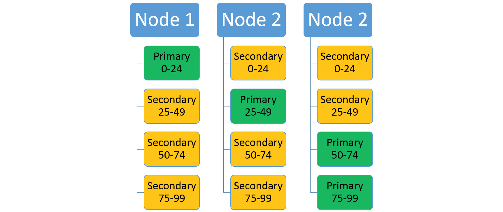
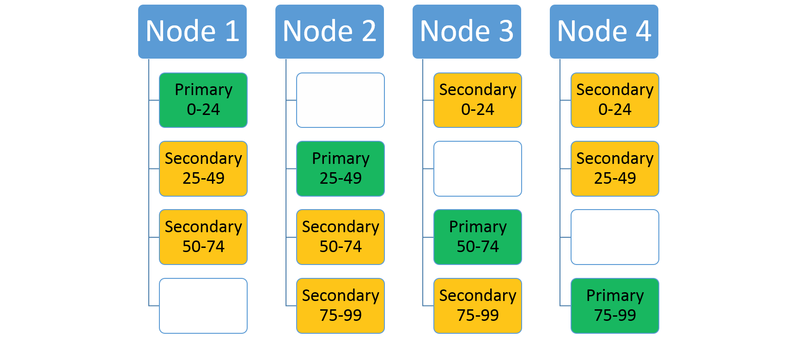

<properties
   pageTitle="Skalierbarkeit Dienst Fabric Dienste | Microsoft Azure"
   description="Beschreibt, wie Sie Service Fabric Services skalieren"
   services="service-fabric"
   documentationCenter=".net"
   authors="appi101"
   manager="timlt"
   editor=""/>

<tags
   ms.service="service-fabric"
   ms.devlang="dotnet"
   ms.topic="article"
   ms.tgt_pltfrm="NA"
   ms.workload="NA"
   ms.date="08/10/2016"
   ms.author="aprameyr"/>

# Anpassungsbereich für Dienst Fabric Applikationen
Azure Service-Struktur erleichtert die skalierbare Applikationen durch den Lastenausgleich Services, Partitionen und Replikate auf allen Knoten in einem Cluster zu erstellen. Dies ermöglicht maximale Ressource Auslastung.

Hohe Anzahl der Dezimalstellen für Applikationen Dienst Fabric kann auf zwei Arten erreicht werden:

1. Auf Partitionsebene Skalierung

2. Auf der Ebene der Dienst Namen Skalierung

## Auf Partitionsebene Skalierung
Dienst Fabric unterstützt einen einzelnen Dienst in mehrere kleinere Partitionen partitionieren. Die [Partitionierung Übersicht](service-fabric-concepts-partitioning.md) , enthält Informationen zu den vorstehend beschriebenen Partitionierungsschemas, die unterstützt werden. Die Replikate der einzelnen Partitionen sind auf der Knoten in einem Cluster verteilt. Erwägen Sie einen Dienst, der ein ausgeschöpft Partitionierungsschema mit einem niedrig Schlüssel von 0, eine hohe Schlüssel 99 und vier Partitionen verwendet. In einem Cluster mit drei Knoten möglicherweise der Dienst mit vier Replikaten angeordnet werden, die die Ressourcen auf den einzelnen Knoten gemeinsam nutzen, wie hier dargestellt:

Erhöhen der Anzahl von Knoten ermöglicht Service-Struktur, bis die Ressourcen auf den neuen Knoten verwenden, indem Sie einige der Replikate in leeren Knoten verschieben. Durch erhöhen die Anzahl der Knoten auf vier, hat den Dienst jetzt drei Replikate auf den einzelnen Knoten (der verschiedenen Partitionen) für eine bessere Nutzung der Ressource und der Leistung wird ausgeführt.

## Auf der Ebene der Dienst Namen Skalierung
Eine Serviceinstanz ist eine bestimmte Instanz von einer Anwendung oder Dienst Typnamen (siehe [Lebenszyklus von Fabric Service](service-fabric-application-lifecycle.md)). Während der Erstellung eines Diensts, geben Sie die Partition Schema (siehe [Partitionierung Dienst Fabric Services](service-fabric-concepts-partitioning.md)), verwendet werden.

Die erste Ebene der Skalierung ist namentlich Dienst. Sie können neue Instanzen für den Dienst mit verschiedenen Ebenen Aufteilung, als Ihr älteren Dienstinstanzen ausgelastet erstellen. Dadurch wird ein neuer Dienst Verbraucher ausgelastet diejenigen, anstatt Dienstinstanzen kleiner/gebucht-verwenden.

Eine Möglichkeit zum Erhöhen der Kapazität als auch steigenden oder abnehmenden Partition zählt, wird eine neue Dienstinstanz mit ein neues Partitionsschema erstellt. Dadurch wird Komplexität, jedoch als alle-Clients wissen, wann und wie Sie den anders benannten Dienst verwenden in Anspruch nehmen müssen hinzugefügt.

### Beispielszenario: eingebettete Datumsangaben
Ein mögliches Szenario wäre Datumsinformationen als Teil des Dienstnamens verwenden. Beispielsweise können Sie eine Instanz mit einem bestimmten Namen für alle Benutzer, die sich in 2013 angeschlossen und einen anderen Namen für die Kunden, die im 2014 verknüpft. Dieses naming Schema ermöglicht für programmgesteuert zunehmender die Namen je nach dem Datum (als 2014 Ansätze, die Service-Instanz für 2014 kann erstellt werden bei Bedarf).

Dieser Ansatz basiert jedoch auf den Clients gemäß anwendungsspezifische naming Informationen, die sich außerhalb des Gültigkeitsbereichs des Diensts Fabric Knowledge befindet.

- *Verwenden Sie eine Benennungskonvention*: In 2013, wenn eine Anwendung verfügbar sofort, erstellen Sie einen Dienst namens Fabric: / app/service2013. In der Nähe der zweiten Quartal 2013, erstellen Sie einen anderen Dienst, Fabric aufgerufen: / app/service2014. Beide der folgenden Dienste werden vom gleichen Diensttyp. Bei dieser Vorgehensweise müssen Ihren Kunden wendet Logik, um den entsprechenden Dienstnamen basierend auf dem Jahr zu erstellen.

- *Verwenden eines Nachschlage-Diensts*: ein anderes Muster besteht darin, den Namen des Diensts für eine gewünschte Taste angeben können einen sekundäre Nachschlagen Dienst bereitstellen. Neue Dienstinstanzen können dann durch den Nachschlage-Dienst erstellt werden. Der Nachschlage-Dienst selbst beibehalten keine Anwendungsdaten, und nur die Daten zu den Namen, die sie erstellt. Auf diese Weise für Jahr-basierten obigen Beispiel der Client würde wenden Sie sich zuerst an der Suchdienst, um herauszufinden, den Namen des Diensts Behandeln von Daten für ein bestimmtes Jahr, und verwenden Sie diesen Dienstnamen zur Durchführung des ist-Vorgangs. Das Ergebnis der ersten Suche kann zwischengespeichert werden.

## Nächste Schritte

Weitere Informationen zum Dienst Fabric Konzepte finden Sie unter den folgenden:

- [Verfügbarkeit von Diensten Fabric Service](service-fabric-availability-services.md)

- [Vorherigen Dienst Fabric-services](service-fabric-concepts-partitioning.md)

- [Definieren und Verwalten von Zustand](service-fabric-concepts-state.md)
