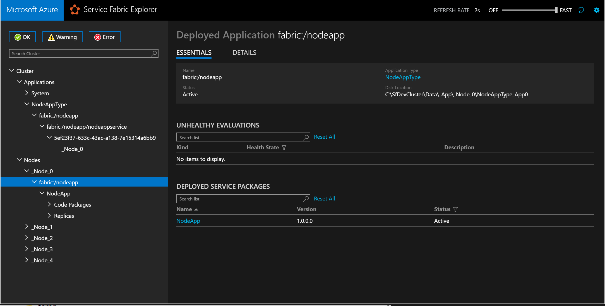

<properties
   pageTitle="Bereitstellen eine vorhandene ausführbare Datei mit Azure Service Fabric | Microsoft Azure"
   description="Anleitung erfahren Sie, wie Sie eine vorhandene Anwendung als Gast ausführbare, packen, damit es in einem Dienst Fabric Cluster bereitgestellt werden können"
   services="service-fabric"
   documentationCenter=".net"
   authors="msfussell"
   manager="timlt"
   editor=""/>

<tags
   ms.service="service-fabric"
   ms.devlang="dotnet"
   ms.topic="article"
   ms.tgt_pltfrm="NA"
   ms.workload="na"
   ms.date="10/22/2016"
   ms.author="msfussell;mikhegn"/>

# <a name="deploy-a-guest-executable-to-service-fabric"></a>Ausführbare Gast mit Fabric Dienst bereitstellen

Sie können jede Art von Anwendung, z. B. node.js, Java oder systemeigenen Applications in Azure Service Architektur ausführen. Dienst Fabric verweist auf diesen Arten von Applications als Gast ausführbare Datei.
Gast ausführbare Dateien werden vom Dienst Fabric wie zustandsloser Dienste behandelt. Daher werden diese auf Knoten in einem Cluster, basierend auf der Verfügbarkeit und anderer Größen gespeichert. Dieser Artikel beschreibt, wie Packen und verteilen Sie ausführbare Gast zu einem Dienst Fabric Cluster, die mit Visual Studio oder ein Befehlszeilendienstprogramm.

In diesem Artikel behandeln wir die Schritte zum Packen ausführbare Gast, und klicken Sie auf Dienst Fabric bereitgestellt.  

## <a name="benefits-of-running-a-guest-executable-in-service-fabric"></a>Vorteile der Dienst Struktur ausführbare Gast ausgeführt

Es gibt mehrere Vorteile, die im Zusammenhang mit der Ausführung in einem Cluster Service Fabric ausführbare Gast aus:

- Hohe Verfügbarkeit. Anwendungen, die Struktur der Dienst ausgeführt werden, sind hochgradig zur Verfügung gestellt. Dienst Fabric wird sichergestellt, dass Instanzen einer Anwendung ausgeführt werden.
- Gesundheit zu überwachen. Dienst Fabric Gesundheit Überwachung erkennt, wenn eine Anwendung ausgeführt wird und stellt Diagnoseinformationen aus, wenn ein Fehler auftritt.   
- Anwendung Lifecycle Management. Neben der Bereitstellung Upgrades ohne Ausfallzeiten, bietet Service Fabric automatisches Zurücksetzen auf die vorherige Version, es ist eine fehlerhafte Gesundheit Ereignis gemeldet bei einer Aktualisierung.    
- Dichtefunktion. Sie können mehrere in einem Cluster ausführen, die jede Anwendung auf einem eigenen Hardware ausführen überflüssig.


## <a name="overview-of-application-and-service-manifest-files"></a>Übersicht über die Anwendung und Manifestdateien service

Als Teil der Bereitstellung von ausführbare Gast ist es sinnvoll, die Verpackung Dienst Fabric verstehen und Modell zur Bereitstellung von als beschriebenen [Anwendungsmodell](service-fabric-application-model.md). Modell für die Pakete Dienst Fabric beruht auf zwei XML-Dateien: die Anwendung und Service-Manifeste. Die Schemadefinition für die Dateien ApplicationManifest.xml und ServiceManifest.xml wird mit dem Dienst Fabric SDK *C:\Programme c:\Programme\Microsoft SDKs\Service Fabric\schemas\ServiceFabricServiceModel.xsd*installiert.

* **Anwendungsmanifest** Das Anwendungsmanifest wird verwendet, um die Anwendung zu beschreiben. Die Dienste, die sie und andere Parameter, die verwendet werden, um zu definieren, wie ein oder mehrere Dienste bereitgestellt werden sollen, beispielsweise die Anzahl der Instanzen verfassen aufgelistet.

  In der Textur Dienst ist eine Anwendung eine Einheit der Bereitstellung und Aktualisierung. Eine Anwendung kann als einzelne Einheit aktualisiert werden, in dem potenzielle Fehler und mögliche entwurfsbearbeitung verwaltet werden. Dienst Fabric ist sichergestellt, dass der Aktualisierungsprozess entweder ist erfolgreich ist, oder, wenn die Aktualisierung fehlschlägt, nicht die Anwendung unbekannt/unbenutzbar lassen.

* **Dienst manifest** Servicemanifests beschreibt die Komponenten eines Diensts. Sie enthält Daten wie Name und Typ von Dienst und deren Code, Konfiguration und Daten. Servicemanifests enthält darüber hinaus einige zusätzliche Parameter, die zum Konfigurieren des Diensts, nachdem es bereitgestellt wird verwendet werden können.


## <a name="application-package-file-structure"></a>Anwendung Paket Dateistruktur
Um eine Anwendung mit Fabric Dienst bereitstellen zu können, muss die Anwendung eine vordefinierten Directory Struktur folgen. Im folgenden Beispiel dieser Struktur.

```
|-- ApplicationPackageRoot
  	|-- GuestService1Pkg
        |-- Code
            |-- existingapp.exe
        |-- Config
            |-- Settings.xml
        |-- Data
        |-- ServiceManifest.xml
  	|-- ApplicationManifest.xml
```

Die ApplicationPackageRoot enthält die ApplicationManifest.xml-Datei, die Anwendung definiert. WindowSWF für jeden Dienst im Lieferumfang der Anwendungs wird verwendet, um alle Elemente, die der Dienst benötigt wird – die ServiceManifest.xml und in der Regel die folgenden drei Verzeichnisse enthalten wird:

- *Code*. Dieses Verzeichnis enthält die dienstleistungscode.
- *Config*. Dieses Verzeichnis enthält eine Datei Settings.xml (und andere Dateien, falls erforderlich), dass der Dienst zur Laufzeit zum Abrufen von bestimmter Konfiguration Einstellungen zugreifen kann.
- *Daten*. Dies ist ein zusätzliches Verzeichnis zusätzliche lokale Daten gespeichert werden, die möglicherweise der Dienst aus. Hinweis: Daten sollte zum Speichern von nur temporärer Daten verwendet werden. Dienst Fabric nicht kopieren/Replikation Änderungen vor, um das Datenverzeichnis, wenn der Dienst – beispielsweise während des Failovers verschoben werden muss.

Hinweis: Sie müssen nicht erstellen die `config` und `data` Verzeichnisse durchsuchen, wenn Sie diese nicht benötigen.

## <a name="packaging-an-existing-executable"></a>Verpacken einer vorhandenen ausführbare Datei

Wenn eine Gast ausführbare Datei verpacken, können Sie entweder mit einer Visual Studio-Projektvorlage oder [das Anwendungspaket Manuelles Erstellen](#manually)auswählen. Verwenden Visual Studio, werden die Anwendung Paketstruktur und Manifestdateien durch den neuen Projektassistenten für Sie erstellt.

>[AZURE.NOTE] Die einfachste Möglichkeit zum Verpacken einer vorhandenen Windows ausführbare in einen Dienst besteht darin, Visual Studio verwenden.

## <a name="using-visual-studio-to-package-an-existing-executable"></a>Visual Studio verwenden, um eine vorhandene ausführbare Datei verpacken

Visual Studio bietet Service Fabric Servicevorlage Sie ausführbare Gast zu einem Dienst Fabric Cluster bereitstellen können.

Wechseln Sie die folgenden Schritte aus, um die Veröffentlichung abzuschließen:

1. Wählen Sie Datei -> Neues Projekt und ein Fabric Service-Anwendung zu erstellen.
2. Wählen Sie Gast ausführbare Datei als Dienstvorlage aus.
3. Klicken Sie auf Durchsuchen, um Wählen Sie den Ordner, in die ausführbare Datei, und füllen Sie den Rest der Parameter für den Dienst zu erstellen.
    - Kopieren alle Inhalte des Ordners in der Visual Studio-Projekt, welche ist sinnvoll, wenn die ausführbare Datei nicht geändert wird, kann *Code Paket Verhalten* festgelegt werden. Wenn Sie davon, die ausführbare Datei ändern und die Möglichkeit ausgehen, um neuen Builds dynamisch zu übernehmen möchten, können Sie stattdessen Verknüpfung mit dem Ordner auswählen. Beachten Sie, dass Sie verknüpfte Ordnern verwenden können, wenn Projekt für die Anwendung in Visual Studio erstellen. Diese enthält Links zu den Quellspeicherort aus innerhalb des Projekts, wodurch es möglich, dass Sie den in den Datenquellen-Zielort ausführbare Gast aktualisieren Probleme diese Updates, die Bestandteil der Anwendungspaket auf erstellen.
    - *Programm* - wählen Sie die ausführbare Datei, die ausgeführt werden soll, um den Dienst starten aus.
    - *Argumente* - Geben Sie die Argumente, die an die ausführbare Datei übergeben werden sollen. Sie können eine Liste mit Argumenten Parametertyp sein.
    - *WorkingFolder* - gibt das Verzeichnis für den Prozess, der gestartet werden. Sie können drei Werte angeben:
        - `CodeBase`Gibt an, dass das Verzeichnis Codeverzeichnis in das Anwendungspaket festgelegt werden muss (`Code` Verzeichnis in der Dateistruktur vor dargestellt).
        - `CodePackage`Gibt an, dass das Verzeichnis wird auf der Stammebene der Anwendungspaket festgelegt werden (`GuestService1Pkg` in der Dateistruktur vor dargestellt).
        - `Work`Gibt an, dass die Dateien in ein Unterverzeichnis Arbeit gespeichert sind
4. Geben Sie dem Dienst einen Namen ein, und klicken Sie auf OK.
5. Wenn Ihr Dienst einen Endpunkt für die Kommunikation erforderlich ist, können Sie nun das Protokoll, Port und Typ zu der Datei ServiceManifest.xml hinzufügen. e.g. `<Endpoint Name="NodeAppTypeEndpoint" Protocol="http" Port="3000" UriScheme="http" PathSuffix="myapp/" Type="Input" />`.
6. Sie können jetzt das Paket verwenden und Aktion anhand Ihrer lokalen Cluster veröffentlichen, indem Sie die Lösung in Visual Studio debuggen. Wenn Sie bereit sind können veröffentlichen Sie die Anwendung zu einem remote Cluster oder die Lösung für die Datenquellen-Steuerelements einchecken.
7. Wechseln Sie zu der am Ende dieses Artikels zu erfahren, wie Sie Gast ausführbare Ausführung im Dienst Fabric Explorer anzeigen können.

<a id="manually"></a>
## <a name="manually-packaging-and-deploying-an-existing-executable"></a>Manuelles Verpacken und Bereitstellen von eine vorhandene ausführbare Datei
Die Vorgehensweise zum Manuelles Verpacken einer Gast ausführbare Datei basiert auf die folgenden Schritte aus:

1. Erstellen Sie die Paket Directory-Struktur.
2. Fügen Sie die Dateien der Anwendung Code und Konfiguration hinzu.
3. Bearbeiten der Dienstmanifestdatei an.
4. Bearbeiten Sie die Anwendungsmanifestdatei ein.

<!--
>[AZURE.NOTE] We do provide a packaging tool that allows you to create the ApplicationPackage automatically. The tool is currently in preview. You can download it from [here](http://aka.ms/servicefabricpacktool).
-->

### <a name="create-the-package-directory-structure"></a>Erstellen Sie die Struktur der Paket-Verzeichnis
Sie können Sie zunächst die Verzeichnisstruktur erstellen wie zuvor beschrieben.

### <a name="add-the-applications-code-and-configuration-files"></a>Fügen Sie die Dateien der Anwendung Code und Konfiguration hinzu
Nachdem Sie die Struktur Directory erstellt haben, können Sie den Code der Anwendung und von Konfigurationsdateien in den Code und Config Verzeichnissen hinzufügen. Sie können auch zusätzliche Verzeichnisse oder Unterverzeichnisse in den Code oder Config Verzeichnissen erstellen.

Dienst Fabric unterstützt ein Xcopy des Inhalts der Stammverzeichnis der Anwendung, sodass es keine vordefinierte Struktur gibt mit nur zwei verwendete Verzeichnisse durchsuchen, Code und Einstellungen erstellen. (Sie können unterschiedliche Namen auswählen, wenn Sie möchten. Weitere Informationen hierzu finden Sie im nächsten Abschnitt.)

>[AZURE.NOTE] Stellen Sie sicher, dass Sie alle die Dateien/Abhängigkeiten einschließen, die die Anwendung benötigt. Dienst Fabric kopiert den Inhalt des Anwendungspakets auf allen Knoten im Cluster, in dem der Anwendung Services abgelegt werden bereitgestellt werden soll. Das Paket sollte den gesamte Code enthalten, den die Anwendung ausgeführt werden muss. Wir empfehlen nicht unter der Voraussetzung, dass die Abhängigkeiten bereits installiert sind.

### <a name="edit-the-service-manifest-file"></a>Bearbeiten der Dienstmanifestdatei
Im nächsten Schritt wird so bearbeiten Sie die Dienstmanifestdatei um folgende Angaben:

- Der Name des Diensttyps. Hierbei handelt es sich um eine ID, die Fabric Service verwendet, um einen Dienst zu identifizieren.
- Der Befehl zum Starten der Anwendung (ExeHost) verwenden.
- Jedes Skript muss ausgeführt werden, wenn Sie festlegen möchten, die nach-oben/konfigurieren Sie die Anwendung (SetupEntrypoint).

Im folgenden ist ein Beispiel für eine `ServiceManifest.xml` Datei:

```xml
<?xml version="1.0" encoding="utf-8"?>
<ServiceManifest xmlns:xsd="http://www.w3.org/2001/XMLSchema" xmlns:xsi="http://www.w3.org/2001/XMLSchema-instance" Name="NodeApp" Version="1.0.0.0" xmlns="http://schemas.microsoft.com/2011/01/fabric">
   <ServiceTypes>
      <StatelessServiceType ServiceTypeName="NodeApp" UseImplicitHost="true"/>
   </ServiceTypes>
   <CodePackage Name="code" Version="1.0.0.0">
      <SetupEntryPoint>
         <ExeHost>
             <Program>scripts\launchConfig.cmd</Program>
         </ExeHost>
      </SetupEntryPoint>
      <EntryPoint>
         <ExeHost>
            <Program>node.exe</Program>
            <Arguments>bin/www</Arguments>
            <WorkingFolder>CodePackage</WorkingFolder>
         </ExeHost>
      </EntryPoint>
   </CodePackage>
   <Resources>
      <Endpoints>
         <Endpoint Name="NodeAppTypeEndpoint" Protocol="http" Port="3000" Type="Input" />
      </Endpoints>
   </Resources>
</ServiceManifest>
```

Sehen wir uns die verschiedenen Teile der Datei, die Sie aktualisieren müssen einen:

#### <a name="updating-the-servicetypes"></a>Aktualisieren der ServiceTypes

```xml
<ServiceTypes>
  <StatelessServiceType ServiceTypeName="NodeApp" UseImplicitHost="true" />
</ServiceTypes>
```

- Sie können einen beliebigen Namen für die gewünschte auswählen `ServiceTypeName`. Der Wert wird verwendet, der `ApplicationManifest.xml` Datei, um den Dienst zu identifizieren.
- Sie müssen angeben `UseImplicitHost="true"`. Dieses Attribut weist Fabric-Dienst, dass der Dienst auf eine unabhängige app basiert, damit alle Dienst Fabric muss führen besteht darin, starten Sie ihn als Prozess und deren Status zu überwachen.

#### <a name="updating-the-codepackage"></a>Aktualisieren der CodePackage
Das Element CodePackage gibt die Position (und die Version) des Diensts Code.

```xml
<CodePackage Name="Code" Version="1.0.0.0">
```

Die `Name` Element wird verwendet, um den Namen des Verzeichnisses in das Anwendungspaket angeben, die des Diensts Code enthält. `CodePackage`Außerdem wird die `version` Attribut. Dies kann verwendet werden, um die Version des Codes – angeben und kann auch potenziell des Diensts Code Upgrade mithilfe der Infrastruktur für den Dienst Fabric Anwendung Lifecycle Management verwendet werden.
#### <a name="optional-updating-the-setupentrypoint"></a>Optional: Aktualisieren der SetupEntrypoint

```xml
<SetupEntryPoint>
   <ExeHost>
       <Program>scripts\launchConfig.cmd</Program>
   </ExeHost>
</SetupEntryPoint>
```
Das Element SetupEntrypoint wird verwendet, um die eine Datei ausführbare Datei oder Batchdatei angeben, die vor dem Start des Diensts Code ausgeführt werden soll. Es ist ein optionaler Schritt, damit nicht eingeschlossen werden Standorten, wenn es keine Initialisierung/Einrichtung erforderlich ist. Jedes Mal, wenn der Dienst neu gestartet wird, wird der SetupEntryPoint ausgeführt.

Es ist nur eine SetupEntrypoint, Setup/Config Skripts müssen in einer einzelnen Batchdatei gruppiert werden, wenn der Anwendung Setup/Config mehrere Skripts erforderlich ist. Die SetupEntrypoint kann beliebige Dateitypen – ausführbare Dateien, Stapelverarbeitungsdateien und PowerShell-Cmdlets ausführen. Weitere Informationen hierzu finden Sie unter [Konfigurieren von SetupEntryPoint](service-fabric-application-runas-security.md).

Im vorherigen Beispiel, führt die SetupEntrypoint eine Batchdatei namens `LaunchConfig.cmd` , befindet sich die `scripts` untergeordnet Codeverzeichnis (vorausgesetzt, das Element WorkingFolder auf CodeBase festgelegt ist).

#### <a name="updating-the-entrypoint"></a>Aktualisieren der Einstiegspunkt

```xml
<EntryPoint>
  <ExeHost>
    <Program>node.exe</Program>
    <Arguments>bin/www</Arguments>
    <WorkingFolder>CodeBase</WorkingFolder>
  </ExeHost>
</EntryPoint>
```

Die `Entrypoint` Element in der Dienstmanifestdatei wird verwendet, um anzugeben, wie den Dienst starten. Die `ExeHost` Element gibt an, die ausführbare Datei (und Argumente), sollte verwendet werden, um den Dienst zu starten.

- `Program`Gibt den Namen des Programms an, das zum Starten des Diensts ausgeführt werden soll.
- `Arguments`Gibt die Argumente, die an die ausführbare Datei übergeben werden sollen. Sie können eine Liste mit Argumenten Parametertyp sein.
- `WorkingFolder`Gibt das Arbeitsverzeichnis für den Prozess, der gestartet werden. Sie können drei Werte angeben:
    - `CodeBase`Gibt an, dass das Verzeichnis Codeverzeichnis in das Anwendungspaket festgelegt werden muss (`Code` Verzeichnis in die vorherige Dateistruktur).
    - `CodePackage`Gibt an, dass das Verzeichnis wird auf der Stammebene der Anwendungspaket festgelegt werden (`GuestService1Pkg` in die vorherige Dateistruktur).
  - `Work`Gibt an, dass die Dateien in ein Unterverzeichnis Arbeit gespeichert sind

Die WorkingFolder ist sinnvoll, das richtige Verzeichnis festlegen, sodass die relative Pfade durch die Anwendung oder den Initialisierung Skripts verwendet werden können.

#### <a name="updating-the-endpoints-and-registering-with-naming-service-for-communication"></a>Aktualisieren die Endpunkte und registrieren mit DNS-Dienst für die Kommunikation

```xml
<Endpoints>
   <Endpoint Name="NodeAppTypeEndpoint" Protocol="http" Port="3000" Type="Input" />
</Endpoints>

```
In diesem Beispiel die `Endpoint` Element gibt die Endpunkte, die die Anwendung abhören kann. In diesem Beispiel überwacht die Anwendung Node.js http auf Port 3000.

Darüber hinaus können Sie bitten, Service-Struktur, bis der DNS-Dienst diesen Endpunkt veröffentlichen, damit andere Dienste die Endpunktadresse für diesen Dienst ermitteln können. So können Sie zwischen Diensten kommunizieren, die Gast Programmdateien sind.
Die Endpunktadresse der veröffentlichten des Formulars ist `UriScheme://IPAddressOrFQDN:Port/PathSuffix`. `UriScheme`und `PathSuffix` sind optionale Attribute. `IPAddressOrFQDN`ist die IP-Adresse oder den vollqualifizierten Domänennamen des Knotens diese ausführbare Datei auf platziert wird und für Sie berechnet.

Im folgenden Beispiel, sobald der Dienst bereitgestellt wird, im der Dienst Fabric Explorer finden Sie einen Endpunkt ähnlich wie `http://10.1.4.92:3000/myapp/` für die Instanz des Diensts veröffentlicht oder wenn es ein lokaler Computer Sie finden Sie unter `http://localhost:3000/myapp/`. 

```xml
<Endpoints>
   <Endpoint Name="NodeAppTypeEndpoint" Protocol="http" Port="3000"  UriScheme="http" PathSuffix="myapp/" Type="Input" />
</Endpoints>
```
Diese Adressen können mit dem [reverse Proxy](service-fabric-reverseproxy.md) Sie zwischen Diensten kommunizieren.

### <a name="edit-the-application-manifest-file"></a>Bearbeiten Sie die Anwendungsmanifestdatei

Nachdem Sie konfiguriert haben die `Servicemanifest.xml` Datei, müssen Sie einige Änderungen vornehmen, um die `ApplicationManifest.xml` Datei, um sicherzustellen, dass der richtige Diensttyp und Namen verwendet werden.

```xml
<?xml version="1.0" encoding="utf-8"?>
<ApplicationManifest xmlns:xsd="http://www.w3.org/2001/XMLSchema" xmlns:xsi="http://www.w3.org/2001/XMLSchema-instance" ApplicationTypeName="NodeAppType" ApplicationTypeVersion="1.0" xmlns="http://schemas.microsoft.com/2011/01/fabric">
   <ServiceManifestImport>
      <ServiceManifestRef ServiceManifestName="NodeApp" ServiceManifestVersion="1.0.0.0" />
   </ServiceManifestImport>
</ApplicationManifest>
```

#### <a name="servicemanifestimport"></a>ServiceManifestImport

In der `ServiceManifestImport` Element, Sie können angeben, einen oder mehrere Dienste, die in der app enthalten sein sollen. Services verwiesen wird mit `ServiceManifestName`, den Namen des Verzeichnisses gibt an, wo die `ServiceManifest.xml` Datei befindet.

```xml
<ServiceManifestImport>
  <ServiceManifestRef ServiceManifestName="NodeApp" ServiceManifestVersion="1.0.0.0" />
</ServiceManifestImport>
```

## <a name="set-up-logging"></a>Einrichten der Protokollierung
Für Gast Programmdateien ist es sinnvoll, finden Sie unter Console-Protokolle, um herauszufinden, ob die Anwendung und Konfiguration Skripts Fehlern anzeigen kann.
Umleitung der Konsole konfiguriert werden kann, der `ServiceManifest.xml` Datei mithilfe der `ConsoleRedirection` Element.

```xml
<EntryPoint>
  <ExeHost>
    <Program>node.exe</Program>
    <Arguments>bin/www</Arguments>
    <WorkingFolder>CodeBase</WorkingFolder>
    <ConsoleRedirection FileRetentionCount="5" FileMaxSizeInKb="2048"/>
  </ExeHost>
</EntryPoint>
```

* `ConsoleRedirection`kann verwendet werden, umleiten Console Ausgabe (Stdout und Stderr) in ein Arbeitsverzeichnis, damit sie verwendet werden können, um sicherzustellen, dass keine Fehler bei der Installation oder Ausführung der Anwendung im Dienst Fabric Cluster vorhanden sind.

    * `FileRetentionCount`Legt fest, wie viele Dateien in der geöffneten Verzeichnis gespeichert werden. Der Wert 5, also beispielsweise die Protokolldateien für das vorherigen fünf Ausführungen im geöffneten Verzeichnis gespeichert werden.
    * `FileMaxSizeInKb`Gibt die maximale Größe der Protokolldateien an.

Protokolldateien werden in eine der des Diensts Arbeitsverzeichnisse gespeichert. Um zu ermitteln, wo die Dateien gespeichert sind, müssen Sie Service Fabric-Explorer verwenden, um zu ermitteln welcher Knoten, auf der Dienst ausgeführt wird und welche geöffneten Verzeichnis verwendet wird. Dieses Verfahren wird später in diesem Artikel behandelt.

## <a name="deployment"></a>Bereitstellung
Der letzte Schritt darin ist eine Anwendung bereitgestellt. Das folgende PowerShell-Skript veranschaulicht, wie die Anwendung zum Cluster lokale Entwicklung bereitstellen und einen neuen Dienst Fabric-Dienst starten.

```PowerShell

Connect-ServiceFabricCluster localhost:19000

Write-Host 'Copying application package...'
Copy-ServiceFabricApplicationPackage -ApplicationPackagePath 'C:\Dev\MultipleApplications' -ImageStoreConnectionString 'file:C:\SfDevCluster\Data\ImageStoreShare' -ApplicationPackagePathInImageStore 'nodeapp'

Write-Host 'Registering application type...'
Register-ServiceFabricApplicationType -ApplicationPathInImageStore 'nodeapp'

New-ServiceFabricApplication -ApplicationName 'fabric:/nodeapp' -ApplicationTypeName 'NodeAppType' -ApplicationTypeVersion 1.0

New-ServiceFabricService -ApplicationName 'fabric:/nodeapp' -ServiceName 'fabric:/nodeapp/nodeappservice' -ServiceTypeName 'NodeApp' -Stateless -PartitionSchemeSingleton -InstanceCount 1

```
In unterschiedlichen "Konfigurationen" kann ein Dienst Fabric-Dienst bereitgestellt werden Beispielsweise kann als einzelne oder mehrere Instanzen eingesetzt werden, oder es so, dass es eine Instanz des Diensts auf jedem Knoten der Dienst Fabric Cluster gibt bereitgestellt werden.

Die `InstanceCount` Parameter der der `New-ServiceFabricService` Cmdlet wird verwendet, um anzugeben, wie viele Instanzen des Diensts im Dienst Fabric Cluster gestartet werden soll. Sie können festlegen, die `InstanceCount` Wert, je nach Art der Anwendung, die Sie bereitstellen möchten. Die am häufigsten verwendeten beiden Szenarien werden:

* `InstanceCount = "1"`. In diesem Fall wird nur eine Instanz des Diensts im Cluster bereitgestellt. Service-Fabric Scheduler bestimmt, welcher Knoten der Dienst bereitgestellt werden muss.

* `InstanceCount ="-1"`. In diesem Fall wird eine Instanz des Diensts auf jedem Knoten im Cluster Service Fabric bereitgestellt. Das Ergebnis ist ein (und nur eine) Instanz des Diensts für jeden Knoten im Cluster Probleme.

Dies ist eine hilfreiche Konfiguration für Front-End-Anwendungen (beispielsweise ein REST-Endpunkt), da Clientanwendungen mit allen Knoten im Cluster mit den Endpunkt "verbinden müssen". Diese Konfiguration kann auch verwendet werden, wenn beispielsweise alle Knoten im Cluster Service Fabric mit ein Lastenausgleich verbunden sind, damit Clientdatenverkehr auf den Dienst verteilt werden kann, die auf allen Knoten im Cluster ausgeführt wird.

## <a name="check-your-running-application"></a>Überprüfen Sie die laufende Anwendung

Identifizieren Sie im Dienst Fabric-Explorer den Knoten, in dem der Dienst ausgeführt wird. In diesem Beispiel läuft es auf Knoten 1:


Wenn Sie auf den Knoten navigieren, und navigieren Sie zu der Anwendung, wird die wesentlichen Knoteninformationen ein, beispielsweise zu deren Speicherort auf dem Datenträger.



Wenn Sie mit dem Server-Explorer zu dem Verzeichnis suchen, können Sie Arbeitsverzeichnis und des Diensts Log Ordner wie die folgende Abbildung zeigt suchen.


## <a name="next-steps"></a>Nächste Schritte
In diesem Artikel haben Sie gelernt Verpacken einer Gast ausführbare Datei, und klicken Sie auf Dienst Fabric bereitgestellt. Im nächsten Schritt können Sie zusätzliche Inhalte für dieses Thema Auschecken.

- [Packen und Bereitstellen auf GitHub ausführbare Gast Stichproben](https://github.com/Azure-Samples/service-fabric-dotnet-getting-started/tree/master/GuestExe/SimpleApplication), die einen Link zu Vorabversion des Tools Verpackung
- [Bereitstellen von mehreren Gast ausführbare Dateien](service-fabric-deploy-multiple-apps.md)
- [Erstellen Sie Ihrer erste Fabric Service-Anwendung mit Visual Studio](service-fabric-create-your-first-application-in-visual-studio.md)
