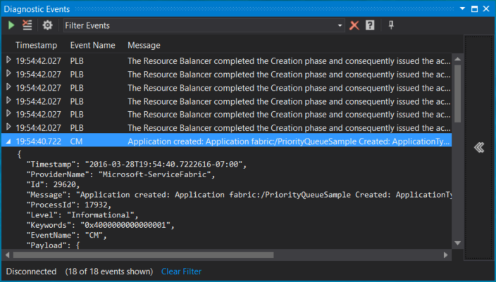

<properties
   pageTitle="Lokal überwachen und diagnostizieren Services mit Azure Service Fabric geschrieben | Microsoft Azure"
   description="Informationen Sie zum Überwachen und diagnostizieren Ihrer Dienste mit Microsoft Azure Service Fabric auf einem lokalen Entwicklungscomputer geschrieben."
   services="service-fabric"
   documentationCenter=".net"
   authors="ms-toddabel"
   manager="timlt"
   editor=""/>

<tags
   ms.service="service-fabric"
   ms.devlang="dotnet"
   ms.topic="article"
   ms.tgt_pltfrm="NA"
   ms.workload="NA"
   ms.date="09/06/2016"
   ms.author="toddabel"/>

# Überwachen und Diagnostizieren von Diensten in einer lokalen Computer Entwicklung einrichten

> [AZURE.SELECTOR]
- [Windows](service-fabric-diagnostics-how-to-monitor-and-diagnose-services-locally.md)
- [Linux](service-fabric-diagnostics-how-to-monitor-and-diagnose-services-locally-linux.md)

Überwachung, erkennen, bei der Diagnose und Problembehandlung zu ermöglichen Services mit minimaler Unterbrechung für die Benutzerfunktionalität fortsetzen. Während die Überwachung und Diagnose in einer Umgebung tatsächlichen bereitgestellten Herstellung entscheidend sind, wird der Effizienz hängen davon ab, ein ähnliches Modell eingeführt, während der Entwicklung von Diensten, um sicherzustellen, dass sie beim Wechsel zu einer realen Setup funktionieren. Dienst Fabric erleichtert Dienst Entwickler Diagnose implementiert wird, die sowohl in einem einzelnen Computer lokale Entwicklung Setups praktisches Herstellung Cluster Setups arbeiten können.

## Die Vorteile von Event Tracing for Windows
[Event Tracing für Windows](https://msdn.microsoft.com/library/windows/desktop/bb968803.aspx) (ETW) ist die empfohlene Technologie zum Tracing Nachrichten Service-Struktur. Gründe hierfür sind:

* **ETW ist machen.** Es wurde als Technologie Tracing erstellt, die minimalen Auswirkung auf die aufgezeichneten Zeiten Code hat.
* **ETW Tracing arbeitet nahtlos über die lokale Entwicklung Umgebungen und auch praktisches Cluster-Setups.** Dies bedeutet, dass Ihnen keine Tracing Code neu zu schreiben, wenn Sie zum Bereitstellen von Codes zu einem real Cluster bereit sind.
* **Dienst Fabric Systemcode verwendet ETW auch für interne Tracing.** So können Sie Ihre Anwendung auf überlappt mit Dienst Fabric System Spuren anzeigen. Außerdem können Sie die folgen und Wechselbeziehungen zwischen Ihrer Anwendungscode und Ereignisse im zugrunde liegenden System leichter zu verstehen.
* **Es gibt integrierter Unterstützung in Service Fabric Visual Studio-Tools zum Anzeigen von ETW-Ereignisse aus.**

## Zeigen Sie in Visual Studio Service Fabric Systemereignisse

Dienst Fabric gibt ETW-Ereignisse, um zu verstehen, was in der Plattform geschieht Entwickler Hilfe aus. Wenn Sie dies noch nicht getan haben, fortfahren Sie, und führen Sie die Schritte in [der ersten Anwendung in Visual Studio erstellen](service-fabric-create-your-first-application-in-visual-studio.md). Diese Informationen hilft Ihnen die Anwendung mit dem Diagnose Ereignisse Viewer mit der Spur Nachrichten abrufen und ausführen.

1. Wenn das Diagnose Ereignisse im Fenster nicht automatisch angezeigt wird, wechseln Sie zu der Registerkarte **Ansicht** in Visual Studio, und wählen Sie **Weitere Fenster** , und klicken Sie dann **Diagnostic Ereignisse Viewer**.

2. Jedes Ereignis hat standard-Metadaten-Informationen, die Sie darüber informiert Knoten, Anwendung und Dienst aus, die das Ereignis stammt. Sie können auch die Liste der Ereignisse filtern, mithilfe von am oberen Rand des Fensters Ereignisse im Feld **Ereignisse filtern** . Sie können beispielsweise Filtern auf **Knotennamen** oder **Service Name.** Und wenn bei Ereignisdetails gefunden haben, können Sie auch mithilfe der Schaltfläche **zeigen Sie** am oberen Rand des Fensters Ereignisse anhalten und fortsetzen später ohne Verlust von Ereignissen.

  

## Hinzufügen von Ihrer eigenen benutzerdefinierten Spuren zu Code der Anwendung
Die Dienst Fabric Visual Studio-Projektvorlagen enthalten Code Stichprobe. Der Code wird gezeigt, wie benutzerdefinierte Anwendung Code ETW Spuren hinzugefügt, die im Visual Studio ETW-Viewer zusammen mit Exchange-System Spuren aus Dienst angezeigt wird. Der Vorteil dieser Methode ist, dass Metadaten hinzugefügt wird automatisch auf und den Visual Studio Diagnostic Ereignisse Viewer bereits konfiguriert ist, um sie anzuzeigen.

Für Projekte, die von der Suche der **Dienstvorlagen** (statusfreie oder dynamische) nur für die `RunAsync` Implementierung:

1. Den Anruf an `ServiceEventSource.Current.ServiceMessage` in der `RunAsync` Methode zeigt ein Beispiel für eine benutzerdefinierte ETW Spur von Code der Anwendung.
2. Klicken Sie in der Datei **ServiceEventSource.cs** finden Sie eine Überladung für die `ServiceEventSource.ServiceMessage` Methode, die für häufig auftretenden Ereignisse aus Gründen der Leistung verwendet werden soll.

Für Projekte, die aus den **Akteur-Vorlagen** (statusfreie oder dynamische) erstellt wurden:

1. Öffnen Sie die **"Projektname".cs** -Datei, wobei *Projektname* der Name ist, Ihres Projekts Visual Studio festgelegt haben.  
2. Suchen Sie den Code `ActorEventSource.Current.ActorMessage(this, "Doing Work");` in der Methode *DoWorkAsync* .  Dies ist ein Beispiel für eine benutzerdefinierte ETW Spur vom Anwendungscode geschrieben.  
3. In der Datei **ActorEventSource.cs**, finden Sie eine Überladung für die `ActorEventSource.ActorMessage` Methode, die für häufig auftretenden Ereignisse aus Gründen der Leistung verwendet werden soll.

Nach dem Hinzufügen eines benutzerdefinierten ETW gezeichnet, die dem Dienst Code, können Sie erstellen, bereitstellen, und führen Sie die Anwendung erneut aus, um Ihre Ereignisse in den Diagnoseprotokollen Ereignisse Viewer finden Sie unter. Wenn Sie die Anwendung mit **F5**Debuggen, werden die Diagnose Ereignisse Viewer automatisch geöffnet.

## Nächste Schritte
Derselbe Code gezeichnet, den Sie an Ihrer Anwendung über für lokale Diagnose hinzugefügt funktionieren mit Tools, die Sie verwenden können, um diese Ereignisse beim Ausführen der Anwendung auf einem Azure Cluster anzeigen. Schauen Sie sich diesen Artikel, die die verschiedenen Optionen für die Tools diskutieren und beschreiben, wie Sie diese einrichten können.
* [Zum Sammeln von Protokollen mit Azure-Diagnose](service-fabric-diagnostics-how-to-setup-wad.md)
* [Verwenden ElasticSearch als ein Dienst Fabric Spur Anwendungsspeicher](service-fabric-diagnostic-how-to-use-elasticsearch.md)
