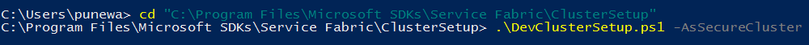
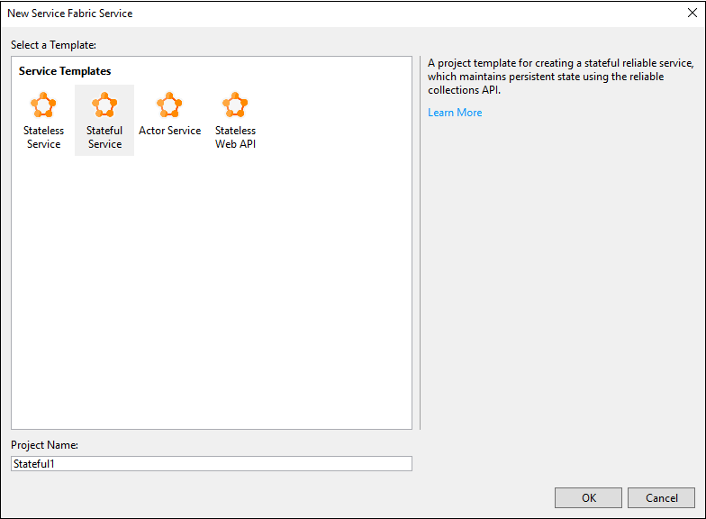
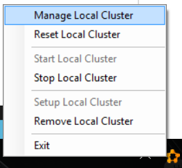
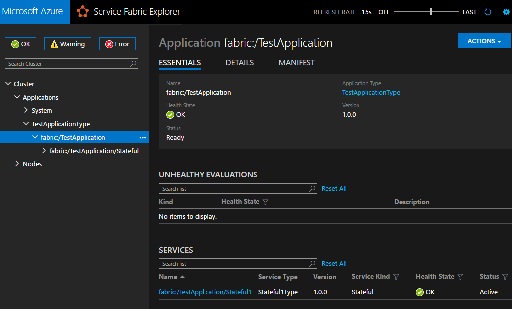
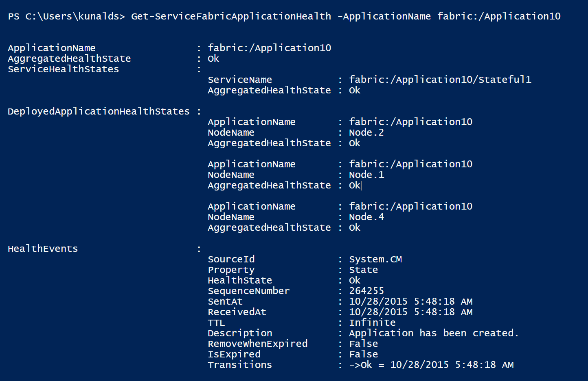
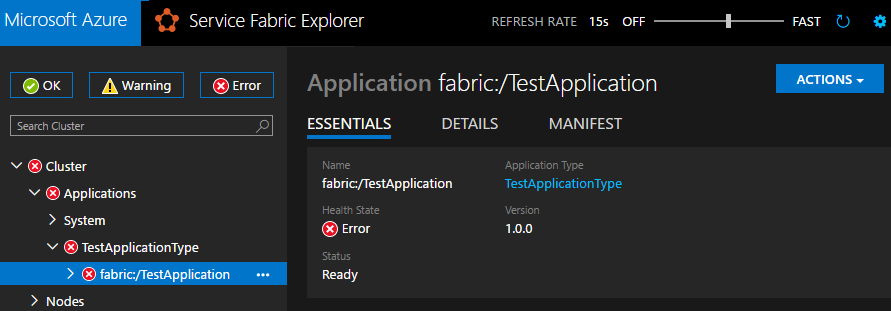
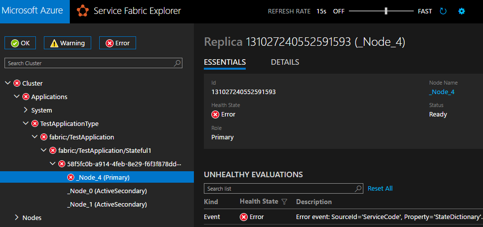

<properties
   pageTitle="Bericht, und aktivieren Sie Dienststatus mit Azure Service Fabric | Microsoft Azure"
   description="Erfahren Sie, wie Integritätsberichte Code Dienst gesendet und so überprüfen Sie die Integrität des Diensts mithilfe der Dienststatus Überwachungstools, die Azure Service Fabric bereitstellt."
   services="service-fabric"
   documentationCenter=".net"
   authors="toddabel"
   manager="mfussell"
   editor=""/>

<tags
   ms.service="service-fabric"
   ms.devlang="dotnet"
   ms.topic="article"
   ms.tgt_pltfrm="NA"
   ms.workload="NA"
   ms.date="09/06/2016"
   ms.author="toddabel"/>

# <a name="report-and-check-service-health"></a>Bericht und Kontrollkästchen-Dienststatus
Die Möglichkeit, beantworten und Beheben von Fälle und Ausfall hängt Ihrer Dienste Probleme auftreten, von der Möglichkeit zum schnellen erkennen, die Probleme ab. Wenn Sie Probleme und Fehler an den Azure Service Fabric-Dienststatus-Manager aus dem dienstleistungscode melden, können Sie die standardmäßigen Gesundheit Überwachungstools, der Dienst Fabric bereitstellt, um den Status zu überprüfen.

Es gibt zwei Methoden, um Sie vom Dienst Gesundheit Berichte erstellen können:

- Verwenden von [Partition](https://msdn.microsoft.com/library/system.fabric.istatefulservicepartition.aspx) oder [CodePackageActivationContext](https://msdn.microsoft.com/library/system.fabric.codepackageactivationcontext.aspx) Objekten.  
Sie können die `Partition` und `CodePackageActivationContext` Objekte, um die Integrität des Elemente, die im aktuellen Kontext gehören zu melden. Beispielsweise kann Code, die im Rahmen einer Replikation ausgeführt wird nur auf diesem Replikat, die Partition, der es gehört und die Anwendung, der es gehört Gesundheit melden.

- Verwenden Sie `FabricClient`.   
Sie können `FabricClient` Bericht Gesundheit aus dem Dienstcode, wenn der Cluster nicht [sichere](service-fabric-cluster-security.md) oder, wenn der Dienst mit Administratorberechtigungen ausgeführt wird. Dies wird nicht in den meisten realen Szenarien erfüllt werden. Mit `FabricClient`, Sie können Dienststatus auf einer beliebigen Person, die einen Teil der Cluster ist melden. Idealerweise sollte jedoch dienstleistungscode nur Berichte senden, die mit einem eigenen Gesundheit zusammenhängen.

In diesem Artikel führt Sie durch ein Beispiel, die aus dem Dienstcode Integritätsberichte. Im Beispiel wird auch an, wie die Tools, mit denen Dienst Fabric anderem verwendet werden können, um den Status zu prüfen. In diesem Artikel wird eine kurze Einführung in die Integrität Überwachungsfunktionen Dienst Stoffbahn werden soll. Ausführlichere Informationen finden Sie die Reihe von detaillierte Artikel zur Integrität, die mit den Link am Ende dieses Artikels beginnen.

## <a name="prerequisites"></a>Erforderliche Komponenten
Sie müssen Folgendes installiert sein:

   * Visual Studio 2015
   * Dienst Fabric SDK

## <a name="to-create-a-local-secure-dev-cluster"></a>So erstellen Sie einen lokale secure Entwickler cluster
- Öffnen Sie PowerShell mit admininistratorberechtigungen, und führen Sie die folgenden Befehle.



## <a name="to-deploy-an-application-and-check-its-health"></a>Bereitstellen einer Anwendung und deren Status überprüfen

1. Öffnen Sie Visual Studio als Administrator an.

2. Erstellen eines Projekts mithilfe der Vorlage **Stateful-Dienste** .

    

3. Drücken Sie **F5** , um die Anwendung im Debuggen-Modus ausgeführt. Die Anwendung wird auf dem lokalen Cluster bereitgestellt werden.

4. Nachdem Sie die Anwendung ausgeführt wird, mit der rechten Maustaste in des lokale Cluster Manager-Symbol im Benachrichtigungsbereich, und wählen Sie **Lokalen Cluster verwalten** , aus dem Kontextmenü zum Dienst Fabric-Explorer zu öffnen.

    

5. Die Anwendung Integrität sollen wie in diesem Bild angezeigt werden. Zu diesem Zeitpunkt sollte die Anwendung ohne Fehler fehlerfrei sein.

    

6. Sie können auch die Integrität mithilfe der PowerShell überprüfen. Sie können ```Get-ServiceFabricApplicationHealth``` So überprüfen Sie die Anwendung Gesundheit, und Sie können ```Get-ServiceFabricServiceHealth``` Zustand des Diensts überprüfen. Der Bericht Gesundheit für dieselbe Anwendung in PowerShell ist in diesem Bild.

    

## <a name="to-add-custom-health-events-to-your-service-code"></a>Benutzerdefinierte Integrität Ereignisse Ihr Service-Code hinzufügen
Die Dienst Fabric Project-Vorlagen in Visual Studio enthalten Code Stichprobe. Die folgenden Schritte zeigen, wie Sie benutzerdefinierte Systemereignisse aus dem dienstleistungscode Berichte erstellen können. Diese Berichte werden automatisch in den standard-Tools für die Überwachung des Systemzustands, dass Dienst Fabric, wie Dienst Fabric Explorer, Azure Portals Systemzustand anzeigen und PowerShell bereitstellt angezeigt.

1. Öffnen Sie die Anwendung, die Sie zuvor in Visual Studio erstellt haben, oder erstellen Sie eine neue Anwendung mithilfe der **Statusbehaftete Dienst** Visual Studio-Vorlage.

2. Öffnen Sie die Datei Stateful1.cs, und suchen Sie die `myDictionary.TryGetValueAsync` rufen Sie in der `RunAsync` Methode. Sie können sehen, dass diese Methode gibt eine `result` , enthält den aktuellen Wert der der Zähler, da die wichtige Logik in dieser Anwendung besteht darin, die Zählung ausgeführt. Wenn dies einer realen Anwendung wurden und das Fehlen des Ergebnisses ein Fehler dargestellt, würden Sie diesem Ereignis kennzeichnen möchten.

3. Zum Melden eines Gesundheit Ereignis aus, wenn das Ergebnis fehlen ein Fehlers darstellt, fügen Sie die folgenden Schritte aus.

    ein. Hinzufügen der `System.Fabric.Health` Namespace zu der Datei Stateful1.cs.

    ```csharp
    using System.Fabric.Health;
    ```

    b. Fügen Sie den folgenden Code nach der `myDictionary.TryGetValueAsync` anrufen

    ```csharp
    if (!result.HasValue)
    {
        HealthInformation healthInformation = new HealthInformation("ServiceCode", "StateDictionary", HealthState.Error);
        this.Partition.ReportReplicaHealth(healthInformation);
    }
    ```
    Wir melden Replikat Gesundheit, da es aus einem Dienst dynamische gemeldet wird. Die `HealthInformation` Parameter werden Informationen zu den Dienststatus Problem die gemeldete gespeichert.

    Wenn Sie einen statusfreien Dienst erstellt haben, verwenden Sie den folgenden code

    ```csharp
    if (!result.HasValue)
    {
        HealthInformation healthInformation = new HealthInformation("ServiceCode", "StateDictionary", HealthState.Error);
        this.Partition.ReportInstanceHealth(healthInformation);
    }
    ```

4. Wenn der Dienst mit Administratorberechtigungen ausgeführt wird oder wenn Cluster nicht [sicher](service-fabric-cluster-security.md)ist, Sie auch können `FabricClient` Bericht Gesundheit wie in den folgenden Schritten dargestellt.  

    ein. Erstellen der `FabricClient` Instanz fest, nach der `var myDictionary` Deklaration.

    ```csharp
    var fabricClient = new FabricClient(new FabricClientSettings() { HealthReportSendInterval = TimeSpan.FromSeconds(0) });
    ```

    b. Fügen Sie den folgenden Code nach der `myDictionary.TryGetValueAsync` anrufen.

    ```csharp
    if (!result.HasValue)
    {
       var replicaHealthReport = new StatefulServiceReplicaHealthReport(
            this.ServiceInitializationParameters.PartitionId,
            this.ServiceInitializationParameters.ReplicaId,
            new HealthInformation("ServiceCode", "StateDictionary", HealthState.Error));
        fabricClient.HealthManager.ReportHealth(replicaHealthReport);
    }
    ```

5. Lassen Sie uns dieser Fehler zu reproduzieren, und sehen Sie es in die Überwachungstools Systemzustand angezeigt. Um den Fehler zu reproduzieren, kommentieren Sie Sie aus der ersten Zeile in die Integrität reporting Code, die Sie zuvor hinzugefügt haben. Nachdem Sie die erste Zeile kommentiert haben, sieht der Code wie im folgenden Beispiel aus.

    ```csharp
    //if(!result.HasValue)
    {
        HealthInformation healthInformation = new HealthInformation("ServiceCode", "StateDictionary", HealthState.Error);
        this.Partition.ReportReplicaHealth(healthInformation);
    }
    ```
 In diesem Code wird nun Berichtsschema Gesundheit ausgelöst jedes Mal `RunAsync` ausgeführt wird. Nachdem Sie diese Änderung vorgenommen haben, drücken Sie **F5** , um die Anwendung ausführen.

6. Nach die Anwendung ausgeführt wird, öffnen Sie Dienst Fabric Explorer, um die Integrität der Anwendung zu überprüfen. Diesmal, zeigt die Dienst Fabric-Explorer, dass die Anwendung fehlerhaft ist. Dies ist aufgrund der Fehler, der vom Code gemeldet wurde, dass wir zuvor hinzugefügt.

    

7. Wenn Sie in der Strukturansicht des Diensts Fabric Explorer primäre Replikat auswählen, sehen Sie sich, dass **Zustand** einen Fehler zurück, auch weist darauf hin. Dienst Fabric Explorer zeigt auch den Dienststatus Berichtdetails, die hinzugefügt wurden die `HealthInformation` Parameter in den Code. Sie können die gleichen Integritätsberichte in PowerShell und Azure-Portal anzeigen.

    

Dieser Bericht bleibt in den Diagnose-Manager, bis sie ersetzt wird, von einem anderen Bericht oder bis dieses Replikats gelöscht wird. Da wir nicht festgelegt haben `TimeToLive` für diesen Bericht Dienststatus in der `HealthInformation` -Objekt, der Bericht nie abläuft.

Es empfiehlt sich, dass der Dienststatus auf die am häufigsten präzise Ebene gemeldet werden sollen, in diesem Fall das Replikat. Sie können auch Dienststatus auf melden `Partition`.

```csharp
HealthInformation healthInformation = new HealthInformation("ServiceCode", "StateDictionary", HealthState.Error);
this.Partition.ReportPartitionHealth(healthInformation);
```

Bericht Gesundheit auf `Application`, `DeployedApplication`, und `DeployedServicePackage`, verwenden Sie `CodePackageActivationContext`.

```csharp
HealthInformation healthInformation = new HealthInformation("ServiceCode", "StateDictionary", HealthState.Error);
var activationContext = FabricRuntime.GetActivationContext();
activationContext.ReportApplicationHealth(healthInformation);
```

## <a name="next-steps"></a>Nächste Schritte
[Tiefer Dienst Fabric Integrität](service-fabric-health-introduction.md)
