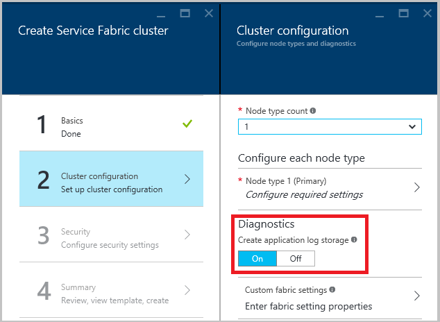

<properties
   pageTitle="Protokoll speichern mithilfe von Azure-Diagnose | Microsoft Azure"
   description="Dieser Artikel beschreibt, wie Azure-Diagnose zum Sammeln von Protokollen aus einem Dienst Fabric Cluster in Azure ausgeführt einrichten."
   services="service-fabric"
   documentationCenter=".net"
   authors="ms-toddabel"
   manager="timlt"
   editor=""/>

<tags
   ms.service="service-fabric"
   ms.devlang="dotnet"
   ms.topic="article"
   ms.tgt_pltfrm="NA"
   ms.workload="NA"
   ms.date="09/28/2016"
   ms.author="toddabel"/>


# <a name="collect-logs-by-using-azure-diagnostics"></a>Protokoll speichern mithilfe von Azure-Diagnose

> [AZURE.SELECTOR]
- [Windows](service-fabric-diagnostics-how-to-setup-wad.md)
- [Linux](service-fabric-diagnostics-how-to-setup-lad.md)

Wenn Sie einen Azure Service Fabric Cluster ausführen, ist es eine gute Idee, die Protokolle aus allen Knoten an einer zentralen Stelle zu sammeln. Haben Sie die Protokolle an einem zentralen Ort hilft analysieren und Behandeln von Problemen in Ihren Cluster oder Probleme in der Anwendungen und Dienste, die in diesem Cluster ausgeführt.

Eine Möglichkeit zum Hochladen und Protokoll speichern besteht darin, die Erweiterung Azure-Diagnose verwenden, die Protokolle zu Azure-Speicher hochgeladen wird. Die Protokolle sind nicht direkt im Speicher, hilfreich. Sie können jedoch über einen externen Prozess die Ereignisse aus Speicher gelesen und in einem Produkt wie [Log Analytics](../log-analytics/log-analytics-service-fabric.md), [Flexible suchen](service-fabric-diagnostic-how-to-use-elasticsearch.md)oder eine andere Log analysieren Lösung zu platzieren.

## <a name="prerequisites"></a>Erforderliche Komponenten
Sie können diese Tools verwenden, um einige der Vorgänge in diesem Dokument auszuführen:

* [Azure-Diagnose](../cloud-services/cloud-services-dotnet-diagnostics.md) (im Zusammenhang mit Azure Cloud Services besitzt aber gute Informationen und Beispiele)
* [Azure Ressourcenmanager](../azure-resource-manager/resource-group-overview.md)
* [Azure PowerShell](../powershell-install-configure.md)
* [Azure Ressourcenmanager client](https://github.com/projectkudu/ARMClient)
* [Azure Ressourcenmanager Vorlage](../virtual-machines/virtual-machines-windows-extensions-diagnostics-template.md)


## <a name="log-sources-that-you-might-want-to-collect"></a>Log-Datenquellen, die Sie sammeln möchten möglicherweise
- **Dienst Fabric Protokolle**: von der Plattform in herkömmliche Event Tracing for Windows (ETW) und Quelle Kanäle ausgegeben. Verschiedene Typen möglich von Protokollen:
  - Betrieb Ereignisse: Protokolle für Vorgänge, die die Dienst Fabric Plattform ausführt. Beispiele für sind Erstellen von Applications und Webdiensten, ändert sich Knoten und Upgrade-Informationen.
  - [Zuverlässigen Akteuren programming Modell Ereignisse](service-fabric-reliable-actors-diagnostics.md)
  - [Zuverlässigen Services programming Modell Ereignisse](service-fabric-reliable-services-diagnostics.md)
- **Anwendungsereignisse**: Ereignisse von des Diensts Code ausgegeben und ausgeschrieben mithilfe der Quelle Helper-Klasse in Visual Studio-Vorlagen bereitgestellt. Weitere Informationen zum Schreiben von Protokollen aus Ihrer Anwendung finden Sie unter [Überwachen und Diagnostizieren von Diensten in einer lokalen Computer Entwicklung Setup](service-fabric-diagnostics-how-to-monitor-and-diagnose-services-locally.md).


## <a name="deploy-the-diagnostics-extension"></a>Bereitstellen der Diagnose-Erweiterung
Dieser erste Schritt in Erfassung von Protokollen besteht die Erweiterung Diagnose auf jeder der den virtuellen Computern in den Dienst Fabric Cluster bereitstellen. Die Erweiterung Diagnose sammelt Protokolle jedes virtuellen Computers und uploads können mit dem Speicherkonto aus, dem Sie angeben. Die Schritte hängen etwas, ob Sie die Azure-Portal oder Ressourcenmanager Azure verwenden. Die Schritte hängen auch, ob die Bereitstellung ist Bestandteil der Clustererstellung oder für einen Cluster, der bereits vorhanden ist. Sehen wir uns die Schritte für jedes Szenario.

### <a name="deploy-the-diagnostics-extension-as-part-of-cluster-creation-through-the-portal"></a>Bereitstellen Sie die Erweiterung Diagnose als Teil der Clustererstellung über das portal
Um die Erweiterung Diagnose mit den virtuellen Computern im Cluster als Teil der Clustererstellung bereitstellen, verwenden Sie das Bedienfeld Diagnose Einstellungen in der folgenden Abbildung dargestellt. Um zuverlässigen Akteuren oder zuverlässigen Services Ereignis Websitesammlung aktivieren, stellen Sie sicher, dass Diagnose **auf** (die Standardeinstellung) festgelegt ist. Nach dem Erstellen des Clusters können Sie diese Einstellungen Verwenden des Portals ändern.



Die Azure Support Team *erfordert* Unterstützung meldet um alle Kundendienstanfragen zu beheben, die Sie erstellen. Diese Protokolle in Echtzeit zusammengestellt werden, und es werden in einem der in der Ressourcengruppe erstellten Speicherkonten gespeichert. Die Diagnose konfigurieren Anwendung Ebene Ereignisse an. Diese Ereignisse gehören [Zuverlässigen Akteuren](service-fabric-reliable-actors-diagnostics.md) Ereignisse, [Zuverlässigen Dienste](service-fabric-reliable-services-diagnostics.md) auch einige System Ebene Dienst Fabric Ereignisse in Azure Storage gespeichert werden soll.

Produkte wie etwa [Flexible suchen](service-fabric-diagnostic-how-to-use-elasticsearch.md) oder einen eigenen Prozess können die Ereignisse aus dem Konto Speicherplatz erhalten. Derzeit Möglichkeit keine, filtern oder optimieren, die die Ereignisse aus, die in der Tabelle gesendet werden. Wenn Sie einen Prozess, um die Ereignisse aus der Tabelle entfernen implementieren nicht, wird die Tabelle weiterhin wächst.

Wenn Sie einen Cluster mithilfe des Portals erstellen, empfohlen, dass Sie die Vorlage *, bevor Sie klicken Sie auf * *OK*herunterladen ** Cluster erstellen. Details finden Sie in [einem Dienst Fabric Cluster mithilfe einer Vorlage Azure Ressourcenmanager einrichten](service-fabric-cluster-creation-via-arm.md). Sie benötigen die Vorlage später Änderungen vornehmen, da Sie Ihre Änderungen vorgenommen haben können nicht mithilfe des Portals.

Sie können Vorlagen aus dem Portal exportieren, indem Sie mit den folgenden Schritten. Diese Vorlagen kann jedoch schwieriger zu verwenden, da sie null-Werte möglicherweise, die erforderlichen Informationen fehlen.

1. Öffnen Sie Ihre Ressourcengruppe ein.
2. Wählen Sie **Einstellungen für** den Bereich "Einstellungen" angezeigt.
3. Wählen Sie **Bereitstellungen** der Bereitstellung Bedienfeld "Verlauf" angezeigt werden.
4. Wählen Sie eine Bereitstellung, um die Details der Bereitstellung anzuzeigen.
5. Wählen Sie die **Vorlage exportieren** , klicken Sie im Bereich Vorlage angezeigt werden.
6. Wählen Sie die **Datei speichern** , in eine ZIP-Datei exportieren, die der Vorlage, Parameter und PowerShell-Dateien enthält.

Nachdem Sie die Dateien exportiert haben, müssen Sie eine Änderung vornehmen. Bearbeiten Sie die Datei parameters.json, und entfernen Sie das Element **AdminPassword** . Dadurch wird eine Aufforderung das Kennwort, wenn das Bereitstellungsskript ausgeführt wird. Wenn Sie das Bereitstellungsskript ausführen, müssen Sie möglicherweise null-Parameterwerte zu beheben.

Um die heruntergeladene Vorlage verwenden, um eine Konfiguration aktualisieren:

1. Extrahieren Sie den Inhalt in einem Ordner auf Ihrem lokalen Computer an.
2. Ändern Sie den Inhalt aus, um die neue Konfiguration angezeigt.
3. Starten Sie der PowerShell und zu dem Ordner, in dem Sie den Inhalt extrahiert, ändern.
4. Führen Sie **deploy.ps1** , und füllen Sie die Abonnement-ID, den Namen der Ressource Gruppe (verwenden Sie den bestehenden Namen Aktualisierung die Konfiguration) und einen Namen für die eigene Bereitstellung.


### <a name="deploy-the-diagnostics-extension-as-part-of-cluster-creation-by-using-azure-resource-manager"></a>Bereitstellen der Diagnose Erweiterung als Teil der Clustererstellung mithilfe von Azure Ressourcenmanager
Zum Erstellen eines Clusters mithilfe von Ressourcenmanager müssen Sie die vollständige Cluster Ressourcenmanager Vorlage die JSON-Diagnose: Konfiguration hinzufügen, bevor Sie Cluster erstellen. Wir bieten eine Beispielvorlage fünf-virtuellen Computer Cluster Ressourcenmanager Diagnose-Konfiguration, die sie als Teil unserer Ressourcenmanager Vorlagenbeispiele hinzugefügt. Sie können an dieser Stelle im Katalog Azure Beispiele anzeigen: [Cluster mit fünf Knoten mit Diagnose Ressourcenmanager Vorlage Stichprobe](https://github.com/Azure/azure-quickstart-templates/tree/master/service-fabric-secure-cluster-5-node-1-nodetype-wad).

Um die Einstellung Diagnose in der Vorlage Ressourcenmanager anzeigen möchten, öffnen Sie die Datei azuredeploy.json und suchen Sie nach **IaaSDiagnostics**. Um einen Cluster mithilfe dieser Vorlage zu erstellen, die wählen Sie **in Azure bereitstellen** Schaltfläche über den vorherigen Link aus.

Alternativ Sie laden Sie das Beispiel Ressourcenmanager, ändern und erstellen Sie einen Cluster mit die geänderte Vorlage mithilfe der `New-AzureRmResourceGroupDeployment` -Befehl in ein Azure PowerShell-Fenster. Finden Sie unter den folgenden Code für die Parameter, die Sie an den Befehl übergeben. Ausführliche Informationen zu eine Ressourcengruppe mithilfe der PowerShell bereitstellen finden Sie im Artikel [Bereitstellen einer Ressourcengruppe mit der Ressourcenmanager Azure-Vorlage](../resource-group-template-deploy.md).

```powershell

New-AzureRmResourceGroupDeployment -ResourceGroupName $resourceGroupName -Name $deploymentName -TemplateFile $pathToARMConfigJsonFile -TemplateParameterFile $pathToParameterFile –Verbose
```

### <a name="deploy-the-diagnostics-extension-to-an-existing-cluster"></a>Bereitstellen der Diagnose Erweiterung zu einem vorhandenen cluster
Wenn Sie einen vorhandenen Cluster haben, der Diagnose bereitgestellt hat, oder wenn Sie eine vorhandene Konfiguration ändern möchten, können Sie hinzufügen oder aktualisieren. Ändern Sie die Vorlage Ressourcenmanager, mit dem vorhandenen Cluster erstellen oder die Vorlage aus dem Portal herunterladen, wie zuvor beschrieben. Ändern Sie die Datei template.json, indem Sie die folgenden Aufgaben ausführen.

Fügen Sie eine neue Speicherressource in die Vorlage, indem dem Abschnitt Ressourcen hinzufügen.

```json
{
  "apiVersion": "2015-05-01-preview",
  "type": "Microsoft.Storage/storageAccounts",
  "name": "[parameters('applicationDiagnosticsStorageAccountName')]",
  "location": "[parameters('computeLocation')]",
  "properties": {
    "accountType": "[parameters('applicationDiagnosticsStorageAccountType')]"
  },
  "tags": {
    "resourceType": "Service Fabric",
    "clusterName": "[parameters('clusterName')]"
  }
},
```

 Fügen Sie im Abschnitt Parameter nur nach der Definition der Speicher-Konto, zwischen `supportLogStorageAccountName` und `vmNodeType0Name`. Ersetzen Sie den Platzhalter Text *Speicher Kontonamen Hier können Sie* mit dem Namen des Speicherkontos aus.

```json
    "applicationDiagnosticsStorageAccountType": {
      "type": "string",
      "allowedValues": [
        "Standard_LRS",
        "Standard_GRS"
      ],
      "defaultValue": "Standard_LRS",
      "metadata": {
        "description": "Replication option for the application diagnostics storage account"
      }
    },
    "applicationDiagnosticsStorageAccountName": {
      "type": "string",
      "defaultValue": "storage account name goes here",
      "metadata": {
        "description": "Name for the storage account that contains application diagnostics data from the cluster"
      }
    },
```
Klicken Sie dann Aktualisieren der `VirtualMachineProfile` Abschnitt der Datei template.json durch den folgenden Code innerhalb des Arrays Erweiterungen hinzufügen. Achten Sie darauf, fügen Sie ein Semikolon am Anfang oder Ende, je nachdem, wo sie eingefügt wird.

```json
{
    "name": "[concat(parameters('vmNodeType0Name'),'_Microsoft.Insights.VMDiagnosticsSettings')]",
    "properties": {
        "type": "IaaSDiagnostics",
        "autoUpgradeMinorVersion": true,
        "protectedSettings": {
        "storageAccountName": "[parameters('applicationDiagnosticsStorageAccountName')]",
        "storageAccountKey": "[listKeys(resourceId('Microsoft.Storage/storageAccounts', parameters('applicationDiagnosticsStorageAccountName')),'2015-05-01-preview').key1]",
        "storageAccountEndPoint": "https://core.windows.net/"
        },
        "publisher": "Microsoft.Azure.Diagnostics",
        "settings": {
        "WadCfg": {
            "DiagnosticMonitorConfiguration": {
            "overallQuotaInMB": "50000",
            "EtwProviders": {
                "EtwEventSourceProviderConfiguration": [
                {
                    "provider": "Microsoft-ServiceFabric-Actors",
                    "scheduledTransferKeywordFilter": "1",
                    "scheduledTransferPeriod": "PT5M",
                    "DefaultEvents": {
                    "eventDestination": "ServiceFabricReliableActorEventTable"
                    }
                },
                {
                    "provider": "Microsoft-ServiceFabric-Services",
                    "scheduledTransferPeriod": "PT5M",
                    "DefaultEvents": {
                    "eventDestination": "ServiceFabricReliableServiceEventTable"
                    }
                }
                ],
                "EtwManifestProviderConfiguration": [
                {
                    "provider": "cbd93bc2-71e5-4566-b3a7-595d8eeca6e8",
                    "scheduledTransferLogLevelFilter": "Information",
                    "scheduledTransferKeywordFilter": "4611686018427387904",
                    "scheduledTransferPeriod": "PT5M",
                    "DefaultEvents": {
                    "eventDestination": "ServiceFabricSystemEventTable"
                    }
                }
                ]
            }
            }
        },
        "StorageAccount": "[parameters('applicationDiagnosticsStorageAccountName')]"
        },
        "typeHandlerVersion": "1.5"
    }
}
```

Nachdem Sie die Datei template.json ändern, wie beschrieben, veröffentlichen Sie die Vorlage Ressourcenmanager erneut. Wenn die Vorlage exportiert wurden, dann das Ausführen der Datei deploy.ps1 die Vorlage aus. Nach der Bereitstellung, stellen Sie sicher, dass **ProvisioningState** **wurde erfolgreich abgeschlossen**ist.


## <a name="update-diagnostics-to-collect-and-upload-logs-from-new-eventsource-channels"></a>Aktualisieren Sie die Diagnose zum Sammeln und Hochladen der Protokolle von neue Quelle Kanäle
Aktualisieren Sie die Diagnose zum Sammeln von Protokollen von neue Quelle Kanäle, die eine neue Anwendung, die Sie gerade bereitzustellen darstellen, führen Sie dieselben Schritte wie im [vorherigen Abschnitt](#deploywadarm) für die Einrichtung der Diagnose für einen vorhandenen Cluster.

Aktualisieren der `EtwEventSourceProviderConfiguration` Abschnitt in der Datei template.json zum Hinzufügen von Einträgen für die neue Quelle Kanäle, bevor Sie die Konfiguration anwenden mithilfe Aktualisieren der `New-AzureRmResourceGroupDeployment` PowerShell-Befehl. Der Name der Ereignisquelle ist als Teil des Codes in der Datei ServiceEventSource.cs Visual Studio generiert definiert.

Angenommen, wenn Ihre Quelle Meine Quelle benannt wird, fügen Sie den folgenden Code um die Ereignisse aus Meine Quelle in eine Tabelle mit dem Namen MyDestinationTableName zu platzieren.

```json
        {
            "provider": "My-Eventsource",
            "scheduledTransferPeriod": "PT5M",
            "DefaultEvents": {
            "eventDestination": "MyDestinationTableName"
            }
        }
```

Um Leistungsindikatoren oder Ereignisprotokollen zu erfassen, ändern Sie die Vorlage Ressourcenmanager mithilfe der Beispiele finden Sie unter zu [erstellender einem Windows-Computer mit für die Überwachung und Diagnose mithilfe einer Vorlage Azure Ressourcenmanager](../virtual-machines/virtual-machines-windows-extensions-diagnostics-template.md)aus. Klicken Sie dann erneut veröffentlichen der Ressourcenmanager Vorlage aus.

## <a name="next-steps"></a>Nächste Schritte
Weitere Details zum welche Ereignisse Sie beim Beheben von Problemen achten finden Sie unter diagnostic Ereignisse für [Zuverlässigen Akteuren](service-fabric-reliable-actors-diagnostics.md) und [Zuverlässigen Services](service-fabric-reliable-services-diagnostics.md)ausgegeben.


## <a name="related-articles"></a>Verwandte Artikel
* [Erfahren Sie, wie Datenquellen oder Protokolle mithilfe der Diagnose Erweiterung sammeln](../virtual-machines/virtual-machines-windows-extensions-diagnostics-template.md)
* [Dienst Fabric-Lösung in Log Analytics](../log-analytics/log-analytics-service-fabric.md)
