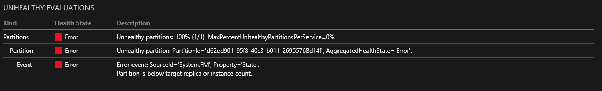

<properties
   pageTitle="Behandlung von Problemen mit Ereignis Tracing | Microsoft Azure"
   description="Die am häufigsten auftretenden Probleme beim Bereitstellen von Diensten auf Microsoft Azure Service Fabric aufgetreten."
   services="service-fabric"
   documentationCenter=".net"
   authors="mattrowmsft"
   manager="timlt"
   editor=""/>

<tags
   ms.service="service-fabric"
   ms.devlang="dotnet"
   ms.topic="article"
   ms.tgt_pltfrm="NA"
   ms.workload="NA"
   ms.date="03/31/2016"
   ms.author="mattrow"/>

# Problembehandlung bei häufige Probleme bei der Bereitstellung von Dienstleistungen auf Azure Service Fabric

Wenn Sie auf Ihrem Computer Developer Services ausführen, ist es [Visual Studio für das Debuggen Tools](service-fabric-diagnostics-how-to-monitor-and-diagnose-services-locally.md)einfach zu verwenden. Für remote-Cluster sind [Integritätsberichte](service-fabric-view-entities-aggregated-health.md) immer ein guter starten. Die einfachsten Verfahren zum Zugreifen auf diese Berichte sind über PowerShell oder [umfassende](service-fabric-visualizing-your-cluster.md). In diesem Artikel wird vorausgesetzt, dass Sie einen remote Cluster Debuggen und grundlegende Kenntnisse zum Verwenden eines dieser Tools haben.

##Zum Absturz der Anwendung
Die "Partition ist unter adressieren Replikat oder Instanz zählen" Bericht ist ein guter Indikator, die der Dienst abstürzt. Um herauszufinden dauert, wo das Abstürzen des Diensts etwas mehr Untersuchung. Wenn bei der Dienst ausgeführt wird, werden Ihrem beste Freund eine Reihe von gut durchdachtes auf.  Es wird empfohlen, Sie versuchen für diese Spuren sammeln und verwenden eine Lösung für eine [Flexible suchen](service-fabric-diagnostic-how-to-use-elasticsearch.md) zum Anzeigen und Durchsuchen die Spuren [Azure-Diagnose](service-fabric-diagnostics-how-to-setup-wad.md) .

###Während der Dienst oder Akteur Initialisierung
Alle Ausnahmen vor der Initialisierung des Diensttyps werden den Prozess zum Absturz verursacht. Für diese Art von Abstürzen wird das Anwendungsereignisprotokoll des Fehlers aus dem Dienst angezeigt.
Dies sind die am häufigsten auftretenden Ausnahmen vor der Initialisierung des Diensts angezeigt.

***System.IO.FileNotFoundException***

Dieser Fehler wird häufig aufgrund fehlender Assemblyabhängigkeiten. Überprüfen Sie die CopyLocal-Eigenschaft in Visual Studio oder dem globalen Assemblycache für den Knoten.

***System.Runtime.InteropServices.COMException***
 *bei System.Fabric.Interop.NativeRuntime+IFabricRuntime.RegisterStatefulServiceFactory (IntPtr, IFabricStatefulServiceFactory)*
 
 Dies zeigt an, dass der registrierte Diensttypname nicht Servicemanifests übereinstimmt.

Ereignisprotokoll der Anwendung für alle Ihre Knoten automatisch hochladen können [Azure-Diagnose](service-fabric-diagnostics-how-to-setup-wad.md) konfiguriert sein.

###RunAsync() oder OnActivateAsync()
Wenn der Absturz bei der Initialisierung oder Ausführung von registrierten Diensttyp oder Akteur geschieht, wird die Ausnahme Azure Service Fabric abgefangen werden. Sie können diese aus der Quelle Anbieter detaillierte im Abschnitt "Nächste Schritte" anzeigen.

## Nächste Schritte

Weitere Informationen zu vorhandenen Diagnose von Fabric-Dienst bereitgestellt:

* [Zuverlässigen Akteuren-Diagnose](service-fabric-reliable-actors-diagnostics.md)
* [Zuverlässigen Services-Diagnose](service-fabric-reliable-services-diagnostics.md)
