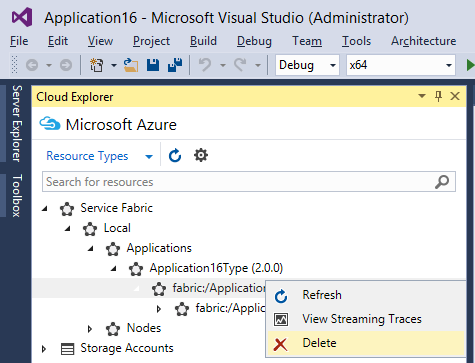

<properties
   pageTitle="Verwalten Ihrer Anwendung in Visual Studio | Microsoft Azure"
   description="Formular mit Visual Studio erstellen, entwickeln, packen, bereitstellen und Debuggen von Applications Dienst Fabric und Dienstleistungen."
   services="service-fabric"
   documentationCenter=".net"
   authors="seanmck"
   manager="timlt"
   editor=""/>

<tags
   ms.service="service-fabric"
   ms.devlang="dotnet"
   ms.topic="article"
   ms.tgt_pltfrm="na"
   ms.workload="na"
   ms.date="09/09/2016"
   ms.author="seanmck;mikhegn"/>

# Verwenden Sie Visual Studio um zu vereinfachen, schreiben und Verwalten von Ihrem Dienst Fabric Applikationen

Sie können Ihre Azure Service Fabric Anwendungen und Dienste über Visual Studio verwalten. Nachdem Sie das [Einrichten Ihrer Entwicklungsumgebung](service-fabric-get-started.md)haben, können Sie Visual Studio Service Fabric Applications erstellen, Services oder Paket, Register hinzufügen und Bereitstellen von Applications in Ihrem lokalen Entwicklung Cluster.

## Bereitstellen der Fabric Service-Anwendung

Standardmäßig kombiniert Bereitstellen einer Anwendung zu einer einfachen Operation die folgenden Schritte aus:

1. Erstellen der Anwendungspakets
2. Hochladen der Anwendungspakets auf dem Bild store
3. Registrieren des Anwendungstyps
4. Entfernen alle Anwendungsinstanzen ausführen
5. Erstellen einer neuen Anwendungsinstanz

In Visual Studio drücken **F5** werden auch die Anwendung bereitstellen und Debuggen Sie alle Anwendungsinstanzen. Können Sie **STRG + F5** Anwendung ohne Debuggen bereitstellen, oder Sie können auf einem lokalen oder remote-Cluster mithilfe des Veröffentlichungsprofils veröffentlichen. Weitere Informationen finden Sie unter [Veröffentlichen einer Anwendung zu einem remote Cluster mit Visual Studio](service-fabric-publish-app-remote-cluster.md).

### Anwendung Debuggen Modus

Standardmäßig Visual Studio entfernt vorhandene Instanzen von Ihrem Anwendungstyp, wenn Sie aufhören, für das Debuggen oder (Wenn Sie die app bereitgestellt, ohne den Debugger anfügen), wenn Sie die Anwendung erneut bereitstellen. In diesem Fall werden alle für die Anwendung Daten entfernt. Beim Debuggen lokal, Sie möchten die Daten beibehalten möchten, die Sie bereits erstellt haben, wenn Sie eine neue Version der Anwendung testen, die Ausführung der Anwendung beibehalten werden soll, oder nachfolgenden Debuggen Sitzungen die Anwendung aktualisiert werden soll. Tools für Visual Studio Fabric bieten eine Eigenschaft mit dem Namen der **Anwendung Debuggen Modus**, welche Steuerelemente, ob die **F5** Sie die Anwendung deinstallieren sollten, behalten die Anwendung ausführen, nachdem eine Sitzung Debuggen endet oder aktivieren die Anwendung Upgrade auf nachfolgende Debuggen Sitzungen, statt entfernt und erneut bereitgestellt werden müssen.

#### Zum Festlegen der Eigenschaft Anwendung Debuggen Modus

1. Kontextmenü für die Anwendung des Projekts wählen Sie **Eigenschaften** aus (oder drücken Sie **F4** ).
2. Legen Sie im **Eigenschaftenfenster** der **Anwendung Debuggen Modus** -Eigenschaft aus.

    ![Festlegen der Eigenschaft der Anwendung Debuggen-Modus][debugmodeproperty]

Dies sind die **Anwendung Debuggen Modus** Optionen zur Verfügung.

1. **Auto Upgrade**: die Anwendung weiterhin ausgeführt werden, wenn die Debuggen-Sitzung beendet wird. Die nächste **F5** die Bereitstellung ein Upgrade behandelt als mithilfe des unbeaufsichtigten Auto-Modus so aktualisieren Sie die Anwendung auf eine neuere Version schnell mit Datumszeichenfolge angefügt. Der Upgradeprozess behält alle Daten, die Sie in einer früheren Debuggen Sitzung eingegeben haben.

2. **Beibehalten der Anwendung**: die Anwendung behält im Cluster ausgeführt, wenn die Debuggen-Sitzung beendet wird. Klicken Sie auf der nächsten **F5** die Anwendung entfernt werden und die neu erstellte Anwendung wird mit dem Cluster bereitgestellt werden.

3. **Entfernen der Anwendung** bewirkt, dass die Anwendung entfernt werden, wenn die Debuggen-Sitzung beendet wird.

Für die **Automatische Aktualisierung** Daten werden durch die Anwendung Upgrade Funktionen Dienst Stoffbahn Anwenden beibehalten, aber es ist optimiert, um die Leistung statt der Sicherheit zu optimieren. Weitere Informationen zum Aktualisieren von Applications und wie Sie eine Aktualisierung in einer realen Umgebung durchführen können finden Sie unter [upgrade Fabric Service-Anwendung](service-fabric-application-upgrade.md).

![Beispiel für die neue Version der Anwendung mit Datum angefügt][preservedata]

>[AZURE.NOTE] Diese Eigenschaft vorhanden nicht vor Version 1.1 der Dienst Fabric-Tools für Visual Studio. Verwenden Sie vor 1.1 die Eigenschaft **Daten beibehalten auf Starten Sie** das gleiche Verhalten zu erzielen. Die Option "Anwendung beibehalten" wurde in Version 1.2 der Dienst Fabric-Tools für Visual Studio eingeführt werden.

## Dienst an Ihrer Anwendung Fabric Dienst hinzufügen

Sie können neue Dienste hinzufügen, an Ihrer Anwendung, deren Funktionalität zu erweitern.  Um sicherzustellen, dass der Dienst in Ihrer Anwendungspaket enthalten ist, fügen Sie den Dienst über das Menüelement **Fabric... Service** hinzu.

![Hinzufügen eines neuen Fabric-Diensts an Ihrer Anwendung][newservice]

Wählen Sie einen Dienst Fabric Projekttyp an Ihrer Anwendung hinzufügen, und geben Sie einen Namen für den Dienst.  Finden Sie unter [Auswählen eines Rahmens für den Dienst](service-fabric-choose-framework.md) , damit Sie entscheiden, welche Diensttyp verwenden können.

![Wählen Sie einen Projekttyp Fabric Service an Ihrer Anwendung hinzufügen][addserviceproject]

Der neue Dienst werden Ihrer Lösung und Paket mit vorhandenen Anwendung hinzugefügt werden. Der Dienstverweise und einer Standardinstanz-Dienst werden das Anwendungsmanifest hinzugefügt werden. Der Dienst wird erstellt und das nächste Mal der Anwendung bereitstellen gestartet werden.

![Der neue Dienst werden Ihrer Anwendungsmanifest hinzugefügt werden][newserviceapplicationmanifest]

## Vorbereiten der Fabric Service-Anwendungs

Wenn Sie die Anwendung und seine Dienste in einem Cluster bereitstellen, müssen Sie ein Anwendungspaket zu erstellen.  Das Paket organisiert Anwendungsmanifest, Dienst/die Anwendungsmanifeste und anderen erforderlichen Dateien in einem bestimmten Layout.  Visual Studio wird eingerichtet und verwaltet das Paket im Ordner des Projekts der Anwendung im Verzeichnis 'Pkg'.  Auf **Paket** aus dem Kontextmenü **Anwendung** erstellt oder aktualisiert das Anwendungspaket.  Möglicherweise möchten dies tun, wenn Sie die Anwendung mithilfe von benutzerdefinierten PowerShell-Skripts bereitstellen.

## Entfernen von Applications und Anwendungstypen mithilfe des Cloud-Explorers

Sie können Operationen grundlegende Cluster Management von in Visual Studio mit der Cloud-Explorer, in dem Sie aus dem Menü **Ansicht** starten können. Beispielsweise können Sie Applikationen löschen und Aufheben der Anwendungstypen auf lokale oder remote-Cluster.

>[AZURE.TIP] Cluster Management Funktionsumfang finden Sie unter [Cluster mit Service Fabric Explorer Visualisierung](service-fabric-visualizing-your-cluster.md).

<!--Every topic should have next steps and links to the next logical set of content to keep the customer engaged-->
## Nächste Schritte

- [Dienst Fabric Anwendungsmodell](service-fabric-application-model.md)
- [Bereitstellung von Fabric Service-Anwendung](service-fabric-deploy-remove-applications.md)
- [Verwalten von Anwendungsparameter für mehrere Umgebungen](service-fabric-manage-multiple-environment-app-configuration.md)
- [Debuggen der Fabric Service-Anwendung](service-fabric-debugging-your-application.md)
- [Visualisieren Ihren Cluster mithilfe der Dienst Fabric-Explorer](service-fabric-visualizing-your-cluster.md)

<!--Image references-->
[addserviceproject]:./media/service-fabric-manage-application-in-visual-studio/addserviceproject.png
[manageservicefabric]: ./media/service-fabric-manage-application-in-visual-studio/manageservicefabric.png
[newservice]:./media/service-fabric-manage-application-in-visual-studio/newservice.png
[newserviceapplicationmanifest]:./media/service-fabric-manage-application-in-visual-studio/newserviceapplicationmanifest.png
[preservedata]:./media/service-fabric-manage-application-in-visual-studio/preservedata.png
[debugmodeproperty]:./media/service-fabric-manage-application-in-visual-studio/debugmodeproperty.png
