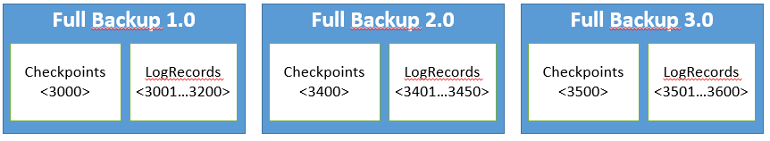
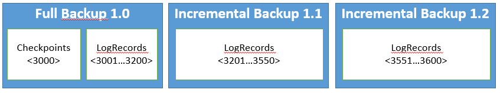

<properties
   pageTitle="Dienst Fabric sichern und Wiederherstellen | Microsoft Azure"
   description="Konzeptionelle Dokumentation für Dienst Fabric sichern und Wiederherstellen"
   services="service-fabric"
   documentationCenter=".net"
   authors="mcoskun"
   manager="timlt"
   editor="subramar,jessebenson"/>

<tags
   ms.service="service-fabric"
   ms.devlang="dotnet"
   ms.topic="article"
   ms.tgt_pltfrm="na"
   ms.workload="na"
   ms.date="10/18/2016"
   ms.author="mcoskun"/>

# <a name="back-up-and-restore-reliable-services-and-reliable-actors"></a>Sichern und Wiederherstellen von zuverlässigen Diensten und zuverlässigen Akteuren

Azure Service-Struktur ist eine Plattform mit hoher Verfügbarkeit, die den Zustand über mehrere Knoten dieser hohe Verfügbarkeit verwalten repliziert.  Auch wenn ein Knoten im Cluster fehlschlägt, weiterhin die Dienste auf diese Weise zur Verfügung. Während Sie diese in integrierte Redundanz der Plattform möglicherweise für einige ausreichend ist, ist es in bestimmten Fällen wünschenswert für den Dienst Sichern von Daten (auf einem externen Speicher).

>[AZURE.NOTE] Es ist entscheidend, Sichern und Wiederherstellen von Daten (und testen, ob diese wie erwartet funktioniert), damit Sie Daten verloren gehen Szenarien beheben können.

Ein Dienst möchten beispielsweise Sichern von Daten in den folgenden Szenarien:

* Bei permanent Verlust des einer gesamten Dienst Fabric Cluster oder alle Knoten, die eine bestimmte Partition ausgeführt werden.

* Administrative Fehler, bei dem der Zustand versehentlich gelöscht oder beschädigt wird. Beispielsweise kann dies geschehen, wenn ein Administrator mit dazu berechtigt fälschlicherweise als Dienst löscht.

* Fehler im Dienst, die Daten beschädigt. Dies kann beispielsweise erfolgen beim Start eines Upgrades der Dienst Code, Schreiben von fehlerhafte Daten in einer zuverlässigen Websitesammlung. In diesem Fall möglicherweise sowohl den Code und die Daten in einer früheren Zustand wiederhergestellt werden.

* Offline Datenverarbeitung. Möglicherweise praktisch, wenn offline-Verarbeitung von Daten für Business Intelligence, die separat vom Dienst geschieht, der die Daten generiert werden.

Das Feature zum Sichern/Wiederherstellen kann Diensten auf den zuverlässigen Webdienste-API erstellen und Wiederherstellen von Sicherungskopien basiert. Die Sicherung von der Plattform bereitgestellten APIs zulassen Sicherung(en) eine Servicepartition Staates, ohne blockierende Lese- oder Schreibzugriff Vorgänge ausführen. Der Wiederherstellung ermöglichen APIs eine Servicepartition Zustand aus einer ausgewählten Sicherung wiederhergestellt werden.

## <a name="types-of-backup"></a>Typen von Sicherung

Es gibt zwei zusätzliche Optionen: vollständig und inkrementell.
Eine vollständige Sicherung ist eine Sicherung, die alle Daten erforderlich, um den Status der Kopie erstellen neu enthält: Kontrollpunkten und alle Protokolleinträge.
Da der Kontrollpunkten und das Protokoll vorhanden ist, kann eine vollständige Sicherung allein wiederhergestellt werden.

Das Problem mit vollständigen Sicherungskopien tritt auf, wenn die Kontrollpunkten groß sind.
Eine Kopie, die 16 GB Zustand verfügt, z. B. Kontrollpunkten, die hinzufügen müssen bis zu 16 GB maximal.
Wenn wir Wiederherstellung Punkt Gegenstand des 5 Minuten haben, muss das Replikat 5 Minuten gesichert werden.
Jedes Mal, wenn es sichert muss er 16 GB an Kontrollpunkten zusätzlich 50 MB (über den **CheckpointThresholdInMB**konfigurierbare) Einheiten im Wert von Protokollen zu kopieren.



Die Lösung für dieses Problem ist inkrementell Sicherungskopien, wobei nur die Protokolldatensätze seit der letzten Sicherung gesichert werden.



Da inkrementelle Sicherungskopien nur ändert sich seit der letzten Sicherung sind (nicht die Kontrollpunkten enthält), sie schneller werden meist, aber nicht auf die eigene wiederhergestellt werden kann.
Zum Wiederherstellen einer Sicherung inkrementellen ist die gesamte Sicherung Kette erforderlich.
Eine Sicherung Kette ist eine Kette beginnend mit einer vollständigen Sicherung Sicherungen und gefolgt von einer Nummer der zusammenhängenden inkrementell Sicherungskopien.

## <a name="backup-reliable-services"></a>Zusätzliche zuverlässigen Services

Der Dienst Autor hat Vollzugriff wann Sicherungskopien zu erstellen und dem Speicherort der Sicherungskopien.

Um eine Sicherung zu starten, muss der Dienst die vererbten Member-Funktion **BackupAsync**aufrufen.  
Sicherungskopien nur von primären Replikaten vorgenommen werden können und erfordern Schreibstatus gewährt werden soll.

Wie unten dargestellt, **BackupAsync** dauert in einem **BackupDescription** -Objekt, in dem eine Sicherung vollständig oder inkrementell sowie eine Rückruffunktion angeben kann, **Funktion << BackupInfo, CancellationToken, Aufgabe<bool> ** die aufgerufen wird, wenn der Sicherungsordner lokal erstellt wurde fertig erstellt haben um einen externen Speicher verschoben werden soll.

```C#

BackupDescription myBackupDescription = new BackupDescription(backupOption.Incremental,this.BackupCallbackAsync);

await this.BackupAsync(myBackupDescription);

```

Anfordern eine inkrementelle Sicherung ausführen kann mit **FabricMissingFullBackupException** fehl, die entweder angibt
- das Replikat verfügt über eine vollständige Sicherung nie geöffnet, da es primären geworden ist,
- Einige der Protokolldatensätze seit die letzte Sicherung abgeschnitten wurden oder
- Replikat übergeben die Beschränkung **MaxAccumulatedBackupLogSizeInMB** .

Benutzer können die Wahrscheinlichkeit, dass er inkrementelle Sicherungskopien nicht ausführen, indem Sie **MinLogSizeInMB** oder **TruncationThresholdFactor**konfigurieren erhöhen.
Beachten Sie, dass diese steigenden vergrößert wird, die pro Replikat Datenträgerverwendung.
Weitere Informationen finden Sie unter [Zuverlässigen Services-Konfiguration](service-fabric-reliable-services-configuration.md)

**BackupInfo** enthält Informationen über die Sicherung, einschließlich der Position des Ordners, in dem die Laufzeit die Sicherung (**BackupInfo.Directory**) gespeichert. Die Rückruffunktion kann die **BackupInfo.Directory** in einem externen Speicher oder einen anderen Speicherort verschieben.  Diese Funktion gibt auch einen booleschen Wert, der angibt, ob den Sicherungsordner erfolgreich an die Ziel-Position verschoben werden konnte.

Im folgende Code wird veranschaulicht, wie die Methode **BackupCallbackAsync** verwendet werden kann, können Sie die Sicherung auf Azure-Speicher hochladen:

```C#
private async Task<bool> BackupCallbackAsync(BackupInfo backupInfo, CancellationToken cancellationToken)
{
    var backupId = Guid.NewGuid();

    await externalBackupStore.UploadBackupFolderAsync(backupInfo.Directory, backupId, cancellationToken);

    return true;
}
```

Im Beispiel oben ist **ExternalBackupStore** Klasse Stichprobe, die zu verwendeten ist Schnittstelle mit Azure Blob-Speicher und **UploadBackupFolderAsync** ist die Methode, komprimiert den Ordner, und stellen es im Azure Blob-Speicher.

Beachten Sie Folgendes:

- Es kann nur eine Sicherung Vorgang sein pro Replikation Flugzeug zu einem beliebigen Zeitpunkt. Mehrere **BackupAsync** Anrufe gleichzeitig lösen **FabricBackupInProgressException** um Inflight Sicherungskopien auf einen zu beschränken.

- Wenn ein Replikat über fehlschlägt, während eine Sicherung ausgeführt wird, die Sicherung möglicherweise nicht abgeschlossen haben. Sobald das Failover abgeschlossen ist, ist es auf diese Weise des Diensts Zuständigkeit, die Sicherung durch Aufrufen von **BackupAsync** nach Bedarf neu zu starten.

## <a name="restore-reliable-services"></a>Wiederherstellen von zuverlässigen Services

Im Allgemeinen liegen die Fälle, wenn Sie möglicherweise eine Wiederherstellung durchführen müssen einer der folgenden Kategorien:

- Der Dienst Teilen Sie Daten verlorene. Der Datenträger für zwei von drei Replikate für eine Partition (einschließlich primäre Replikat) wird beispielsweise beschädigt oder endgültig gelöscht. Neue primärer müssen möglicherweise stellen Sie Daten aus einer Sicherung wieder her.

- Der gesamte Dienst geht verloren. Angenommen, ein Administrator entfernt den gesamten Dienst und somit den Dienst und die Daten wiederhergestellt werden müssen.

- Der Dienst repliziert Daten beschädigt Anwendung (z. B. aufgrund einer Anwendung Fehler) an. In diesem Fall der Dienst wurde aktualisiert oder zum Entfernen der Ursache der Beschädigung zurückgesetzt werden und nicht beschädigter Daten wiederhergestellt werden müssen.

Während viele Ansätze möglich sind, bieten wir einige Beispiele zur Verwendung von **RestoreAsync** aus der obigen Szenarios wiederherstellen.

## <a name="partition-data-loss-in-reliable-services"></a>Partition Datenverlust zuverlässigen-Dienste

Die Laufzeit würde in diesem Fall automatisch erkennen der Datenverlust und **OnDataLossAsync** API aufzurufen.

Der Dienst Autor muss Wiederherstellen mit die folgenden ausführen:

- Überschrieben Sie die virtuelle Basisklassenmethode **OnDataLossAsync**.

- Suchen Sie die neueste Sicherung in externen einen Speicherort für der Sicherungskopien des Diensts enthält.

- Laden Sie die neueste Sicherung (und Dekomprimieren Sie die Sicherung in den Sicherungsordner, wenn es komprimiert wurde).

- Die Methode **OnDataLossAsync** bietet eine **RestoreContext**. Rufen Sie **RestoreAsync** API für die bereitgestellten **RestoreContext**.

- Gibt True zurück, wenn die Wiederherstellung erfolgreich war.

Es folgt ein Beispiel für die Implementierung der Methode **OnDataLossAsync** :

```C#

protected override async Task<bool> OnDataLossAsync(RestoreContext restoreCtx, CancellationToken cancellationToken)
{
    var backupFolder = await this.externalBackupStore.DownloadLastBackupAsync(cancellationToken);

    var restoreDescription = new RestoreDescription(backupFolder);

    await restoreCtx.RestoreAsync(restoreDescription);

    return true;
}
```

**RestoreDescription** an den Anruf **RestoreContext.RestoreAsync** übergebenen enthält ein Mitglied **BackupFolderPath**bezeichnet.
Beim Wiederherstellen einer vollständigen Sicherung sollte dieses **BackupFolderPath** auf den lokalen Pfad des Ordners festgelegt werden, die Ihre vollständige Sicherung enthält.
Wenn Sie eine vollständige Sicherung und eine Reihe von inkrementell Sicherungskopien wiederherstellen, sollte **BackupFolderPath** auf den lokalen Pfad des Ordners festgelegt werden, die nicht nur die vollständige Sicherung, aber auch alle vorhandenen inkrementellen Sicherungskopien enthält.
Anruf **RestoreAsync** kann **FabricMissingFullBackupException** auslösen, wenn die bereitgestellten **BackupFolderPath** keine vollständige Sicherung enthält.
Es kann auch **ArgumentException** auslösen, wenn **BackupFolderPath** eine fehlerhafte Kette von inkrementell Sicherungskopien aufweist.
Beispielsweise, wenn sie die vollständige Sicherung, enthält das erste inkrementell und die dritte inkrementell Sicherung aber nicht die zweite inkrementell Sicherung.

>[AZURE.NOTE] Die Standardeinstellung für die RestorePolicy ist Safe.  Dies bedeutet, die den **RestoreAsync** API mit ArgumentException fehl, wenn das Programm erkennt, dass der Sicherungsordner einen Zustand enthält, der älter als oder gleich den Status in diesem Replikat enthalten ist.  Mit dieser Prüfung Sicherheit überspringen, kann **RestorePolicy.Force** verwendet werden. Dies wird als Teil des **RestoreDescription**angegeben.

## <a name="deleted-or-lost-service"></a>Gelöschte oder verloren-Dienst

Wenn Sie ein Dienst entfernt wird, müssen Sie zuerst den Dienst neu erstellen, bevor die Daten wiederhergestellt werden können.  Es ist wichtig, erstellen den Dienst mit derselben Konfiguration, z. B. Partitionsschema, damit die Daten nahtlos wiederhergestellt werden können.  Sobald der Dienst von der API zum Wiederherstellen von Daten (**OnDataLossAsync** oben) wird muss für jedes Teil diesen Dienst aufgerufen werden. Eine Möglichkeit hierfür besteht mithilfe von **[FabricClient.TestManagementClient.StartPartitionDataLossAsync](https://msdn.microsoft.com/library/mt693569.aspx)** auf jeder Partition.  

Ab einem bestimmten Zeitpunkt ist die Implementierung der obigen Szenario identisch. Jede Partition muss die neueste relevante Sicherung aus dem externen Speicher wiederherstellen. Eine Vorbedingung besteht darin, dass die Partitions-ID jetzt möglicherweise geändert, da die Laufzeit Partitions-IDs dynamisch erstellt. Auf diese Weise muss sich mit den entsprechenden Informationen und Dienst Partitionsnamen zum Identifizieren der richtigen neuesten Sicherung wiederherstellen aus für jede Partition speichern.

>[AZURE.NOTE] Es wird nicht empfohlen, **FabricClient.ServiceManager.InvokeDataLossAsync** auf jede Partition verwenden, um den gesamten Dienst wiederherzustellen, da, die Ihre Cluster Zustand beschädigen kann.

## <a name="replication-of-corrupt-application-data"></a>Die Replikation von Daten beschädigt Anwendung

Wenn die Aktualisierung der Anwendung neu bereitgestellten einen Fehler aufweist, kann die Beschädigung der Daten verursachen. Beispielsweise kann ein Anwendungsupgrade Aktualisieren von jedem Telefon Zahl Datensatz in einem zuverlässigen Wörterbuch mit einer ungültigen Ortsvorwahl beginnen.  In diesem Fall werden ungültige Telefonnummern repliziert werden, da der Dienst nicht über die Art der Daten ist, ist, die gespeichert wird.

Erstes ausführen, nachdem Sie solche heikle einen Fehler erkennen, der bewirkt, Beschädigung der Daten dass besteht darin, Fixieren Dienst Ebene der Anwendung und, falls möglich, auf die Version der Code der Anwendung, die den Fehler nicht aktualisieren.  Jedoch auch nach der Code behoben wird, die Daten möglicherweise noch beschädigt und somit Daten möglicherweise muss wiederhergestellt werden.  In diesem Fall es möglicherweise nicht ausreichend, um die neueste Sicherung wiederherstellen, da die neuesten Sicherungskopien möglicherweise auch beschädigt.  Daher müssen Sie die letzte Sicherung zu finden, die erstellt wurde, bevor Sie die Daten beschädigt haben.

Wenn Sie nicht sicher sind, welche Sicherungskopien beschädigt sind, konnte Sie einen neuen Dienst Fabric Cluster bereitstellen und Wiederherstellen die Sicherungskopien des betroffenen Partitionen wie oben "Gelöscht oder einen bestimmten Dienst verloren" Szenario.  Wiederherstellen der Sicherungskopien von der letzten für jede Partition, beginnen Sie zu der kleinste. Nachdem Sie eine Sicherungskopie gefunden, die nicht über die Beschädigung verfügt haben, löschen Sie verschieben/aller Sicherungskopien dieses Datenträgers, die wurden (nur die Sicherung). Wiederholen Sie diesen Vorgang für jede Partition ein. Nun wird auf der Partition im Cluster Herstellung **OnDataLossAsync** aufgerufen, wird die letzte Sicherung im externen Speicher gefunden der ausgewählten vom oben Prozess kann.

Nun die Schritte in der "gelöscht oder verloren Service" im Abschnitt kann verwendet werden, um den Status des Diensts auf den Status zurücksetzen, bevor Sie der fehlerhafte Code beschädigt.

Beachten Sie Folgendes:

- Wenn Sie wiederherstellen, besteht die Möglichkeit, dass der Wiederherstellung älter als den Status der Partition, ist bevor Sie Daten verloren gegangen sind. Daher sollten Sie nur als letztes Mittel, um so viele Daten wie möglich wiederherstellen wiederherstellen.

- Die Zeichenfolge, die den Pfad Sicherungsordner und der Pfade von Dateien in den Sicherungsordner darstellt, kann maximal 255 Zeichen, je nach den Pfad FabricDataRoot und Anwendungstyp Namenlänge sein. Dies kann einige .NET Methoden, wie **Directory.Move**die **PathTooLongException** Ausnahme verursachen. Eine problemumgehung wird kernel32-APIs, wie **CopyFile**direkt aufzurufen.

## <a name="backup-and-restore-reliable-actors"></a>Sichern und Wiederherstellen einer zuverlässigen Akteuren

Sichern und Wiederherstellen für zuverlässigen Akteuren basiert auf Sichern und Wiederherstellen von zuverlässigen Services bereitgestellte Funktionalität. Der Dienstbesitzer sollte erstellen einen benutzerdefinierten Akteur-Dienst, der von **ActorService** abgeleitet wird (also eine Struktur Dienst zuverlässigen Hostinganbieter Akteuren Service) und dann gehen Sie wie folgt Sichern/Wiederherstellen zuverlässigen ähnlich wie Dienste wie oben in den vorherigen Abschnitten beschrieben. Da Sicherungskopien auf Basis pro Partition berücksichtigt werden sollen, weitergegeben für alle Akteuren darin, dass bestimmte Partition gesichert (und Wiederherstellung ähnelt und tritt auf Basis pro Partition).


- Beim Erstellen eines benutzerdefinierten Akteur-Diensts, müssen Sie den benutzerdefinierten Akteur-Dienst beim Registrieren des Akteurs registrieren. Finden Sie unter **ActorRuntime.RegistorActorAsync**.
- Das **KvsActorStateProvider** unterstützt derzeit nur vollständige Sicherung. Außerdem wird die Option **RestorePolicy.Safe** von der **KvsActorStateProvider**ignoriert.

>[AZURE.NOTE] Die standardmäßigen ActorStateProvider (d. h., **KvsActorStateProvider**) **nicht** zum Aufräumen die Sicherung Ordner allein (unter der Anwendung Arbeitsordner erhältlichen ICodePackageActivationContext.WorkDirectory). Dadurch kann Ihre Arbeitsordner von besetzt werden. Sie sollten explizit zum Aufräumen Sicherungsordner in der Sicherungsdatei Rückruf, nachdem Sie die Sicherung einer externen Speicher aufgerufen haben.


## <a name="testing-backup-and-restore"></a>Sichern und Wiederherstellen testen

Es ist wichtig, um sicherzustellen, dass wichtige Daten gesichert werden, und von wiederhergestellt werden können. Dies kann erfolgen durch Aufrufen des Cmdlets **Aufrufen-ServiceFabricPartitionDataLoss** in PowerShell, die auslösen kann Verlust von Daten in einer bestimmten Partition überprüft, ob die Daten sichern und Wiederherstellen von Funktionen für Ihren Dienst wie erwartet funktioniert.  Es kann auch programmgesteuert aufrufen Datenverlust und von diesem Ereignis ebenfalls wiederherstellen.

>[AZURE.NOTE] Finden eine Stichprobe Implementierung von Sicherung und Funktionalität in Bezug Web App auf Github wiederherstellen können. Bitte betrachten Sie den Dienst Inventory.Service Weitere Details aus.

## <a name="under-the-hood-more-details-on-backup-and-restore"></a>Erweiterte Einstellungen: Weitere Details zum Sichern und Wiederherstellen

Hier sind einige weitere Details zum Sichern und wiederherstellen.

### <a name="backup"></a>Sicherung
Der zuverlässigen Status-Manager ermöglicht das Erstellen konsistent Sicherungskopien ohne Blockierung einer beliebigen lesen oder Schreiben ist. Hierzu verwendet es eine Dauerhaftigkeitsmechanismus Wissensstand und melden Sie sich an.  Der zuverlässigen Status-Manager nimmt fuzzy (lightweight) Kontrollpunkten an bestimmten Punkten zu entlasten, aus dem Transaktionen Protokoll und Wiederherstellungszeiten zu verbessern.  Wenn **BackupAsync** aufgerufen wird, weist die zuverlässigen Status-Manager alle zuverlässigen Objekte zu die neuesten Wissensstand Dateien in einer lokalen Sicherungsordner kopieren aus.  Klicken Sie dann kopiert den zuverlässigen Status-Manager alle Protokolldatensätze, beginnend mit des Zeigers"Start" auf den neuesten Log Datensatz in den Sicherungsordner.  Da die Protokolldatensätze bis zu den neuesten Log-Eintrag in der Sicherung enthalten sind, und der zuverlässigen Status-Manager schreiben während der Protokollierung behält, garantiert zuverlässigen Status-Manager an, dass alle Transaktionen, die NDRs (**CommitAsync** wurde zurückgegeben) in die Sicherung einbezogen werden.

Jede Transaktion, die auch nach **BackupAsync** übergibt möglicherweise oder möglicherweise nicht in die Sicherung.  Sobald der lokale Sicherungsordner von der Plattform gefüllt wurde (d. h., lokale Sicherung durchgeführt wurde durch die Laufzeit), des Diensts Sicherung Rückruf wird aufgerufen.  Dieses Rückrufs ist verantwortlich für den Sicherungsordner in einem externen Speicherort wie Azure-Speicher verschieben.

### <a name="restore"></a>Stellen Sie wieder her

Der zuverlässigen Status-Manager bietet die Möglichkeit, die aus einer Sicherung wiederherstellen mithilfe der **RestoreAsync** API.  
Die Methode **RestoreAsync** auf **RestoreContext** kann nur innerhalb der **OnDataLossAsync** -Methode aufgerufen werden.
Die zurückgegebene **OnDataLossAsync** Bool gibt an, ob der Dienst aus einer externen Quelle Zustand wiederhergestellt.
Die **OnDataLossAsync** true zurück, wird Dienst Fabric alle anderen Replikate aus diesem primären neu erstellt. Dienst Fabric wird sichergestellt, dass Replikate, die **OnDataLossAsync** erhält ersten Übergang, die der primären Rolle anrufen aber Status gewährt nicht gelesen werden oder Schreiben von Status.
Dies bedeutet, dass bei der Implementierung von StatefulService, **RunAsync** nicht aufgerufen wird, bis **OnDataLossAsync** erfolgreich abgeschlossen ist.
Dann wird auf dem neuen primären **OnDataLossAsync** aufgerufen.
Bis ein Dienst abgeschlossen diese API erfolgreich (durch zurückgeben true oder false ist) und die relevanten neu konfiguriert endet, die API wird einzeln aufgerufen wird beibehalten.

**RestoreAsync** löscht zuerst alle vorhandenen Status in der primären Kopie, die es aufgerufen wurde.  
Klicken Sie dann erstellt die zuverlässigen Status-Manager die zuverlässigen Objekte, die in den Sicherungsordner vorhanden sind.  
Als Nächstes werden die zuverlässigen Objekte angewiesen, von deren Kontrollpunkten in den Sicherungsordner wiederherstellen.  
Schließlich die zuverlässigen Status-Manager nach ihren eigenen Zustand Protokolldatensätze in den Sicherungsordner wiederhergestellt und Wiederherstellung ausführt.  
Vorgänge aus "Ausgangspunkt" beginnen, die Protokolldatensätze Commit in den Sicherungsordner werden als Teil des Wiederherstellungsvorgangs auf die zuverlässigen Objekte wiedergegeben.  
Dieser Schritt stellen Sie sicher, dass der wiederhergestellte Zustand konsistent ist.

## <a name="next-steps"></a>Nächste Schritte

- [Zuverlässigen Websitesammlungen](service-fabric-work-with-reliable-collections.md)
- [Zuverlässigen Services Schnellstart](service-fabric-reliable-services-quick-start.md)
- [Zuverlässigen Services Benachrichtigungen](service-fabric-reliable-services-notifications.md)
- [Zuverlässigen Services-Konfiguration](service-fabric-reliable-services-configuration.md)
- [Entwicklerreferenz für zuverlässigen Websitesammlungen](https://msdn.microsoft.com/library/azure/microsoft.servicefabric.data.collections.aspx)
