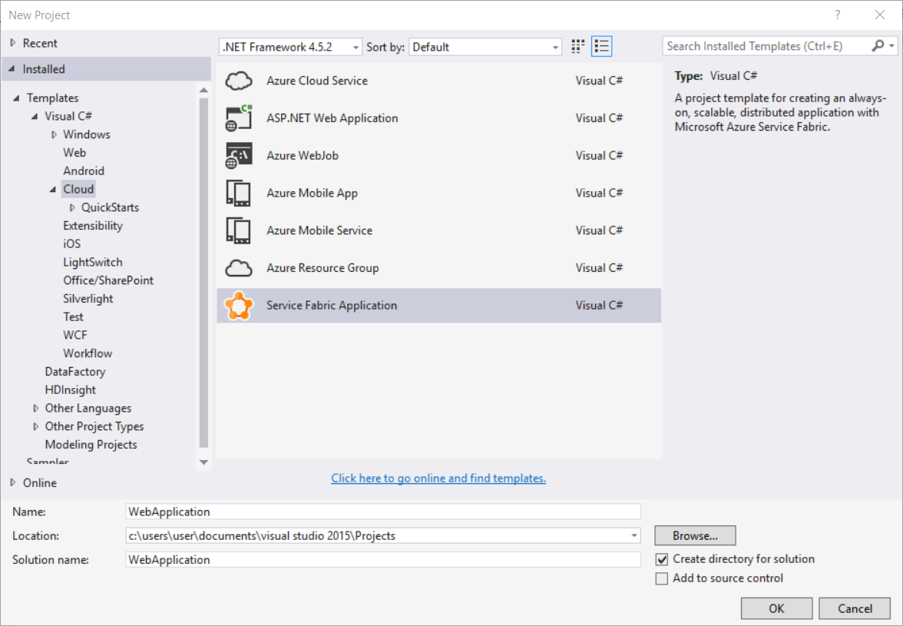
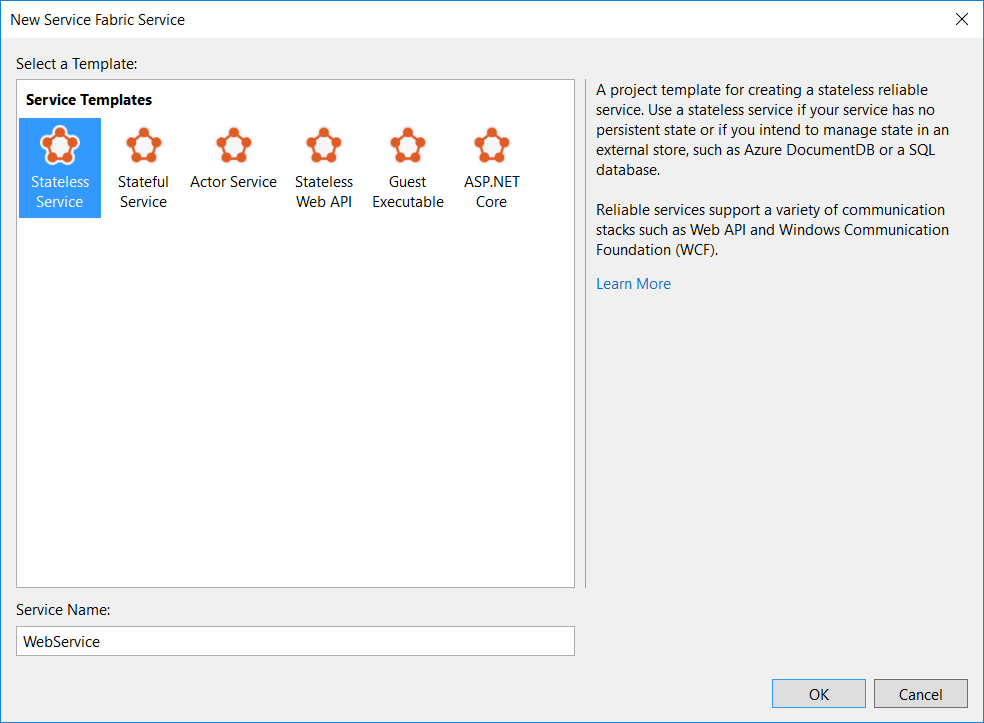
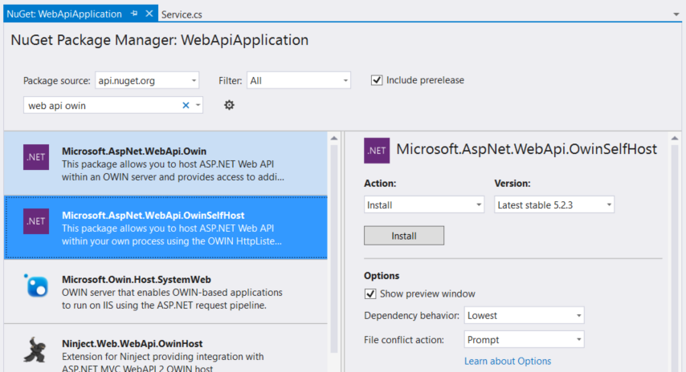
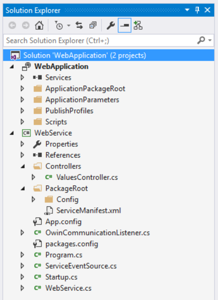
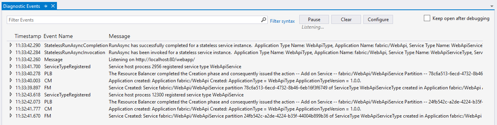

<properties
   pageTitle="Kommunikation mit dem ASP.NET Web API Service | Microsoft Azure"
   description="Informationen Sie zum schrittweise Service-Kommunikation mithilfe der ASP.NET Web API mit OWIN Self-hosting in zuverlässigen Webdienste-API implementieren."
   services="service-fabric"
   documentationCenter=".net"
   authors="vturecek"
   manager="timlt"
   editor=""/>

<tags
   ms.service="service-fabric"
   ms.devlang="dotnet"
   ms.topic="article"
   ms.tgt_pltfrm="na"
   ms.workload="required"
   ms.date="10/19/2016"
   ms.author="vturecek"/>

# <a name="get-started-service-fabric-web-api-services-with-owin-self-hosting"></a>Erste Schritte: Dienst Fabric Web-API-Diensten mit OWIN Self-hosting

Azure Service-Struktur versetzt die Potenz in Ihre Hände, wenn Sie entscheiden, wie Ihre Dienste zur Kommunikation mit Benutzern sowie untereinander interagieren soll. In diesem Lernprogramm befasst sich mit Service-Kommunikation mithilfe von ASP.NET Web API mit geöffneten Web-Oberfläche für .NET (OWIN) in den Dienst Fabric zuverlässigen Webdienste-API Self-hosting implementieren. Wir werden tief in die zuverlässigen Services austauschbare Kommunikation API ausführlicher behandelt. Wir auch verwenden Web-API in einem schrittweise Beispiel Sie zum Einrichten eines benutzerdefinierten Kommunikation Zuhörer veranschaulichen.


## <a name="introduction-to-web-api-in-service-fabric"></a>Einführung in Web API Dienst Struktur

ASP.NET Web API ist eine beliebte und leistungsfähige Framework zum Erstellen von HTTP-APIs auf .NET Framework. Wenn Sie noch nicht mit dem Framework vertraut sind, finden Sie unter [Erste Schritte mit ASP.NET Web API 2](http://www.asp.net/web-api/overview/getting-started-with-aspnet-web-api/tutorial-your-first-web-api) , um mehr zu erfahren.

Web API Dienst Struktur ist die gleichen ASP.NET Web API Sie kennen und zu schätzen. Wie wird die Differenz *Host* eine Web-API-Anwendung. Sie wird nicht Microsoft Internet Information Services (IIS) verwenden. Zum besseren Verständnis den Unterschied wir in zwei Teile aufteilen:

 1. Die Web-API-Anwendung (einschließlich Controller und Modelle)
 2. Der Host (dem Webserver, in der Regel IIS)

Eine Web-API-Anwendung selbst ändern nicht. Er unterscheidet sich nicht von Web-API-Anwendungen, die Sie in der Vergangenheit geschrieben haben möglicherweise, und Sie sollten möglicherweise einfach über die meisten Ihrer Anwendungscode bewegen. Aber wenn Sie auf IIS, hosten wurde haben, in dem Sie Host der Anwendung möglicherweise etwas anders aus, was Sie es gewohnt sind. Bevor wir das Webpart Hostinganbieter zu gelangen, betrachten wir zu Beginn eines Beitrags weitere vertraute: der Web-API-Anwendung.


## <a name="create-the-application"></a>Erstellen Sie die Anwendung

Erstellen einer neuen Fabric Service-Anwendung mit einem einzelnen statusfreie Dienst in Visual Studio 2015 starten:



Visual Studio-Vorlage für eine statusfreie Dienst verwenden Web-API steht Ihnen zur Verfügung. In diesem Lernprogramm wird wir ein Web-API Projekt ganz neu erstellen, die angegeben, ergibt sich, was Sie erhalten möchten, wenn Sie diese Vorlage ausgewählt.

Wählen Sie ein leeres Projekt statusfreie Service zu erfahren, wie ein Web-API Projekt ganz neu erstellen, oder beginnen Sie mit der Vorlage für die Web-API statusfreie Dienste und einfach nachvollziehen können.  



Dieser erste Schritt besteht, sodass abonnierte einige NuGet-Paketen für Web-API. Das Paket, die, das wir verwenden möchten, ist Microsoft.AspNet.WebApi.OwinSelfHost. Dieses Paket enthält alle notwendigen Web-API Pakete und die *Host* Pakete. Dies wird später wichtig sein.



Sobald die Pakete installiert haben, können Sie die grundlegende Struktur der Web-API Project beim Aufbau beginnen. Wenn Sie Web-API verwendet haben, sollte die Projektstruktur sehr vertraut aussehen. Starten Sie durch Hinzufügen einer `Controllers` Verzeichnis und eine einfache Werte Controller:

**ValuesController.cs**

```csharp
using System.Collections.Generic;
using System.Web.Http;
    
namespace WebService.Controllers
{
    public class ValuesController : ApiController
    {
        // GET api/values 
        public IEnumerable<string> Get()
        {
            return new string[] { "value1", "value2" };
        }

        // GET api/values/5 
        public string Get(int id)
        {
            return "value";
        }

        // POST api/values 
        public void Post([FromBody]string value)
        {
        }

        // PUT api/values/5 
        public void Put(int id, [FromBody]string value)
        {
        }

        // DELETE api/values/5 
        public void Delete(int id)
        {
        }
    }
}

```

Fügen Sie als Nächstes Startklasse am Projektstamm-auf das routing registrieren, Formatierungsprogramme und alle anderen Konfiguration einrichten. Dies ist auch die Stelle, an der Web-API an den *Host*angeschlossen ist der später Bezug genommen wird. 

**Startup.cs**

```csharp
using System.Web.Http;
using Owin;

namespace WebService
{
    public static class Startup
    {
        public static void ConfigureApp(IAppBuilder appBuilder)
        {
            // Configure Web API for self-host. 
            HttpConfiguration config = new HttpConfiguration();

            config.Routes.MapHttpRoute(
                name: "DefaultApi",
                routeTemplate: "api/{controller}/{id}",
                defaults: new { id = RouteParameter.Optional }
            );

            appBuilder.UseWebApi(config);
        }
    }
}
```

Das war's auch für das Webpart für die Anwendung. Wir haben zu diesem Zeitpunkt nur das grundlegende Web-API Projektlayout einrichten. Bisher dürfen nicht es anders viel von Web-API Projekte, die Sie in der Vergangenheit geschrieben haben möglicherweise oder von der Web-API Standardvorlage. Ihre Geschäftslogik geht Controller und Modelle wie gewohnt ein.

Was tun wir zu hosten, damit wir tatsächlich ausführen können?

## <a name="service-hosting"></a>Dienst hosten

Dienst Struktur führt des Diensts in einem *Dienst Hostprozess*, eine ausführbare Datei, die Ihr Service-Code ausgeführt wird. Wenn Sie einen Dienst mithilfe der zuverlässigen Webdienste-API schreiben, kompiliert Dienstprojekt nur auf eine ausführbare Datei, die Ihre Diensttyp registriert und führt den Code aus. Dies gilt in den meisten Fällen, wenn Sie einen Dienst auf den Dienst Fabric in .NET schreiben. Wenn Sie in das Projekt statusfreie Dienst Program.cs öffnen, sollten Sie sehen:

```csharp
using System;
using System.Diagnostics;
using System.Threading;
using Microsoft.ServiceFabric.Services.Runtime;

internal static class Program
{
    private static void Main()
    {
        try
        {
            ServiceRuntime.RegisterServiceAsync("WebServiceType",
                context => new WebService(context)).GetAwaiter().GetResult();

            ServiceEventSource.Current.ServiceTypeRegistered(Process.GetCurrentProcess().Id, typeof(WebService).Name);

            // Prevents this host process from terminating so services keeps running. 
            Thread.Sleep(Timeout.Infinite);
        }
        catch (Exception e)
        {
            ServiceEventSource.Current.ServiceHostInitializationFailed(e.ToString());
            throw;
        }
    }
}

```

Die den Einstiegspunkt verdächtig zu einer Console-Anwendung aussieht, den Teilsummen ist es ist.

Weitere Details zu den Dienst Hostprozess und Dienste registrieren liegen außerhalb des Bereichs dieses Artikels. Es ist jedoch wichtig jetzt Informationen zu diesem *dienstleistungscode in einem eigenen Prozess ausgeführt wird*.

## <a name="self-host-web-api-with-an-owin-host"></a>Self-Hosting-Web-API mit einem OWIN host

Vorausgesetzt, dass der Code der Web-API-Anwendung in einem eigenen Prozess gehostet wird, einbinden Sie es wie auf einem Webserver? Geben Sie [OWIN](http://owin.org/)ein. OWIN ist einfach ein Vertrag zwischen .NET Webanwendungen und Webservern. Wenn ASP.NET (bis zu MVC 5) verwendet wird, ist die Webanwendung traditionell eng mit IIS über System.Web verknüpft. Allerdings implementiert Web API OWIN, damit Sie eine Anwendung, die abgekoppelt wird vom Webserver schreiben können, die es hostet. Aus diesem Grund können Sie einen *Lektion gehostet* OWIN Webserver aus, den Sie in Ihren eigenen Prozess starten können. Dies passt exakt mit dem Hostinganbieter Fabric Service-Modell, die gerade beschriebenen.

In diesem Artikel werden wir Katana als OWIN Host für die Anwendung Web-API verwenden. Katana ist ein Open-Source OWIN Host-Implementierung auf Basis von [System.Net.HttpListener](https://msdn.microsoft.com/library/system.net.httplistener.aspx) und die Windows [-API HTTP-Server](https://msdn.microsoft.com/library/windows/desktop/aa364510.aspx).

> [AZURE.NOTE] Wechseln Sie zu der [Website Katana](http://www.asp.net/aspnet/overview/owin-and-katana/an-overview-of-project-katana), um weitere Informationen zu Katana. Für einen schnellen Überblick über die Verwendung von Katana zum Self-Hosting Web-API finden Sie unter [OWIN auf Self-Host ASP.NET Web API 2 verwenden](http://www.asp.net/web-api/overview/hosting-aspnet-web-api/use-owin-to-self-host-web-api).


## <a name="set-up-the-web-server"></a>Richten Sie den Webserver

Zuverlässigen Webdienste-API bietet einen Kommunikation Einstiegspunkt, wo Sie in Stapeln Kommunikation anschließen können, mit denen Benutzer und Clients für die Verbindung zum Dienst können:

```csharp

protected override IEnumerable<ServiceInstanceListener> CreateServiceInstanceListeners()
{
    ...
}

```

Webserver (und alle anderen Kommunikationsstapel, die Sie in Zukunft, z. B. WebSockets verwenden) sollte die ICommunicationListener-Oberfläche verwenden, mit dem System ordnungsgemäß integriert werden soll. Die Gründe hierfür werden in den folgenden Schritten deutlicher erst.

Erstellen Sie zuerst eine Klasse namens OwinCommunicationListener, die ICommunicationListener implementiert:

**OwinCommunicationListener.cs**

```csharp
using Microsoft.Owin.Hosting;
using Microsoft.ServiceFabric.Services.Communication.Runtime;
using Owin;
using System;
using System.Fabric;
using System.Globalization;
using System.Threading;
using System.Threading.Tasks;

namespace WebService
{
    internal class OwinCommunicationListener : ICommunicationListener
    {
        public void Abort()
        {
        }

        public Task CloseAsync(CancellationToken cancellationToken)
        {
        }

        public Task<string> OpenAsync(CancellationToken cancellationToken)
        {
        }
    }
}
```

Die Benutzeroberfläche ICommunicationListener bietet drei Methoden zum Verwalten von einer Kommunikation Zuhörer des Diensts:

 - *OpenAsync*. Starten Sie Anfragen abhören.
 - *CloseAsync*. Beenden Sie Anfragen abhören, beenden Sie alle Flugzeug Anforderungen und ordnungsgemäß beenden.
 - *Abbrechen*. Beenden Sie alle Vorgänge und sofort zu beenden.

Hinzufügen von um anzufangen, private Klasse Mitgliedern für Dinge, die die Zuhörer Funktion werden muss. Diese werden Initialisierung durch den Konstruktor und später verwendet werden, wenn Sie die URL überwachenden eingerichtet.

```csharp
internal class OwinCommunicationListener : ICommunicationListener
{
    private readonly ServiceEventSource eventSource;
    private readonly Action<IAppBuilder> startup;
    private readonly ServiceContext serviceContext;
    private readonly string endpointName;
    private readonly string appRoot;

    private IDisposable webApp;
    private string publishAddress;
    private string listeningAddress;

    public OwinCommunicationListener(Action<IAppBuilder> startup, ServiceContext serviceContext, ServiceEventSource eventSource, string endpointName)
        : this(startup, serviceContext, eventSource, endpointName, null)
    {
    }

    public OwinCommunicationListener(Action<IAppBuilder> startup, ServiceContext serviceContext, ServiceEventSource eventSource, string endpointName, string appRoot)
    {
        if (startup == null)
        {
            throw new ArgumentNullException(nameof(startup));
        }

        if (serviceContext == null)
        {
            throw new ArgumentNullException(nameof(serviceContext));
        }

        if (endpointName == null)
        {
            throw new ArgumentNullException(nameof(endpointName));
        }

        if (eventSource == null)
        {
            throw new ArgumentNullException(nameof(eventSource));
        }

        this.startup = startup;
        this.serviceContext = serviceContext;
        this.endpointName = endpointName;
        this.eventSource = eventSource;
        this.appRoot = appRoot;
    }
   

    ...

```

## <a name="implement-openasync"></a>Implementieren OpenAsync

Wenn Sie den Webserver eingerichtet haben, benötigen Sie zweierlei Informationen ein:

 - *Eine URL-Pfad-Präfix*. Dies ist optional ist es sinnvoll für Sie dies jetzt so einrichten, dass mehrere Webdienste sicheres in Ihrer Anwendung gehostet werden kann.
 - *Einen Anschluss*.

Bevor Sie einen Port für den Webserver erhalten, ist es wichtig, dass Sie verstehen, dass Dienst Fabric eine Anwendung Layer, der fungiert als Puffer zwischen der Anwendung und dem zugrunde liegenden Betriebssystem, das es ausgeführt wird bereitstellt, klicken Sie auf. Daher bietet Service Fabric eine Möglichkeit zum Konfigurieren von *Endpunkten* für Ihre Dienstleistungen. Dienst Fabric wird sichergestellt, dass die Endpunkte des Diensts verwendet zur Verfügung stehen. Auf diese Weise müssen Sie sie sich in der zugrunde liegenden OS-Umgebung konfigurieren. Sie können ganz einfach Ihre Fabric Service-Anwendung in verschiedenen Umgebungen hosten, ohne Änderungen an Ihrer Anwendung vornehmen. (Beispielsweise können Sie die gleiche Anwendung in Azure oder in Ihrem eigenen Datencenter hosten.)

Konfigurieren Sie einen HTTP-Endpunkt in PackageRoot\ServiceManifest.xml aus:

```xml

<Resources>
    <Endpoints>
        <Endpoint Name="ServiceEndpoint" Type="Input" Protocol="http" Port="8281" />
    </Endpoints>
</Resources>

```

Dieser Schritt ist wichtig, da der Dienst Host-Prozess unter eingeschränkter Anmeldeinformationen (Netzwerkdienst unter Windows) ausgeführt wird. Dies bedeutet, dass es sich bei Ihrem Dienst nicht Zugriff auf einen HTTP-Endpunkt auf einem eigenen einrichten muss. Mithilfe der Konfigurations Endpunkt weiß Dienst Fabric zum Einrichten der richtigen Zugriffssteuerungsliste (), für die URL, die auf der Dienst empfangen wird. Dienst Fabric dient auch standard um Endpunkte zu konfigurieren.


Wieder im OwinCommunicationListener.cs können Sie beginnen, OpenAsync implementieren. Dies ist die Stelle, an der Sie den Webserver starten. Zunächst erhalten Sie die Endpunktinformationen, und erstellen Sie die URL, die auf der Dienst empfangen wird. Die URL werden unterschiedlich, je nachdem, ob die Zuhörer in eine statusfreie Dienst oder eine dynamische Dienst verwendet wird. Für eine dynamische Dienst muss der Zuhörer eine eindeutige Adresse für jedes Replikat dynamische Dienst, den sie überwacht zu erstellen. Für zustandsloser Dienste kann die Adresse viel einfacher sein. 

```csharp
public Task<string> OpenAsync(CancellationToken cancellationToken)
{
    var serviceEndpoint = this.serviceContext.CodePackageActivationContext.GetEndpoint(this.endpointName);
    var protocol = serviceEndpoint.Protocol;
    int port = serviceEndpoint.Port;

    if (this.serviceContext is StatefulServiceContext)
    {
        StatefulServiceContext statefulServiceContext = this.serviceContext as StatefulServiceContext;

        this.listeningAddress = string.Format(
            CultureInfo.InvariantCulture,
            "{0}://+:{1}/{2}{3}/{4}/{5}",
            protocol,
            port,
            string.IsNullOrWhiteSpace(this.appRoot)
                ? string.Empty
                : this.appRoot.TrimEnd('/') + '/',
            statefulServiceContext.PartitionId,
            statefulServiceContext.ReplicaId,
            Guid.NewGuid());
    }
    else if (this.serviceContext is StatelessServiceContext)
    {
        this.listeningAddress = string.Format(
            CultureInfo.InvariantCulture,
            "{0}://+:{1}/{2}",
            protocol,
            port,
            string.IsNullOrWhiteSpace(this.appRoot)
                ? string.Empty
                : this.appRoot.TrimEnd('/') + '/');
    }
    else
    {
        throw new InvalidOperationException();
    }
    
    ...

```

Beachten Sie, dass hier "http://+" verwendet wird. Dies ist, um sicherzustellen, dass alle verfügbaren Adressen, einschließlich Localhost, FQDN und den Computer IP-Webserver überwacht.

Die OpenAsync-Implementierung ist eine der die wichtigsten Gründe, warum Webserver (oder einer beliebigen Kommunikationsstapel) implementiert wie direkt aus einer ICommunicationListener, anstatt die müssen es einfach öffnen `RunAsync()` im Dienst. Der Rückgabewert OpenAsync ist die Adresse, der der Webserver überwacht. Wenn diese Adresse an das System zurückgegeben wird, registriert er die Adresse mit dem Dienst an. Fabric-Dienst bietet eine API, die Clients und andere Dienste für diese Adresse Dienst namentlich bitten Sie können. Dies ist wichtig, weil die Adresse Dienst nicht statisch ist. Dienste werden im Cluster für die Ressource zu verteilen und Verfügbarkeit Zwecke um übernommen. Dies ist das Verfahren, das zum Auflösen der überwachenden Adresse für einen Dienst Clients ermöglicht.

Denken Sie daran OpenAsync startet den Webserver und die Adresse, der sie überwacht zurückgegeben. Beachten Sie, dass es abgefragt wird, klicken Sie auf "http://+", jedoch vor dem OpenAsync die Adresse gibt das "+" wird mit der IP- oder FQDN des Knotens ist aktuell auf ersetzt. Die Adresse, die von dieser Methode zurückgegeben wird ist, was mit dem System registriert ist. Es ist auch Ihren Clients und andere Dienste angezeigt, wenn sie für die Adresse des Diensts Fragen. Für Clients ordnungsgemäß eine Verbindung herstellen können benötigen sie eine tatsächliche IP oder FQDN in der Adresse ein.

```csharp
    ...

    this.publishAddress = this.listeningAddress.Replace("+", FabricRuntime.GetNodeContext().IPAddressOrFQDN);

    try
    {
        this.eventSource.Message("Starting web server on " + this.listeningAddress);

        this.webApp = WebApp.Start(this.listeningAddress, appBuilder => this.startup.Invoke(appBuilder));

        this.eventSource.Message("Listening on " + this.publishAddress);

        return Task.FromResult(this.publishAddress);
    }
    catch (Exception ex)
    {
        this.eventSource.Message("Web server failed to open endpoint {0}. {1}", this.endpointName, ex.ToString());

        this.StopWebServer();

        throw;
    }
}

```

Beachten Sie, dass dies die Start-Klasse verweist, die in der OwinCommunicationListener im Konstruktor übergeben wurde. Diese Startinstanz wird durch den Webserver verwendet, um zu die Web-API-Anwendung zu starten.

Die `ServiceEventSource.Current.Message()` Linie im Fenster Diagnostic Ereignisse später angezeigt, beim Ausführen der Anwendungs, um zu bestätigen, dass der Webserver erfolgreich gestartet wurde.

## <a name="implement-closeasync-and-abort"></a>Implementieren CloseAsync und Abbrechen

Abschließend implementieren Sie CloseAsync und Abbruch zum Beenden des Webservers. Durch disposing den Server Ziehpunkt, der während der OpenAsync erstellt wurde, kann der Webserver abgebrochen werden.

```csharp
public Task CloseAsync(CancellationToken cancellationToken)
{
    this.eventSource.Message("Closing web server on endpoint {0}", this.endpointName);
            
    this.StopWebServer();

    return Task.FromResult(true);
}

public void Abort()
{
    this.eventSource.Message("Aborting web server on endpoint {0}", this.endpointName);
    
    this.StopWebServer();
}

private void StopWebServer()
{
    if (this.webApp != null)
    {
        try
        {
            this.webApp.Dispose();
        }
        catch (ObjectDisposedException)
        {
            // no-op
        }
    }
}
```

In diesem Implementierungsbeispiel beenden sowohl CloseAsync und Abbruch einfach den Webserver. Sie können entscheiden, um eine weitere ordnungsgemäß aufeinander abgestimmte war(en) des Web-Servers im CloseAsync ausführen. Beispielsweise könnten Flugzeug Anfragen vor der Rückkehr abgeschlossen sein soll das Beenden warten.

## <a name="start-the-web-server"></a>Starten Sie den Webserver

Sie nun können zum Erstellen und eine Instanz der OwinCommunicationListener So starten Sie den Webserver zurückgeben. Überschreiben Sie wieder in der Klasse Service (WebService.cs) der `CreateServiceInstanceListeners()` Methode:

```csharp
protected override IEnumerable<ServiceInstanceListener> CreateServiceInstanceListeners()
{
    var endpoints = Context.CodePackageActivationContext.GetEndpoints()
                           .Where(endpoint => endpoint.Protocol == EndpointProtocol.Http || endpoint.Protocol == EndpointProtocol.Https)
                           .Select(endpoint => endpoint.Name);

    return endpoints.Select(endpoint => new ServiceInstanceListener(
        serviceContext => new OwinCommunicationListener(Startup.ConfigureApp, serviceContext, ServiceEventSource.Current, endpoint), endpoint));
}
```

Dies ist die Stelle, an der der Web-API- *Anwendung* , und der OWIN *Host* schließlich entsprechen. Der Host (OwinCommunicationListener) wird eine Instanz der *Anwendung* (Web-API) über die Start-Klasse angegeben. Dienst Fabric verwaltet dann Lebenszyklus aus. Mit einem beliebigen Kommunikationsstapel kann normalerweise in demselben Muster folgen.

## <a name="put-it-all-together"></a>Legen Sie es überhaupt ab

In diesem Beispiel müssen Sie brauchen nichts die `RunAsync()` Methode, damit diese Außerkraftsetzung einfach entfernt werden kann.

Die Implementierung abgeschlossen Service sollte sehr einfach sein. Es muss nur die Kommunikation Zuhörer zu erstellen:

```csharp
using System;
using System.Collections.Generic;
using System.Fabric;
using System.Fabric.Description;
using System.Linq;
using Microsoft.ServiceFabric.Services.Communication.Runtime;
using Microsoft.ServiceFabric.Services.Runtime;

namespace WebService
{
    internal sealed class WebService : StatelessService
    {
        public WebService(StatelessServiceContext context)
            : base(context)
        { }

        protected override IEnumerable<ServiceInstanceListener> CreateServiceInstanceListeners()
        {
            var endpoints = Context.CodePackageActivationContext.GetEndpoints()
                                   .Where(endpoint => endpoint.Protocol == EndpointProtocol.Http || endpoint.Protocol == EndpointProtocol.Https)
                                   .Select(endpoint => endpoint.Name);

            return endpoints.Select(endpoint => new ServiceInstanceListener(
                serviceContext => new OwinCommunicationListener(Startup.ConfigureApp, serviceContext, ServiceEventSource.Current, endpoint), endpoint));
        }
    }
}
```

Die vollständige `OwinCommunicationListener` Klasse:

```csharp
using System;
using System.Diagnostics;
using System.Fabric;
using System.Globalization;
using System.Threading;
using System.Threading.Tasks;
using Microsoft.Owin.Hosting;
using Microsoft.ServiceFabric.Services.Communication.Runtime;
using Owin;

namespace WebService
{
    internal class OwinCommunicationListener : ICommunicationListener
    {
        private readonly ServiceEventSource eventSource;
        private readonly Action<IAppBuilder> startup;
        private readonly ServiceContext serviceContext;
        private readonly string endpointName;
        private readonly string appRoot;

        private IDisposable webApp;
        private string publishAddress;
        private string listeningAddress;

        public OwinCommunicationListener(Action<IAppBuilder> startup, ServiceContext serviceContext, ServiceEventSource eventSource, string endpointName)
            : this(startup, serviceContext, eventSource, endpointName, null)
        {
        }

        public OwinCommunicationListener(Action<IAppBuilder> startup, ServiceContext serviceContext, ServiceEventSource eventSource, string endpointName, string appRoot)
        {
            if (startup == null)
            {
                throw new ArgumentNullException(nameof(startup));
            }

            if (serviceContext == null)
            {
                throw new ArgumentNullException(nameof(serviceContext));
            }

            if (endpointName == null)
            {
                throw new ArgumentNullException(nameof(endpointName));
            }

            if (eventSource == null)
            {
                throw new ArgumentNullException(nameof(eventSource));
            }

            this.startup = startup;
            this.serviceContext = serviceContext;
            this.endpointName = endpointName;
            this.eventSource = eventSource;
            this.appRoot = appRoot;
        }

        public Task<string> OpenAsync(CancellationToken cancellationToken)
        {
            var serviceEndpoint = this.serviceContext.CodePackageActivationContext.GetEndpoint(this.endpointName);
            var protocol = serviceEndpoint.Protocol;
            int port = serviceEndpoint.Port;

            if (this.serviceContext is StatefulServiceContext)
            {
                StatefulServiceContext statefulServiceContext = this.serviceContext as StatefulServiceContext;

                this.listeningAddress = string.Format(
                    CultureInfo.InvariantCulture,
                    "{0}://+:{1}/{2}{3}/{4}/{5}",
                    protocol,
                    port,
                    string.IsNullOrWhiteSpace(this.appRoot)
                        ? string.Empty
                        : this.appRoot.TrimEnd('/') + '/',
                    statefulServiceContext.PartitionId,
                    statefulServiceContext.ReplicaId,
                    Guid.NewGuid());
            }
            else if (this.serviceContext is StatelessServiceContext)
            {
                this.listeningAddress = string.Format(
                    CultureInfo.InvariantCulture,
                    "{0}://+:{1}/{2}",
                    protocol,
                    port,
                    string.IsNullOrWhiteSpace(this.appRoot)
                        ? string.Empty
                        : this.appRoot.TrimEnd('/') + '/');
            }
            else
            {
                throw new InvalidOperationException();
            }

            this.publishAddress = this.listeningAddress.Replace("+", FabricRuntime.GetNodeContext().IPAddressOrFQDN);

            try
            {
                this.eventSource.Message("Starting web server on " + this.listeningAddress);

                this.webApp = WebApp.Start(this.listeningAddress, appBuilder => this.startup.Invoke(appBuilder));

                this.eventSource.Message("Listening on " + this.publishAddress);

                return Task.FromResult(this.publishAddress);
            }
            catch (Exception ex)
            {
                this.eventSource.Message("Web server failed to open endpoint {0}. {1}", this.endpointName, ex.ToString());

                this.StopWebServer();

                throw;
            }
        }

        public Task CloseAsync(CancellationToken cancellationToken)
        {
            this.eventSource.Message("Closing web server on endpoint {0}", this.endpointName);

            this.StopWebServer();

            return Task.FromResult(true);
        }

        public void Abort()
        {
            this.eventSource.Message("Aborting web server on endpoint {0}", this.endpointName);

            this.StopWebServer();
        }

        private void StopWebServer()
        {
            if (this.webApp != null)
            {
                try
                {
                    this.webApp.Dispose();
                }
                catch (ObjectDisposedException)
                {
                    // no-op
                }
            }
        }
    }
}
```

Jetzt, da Sie alle Teile direkte eingefügt haben, sollte eine normale Web-API-Anwendung mit zuverlässigen Webdienste-API Eintrittspunkte und einem OWIN Host Ihres Projekts aussehen:




## <a name="run-and-connect-through-a-web-browser"></a>Führen Sie aus, und verbinden Sie über einen Webbrowser

Wenn Sie [Ihre Entwicklungsumgebung einrichten](service-fabric-get-started.md)nicht getan haben.


Sie können jetzt erstellen und Bereitstellen des Diensts. Drücken Sie **F5** in Visual Studio erstellen und Bereitstellen der Anwendungs. Klicken Sie im Fenster Diagnostic Ereignisse auftreten eine Nachricht, die angibt, dass der Webserver auf Http://localhost:8281 geöffnet /.




> [AZURE.NOTE] Wenn Sie der Port von einem anderen Prozess auf Ihrem Computer bereits geöffnet wurde, sehen Sie einen Fehler zurück. Dies zeigt an, dass die Zuhörer konnte nicht geöffnet werden. Wenn dies der Fall ist, versuchen Sie, einen anderen Port für den Endpunktkonfiguration in ServiceManifest.xml verwenden.


Sobald der Dienst ausgeführt wird, öffnen Sie einen Browser, und navigieren Sie zu [Http://localhost:8281/api/Werte](http://localhost:8281/api/values) , um ihn zu testen.

## <a name="scale-it-out"></a>Skalieren Sie es aus

Skalierung statusfreie Web apps in der Regel bedeutet, dass weitere Computer hinzufügen und dreht den Web apps wurden. Service-Fabric Orchestrierungsmodul ist dies bei Sie jederzeit neue Knoten zu einem Cluster hinzugefügt werden. Wenn Sie Instanzen eines Diensts statusfreie erstellen, können Sie die Anzahl der Instanzen angeben, die Sie erstellen möchten. Dienst Fabric wird die Anzahl der Instanzen auf Knoten im Cluster platziert. Und es wird sichergestellt, dass nicht um mehr als eine Instanz auf eine beliebige einem Knoten zu erstellen. Sie können auch anweisen, Service-Struktur, bis Sie immer eine Instanz durch Angeben von **-1** für die Anzahl der Instanzen auf jedem Knoten zu erstellen. Dadurch wird sichergestellt, dass immer, wenn Sie Ihren Cluster skalieren Knoten hinzugefügt haben, wird eine Instanz von Ihrem Dienst statusfreie auf den neuen Knoten erstellt. Dieser Wert ist eine Eigenschaft der Services-Instanz, damit sie beim Erstellen einer Dienstinstanz festgelegt ist. Sie können dies über PowerShell Aktionen ausführen:

```powershell

New-ServiceFabricService -ApplicationName "fabric:/WebServiceApplication" -ServiceName "fabric:/WebServiceApplication/WebService" -ServiceTypeName "WebServiceType" -Stateless -PartitionSchemeSingleton -InstanceCount -1

```

Sie können auch Aktion beim Definieren eines Standard-Diensts in Visual Studio statusfreier Service-Projekt:

```xml

<DefaultServices>
  <Service Name="WebService">
    <StatelessService ServiceTypeName="WebServiceType" InstanceCount="-1">
      <SingletonPartition />
    </StatelessService>
  </Service>
</DefaultServices>

```

Weitere Informationen zum Erstellen der Anwendung und Dienstinstanzen finden Sie unter [Bereitstellen einer Anwendung](service-fabric-deploy-remove-applications.md).

## <a name="next-steps"></a>Nächste Schritte

[Debuggen der Fabric Service-Anwendung mit Visual Studio](service-fabric-debugging-your-application.md)
