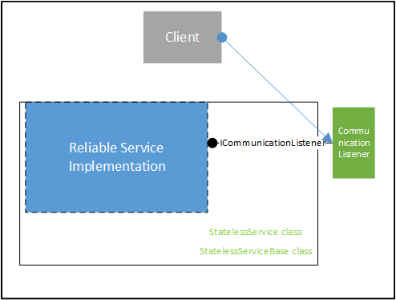

<properties
   pageTitle="Zuverlässigen Service Architektur | Microsoft Azure"
   description="Übersicht über die zuverlässigen Service Architektur für statusbehaftete und statusfreie Dienste"
   services="service-fabric"
   documentationCenter=".net"
   authors="AlanWarwick"
   manager="timlt"
   editor="vturecek"/>

<tags
   ms.service="Service-Fabric"
   ms.devlang="dotnet"
   ms.topic="article"
   ms.tgt_pltfrm="NA"
   ms.workload="NA"
   ms.date="03/30/2016"
   ms.author="alanwar"/>

# Architektur für statusbehaftete und statusfreie zuverlässigen Dienste

Ein Azure Fabric zuverlässigen Dienst möglicherweise dynamische oder statusfrei. Jeder Typ des Diensts, die innerhalb einer bestimmten Architektur ausgeführt wird. Dieser Architekturen werden in diesem Artikel beschrieben.
Finden Sie unter der [Übersicht zuverlässigen Service](service-fabric-reliable-services-introduction.md) für Weitere Informationen zu den Unterschieden zwischen statusbehaftete und statusfreie Services.

## Dynamische zuverlässigen Services

### Architektur eines Diensts dynamische

### Dynamische zuverlässigen Service

Eine dynamische zuverlässigen Service können entweder die StatefulService oder StatefulServiceBase Klasse abgeleitet werden. Beide Basis Klassen werden vom Dienst Fabric bereitgestellt. Sie bieten verschiedene Detailebenen Support und Abstraktion für die dynamische Dienst Dienst Fabric – Videokonfigurationen und als Dienst im Dienst Fabric Cluster teilnehmen.

StatefulService wird von StatefulServiceBase abgeleitet. StatefulServiceBase Services größere Flexibilität, erfordert jedoch weitere Verständnis internen Elementen des Diensts Fabric.
Weitere Informationen zu den Besonderheiten von Schreiben von Diensten mithilfe der Klassen StatefulService und StatefulServiceBase finden Sie im [Überblick zuverlässigen Service](service-fabric-reliable-services-introduction.md) und [zuverlässigen Service erweiterte Verwendung](service-fabric-reliable-services-advanced-usage.md) .

Beide Basis Klassen verwalten die Gültigkeitsdauer und Rolle Service-Implementierung. Die Implementierung Service möglicherweise virtuelle Methoden beider Basis Klassen außer Kraft, wenn die Implementierung Service an diesen Punkten im Lebenszyklus Implementierung Service – auszuführende Aufgaben enthält, oder wenn sie ein Objekt der Kommunikation Zuhörer erstellen möchte. Beachten Sie, dass zwar Service-Implementierung ein eigenes Kommunikation Zuhörer Objekt ICommunicationListener, in dem Diagramm oben, Verfügbarmachen implementieren kann die Kommunikation Zuhörer vom Dienst Fabric – implementiert wird, wie die Implementierung Service eine Kommunikation Zuhörer verwendet, die vom Dienst Fabric implementiert wird.

Eine dynamische zuverlässigen Service verwendet den zuverlässigen Status-Manager, um zuverlässigen Websitesammlungen nutzen. Zuverlässige Websitesammlungen sind lokale Datenstrukturen, die für den Dienst – hochgradig verfügbar sind, die ist, sie sind immer verfügbar, unabhängig vom Dienst Failovers. Jede Art von zuverlässigen Websitesammlung wird von einer zuverlässigen Zustand Anbieter implementiert.
Weitere Informationen zum zuverlässigen Websitesammlungen finden Sie unter der [Übersicht über zuverlässigen Sammlungen](service-fabric-reliable-services-reliable-collections.md).

### Zuverlässigen Status-Manager und Bundesstaat-Anbieter

Der zuverlässigen Status-Manager ist das Objekt, das zuverlässigen Zustand Anbieter verwaltet werden. Es hat die Funktionalität zu erstellen, löschen, auflisten, und stellen Sie sicher, dass die zuverlässigen Zustand Anbieter dauerhaften und hochgradig verfügbar sind. Eine Instanz der zuverlässigen Zustand Anbieter stellt eine Instanz einer dauerhaften und hochgradig verfügbare Datenstruktur, wie etwa ein Wörterbuch oder eine Warteschlange dar.

Jede zuverlässigen Zustand-Provider stellt eine Benutzeroberfläche, die von einem Dienst dynamische Interaktion mit den Anbieter zuverlässigen Zustand verwendet wird. IReliableDictionary wird verwendet, beispielsweise auf der Benutzeroberfläche mit dem zuverlässigen Wörterbuch während IReliableQueue verwendet wird auf der Benutzeroberfläche mit der zuverlässigen Warteschlange. Alle zuverlässigen Zustand Anbieter implementieren die Benutzeroberfläche IReliableState.

Der zuverlässigen Status-Manager verfügt über eine Schnittstelle namens IReliableStateManager, die den Zugriff darauf aus einem Dienst dynamische ermöglicht. Schnittstellen für zuverlässigen Zustand Anbieter werden durch IReliableStateManager zurückgegeben.

Der zuverlässigen Status-Manager verwendet eine Plug-in-Architektur, sodass neue Typen von zuverlässigen Websitesammlungen dynamisch angeschlossen werden können.

Zuverlässigen Wörterbuch und zuverlässigen Warteschlange werden bei der Durchführung einer leistungsfähigen, Versionsnummern Differenz Store erstellt.

### Transaktionen replicator

Die Transaktionen Replicator Komponente ist dafür sorgen, dass der Status eines Diensts (d. h., den Status innerhalb der zuverlässigen Status-Manager und die zuverlässigen Sammlungen) in allen Replikaten mit dem Dienst konsistent ist. Außerdem wird sichergestellt, dass der Status im Protokoll beibehalten werden. Mit der Transaktionen Replikations-Dienstes über ein privates Verfahren zuverlässigen Zustand Manager Schnittstellen.

Der Transaktionen Replikations-Dienstes verwendet ein Netzwerkprotokoll Zustand mit anderen Replikaten der Dienstinstanz kommunizieren, damit alle Replikate auf dem neuesten Stand Statusinformationen haben.

Der Transaktionen Replikations-Dienstes verwendet ein Protokoll Statusinformationen beibehalten werden, damit die Statusinformationen aufgenommen Prozess wurde oder Knoten stürzt ab. Die Benutzeroberfläche in das Protokoll erfolgt über ein privates Verfahren.

### Log

Die Log-Komponente bietet einen leistungsfähige beständigen Speicher, die zum Schreiben optimiert werden kann zu drehen, oder Solid Festplatten.  Das Design der Log ist für die Speicherung (d. h. Festplatten) zu den Knoten lokal sein, die den dynamische Dienst ausgeführt werden. Dies ermöglicht niedrige Wartezeiten und hohen Durchsatz, im Vergleich zu remote permanenten Speicher, der für den Knoten nicht lokal ist.

Die Log-Komponente verwendet mehrere Protokolldateien. Es gibt eine Knoten organisationsweite freigegebenen Protokolldatei, die alle Replikate verwenden, wie sie die Wartezeit niedrigsten und höchsten Durchsatz zum Speichern von Daten bereitstellen kann aus. Standardmäßig wird das freigegebene Log im Dienst Fabric Knoten Arbeit Verzeichnis platziert, aber möglicherweise auch wenn Sie an einem anderen Speicherort, idealerweise auf einem Datenträger, die für die nur die freigegebenen Log reserviert platziert werden konfiguriert werden. Jedes Replikat für den Dienst verfügt auch über eine dedizierte Protokolldatei und das dedizierte Log Datenverzeichnis Arbeit des Diensts platziert wird. Es ist kein Verfahren zum Konfigurieren der dedizierten Log an einer anderen Stelle platziert werden.

Das freigegebene Log ist ein Übergangs Bereich für die Replikatinformationen Zustand aus, während die dedizierten Protokolldatei das Ziel abgeschlossen ist, wo sie gespeichert ist. Bei diesem Entwurf wird die Statusinformationen zuerst in der freigegebenen Protokolldatei geschrieben und anschließend verzögert in die dedizierten Protokolldatei im Hintergrund verschoben. Auf diese Weise müssten das Schreiben in der freigegebenen Log der Wartezeit niedrigsten und höchsten Durchsatz dem Dienst Fortschritt schneller vornehmen kann.

Liest und schreibt in das freigegebene Protokoll über direkte EA zum vorab zugeordnete Speicherplatz auf dem Datenträger für die freigegebenen Protokolldatei fertig sind. Um optimale Nutzung des Speicherplatzes auf dem Laufwerk mit dedizierten Protokolle zuzulassen, wird die dedizierte Protokolldatei als gering gefüllte NTFS-Datei erstellt. Beachten Sie, dass auf diese Bereitstellung überproportional vieler Speicherplatz können Weise und das Betriebssystem zeigt die dedizierten Protokolldateien mit viel mehr Speicherplatz als tatsächlich verwendet wird.

Abgesehen von einer minimalen Benutzer-Modus Benutzeroberflächen in das Protokoll wird das Protokoll als einen Kernelmodustreiber geschrieben. Durch Ausführung als einen Kernelmodustreiber kann das Protokoll optimale Leistung für alle Dienste bereitstellen, die sie verwenden.

Weitere Informationen zum Konfigurieren des Log finden Sie unter [Konfigurieren von dynamische zuverlässigen Services](service-fabric-reliable-services-configuration.md).

## Statusfreie zuverlässigen Service

### Architektur eines Diensts statusfreie

### Statusfreie zuverlässigen Service

Statusfreie Dienst Implementierungen leiten Sie von der Klasse StatelessService oder StatelessServiceBase. Die StatelessServiceBase-Klasse ermöglicht größere Flexibilität als die StatelessService-Klasse.
Beide Basis Klassen verwalten die Gültigkeitsdauer und die Rolle eines Diensts.

Die Implementierung Service möglicherweise virtuelle Methoden beider Basis Klassen außer Kraft, wenn der Dienst an diesen Punkten des Service-Lebenszyklus auszuführende Aufgaben enthält, oder wenn sie ein Objekt der Kommunikation Zuhörer erstellen möchte. Beachten Sie, dass zwar der Dienst ein eigenes Kommunikation Zuhörer Objekt ICommunicationListener, in dem Diagramm oben, Verfügbarmachen implementieren kann die Zuhörer Kommunikation von Fabric Service, implementiert wird, wie diese Service-Implementierung eines Zuhörer Kommunikation verwendet, die vom Dienst Fabric implementiert wird.

Weitere Informationen zu den Besonderheiten von schreiben mithilfe der Klassen StatelessService und StatelessServiceBase Services finden Sie im [zuverlässigen Service – Übersicht](service-fabric-reliable-services-introduction.md) und [zuverlässigen Service erweiterte Verwendung](service-fabric-reliable-services-advanced-usage.md) .

<!--Every topic should have next steps and links to the next logical set of content to keep the customer engaged-->
## Nächste Schritte

Weitere Informationen zu Service Fabric finden Sie unter:

[Zuverlässigen Service (Übersicht)](service-fabric-reliable-services-introduction.md)

[Schnellstart](service-fabric-reliable-services-quick-start.md)

[Übersicht über zuverlässigen Sammlungen](service-fabric-reliable-services-reliable-collections.md)

[Zuverlässigen Service erweiterte Verwendung](service-fabric-reliable-services-advanced-usage.md)

[Zuverlässigen Dienstkonfiguration](service-fabric-reliable-services-configuration.md)  
