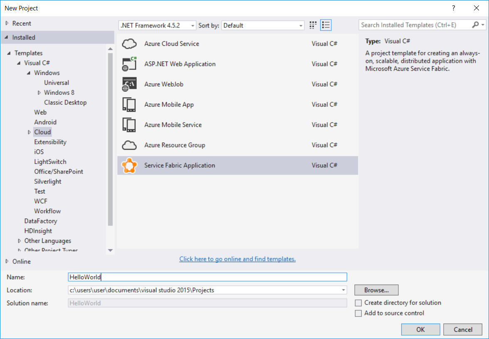
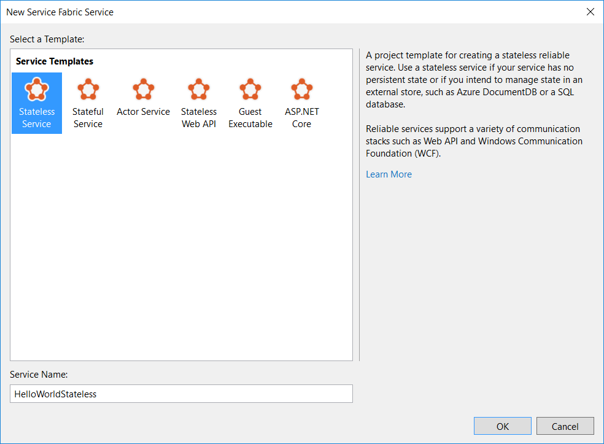
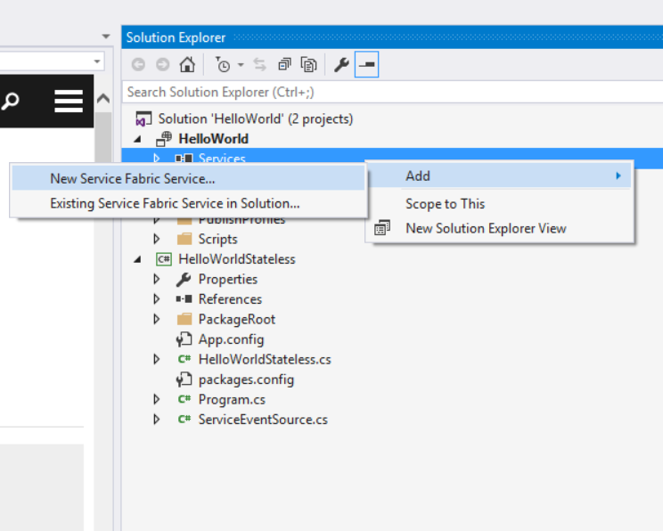
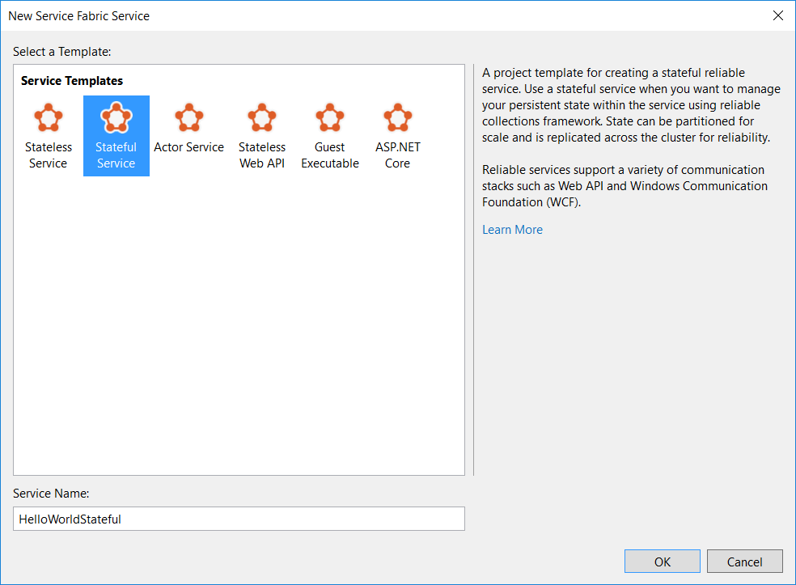
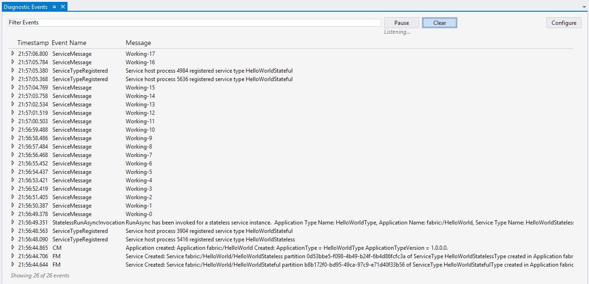

<properties
   pageTitle="Erste Schritte mit den Diensten von zuverlässigen | Microsoft Azure"
   description="Einführung in das Erstellen einer Microsoft Azure Service Fabric-Anwendung mit zustandslosen und dynamische Dienste."
   services="service-fabric"
   documentationCenter=".net"
   authors="vturecek"
   manager="timlt"
   editor=""/>

<tags
   ms.service="service-fabric"
   ms.devlang="dotnet"
   ms.topic="article"
   ms.tgt_pltfrm="na"
   ms.workload="na"
   ms.date="10/28/2016"
   ms.author="vturecek"/>

# <a name="get-started-with-reliable-services"></a>Erste Schritte mit zuverlässigen Services

> [AZURE.SELECTOR]
- [C#-unter Windows](service-fabric-reliable-services-quick-start.md)
- [Java auf Linux](service-fabric-reliable-services-quick-start-java.md)

Eine Anwendung Azure Service Fabric enthält einen oder mehrere Dienste, die Ihren Code ausgeführt werden. Dieses Handbuch veranschaulicht die statusfreie und statusbehaftete Dienst Fabric Applikationen mit [Zuverlässigen Dienste](service-fabric-reliable-services-introduction.md)zu erstellen.

## <a name="basic-concepts"></a>Grundlegende Konzepte
Um mit den Diensten von zuverlässigen anzufangen, müssen Sie nur einige grundlegende Konzepte erforderlich:

 - **Diensttyp**: Dies ist Ihre Service-Implementierung. Es wird durch die Klasse Sie schreiben, erweitert definiert `StatelessService` und alle anderen Code oder Abhängigkeiten darin, zusammen mit einen Namen und eine Versionsnummer verwendet.

 - **Benannte Dienstinstanz**: zum Ausführen des Diensts erstellen benannte Instanzen von Ihrem Diensttyp ähnlich aus wie Objektinstanzen eines Klassentyps zu erstellen. Dienstinstanzen sind eigentlich Objekt Instanzen der Dienstklasse, die Sie schreiben. 

 - **Diensthost**: die benannte Dienstinstanzen Sie erstellen innerhalb einer Host ausführen müssen. Der Diensthost ist nur eines Prozesses, in dem Instanzen von Ihrem Dienst ausgeführt werden kann.

 - **Dienst Registrierung**: Registrierung vereint alles. Mit der Dienst Fabric Laufzeit in einem Diensthost Service-Struktur, bis es Instanzen erstellen dürfen ausführen muss der Diensttyp registriert sein.  

## <a name="create-a-stateless-service"></a>Erstellen Sie einen statusfreien Dienst

Ein statusfreier Dienst ist eine Art von Dienst, der die Regel in der Cloud Applikationen aktuell ist. Es wird statusfreie angesehen werden, da der Dienst selbst keine Daten enthält, die zuverlässig gespeichert oder hochgradig zur Verfügung gestellt werden muss. Wenn eine Instanz von einem statusfreie Dienst beendet wird, alle ihre internen Status geht verloren. In dieser Art von Dienstleistung darf Zustand zu einem externen Speicher, z. B. Azure Tabellen oder einer SQL-Datenbank, um zu hochgradig verfügbar und zuverlässig gemacht werden beibehalten werden.

Starten Sie Visual Studio 2015 als Administrator aus, und erstellen Sie ein neues Service Fabric Anwendung *HelloWorld*:



Klicken Sie dann erstellen Sie ein statusfreie Dienst *HelloWorldStateless*:



Die Lösung enthält jetzt zwei Projekte:

 - *HelloWorld*. Dies ist der *Anwendung* Projekt, das Ihrer *Dienste*enthält. Darüber hinaus enthält das Anwendungsmanifest, das die Anwendung ebenso wie eine Reihe von PowerShell-Skripts, mit denen Sie die Anwendung bereitgestellt werden.
 - *HelloWorldStateless*. Dies ist das Projekt-Dienst. Sie enthält die Implementierung statusfreie Service.


## <a name="implement-the-service"></a>Implementieren der Dienst

Öffnen der Datei **HelloWorldStateless.cs** im Dienstprojekt an. Dienst Struktur kann ein Dienst keine Geschäftslogik ausgeführt werden. Die Dienst-API liefert zwei Felder und Optionen für den Code ein:

 - Zeigen Sie ein Eintrag offene Methode mit dem Namen *RunAsync*, Sie alle Auslastung beginnen können, einschließlich langer berechnen Auslastung ausführen aus.

```csharp
protected override async Task RunAsync(CancellationToken cancellationToken)
{
    ...
}
```

 - Einen Einstiegspunkt für die Kommunikation, wo Sie Ihre Kommunikationsstapel Wahl, z. B. ASP.NET Web-API anschließen können. Dies ist die Stelle, an der Sie Anfragen von Benutzern und andere Dienste empfangen starten können.

```csharp
protected override IEnumerable<ServiceInstanceListener> CreateServiceInstanceListeners()
{
    ...
}
```

In diesem Lernprogramm wir liegt der Schwerpunkt auf der `RunAsync()` Punkt Eingabemethode. Dies ist die Stelle, an der Sie sofort starten können Ihren Code ausführt.
Die Projektvorlage umfasst eine Stichprobe Implementierung `RunAsync()` , die im Wechsel Anzahl erhöht.

> [AZURE.NOTE] Ausführliche Informationen zum Arbeiten mit einem Kommunikationsstapel finden Sie unter [Service Fabric Web-API Services mit OWIN Self-hosting](service-fabric-reliable-services-communication-webapi.md)


### <a name="runasync"></a>RunAsync

```csharp
protected override async Task RunAsync(CancellationToken cancellationToken)
{
    // TODO: Replace the following sample code with your own logic
    //       or remove this RunAsync override if it's not needed in your service.

    long iterations = 0;

    while (true)
    {
        cancellationToken.ThrowIfCancellationRequested();

        ServiceEventSource.Current.ServiceMessage(this, "Working-{0}", ++iterations);

        await Task.Delay(TimeSpan.FromSeconds(1), cancellationToken);
    }
}
```

Die Plattform ruft diese Methode, wenn eine Instanz eines Diensts platziert und ausgeführt werden kann. Statusfreie Dienst bedeutet, dass einfach, wenn die Instanz des Diensts geöffnet wird. Koordinieren bei Ihrem Dienstinstanz muss geschlossen werden, wird ein Abbruchtoken bereitgestellt. Dienst Struktur kann diesen Zyklus Öffnen/Schließen der Services-Instanz über die Gültigkeitsdauer des Diensts oft als Ganzes auftreten. Dies kann geschehen, verschiedene Gründe geben, einschließlich:

- Das System verschiebt Ihrem Dienstinstanzen für Lastenausgleich Ressource.
- Fehler auftreten, in Ihrem Code.
- Die Anwendung oder das System wird aktualisiert.
- Die zugrunde liegende Hardware auftritt, einen Ausfall.

Diese Orchestrierung verwaltet wird durch das System auf den Dienst hochgradig verfügbar und ordnungsgemäß angeglichene beibehalten.

`RunAsync()`sollte nicht synchron blockieren. Die Implementierung von RunAsync eine Aufgabe oder soll die Antwort des Mitglieds auf alle Vorgänge langer oder blockierenden an, damit die Laufzeit weiterhin – Beachten Sie der `while(true)` Schleife im vorherigen Beispiel, eine Aufgabe zurückgeben `await Task.Delay()` verwendet wird. Wenn Ihre Arbeitsbelastung synchron blockiert werden muss, sollten Sie planen, eine neue Aufgabe mit `Task.Run()` in Ihrer `RunAsync` Implementierung.

Kündigung Ihrer Arbeit ist eine gemeinsame koordiniert vom bereitgestellten Absage Token. Das System wartet der Aufgabe an (nach dem erfolgreichen Abschluss, Abbruch oder Fehlerstrukturanalyse) zu beenden, bevor er verschoben wird, klicken Sie auf. Es ist wichtig, das Kündigung Token berücksichtigt, beenden etwaige Änderungen, und beenden Sie `RunAsync()` so schnell wie möglich, wenn das System Abbruch anfordert.

In diesem Beispiel statusfreie Dienst wird die Anzahl die in einer lokalen Variablen gespeichert. Aber da dies eine statusfreie Dienstleistung handelt, der gespeicherten Wert vorhanden ist, nur für den aktuellen Lebenszyklus der seine Services-Instanz. Wenn der Dienst verschoben oder neu gestartet wird, ist der Wert verloren.

## <a name="create-a-stateful-service"></a>Erstellen Sie eine dynamische service

Dienst Fabric führt eine neue Art von Dienst, dynamische ist, ein. Ein dynamische Dienst kann Status zuverlässig innerhalb der Dienst selbst, gemeinsame ansässig durch den Code, der sie verwendet verwalten. Bundesstaat ist hochgradig vom Dienst Fabric ohne dass Zustand auf einem externen Speicher beizubehalten zur Verfügung.

Zum Konvertieren eines Werts Zähler aus statusfreie hochgradig verfügbar und beständigen, auch, wenn der Dienst verschoben oder neu gestartet wird, benötigen Sie einen dynamische Dienst an.

In der gleichen *HelloWorld* -Anwendung können Sie eine neue Dienstleistung hinzufügen, indem Sie mit der rechten Maustaste auf die Dienste Verweise im Anwendungsprojekt und **Hinzufügen -> neue Fabric-Dienst**auswählen.



Wählen Sie **Stateful-Dienst** , und nennen Sie es *HelloWorldStateful*. Klicken Sie auf **OK**.



Die Anwendung sollte jetzt zwei Dienste verfügen: statusfreie Dienst *HelloWorldStateless* und die Stateful service *HelloWorldStateful*.

Ein dynamische Dienst weist die gleichen Eintrittspunkte als statusfreie Dienst. Der wichtigste Unterschied ist die Verfügbarkeit eines *Anbieters für* die Bundesstaat zuverlässig speichern können. Dienst Fabric im Lieferumfang von Implementierung eines Zustand aufgerufen, [Zuverlässigen Websitesammlungen](service-fabric-reliable-services-reliable-collections.md), die Sie durch den zuverlässigen Status-Manager repliziert Datenstrukturen erstellen können. Eine dynamische zuverlässigen Service verwendet diesen Status Anbieter standardmäßig an.

Öffnen Sie **HelloWorldStateful.cs** *HelloWorldStateful*, der die folgende RunAsync Methode enthält:

```csharp
protected override async Task RunAsync(CancellationToken cancellationToken)
{
    // TODO: Replace the following sample code with your own logic
    //       or remove this RunAsync override if it's not needed in your service.

    var myDictionary = await this.StateManager.GetOrAddAsync<IReliableDictionary<string, long>>("myDictionary");

    while (true)
    {
        cancellationToken.ThrowIfCancellationRequested();

        using (var tx = this.StateManager.CreateTransaction())
        {
            var result = await myDictionary.TryGetValueAsync(tx, "Counter");

            ServiceEventSource.Current.ServiceMessage(this, "Current Counter Value: {0}",
                result.HasValue ? result.Value.ToString() : "Value does not exist.");

            await myDictionary.AddOrUpdateAsync(tx, "Counter", 0, (key, value) => ++value);

            // If an exception is thrown before calling CommitAsync, the transaction aborts, all changes are
            // discarded, and nothing is saved to the secondary replicas.
            await tx.CommitAsync();
        }

        await Task.Delay(TimeSpan.FromSeconds(1), cancellationToken);
    }
```

### <a name="runasync"></a>RunAsync

`RunAsync()`funktioniert ähnlich wie statusbehaftete und statusfreie-Dienste. Allerdings in einem dynamische-Dienst, die Plattform zusätzliche Aufgaben ausgeführt, in Ihrem Auftrag, bevor er ausgeführt wird `RunAsync()`. Diese arbeiten, Sie können beispielsweise prüfen, die die zuverlässigen Status-Manager und zuverlässigen Websitesammlungen verwendet werden.

### <a name="reliable-collections-and-the-reliable-state-manager"></a>Zuverlässigen Websitesammlungen und dem zuverlässigen Status-Manager

```csharp
var myDictionary = await this.StateManager.GetOrAddAsync<IReliableDictionary<string, long>>("myDictionary");
```

[IReliableDictionary](https://msdn.microsoft.com/library/dn971511.aspx) ist ein Wörterbuch-Implementierung, die Sie verwenden können, zuverlässig Zustand des Diensts speichern. Mit dem Dienst Fabric und zuverlässigen Websitesammlungen können Sie Daten direkt in Ihrem Dienst ohne die Notwendigkeit einer externen beständigen Speicher speichern. Zuverlässige Websitesammlungen können Ihre Daten hochgradig verfügbar machen. Dienst Fabric erreicht dies, indem Sie erstellen und Verwalten des Diensts für Sie mehrere *Replikate* . Darüber hinaus eine API, die die Komplexität der Verwaltung von diese Replikate und deren Übergänge zwischen abwesend fasst.

Zuverlässige Sammlungen können beliebiger, einschließlich benutzerdefinierten Typen, mit dem verschiedene Vorsichtsmaßnahmen zu speichern:

 - Fabric-Dienst bereitgestellt, Ihr Bundesland hochgradig nach Bundesland *Replikation* über Knoten und zuverlässigen Sammlungen Speichern von Daten auf der lokalen Festplatte auf jedes Replikat. Dies bedeutet, dass alle Elemente, die in einer zuverlässigen Websitesammlungen gespeichert ist *serialisierbar*sein muss. Standardmäßig verwenden zuverlässigen Websitesammlungen [DataContract](https://msdn.microsoft.com/library/system.runtime.serialization.datacontractattribute%28v=vs.110%29.aspx) für die Serialisierung an, sodass es wichtig ist, um sicherzustellen, dass Ihre Typen [von den Datenvertragsserialisierer unterstützt](https://msdn.microsoft.com/library/ms731923%28v=vs.110%29.aspx) werden, bei der Verwendung von Standardserialisierer.

 - Objekte werden für eine hohe Verfügbarkeit repliziert, wenn Sie Transaktionen zuverlässigen Websitesammlungen abzuschließen. Objekte, die in einer zuverlässigen Websitesammlungen gespeichert bleiben im lokalen Speicher in Ihrem Dienst. Dies bedeutet, dass Sie einen lokalen Verweis auf das Objekt haben.

    Es ist wichtig, dass Sie nicht lokale Instanzen dieser Objekte verändert, ohne einen Aktualisierungsvorgang in die Sammlung zuverlässigen in einer Transaktion durchzuführen. Dies ist, da Änderungen an lokalen Instanzen von Objekten nicht automatisch repliziert werden. Müssen Sie das Objekt wieder zurück in das Wörterbuch einfügen oder verwenden eine der Methoden *Aktualisieren* auf das Wörterbuch.

Der zuverlässigen Status-Manager verwaltet zuverlässigen Websitesammlungen für Sie. Sie können einfach zuverlässigen Status-Manager für eine Websitesammlung zuverlässigen anhand des Namens zu einem beliebigen Zeitpunkt und an einer beliebigen Stelle in Ihrem Dienst bitten. Der zuverlässigen Status-Manager: Damit ist sichergestellt, dass Sie einen Verweis wieder abrufen. Wir empfohlen nicht, dass Sie Verweise auf Instanzen von zuverlässigen Websitesammlung in den Member Variablen oder Eigenschaften speichern. Unbefugtem Zugriff muss absolviert werden, um sicherzustellen, dass der Bezug auf eine Instanz alle Vorkommen des Lebenszyklus Dienst festgelegt ist. Der zuverlässigen Status-Manager verarbeitet diese Arbeitsaufwand, und es ist optimiert für wiederholten besuchen.

### <a name="transactional-and-asynchronous-operations"></a>Transaktionen als auch asynchrone Vorgänge

```C#
using (ITransaction tx = this.StateManager.CreateTransaction())
{
    var result = await myDictionary.TryGetValueAsync(tx, "Counter-1");

    await myDictionary.AddOrUpdateAsync(tx, "Counter-1", 0, (k, v) => ++v);

    await tx.CommitAsync();
}
```

Zuverlässige Websitesammlungen haben viele Vorgänge aus, deren `System.Collections.Generic` und `System.Collections.Concurrent` Gegenstücken durchzuführen, außer LINQ. Vorgänge zuverlässigen Websitesammlungen sind asynchrone. Dies liegt daran Schreibvorgänge mit zuverlässigen Websitesammlungen e/a-Vorgänge durchführen für die Replikation und Beibehalten der Daten auf einem Datenträger.

Zuverlässigen Collection Vorgänge sind *Transaktionen*, sodass Sie Zustand konsistent über mehrere Websitesammlungen zuverlässigen und Vorgänge bleiben können. Sie möglicherweise beispielsweise Abrufen ein Elements aus einer zuverlässigen Warteschlange, führen Sie einen Vorgang daran, und speichern das Ergebnis in einem zuverlässigen Wörterbuch, alle in einer einzigen Transaktion. Dies wird einem behandelt, und es wird sichergestellt, dass entweder die gesamte Operation erfolgreich oder der gesamte Vorgang zurücksetzen. Falls ein Fehler auftritt, nachdem Sie das Element aus Warteschlange entfernt, aber bevor Sie das Ergebnis speichern, wird die gesamte Transaktion zurückgesetzt, und das Element bleibt in der Warteschlange für die Verarbeitung.

## <a name="run-the-application"></a>Führen Sie die Anwendung

Wir kehren Sie zu der Anwendung *"HelloWorld"* zurück. Sie können jetzt erstellen und Bereitstellen von Ihrer Dienste. Wenn Sie **F5**drücken, wird eine Anwendung erstellt und auf Ihrem lokalen Cluster bereitgestellt.

Nachdem die Dienste ausführen anfangen, können Sie die generierte Ereignisse Event Tracing for Windows (ETW) in einem Fenster **Diagnostic Ereignisse** anzeigen. Beachten Sie, dass die angezeigten Ereignisse aus den statusfreie-Dienst und dynamische Dienst in der Anwendung. Sie können Streams anhalten, indem Sie auf die Schaltfläche **Anhalten** . Sie können die Details einer Nachricht klicken Sie dann überprüfen, indem Sie die Nachricht.

>[AZURE.NOTE] Bevor Sie die Anwendung ausführen, stellen Sie sicher, dass Sie einen lokale Entwicklung Cluster ausgeführt haben. Schauen Sie sich das [Erste Schritte mit](service-fabric-get-started.md) Informationen zum Einrichten der lokalen Umgebung.




## <a name="next-steps"></a>Nächste Schritte

[Debuggen der Fabric Service-Anwendung in Visual Studio](service-fabric-debugging-your-application.md)

[Erste Schritte: Dienst Fabric Web-API-Diensten mit OWIN Self-hosting](service-fabric-reliable-services-communication-webapi.md)

[Weitere Informationen zu zuverlässigen Websitesammlungen](service-fabric-reliable-services-reliable-collections.md)

[Bereitstellen einer Anwendung](service-fabric-deploy-remove-applications.md)

[Anwendungsupgrade](service-fabric-application-upgrade.md)

[Entwicklerreferenz für zuverlässigen Dienste](https://msdn.microsoft.com/library/azure/dn706529.aspx)
