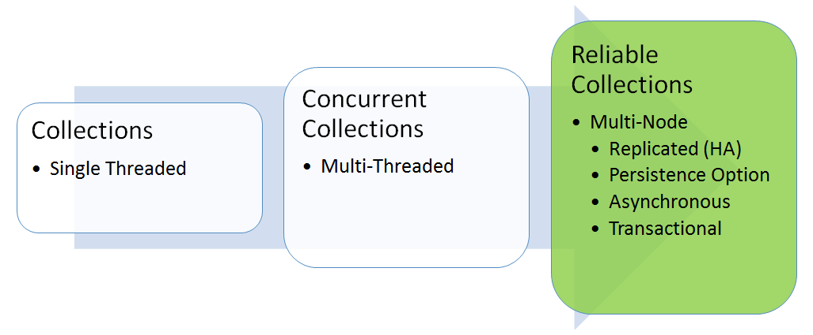

<properties
   pageTitle="Zuverlässigen Websitesammlungen | Microsoft Azure"
   description="Dienst Fabric dynamische Services bieten zuverlässige Websitesammlungen, die Sie zum Schreiben von Applications hochgradig verfügbar, skalierbar, und mit geringer Verzögerung Cloud aktivieren."
   services="service-fabric"
   documentationCenter=".net"
   authors="mcoskun"
   manager="timlt"
   editor="masnider,vturecek"/>

<tags
   ms.service="service-fabric"
   ms.devlang="dotnet"
   ms.topic="article"
   ms.tgt_pltfrm="na"
   ms.workload="required"
   ms.date="10/18/2016"
   ms.author="mcoskun"/>

# Einführung in zuverlässigen Websitesammlungen dynamische Azure Service Fabric-Dienste

Zuverlässige Websitesammlungen aktivieren Sie hochgradig verfügbar, skalierbar, und mit geringer Verzögerung Cloud Applikationen schreiben, als wären Sie einzelne Computer Applikationen schreiben würden. Die Klassen im Namespace **Microsoft.ServiceFabric.Data.Collections** bieten eine Reihe von Out-of-Box-Sammlungen, die automatisch Ihrer Zustand hoch verfügbar zu machen. Entwickler müssen nur für die zuverlässigen Websitesammlungs-APIs Programm, und lassen Sie zuverlässigen Websitesammlungen im replizierten und lokalen Zustand verwalten.

Der wesentliche Unterschied zwischen zuverlässigen Websitesammlungen und andere Technologien hoher Verfügbarkeit (z. B. Redis, Azure Table-Dienst und Warteschlange Azure Service) ist, dass der Status lokal in der Dienstinstanz aufbewahrt werden, während Sie auch hochgradig zur Verfügung gestellt werden. Dies bedeutet, dass:

- Alle liest sind lokal, wodurch niedriger Wartezeit und hohem Durchsatz liest.
- Alle schreibt die minimale Anzahl von Netzwerk IOs, was in niedriger Wartezeit führt zu tätigen und hohem Durchsatz schreibt.

Zuverlässige Websitesammlungen können als die Weiterentwicklung der Klassen **System.Collections** vorstellen: ein neuer Satz von Websitesammlungen, die für die Cloud und mit mehreren Computern Applikationen ohne zunehmender Komplexität für Entwickler vorgesehen sind. Daher sind zuverlässigen Websitesammlungen aus:

- Repliziert: Bundesstaat Änderungen werden für hohen Verfügbarkeit repliziert.
- Beibehalten: Daten werden beibehalten auf einem Datenträger für Zuverlässigkeit gegen umfangreiche Ausfall (beispielsweise ein Datacenter Power Ausfall).
- Asynchrone: APIs sind asynchrone, um sicherzustellen, dass Threads nicht blockiert werden, wenn EA anfallen.
- Transaktionen: APIs nutzen die Abstraktion der Transaktionen, damit Sie mehrere zuverlässigen Websitesammlungen in einem Dienst einfach verwalten können.

Zuverlässige Websitesammlungen bieten signifikante Konsistenz im Paket gewährleistet, um Logik zum Anwendungsstatus zu erleichtern.
Signifikante Konsistenz wird durch die Sicherstellung Transaktion, Commit Fertig stellen, nachdem die gesamte Transaktion auf ein Quorum Mehrzahl der Replikations einschließlich den primären protokolliert wurde, erreicht.
Um schwächere Konsistenz zu erreichen, können Applikationen zurück zum Client/enthaltenen bestätigen Sie vor das asynchrone Commit gibt.

Die zuverlässigen Websitesammlungen-APIs sind eine Weiterentwicklung von gleichzeitigen Websitesammlungen APIs (im **System.Collections.Concurrent** -Namespace gefunden):

- Asynchrone: Gibt einen Vorgang, da gleichzeitige Auflistungen, Vorgänge repliziert und beibehalten werden.
- Keine out-Parameter: verwendet `ConditionalValue<T>` eine Boolean und einen Wert anstelle von out-Parameter zurückgegeben. `ConditionalValue<T>`Wie wird `Nullable<T>` , aber keine T, um eine Struktur sein erforderlich sind.
- Transaktionen: Verwendet ein Transaktionsobjekt So aktivieren Sie den Benutzer in der Gruppe Aktionen auf mehrere zuverlässigen Sammlungen in einer Transaktion.

Heute, enthält **Microsoft.ServiceFabric.Data.Collections** zwei Websitesammlungen an:

- [Zuverlässigen Wörterbuch](https://msdn.microsoft.com/library/azure/dn971511.aspx): eine Auflistung replizierte, Transaktionen und asynchrone Schlüssel/Wert-Paare darstellt. **ConcurrentDictionary**, können sowohl die Taste und den Wert eines beliebigen Typs ähneln.
- [Zuverlässigen Warteschlange](https://msdn.microsoft.com/library/azure/dn971527.aspx): eine repliziert, Transaktionen und asynchrone strict First in, First Out (FIFO) Warteschlange darstellt. Ähnlich wie **ConcurrentQueue**, kann der Wert eines beliebigen Typs sein.

## Grad der Isolationsebenen
Grad der Isolation definiert, der das Ausmaß, das die Transaktion vom Änderungen vorgenommen, die von anderen Transaktionen isoliert werden muss.
Es gibt zwei Isolation Ebenen, die zuverlässigen Websitesammlungen unterstützt werden:

- **Wiederholt gelesen**: Gibt an, dass Anweisungen Daten gelesen werden können, die geändert, aber noch nicht von anderen Transaktionen zugesichert wurde und keine anderen Transaktionen Daten ändern können, die von der aktuellen Transaktion gelesen wurden, bis die aktuelle Transaktion endet. Weitere Informationen hierzu finden Sie unter [https://msdn.microsoft.com/library/ms173763.aspx](https://msdn.microsoft.com/library/ms173763.aspx).
- **Snapshot**: Gibt an, dass Daten von einem beliebigen-Anweisung in einer Transaktion Lesen der konsistent Version der Daten, die am Anfang der Transaktion vorhanden waren.
Die Transaktion kann nur die Änderungen Daten erkannt, die vor dem Start der Transaktion zugesichert wurden.
Daten Änderungen von anderen Transaktionen nach dem Beginn der aktuellen Transaktion vorgenommen werden nicht angezeigt, um Anweisungen in der aktuellen Transaktion ausführen.
Der Effekt ist, als wäre Anweisungen in eine Transaktion eine Momentaufnahme der zugesicherte Daten erhalten, wie es am Anfang der Transaktion vorhanden.
Momentaufnahmen sind über zuverlässigen Websitesammlungen konsistent.
Weitere Informationen hierzu finden Sie unter [https://msdn.microsoft.com/library/ms173763.aspx](https://msdn.microsoft.com/library/ms173763.aspx).

Zuverlässige Websitesammlungen wählen Sie automatisch aus den Isolationsgrad für eine bestimmte gelesen Operation je nach den Vorgang und die Rolle der Kopie zum Zeitpunkt der Erstellung des Transaktion verwenden.
Im folgenden sehen die Tabelle, die Isolation Ebene Standardeinstellungen für zuverlässigen Wörterbuch und Warteschlange Vorgänge Seitenansichtsmodus.

| Vorgang \ Rolle      | Primärschlüssel          | Sekundären        |
| --------------------- | :--------------- | :--------------- |
| Einzelne Einheit gelesen    | Wiederholt gelesen  | Snapshot         |
| Enumeration \ zählen   | Snapshot         | Snapshot         |

>[AZURE.NOTE] Allgemeine Beispiele für einzelne Entität Vorgänge sind `IReliableDictionary.TryGetValueAsync`, `IReliableQueue.TryPeekAsync`.

Sowohl das Wörterbuch zuverlässigen und der zuverlässigen Warteschlange unterstützen Lesen Ihrer schreibt.
Kurzum, werden alle schreiben innerhalb einer Transaktion zu einem folgenden schreibgeschützten angezeigt, die dieselbe Transaktion gehört.

## Durch das Sperren
In einer zuverlässigen Websitesammlungen, alle Transaktionen sind zwei Phasen: eine Transaktion belässt es hat bis zum Ende die Transaktion mit entweder ein Abbruch oder Commit erworbenen sperren.

Zuverlässigen Wörterbuch wird für alle Vorgänge für einzelne Einheit Sperren von Zeilenebene verwendet.
Zuverlässigen Warteschlange Transaktionen deaktivieren Parallelität für strict Transaktionen FIFO-Eigenschaft.
Zuverlässigen Warteschlange verwendet Vorgang Ebene Sperren gleicht eine Transaktion mit `TryPeekAsync` und/oder `TryDequeueAsync` und eine Transaktion mit `EnqueueAsync` nacheinander.
Beachten Sie, dass Sie um FIFO, erhalten eine `TryPeekAsync` oder `TryDequeueAsync` jemals verwendet wird, dass die zuverlässigen Warteschlange leer ist, werden diese auch Sperren `EnqueueAsync`.

Schreiben Sie, dass Vorgänge immer exklusive Sperren dauern.
Bei Vorgängen finden Sie hier abhängig verschiedene Faktoren das Sperren.
Alle gelesen Vorgang fertig mit Snapshot-Isolation ist kostenlosen sperren.
Jede Operation wiederholt gelesen standardmäßig dauert gemeinsame Sperren.
Für alle gelesen Vorgang, der wiederholt gelesen unterstützt, kann der Benutzer jedoch für eine Aktualisierungssperre, statt die Sperre freigegeben bitten.
Ein Update Sperren ist eine asymmetrische Sperren verwendet, um zu verhindern, dass eine häufige Form von Deadlocks, die tritt auf, wenn mehrere Transaktionen Ressourcen für mögliche Updates zu einem späteren Zeitpunkt sperren.

Sperren Kompatibilitätsmatrix finden Sie unter:

| Anfordern \ erteilt | Keine         | Freigegeben       | Aktualisieren      | Ausschließlich    |
| ----------------- | :----------- | :----------- | :---------- | :----------- |
| Freigegeben            | Kein Konflikt  | Kein Konflikt  | Konflikt    | Konflikt     |
| Aktualisieren            | Kein Konflikt  | Kein Konflikt  | Konflikt    | Konflikt     |
| Ausschließlich         | Kein Konflikt  | Konflikt     | Konflikt    | Konflikt     |

Beachten Sie, dass ein Argument Timeout in den zuverlässigen Websitesammlungen APIs für Deadlockerkennung verwendet wird.
Zwei Transaktionen (T1 und T2) versuchen, beispielsweise zum Lesen und Aktualisieren von K1.
Kann bis zu einem deadlock, da sie beide einhandeln die Sperre freigegeben haben.
In diesem Fall werden eine oder beide der Vorgänge Timeout.

Beachten Sie, dass das obigen Deadlock-Szenario ist ein großartiges Beispiel wie ein Update Sperren Deadlocks zu verhindern kann.

## Beibehaltung Modell
Führen Sie die zuverlässigen Status-Manager und zuverlässigen Websitesammlungen ein dauerhaften-Modell, das Protokoll und Wissensstand aufgerufen wird.
Dies ist ein Modell, in dem jede Zustandsänderung auf dem Datenträger protokolliert und nur im Speicher angewendet.
Der vollständige Zustand selbst wird nur gelegentlich (auch bekannt als beibehalten. Wissensstand).
Der Vorteil besteht darin, dass Deltas in sequenziellen nur Anhängen schreibt auf dem Datenträger zum Verbessern der Leistung aktiviert sind.

Zum besseren Verständnis des Modells Log und Wissensstand uns zunächst an dem Szenario unbegrenzte Datenträger.
Der zuverlässigen Status-Manager protokolliert jeden Vorgang aus, bevor sie repliziert wird.
Dadurch wird die zuverlässigen Auflistung, um nur den Vorgang im Speicher anwenden.
Da Protokolle, beibehalten werden selbst wenn das Replikat schlägt fehl, und muss neu gestartet werden, verfügt der zuverlässigen Status-Manager über alle Informationen in seine Protokolle Wiedergeben von alle Vorgänge, die das Replikat verloren hat.
Wie der Datenträger unbegrenzte Protokolldatensätze nie müssen entfernt werden, muss der zuverlässigen Auflistung nur den in-Memory-Zustand zu verwalten.

Jetzt wollen wir uns dem Szenario begrenzten Datenträger.
Wie Protokolldatensätze leistungsstufenpunkte, wird der zuverlässigen Status-Manager nicht genügend Speicherplatz ausgeführt.
Bevor Sie in diesem Fall muss der zuverlässigen Status-Manager Abschneiden das Protokoll aus, um Platz für neuere Datensätze zu erstellen.
Es wird der zuverlässigen Auflistungen zu Wissensstand ihren Status im Speicher auf einem Datenträger anfordern.
Ist die zuverlässigen Sammlungen zuständig Zustand bis zu diesem Zeitpunkt beibehalten werden.
Sobald die zuverlässigen Sammlungen deren Kontrollpunkten abgeschlossen haben, können die zuverlässigen Status-Manager das Protokoll zum Freigeben von Speicherplatz kürzen.
Auf diese Weise, wenn das Replikat muss neu gestartet werden, Wiederherstellen zuverlässigen Websitesammlungen ihren geprüfte Zustand und der zuverlässigen Status-Manager wiederherstellen und alle Zustandsänderungen, die seit dem Prüfpunkt aufgetreten sind Wiedergabe wird.

>[AZURE.NOTE] Fügen Sie einen anderen Wert der geänderte besteht darin, dass es Wiederherstellung Leistung in vielen Fällen verbessert.
Dies liegt daran Kontrollpunkten nur die neuesten Versionen enthalten.

## Empfehlungen

- Ändern Sie ein Objekt des benutzerdefinierten Typs zurückgegebene gelesen Vorgänge nicht (z. B. `TryPeekAsync` oder `TryGetValueAsync`). Zuverlässige Websitesammlungen, wie gleichzeitige Sammlungen, zurückgeben einen Verweis auf die Objekte und nicht um eine Kopie an.
- Führen Sie vor dem Ändern tiefe Kopie zurückgegebenen Objekts mit einem benutzerdefinierten Typ ein. Da Strukturen und integrierte Typen von Wert übergebene sind, müssen Sie nicht führen Sie eine tiefe Kopie wurden.
- Verwenden Sie nicht `TimeSpan.MaxValue` für Timeouts. Timeouts sollte verwendet werden, um Deadlocks zu erkennen.
- Verwenden Sie eine Transaktion nicht, nachdem es zugesichert, abgebrochen, oder freigegeben wurde.
- Verwenden Sie eine Enumeration nicht außerhalb des Gültigkeitsbereichs von Transaktion, die, dem Sie erstellt wurde.
- Erstellen Sie eine Transaktion in einer anderen Transaktion nicht `using` Anweisung da Deadlocks verursacht werden können.
- Stellen Sie sicher, die Ihre `IComparable<TKey>` Implementierung ist richtig. Das System nimmt Abhängigkeit dies für das Zusammenführen von Kontrollpunkten.
- Verwenden Sie Update Sperren beim Lesen eines Elements mit einer Absicht aktualisieren, um zu verhindern, dass eine bestimmte Klasse von Deadlocks.
- Bietet Sicherung und Wiederherstellung damit Funktionalität wiederhergestellt werden.
- Kombinieren von Einheit Vorgänge und Vorgänge mit mehreren Entität vermeiden (z. B. `GetCountAsync`, `CreateEnumerableAsync`) in derselben Transaktion aufgrund von verschiedenen Isolationsebenen.

Hier sind einige Dinge zu beachten:

- Der Standardwert Timeout ist 4 Sekunden für die zuverlässigen Websitesammlungs-APIs. Die meisten Benutzer sollten dies nicht überschreiben.
- Das standardmäßige Absage Token ist `CancellationToken.None` in allen zuverlässigen Websitesammlungen APIs.
- Der Typ des Schlüssels Parameter (*TKey*) für ein zuverlässigen Wörterbuch muss ordnungsgemäß implementieren `GetHashCode()` und `Equals()`. Tasten müssen unveränderlich sein.
- Um hohe Verfügbarkeit für die zuverlässigen Sammlungen zu erreichen, sollte jeden Dienst mindestens ein Ziel und minimale Kopie, die Größe von 3 festgelegt haben.
- Lesen Vorgänge des sekundären möglicherweise Versionen lesen, die nicht zugesichert Quorum sind.
Dies bedeutet, dass eine Version der Daten, die aus einem einzelnen sekundären gelesen werden möglicherweise falsch fortgeschritten sein.
Lesen von primären sind natürlich immer unveränderliche: kann nie werden falsch fortgeschritten.

## Nächste Schritte

- [Zuverlässigen Services Schnellstart](service-fabric-reliable-services-quick-start.md)
- [Arbeiten mit zuverlässigen Websitesammlungen](service-fabric-work-with-reliable-collections.md)
- [Zuverlässigen Services-Benachrichtigungen](service-fabric-reliable-services-notifications.md)
- [Zuverlässigen Services sichern und Wiederherstellen (Wiederherstellung)](service-fabric-reliable-services-backup-restore.md)
- [Konfiguration von zuverlässig Status-Manager](service-fabric-reliable-services-configuration.md)
- [Erste Schritte mit Service Fabric Web-API-Diensten](service-fabric-reliable-services-communication-webapi.md)
- [Verwendung der Dienste zuverlässigen programming Modell erweiterte](service-fabric-reliable-services-advanced-usage.md)
- [Entwicklerreferenz für zuverlässigen Websitesammlungen](https://msdn.microsoft.com/library/azure/microsoft.servicefabric.data.collections.aspx)
