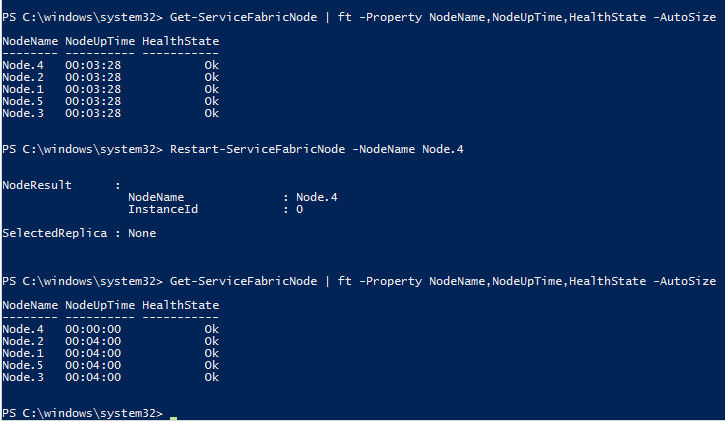

<properties
   pageTitle="Prüfbarkeit Aktion | Microsoft Azure"
   description="In diesem Artikel spricht über die Prüfbarkeit Aktionen in Microsoft Azure Service Architektur gefunden."
   services="service-fabric"
   documentationCenter=".net"
   authors="motanv"
   manager="timlt"
   editor="toddabel"/>

<tags
   ms.service="service-fabric"
   ms.devlang="dotnet"
   ms.topic="article"
   ms.tgt_pltfrm="NA"
   ms.workload="NA"
   ms.date="10/03/2016"
   ms.author="motanv;heeldin"/>

# <a name="testability-actions"></a>Prüfbarkeit Aktionen
Um eine unzuverlässigen Infrastruktur zu reproduzieren, bietet Azure Service Fabric, Entwickler, mit Methoden, um verschiedene praktisches Fehlern und Übergänge zwischen zu reproduzieren. Diese werden als Prüfbarkeit Aktionen verfügbar gemacht. Die Aktionen werden die Low-Level-APIs, die einem bestimmten Fehlerinjektion, Bundesstaat Übergang oder Überprüfung verursachen. Durch Kombinieren diese Aktionen, können Sie für Ihre Dienstleistungen umfassende Testszenarien schreiben.

Fabric-Dienst bietet, dass diese Aktionen anhand einiger allgemeiner Testszenarien enthalten. Es wird dringend empfohlen, dass Sie diese Szenarios integrierten zur Verfügung, das sorgfältig ausgewählt sind, um allgemeine Übergänge zwischen und Fehlern zu testen. Aktionen können jedoch verwendet werden, zum der benutzerdefinierten Testszenarios zu erstellen, wenn Sie den Schutz für Szenarien, die unterliegen nicht der integrierten Szenarien noch oder die sind benutzerdefinierte für eine Anwendung zugeschnitten, hinzufügen möchten.

C#-Implementierungen Aktionen werden in der System.Fabric.dll Assembly gefunden. Das System Fabric PowerShell-Modul ist in der Microsoft.ServiceFabric.Powershell.dll Assembly gefunden. Als Bestandteil der Runtime-Installation ist das ServiceFabric PowerShell-Modul installiert, um das Center für erleichterte Bedienung zulässig ist.

## <a name="graceful-vs-ungraceful-fault-actions"></a>Sicheres im Vergleich zu fehlerhaftes Fehlerstrukturanalyse-Aktionen
Prüfbarkeit Aktionen werden in zwei Bereiche Buckets unterteilt:

* Fehlerhaftes Fehlern: Diese Fehler simulieren Fehlern wie der Computer neu gestartet wurde und Absturz zu verarbeiten. In diesem Fall der Fehler hält plötzlich Ausführungskontext des Prozesses. Dies bedeutet, dass keine Aufräumen des Staates ausgeführt werden kann, bevor die Anwendung erneut gestartet wird.

* Sicheres Fehlern: Diese Fehler zu reproduzieren, sicheres Aktionen wie Replikat verschiebt und Tropfen durch den Lastenausgleich ausgelöst. In diesem Fall der Dienst erhält eine Benachrichtigung über die schließen und den Status, die vor dem Beenden aufräumen kann.

Führen Sie die Arbeitsbelastung Service und geschäftliche für eine bessere Qualität Überprüfung während veranlassen der verschiedenen sicheres und fehlerhaftes Fehlern. Fehlerhaftes Fehlern Übung Szenarien, die Stelle, an der der Dienstprozess plötzlich in der Mitte einige Workflow beendet wird. Auf diese Weise testen den Wiederherstellungspfad Wenn das Replikat Dienst vom Dienst Fabric wiederhergestellt werden. Dadurch wird testen Konsistenz der Daten und gibt an, ob der Dienststatus nach Fehlern richtig verwaltet wird. Das Spektrum Fehler (die ordnungsgemäß) testen, dass der Dienst richtig auf Replikate vom Dienst Fabric verschoben reagiert. Auf diese Weise in der Methode RunAsync Behandlung der Kündigung testen. Der Dienst muss zu prüfen, ob die Kündigung Token festlegen, Zustand nicht richtig gespeichert wird, und beenden Sie die Methode RunAsync.

## <a name="testability-actions-list"></a>Aktionsliste Prüfbarkeit

| Aktion | Beschreibung | Verwaltete API | PowerShell-Cmdlets | Sicheres/fehlerhaftes Fehlern |
|---------|-------------|-------------|-------------------|------------------------------|
|CleanTestState| Entfernt alle Testzustand aus dem Cluster bei Beendigung Verschlechterung der Testtreiber an. | CleanTestStateAsync | Entfernen-ServiceFabricTestState | Nicht verfügbar |
| InvokeDataLoss | Hervorruft Verlust von Daten in eine Servicepartition. | InvokeDataLossAsync | Rufen Sie ServiceFabricPartitionDataLoss | Sicheres |
| InvokeQuorumLoss | Eine angegebenen dynamische Servicepartition verschoben in Quorum Verlust. | InvokeQuorumLossAsync | Rufen Sie ServiceFabricQuorumLoss | Sicheres |
| Verschieben der primären | Verschiebt den angegebenen primären Kopie eine dynamische Dienst auf den angegebenen Clusterknoten. | MovePrimaryAsync | Verschieben-ServiceFabricPrimaryReplica | Sicheres |
| Verschieben des sekundären | Verschiebt den aktuellen sekundären Kopie eine dynamische Dienst an einen anderen Cluster-Knoten. | MoveSecondaryAsync | Verschieben-ServiceFabricSecondaryReplica | Sicheres |
| RemoveReplica | Entfernen eines Replikats aus einem Cluster simuliert einen Fehler Replikat. Dadurch wird das Replikat schließen und den Rolle Übergang wird 'Keine', entfernen alle Zustand aus dem Cluster. | RemoveReplicaAsync | Entfernen-ServiceFabricReplica | Sicheres |
| RestartDeployedCodePackage | Simuliert einen Code Paket Prozessfehler durch einen Neustart eines Code-Pakets auf einem Knoten in einem Cluster bereitgestellt. Dies bricht den Code Paket Prozess, alle Benutzer Dienst Replikate der gehostet, die in den Prozess neu gestartet wird. | RestartDeployedCodePackageAsync | Restart-ServiceFabricDeployedCodePackage | Fehlerhaftes |
| RestartNode | Simuliert ein Dienst Fabric Cluster Knoten Fehler durch einen Neustart von einem Knoten an. | RestartNodeAsync | Restart-ServiceFabricNode | Fehlerhaftes |
| RestartPartition | Ein Szenario Datacenter gesperrten oder Cluster gesperrten simuliert einen Neustart von einigen oder allen Replikaten einer Partition. | RestartPartitionAsync | Restart-ServiceFabricPartition | Sicheres |
| RestartReplica | Simuliert einen Replikat Fehler durch einen Neustart von einem dauerhaften Replikat in einem Cluster, das Replikat schließen und erneut öffnen. | RestartReplicaAsync | Restart-ServiceFabricReplica | Sicheres |
| StartNode | Startet einen Knoten in einem Cluster, der bereits beendet ist. | StartNodeAsync | Start-ServiceFabricNode | Nicht verfügbar |
| StopNode | Beenden eines Knotens in einem Cluster simuliert Ausfall eines Knotens. Der Knoten verbleibt nach unten bis StartNode aufgerufen wird. | StopNodeAsync | Beenden-ServiceFabricNode | Fehlerhaftes |
| ValidateApplication | Überprüft der Verfügbarkeit und aller Service Fabric Dienste innerhalb einer Anwendung, in der Regel nach veranlassen der einige Fehlerstrukturanalyse in das System. | ValidateApplicationAsync | Test-ServiceFabricApplication | Nicht verfügbar |
| ValidateService | Überprüft der Verfügbarkeit und für den Dienst Dienst Fabric normalerweise nach veranlassen der einige Fehlerstrukturanalyse in das System. | ValidateServiceAsync | Test-ServiceFabricService | Nicht verfügbar |

## <a name="running-a-testability-action-using-powershell"></a>Ausführen einer Prüfbarkeit Aktion mithilfe der PowerShell

In diesem Lernprogramm erfahren Sie, wie eine Aktion Prüfbarkeit mithilfe der PowerShell ausgeführt. Sie erhalten Informationen zum Ausführen einer Aktion Prüfbarkeit anhand einer lokalen (1-Box) Cluster oder eine Azure Cluster. Microsoft.Fabric.Powershell.dll – das Dienst Fabric PowerShell-Modul wird automatisch installiert, wenn Sie den Microsoft-Dienst Fabric MSI installiert haben. Das Modul wird automatisch geladen, wenn Sie eine Aufforderung PowerShell öffnen.

Lernprogramm Segmente:

- [Führen Sie eine Aktion für einen Cluster ein-Feld](#run-an-action-against-a-one-box-cluster)
- [Führen Sie eine Aktion für eine Azure cluster](#run-an-action-against-an-azure-cluster)

### <a name="run-an-action-against-a-one-box-cluster"></a>Führen Sie eine Aktion für einen Cluster ein-Feld

Zum Ausführen einer Aktion Prüfbarkeit anhand einer lokalen Cluster Verbinden mit dem Cluster zuerst, und öffnen Sie die PowerShell-Eingabeaufforderung im Administratormodus an. Prüfen Sie die Aktion **Restart-ServiceFabricNode** lassen Sie uns ein.

```powershell
Restart-ServiceFabricNode -NodeName Node1 -CompletionMode DoNotVerify
```

Hier ist die Aktion **Restart-ServiceFabricNode** auf einem Knoten mit dem Namen "Knoten 1" ausgeführt wird. Der Fertigstellung Modus gibt an, dass es nicht überprüfen sollten, ob die Aktion Restart-Knoten tatsächlich erfolgreich war. Angeben des Fertigstellung Modus an, wie "Überprüfen" sie zur Überprüfung führen, ob die Aktion Restart tatsächlich erfolgreich war. Statt direkt durch den Namen den Knoten angegeben wird, können Sie es über Partitionsschlüssel und die Art der Replikation wie folgt angeben:

```powershell
Restart-ServiceFabricNode -ReplicaKindPrimary  -PartitionKindNamed -PartitionKey Partition3 -CompletionMode Verify
```


```powershell
$connection = "localhost:19000"
$nodeName = "Node1"

Connect-ServiceFabricCluster $connection
Restart-ServiceFabricNode -NodeName $nodeName -CompletionMode DoNotVerify
```

**Restart-ServiceFabricNode** sollte verwendet werden, einen Dienst Fabric-Knoten in einem Cluster neu starten. Dies beendet den Prozess Fabric.exe, der alle System Dienst- und Dienst Replikate gehostet auf diesem Knoten neu gestartet wird. Mit dieser API zum Testen des Diensts hilft Fehlern entlang der Wiederherstellung Failover-Pfade für eine Steigerung. Sie können Knoten im Cluster simulieren.

Das folgende Bildschirmabbild zeigt den **Restart-ServiceFabricNode** Prüfbarkeit Befehl in Aktion.



Die Ausgabe der ersten **Get-ServiceFabricNode** (ein Cmdlet aus dem Dienst Fabric PowerShell-Modul) zeigt, dass der lokale Cluster fünf Knoten besitzt: Node.1 zu Node.5. Nach dem Ausführen der Aktion Prüfbarkeit (Cmdlet) **Restart-ServiceFabricNode** auf dem Knoten mit dem Namen Node.4, sehen wir, dass die Verfügbarkeit des Knotens zurückgesetzt wurde.

### <a name="run-an-action-against-an-azure-cluster"></a>Führen Sie eine Aktion für eine Azure cluster

Ausführen einer Aktion Prüfbarkeit (mit PowerShell) anhand eines Azure Clusters ist ähnlich wie die Aktion mit einem lokalen Cluster ausführen. Der einzige Unterschied ist, dass vor dem Ausführen der Aktion, anstelle einer Verbindung mit dem lokalen Cluster, Sie zuerst die Verbindung zum Azure Cluster herstellen müssen.

## <a name="running-a-testability-action-using-c35"></a>Ausführen einer Prüfbarkeit Aktion mit C & #35;

Zum Ausführen einer Aktion Prüfbarkeit mit c# müssen Sie zuerst mithilfe von FabricClient mit Cluster verbinden. Besorgen Sie sich dann die Parameter, die zum Ausführen der Aktion erforderlich sind. Andere Parameter können verwendet werden, die gleiche Aktion ausführen.
Suchen Sie die Aktion RestartServiceFabricNode, ist eine Möglichkeit, um Sie auszuführen mithilfe der Knoteninformationen (Knotenname und Knoten Instanz-ID) im Cluster.

```csharp
RestartNodeAsync(nodeName, nodeInstanceId, completeMode, operationTimeout, CancellationToken.None)
```

Erläuterung der Parameter:

- **CompleteMode** gibt an, dass der Modus nicht überprüfen sollten, ob die Aktion Restart tatsächlich erfolgreich war. Angeben des Fertigstellung Modus an, wie "Überprüfen" sie zur Überprüfung führen, ob die Aktion Restart tatsächlich erfolgreich war.  
- **OperationTimeout** legt die Zeitspanne für den Vorgang zu beenden, bevor eine Ausnahme TimeoutException ausgelöst wird.
- **CancellationToken** ermöglicht einen ausstehenden Anruf abgebrochen werden.

Statt direkt durch den Namen den Knoten angegeben wird, können Sie es über Partitionsschlüssel und die Art der Replikation angeben.

Weitere Informationen finden Sie unter [PartitionSelector und ReplicaSelector](#partition_replica_selector).


```csharp
// Add a reference to System.Fabric.Testability.dll and System.Fabric.dll
using System;
using System.Collections.Generic;
using System.Linq;
using System.Text;
using System.Threading.Tasks;
using System.Fabric.Testability;
using System.Fabric;
using System.Threading;
using System.Numerics;

class Test
{
    public static int Main(string[] args)
    {
        string clusterConnection = "localhost:19000";
        Uri serviceName = new Uri("fabric:/samples/PersistentToDoListApp/PersistentToDoListService");
        string nodeName = "N0040";
        BigInteger nodeInstanceId = 130743013389060139;

        Console.WriteLine("Starting RestartNode test");
        try
        {
            //Restart the node by using ReplicaSelector
            RestartNodeAsync(clusterConnection, serviceName).Wait();

            //Another way to restart node is by using nodeName and nodeInstanceId
            RestartNodeAsync(clusterConnection, nodeName, nodeInstanceId).Wait();
        }
        catch (AggregateException exAgg)
        {
            Console.WriteLine("RestartNode did not complete: ");
            foreach (Exception ex in exAgg.InnerExceptions)
            {
                if (ex is FabricException)
                {
                    Console.WriteLine("HResult: {0} Message: {1}", ex.HResult, ex.Message);
                }
            }
            return -1;
        }

        Console.WriteLine("RestartNode completed.");
        return 0;
    }

    static async Task RestartNodeAsync(string clusterConnection, Uri serviceName)
    {
        PartitionSelector randomPartitionSelector = PartitionSelector.RandomOf(serviceName);
        ReplicaSelector primaryofReplicaSelector = ReplicaSelector.PrimaryOf(randomPartitionSelector);

        // Create FabricClient with connection and security information here
        FabricClient fabricclient = new FabricClient(clusterConnection);
        await fabricclient.FaultManager.RestartNodeAsync(primaryofReplicaSelector, CompletionMode.Verify);
    }

    static async Task RestartNodeAsync(string clusterConnection, string nodeName, BigInteger nodeInstanceId)
    {
        // Create FabricClient with connection and security information here
        FabricClient fabricclient = new FabricClient(clusterConnection);
        await fabricclient.FaultManager.RestartNodeAsync(nodeName, nodeInstanceId, CompletionMode.Verify);
    }
}
```

## <a name="partitionselector-and-replicaselector"></a>PartitionSelector und ReplicaSelector

### <a name="partitionselector"></a>PartitionSelector
PartitionSelector eine Hilfe im Prüfbarkeit verfügbar gemacht und dient zum Auswählen einer bestimmten Speicherplatz eines die Prüfbarkeit Aktionen ausführen. Es kann verwendet werden, um einer bestimmten Partition auszuwählen, wenn die Partitions-ID im Voraus bekannt ist. Oder Sie können die Partitionsschlüssel bereitstellen, und Lösen des Vorgangs die Partitions-ID intern. Sie haben auch die Möglichkeit, eine zufällige Partition auswählen.

Wenn diese Helper verwenden möchten, erstellen Sie das Objekt PartitionSelector, und wählen Sie die Partition mithilfe einer der Methoden Select *. Klicken Sie dann in das Objekt PartitionSelector übergeben Sie, an der API, die es erfordert. Wenn keine Option ausgewählt ist, wird standardmäßig eine zufällige Partition.

```csharp
Uri serviceName = new Uri("fabric:/samples/InMemoryToDoListApp/InMemoryToDoListService");
Guid partitionIdGuid = new Guid("8fb7ebcc-56ee-4862-9cc0-7c6421e68829");
string partitionName = "Partition1";
Int64 partitionKeyUniformInt64 = 1;

// Select a random partition
PartitionSelector randomPartitionSelector = PartitionSelector.RandomOf(serviceName);

// Select a partition based on ID
PartitionSelector partitionSelectorById = PartitionSelector.PartitionIdOf(serviceName, partitionIdGuid);

// Select a partition based on name
PartitionSelector namedPartitionSelector = PartitionSelector.PartitionKeyOf(serviceName, partitionName);

// Select a partition based on partition key
PartitionSelector uniformIntPartitionSelector = PartitionSelector.PartitionKeyOf(serviceName, partitionKeyUniformInt64);
```

### <a name="replicaselector"></a>ReplicaSelector
ReplicaSelector eine Hilfe im Prüfbarkeit verfügbar gemacht und wird verwendet, um ein Replikat aus, um eine der Prüfbarkeit Aktionen auszuführen zu markieren. Es kann verwendet werden, um ein bestimmtes Replikat auszuwählen, wenn die Replikat-ID im Voraus bekannt ist. Darüber hinaus haben Sie die Möglichkeit, ein primäres Replikat oder eine zufällige sekundäre auswählen. ReplicaSelector wird von PartitionSelector, abgeleitet, daher müssen Sie sowohl das Replikat und die zum Ausführen des Vorgangs Prüfbarkeit soll Partition auswählen.

Wenn diese Helper verwenden möchten, erstellen Sie ein Objekt ReplicaSelector, und legen Sie das Replikat und die Partition markiert werden soll. Anschließend können Sie es in der API übergeben, die erforderlich ist. Wenn keine Option ausgewählt ist, wird standardmäßig eine zufällige Replikat und zufällige partitionieren.

```csharp
Guid partitionIdGuid = new Guid("8fb7ebcc-56ee-4862-9cc0-7c6421e68829");
PartitionSelector partitionSelector = PartitionSelector.PartitionIdOf(serviceName, partitionIdGuid);
long replicaId = 130559876481875498;

// Select a random replica
ReplicaSelector randomReplicaSelector = ReplicaSelector.RandomOf(partitionSelector);

// Select the primary replica
ReplicaSelector primaryReplicaSelector = ReplicaSelector.PrimaryOf(partitionSelector);

// Select the replica by ID
ReplicaSelector replicaByIdSelector = ReplicaSelector.ReplicaIdOf(partitionSelector, replicaId);

// Select a random secondary replica
ReplicaSelector secondaryReplicaSelector = ReplicaSelector.RandomSecondaryOf(partitionSelector);
```

## <a name="next-steps"></a>Nächste Schritte

- [Prüfbarkeit Szenarien](service-fabric-testability-scenarios.md)
- Zum Testen des Diensts
   - [Fehler beim Dienst Auslastung simulieren](service-fabric-testability-workload-tests.md)
   - [Dienst-Kommunikation Fehlern](service-fabric-testability-scenarios-service-communication.md)
