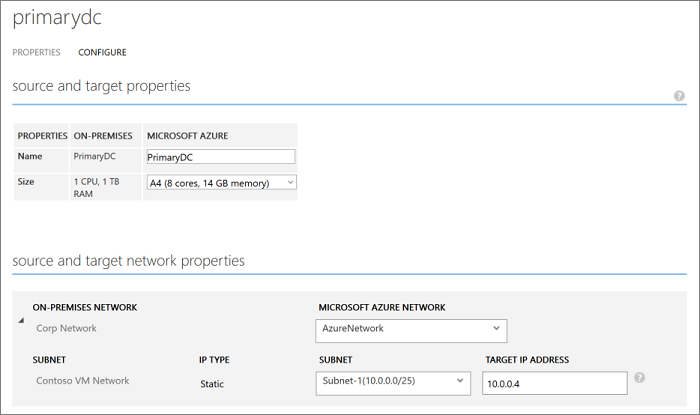
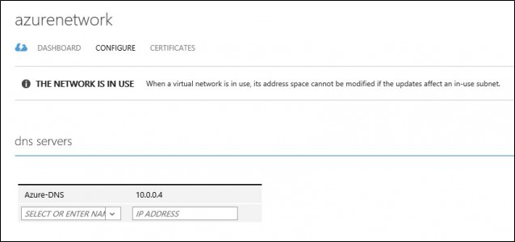

<properties
    pageTitle="Schützen von Active Directory und DNS mit Azure Website Wiederherstellung | Microsoft Azure"
    description="Dieser Artikel beschreibt, wie Sie eine Disaster Wiederherstellung Lösung für Active Directory mithilfe von Azure Website Wiederherstellung implementieren."
    services="site-recovery"
    documentationCenter=""
    authors="prateek9us"
    manager="abhiag"
    editor=""/>

<tags
    ms.service="site-recovery"
    ms.devlang="na"
    ms.topic="article"
    ms.tgt_pltfrm="na"
    ms.workload="storage-backup-recovery"
    ms.date="08/31/2016"
    ms.author="pratshar"/>

# Schützen von Active Directory und DNS mit Azure Website Wiederherstellung

Enterprise-Anwendungen wie SharePoint, ANGEHÖREN und SAP-hängen davon ab, Active Directory und DNS-Infrastruktur ordnungsgemäß funktioniert. Wenn Sie eine vollständige Disaster Wiederherstellung Lösung für erstellen, ist es wichtig, denken Sie daran, die Sie schützen und Wiederherstellen von Active Directory und DNS vor der anderen Anwendungskomponenten, um sicherzustellen, dass Elemente ordnungsgemäß funktionieren, wenn Sie bei Datenverlusten müssen.

Website Wiederherstellung ist eine Azure-Dienst, der Wiederherstellung durch Replikation, Failover und Wiederherstellung von virtuellen Computern orchestriert enthält. Website Wiederherstellung unterstützt eine Anzahl von Replikationsszenarien konsistent schützen, und nahtloses Failover virtuellen Computern und -Programmen privat, öffentlich oder Hoster Wolken an.

Website Wiederherstellung können Sie einen Plan abgeschlossen automatisierte zur Wiederherstellung für Active Directory erstellen. Wenn Ausbluten auftreten, können Sie ein Failover innerhalb von Sekunden überall initiiert und Einstieg Active Directory in wenigen Minuten. Wenn Sie Active Directory für mehrere Anwendungen wie SharePoint und SAP, in dem primären Standort bereitgestellt haben, und ein Fehler auftreten, über die Website abgeschlossen werden soll, können Sie nicht über Active Directory zunächst mit Wiederherstellung der Website, und klicken Sie dann über die genutzte anwendungsspezifische Wiederherstellung Pläne fehl.

In diesem Artikel wird erläutert, wie eine Disaster Wiederherstellung Lösung für Active Directory, wie geplanten und ungeplanten ausgeführt werden und Testfailovers mithilfe eines ein-Klick-Wiederherstellung planen, die unterstützten Konfigurationen und erforderliche Komponenten erstellen.  Sie sollten Active Directory und Azure-Website Wiederherstellung vertraut sein, bevor Sie beginnen.

Es gibt zwei empfohlene Optionen ausgehend von der Komplexität Ihrer Umgebung.

### Option 1

Wenn Sie eine kleine Anzahl von Applications und einem einzelnen Domäne bereitgestellt haben und über die gesamte Website ein Fehler auftreten soll, dann empfohlen Verwendung Website Wiederherstellung repliziert den Domänencontroller an den sekundären Standort (gibt an, ob Sie über Azure oder an einem sekundären Standort weiß nicht sind). Die gleichen repliziert virtuellen Computern kann auch Failoververarbeitung Test verwendet werden.

### Option 2

Oder wenn Sie eine große Anzahl von Applications und in der Umgebung mehrere Domänencontroller vorliegt, wenn Sie beabsichtigen, über ein paar Applikationen nacheinander fehlschlägt, wir zusätzlich zur Replikation der Domänencontroller virtuellen Computern mit Website Wiederherstellung empfehlen erhalten Sie auch einen zusätzlichen Domänencontroller (Azure oder eine lokale sekundäre Datacenter) der Zielwebsite einrichten.

>[AZURE.NOTE] Auch wenn Sie dafür einen Test-Failover, den Sie weiterhin den Domänencontroller mit Website Wiederherstellung repliziert müssen Option Basis 2 zurück, implementieren. Lesen Sie weitere Informationen zu [Testen Failover Aspekte](#considerations-for-test-failover) .

In den folgenden Abschnitten wird erläutert, wie Schutz für Domänencontroller in Wiederherstellung Website aktiviert haben, und zum Einrichten von Domänencontroller in Azure.

## Erforderliche Komponenten

- Einer lokalen Bereitstellung von Active Directory und DNS-Server.
- Ein Azure Site Wiederherstellung Services Tresor in einem Microsoft Azure-Abonnement.
- Ob Sie der Azure-virtuellen Computern Readiness Analysetool auf virtuellen Computern, um sicherzustellen, Azure ausführen repliziert sind sind mit Azure-virtuellen Computern und Azure Site Wiederherstellung Services kompatibel.

## Aktivieren des Schutzes mithilfe von Website-Wiederherstellung

### Schützen des virtuellen Computers

Aktivieren Sie Schutz des Controller/DNS-Domäne virtuellen Computers in Wiederherstellung Website. Konfigurieren von Einstellungen zur Website Wiederherstellung basierend auf dem virtuellen Computern (Hyper-V oder VMware). Es empfiehlt sich, eine Absturz konsistente Replikation Häufigkeit von 15 Minuten.

###Konfigurieren von Einstellungen des virtuellen Computers Netzwerk

Konfigurieren Sie für die Domänencontroller/DNS-virtuellen Computern deren Einstellungen im Netzwerk in Wiederherstellung Website so, dass nach Failover der virtuellen Computer mit dem richtigen Netzwerk zugeordnet werden. Beispielsweise, wenn Sie Hyper-V virtuelle Computer in Azure repliziert sind können Sie den virtuellen Computer in der Cloud VMM oder in der Gruppe "Schutz" So konfigurieren Sie die Einstellungen im Netzwerk wie unten dargestellt auswählen

## Schützen von Active Directory mit Active Directory-Replikation

### Website-zu-Standort Schutz

Erstellen Sie einen Domänencontroller auf den sekundären Standort aus, und geben Sie den Namen der gleichen Domäne, die auf dem primären Standort verwendet wird, wenn Sie auf den Server zu einer Domänencontrollerrolle heraufstufen. Sie können das **Active Directory-Websites und-Diensten** -Snap-in verwenden, so konfigurieren Sie Einstellungen auf das Objekt, dem die Websites hinzugefügt werden. Durch die Einstellungen für einen Link zu konfigurieren, können Sie steuern, wann Replikation zwischen zwei oder mehr Standorten, und wie oft. Weitere Informationen hierzu finden Sie unter [Planen der Replikation zwischen Standorten](https://technet.microsoft.com/library/cc731862.aspx) .

###Website-Azure-Schutz

Folgen Sie den Anweisungen zum [Erstellen von Domänencontroller in ein Azure-virtuellen Netzwerk](../active-directory/active-directory-install-replica-active-directory-domain-controller.md)ein. Wenn Sie auf den Server zu einer Domänencontrollerrolle heraufstufen Geben Sie den gleichen Domänennamen, der auf dem primären Standort verwendet wird.

Klicken Sie dann [den DNS-Server für das virtuelle Netzwerk neu konfigurieren](../active-directory/active-directory-install-replica-active-directory-domain-controller.md#reconfigure-dns-server-for-the-virtual-network), verwenden Sie den DNS-Server in Azure.

## Testen der Failover Aspekte

Test Failovers in einem Netzwerk, das aus produktiv-Netzwerk isoliert hat, so, dass es keine Auswirkung auf Produktionsarbeitslasten befindet.

Die meisten Applikationen erfordern auch das Vorhandensein von einer Domänencontroller und einem DNS-Server funktioniert, d. h., bevor der Anwendungs über fehlgeschlagen ist, benötigt ein Domänencontroller im Netzwerk isoliert Failoververarbeitung Test verwendet werden, erstellt werden. Die einfachste Möglichkeit hierfür ist zum Schutz auf die Domänencontroller/DNS-virtuellen Computern mit Wiederherstellung Website aktivieren, und führen Sie einen Test-Failover des virtuellen Computers, vor dem Ausführen eines Failovers Testen des Wiederherstellung Plans für die Anwendung. Sieht wie folgt aus:

1. Aktivieren des Schutzes in Website Wiederherstellung für die Domänencontroller/DNS-virtuellen Computern.
2. Erstellen Sie ein Netzwerk isoliertes. Jedes virtuelles Netzwerk standardmäßig in Azure erstellt wird von anderen Netzwerken getrennt. Es empfiehlt sich, dass der IP-Adresse für dieses Netzwerk Bereich Ihres Netzwerks für die Herstellung identisch ist. Aktivieren Sie nicht zwischen Standorten Connectivity in diesem Netzwerk.
3. Geben Sie eine DNS IP-Adresse im Netzwerk erstellt haben, als die IP-Adresse, die Sie die DNS-virtuellen Computern abzurufenden erwarten. Wenn Sie in Azure repliziert sind, geben Sie Sie dann die IP-Adresse für den virtuellen Computer, die auf Failover in **Ziel-IP** -Einstellung im virtuellen Computer Eigenschaften verwendet werden. Wenn Sie Replikation sind auf ein anderes lokalen Standort und die Anweisungen zum [Einrichten von DNS und DHCP Test Failoververarbeitung](site-recovery-failover.md#prepare-dhcp) DHCP folgen verwenden

>[AZURE.NOTE] Die IP-Adresse eines virtuellen Computers beim Test Failover zugewiesenen lautet wie die IP-Adresse, die sie bei einem geplanten oder ungeplanten Failover erhalten möchten, wenn die IP-Adresse im Netzwerk testen Failover verfügbar ist. Wenn sie nicht ist, empfängt des virtuellen Computers eine andere IP-Adresse, die im Netzwerk Failover Test zur Verfügung.

4. Klicken Sie auf die Domänencontroller virtuellen Computern ausführen ein Failovers testen, in dem Netzwerk isoliert. Verwenden Sie neueste verfügbare Anwendung konsistente Wiederherstellungspunkt des virtuellen Computers Domänencontroller, um das Test-Failover durchzuführen. 
5. Ausführen eines Failovers Test für die Anwendung Wiederherstellungsplan.
6. Nach Abschluss der Tests markieren Sie den Test Failover Auftrag des virtuellen und des Wiederherstellung Plans 'Abgeschlossen' auf der Registerkarte **Aufträge** im Portal Website Wiederherstellung aus.

### DNS-Einträge und Domänen Controller auf unterschiedlichen Computern

Wenn DNS auf dem gleichen virtuellen Computer als Domänencontroller nicht müssen Sie einen DNS VM Failoververarbeitung Test zu erstellen. Wenn sie auf dem gleichen virtuellen Computer befinden, können Sie diesen Abschnitt überspringen.

Sie können einen frischen DNS-Server verwenden und alle erforderlichen Zonen erstellen. Wenn Ihr Active Directory-Domäne "contoso.com" ist, können Sie beispielsweise eine DNS-Zone mit dem Namen "contoso.com" erstellen. Die Einträge zu Active Directory müssen in DNS, wie folgt aktualisiert werden:

1. Stellen Sie sicher, dass diese Einstellungen vor anderen virtuellen Computern in den Wiederherstellungsplan auftauchen Ort aufweisen:

    - Die Zone muss nach der Root Gesamtstrukturname benannt werden.
    - Die Zone muss gesicherte Datei.
    - Die Zone muss für sichere und unsichere Updates aktiviert sein.
    - Die Auflösung des virtuellen Computers Domänencontroller sollte der IP-Adresse des DNS-virtuellen Computers zeigen.

2. Führen Sie den folgenden Befehl auf virtuellen aus:

    `nltest /dsregdns`

3. Hinzufügen einer Zone auf der DNS-Server, unsichere Updates zulassen und dafür DNS einen Eintrag hinzufügen:

        dnscmd /zoneadd contoso.com  /Primary
        dnscmd /recordadd contoso.com  contoso.com. SOA %computername%.contoso.com. hostmaster. 1 15 10 1 1
        dnscmd /recordadd contoso.com %computername%  A <IP_OF_DNS_VM>
        dnscmd /config contoso.com /allowupdate 1

## Nächste Schritte

Lesen [welche Auslastung können schützen?](../site-recovery/site-recovery-workload.md) Weitere Informationen zum Schützen von Enterprise Auslastung mit Azure Website Wiederherstellung.
