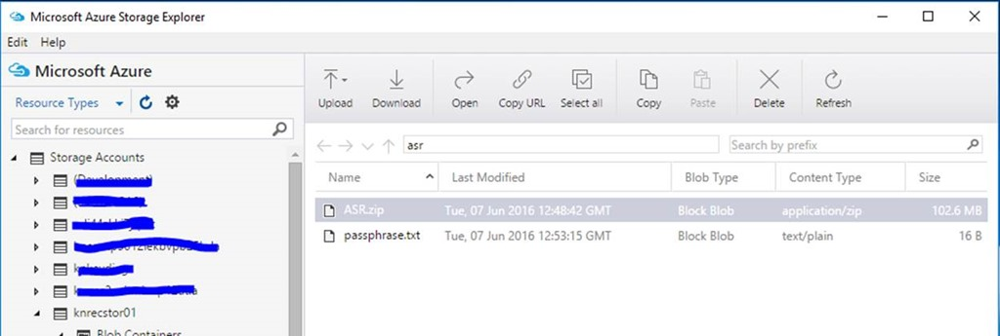
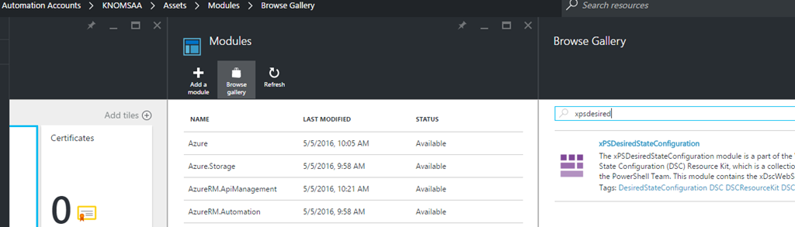
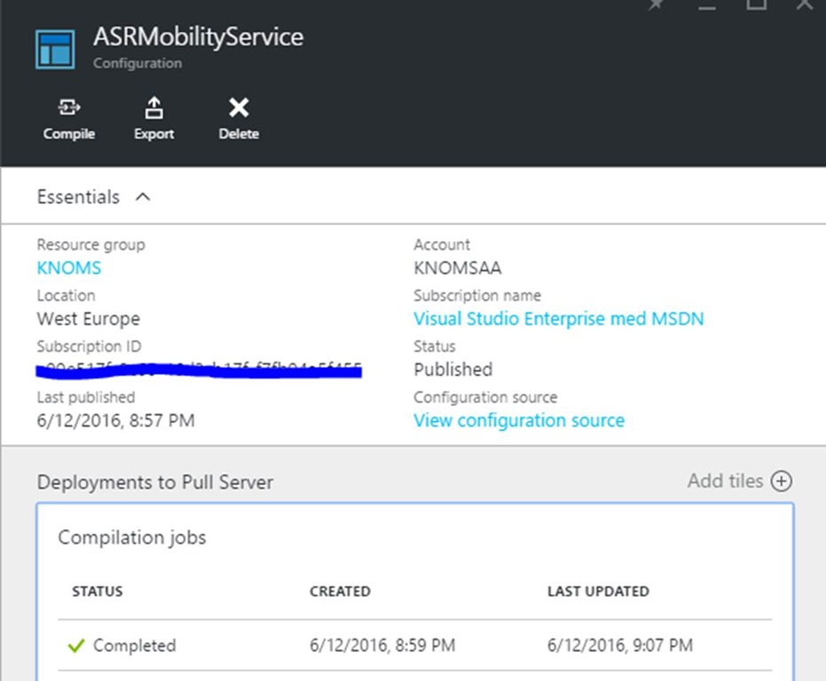
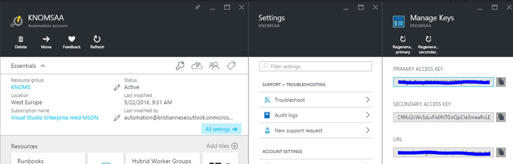
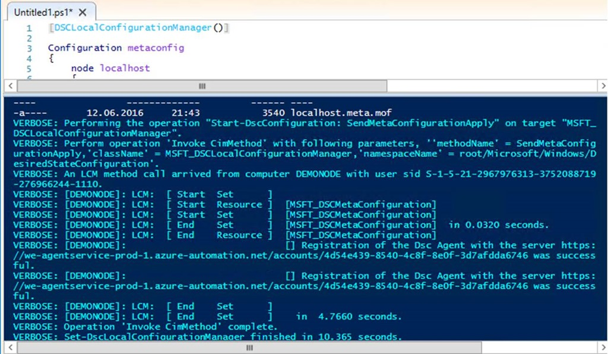
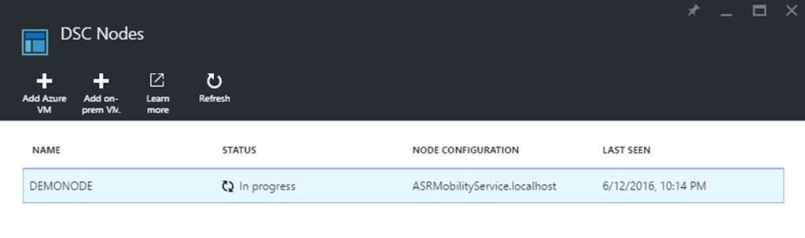
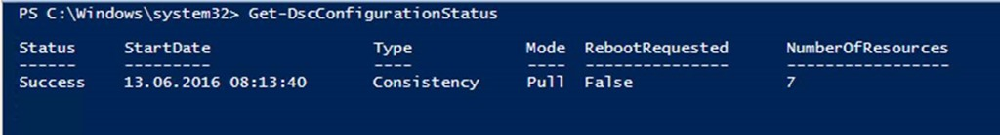
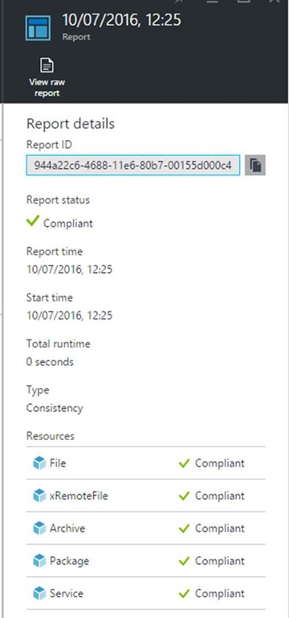

<properties
    pageTitle="Virtuelle VMware-Computer auf Azure mithilfe von Website-Wiederherstellung mit Azure Automatisierung DSC repliziert | Microsoft Azure"
    description="Beschreibt, wie mit Azure Automatisierung DSC automatisch der Azure-Website Wiederherstellung Mobilität Dienst und Azure Agent für virtuelle/physische Maschinen Azure bereitstellen."
    services="site-recovery"
    documentationCenter=""
    authors="krnese"
    manager="lorenr"
    editor=""/>

<tags
    ms.service="site-recovery"
    ms.workload="backup-recovery"
    ms.tgt_pltfrm="na"
    ms.devlang="na"
    ms.topic="article"
    ms.date="07/26/2016"
    ms.author="krnese"/>

# <a name="replicate-vmware-virtual-machines-to-azure-by-using-site-recovery-with-azure-automation-dsc"></a>Virtuelle VMware-Computer auf Azure mithilfe von Website-Wiederherstellung mit Azure Automatisierung DSC repliziert

In Vorgänge Management Suite stellen wir mit einem umfassenden Sicherung und Wiederherstellung Disaster-Lösung, die Sie als Teil Ihrer Business Continuity-Plan verwenden können.

Wir haben diese Reise zusammen mit Hyper-V mithilfe von Hyper-V Replica gestartet. Aber wir haben erweitert, damit die Unterstützung für einer heterogenen eingerichtet wurde, da Kunden ihre Wolken mehrere Hypervisoren und Plattformen haben.

Wenn Sie VMware Auslastung und/oder physischen Servern heute ausgeführt werden, wird ein Management Server alle Komponenten Azure Website Wiederherstellung Ihrer Umgebung zu behandeln, die Replikation Kommunikation und Daten mit Azure, wenn Azure Ihr Ziel ausgeführt.

## <a name="deploy-the-site-recovery-mobility-service-by-using-automation-dsc"></a>Bereitstellen des Website Wiederherstellung Mobilität Diensts mithilfe von Automatisierung DSC
Beginnen wir mit schnellen Überblick über die Funktionsweise auf diesem Server Management ausführen.

Management-Server ausgeführt wird, mehrere Serverrollen. Eine der folgenden Rollen ist *Konfiguration*, bei der Kommunikation koordiniert und verwaltet Daten Replikation und Wiederherstellung Prozesse.

Darüber hinaus fungiert die Rolle des *Prozesses* als Replikation Gateway ein. Diese Rolle empfängt Replikationsdaten von geschützten Quelle Maschinen, es mit zwischenspeichern, Komprimierung und Verschlüsselung optimiert und sendet es anschließend mit einer Firma Azure-Speicher. Eine der Funktionen für die Prozessrolle ist auch Pushbenachrichtigungen Installation des Diensts Mobilität geschützten Computern und automatische Erkennung von VMware virtuellen Computern ausführen.

Ist ein Failback aus Azure, wird die Rolle des *master Ziel* die Replikationsdaten als Teil dieses Vorgangs behandeln.

Für die geschützten Computer bauen wir *Mobilität Dienst*. Diese Komponente wird auf jedem Computer (VMware VM oder physischen Server) bereitgestellt, die auf Azure repliziert werden soll. Schreiben von Daten auf dem Computer erfasst und an den Server Management (Prozessrolle) weiterleitet.

Beim Umgang mit Geschäftskontinuität sind, ist es wichtig, zu Ihrer Auslastung, Ihre Infrastruktur und die beteiligten Komponenten zu verstehen. Dann können Sie die Anforderungen für Ihre Ziel-Wiederherstellung Zeit (RTO) und Wiederherstellung Punkt RPO-Ziele erfüllen. In diesem Zusammenhang ist der Dienst Mobilität-Taste, um sicherzustellen, dass Ihre Auslastung geschützt sind, wie Sie zu erwarten ist.

Also wie, optimal, sorgen Sie mit Hilfe einige Vorgänge Management Suite Komponenten einer zuverlässigen geschützten können?

Dieser Artikel enthält ein Beispiel für die Nutzung Azure Automatisierung gewünscht Zustand Konfiguration (DSC), zusammen mit einer Website Wiederherstellung, um sicherzustellen, dass an:

- Der Mobilität Dienst und Azure-virtuellen Computer-Agent werden auf die Windows-Computer bereitgestellt, die Sie schützen möchten.
- Der Mobilität Dienst und Azure-virtuellen Computer-Agent werden immer ausgeführt, wenn Azure das Replikationsziel ist.

## <a name="prerequisites"></a>Erforderliche Komponenten

- Ein Repository für die Einrichtung gespeichert.
- Ein Repository für das Speichern des Kennwort erforderlichen, mit dem Management Server registrieren

 > [AZURE.NOTE] Eine eindeutige Kennwort wird für jedes Management Server generiert. Wenn Sie mehrere Management Server bereitstellen möchten, müssen Sie sicherstellen, dass das richtige Kennwort in der Datei passphrase.txt gespeichert ist.

- Windows Management Framework (WMF) auf den Computern, die Sie aktivieren, für den Schutz (eine Vorbedingung für Automatisierung DSC möchten) installierten 5.0

 > [AZURE.NOTE] Wenn Sie möchten DSC für Windows-Computer verwenden, die WMF 4.0 installiert haben, finden Sie im Abschnitt [Verwenden DSC in Umgebungen getrennt](#Use DSC in disconnected environments).

Der Dienst Mobilität kann über die Befehlszeile installiert sein und mehrere Argumente akzeptiert. Daher müssen Sie die Binärdateien (nach extrahieren, aus dem Setup) verfügen und an einem Ort, wo Sie sie abrufen können mithilfe einer DSC-Konfigurations, zu speichern.

## <a name="step-1-extract-binaries"></a>Schritt 1: Extrahieren Binärdateien

1. Navigieren Sie zum Extrahieren der Dateien, die Sie für diese Installation benötigen, in das folgende Verzeichnis auf dem Server Management:

    **\Microsoft Azure Website Recovery\home\svsystems\pushinstallsvc\repository**

    In diesem Ordner sollte eine MSI-Datei mit der Bezeichnung angezeigt werden:

    **Microsoft-ASR_UA_version_Windows_GA_date_Release.exe**

    Verwenden Sie den folgenden Befehl aus, um das Installationsprogramm extrahieren:

    **.\Microsoft-ASR_UA_9.1.0.0_Windows_GA_02May2016_release.exe/q /x:C:\Users\Administrator\Desktop\Mobility_Service\Extract**

2. Wählen Sie alle Dateien aus, und senden Sie diese an einen (ZIP) Ordner.

Sie verfügen nun über die Binärdateien, die Sie benötigen, um die Einrichtung des Diensts Mobilität mit Automatisierung DSC automatisieren.

### <a name="passphrase"></a>Kennwort

Als Nächstes müssen Sie bestimmen, wo diese ZIP-Ordner eingefügt werden sollen. Siehe höher, das Kennwort gespeichert, das Sie für die Einrichtung benötigen, können Sie ein Konto Azure-Speicher verwenden. Der Agent Registriere klicken Sie dann mit dem Management Server als Teil des Prozesses.

Das Kennwort, das Sie erhalten haben, wenn Sie den Management Server bereitgestellt kann in eine Textdatei als passphrase.txt gespeichert werden.

Platzieren Sie den komprimierten Ordner und das Kennwort in einem speziellen Container in das Konto Azure-Speicher ein.



Wenn Sie diese Dateien auf einer Freigabe in Ihrem Netzwerk beibehalten möchten, können Sie dies tun. Sie müssen nur sicherstellen, dass die DSC Ressource, die Sie später verwenden Zugriff und die Einrichtung und das Kennwort erhalte.

## <a name="step-2-create-the-dsc-configuration"></a>Schritt 2: Erstellen der DSC-Konfigurations

Das Setup hängt WMF 5.0 aus. Wenn der Computer die Konfiguration über Automatisierung DSC erfolgreich anwenden muss WMF 5.0 vorhanden sein.

Die Umgebung verwendet die folgende Beispiel DSC Konfiguration:

```powershell
configuration ASRMobilityService {

    $RemoteFile = 'https://knrecstor01.blob.core.windows.net/asr/ASR.zip'
    $RemotePassphrase = 'https://knrecstor01.blob.core.windows.net/asr/passphrase.txt'
    $RemoteAzureAgent = 'http://go.microsoft.com/fwlink/p/?LinkId=394789'
    $LocalAzureAgent = 'C:\Temp\AzureVmAgent.msi'
    $TempDestination = 'C:\Temp\asr.zip'
    $LocalPassphrase = 'C:\Temp\Mobility_service\passphrase.txt'
    $Role = 'Agent'
    $Install = 'C:\Program Files (x86)\Microsoft Azure Site Recovery'
    $CSEndpoint = '10.0.0.115'
    $Arguments = '/Role "{0}" /InstallLocation "{1}" /CSEndpoint "{2}" /PassphraseFilePath "{3}"' -f $Role,$Install,$CSEndpoint,$LocalPassphrase

    Import-DscResource -ModuleName xPSDesiredStateConfiguration

    node localhost {

        File Directory {
            DestinationPath = 'C:\Temp\ASRSetup\'
            Type = 'Directory'            
        }

        xRemoteFile Setup {
            URI = $RemoteFile
            DestinationPath = $TempDestination
            DependsOn = '[File]Directory'
        }

        xRemoteFile Passphrase {
            URI = $RemotePassphrase
            DestinationPath = $LocalPassphrase
            DependsOn = '[File]Directory'
        }

        xRemoteFile AzureAgent {
            URI = $RemoteAzureAgent
            DestinationPath = $LocalAzureAgent
            DependsOn = '[File]Directory'
        }

        Archive ASRzip {
            Path = $TempDestination
            Destination = 'C:\Temp\ASRSetup'
            DependsOn = '[xRemotefile]Setup'
        }

        Package Install {
            Path = 'C:\temp\ASRSetup\ASR\UNIFIEDAGENT.EXE'
            Ensure = 'Present'
            Name = 'Microsoft Azure Site Recovery mobility Service/Master Target Server'
            ProductId = '275197FC-14FD-4560-A5EB-38217F80CBD1'
            Arguments = $Arguments
            DependsOn = '[Archive]ASRzip'
        }

        Package AzureAgent {
            Path = 'C:\Temp\AzureVmAgent.msi'
            Ensure = 'Present'
            Name = 'Windows Azure VM Agent - 2.7.1198.735'
            ProductId = '5CF4D04A-F16C-4892-9196-6025EA61F964'
            Arguments = '/q /l "c:\temp\agentlog.txt'
            DependsOn = '[Package]Install'
        }

        Service ASRvx {
            Name = 'svagents'
            Ensure = 'Present'
            State = 'Running'
            DependsOn = '[Package]Install'
        }

        Service ASR {
            Name = 'InMage Scout Application Service'
            Ensure = 'Present'
            State = 'Running'
            DependsOn = '[Package]Install'
        }

        Service AzureAgentService {
            Name = 'WindowsAzureGuestAgent'
            Ensure = 'Present'
            State = 'Running'
            DependsOn = '[Package]AzureAgent'
        }

        Service AzureTelemetry {
            Name = 'WindowsAzureTelemetryService'
            Ensure = 'Present'
            State = 'Running'
            DependsOn = '[Package]AzureAgent'
        }
    }
}
```
Die Konfiguration der folgenden Aktionen ausführen:

- Informieren die Variablen der Konfiguration auf, wo Sie die Binärdateien für den Dienst Mobilität und der Agent Azure-virtuellen Computer zu erhalten, wo Sie das Kennwort zu erhalten, und wo die Ausgabe gespeichert.
- Importieren der Konfiguration die Ressource xPSDesiredStateConfiguration DSC, damit Sie verwenden können `xRemoteFile` , die Dateien aus dem Repository heruntergeladen.
- Die Konfiguration wird ein Verzeichnis erstellen, in dem die Binärdateien gespeichert werden sollen.
- Archivressource extrahiert die Dateien aus der ZIP-Ordner.
- Das Paket installieren Ressource wird den Dienst Mobilität aus der UNIFIEDAGENT installiert. EXE Installer mit bestimmten Argumenten. (Die Variablen, die die Argumente erstellen müssen entsprechend Ihrer Umgebung geändert werden.)
- Das Paket AzureAgent Ressource wird den Agent Azure-virtuellen Computer installiert, die jeder virtuellen Computers empfohlen wird, die in Azure ausgeführt wird. Der Azure-virtuellen Computer-Agent ermöglicht außerdem das Erweiterungen den virtuellen Computer nach Failover hinzufügen.
- Dienst oder mehrere Ressourcen werden Stellen Sie sicher, dass die zugehörigen Mobilität und der Azure Dienste immer ausgeführt werden.

Speichern Sie die Konfiguration als **ASRMobilityService**ein.

>[AZURE.NOTE] Denken Sie daran, ersetzen die CSIP in der Konfiguration, um den tatsächlichen Management Server widerspiegeln, sodass der Agent ordnungsgemäß verbunden werden, sodass das richtige Kennwort verwendet wird.

## <a name="step-3-upload-to-automation-dsc"></a>Schritt 3: Hochladen Sie in Automatisierung DSC

Da die DSC-Konfiguration, die Sie vorgenommen ein benötigtes DSC Ressource-Modul (xPSDesiredStateConfiguration) importieren, müssen Sie diese Modul in Automatisierung importieren, bevor Sie die Konfiguration DSC hochladen.

Melden Sie sich bei Ihrem Konto Automatisierung, navigieren Sie zu **Posten** > **Module**, und klicken Sie auf **Katalog durchsuchen**.

Hier können Sie für das Modul suchen und in Ihr Konto importieren.



Wenn Sie dies abgeschlossen haben, wechseln Sie zu Ihrem Computer müssen Sie, wo die Ressourcenmanager Azure-Module installiert, und fahren Sie mit die neu erstellte DSC Konfiguration importieren.

### <a name="import-cmdlets"></a>Importieren von cmdlets

Melden Sie in PowerShell sich für Ihr Abonnement Azure. Ändern der-Cmdlets zur wirken sich auf Ihrer Umgebung aus und erfassen Ihre Kontoinformationen Automatisierung in einer Variablen zu speichern:

```powershell
$AAAccount = Get-AzureRmAutomationAccount -ResourceGroupName 'KNOMS' -Name 'KNOMSAA'
```

Laden Sie die Konfiguration in Automatisierung DSC mithilfe das folgende Cmdlet aus:

```powershell
$ImportArgs = @{
    SourcePath = 'C:\ASR\ASRMobilityService.ps1'
    Published = $true
    Description = 'DSC Config for Mobility Service'
}
$AAAccount | Import-AzureRmAutomationDscConfiguration @ImportArgs
```

### <a name="compile-the-configuration-in-automation-dsc"></a>Die Konfiguration in Automatisierung DSC kompilieren

Als Nächstes müssen Sie die Konfiguration in Automatisierung DSC, kompilieren, damit Sie beginnen können, Knoten zu registrieren. Sie erzielen, die durch das folgende Cmdlet ausführen:

```powershell
$AAAccount | Start-AzureRmAutomationDscCompilationJob -ConfigurationName ASRMobilityService
```

Dies kann einige Minuten dauern, da Sie in der Konfiguration für die gehostete DSC Dienst bereitstellen.

Nachdem Sie die Konfiguration kompiliert haben, können Sie die Position Informationen mithilfe der PowerShell (Get-AzureRmAutomationDscCompilationJob) oder mithilfe der [Azure-Portal](https://portal.azure.com/)abrufen.



Sie haben nun erfolgreich veröffentlicht und die Konfiguration DSC Automatisierung DSC geladen.

## <a name="step-4-onboard-machines-to-automation-dsc"></a>Schritt 4: Integrierte Maschinen Automatisierung DSC
>[AZURE.NOTE] Dieser Komponenten für die Durchführung dieses Szenario ist, dass Ihre Windows-Computer mit der neuesten Version von WMF aktualisiert werden. Sie können herunterladen und installieren die richtige Version für Ihre Plattform aus dem [Download Center](https://www.microsoft.com/download/details.aspx?id=50395)herunterladen.

Erstellen Sie eine Metaconfig jetzt für DSC, die auf Ihre Knoten angewendet werden. Mit diesem für die erfolgreiche, müssen Sie den Endpunkt-URL und dem Primärschlüssel für Ihr Konto in Azure Automatisierung abrufen. Sie können diese Werte unter **Tasten** auf dem Blade **Alle Einstellungen** für das Konto Automatisierung suchen.



In diesem Beispiel müssen Sie einen Windows Server 2012 R2 physischen Server, den Sie mithilfe von Website-Wiederherstellung schützen möchten.

### <a name="check-for-any-pending-file-rename-operations-in-the-registry"></a>Überprüfen Sie alle ausstehenden Datei umbenennen von Vorgängen in der Registrierung

Bevor Sie beginnen, den Server mit dem Automatisierung DSC Endpunkt zugeordnet werden soll, empfehlen wir, dass Sie alle ausstehenden Datei umbenennen von Vorgängen in der Registrierung überprüfen. Sie können verhindern, dass die Einrichtung nicht erstellt werden.

Führen Sie das folgende Cmdlet aus, um sicherzustellen, dass es keine ausstehenden Neustart auf dem Server ist:

```powershell
Get-ItemProperty 'HKLM:\SYSTEM\CurrentControlSet\Control\Session Manager\' | Select-Object -Property PendingFileRenameOperations
```
Wenn dies leer angezeigt wird, sind Sie OK, um den Vorgang fortzusetzen. Wenn dies nicht der Fall ist, sollten Sie dies beheben, indem Sie Neustart des Servers während eines Wartungszeitfensters.

Wenden Sie die Konfiguration auf dem Server, starten PowerShell Integrated Scripting Umgebung (ISE), und führen Sie Folgendes Skript. Dies ist im Wesentlichen eine DSC lokale Konfiguration, die anweisen, wird die lokale Konfigurations-Manager-Engine Automatisierung DSC Dienst registriert und die bestimmte Konfiguration (ASRMobilityService.localhost) abrufen.

```powershell
[DSCLocalConfigurationManager()]
configuration metaconfig {
    param (
        $URL,
        $Key
    )
    node localhost {
        Settings {
            RefreshFrequencyMins = '30'
            RebootNodeIfNeeded = $true
            RefreshMode = 'PULL'
            ActionAfterReboot = 'ContinueConfiguration'
            ConfigurationMode = 'ApplyAndMonitor'
            AllowModuleOverwrite = $true
        }

        ResourceRepositoryWeb AzureAutomationDSC {
            ServerURL = $URL
            RegistrationKey = $Key
        }

        ConfigurationRepositoryWeb AzureAutomationDSC {
            ServerURL = $URL
            RegistrationKey = $Key
            ConfigurationNames = 'ASRMobilityService.localhost'
        }

        ReportServerWeb AzureAutomationDSC {
            ServerURL = $URL
            RegistrationKey = $Key
        }
    }
}
metaconfig -URL 'https://we-agentservice-prod-1.azure-automation.net/accounts/<YOURAAAccountID>' -Key '<YOURAAAccountKey>'

Set-DscLocalConfigurationManager .\metaconfig -Force -Verbose
```

Diese Konfiguration bewirkt die lokale Konfigurations-Manager-Engine selbst Automatisierung DSC registrieren. Darüber hinaus ermittelt die Funktionsweise der-Engine, was sie tun muss, wenn eine Konfiguration Drift (ApplyAndAutoCorrect) vorhanden ist, und wie sie mit der Konfiguration fortgesetzt werden soll, wenn ein Neustart erforderlich ist.

Nachdem Sie das Skript ausführen sollte der Knoten die bei Automatisierung DSC registrieren beginnen.



Wenn Sie Azure-Portal zurückkehren, sehen Sie sich, dass der neu registrierte Knoten jetzt im Portal angezeigt wird.



Auf dem Server können Sie das folgende PowerShell-Cmdlet, um sicherzustellen, dass der Knoten ordnungsgemäß registriert wurde ausführen:

```powershell
Get-DscLocalConfigurationManager
```

Nachdem die Konfiguration abgerufen und auf den Server angewendet wurde, können Sie dies überprüfen, indem Sie das folgende Cmdlet aus:

```powershell
Get-DscConfigurationStatus
```

Die Ausgabe zeigt, dass der Server seine Konfiguration erfolgreich abgerufen wurde:



Darüber hinaus weist die Einrichtung des Mobilität eine eigene Log, die am \ProgramData\ASRSetupLogs *Systemlaufwerk*gefunden werden kann.

Das war's auch. Sie haben nun erfolgreich bereitgestellt und registriert den Mobilität-Dienst auf dem Computer, den Sie mithilfe von Website-Wiederherstellung schützen möchten. DSC stellt sicher, dass immer die erforderlichen Dienste ausgeführt werden.



Nachdem der Management-Server die erfolgreiche Bereitstellung erkennt, können Sie Schutz konfigurieren und Aktivieren der Replikation auf dem Computer mithilfe von Website-Wiederherstellung.

## <a name="use-dsc-in-disconnected-environments"></a>Verwenden von DSC in getrennten Umgebungen

Wenn Ihr Computer mit dem Internet verbunden sind, können Sie weiterhin verlassen auf DSC zum Bereitstellen und Konfigurieren des Mobilität Diensts auf die Auslastung, die Sie schützen möchten.

Sie können eigene DSC fehl instanziieren, in Ihrer Umgebung im Wesentlichen die gleiche Funktionalität bereitstellen, die Sie von Automatisierung DSC zu gelangen. Die Clients ziehen, also die Konfiguration an den Endpunkt DSC (nachdem er registriert ist). Eine andere Möglichkeit ist jedoch manuell DSC-Konfiguration auf Ihren Computern, schieben Sie lokal oder Remote.

Beachten Sie, dass in diesem Beispiel ein hinzugefügten Parameter für den Namen des Computers vorhanden ist. Die remote-Dateien befinden jetzt auf einer remote freigeben, die zugänglich sein sollte von den Computern, die Sie schützen möchten. Am Ende des Skripts setzt die Konfiguration um und startet, die Konfiguration DSC mit dem gewünschten Computer zu übernehmen.

### <a name="prerequisites"></a>Erforderliche Komponenten

Stellen Sie sicher, dass das xPSDesiredStateConfiguration PowerShell-Modul installiert ist. Für Windows-Computer, auf dem WMF 5.0 installiert ist, können Sie das Modul xPSDesiredStateConfiguration installieren, indem Sie das folgende Cmdlet aus auf den Zielcomputern ausführen:

```powershell
Find-Module -Name xPSDesiredStateConfiguration | Install-Module
```

Sie können auch herunterladen und speichern Sie das Modul für den Fall, dass müssen Sie es auf dem Windows-Computer verteilen, die WMF 4.0 aufweisen. Führen Sie dieses Cmdlet auf einem Computer, in dem PowerShellGet (WMF 5.0) vorhanden ist:

```powershell
Save-Module -Name xPSDesiredStateConfiguration -Path <location>
```

Auch für WMF 4.0, sicherstellen Sie, dass auf den Computern der [Windows 8.1 aktualisieren KB2883200](https://www.microsoft.com/download/details.aspx?id=40749) installiert ist.

Die folgende Konfiguration kann auf Windows-Computern abgelegt werden, die WMF 5.0 und WMF 4.0 aufweisen:

```powershell
configuration ASRMobilityService {
    param (
        [Parameter(Mandatory=$true)]
        [ValidateNotNullOrEmpty()]
        [System.String] $ComputerName
    )

    $RemoteFile = '\\myfileserver\share\asr.zip'
    $RemotePassphrase = '\\myfileserver\share\passphrase.txt'
    $RemoteAzureAgent = '\\myfileserver\share\AzureVmAgent.msi'
    $LocalAzureAgent = 'C:\Temp\AzureVmAgent.msi'
    $TempDestination = 'C:\Temp\asr.zip'
    $LocalPassphrase = 'C:\Temp\Mobility_service\passphrase.txt'
    $Role = 'Agent'
    $Install = 'C:\Program Files (x86)\Microsoft Azure Site Recovery'
    $CSEndpoint = '10.0.0.115'
    $Arguments = '/Role "{0}" /InstallLocation "{1}" /CSEndpoint "{2}" /PassphraseFilePath "{3}"' -f $Role,$Install,$CSEndpoint,$LocalPassphrase

    Import-DscResource -ModuleName xPSDesiredStateConfiguration

    node $ComputerName {      
        File Directory {
            DestinationPath = 'C:\Temp\ASRSetup\'
            Type = 'Directory'            
        }

        xRemoteFile Setup {
            URI = $RemoteFile
            DestinationPath = $TempDestination
            DependsOn = '[File]Directory'
        }

        xRemoteFile Passphrase {
            URI = $RemotePassphrase
            DestinationPath = $LocalPassphrase
            DependsOn = '[File]Directory'
        }

        xRemoteFile AzureAgent {
            URI = $RemoteAzureAgent
            DestinationPath = $LocalAzureAgent
            DependsOn = '[File]Directory'
        }

        Archive ASRzip {
            Path = $TempDestination
            Destination = 'C:\Temp\ASRSetup'
            DependsOn = '[xRemotefile]Setup'
        }

        Package Install {
            Path = 'C:\temp\ASRSetup\ASR\UNIFIEDAGENT.EXE'
            Ensure = 'Present'
            Name = 'Microsoft Azure Site Recovery mobility Service/Master Target Server'
            ProductId = '275197FC-14FD-4560-A5EB-38217F80CBD1'
            Arguments = $Arguments
            DependsOn = '[Archive]ASRzip'
        }

        Package AzureAgent {
            Path = 'C:\Temp\AzureVmAgent.msi'
            Ensure = 'Present'
            Name = 'Windows Azure VM Agent - 2.7.1198.735'
            ProductId = '5CF4D04A-F16C-4892-9196-6025EA61F964'
            Arguments = '/q /l "c:\temp\agentlog.txt'
            DependsOn = '[Package]Install'
        }

        Service ASRvx {
            Name = 'svagents'
            State = 'Running'
            DependsOn = '[Package]Install'
        }

        Service ASR {
            Name = 'InMage Scout Application Service'
            State = 'Running'
            DependsOn = '[Package]Install'
        }

        Service AzureAgentService {
            Name = 'WindowsAzureGuestAgent'
            State = 'Running'
            DependsOn = '[Package]AzureAgent'
        }

        Service AzureTelemetry {
            Name = 'WindowsAzureTelemetryService'
            State = 'Running'
            DependsOn = '[Package]AzureAgent'
        }
    }
}
ASRMobilityService -ComputerName 'MyTargetComputerName'

Start-DscConfiguration .\ASRMobilityService -Wait -Force -Verbose
```

Wenn Sie eigene DSC Abruf Server auf Ihr Unternehmensnetzwerk her, um die Funktionen, die Sie von Automatisierung DSC zugreifen können, Nachbilden instanziieren möchten, finden Sie unter [Einrichten von einem DSC Abruf Webserver](https://msdn.microsoft.com/powershell/dsc/pullserver?f=255&MSPPError=-2147217396).

## <a name="optional-deploy-a-dsc-configuration-by-using-an-azure-resource-manager-template"></a>Optional: Bereitstellen einer DSC Konfigurations mithilfe einer Vorlage Azure Ressourcenmanager

In diesem Artikel weist dienten Sie Ihre eigenen DSC-Konfiguration erstellen, damit automatisch die Mobilität-Dienst und den Azure-virtuellen Computer-Agent – bereitstellen, und vergewissern Sie sich, die auf den Computern ausgeführt werden, die Sie schützen möchten. Wir haben auch eine Ressourcenmanager Azure-Vorlage, die diese DSC-Konfiguration mit einem neuen oder vorhandenen Automatisierung Azure-Konto bereitstellen. Die Vorlage wird Eingabeparameter verwenden, um Automatisierung Anlagen zu erstellen, die die Variablen für Ihre Umgebung enthalten sollen.

Nachdem Sie die Vorlage bereitstellen, können Sie einfach mit Schritt 4 in diesem Leitfaden für integrierte Ihre Computer verweisen.

Die Vorlage wird der folgenden Aktionen ausführen:

1. Verwenden einer vorhandenen Automatisierung Firma oder einen neuen erstellen
2. Führen Sie Eingabeparameter für ein:
    - ASRRemoteFile – der Speicherort Einrichtung des Mobilität gespeichert
    - ASRPassphrase – der Speicherort, in dem Sie die Datei passphrase.txt gespeichert haben
    - ASRCSEndpoint – die IP-Adresse des Servers management
3. Importieren des xPSDesiredStateConfiguration PowerShell-Moduls
4. Erstellen und Kompilieren der DSC-Konfigurations

Alle vorherigen Schritte tritt in der richtigen Reihenfolge, sodass Onboarding Ihre Computer für Schutz begonnen werden kann.

Die Vorlage, mit Anweisungen für die Bereitstellung, befindet sich [GitHub](https://github.com/krnese/AzureDeploy/tree/master/OMS/MSOMS/DSC).

Stellen Sie die Vorlage mithilfe der PowerShell bereit:

```powershell
$RGDeployArgs = @{
    Name = 'DSC3'
    ResourceGroupName = 'KNOMS'
    TemplateFile = 'https://raw.githubusercontent.com/krnese/AzureDeploy/master/OMS/MSOMS/DSC/azuredeploy.json'
    OMSAutomationAccountName = 'KNOMSAA'
    ASRRemoteFile = 'https://knrecstor01.blob.core.windows.net/asr/ASR.zip'
    ASRRemotePassphrase = 'https://knrecstor01.blob.core.windows.net/asr/passphrase.txt'
    ASRCSEndpoint = '10.0.0.115'
    DSCJobGuid = [System.Guid]::NewGuid().ToString()
}
New-AzureRmResourceGroupDeployment @RGDeployArgs -Verbose
```

## <a name="next-steps"></a>Nächste Schritte

Nachdem Sie die Mobilität Service-Agents bereitgestellt haben, können Sie für den virtuellen Computern [Replikation aktivieren](site-recovery-vmware-to-azure.md#step-6-replicate-applications) .
