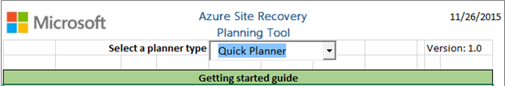
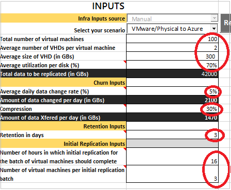
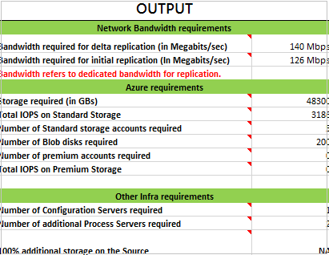
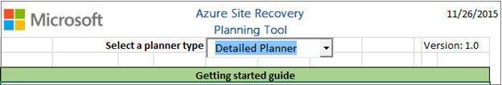
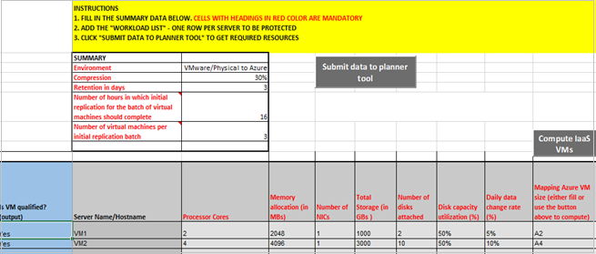
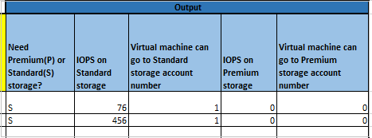
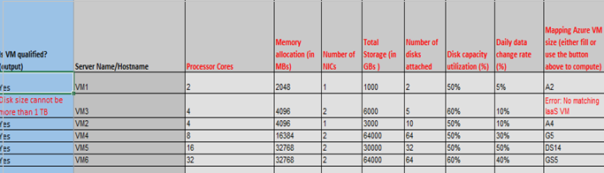
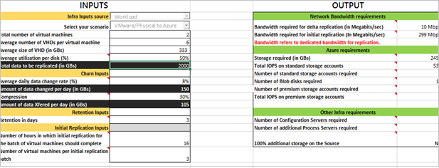

<properties
    pageTitle="Planen von Kapazität zum Schutz von virtuellen Computern und physischen Servern in Azure Website Wiederherstellung | Microsoft Azure"
    description="Azure Website Wiederherstellung koordiniert die Replikation, Failover- und von virtuellen Computern und physische Server lokal auf Azure oder einer sekundären lokalen Website gespeichert." 
    services="site-recovery" 
    documentationCenter="" 
    authors="rayne-wiselman" 
    manager="jwhit" 
    editor=""/>

<tags 
    ms.service="site-recovery" 
    ms.devlang="na"
    ms.topic="article"
    ms.tgt_pltfrm="na"
    ms.workload="storage-backup-recovery" 
    ms.date="07/12/2016" 
    ms.author="raynew"/>

# Planen von Kapazität zum Schutz von virtuellen Computern und physischen Servern in Azure Website Wiederherstellung

Das Tool Azure Website Wiederherstellung Kapazität für hilft Ihnen, die Ihren Anforderungen Kapazität zum Schutz von Hyper-V virtuelle Computer, virtuelle VMware-Computer und Windows/Linux physischen Servern mit Azure Website Wiederherstellung ermitteln.

## (Übersicht)

Verwenden Sie die Website Wiederherstellung Kapazität für Ihre Umgebung Quelle und Auslastung analysieren und Bandbreite Erfordernisse, Serverressourcen müssen Sie an Ihrem Quellspeicherort und Ressourcen (virtuellen Computern und Speicher usw.), die Sie in Ihrem Zielort müssen ermitteln. 

Sie können das Tool auf verschiedene Modi ausführen:

- **Schnelle planen**: ausführen, die das Tool in diesem Modus zum Abrufen von Netzwerk- und Projektionen auf einer durchschnittlichen Anzahl von virtuellen Computern, Datenträger, Speicherplatz und Rendite ändern basierend.
- **Planen Sie detailliert**: Führen Sie das Tool in diesem Modus, und geben Sie die Details der einzelnen Arbeitsbelastung Ebene virtueller Computer. Virtueller Computer Kompatibilität analysieren und Netzwerk- und Projektionen zu erhalten.

## Bevor Sie beginnen

Bevor Sie das Tool ausführen:

1. Sammeln Sie Informationen über Ihre Umgebung, einschließlich virtuellen Computern, Festplatten pro virtueller Computer, Speicherplatz pro Laufwerk ein.
2. Benennen Sie Ihre täglichen ändern (Änderung) Abschlag (Disagio) repliziert Daten ein. Zweck

    - Wenn Sie Hyper-V virtuellen Computern sind repliziert Herunterladen des [Hyper-V Kapazität Planung Tool](https://www.microsoft.com/download/details.aspx?id=39057) zum Abrufen der Rendite ändern. [Weitere](site-recovery-capacity-planning-for-hyper-v-replication.md) Informationen zu diesem Tool. Es empfiehlt sich, dass Sie über eine Woche zum Erfassen von Mittelwerten dieses Tool ausführen.
    - Wenn Sie VMware virtuellen Computern repliziert sind, verwenden Sie die [vSphere Kapazität, Planung Einheit](https://labs.vmware.com/flings/vsphere-replication-capacity-planning-appliance) , um die Änderung Zins ermitteln.
    - Wenn Sie physische Servern repliziert sind, müssen Sie manuell schätzen verwendet.

## Führen Sie den Symbolleiste Planer
1.  Herunterladen Sie und öffnen Sie das Tool [Azure Website Wiederherstellung Kapazität können](http://aka.ms/asr-capacity-planner-excel) . Sie müssen zum Ausführen von Makros sollten Sie zum Aktivieren der Bearbeitung und Aktivieren von Inhalten, wenn Sie dazu aufgefordert werden. 
2.  Wählen Sie unter **Wählen Sie einen Typ Planer** **Symbolleiste für** im Listenfeld aus.

    

3.  Geben Sie auf dem Arbeitsblatt **Kapazität für** die erforderlichen Informationen ein. Sie müssen alle Felder in der folgenden Screenshot in Rot Eingekreiste ausfüllen.

    - Wählen Sie in **Ihrem Szenario wählen Sie** **Hyper-V so Azure** oder **VMware/physische in Azure**aus.
    - In die **durchschnittliche tägliche Daten ändern Zins (%)** setzen die Informationen sammeln Sie mit dem [Hyper-V Kapazität Planung Tool](site-recovery-capacity-planning-for-hyper-v-replication.md) oder die [vSphere Kapazität, Planung Einheit](https://labs.vmware.com/flings/vsphere-replication-capacity-planning-appliance).  
    - **Komprimierung** gilt nur für Komprimierung bei der Replikation von VMware virtuellen Computern oder physische Server auf Azure angeboten. Wir schätzen 30 % oder mehr, aber Sie können die Einstellung nach Bedarf ändern. Für die Replikation von Hyper-V virtuelle Computer auf Azure Komprimierung können Sie eine Drittanbieter-Anwendung wie Riverbed verwenden. 
    -  Geben Sie **Aufbewahrung Eingaben** wie lange Replikate beibehalten werden soll. Wenn Sie bei der Replikation von VMware oder physische Server Geben Sie den Wert in Tagen. Wenn Sie Hyper-V Replikation sind die Zeit in Stunden angeben.
    -  Geben Sie in die **Anzahl der Stunden in die erste Replikation für den Stapel von virtuellen Computern sollte abgeschlossen** und die **Anzahl der virtuellen Computern pro die erste Replikation Stapel** Einstellungen, die verwendet werden, um die erste Replikation Anforderungen berechnen ein.  Wenn Website Wiederherstellung bereitgestellt wird, sollte die gesamte Datenmenge initial hochgeladen werden. 

    

2.  Nachdem Sie die Werte für die Quelle Umgebung setzen haben, enthält die angezeigten Ausgabe:

    - **Bandbreite Delta Replikation erforderlich** (MB/s). Netzwerk-Bandbreite für die Deltareplikation wird die durchschnittliche tägliche Daten Änderungsrate berechnet.
    - **Bandbreite für die erste Replikation erforderlich** (MB/s). Netzwerk-Bandbreite für die erste Replikation wird auf die erste Replikation Werte berechnet, die Sie in ablegen. 
    - **Speicher (in GB) erforderlich** ist Azure Gesamtspeicher erforderlich.
    - **Total IOPS auf standard-Speicherkonten** wird basierend auf 8 K IOPS Einheitsgröße auf den standard Gesamtspeicher Konten berechnet.  Ändern für die Symbolleiste für die Anzahl der Berechnung basierend auf der Quelle-virtuellen Computern Datenträger und tägliche Daten Zins. Ändern Sie Zins auf diesen virtuellen Computern für die detaillierte für die Anzahl der Berechnung basierend auf der Gesamtanzahl von virtuellen Maschinen, die auf standard Azure-virtuellen Computern und Daten zugeordnet sind. 
    - **Anzahl der standard-Speicherkonten** stellt die Gesamtzahl der standardmäßigen Speicherkonten zum Schutz der virtuellen Computern erforderlich sind. Beachten Sie, dass ein standard Speicherkonto bis zu 20.000 IOPS über alle virtuellen Computern in einer standardmäßigen Speicher halten kann und maximal 500 IOPS pro Datenträger unterstützt. 
    - **Anzahl der Blob-Datenträger erforderlich** , gibt die Anzahl der Datenträger, die auf Azure-Speicher erstellt wird.
    - **Anzahl der Premium Speicherkonten erforderlich** stellt die Gesamtzahl der Premium Speicherkonten zum Schutz der virtuellen Computern erforderlich sind. Beachten Sie, dass eine Quelle virtueller Computer mit hoher IOPS (größer als 20000) ein Premium Speicherkonto benötigt. Ein Premium-Speicher-Konto kann bis zu 80.000 IOPS enthalten.
    - **Total IOPS Premium Speichermenge** wird basierend auf 256 K IOPS Einheitsgröße auf die gesamte Premium Speicherkonten berechnet.  Ändern für die Symbolleiste für die Anzahl der Berechnung basierend auf der Quelle-virtuellen Computern Datenträger und tägliche Daten Zins. Für die ausführliche für die Anzahl rechnet basierend auf der Gesamtanzahl von virtuellen Maschinen, die Premium Azure-virtuellen Computer (DS und GS Reihen) zugeordnet sind, und die Daten ändern, Rate auf diesen virtuellen Computern. 
    - **Anzahl der Konfigurationsserver erforderlich** zeigt, wie viele Konfigurationsserver für die Bereitstellung (1) erforderlich sind
    - **Anzahl der Prozess zusätzliche Server erforderlich** zeigt, ob zusätzliche Prozess-Servers sowie den Prozess-Server erforderlich sind, die auf dem Konfigurationsserver standardmäßig so konfiguriert ist.
    - **zusätzlicher Speicher (100 %), klicken Sie auf die Quelle** zeigt, ob zusätzlicher Speicher am Quellspeicherort erforderlich ist.
            
    
 
## Führen Sie den detaillierten Planer

1.  Herunterladen Sie und öffnen Sie das Tool [Azure Website Wiederherstellung Kapazität können](http://aka.ms/asr-capacity-planner-excel) . Sie müssen zum Ausführen von Makros sollten Sie zum Aktivieren der Bearbeitung und Aktivieren von Inhalten, wenn Sie dazu aufgefordert werden. 
2.  Wählen Sie unter **Wählen Sie einen Typ können** **Detaillierte für** im Listenfeld aus.

    

3.  Geben Sie im Arbeitsblatt **Arbeitsbelastung Qualifikation** die erforderlichen Informationen ein. Sie müssen alle markierten Felder ausfüllen.

    - Geben Sie die Gesamtzahl der Kerne in **Prozessorkerne** auf einem Quellserver.
    - Geben Sie im **arbeitsspeicherzuteilung in MB** RAM Größe eines Quellservers ein. 
    - Die **Anzahl der NICs** Geben Sie die Anzahl der Netzwerkadapter auf einem Quellserver. 
    -  Geben Sie die Gesamtgröße der virtuellen Computer Speicher **Gesamtspeicher (in GB)** . Für Beispiel, wenn der Quellserver 3 Datenträger mit 500 GB Gesamtspeichergröße aufweist, 1500 GB ist.
    -  Anzahl **der verbundenen Datenträger** angeben der Gesamtzahl der Datenträger eines Quellservers.
    -  Geben Sie die durchschnittliche Auslastung **Datenträger Kapazitätsauslastung** .
    -  Geben Sie **täglich Zins (%) ändern** , dass die täglichen Daten (Disagio) eines Quellservers ändern.
    -  Geben Sie in **Azure Zuordnung Größe** entweder Azure-virtuellen Computer-Größe, die Sie zuordnen möchten. Klicken Sie auf**Berechnen IaaS virtuellen Computern**, wenn Sie keine dies manuell vornehmen möchten. Beachten Sie, wenn Sie eine manuelle Einstellung Eingabemethoden, und klicken Sie dann auf berechnen IaaS virtuellen Computern Ihrer manuelle Einstellung überschrieben werden kann, da der Prozess berechnen automatisch die optimale Übereinstimmung auf Azure virtueller Speicher identifiziert werden kann.

    

4.  Klicken Sie auf ist hier **Berechnen IaaS virtuellen Computern** Zweck:

    - Überprüft die obligatorischen Eingaben an.
    - Berechnet IOPS und schlägt vor dem optimale Azure-virtuellen Computer aize Übereinstimmung für jedes virtuellen Computern, die für die Replikation zur Azure dazu berechtigt sind. Wenn Sie eine geeignete Größe der Azure-virtuellen Computer nicht erkannt werden kann, dass ein Fehler ausgegeben wird. Wenn z. B. die Anzahl der angefügten in 65 ein Fehler Datenträger Probleme seit der höchsten Größe ist Azure-virtuellen Computer 64 an.
    - Enthält Vorschläge für ein Speicherkonto, das für eine Azure-virtuellen Computer verwendet werden kann.
    - Berechnet die Gesamtzahl der standardmäßigen Speicherkonten und Premium Speicherkonten für die Arbeitsbelastung erforderlich ist. Führen Sie einen Bildlauf nach unten rechts auf der anzeigen Typ Azure-Speicher und die Speicher-Konto, das für einen Quellserver verwendet werden können
    - Schließt die Eingabe und den Rest der Tabelle basierend auf erforderlichen Speicher (standard oder Premium) für einen virtuellen Computer und die Anzahl der verbundenen Datenträger zugewiesen sortiert. Zeigt Ja, für alle virtuellen Computern, die die Anforderungen für die Sicherung Azure, Spalte A (ist virtueller Computer qualifiziert?) entsprechen. Wenn ein virtueller Computer bis zu gesichert werden kann nicht wird Azure ein Fehler angezeigt.

Spalten AA AE werden ausgegeben und bieten Informationen für jeden virtuellen Computer.

### Beispiel
Das Tool berechnet und weist die beliebtesten Azure-virtuellen Computer und den Anforderungen Azure-Speicher, als Beispiel für sechs virtuelle Computer mit den Werten in der Tabelle angezeigt.

- Beachten Sie in der Ausgabe, damit das Beispiel Folgendes ein:
    
    - Die erste Spalte ist eine Überprüfung Spalte für die virtuellen Computern, Festplatten und Änderung.
    - Für fünf virtuellen Computern sind zwei standard Speicherkonten und eine Premium Speicher-Konto erforderlich. 
    -  VM3 nicht für Schutz geeignet ist, da ein oder mehrere Datenträger mehr als 1 TB sind.
    -  VM1 und VM2 können das erste standard Speicherkonto verwenden.
    -  VM4 können das zweite standard Speicherkonto an.
    -  VM5 und VM6 benötigen ein Premium Speicher-Konto, und beide ein einzelnes Benutzerkonto verwenden.

    >[AZURE.NOTE]  Standard- und Premium Speichermenge IOPS werden auf der Ebene virtueller Computer und nicht auf dem Datenträgerebene berechnet. Eine Standardansicht virtuellen Computern können bis zu 500 IOPS pro Datenträger behandeln. Wenn für einen Datenträger IOPS größer als 500 sind, benötigen Sie Premium-Speicher. Jedoch wählt einem Standard Wenn IOPS für einen Datenträger mehr als 500 sind dagegen IOPS für die gesamte virtueller Computer Datenträger den Grenzwerten Support standard Azure-virtuellen Computer (virtueller Speicher, Anzahl der Datenträger, die Anzahl der Netzwerkadapter, CPU, Speicher) dann Planer virtueller Computer und nicht über den DS oder GS Reihe. Sie müssen die Zuordnung Azure Größe Zelle mit dem entsprechenden DS oder GS Reihe virtueller Computer manuell zu aktualisieren.

5. Nachdem alle Details angeordnet sind, klicken Sie auf **Daten senden, um das Tool können** , um die **Kapazität für** öffnen Auslastung werden hervorgehoben, um anzuzeigen, ob sie zum Schutz berechtigt oder nicht sind.

### Senden von Daten in den Planer Kapazität

1.  Beim Öffnen der **Kapazität für** Arbeitsblatts wird es aufgefüllt, basierend auf die Einstellungen, die Sie angegeben haben. Das Wort wird 'Arbeitsbelastung' in der Zelle **Infrarotanschluss Eingaben Quelle** , die das Eingabe **Arbeitsbelastung Qualifikation** Arbeitsblatt angezeigt. 
2.  Wenn Sie Änderungen vornehmen möchten, müssen Sie ändern das **Arbeitsbelastung Qualifikation** Arbeitsblatt, und klicken Sie erneut auf Daten senden, um das Tool können.  

    

