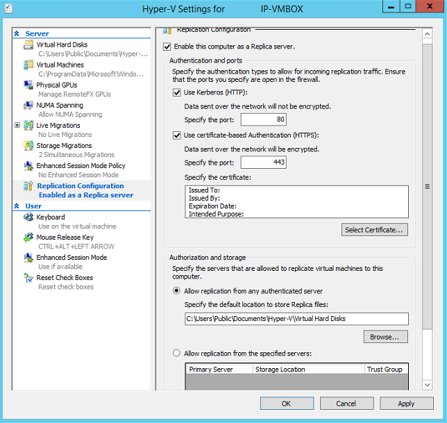
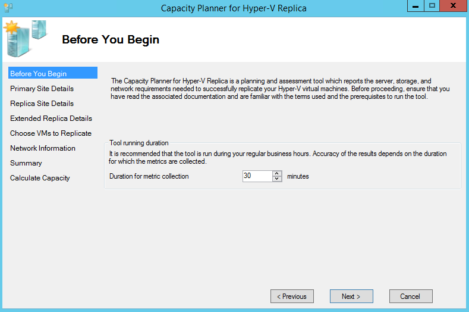
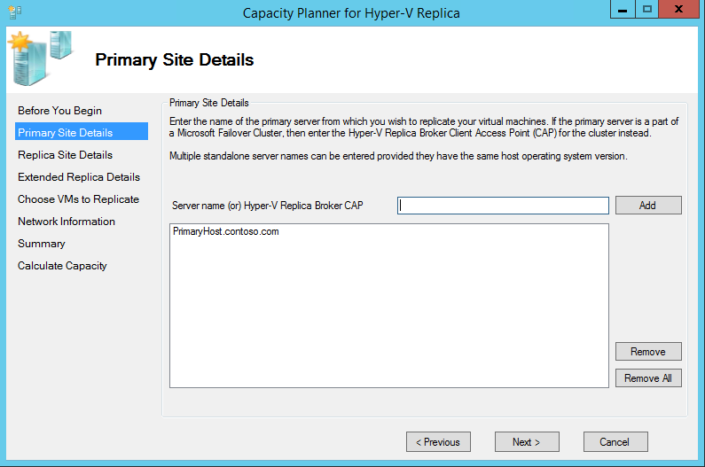
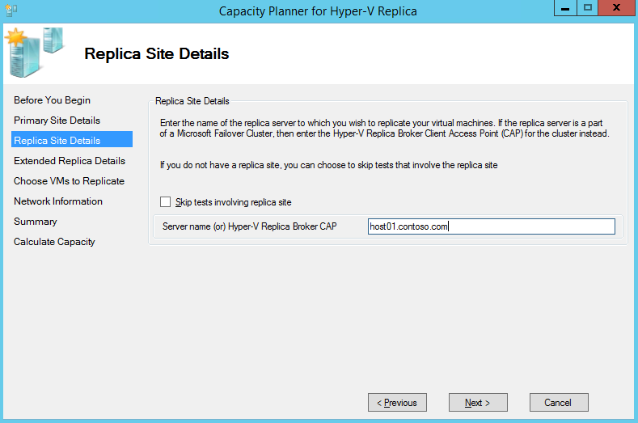
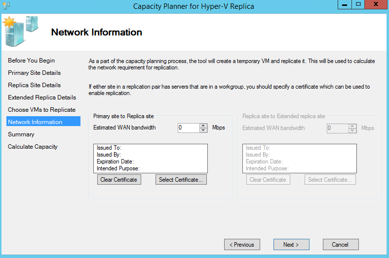
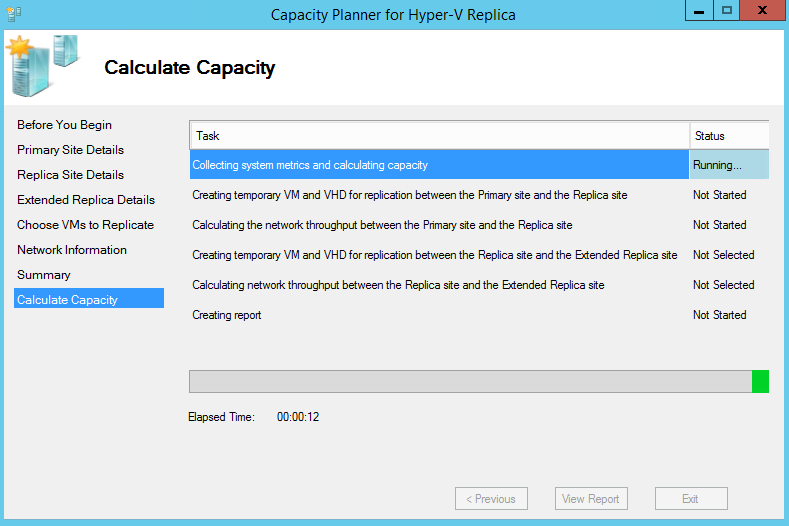

<properties
    pageTitle="Führen Sie das Hyper-V Kapazität Planer-Tool für die Website Wiederherstellung | Microsoft Azure"
    description="Dieser Artikel enthält Anweisungen für die Verwendung des Hyper-V Kapazitätsplanertools für Azure Website Wiederherstellung"
    services="site-recovery"
    documentationCenter="na"
    authors="rayne-wiselman"
    manager="jwhit"
    editor="" />
<tags
    ms.service="site-recovery"
    ms.devlang="na"
    ms.topic="article"
    ms.tgt_pltfrm="na"
    ms.workload="storage-backup-recovery"
    ms.date="07/12/2016"
    ms.author="raynew" />

# Führen Sie das Hyper-V Kapazität Planer-Tool für die Website Wiederherstellung

Als Teil der Bereitstellung Azure Website Wiederherstellung müssen Sie Ihre Replikation und die Bandbreite Anforderungen ermitteln. Das Tool Hyper-V Kapazität Planer Website Wiederherstellung hilft Ihnen, die Ihren Anforderungen Replikation und Bandbreite Replikation virtuellen Computern Hyper-V ermitteln.

Dieser Artikel beschreibt, wie das Tool Hyper-V Kapazität Planer ausführen. Dieses Tool sollte zusammen mit anderen Kapazität, Planung Tools und Informationen, die bei der [Planung Kapazität Website Wiederherstellung](site-recovery-capacity-planner.md)beschrieben verwendet werden.

## Bevor Sie beginnen

Führen Sie das Tool auf einem Hyper-V Server oder Cluster-Knoten in der primären Standort aus. Die Hyper-V-Host-Server benötigt, um das Tool ausführen:

- Betriebssystem: Windows Server® 2012 oder Windows Server® 2012 R2
- Arbeitsspeicher: 20 MB (Minimum)
- CPU: 5 Prozent Verwaltungsaufwand (Minimum)
- Festplattenspeicher: 5 MB (Minimum)

Bevor Sie das Tool ausführen müssen Sie Vorbereiten des primären Standorts. Wenn Sie zwischen repliziert sind zwei lokalen Websites und Bandbreite überprüfen möchten, müssen Sie auch einen Replikatserver vorbereiten.

## Schritt 1: Vorbereiten des primären Standorts
1. Erstellen Sie eine Liste aller Hyper-V-virtuellen Computern repliziert werden soll, und die Hyper-V Hosts/Cluster auf denen sie sich befinden, auf dem primären Standort. Das Tool kann jedes Mal für mehrere eigenständige Hosts oder einem einzigen Cluster jedoch nicht beide zusammen ausgeführt werden. Es muss auch separat für jedes Betriebssystem ausgeführt, sodass Sie sammeln und Ihre Hyper-V-Server wie folgt beachten sollten:

  - Windows Server® 2012 eigenständigen servers
  - Windows Server® 2012 Cluster
  - Windows Server® 2012 R2 eigenständigen servers
  - Windows Server® 2012 R2 Cluster

3. Remotezugriff auf WMI auf alle Hyper-V-Hosts und Cluster zu aktivieren. Führen Sie diesen Befehl auf jedem Server/Cluster, stellen Sie sicher, dass Firewall-Regeln und Festlegen von Berechtigungen für einen Benutzer:

        netsh firewall set service RemoteAdmin enable

5. Aktivieren Sie die Leistung Überwachung auf Server und Cluster, wie folgt:

  - Öffnen Sie die Windows-Firewall für die **Erweiterte Sicherheit** -Snap-In, und aktivieren Sie dann die folgenden eingehenden Regeln: **COM + Netzwerkzugriff (DCOM-IN)** und alle Regeln in der **Remote Ereignisprotokoll Management Group unter**.

## Schritt 2: Bereiten Sie einen Replikatserver (lokal auf lokale Replikation vor)

Sie benötigen keine vorgehen, wenn Sie in Azure repliziert sind.

Es empfiehlt sich, dass Sie einen einzelnen Hyper-V-Host als Wiederherstellungsserver einrichten, dass-platzhalterprodukt ein virtuellen Computers zu prüfen Bandbreite repliziert werden kann.  Sie können diese überspringen, aber nicht möglich Bandbreite messen, es sei denn, Sie haben sie folgende.

1. Wenn Sie ein Clusterknoten verwenden, wie das Replikat Konfigurieren von Hyper-V Replica Bank möchten:

    - Öffnen Sie **Server-Manager** **Failovercluster-Manager**.
    - Verbinden mit dem Cluster, markieren Sie den Clusternamen, und klicken Sie auf **Aktionen** > **Rolle konfigurieren** , um den Assistenten für hohe Verfügbarkeit zu öffnen.
    - Klicken Sie auf **Hyper-V Replikat Bank**, Rolle **Auswählen** . Geben Sie im Assistenten **NetBIOS-** und **IP-Adresse** als den Verbindungspunkt mit dem Cluster (einen Client Access Point genannt) verwendet werden soll. Der **Hyper-V Replikat Bank** wird in einem Client Access Point-Namen, den Sie beachten sollten, resultierender konfiguriert sein.
    - Stellen Sie sicher, dass die Rolle des Hyper-V Replikat Bank erfolgreich online geht und kann über zwischen allen Knoten im Cluster fehl. Hierzu klicken Sie mit der rechten Maustaste auf die Rolle, zeigen Sie auf **Verschieben**, und klicken Sie dann auf **Knoten auswählen**. Wählen Sie einen Knoten > **OK**.
    - Wenn Sie Authentifizierung verwenden, vergewissern Sie sich, jeder Clusterknoten und den Kunden zugreifen Punkt, dass alle das Zertifikat installiert haben.
2.  Aktivieren Sie einen Replikatserver:

    - Ein Cluster Fehler Cluster-Manager öffnen, Herstellen einer Verbindung Cluster mit, und klicken Sie auf **Rollen** > select Rolle > **Replikation Einstellung**s > **diese Cluster als Replikatserver aktivieren**. Beachten Sie, dass wenn Sie einen Cluster als Replikat verwenden Sie die Rolle des Hyper-V Replikat Bank präsentieren auf dem primären Standort-Cluster haben müssen.
    - Bei einem eigenständigen Server Hyper-V-Manager zu öffnen. Klicken Sie im Bereich **Aktionen** klicken Sie auf **Hyper-V-Einstellungen** für den Server, die, den Sie aktivieren möchten, und Konfiguration der **Replikation** klicken Sie auf **diesem Computer als Replikatserver aktivieren**.
3. Einrichten von Authentifizierung:

    - Wählen Sie im **Anmelde- und Ports** zum Authentifizierung des primären Servers und die Ports Authentifizierung aus. Wenn Sie Zertifikat verwenden klicken Sie auf **Zertifikat auswählen** , um eine auszuwählen. Verwenden Sie Kerberos, wenn der primären und der Wiederherstellung Hyper-V-Hosts dieselbe Domäne oder vertrauenswürdiger Domänen sind. Verwenden von Zertifikaten für verschiedene Domänen oder Bereitstellung in einer Arbeitsgruppe.
    - Erlauben Sie im Abschnitt **Autorisierung und Speicher** **Alle** authentifizierten (primär) Server Replikationsdaten an dieser Replikatserver senden aus. Klicken Sie auf **OK** oder auf **Übernehmen**.

    

    - Führen Sie die **Netsh http anzeigen Servicestate** , um zu überprüfen, dass die Zuhörer für den Protocol-Port ausgeführt wird, die Sie angegeben haben:  
4. Richten Sie Firewalls ein. Während der Installation von Hyper-V werden Firewall-Regeln erstellt, um den Datenverkehr auf dem standardmäßigen Ports (HTTPS auf 443, dass Kerberos auf 80) ermöglichen. Aktivieren Sie diese Regeln wie folgt:

        - Certificate authentication on cluster (443): **Get-ClusterNode | ForEach-Object {Invoke-command -computername \$\_.name -scriptblock {Enable-Netfirewallrule -displayname "Hyper-V Replica HTTPS Listener (TCP-In)"}}**
        - Kerberos authentication on cluster (80): **Get-ClusterNode | ForEach-Object {Invoke-command -computername \$\_.name -scriptblock {Enable-Netfirewallrule -displayname "Hyper-V Replica HTTP Listener (TCP-In)"}}**
        - Certificate authentication on standalone server: **Enable-Netfirewallrule -displayname "Hyper-V Replica HTTPS Listener (TCP-In)"**
        - Kerberos authentication on standalone server: **Enable-Netfirewallrule -displayname "Hyper-V Replica HTTP Listener (TCP-In)"**

## Schritt 3: Ausführen des Kapazitätsplanertools

Nachdem Sie Ihre primären Standort vorbereitet und richten Sie einen Wiederherstellungsserver haben, können Sie das Tool ausführen.

1. [Laden](https://www.microsoft.com/download/details.aspx?id=39057) Sie das Tool vom Microsoft Download Center.
2. Führen Sie das Tool von einem der primären Servers (oder einen der Knoten aus dem primären Cluster). Mit der rechten Maustaste in der .exe-Datei, und wählen Sie dann auf **als Administrator ausführen**.
3. Geben Sie **zuerst sich daher** für wie lange Sie Daten sammeln möchten. Es empfiehlt sich, dass während der Herstellung Stunden, um sicherzustellen, dass Daten Supportmitarbeiter ist, führen Sie das Tool. Wenn Sie nur Netzwerkkonnektivität überprüfen möchten, können Sie nur eine Minute sammeln.

    

4. Details der **primären Standort** Geben Sie den Servernamen oder den vollqualifizierten Domänennamen für einen eigenständigen Host oder für ein Cluster Geben Sie den vollqualifizierten Domänennamen des Clients Punkt, Clusternamen oder einen beliebigen Knoten im Cluster akzeptieren, und klicken Sie dann auf **Weiter**. Das Tool erkennt automatisch den Namen des Servers, die ausgeführt wird. Er nimmt virtuellen Computern, die für die angegebenen Server überwacht werden können.

    

5. **Replikat Website** Details wählen Sie, wenn Sie in Azure repliziert sind oder wenn Sie einen Replikatserver eingerichtet haben, dies zu einem sekundären Datencenter repliziert sind, **mit dem Replikat Standort Tests überspringen**. Wenn Sie zu einem sekundären Datencenter repliziert werden und ein Replikat Geben Sie den vollqualifizierten Domänennamen des Servers eigenständigen oder dem Client Access Point für den Cluster im **Servernamen ein (oder) Hyper-V Replikat Bank Linienende**eingerichtet haben.

    

6. In **erweiterten Replikat** Details aktivieren Sie **die Tests im Zusammenhang mit erweiterten Replikat-Site überspringen**. Sie werden von der Website Wiederherstellung nicht unterstützt.
7. **Replikation virtuelle Computer wählen Sie** die Tools auf den Server oder Cluster verbindet und zeigt virtuellen Computern und Datenträger, auf dem primären Server ausgeführt, gemäß der Einstellungen Sie angegeben auf der Seite **Primäre Website Details** . Hinweis die virtuellen Computern, die für die Replikation oder, die bereits aktiviert sind ausgeführt werden nicht wird nicht angezeigt. Wählen Sie die virtuellen Computern, für die Sie Kennzahlen sammeln möchten. Auswählen der virtuellen Festplatten automatisch sammelt Daten auch für die virtuelle Computer.
9. Wenn Sie einem Replikatserver oder Cluster konfiguriert haben, im **Netzwerkinformationen** Geben Sie die ungefähre WAN-Bandbreite, die Sie wahrscheinlich zwischen der primären und Kopie Websites verwendet werden, und wählen Sie die Zertifikate aus, wenn Sie das Zertifikatauthentifizierung konfiguriert haben.

    

10. Aktivieren Sie in **Zusammenfassung** Einstellungen, und klicken Sie auf **Weiter** , um zu beginnen, Kennzahlen sammeln. Tool des Fortschritts und Status wird angezeigt, auf der Seite **Kapazität berechnen** . Wenn das Tool beendet hat ausgeführt **Bericht anzeigen** , um über die Ausgabe wechseln klicken. Standardmäßig werden in **%systemdrive%\Users\Public\Documents\Capacity können**Berichte und Protokolle gespeichert.

    

## Schritt 4: Bei der Interpretation der Ergebnisse
Hier sind die wichtigen Metrik aus. Sie können Kennzahlen ignorieren, die hier nicht aufgeführt werden. Sie sind nicht für die Website Wiederherstellung relevant.

### Lokal auf lokale Replikation
  - Auswirkung der Replikation auf der primären Host berechnen, Arbeitsspeicher
  - Auswirkung der Replikation auf dem primären Datenträger Speicherplatz Wiederherstellung-Hosts, IOPS
  - Gesamte Bandbreite erforderlich Delta Replikation / (s)
  - Beobachteten Bandbreite zwischen dem primären Host und der Wiederherstellung Host / (s)
  - Vorschlag für die ideale Anzahl von aktiven parallele Übermittlungen zwischen den zwei Hosts-Cluster

### Lokal auf Azure Replikation
  - Auswirkung der Replikation auf der primären Host berechnen, Arbeitsspeicher
  - Auswirkung der Replikation der primären Host Speicher Festplattenspeicher zur Verfügung steht, IOPS
  - Gesamte Bandbreite erforderlich Delta Replikation / (s)

## Weitere Ressourcen

- Ausführliche Informationen über das Tool, lesen das Dokument, das das Tool herunterladen begleitet.
- Schauen Sie sich eine exemplarische Vorgehensweise des Tools in Keith Mayers [TechNet-Blog](http://blogs.technet.com/b/keithmayer/archive/2014/02/27/guided-hands-on-lab-capacity-planner-for-windows-server-2012-hyper-v-replica.aspx).
- [Abrufen der Ergebnisse](site-recovery-performance-and-scaling-testing-on-premises-to-on-premises.md) unserer Leistung für lokale auf lokale Hyper-V Replikation testen

## Nächste Schritte

Nachdem Sie die Kapazität Planung abgeschlossen haben, können Sie beginnen, Bereitstellen von Website-Wiederherstellung:

- [Hyper-V virtuelle Computer in VMM Wolken auf Azure repliziert](site-recovery-vmm-to-azure.md)
- [Hyper-V virtuellen Computern (ohne VMM) auf Azure repliziert](site-recovery-hyper-v-site-to-azure.md)
- [Hyper-V virtuellen Computern zwischen VMM Websites repliziert](site-recovery-vmm-to-vmm.md)
- [Hyper-V virtuellen Computern zwischen verschiedenen Websites mit SAN VMM repliziert](site-recovery-vmm-san.md)
- [Repliziert hyper-V virtuelle Computer auf einzelne VMM-server](site-recovery-single-vmm.md)