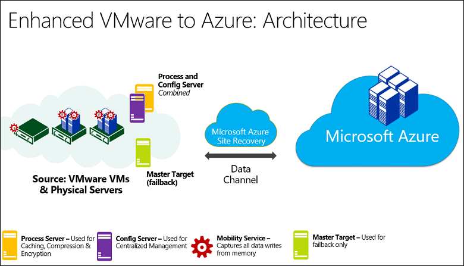
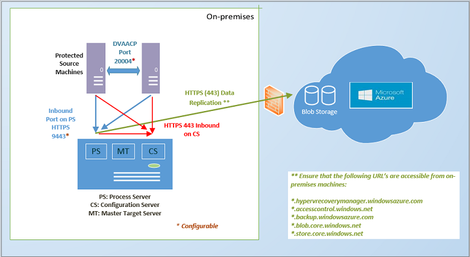
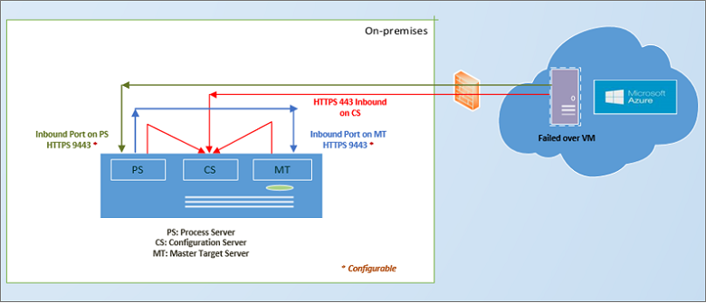
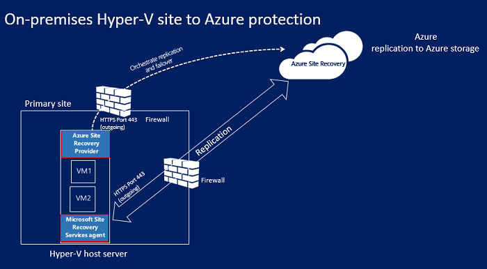
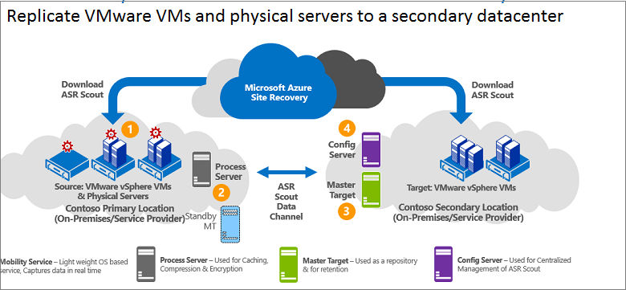
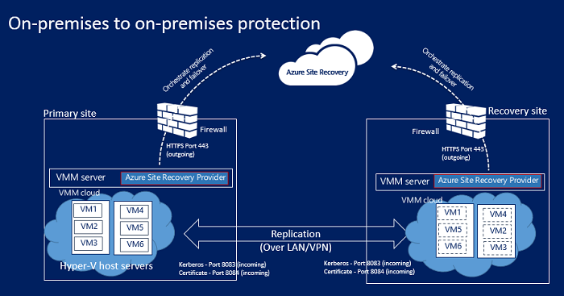
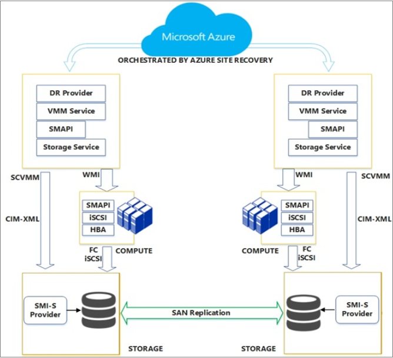
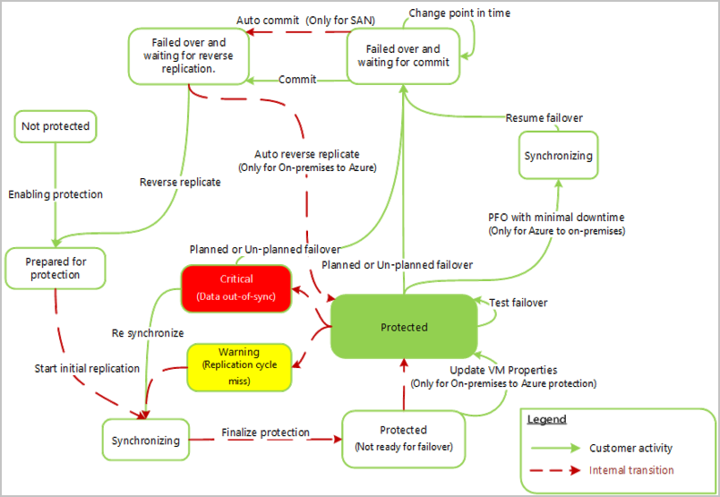

<properties
    pageTitle="Wie funktioniert die Website Wiederherstellung? | Microsoft Azure"
    description="Dieser Artikel bietet einen Überblick über die Website Wiederherstellung Architektur"
    services="site-recovery"
    documentationCenter=""
    authors="rayne-wiselman"
    manager="jwhit"
    editor=""/>

<tags
    ms.service="site-recovery"
    ms.workload="backup-recovery"
    ms.tgt_pltfrm="na"
    ms.devlang="na"
    ms.topic="get-started-article"
    ms.date="10/05/2016"
    ms.author="raynew"/>

# Wie funktioniert die Website Wiederherstellung Azure?

Lesen Sie diesen Artikel, um die zugrunde liegende Architektur des Diensts Azure Website Wiederherstellung zu verstehen und die Komponenten, die sie vornehmen arbeiten. 

Posten Sie Kommentare oder Fragen am Ende dieses Artikels oder im [Azure Wiederherstellung Services-Forum](https://social.msdn.microsoft.com/forums/azure/home?forum=hypervrecovmgr).

## (Übersicht)

Organisationen benötigen eine BCDR Strategie, die bestimmt, wie apps, Auslastung und Daten bleiben während der geplanten und ungeplanten Ausfallzeiten ausgeführt werden und verfügbar, und zum normalen Arbeit Umständen so früh wie möglich wiederherzustellen. Strategische BCDR sollten Geschäftsdaten beibehalten, sicherer und wiederhergestellt, und vergewissern Sie sich Auslastung kontinuierlich verfügbar bleiben, wenn bei Datenverlusten. 

Website Wiederherstellung ist eine Azure-Dienst, der zur strategische BCDR beiträgt, durch die Replikation von physische Server lokal und in der Cloud (Azure) oder in einem sekundären Datencenter-virtuellen Computern orchestriert. Treten Ausfall in gewohnten Standort befinden, fehl Sie über den zweiten Standort zum Aktualisieren von apps und Auslastung zur Verfügung. Sie fehl zurück zur gewohnten Standort befinden, wenn sie normale Vorgänge zurückgibt. Erfahren Sie mehr in [Neuigkeiten Website Wiederherstellung?](site-recovery-overview.md)

## Website Wiederherstellung Azure-Portal

Azure weist zwei verschiedenen [Bereitstellungsmodelle](../resource-manager-deployment-model.md) für das Erstellen und Arbeiten mit Ressourcen: das Modell Azure Ressourcenmanager und Modell Management Services klassischen. Azure, weist ebenfalls zwei communityportalen – [Azure klassischen Portal](https://manage.windowsazure.com/) , die das Bereitstellungsmodell klassischen unterstützt und der [Azure-Portal](https://portal.azure.com) mit Unterstützung für beide Bereitstellungsmodelle.

Website Wiederherstellung steht in der klassischen Portal und Azure-Portal. In der klassischen Azure-Portal können Sie die Website Wiederherstellung mit dem klassischen Services-Modell Management unterstützen. Azure-Portal können Sie das klassische Modell oder Ressourcenmodell Bereitstellungen unterstützen. [Weitere Informationen finden Sie](site-recovery-overview.md#site-recovery-in-the-azure-portal) über die Bereitstellung von mit dem Portal Azure.

Klassische und Azure Portals Bereitstellungen gilt für die Informationen in diesem Artikel. Unterschiede werden entsprechend gekennzeichnet.

## Szenarien für die Bereitstellung

Website Wiederherstellung kann zum Koordinieren von Replikation in eine Reihe von Szenarios bereitgestellt werden:

- **Repliziert VMware virtuellen Computern**: Azure oder einem sekundären Datencenter können lokalen VMware virtuellen Computern repliziert.
- - **Physische Computer repliziert**: physische Computern unter Windows als auch Linux Azure oder einem sekundären Datencenter können repliziert. Der Upgradeprozess von physischen Computern repliziert ist nahezu identisch mit den Prozess für die Replikation von VMware virtuellen Computern
- **Repliziert-Hyper-V virtuellen Computern (ohne VMM)**: Sie können Hyper-V virtuellen Computern, die vom VMM in Azure verwaltet werden nicht repliziert.
- **Repliziert Hyper-V virtuelle Computer in System Center VMM Wolken verwaltet**: lokale Hyper-V virtuellen Computern Hyper-V-Host-Servern in VMM Wolken Azure oder einem sekundären Datencenter können repliziert. Sie können mithilfe der standardmäßigen Hyper-V Replica oder SAN-Replikation mithilfe repliziert.
- **Migrieren von virtuellen Computern**: Sie können die Website Wiederherstellung zwischen Regionen [Migrieren Azure IaaS virtuellen Computern](site-recovery-migrate-azure-to-azure.md) oder [Migrieren Instanzen AWS Windows](site-recovery-migrate-aws-to-azure.md) Azure IaaS virtuellen Computern. Aktuell nur Migration wird unterstützt, d. h., Sie können über diesen virtuellen Computern fehl, Sie aber nicht möglich diese wieder.

Die meisten apps für diesen virtuellen Computern und physische Server ausgeführt kann Website Wiederherstellung repliziert werden. Sie können eine vollständige Zusammenfassung der unterstützten apps in abrufen [welche Auslastung können Azure Website Wiederherstellung schützen?](site-recovery-workload.md)

## Replikation auf Azure: VMware virtuellen Computern oder physische Windows/Linux-Server

Es gibt verschiedene Möglichkeiten VMware virtueller Computer mit Website Wiederherstellung repliziert.

- **Verwenden des Portals Azure**-beim Website Wiederherstellung im Azure-Portal Sie über virtuellen Computern, klassische Dienst-Manager Speicher oder zum Ressourcenmanager fehl können bereitstellen. Replikation VMware virtuellen Computern im Portal Azure bietet eine Reihe von Vorteilen, einschließlich der Möglichkeit zur Replikation auf Classic oder Ressourcenmanager Speicher in Azure. [Erfahren Sie mehr](site-recovery-vmware-to-azure.md).
- **Verwenden des Portals klassischen**-können Sie Website Wiederherstellung im klassischen Portal mit mehr Komfort bereitstellen. Dies sollte für alle neuen Bereitstellungen in der klassischen Portal verwendet werden. In dieser Bereitstellung können Sie nur über virtuellen Computern klassischen Speicher in Azure und nicht Ressourcenmanager Speicher fehl. [Erfahren Sie mehr](site-recovery-vmware-to-azure-classic.md). Es gibt auch ein [legacy-Benutzeroberfläche](site-recovery-vmware-to-azure-classic-legacy.md) zum Einrichten von VMware Replikation im klassischen Portal. Diese dürfen nicht für die Bereitstellung neuer verwendet werden.  Wenn Sie bereits die legacy-Benutzeroberfläche [Informationen zum Migrieren](site-recovery-vmware-to-azure-classic-legacy.md#migrate-to-the-enhanced-deployment) der erweiterten Bereitstellung verwenden bereitgestellt haben.

Die Architektur Anforderungen für die Bereitstellung von Website-Wiederherstellung VMware virtuellen Computern/physische Server in der Azure-Portal oder im Azure klassischen-Portal (Erweitert) repliziert werden ähnlich wie mit einige Unterschiede:

- Wenn Sie in der Azure-Portal bereitstellen, die können Sie auf Ressourcenmanager-basierten Speicher repliziert und Ressourcenmanager Netzwerke zum Herstellen einer Verbindung der Azure-virtuellen Computern nach Failover verwenden.
- Wenn Sie beide LRS Azure-Portal bereitstellen und GRS Speicher unterstützt wird. In der klassischen Portal GRS ist erforderlich.
- Die Bereitstellung erfolgt vereinfachte und benutzerfreundlicheren Azure-Portal.

Hier ist, was Sie benötigen:

- **Azure-Konto**: benötigen Sie eine Microsoft Azure-Konto.
- **Azure-Speicher**: benötigen Sie ein Konto Azure-Speicher replizierte Daten gespeichert. Sie können eine klassische Konto oder einem Ressourcenmanager Speicherkonto verwenden. Das Konto kann LRS oder GRS sein, wenn Sie in der Azure-Portal bereitstellen. Replizierte Daten in Azure-Speicher gespeichert und Azure-virtuellen Computern erstellt werden, wenn ausgeführt wird. 
- **Azure Netzwerk**: benötigen Sie ein Azure virtuelles Netzwerk, das mit Azure-virtuellen Computern verbunden werden soll, wenn sie beim Failover erstellt werden. Azure-Portal können sie die Netzwerke, die in der klassischen Dienst-Manager-Modell oder im Modell Ressourcenmanager erstellt werden.
- **Lokale Konfigurationsserver**: Sie benötigen einen lokalen Windows Server 2012 R2 Computer, die den Konfigurationsserver und anderen Website Wiederherstellung-Komponenten ausgeführt wird. Wenn Sie VMware virtuellen Computern repliziert werden sollte dies ein hoher Verfügbarkeit VMware VM sein. Wenn soll physische Servern repliziert kann den Computer physisch handeln. Diese Website Wiederherstellung Komponenten werden auf dem Computer installiert sein:
    - **Konfigurations-Server**: Kommunikation zwischen Ihrem lokalen Umgebung und Azure koordiniert und verwaltet Datenreplikation und Wiederherstellung.
    - **Prozess-Server**: fungiert als Gateway Replikation. Es empfängt Replikationsdaten von geschützten Quelle Maschinen, es mit zwischenspeichern, Komprimierung und Verschlüsselung optimiert und sendet die Daten an Azure-Speicher. Auch Pushbenachrichtigungen Installation des Diensts Mobilität geschützten Computern behandelt, und führt die automatische Ermittlung für virtuelle VMware-Computer. Wenn Ihre Bereitstellung wächst können Sie zusätzliche separaten dedizierten Prozess-Servern um zunehmenden Replikationsdatenverkehr zu behandeln hinzufügen.
    - **Gestaltungsvorlagen Ziel-Server**: Replikationsdaten während des Failbacks aus Azure behandelt. 
- **Virtuelle VMware-Computer oder physischen Servern repliziert**: jedem Computer, der auf Azure repliziert werden soll, benötigen die Mobilität Service-Komponente installiert. Dieser Dienst Schreiben von Daten auf dem Computer erfasst und an den Prozess-Server weiterleitet. Diese Komponente kann manuell installiert werden oder abgelegt und installiert werden kann automatisch nach den Prozess-Server Wenn Sie die Replikation für einen Computer aktivieren.
- **vSPhere Hosts/vCenter Server**: Sie benötigen mindestens vSphere Host-Servern virtuelle VMware-Computer ausgeführt. Es empfiehlt sich, dass ein vCenter Server zum Verwalten von diesen Hosts bereitgestellt werden.
- **Failback**: Was müssen erfüllt sein:
    - **Physisch-zu-physisch Failback wird nicht unterstützt**: Dies bedeutet, dass, wenn Sie über physischen Servern in Azure fehl, und klicken Sie dann wieder fehl möchten, wieder in eine VMware VM fehlschlagen darf. Sie können nicht mit einem physischen Server wieder fehl. Sie benötigen eine Azure virtueller Computer wieder zu treten, und wenn Sie den Konfigurationsserver als eine VMware VM bereitstellen haben müssen Sie einen separaten master Zielserver als eine VMware VM einrichten. Dies ist erforderlich, da der Gestaltungsvorlage Ziel-Server interagiert und fügt an VMware Speicher Datenträger einer VMware VM wiederherstellen.
    - - **Temporäre Prozessserver in Azure**: wieder aus Azure nach Failover ein Fehler auftreten, Sie zum Einrichten einer Azure virtueller Computer als Prozessserver konfiguriert Replikation aus Azure verarbeitet müssen, werden soll. Sie können diesem virtuellen Computer löschen, nachdem Failback endet.
    - **VPN-Verbindung**: Failbacks Sie müssen VPN-Verbindung (oder Azure ExpressRoute) einrichten aus dem Azure Netzwerk zur lokalen Website.
    - **Separate lokalen Gestaltungsvorlagen Ziel-Server**: der Server lokal master Ziel verarbeitet Failback. Der Gestaltungsvorlage Ziel-Server ist standardmäßig auf dem Server Management installiert, aber wenn Sie wieder größere Datenmengen Datenverkehr weiß nicht, sind sollten Sie Einrichten eines separaten lokalen master Ziel-Servers für diesen Zweck.

**Allgemeine Architektur**

**Bereitstellung von Komponenten**

**Failback**

- [Erfahren Sie mehr](site-recovery-vmware-to-azure.md#azure-prerequisites) über die Anforderungen für Azure Portals Bereitstellung.
- [Weitere Informationen finden Sie](site-recovery-vmware-to-azure-classic.md#before-you-start-deployment) in der klassischen-Portal zu Erweiterte Bereitstellung.
- [Erfahren Sie mehr](site-recovery-failback-azure-to-vmware.md) über Failback im Portal Auzre.
- [Erfahren Sie mehr](site-recovery-failback-azure-to-vmware-clas- [Learn more](site-recovery-failback-azure-to-vmware-classic.md) about failback in the Auzre portal.sic.md) über Failback in der klassischen Portal.

## Replikation auf Azure: Hyper-V virtuellen Computern, die nicht von VMM verwaltet werden

Sie können Hyper-V virtuelle Computer repliziert, die vom System Center VMM in Azure mit Website Wiederherstellung werden nicht, wie folgt verwaltet:

- **Verwenden des Portals Azure**-beim Website Wiederherstellung im Azure-Portal Sie über virtuellen Computern, klassische Speicher oder zum Ressourcenmanager fehl können bereitstellen. [Erfahren Sie mehr](site-recovery-hyper-v-site-to-azure.md).
- **Verwenden des Portals klassischen**-können Sie Website Wiederherstellung im klassischen Portal bereitstellen. In dieser Bereitstellung können Sie nur über virtuellen Computern klassischen Speicher in Azure und nicht Ressourcenmanager Speicher fehl. [Erfahren Sie mehr](site-recovery-hyper-v-site-to-azure-classic.md).

Die Architektur für beide Bereitstellungen ist ähnlich, außer dass:

- Wenn Sie in der Azure-Portal bereitstellen, die können Sie auf Ressourcenmanager Speicher repliziert und Ressourcenmanager Netzwerke zum Herstellen einer Verbindung der Azure-virtuellen Computern nach Failover verwenden.
- Die Bereitstellung erfolgt vereinfachte und benutzerfreundlicheren Azure-Portal.

Hier ist, was Sie benötigen:

- **Azure-Konto**: benötigen Sie eine Microsoft Azure-Konto.
- **Azure-Speicher**: benötigen Sie ein Konto Azure-Speicher replizierte Daten gespeichert. Azure-Portal können Sie eine klassische Konto oder einem Ressourcenmanager Speicherkonto verwenden. In der klassischen Portal können Sie nur ein klassischen Konto verwenden. Replizierte Daten in Azure-Speicher gespeichert und Azure-virtuellen Computern erstellt werden, wenn ausgeführt wird.
- **Azure Netzwerk**: benötigen Sie ein Azure-Netzwerk, die mit Azure-virtuellen Computern verbunden werden soll, wenn sie nach einem Failover erstellt werden. 
- **Hyper-V-Host**: Sie benötigen mindestens Windows Server 2012 R2 Hyper-V Hostserver. Während der Wiederherstellung von Website-Bereitstellung installieren Sie den Azure-Anbieter für Websites Wiederherstellung und dem Microsoft Azure Wiederherstellung Services-Agent auf dem Host.
- **Hyper-V virtuelle Computer**: benötigen Sie eine oder mehrere virtuelle Computer, auf dem Hyper-V-Host-Server. Azure Wiederherstellung-Anbieter für Websites und der Azure Wiederherstellung Services-Agent auf dem Host Hyper-V, während der Wiederherstellung von Website-Bereitstellung. Der Anbieter koordiniert und koordiniert mit dem Dienst Website Wiederherstellung Replikation über das Internet. Der Agent übernimmt Daten Replikationsdaten über HTTPS 443 ein. Kommunikation von sowohl den Anbieter als auch der Agent sind sicher und verschlüsselte. Replizierte Daten in Azure-Speicher ist auch verschlüsselt werden.

**Allgemeine Architektur**

- [Erfahren Sie mehr](site-recovery-hyper-v-site-to-azure.md#azure-prerequisites) über die Anforderungen für Azure Portals Bereitstellung.
- [Erfahren Sie mehr](site-recovery-hyper-v-site-to-azure-classic.md#azure-prerequisites) über die Anforderungen für klassische Portal Bereitstellung.

## Replikation auf Azure: Hyper-V virtuelle Computer von VMM verwaltet werden

Sie können wie folgt Hyper-V virtuelle Computer in VMM Wolken in Azure mit Website Wiederherstellung repliziert:

- **Verwenden des Portals Azure**-beim Website Wiederherstellung im Azure-Portal Sie über virtuellen Computern, klassische Speicher oder zum Ressourcenmanager fehl können bereitstellen. [Erfahren Sie mehr](site-recovery-vmm-to-azure.md).
- **Verwenden des Portals klassischen**-können Sie Website Wiederherstellung im klassischen Portal bereitstellen. In dieser Bereitstellung können Sie nur über virtuellen Computern klassischen Speicher in Azure und nicht Ressourcenmanager Speicher fehl. [Erfahren Sie mehr](site-recovery-vmm-to-azure-classic.md).

Die Architektur für beide Bereitstellungen ist ähnlich, außer dass:

- Wenn Sie in der Azure-Portal bereitstellen, die können Sie auf Ressourcenmanager-basierten Speicher repliziert und Ressourcenmanager Netzwerke zum Herstellen einer Verbindung der Azure-virtuellen Computern nach Failover verwenden.
- Die Bereitstellung erfolgt vereinfachte und benutzerfreundlicheren Azure-Portal.

Hier ist, was Sie benötigen:

- **Azure-Konto**: benötigen Sie eine Microsoft Azure-Konto.
- **Azure-Speicher**: benötigen Sie ein Konto Azure-Speicher replizierte Daten gespeichert. Azure-Portal können Sie eine klassische Konto oder einem Ressourcenmanager Speicherkonto verwenden. In der klassischen Portal können Sie nur ein klassischen Konto verwenden. Replizierte Daten in Azure-Speicher gespeichert und Azure-virtuellen Computern erstellt werden, wenn ausgeführt wird.
- **Azure Netzwerk**: Sie müssen einrichten Netzwerk Zuordnung, sodass Azure-virtuellen Computern mit entsprechenden Netzwerken verbunden sind, wenn sie nach einem Failover erstellt werden. 
- **VMM-Server**: Sie benötigen einen oder mehrere lokale VMM Server ausgeführt wird, klicken Sie auf System Center 2012 R2 sowie mit einer oder mehreren private Wolken einrichten. Wenn Sie in der Azure bereitstellen Portal Sie müssen logische und virtueller Computer Netzwerke einrichten, damit Sie Netzwerk Zuordnung konfigurieren können. In der klassischen Portal ist dies optional.  Ein virtueller Computer-Netzwerk sollte ein logisches Netzwerk verknüpft werden, die der Cloud zugeordnet ist.
- **Hyper-V-Host**: Sie benötigen mindestens Windows Server 2012 R2 Hyper-V Hostservern in der Cloud VMM.
- **Hyper-V virtuelle Computer**: benötigen Sie eine oder mehrere virtuelle Computer, auf dem Hyper-V-Host-Server.

**Allgemeine Architektur**

- [Erfahren Sie mehr](site-recovery-vmm-to-azure.md#azure-requirements) über die Anforderungen für Azure Portals Bereitstellung.
- [Erfahren Sie mehr](site-recovery-vmm-to-azure-classic.md#before-you-start) über die Anforderungen für klassische Portal Bereitstellung.

## Replikation auf einem sekundären Standort: VMware virtuellen Computern oder physische Server 

Virtuelle VMware-Computer oder physische Server auf einem sekundären Standort als Download InMage Scout repliziert, die im Website-Wiederherstellung Azure-Abonnement enthalten ist. Es kann vom Azure-Portal oder vom klassischen Azure-Portal heruntergeladen werden. 

Sie richten Sie die Komponentenserver an jedem Standort (Konfiguration, Prozess, master Ziel), und installieren Sie den Agent Unified auf Computern, die repliziert werden soll. Nach der anfänglichen Replikation sendet der Agent auf jedem Computer Delta Replikation Änderungen an den Prozessserver. Prozess-Server die Daten optimiert und auf den sekundären Standort auf dem Zielserver master übertragen. Der Konfigurationsserver verwaltet den Replikationsprozess.

Hier sind die Voraussetzungen:

**Azure-Konto**: Sie dieses Szenario mit InMage Scout bereitstellen. Um ihn zu erhalten benötigen Sie ein Azure-Abonnement. Nach dem Erstellen einer Website Wiederherstellung Tresor Sie InMage Scout herunterladen und installieren die neuesten Updates für die Bereitstellung einrichten.
**Prozess-Server (primären Standort)**: Einrichten von der Prozess-Server-Komponente auf Ihrer Website primären zwischenspeichern, Komprimierung und Optimierung Daten verarbeitet. Ganzer auch Pushbenachrichtigungen Installation des Unified Agents auf Computern, die Sie schützen möchten. 
**VMware ESX/ESXi und vCenter Server (primären Standort)**: Wenn Sie virtuelle VMware-Computer schützen benötigen Sie ein VMware ex/ESXi Hypervisor und optional eine VMware vCenter Server Hypervisoren verwalten.
- **Virtuellen Computern/physische Servers (primären Standort)**: virtuelle VMware-Computer oder Windows/Linux physische Servern wird schützen möchten, benötigen der Unified Agent installiert. Der Unified-Agent ist auch auf den Computern fungiert als dem master Ziel-Server installiert. Der Agent fungiert als Anbieter Kommunikation zwischen allen Komponenten. 
- - **Konfigurations-Server (sekundäre Standort)**: der Konfigurationsserver ist die erste Komponente, die Sie installieren, und klicken Sie auf den sekundären Standort zu verwalten, konfigurieren und überwachen die Bereitstellung, entweder mit der Management-Website oder der vContinuum-Konsole installiert ist. Es gibt nur ein einzelnes Konfigurationsserver in einer Bereitstellung und muss auf einem Computer mit Windows Server 2012 R2 installiert werden.
- **vContinuum-Server (sekundäre Standort)**: es an derselben Stelle (sekundären Standort) wie der Konfigurationsserver installiert ist. Es ist eine Konsole zum Verwalten und Überwachen der geschützten Umgebung. Bei einer Standardinstallation der vContinuum Server den ersten Target master-Server und der Unified-Agent installiert ist.
- **Gestaltungsvorlagen Ziel-Server (sekundäre Standort)**: der master-Ziel-Server replizierte Daten enthält. Es empfängt Daten von den Prozess-Server, erstellt einen Computer Replikat am sekundären Standort und die Aufbewahrung Datenpunkte enthält. Die Anzahl der master Zielservern, die Sie benötigen, hängt von der Anzahl der Computer, die Sie schützen möchten. Wenn Sie wieder zum primären Standort ein Fehler auftreten, möchten benötigen Sie zu einen master Zielserver vorhanden. 

**Allgemeine Architektur**

## Replikation auf einem sekundären Standort: Hyper-V virtuelle Computer von VMM verwaltet werden

Sie können Hyper-V virtuelle Computer repliziert, die vom System Center VMM in einem sekundären Datencenter mit Website Wiederherstellung wie folgt verwaltet werden:

- **Verwenden des Portals Azure**-Website Wiederherstellung beim Azure-Portal bereitstellen. [Erfahren Sie mehr](site-recovery-hyper-v-site-to-azure.md).
- **Verwenden des Portals klassischen**-können Sie Website Wiederherstellung im klassischen Portal bereitstellen. [Erfahren Sie mehr](site-recovery-hyper-v-site-to-azure-classic.md).

Die Architektur für beide Bereitstellungen ist ähnlich, außer dass:

- Wenn Sie in der Azure-Portal bereitstellen zu können, müssen Sie Netzwerk Zuordnung einrichten. Dies ist optional in der klassischen Portal.
- Die Bereitstellung erfolgt vereinfachte und benutzerfreundlicheren Azure-Portal.
- - Wenn Sie in der Azure bereitstellen steht klassischen Portal [Speicher Zuordnung](site-recovery-storage-mapping.md) .

Hier ist, was Sie benötigen:

- **Azure-Konto**: benötigen Sie eine Microsoft Azure-Konto.
- **VMM-Server**: Es empfiehlt sich, eine VMM-Server in der primären Standort und eine der sekundäre Website jeweils mindestens eine VMM private Cloud enthalten. Der Server sollte mindestens ausgeführt werden System 2012 SP1 mit den neuesten Updates zu zentrieren, und mit dem Internet verbunden. Wolken sollte das Hyper-V Videofunktionen Profil festgelegt haben. Installieren Sie den Azure-Anbieter für Websites Wiederherstellung auf dem VMM-Server. Der Anbieter koordiniert und koordiniert mit dem Dienst Website Wiederherstellung Replikation über das Internet. Kommunikation zwischen dem Anbieter und Azure sind sicher und verschlüsselte.
- **Hyper-V Server**: Hyper-V-Host-Servern in der primären und sekundären VMM Wolken befinden soll. Der Host, Servern mindestens ausgeführt werden sollte, Windows Server 2012 mit den neuesten Updates installiert und mit dem Internet verbunden. Daten werden zwischen der primären und sekundären Hyper-V-Host-Servern über LAN oder VPN mit Zertifikat oder der Kerberos-Authentifizierung repliziert.  
- **Geschützten Computern**: Quelle Hyper-V Hostserver müssen mindestens ein virtueller Computer, die Sie schützen möchten.

**Allgemeine Architektur**

- [Weitere Informationen finden Sie](site-recovery-vmm-to-vmm.md#azure-prerequisites) in der Azure-Portal zu Bereitstellung.
- - [Weitere Informationen finden Sie](site-recovery-vmm-to-vmm-classic.md#before-you-start) in der klassischen Azure-Portal zu Bereitstellung.

## Replikation auf einem sekundären Standort mit SAN-Replikation: Hyper-V virtuelle Computer von VMM verwaltet werden

Sie können Hyper-V virtuelle Computer in VMM Wolken an einem sekundären Standort mit SAN-Replikation mithilfe des Azure klassischen Portals verwaltete repliziert werden. Dieses Szenario wird aktuell in das neue Azure-Portal nicht unterstützt. 

In diesem Szenario während der Wiederherstellung von Website-Bereitstellung installieren Sie den Azure-Anbieter für Websites Wiederherstellung auf VMM-Servern. Der Anbieter koordiniert und koordiniert mit dem Dienst Website Wiederherstellung Replikation über das Internet. Daten werden zwischen der primären und sekundären Speicher Matrizen mit synchroner SAN-Replikation repliziert.

Hier ist, was Sie benötigen:

**Azure-Konto**: Sie benötigen ein Azure-Abonnement
- **SAN-Array**: ein [Array SAN unterstützt](http://social.technet.microsoft.com/wiki/contents/articles/28317.deploying-azure-site-recovery-with-vmm-and-san-supported-storage-arrays.aspx) von primären VMM-Server verwaltet werden. SAN teilt eine Netzwerkinfrastruktur mit einem anderen SAN Array in den sekundären Standort.
- **VMM-Server**: Es empfiehlt sich, eine VMM-Server in der primären Standort und eine der sekundäre Website jeweils mindestens eine VMM private Cloud enthalten. Der Server sollte mindestens ausgeführt werden System 2012 SP1 mit den neuesten Updates zu zentrieren, und mit dem Internet verbunden. Wolken sollte das Hyper-V Videofunktionen Profil festgelegt haben.
- **Hyper-V Server**: Hyper-V Hostservern in der primären und sekundären VMM Wolken. Der Host, Servern mindestens ausgeführt werden sollte, Windows Server 2012 mit den neuesten Updates installiert und mit dem Internet verbunden.
- **Geschützten Computern**: Quelle Hyper-V Hostserver müssen mindestens ein virtueller Computer, die Sie schützen möchten.

**SAN Replikations-Architektur**

[Erfahren Sie mehr](site-recovery-vmm-san.md#before-you-start) über die Bereitstellung Anforderungen.
### Lokal

## Schutz von Hyper-V-Lebenszyklus

Diesen Workflow zeigt den Prozess zum Schutz, Replikation und weiß nicht über Hyper-V-virtuellen Computern an. 

1. **Aktivieren des Schutzes**: Sie Einrichten von der Website Wiederherstellung Tresor, Replikation Einstellungen für eine VMM-Cloud oder Hyper-V-Website konfigurieren und Aktivieren des Schutzes für virtuelle Computer. Ein Projekt mit der Bezeichnung **Schutz aktivieren** initiiert, und in der Registerkarte **Aufträge** überwacht werden kann. Der Auftrag überprüft, dass der Computer – mit erforderliche Komponenten Konformität und ruft dann auf die [CreateReplicationRelationship](https://msdn.microsoft.com/library/hh850036.aspx) -Methode der Replikation in Azure mit den Einstellungen festlegt, die Sie konfiguriert haben. **Aktivieren des Schutzes** Auftrags ruft auch die [StartReplication](https://msdn.microsoft.com/library/hh850303.aspx) -Methode, um eine vollständige virtueller Computer Replikation Initialisierung.
2. **Initiale Replikation**: eine Momentaufnahme der virtuellen Computern wird geöffnet und virtueller Festplatten repliziert nacheinander sind, bis sie alle Azure oder sekundäre Datencenter kopiert haben. Die Zeit, dass dies erforderlich hängt davon ab, die Größe des virtuellen Computer, Netzwerk-Bandbreite und die erste Replikationsmethode. Wenn Änderungen Datenträger auftreten, während der anfänglichen Replikation verfolgt Hyper-V Replikat Replikation Tracker diese Änderungen als Hyper-V Replikation Protokolle (.hrl), die sich in demselben Ordner wie die Datenträger befinden. Jeder Datenträger verfügt über eine zugeordnete .hrl-Datei, die an den sekundären Speicher gesendet wird. Beachten Sie, dass die Dateien Snapshot, und melden Sie sich Datenträgerressourcen nutzen, während die erste Replikation ausgeführt wird. Wenn die erste Replikation abgeschlossen ist die Momentaufnahme eines virtuellen Computers wird gelöscht und Delta Datenträger Änderungen in der Log synchronisiert und zusammengeführt werden.
3. **Finalize Schutz**: nach Abschluss der ersten Replikation den Auftrag **Finalize Schutz** Netzwerk- und andere Einstellungen nach der Replikation so konfiguriert, dass die virtuellen Computern geschützt ist. Wenn Sie in Azure repliziert sind, müssen Sie die Einstellungen des virtuellen Computers gibt, damit es für Failover werden kann. An diesem Punkt können Sie ausführen ein Failovers testen, um zu überprüfen, dass alles wie erwartet funktioniert.
4. **Replikation**: nach der anfänglichen Replikation Delta-Synchronisierung beginnt, gemäß Replikations-Einstellungen. 
    - **Fehler bei der Replikation**: Deltareplikation schlägt fehl, und eine vollständige Replikation wäre teure in Bezug auf die Bandbreite oder einer Uhrzeit, und erneute Synchronisierung auftritt. Für Beispiel, wenn die Dateien .hrl 50 % der Datenträgergröße klicken Sie dann den virtuellen Computer erreichen für eine erneute Synchronisierung markiert wird. Erneute Synchronisierung minimiert die Menge der Daten, die von Kontrollsummen der Quell- und Zielwebsites virtuellen Computer, und senden nur das Delta gesendet. Nach Abschluss der erneuten Synchronisierung wird Deltareplikation fortsetzen. Standardmäßig ist die erneute Synchronisierung zur automatischen Ausführung außerhalb der Bürozeiten geplant, jedoch können Sie einen virtuellen Computer manuell synchronisieren.
    - **Replikation-Fehler**: Wenn ein Replikationsfehler auftritt, ist es eine integrierte "Wiederholen". Wenn es ein nicht behebbarer Fehler wie ein Fehler Authentifizierung oder Autorisierung ist oder ein Replikat Computer befindet sich in einem ungültigen Zustand, wird keine Wiederholung versucht. Es ist ein behebbarer Fehler wie Fehler im Netzwerk oder wenig freier Speicherplatz/Arbeitsspeicher, und eine Wiederholung tritt auf, mit steigenden Intervalle zwischen Wiederholungsversuche (1, 2, 4, 8, 10, und klicken Sie dann auf alle 30 Minuten).
4. **Geplante/nicht geplanten Failover**: Sie können die geplanten oder ungeplanten Failovers ausführen, je nach Bedarf. Ausführen einer geplanten Failover dann Quelle virtuellen Computern nach unten, um beendet werden sicher keine Daten verloren. Nachdem Replikat virtuellen Computern erstellt werden, die sie in ein Commit ausstehen und platziert sind. Sie müssen sie zum Abschließen des Failovers abzuschließen, es sei denn, Sie mit SAN repliziert sind in diesem Fall Commit automatische. Failback kann auftreten, nachdem der primäre Standort ausgeführt wird. Wenn Sie auf Azure reverse repliziert haben ist die automatische Replikation. Andernfalls Starten eines Sie deaktivieren reverse Replikation manuell.
 

## Nächste Schritte

[Bereiten für Bereitstellung vor](site-recovery-best-practices.md)
