<properties 
   pageTitle="Möglicher Fehler wieder VMware virtuellen Computern und physischen Servern von Azure in VMware (ältere Versionen) | Microsoft Azure" 
   description="Dieser Artikel beschreibt, wie ein VMware virtuellen Computers wieder zu treten, das in Azure mit Azure Website Wiederherstellung repliziert worden ist." 
   services="site-recovery" 
   documentationCenter="" 
   authors="ruturaj" 
   manager="mkjain" 
   editor=""/>

<tags
   ms.service="site-recovery"
   ms.devlang="na"
   ms.tgt_pltfrm="na"
   ms.topic="article"
   ms.workload="storage-backup-recovery" 
   ms.date="10/05/2016"
   ms.author="ruturajd@microsoft.com"/>

# Möglicher Fehler wieder VMware virtuellen Computern und physischen Servern von Azure in VMware mit Azure Website Wiederherstellung (ältere Versionen)

> [AZURE.SELECTOR]
- [Azure-Portal](site-recovery-failback-azure-to-vmware.md)
- [Azure klassischen-Portal](site-recovery-failback-azure-to-vmware-classic.md)
- [Azure klassischen-Portal (ältere Versionen)](site-recovery-failback-azure-to-vmware-classic-legacy.md)

Der Dienst Azure Website Wiederherstellung beiträgt zu Ihrer Strategie Business Continuity- und Disaster Wiederherstellung (BCDR) durch Replikation, Failover und Wiederherstellung von virtuellen Computern und physischen Servern orchestriert. Maschinen können Azure oder einem sekundären lokalen Data Center repliziert werden. Für einen schnellen Überblick lesen [Neuigkeiten Azure Website Wiederherstellung?](site-recovery-overview.md)

## (Übersicht)

Dieser Artikel beschreibt, wie zurück VMware virtuellen Computern und Windows/Linux physische-Servern von Azure in Ihrer lokalen Website fehlschlägt, nachdem Sie von Ihrem lokalen Standort auf Azure repliziert haben.

>[AZURE.NOTE] Dieser Artikel beschreibt ein älteres Szenario. Sie sollten nur die Anweisungen in diesem Artikel verwenden, wenn Sie auf Azure anhand der [folgenden Schritte legacy](site-recovery-vmware-to-azure-classic-legacy.md)repliziert. Einrichten von Replikation mithilfe der [erweiterten Bereitstellung](site-recovery-vmware-to-azure-classic-legacy.md) und folgen Sie den Anweisungen in [diesem Artikel](site-recovery-failback-azure-to-vmware-classic.md) wieder fehlschlägt. 

## Architektur

In diesem Diagramm stellt das Failover- und Failback Szenario dar. Die blauen Linien befinden sich die während des Failovers verwendet. Die roten Linien befinden sich die während des Failbacks verwendet. Wechseln Sie die Zeilen mit Pfeilen, die über das Internet.

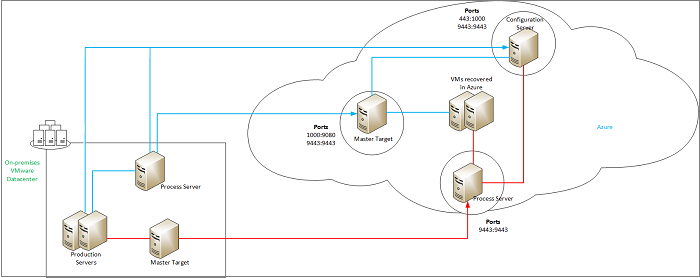

## Bevor Sie beginnen 

- Sollten Sie über Ihre virtuelle VMware-Computer oder physischen Servern konnten, und sie in Azure ausgeführt werden soll.
- Beachten Sie, dass nur wieder VMware virtuellen Computern und Windows/Linux physischen Servern aus Azure mit VMware virtuellen Computern in der lokalen primären Standort ausgeführt werden kann.  Wenn Sie wieder weiß, keinen physischen Computer befinden, Failover auf Azure werde ich es konvertieren zu einer Azure-virtuellen Computer und Failback an VMware werde ich es Konvertieren einer VMware VM.

Hier wird das Failback einrichten:

1. **Einrichten von Failback Komponenten**: Sie müssen einen vContinuum Server einrichten lokal, und zeigen sie auf dem Konfigurationsserver virtueller Computer in Azure. Sie werden als eine Azure-virtuellen Computer von einem Prozessserver festlegen, zum Senden von Daten an den lokalen master Ziel-Server. Registrieren Sie den Prozess-Server mit dem Konfigurationsserver, der das Failover behandelt. Installation von einem lokalen master Ziel-Server. Wenn Sie einen Windows-Server master Ziel benötigen ist automatisch richten Sie bei der Installation von vContinuum wird. Wenn Sie Linux benötigen, müssen Sie manuell auf einem separaten Server einrichten.
2. **Aktivieren von Schutz und Failback**: Nachdem Sie die Komponenten eingerichtet haben, in vContinuum Sie müssen für über Azure-virtuellen Computern Fehler beim Schutz zu aktivieren. Sie führen Sie ein Häkchen Readiness auf den virtuellen Computern und einen Failover aus Azure zu Ihrem lokalen Website ausführen. Nach Abschluss der Failback erneut lokalen Computer, damit diese Replikation auf Azure beginnen.

## Schritt 1: Installieren Sie vContinuum lokalen

Sie müssen ein vContinuum Server lokal installiert, und zeigen sie auf dem Konfigurationsserver.

1.  [VContinuum herunterladen](http://go.microsoft.com/fwlink/?linkid=526305). 
2.  Laden Sie die Version [vContinuum zu aktualisieren](http://go.microsoft.com/fwlink/?LinkID=533813) .
3. Installieren der neuesten Version von vContinuum an. Klicken Sie auf der Seite **Willkommen** auf **Weiter**.
    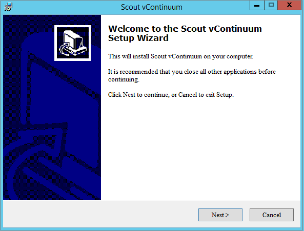
4.  Geben Sie auf der ersten Seite des Assistenten die CX-Server IP-Adresse und der CX-Serverport ein. Aktivieren Sie **verwenden HTTPS**.

    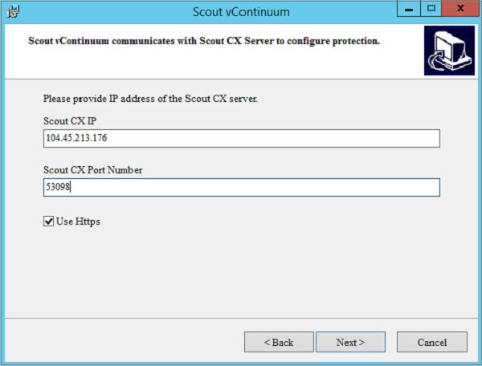

5.  Suchen Sie die Konfigurationsserver IP-Adresse auf die Registerkarte **Dashboard** des Servers Konfiguration virtueller Computer in Azure.
    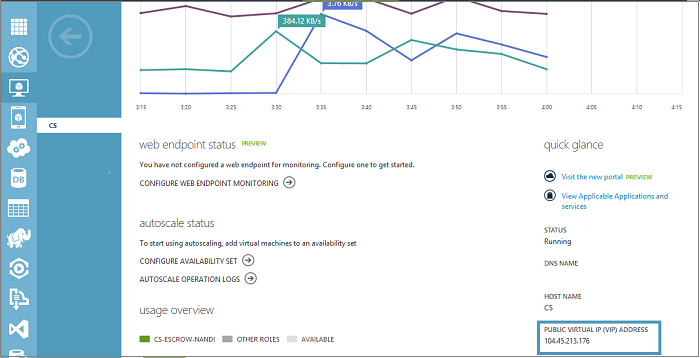

6.  Suchen des Konfiguration Servers öffentliche HTTPS-Port auf der Registerkarte **Endpunkte** des Servers Konfiguration virtueller Computer in Azure.

    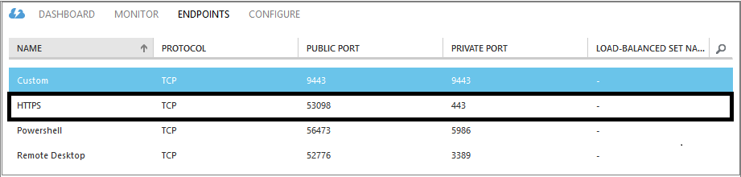

7. Geben Sie auf der Seite **Details von CS Kennwort** das Kennwort ein, dem Sie nach unten notiert haben, wenn Sie den Konfigurationsserver registriert. Wenn Sie vergessen checken sie es in **C:\\Programmdateien (x86)\\InMage Systeme\\private\\connection.passphrase** auf dem Konfigurationsserver virtueller Computer.

    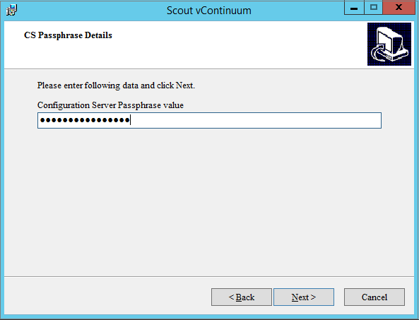

8.  Geben Sie auf der Seite **Wählen Sie Zielspeicherort** Stelle der vContinuum Server zu installieren, und klicken Sie auf **Installieren**.

    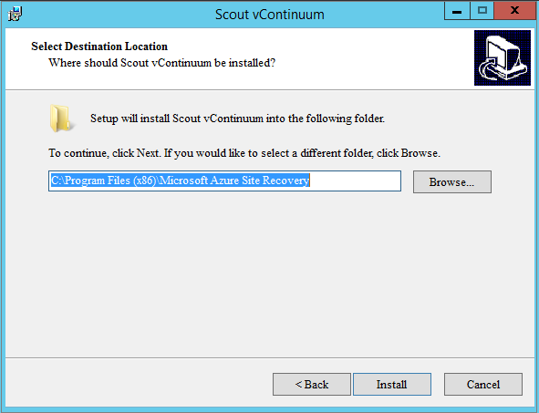

9. Nach Abschluss der Installation können Sie vContinuum starten.
    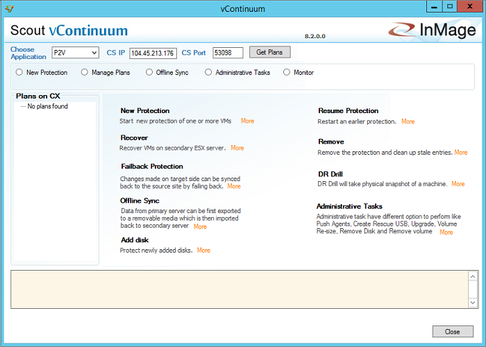

## Schritt 2: Installieren von einem Prozessserver in Azure 

Sie müssen einen Prozessserver in Azure zu installieren, damit die virtuellen Computern in Azure die Daten wieder in einer lokalen master Ziel-Server senden können. 

1.  Wählen Sie auf der Seite **Konfiguration Servern** in Azure zum Hinzufügen eines neuen Prozess-Servers.

    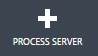

2.  Geben Sie einen Prozessserver Namen und einen Namen und das Kennwort für die Verbindung mit dem virtuellen Computer als Administrator. Wählen Sie den Konfigurationsserver, den Sie den Prozess-Server registrieren möchten. Dies sollte demselben Server sein, die, den Sie verwenden, um schützen und nicht bestanden über Ihren virtuellen Computern.
3.  Geben Sie an dem Azure Netzwerk, in dem Prozess-Server bereitgestellt werden sollen. Sie sollten im selben Netzwerk wie die Konfigurationsserver. Geben Sie ein eindeutigen IP-Adresse ausgewählt Subnetz und mit der beginnen Sie Bereitstellung.

    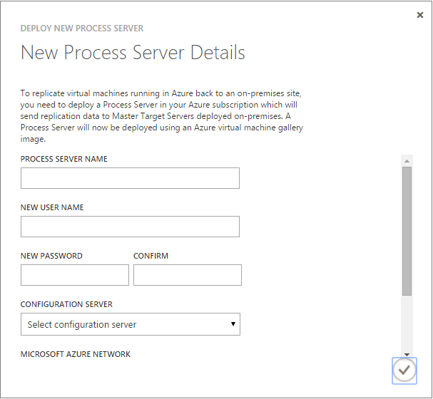

4.  Ein Projekt wird ausgelöst, um den Prozess-Server bereitstellen.

    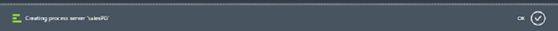

5.  Nach der Bereitstellung des Prozess-Servers in Azure können Sie melden Sie sich bei dem Server mit den Anmeldeinformationen, die Sie angegeben haben. Registrieren Sie den Prozess-Server in die gleiche Weise, wie, die Sie den Prozess-Server lokal registriert. 

    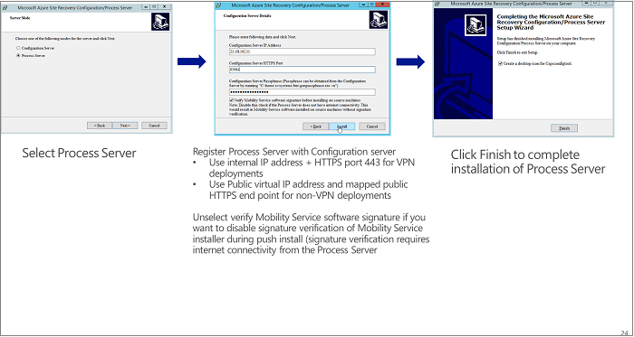

>[AZURE.NOTE] Die Server während des Failbacks registriert wird nicht unter virtueller Computer Eigenschaften in Website Wiederherstellung sichtbar sein. Sie sind nur sichtbar ist, klicken Sie unter der Registerkarte **Server** des Servers Konfiguration, dem sie registriert haben. Es kann zu 10 bis 15 Minuten dauern, bis sie, wo Sie auf der Registerkarte Prozess-Server angezeigt wird.

## Schritt 3: Installieren einer Gestaltungsvorlage Ziel-Server lokal

Eine Linux installieren müssen, oder ein Windows-master Ziel-Server lokal, je nach Datenquelle virtuellen Computern Betriebssystem.

### Bereitstellen eines Windows-master Ziel-Servers

Ein Windows-master-Ziel ist bereits vContinuum Setup enthalten. Bei der Installation der vContinuum ist auch ein master-Server auf demselben Computer bereitgestellt und auf dem Konfigurationsserver registriert.

1.  Um Bereitstellung beginnen möchten, erstellen Sie ein leeres Computer lokal auf dem ESX-Host auf dem Sie die virtuellen Computern aus Azure wiederherstellen möchten.

2.  Stellen Sie sicher, dass es mit dem virtuellen Computer verbundenen mindestens zwei Datenträger – eine für das Betriebssystem verwendet wird und das andere für das Laufwerk Aufbewahrung verwendet wird.

3.  Installieren Sie das Betriebssystem an.

4.  Installieren Sie die vContinuum auf dem Server. Damit ist die Installation des Zielservers master auch abgeschlossen.

### Bereitstellen eines Linux master Ziel-Servers

1.  Um Bereitstellung beginnen möchten, erstellen Sie ein leeres Computer lokal auf dem ESX-Host auf dem Sie die virtuellen Computern aus Azure wiederherstellen möchten.

2.  Stellen Sie sicher, dass es mit dem virtuellen Computer verbundenen mindestens zwei Datenträger – eine für das Betriebssystem verwendet wird und das andere für das Laufwerk Aufbewahrung verwendet wird.

3.  Installieren des Betriebssystems Linux. Das Linux master Zielsystem sollten nicht LVM für Stamm oder Aufbewahrung Speicher Leerzeichen verwenden. Ein Linux master Ziel-Server ist standardmäßig zur Vermeidung von LVM Partitionen/Datenträger Suche konfiguriert.
4.  Partitionen, die Sie erstellen können:

    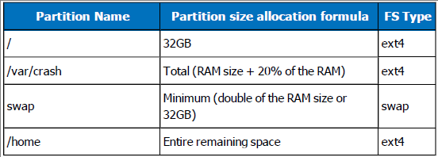

5.  Führen Sie die unten Installationsschritte vor der Zielinstallation master Posten.

#### Bereitstellen von OS Installationsschritte

Wenn die SCSI-IDs für jede SCSI-Festplatte in einer Linux virtuellen Computern erhalten möchten, aktivieren Sie den Parameter "Datenträger. EnableUUID = wahr "wie folgt:

1. Fahren Sie Ihre virtuellen Computer aus.
2. Mit der rechten Maustaste im linken Bereich des virtuellen Computer-Eintrags > **Einstellungen bearbeiten**.
3. Klicken Sie auf der Registerkarte **Optionen** . Wählen Sie **Erweitert\>allgemeiner Artikel** > **Konfigurationsparameter**. Die **Konfigurationsparameter** Option ist nur verfügbar, wenn der Computer beendet wird.

    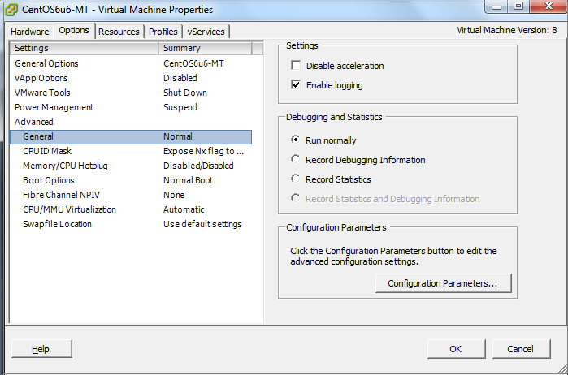

4. Überprüft, ob eine Zeile mit **Datenträger. EnableUUID** vorhanden ist. Falls es hat und auf **False** festgelegt ist dann festgelegt es auf **True** (nicht Groß-/Kleinschreibung beachtet). Wenn vorhanden und eingestellt ist, WAHR, klicken Sie auf **Abbrechen** , und testen den SCSI-Befehl innerhalb des Gastbetriebssystems aus, nachdem es von gestartet wird. Wenn nicht vorhanden sein, klicken Sie auf **Zeile hinzufügen**.
5. Fügen Sie Datenträger hinzu. EnableUUID in der Spalte **Name** . Legen Sie den Wert als TRUE. Hinzufügen von nicht die oben beschriebenen Werten zusammen mit doppelten Anführungszeichen.

    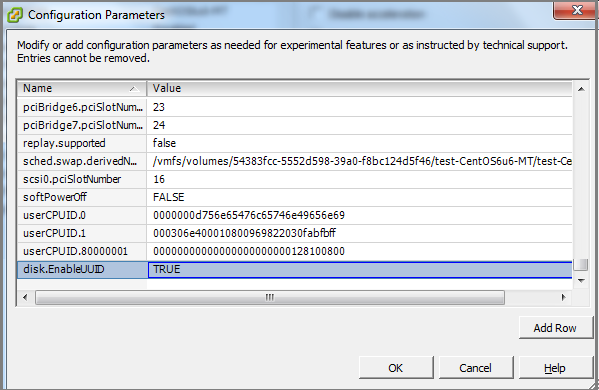

#### Herunterladen Sie und installieren Sie zusätzliche Pakete

Hinweis: Stellen Sie sicher, dass das System Internetzugang verfügt, bevor herunterladen und installieren zusätzliche Pakete.

\#Yum installieren y - Xfsprogs Perl Lsscsi Rsync Wget Kexec-tools

Dieser Befehl diese 15 Pakete aus CentOS 6.6 Repository downloads und installiert sie:

BC-1.06.95-1.el6.x86\_64 u/Min

Busybox-1.15.1-20.el6.x86\_64 u/Min

Elfutils-Bibliotheken-0.158-3.2.el6.x86\_64 u/Min

Kexec-Tools – 2.0.0-280.el6.x86\_64 u/Min

Lsscsi-0,23-2.el6.x86\_64 u/Min

Lzo-2.03-3.1.el6\_5.1.x86\_64 u/Min

Perl-5.10.1-136.el6\_6.1.x86\_64 u/Min

Perl-Modul-Plug-3.90-136.el6\_6.1.x86\_64 u/Min

Perl-Pod-Escapezeichen-1,04-136.el6\_6.1.x86\_64 u/Min
    
Perl-Pod-einfach-3.13-136.el6\_6.1.x86\_64 u/Min

Perl-Bibliotheken-5.10.1-136.el6\_6.1.x86\_64 u/Min

Perl-Version-0.77-136.el6\_6.1.x86\_64 u/Min

Rsync-3.0.6-12.el6.x86\_64 u/Min

leicht lesbare 1.1.0 1.el6.x86\_64 u/Min

Wget-1.12-5.el6\_6.1.x86\_64 u/Min

Hinweis: Wenn der Quellcomputer Reiser oder XFS Dateisystem für das Gerät Stamm oder Boot verwendet wird, klicken Sie dann folgenden Pakete sollte werden heruntergeladen und installiert auf Linux master Ziel vor Schutz.

\#CD/usr/local

\#Wget <http://elrepo.org/linux/elrepo/el6/x86_64/RPMS/kmod-reiserfs-0.0-1.el6.elrepo.x86_64.rpm>

\#Wget <http://elrepo.org/linux/elrepo/el6/x86_64/RPMS/reiserfs-utils-3.6.21-1.el6.elrepo.x86_64.rpm>

\#u/Min - Ivh Kmod-Reiserfs-0,0-1.el6.elrepo.x86\_64 u/Min Reiserfs-Utils-3.6.21-1.el6.elrepo.x86\_64 u/Min

\#Wget <http://mirror.centos.org/centos/6.6/os/x86_64/Packages/xfsprogs-3.1.1-16.el6.x86_64.rpm>

\#u/Min - Ivh Xfsprogs-3.1.1-16.el6.x86\_64 u/Min

#### Anwenden von benutzerdefinierten Konfiguration Änderungen

Stellen Sie bevor Sie diese Änderungen sicher, dass Sie im vorhergehenden Abschnitt abgeschlossen haben, und dann gehen Sie folgendermaßen vor:

1. Kopieren der RHEL 6-64 Unified Agent binäre auf neu erstellten OS.

2. Führen Sie diesen Befehl, um die Binärdatei untar-Befehl: **tar - Zxvf \<Dateinamen\> **

3. Führen Sie diesen Befehl erteilen von Berechtigungen für: \# **Chmod 755./ApplyCustomChanges.sh**

4. Führen Sie das Skript: ** \# ./ApplyCustomChanges.sh**. Führen Sie das Skript nur einmal auf dem Server. Starten Sie den Server ein, nachdem das Skript ausgeführt wird.

### Installieren Sie den Linux-server

1. [Herunterladen](http://go.microsoft.com/fwlink/?LinkID=529757) der Installationsdatei aus.
2. Kopieren Sie die Datei mithilfe einer Sftp-Client-Programm Ihrer Wahl am Master Linux Ziel virtuellen Computer an. Sie können abwechselnd melden Sie sich an den Linux master Ziel virtuellen Computern und verwenden zum Herunterladen des Installationspakets aus den bereitgestellten Link wget
3. Melden Sie sich an den Linux master Ziel Server virtuellen Computern mithilfe einer ssh Client Ihrer Wahl
4. Wenn Sie mit der Azure-Netzwerk verbunden sind, auf denen Sie Ihre Linux master Zielserver über ein VPN bereitgestellt, verwenden Sie dann die interne IP-Adresse des Servers, die Sie im **Dashboard** -Registerkarte virtuellen Computern und Anschluss 22 Verbindung zu den master Ziel-Linux Server mithilfe von Secure Shell finden können.
5. Wenn Sie über eine Verbindung zum Internet öffentlichen Linux master Ziel-Server herstellen Linux master Zielserver öffentliche virtuelle IP-Adresse (über die Registerkarte des virtuellen Computern **Dashboard** ) verwenden und der öffentliche Endpunkt erstellt für ssh bei der Linux Servder anmelden.
6. Die Dateien aus dem Gzipped Linux master Ziel Server Installer Tar-Archiv extrahieren, indem Sie ausführen: *"tar – Xvzf Microsoft-ASR\_UA\_8.2.0.0\_RHEL6-64\"* aus dem Verzeichnis aus, die die Installer-Paket enthält.

    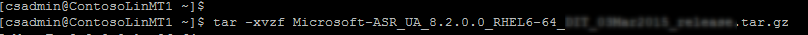

7. Wenn Sie das Installationsprogramm Dateien in ein anderes Verzeichnis zu dem Verzeichnis zu ändern extrahiert die des Inhalts der Tar Archivieren wurden extrahiert. Aus diesem Verzeichnispfad ausführen "Sudo. / install.sh".

    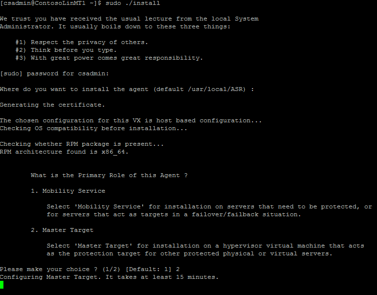

8. Wenn Sie dazu aufgefordert werden, wählen Sie eine primäre Rolle **2 (Master Ziel)**auswählen. Lassen Sie die interaktive Installationsoptionen auf ihre Standardwerte aus.
9. Warten Sie Installation, um den Vorgang fortzusetzen und Schnittstelle des Config angezeigt werden. Die Hostkonfiguration-Programm für die Gestaltungsvorlage Linux Sarget Server ist ein Befehlszeile-Programm. Ändern der Größe nicht die ssh Client-Programm-Fenster. Verwenden Sie die Pfeiltasten, um Wählen Sie die Option **Global** aus, und drücken die EINGABETASTE.

    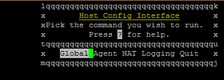

    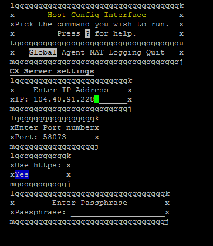

10. Geben Sie im Feld **IP** die interne IP-Adresse des Servers Konfiguration (Sie können finden sie auf der Registerkarte **Dashboard** des Servers Konfiguration virtueller Computer), und drücken Sie die EINGABETASTE. Geben Sie im **Anschluss** **22** , und drücken Sie die EINGABETASTE. 
11.  Lassen Sie **Verwenden HTTPS** als **Ja**, und drücken Sie die EINGABETASTE.
12.  Geben Sie das Kennwort ein, die generiert wurde auf dem Konfigurationsserver ein. Wenn Sie einen PUTTY Client aus einem Windows-Computer zu ssh Linux virtuellen Computer verwenden können Sie UMSCHALT + EINFG verwenden, um den Inhalt der Zwischenablage einzufügen. Kopieren Sie das Kennwort in die lokale Zwischenablage mit STRG + C, und verwenden Sie UMSCHALT + EINFG zum Einfügen der Daten. Drücken Sie die EINGABETASTE.
13.  Verwenden Sie die nach-rechts-Taste, um zu navigieren, um zu beenden, und drücken die EINGABETASTE. Warten Sie auf Abschluss der Installation.

    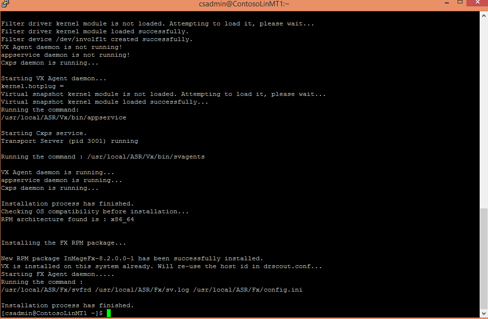

Wenn Sie aus irgendeinem Grund Fehler bei Ihrem Linux master Ziel-Server auf dem Konfigurationsserver registrieren können Sie also erneut ausführen durch Ausführen des Hosts Konfigurationsprogramm aus /usr/local/ASR/Vx/bin/hostconfigcli (Sie müssen zuerst Zugriffsberechtigungen für dieses Verzeichnis festzulegen, indem Sie Chmod als übergeordnete Benutzer ausführen).

#### Überprüfen Sie die Gestaltungsvorlage Ziel Registrierung

Sie können überprüfen, dass der Gestaltungsvorlage Ziel-Server erfolgreich auf dem Konfigurationsserver in Azure Website Wiederherstellung Tresor registriert wurde > **Konfigurationsserver** > **Server Details**.

>[AZURE.NOTE] Nach dem Registrieren des master Ziel-Servers, handelt erhalten Sie Fehler bei der Konfiguration, die den virtuellen Computern möglicherweise aus Azure gelöscht wurden oder die Endpunkte sind nicht ordnungsgemäß konfiguriert werden, es sich zwar master Ziel in Azure bereitgestellt wird die Zielkonfiguration master durch die Azure Dndpoints erkannt wird, dies wahr für eine lokale master Ziel Server lokal nicht zur Verfügung. Dies hat keine Auswirkung auf Failback, und Sie können diesen Fehler ignorieren. 

## Schritt 4: Schützen der virtuellen Computern zur lokalen Website

Sie müssen zu der Website auf eine lokale virtuellen Computern schützen, bevor Sie wieder fehl.

### Vorbemerkung

Beim ein virtuellen Computers zu Azure über fehlgeschlagen ist, hinzugefügt eine zusätzliche temp-Laufwerk für Seitendatei. Dies ist ein zusätzliches Laufwerk, die in der Regel nicht erforderlich ist, nach der Fehler beim über virtueller Computer, da es bereits eine dedizierte für die Seite Datei Laufwerk möglicherweise. Vorbemerkung reverse Schutz der virtuellen Computer müssen Sie sicherstellen, dass dieses Laufwerk Offlinemodus versetzt wird, damit es nicht geschützt erhalten. Gehen Sie folgender wie folgt vor:

1.  Öffnen Sie Computer Verwaltung zu, und wählen Sie Speicher-Management aus, damit es die Datenträger online listet und an den Computer angeschlossen.
2.  Wählen Sie aus dem temporären Datenträger an den Computer angeschlossen, und legen sie offline schalten. 

### Schützen der virtuellen Computern

1. Aktivieren Sie im Portal Azure die Bundesstaaten des virtuellen Computers, um sicherzustellen, dass sie über einen Fehler aufgetreten sind.

    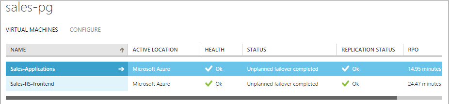

2. Starten Sie vContinuum auf Ihrem Computer.

    

3. Klicken Sie auf **Neue Schutz** , und wählen Sie den Typ des Operation-System, die 

4.  Klicken Sie in das neue Fenster, dass das **Betriebssystem-Typ**wählen Sie öffnen aus > **Details abrufen** , für die virtuelle Computer wieder fehlschlagen soll. In **primären Serverdetails**zu identifizieren Sie, und wählen Sie den virtuellen Computern, die Sie schützen möchten. Virtuellen Computern sind unter der Hostname vCenter aufgelistet, auf dem sie sich vor dem Failover waren.
5.  Wenn Sie einen virtuellen Computer schützen auswählen (und es bereits über Azure fehlgeschlagen) bietet ein Popupfenster zwei Einträge für den virtuellen Computer an. Dies ist, da der Konfigurationsserver zwei Instanzen von den virtuellen Computern darauf registriert erkennt. Sie müssen den Eintrag für den virtuellen lokalen Computer zu entfernen, damit Sie den richtigen virtuellen Computer schützen können. Wenn Sie um den richtigen Azure-virtuellen Computer Eintrag hier zu identifizieren, können Sie melden Sie sich bei dem Azure-virtuellen Computer und wechseln Sie zu c:\Programme Dateien (x86) \Microsoft Azure Site Recovery\Application Data\etc. Identifizieren Sie in der Datei drscout.conf der Host-ID Klicken Sie im Dialogfeld vContinuum behalten Sie den Eintrag für den Sie die Host-ID des virtuellen Computers gefunden. Löschen Sie alle anderen Einträge ein. Um den richtigen virtuellen Computer auszuwählen, können Sie seine IP-Adresse verweisen. Die IP-Adresse Bereich lokalen werden dem virtuellen lokalen Computer an.

    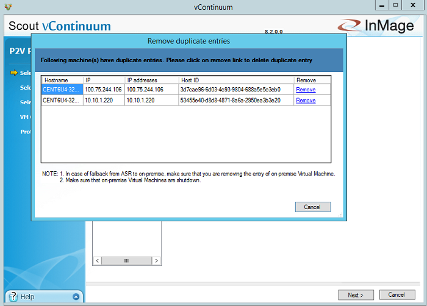

    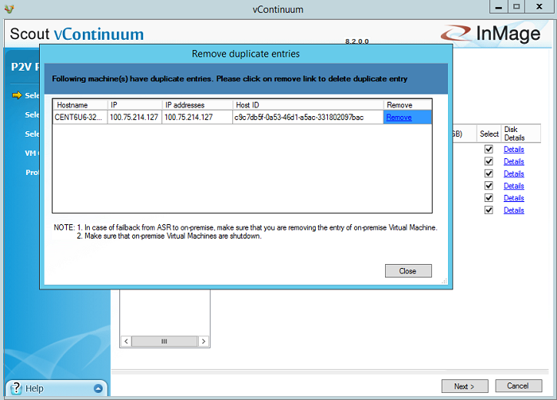

6. Beenden Sie auf dem Server vCenter des virtuellen Computers. Sie können auch die virtuellen Computern lokal löschen.
7. Geben Sie dann den lokale MT Server, den Sie die virtuellen Computern schützen möchten. Verbinden Sie hierzu vCenter Server, wieder fehlschlägt werden soll.

    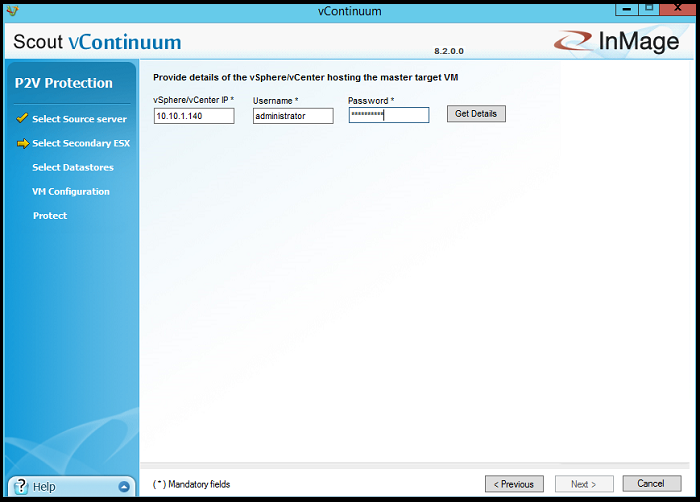

8. Wählen Sie den master Zielserver basierend auf dem Host, den Sie den virtuellen Computer wiederherstellen möchten.

    

9. Stellen Sie die Replikationsoption für jede den virtuellen Computern. Dazu müssen Sie den Wiederherstellung Seite Datenspeicher auswählen, den die virtuellen Computern wiederhergestellt werden. Die Tabelle zeigt die verschiedenen Optionen, die Sie für jeden virtuellen Computer angeben müssen.

    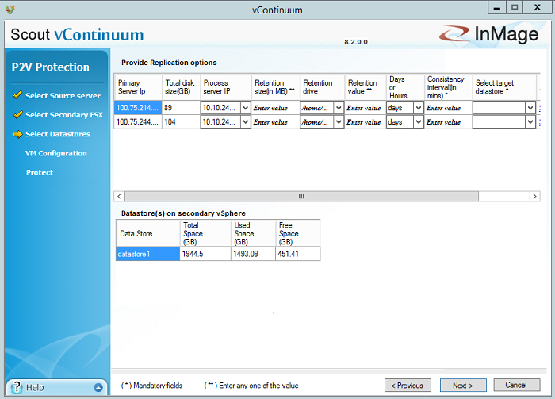

    **Option** | **Option empfohlenen Wert**
    ---|---
    Prozess-Server IP-Adresse | Wählen Sie den Prozessserver in Azure bereitgestellt
    Aufbewahrungsrichtlinien Größe in MB| 
    Wert der Aufbewahrungsrichtlinien | 1
    Tage/Stunden | Tage
    Konsistenz Intervall | 1
    Wählen Sie Ziel Datenspeicher | Der Datenspeicher verfügbar auf der Website der Wiederherstellung. Der Datenspeicher sollte genügend Speicherplatz und verfügbar sein, um die ESX-Host auf dem Wiederherstellen des virtuellen Computers werden soll.

10. Konfigurieren Sie die Eigenschaften, die nach Failover auf lokalen Standort des virtuellen Computers erwerben. Die Eigenschaften werden in der folgenden Tabelle zusammengefasst.

    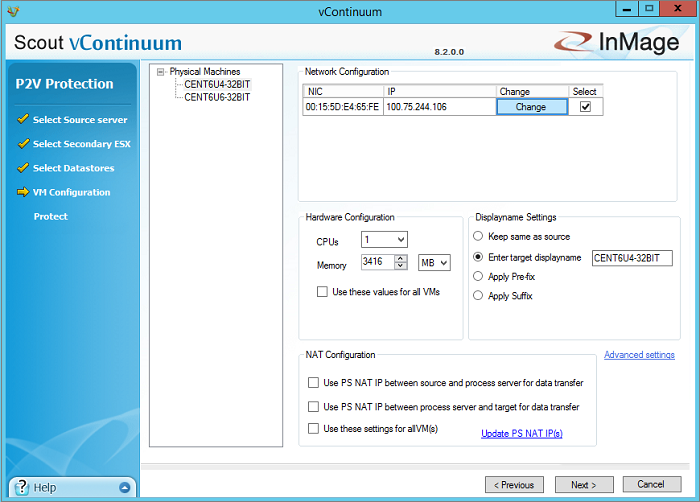

    **Eigenschaft** | **Details**
    ---|---
    Netzwerkkonfiguration| Wählen Sie für jeden Netzwerkadapter erkannt wird ihn aus, und klicken Sie auf **Ändern** , um die Failback IP-Adresse des virtuellen Computers zu konfigurieren. 
    Hardwarekonfiguration| Geben Sie die CPU- und den für den virtuellen Computer an. Einstellungen können mit den virtuellen Computern angewendet werden, die Sie schützen möchten. Wenn Sie um die richtigen Werte für die CPU und Arbeitsspeicher zu identifizieren, können Sie auf die Größe des IAAS virtuellen Computern Rolle verweisen und finden Sie unter die Anzahl der Kerne und Arbeitsspeicher zugewiesen.
    Anzeigename | Nach dem Failback zu lokalen können Sie den virtuellen Computern umbenennen, wie sie in den Bestand vCenter angezeigt werden können. Der Standardname ist der Name des virtuellen Computers Computer Host. Wenn Sie um den Namen des virtuellen Computers zu identifizieren, können Sie in der Liste virtueller Computer in der Gruppe "Schutz" verweisen.
    NAT-Konfiguration | Im folgenden ausführlich erläutert

    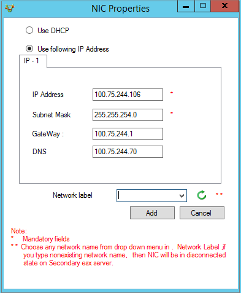

#### Konfigurieren von NAT-Einstellungen

1. Zum Schutz der virtuellen Computer aktiviert haben, müssen zwei Kommunikationskanäle hergestellt werden. Der erste Kanal liegt zwischen des virtuellen Computers und den Prozess-Server. Dieser Kanal sammelt die Daten aus dem virtuellen Computer und sendet diese an den Prozess-Server, der Sie dann die Daten auf dem Zielserver master sendet. Wenn Sie den Prozess-Server und des virtuellen Computers geschützt werden, die gleichen Azure virtuelle Netzwerk befinden, brauchen Sie NAT Einstellungen verwenden. Geben Sie andernfalls NAT Einstellungen aus. Anzeigen der öffentlichen IP-Adresse des Servers Prozess in Azure. 

    

2. Der zweite Kanal ist zwischen den Prozess-Server und dem master Ziel-Server. Die Option zur Verwendung von NAT oder nicht, hängt davon ab, ob Sie eine VPN-basierten Verbindung oder Kommunikation über das Internet. Wählen Sie NAt nicht, wenn Sie die Option VPN verwenden, aber nur, wenn Sie die Verbindung zum Internet verwenden.

    

    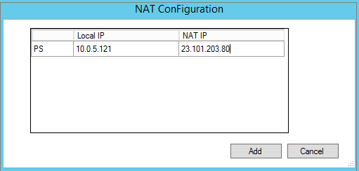

3. Wenn Sie den lokalen virtuellen Computern gemäß Angabe gelöscht haben und der Datenspeicher, die, den Sie wieder zur weiterhin fehlschlagen, der alten VMDK enthält, müssen Sie sicherstellen, dass das Failback virtueller Computer an einem neuen Ort erstellten erhält. Dazu wählen Sie die Einstellungen **Erweitert** , und geben Sie einen anderen Ordner in den **Einstellungen für den Ordner**wiederherstellen. Lassen Sie die anderen Optionen, mit deren Standardeinstellungen. Wenden Sie die Einstellungen für den Ordner an alle Server aus.

    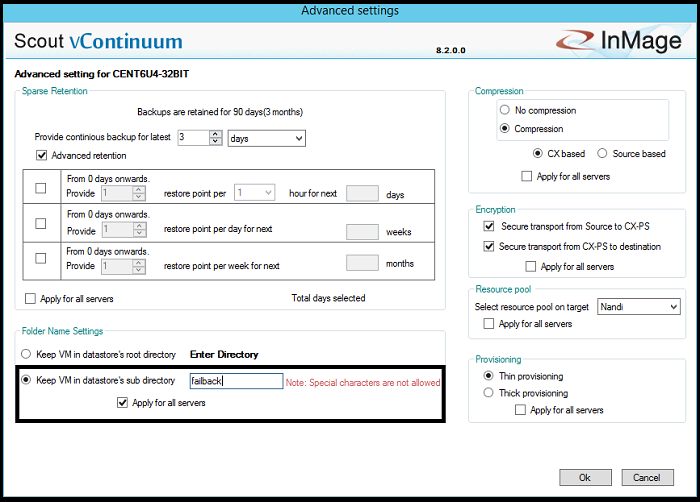

4. Führen Sie eine Readiness stellen Sie sicher, dass die virtuellen Computer zurück zur lokalen geschützt werden können. 

    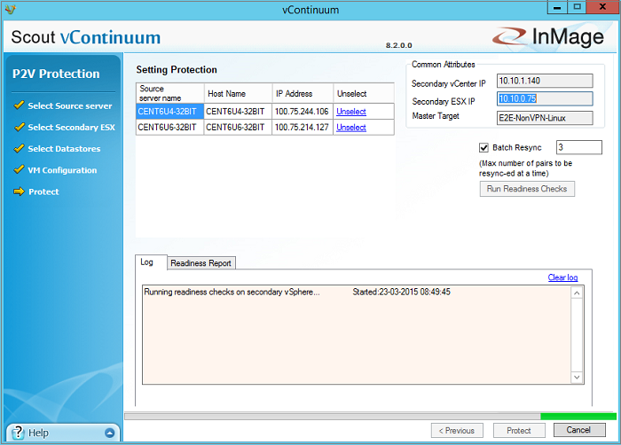

5. Warten Sie, bis er abgeschlossen. Ist es erfolgreich auf alle virtuellen Computern können Sie einen Namen für den Schutzplan angeben. Klicken Sie dann auf **schützen** , um zu beginnen.

    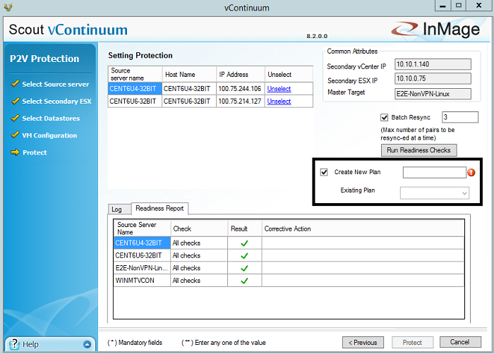

6. Sie können in vContinuum überwachen.

    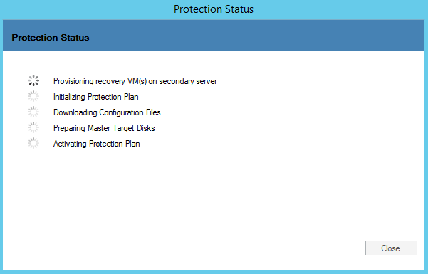

7. Nach dem Schritt, **Den aktivieren Schutz planen endet,** können Sie virtueller Computer Schutz im Portal Website Wiederherstellung überwachen.

    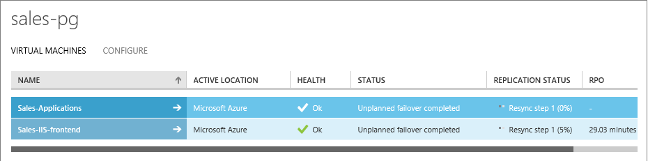

8. Sie können den genauen Status des virtuellen Computers klicken und deren Status für die Überwachung anzeigen.

    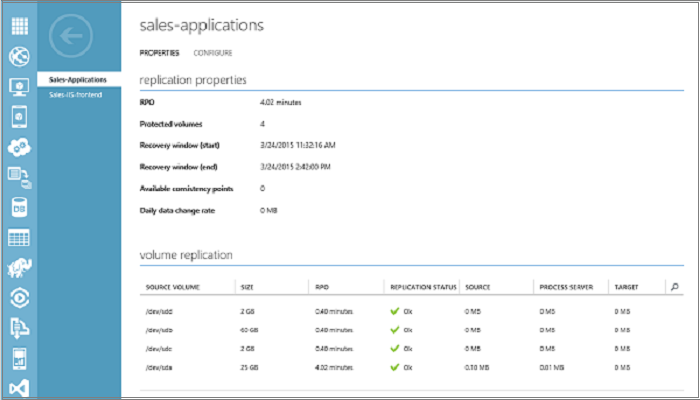

## Vorbereiten des Failback Plans

Sie können einen Failback Plan vContinuum verwenden, damit die Anwendung wieder in der lokalen Website zu einem beliebigen Zeitpunkt ausgeführt werden kann, vorbereiten. Diese Pläne Wiederherstellung sind sehr ähnlich der Wiederherstellung Pläne in Website Wiederherstellung.

1.  Starten Sie vContinuum, und wählen Sie **Verwalten Pläne** > **Wiederherstellen.** Sie können die Liste der alle Pläne anzeigen, die zum Fehlschlagen über virtuellen Computern verwendet wurden. Die gleichen Pläne können Sie wiederherstellen.

    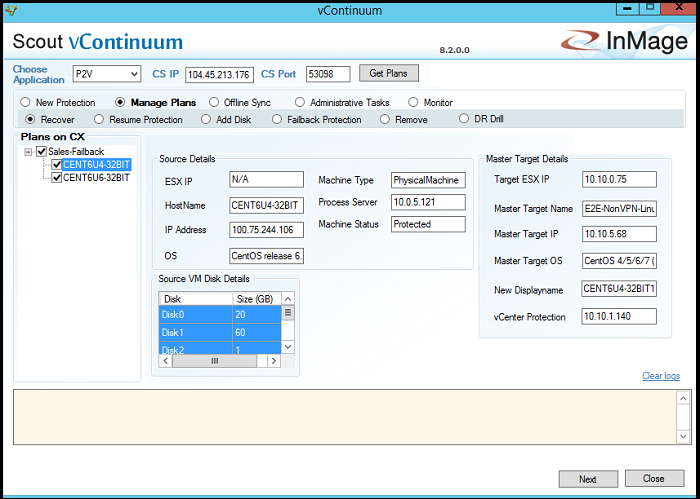

2. Wählen Sie den Schutzplan und alle der virtuellen Computern darin wiederhergestellt werden soll. Wenn Sie die einzelnen virtuellen Computer auswählen können Sie weitere Details wie die Ziel-ESX-Server und der Quelle virtueller Computer Datenträger anzeigen. Klicken Sie auf **Weiter** , um zu beginnen des wiederherstellen-Assistenten, und wählen Sie die virtuellen Computern, die Sie wiederherstellen möchten.

    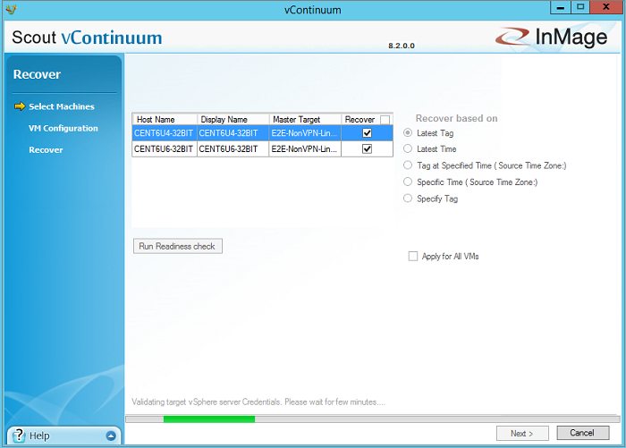

3. Sie können basierend auf mehrere Optionen wiederherstellen, doch empfehlen wir verwenden **Letzten Tag** , und wählen Sie **Übernehmen für alle virtuelle Computer** , um sicherzustellen, dass die neuesten Daten des virtuellen Computers verwendet werden.
4. Führen Sie die **Kontrollkästchen Readiness.** Hiermit wird überprüft, wenn die richtigen Parameter Aktivieren der Wiederherstellung virtueller Computer konfiguriert sind. Klicken Sie auf **Weiter** , wenn alle Prüfungen erfolgreich ausgeführt werden. Wenn nicht im Ereignisprotokoll und Beheben der Fehler.

    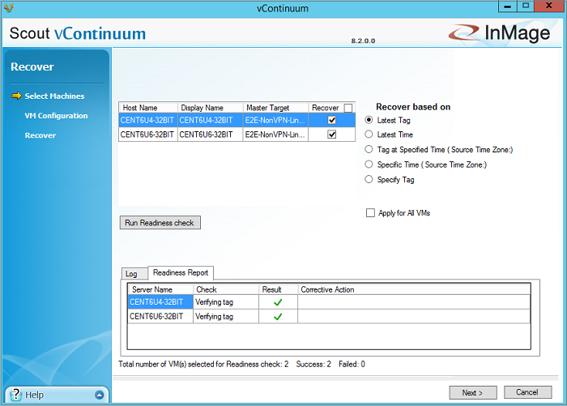

8.  **Virtueller Computer Konfiguration** sicher, dass die Einstellungen der Wiederherstellung ordnungsgemäß festgelegt sind. Sie können die virtuellen Computer-Einstellungen bei Bedarf ändern.

    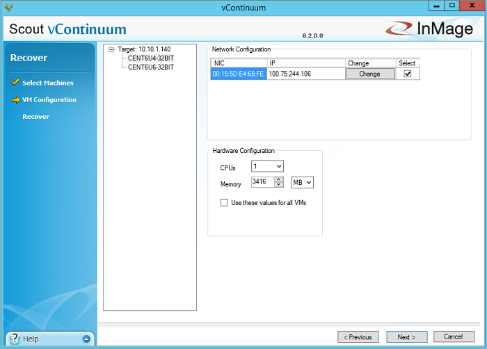

9. Überprüfen Sie die Liste der virtuellen Computern, die wiederhergestellt werden soll, und geben Sie eine Wiederherstellung an. Beachten Sie, dass virtuelle Computer mit dem Namen des Computers Host aufgelistet werden. Es kann schwierig zu den Namen des Computers Host des virtuellen Computers zugeordnet sein.
Ordnen Sie die Namen, wechseln Sie zu den virtuellen Computern **Dashboard** in Azure und der Hostname überprüfen.

    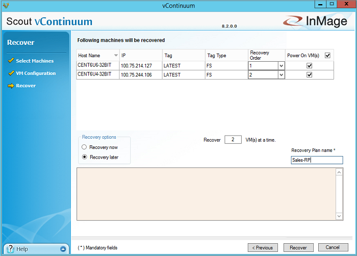

10. Geben Sie einen Plan an, und wählen Sie **später wiederherstellen**. Es empfiehlt sich später wiederherstellen, da der ursprüngliche Schutz möglicherweise nicht abgeschlossen. 
11. Klicken Sie auf **Wiederherstellen** , speichern Sie den Plan oder das Auslösen der Wiederherstellung, wenn Sie ausgewählt haben, um jetzt und nicht zu einem späteren Zeitpunkt wiederherzustellen. Sie können überprüfen, dass den Status Wiederherstellung, um festzustellen, ob das Planen des gespeichert wurde.

    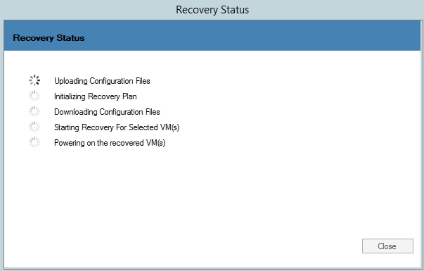

    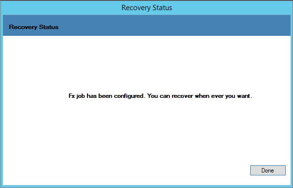

## Wiederherstellen von virtuellen Computern

Nachdem Sie der Plan des erstellt wurde, können Sie den virtuellen Computern wiederherstellen. Sie gehen Sie wie folgt vor überprüfen, dass die virtuellen Computer Synchronisierung durchgeführt wurden. Wenn Replikationsstatus OK zeigt der Schutz abgeschlossen ist, und der oberen Schwellenwert der RPO erfüllt ist. Sie können den Dienststatus in den Eigenschaften virtueller Computer überprüfen.

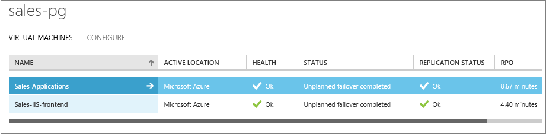

Deaktivieren Sie Azure-virtuellen Computern, bevor Sie die Wiederherstellung einleiten. Dadurch wird sichergestellt, es ist keine geteilten Gehirn und, dass Benutzer nur Zugriff auf eine Kopie der Anwendung werden. 

1.  Starten Sie den gespeicherten Plan. Wählen Sie im vContinuum **Monitor** Pläne. Dies sind alle Pläne, die ausgeführt wurden.

    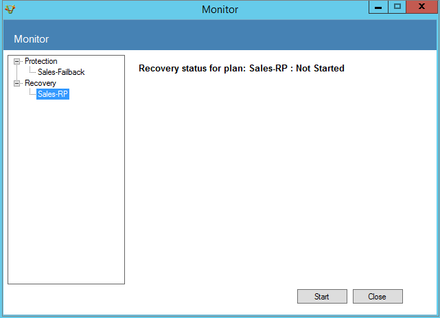

2.  Wählen Sie in der **Wiederherstellung** den Plan aus, und klicken Sie auf **Start**. Sie können die Wiederherstellung überwachen. Nach Aktivierung der virtuellen Computern aktivieren Sie können eine Verbindung herstellen können in vCenter.

    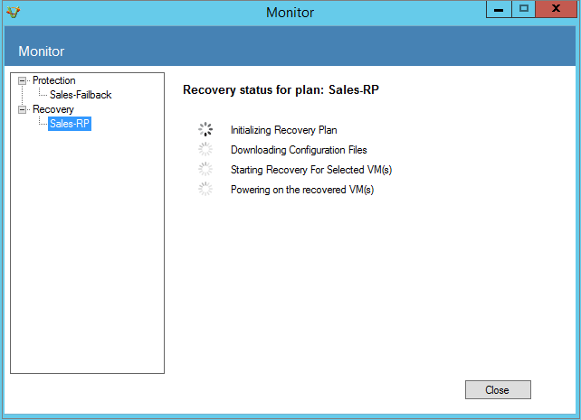

## Schützen Sie erneut nach dem Failback Azure

Nach Abschluss der Failback möchten Sie wahrscheinlich den virtuellen Computern erneut zu schützen. Gehen Sie folgender wie folgt vor:

1.  Überprüfen Sie, dass die virtuellen Computern lokalen arbeiten und Applikationen erreichbar sind.
2.  Im Portal Azure Website Wiederherstellung wählen Sie die virtuellen Computer aus, und löschen. So deaktivieren Sie den Schutz der virtuellen Computer auswählen. Dadurch wird sichergestellt, dass die virtuellen Computern nicht mehr geschützt sind.
3.  Azure löschen Sie den fehlerhaften über Azure-virtuellen Computern
4.  Löschen Sie den alten virtuellen Computer auf vSpehere. Hierbei handelt es sich um den virtuellen Computern, die Sie zuvor über in Azure fehlgeschlagen ist.
5.  Schützen Sie im Portal Website Wiederherstellung der virtuellen Computern, die über einer vor kurzem fehlschlug. Nachdem sie geschützt sind, können Sie diese zu einem Wiederherstellungsplan hinzufügen.
 
## Nächste Schritte

- [Informationen zu](site-recovery-vmware-to-azure-classic.md) VMware virtuellen Computern und physische Server auf Azure mithilfe der erweiterten bereitstellungs repliziert.

 
