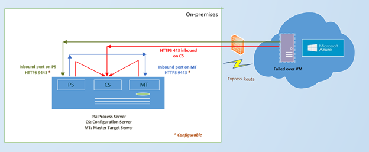
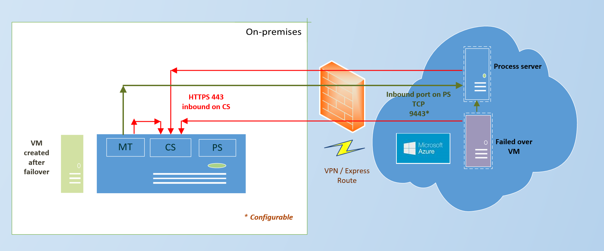
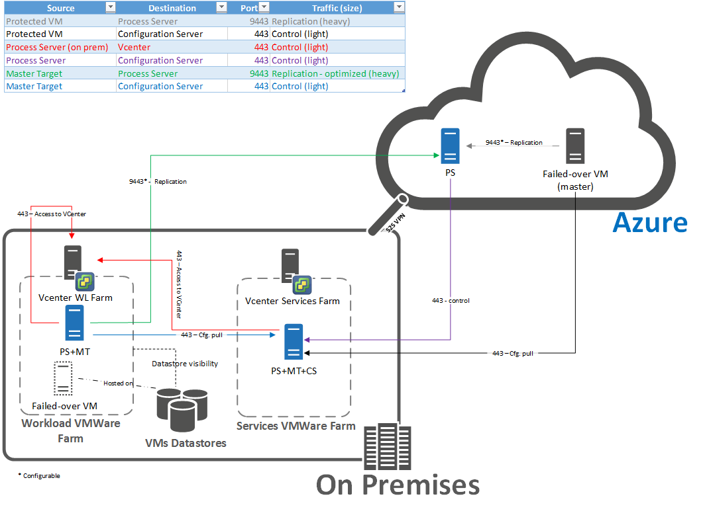
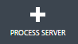
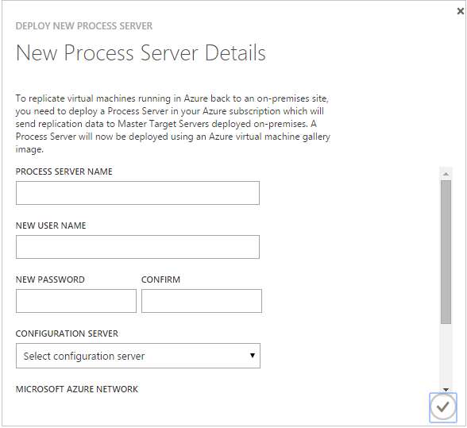
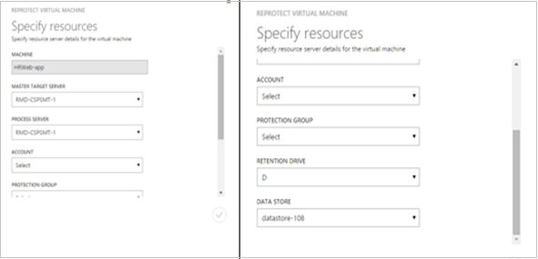
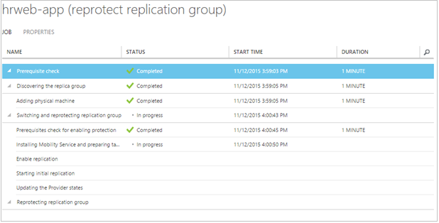

<properties 
   pageTitle="Treten zurück VMware virtuellen Computern und physische Server in der lokalen Website | Microsoft Azure"
   description="Informationen Sie zu fehlerhaften wieder in der lokalen Website nach Failover von VMware virtuellen Computern und physische Azure-Server." 
   services="site-recovery" 
   documentationCenter="" 
   authors="ruturaj" 
   manager="mkjain" 
   editor=""/>

<tags
   ms.service="site-recovery"
   ms.devlang="na"
   ms.tgt_pltfrm="na"
   ms.topic="article"
   ms.workload="required" 
   ms.date="08/22/2016"
   ms.author="ruturajd"/>

# Fail zurück VMware virtuellen Computern und physische Server in der lokalen Website

> [AZURE.SELECTOR]
- [Azure-Portal](site-recovery-failback-azure-to-vmware.md)
- [Azure klassischen-Portal](site-recovery-failback-azure-to-vmware-classic.md)
- [Azure klassischen-Portal (ältere Versionen)](site-recovery-failback-azure-to-vmware-classic-legacy.md)

Dieser Artikel beschreibt, wie wieder Azure-virtuellen Computern aus Azure zu der Website lokalen fehlschlägt. Führen Sie die Schritte in diesem Artikel, wenn Sie bereit sind Ihre VMware virtuellen Computern wieder fehlschlägt oder Windows/Linux physische Servern, nachdem sie aus der lokalen über fehlgeschlagen haben in diesem [Lernprogramm](site-recovery-vmware-to-azure-classic.md)verwenden Azure-Website.

## (Übersicht)

Dieses Diagramm zeigt die Failback Architektur für dieses Szenario.

Verwenden Sie diese Architektur, wenn der Prozess-Server lokal und ein ExpressRoute verwenden.

Verwenden Sie diese Architektur, wenn der Prozessserver auf Azure ist und entweder ein VPN oder eine Verbindung ExpressRoute stehen Ihnen.

Um die vollständige Liste der Ports und das Failback finden Sie unter Architecture Diagramm finden Sie in der nachstehenden Abbildung

Und so funktioniert Failback:

- Nachdem Sie über in Azure fehlschlug haben, treten Sie zum lokalen Standort in wenigen Schritten:
    - **Schritt 1**: Sie erneut die Azure-virtuellen Computern, damit diese zurück zu VMware virtuellen Computern ausführen, die in Ihrer lokalen Website repliziert beginnen. Aktivieren der Reprotection verschiebt den virtuellen Computer in ein Failback Gruppe "Schutz", die automatisch erstellt wurde, wenn Sie die Failover-Gruppe "Schutz" ursprünglich erstellt haben. Wenn Sie hinzugefügt, dass Ihre Failover Schutzgruppe zu einem Wiederherstellungsplan klicken Sie dann den Failback Gruppe "Schutz" den Plan auch automatisch hinzugefügt wurde haben.  Während Sie angeben, wie Sie planen, die zum Fehlschlagen erneut zurück.
    - **Phase 2**: Nachdem Sie Ihre Azure-virtuellen Computern zu Ihrer Website lokal repliziert werden, Sie Ausführen einer Fail über wieder aus Azure fehlschlägt.
    - **Schritt 3**: Nachdem die Daten wieder fehlgeschlagen ist, Sie die lokalen virtuellen Computern, die Sie zurück zur konnte nicht erneut, damit diese Replikation auf Azure beginnen.

> [AZURE.VIDEO enhanced-vmware-to-azure-failback]

### Failback auf den ursprünglichen oder alternativen Speicherort

Wenn Sie über eine VMware VM Fehler bei können Sie wieder in der gleichen Quelle virtueller Computer fehl, wenn es lokal noch vorhanden ist. In diesem Szenario werden nur die Delta Änderungen wieder ein Fehler auf. Beachten Sie Folgendes:

- Wenn Sie über physischen Servern fehlgeschlagen ist Failback immer einer neuen VMware VM.
    - Beachten Sie vor dem weiß nicht wieder auf einen physischen Computer, dass
    - Physische Computer geschützt wird als eines virtuellen Computers, wenn wieder aus Azure VMware über Fehler zurückgegeben
    - Stellen Sie sicher, dass Sie mindestens eine Master Ziel Server zusammen mit den notwendigen ESX/ESXi Hosts, dem Sie Failback müssen, ermitteln.
- Wenn Sie wieder zur ursprünglichen virtuellen nicht ist Folgendes erforderlich:
    - Wenn Sie der virtuellen Computer von einem Server vCenter verwaltet wird sollte das Master-Shape-Ziel ESX-Host Zugriff auf virtuellen Computern Datenspeicher haben.
    - Wenn der virtuellen Computer auf ESX-Host ist aber nicht vom vCenter verwaltet wird, muss die Festplatte des den virtuellen Computer in einen Datenspeicher zugegriffen werden von den MT Host sein.
    - Wenn Ihre virtuellen Computer auf ESX-Host ist und vCenter nicht verwenden sollten dann Abschluss Erkennung von ESX-Host, der den Maschinellen, bevor Sie erneut. Dies gilt, wenn Sie wieder physische Servern ebenfalls weiß nicht sind.
    - Eine andere Option ist (der virtuellen lokalen Computer vorhanden) zu löschen, bevor Sie ein Failback ausführen. Dann wird Failback einen neuen virtuellen Computer dann auf demselben Host als Host ESX master Ziel erstellen.
    
- Wenn Failback an einem anderen Speicherort der Daten in der gleichen Datenspeicher und dem gleichen ESX Server als vom Server lokal master Ziel verwendete wiederhergestellt werden. 

## Erforderliche Komponenten

- Sie benötigen eine VMware-Umgebung um ein Fehler auftreten, VMware virtuellen Computern und physische Server zurück. Fehlerhafte wieder mit einem physischen Server nicht unterstützt.
- Um wieder ein Fehler auftreten, sollten Sie ein Azure-Netzwerk erstellt haben, wenn Sie Schutz eingerichtet. Failback benötigt eine Verbindung VPN oder ExpressRoute aus dem Azure Netzwerk, in dem die Azure-virtuellen Computern zur lokalen Website befinden.
- Wenn die virtuellen Computern nicht wieder von einem vCenter Server, müssen Sie sicherstellen, verwaltet werden soll, müssen Sie die erforderlichen Berechtigungen für die Ermittlung des virtuellen Computern auf Servern vCenter. [Weitere Informationen finden](site-recovery-vmware-to-azure-classic.md#vmware-permissions-for-vcenter-access).
- Wenn Momentaufnahmen eines virtuellen Computers vorhanden sind, und klicken Sie dann Reprotection schlägt fehl. Sie können die Momentaufnahmen oder der Datenträger löschen. 
- Bevor Sie wieder ein Fehler auftreten, müssen Sie eine Reihe von Komponenten zu erstellen:
    - **Erstellen eines Prozessserver in Azure**. Hierbei handelt es sich um eine Azure-virtuellen Computer, die Sie erstellen und beibehalten während des Failbacks ausführen müssen. Sie können den Computer nach Abschluss der Failback löschen.
    - **Erstellen eines master-Ziel-Server**: der master-Zielserver sendet und empfängt Failback Daten. Erstellt von lokalen Management-Server weist einen master Zielserver standardmäßig installiert. Jedoch, je nach der Lautstärke Fehler beim Zurücksenden Datenverkehr müssen Sie möglicherweise Zielserver separaten master für das Failback zu erstellen.
    - Wenn Sie einen zusätzliches master Zielserver auf Linux erstellen möchten, müssen Sie die Linux VM einrichten vor der Installation auf des Zielservers master wie unten beschrieben.
- Konfigurationsserver ist erforderlichen lokalen aus, wenn Sie ein Failback ausführen. Während des Failbacks muss in der Datenbank des Konfiguration, weiß nicht, welche Failback nicht erfolgreich durchgeführt werden des virtuellen Computers vorhanden sein. Daher stellen Sie sicher, dass Sie normale geplante Sicherung Ihres Servers ausführen. Bei einem Ausfall müssen Sie es mit der gleichen IP-Adresse wiederherstellen, sodass Failback funktionieren.

## Richten Sie den Prozessserver in Azure

Sie müssen einen Prozessserver in Azure zu installieren, damit der Azure-virtuellen Computern die Daten wieder auf lokale master Ziel-Server senden können. 

1.  Im Portal Website Wiederherstellung > **Konfiguration Servern** wählen Sie zum Hinzufügen eines neuen Prozess-Servers.

    

2.  Geben Sie einen Prozess Server an, und geben Sie einen Namen und das Kennwort ein, das Sie verwenden möchten, die Verbindung zu den Azure-virtuellen Computer als Administrator herstellen. Klicken Sie im **Konfigurations-Server** wählen Sie den lokalen Management Server, und geben Sie das Azure Netzwerk, in dem Prozess-Server bereitgestellt werden sollen. Dies sollte das Netzwerk sein, in dem der Azure-virtuellen Computern gespeichert sind. Geben Sie eine eindeutige IP-Adresse aus dem Subnetz auswählen und mit der beginnen Sie Bereitstellung.

    

    Auf den Prozess-Server bereitstellen ein Auftrags wird ausgelöst werden

    

    Nachdem Sie der Prozess-Server in Azure bereitgestellt wird, die Sie melden können sie mit den Anmeldeinformationen, die Sie angegeben haben. Sie klicken Sie im Dialogfeld Server Prozess melden Sie sich zum erste Mal wird ausgeführt. Geben Sie die IP-Adresse des Servers Management lokalen und dessen Kennwort ein. Lassen Sie die Standardeinstellung für Port 443 ein. Sie können auch die Standardeinstellung 9443 Port für Datenreplikation lassen, wenn diese Einstellung speziell geändert wird, wenn Sie die lokale Management Server einrichten. 

    >[AZURE.NOTE] Der Server wird nicht unter **Eigenschaften virtueller Computer**sichtbar sein. Es ist jedoch nur sichtbar ist, klicken Sie unter der Registerkarte **Server** im Management Server, den sie registriert ist. Es dauert zu 10 bis 15 Minuten für den Prozess-Server angezeigt werden.

## Einrichten von der Gestaltungsvorlage Ziel Server lokal

Der Gestaltungsvorlage Ziel-Server empfängt die Failback-Daten. Ein master Ziel-Server wird automatisch auf dem Server lokal installiert, aber wenn Sie eine große Datenmenge wieder weiß nicht sind müssen Sie gegebenenfalls ein zusätzliches master Ziel-Server eingerichtet. Gehen Sie folgender wie folgt vor:

>[AZURE.NOTE] Wenn Sie einen master Zielserver auf Linux installieren möchten, gehen Sie im nächsten Schritt.

1. Wenn Sie den master-Ziel-Server auf Windows installieren, öffnen Sie die Seite Schnellstart, aus dem virtuellen Computer, auf dem Sie den master Ziel-Server sind installieren und Laden Sie die Installationsdatei für den Azure-Website Wiederherstellung Unified Setup-Assistenten.
2. Führen Sie Setup aus, und wählen Sie in der **zuerst sich daher** **zusätzliche Prozess-Servern Bereitstellung skalieren hinzufügen**.
3. Abschließen des Assistenten auf die gleiche Weise, wann Meinten, Sie [dem Management Server einrichten](site-recovery-vmware-to-azure-classic.md#step-5-install-the-management-server). Geben Sie auf der Seite **Details zur Konfiguration-Server** die IP-Adresse von diesem master-Zielserver und ein Kennwort zum Zugreifen auf des virtuellen Computer ein.

### Einrichten einer Linux VM als dem master Ziel-server
Einrichten der Management-Server mit der master Zielserver als eine Linux VM Sie die Prozent installieren müssen) Betriebssystem, S 6.6 minimalen SCSI-IDs für jede SCSI-Festplatte abrufen, einige zusätzliche Pakete installieren und einige benutzerdefinierten Änderungen anzuwenden.

#### Installieren von CentOS 6.6

1.  Installieren des minimalen CentOS 6.6-Betriebssystems auf dem Server Management virtueller Computer an. Beachten Sie die ISO ein DVD-Laufwerk ein, und starten Sie das System. Überspringen Sie testen der Medien markieren Sie die Sprache Englisch (USA), **Grundlegende Speichergeräte**aus, überprüfen Sie, dass die Festplatte nicht über wichtigen Daten und klicken Sie auf **Ja**, alle Daten zu löschen. Geben Sie den Hostnamen des Management-Servers ein, und wählen Sie den Server-Netzwerkadapter.  Klicken Sie im Dialogfeld **System bearbeiten** wählen Sie** automatisch eine Verbindung** aus, und fügen Sie eine statische IP-Adresse, Netzwerk und DNS-Einstellungen. Angeben einer Zeitzone und ein Kennwort Root Zugriff auf den Server Management. 
2.  Wenn Sie den Typ der Installation gefragt werden, wir empfehlen Ihnen **Erstellen benutzerdefinierte Layout** als die Partition auswählen. Nachdem Sie geklickt **nächsten** **Free** auswählen und auf erstellen. Erstellen von **/**, **/var/crash** und **/ home Partitionen** mit **FS-Typ:** **ext4**. Erstellen der austauschen Partition als **FS-Typ: Austauschen**.
3.  Wenn bereits vorhandenen Geräte gefunden werden, wird eine Warnung angezeigt. Klicken Sie auf **Format** , um das Laufwerk mit den Einstellungen Partition zu formatieren. Klicken Sie auf **ändern, um die Festplatte zu schreiben** , um die Partition Änderungen zu übernehmen.
4.  Wählen Sie die **Installation Boot Ladeprogramm** > **nächsten** Boot Ladeprogramm auf der Stammpartition zu installieren.
5.  Nach Abschluss der Installation klicken Sie auf **neu starten**.

#### Abrufen von SCSI-IDs

1. Abrufen von SCSI-IDs für jede SCSI-Festplatte auf dem virtuellen Computer nach der Installation. Zum Ausführen dieser Beenden der Management Server virtueller Computer in den Eigenschaften virtueller Computer in VMware mit der rechten Maustaste des Eintrags virtueller Computer > **Einstellungen bearbeiten** > **Optionen**.
2. Klicken Sie auf **Weitere** > **allgemeinen Element** , und klicken Sie auf **Konfigurationsparameter**. Diese Option werden de-active, wenn der Computer ausgeführt wird. Um ihn zu bringen muss der Computer beendet werden.
3. Wenn die Zeile **Datenträger. EnableUUID** vorhanden ist sicherzustellen, dass der Wert auf **True** (Groß-/Kleinschreibung wird beachtet) festgelegt ist. Ist es bereits können Sie Abbrechen und den SCSI-Befehl innerhalb Gast-Betriebssystem testen, nachdem er gestartet wird. 
4.  Wenn die Zeile nicht vorhandene **Zeile hinzufügen** – klicken Sie auf, und fügen Sie ihn mit dem Wert **True** hinzu. Verwenden Sie keine doppelten Anführungszeichen ein.

#### Installieren Sie zusätzliche Pakete

Sie müssen einige zusätzliche Pakete heruntergeladen und installiert. 

1.  Stellen Sie sicher, dass der Gestaltungsvorlage Ziel-Server mit dem Internet verbunden ist.
2.  Führen Sie diesen Befehl zum Herunterladen und installieren aus dem Repository CentOS 15-Paketen: **# Yum installieren – y Xfsprogs Perl Lsscsi Rsync Wget Kexec-Tools**.
3.  Wenn die Quelle Computer geschützt sind Linux OST Reiser ausgeführt werden oder XFS Dateisystem für das Gerät Stamm oder Boot, sollten Sie herunterladen und installieren zusätzliche Pakete wie folgt:

    - # CD/usr/local
    - # Wget [http://elrepo.org/linux/elrepo/el6/x86_64/RPMS/kmod-reiserfs-0.0-1.el6.elrepo.x86_64.rpm](http://elrepo.org/linux/elrepo/el6/x86_64/RPMS/kmod-reiserfs-0.0-1.el6.elrepo.x86_64.rpm)
    - # Wget [http://elrepo.org/linux/elrepo/el6/x86_64/RPMS/reiserfs-utils-3.6.21-1.el6.elrepo.x86_64.rpm](http://elrepo.org/linux/elrepo/el6/x86_64/RPMS/reiserfs-utils-3.6.21-1.el6.elrepo.x86_64.rpm)
    - # u/Min – Ivh Kmod-Reiserfs-0,0-1.el6.elrepo.x86_64.rpm Reiserfs-Utils-3.6.21-1.el6.elrepo.x86_64.rpm
    - # Wget [http://mirror.centos.org/centos/6.6/os/x86_64/Packages/xfsprogs-3.1.1-16.el6.x86_65.rpm](http://mirror.centos.org/centos/6.6/os/x86_64/Packages/xfsprogs-3.1.1-16.el6.x86_65.rpm)
    - # u/Min – Ivh Xfsprogs-3.1.1-16.el6.x86_64.rpm

#### Anwenden von benutzerdefinierten Änderungen

Führen Sie die folgenden benutzerdefinierte Änderungen zu übernehmen, nachdem Sie haben die Schritte nach der Installation und die Pakete installiert:

1.  Kopieren Sie die RHEL 6-64 Unified Agent binäre in den virtuellen Computer an. Führen Sie diesen Befehl, um die Binärdatei untar-Befehl: **tar – Zxvf <file name> **
2.  Führen Sie diesen Befehl erteilen von Berechtigungen für: **# Chmod 755./ApplyCustomChanges.sh**
3.  Führen Sie das Skript: **#./ApplyCustomChanges.sh**. Sie sollten das Skript nur einmal ausführen. Starten Sie den Server, nachdem Sie das Skript erfolgreich ausgeführt wird.

## Führen Sie das failback

### Erneut der Azure-virtuellen Computern

1.  Im Portal Website Wiederherstellung > Registerkarte **Rechner** wählen Sie den virtuellen Computer, die über konnte ist, und klicken Sie auf **erneut schützen**.
2.  Wählen Sie in das **Master-Shape Ziel Servers** und **Prozess** der lokalen master Ziel-Server und Azure-virtuellen Computer Prozess-Server aus.
3.  Wählen Sie das Konto aus, das die für das Herstellen einer Verbindung mit dem virtuellen Computer konfiguriert wurde.
4.  Wählen Sie die Failback-Version der Gruppe "Schutz" ein. Für Beispiel, wenn in PG1 können Sie der virtuellen Computer geschützt ist, wählen Sie PG1_Failback muss.
5.  Wenn Sie an einem anderen Speicherort wiederherstellen möchten, wählen Sie die Aufbewahrung Laufwerk und Datenspeicher für die Gestaltungsvorlage Ziel-Server konfiguriert. Wenn Sie wieder zu der Website, auf lokale virtuelle VMware-Computer in den Failback Schutzplan ein Fehler auftreten, werden den gleichen Datenspeicher als dem master Ziel-Server verwenden. Wenn Sie das Replikat wiederherstellen möchten lokalen Azure-virtuellen Computer auf die gleiche virtueller Computer und dann der virtuellen lokalen Computer bereits in der gleichen Datenspeicher wie der Zielserver master sein soll. Es ist keine virtuellen Computer lokalen wird eine neue während Reprotection erstellt.

    

6.  Nachdem Sie klicken Sie auf beginnt **OK** , um die Reprotection eines Auftrags beginnen den virtuellen Computer aus Azure zu der Website lokal repliziert. Sie können auf der Registerkarte **Aufträge** überwachen.

    

### Ausführen eines Failovers zur lokalen Website

Nach Reprotection der virtuellen Computer für die Version Failback der Gruppe "Schutz" verschoben wird und der Wiederherstellungsplan, die, den Sie für das Failover in Azure verwendet haben, ist es eine, automatisch hinzugefügt wird.

1.  Klicken Sie auf der Seite **Wiederherstellung Pläne** wählen Sie den Wiederherstellungsplan, die Gruppe Failback enthält, und klicken Sie auf **Failover** > **Ungeplanten Failover**.
2.  Vergewissern Sie sich **Bestätigen Failover** die Richtung Failover (in Azure), und wählen Sie des Wiederherstellung Punktes, den Sie für das Failover (neueste) verwenden möchten. Wenn Sie **Multi-virtuellen Computer** aktiviert, wenn Sie die Replikationseigenschaften konfiguriert können Sie die neuesten app oder Absturz konsistente Wiederherstellungspunkt wiederherstellen. Klicken Sie auf das Häkchen, um das Failover zu starten.
3.  Bei einem Failover wird der Azure-virtuellen Computern Website Wiederherstellung ausschalten. Nachdem Sie überprüft haben, dass das Failback durchgeführt wurde, als Sie erwartet können Sie überprüfen können, dass der Azure-virtuellen Computern beendet wurden wie erwartet.

### Die lokale Website erneut

Nach Abschluss der Failback von Daten klicken Sie auf der lokalen Website werden, aber nicht geschützt. So starten Sie die Replikation auf Azure erneut gehen Sie folgendermaßen vor:

1.  Im Portal Website Wiederherstellung > **Autos** Registerkarte Auswählen der virtuellen Computern, die nicht zurück, und klicken Sie auf **erneut schützen**. 
2.  Vergewissern Sie sich, dass die Replikation funktioniert Azure erwartungsgemäß in Azure können Sie die Azure virtuellen Computern (derzeit nicht ausgeführt wird) löschen, die wieder fehlgeschlagen wurden.

### Häufige Probleme bei der failback

1. Wenn Sie Benutzer schreibgeschützten vCenter Ermittlung ausführen und Schützen von virtuellen Computern, es erfolgreich ist und Failover funktioniert. Zum Zeitpunkt der erneut schlägt fehl, da die Datastores gefunden werden kann. Als ein auftretendes Problem wird nicht der Datastores aufgeführt und schützen Sie gleichzeitig erneut angezeigt. Um dieses Verhalten zu beheben, können Sie die Anmeldeinformationen vCenter mit entsprechenden Konto mit Berechtigungen aktualisieren und wiederholen Sie den Auftrag. [Weitere Informationen](site-recovery-vmware-to-azure-classic.md#vmware-permissions-for-vcenter-access)
2. Wenn Failback einer Linux VM, und führen sie Prem, Sie sehen, dass das Paket Network Manager vom Computer deinstalliert wurde. Dies liegt daran, wenn der virtuellen Computer im Azure wiederhergestellt wird, das Paket Network Manager entfernt wird.
3. Wenn ein virtuellen Computers ist über Azure konnte mit statischen IP-Adresse konfiguriert ist, wird die IP-Adresse über DHCP erworben werden. Wenn Sie über zurück, um auf Prem fehl, weiterhin der virtuellen Computer DHCP verwenden, um die IP-Adresse zu erwerben. Sie müssen manuell Login in den Computer und die IP-Adresse zurück zu statische Adresse, falls erforderlich.
4. Wenn Sie entweder ESXi 5.5 kostenlosen Edition oder vSphere 6 Hypervisor kostenlosen Edition arbeiten, Failover wäre erfolgreich, aber Failback kann nicht durchgeführt werden. Sie werden erfordern upgrade auf beiden Auswertung Lizenzen Failback zu aktivieren.

## Mit ExpressRoute defekte zurück

Sie können wieder über ein VPN-Verbindung oder Azure ExpressRoute fehl. Wenn Sie ExpressRoute Beachten Sie Folgendes verwenden möchten:

- ExpressRoute sollte eingerichtet werden, auf das Azure virtuelle Netzwerk eine Verbindung zu der Datenquelle Autos Fail über und in welcher Azure-virtuellen Computern befinden, nachdem die ausgeführt wird.
- Daten werden mit einer Firma Azure-Speicher auf einem öffentlichen Endpunkt repliziert. Sie sollten einrichten öffentlichen peering in ExpressRoute mit dem Ziel Data Center für die Website Wiederherstellung Replikation ExpressRoute verwenden.

