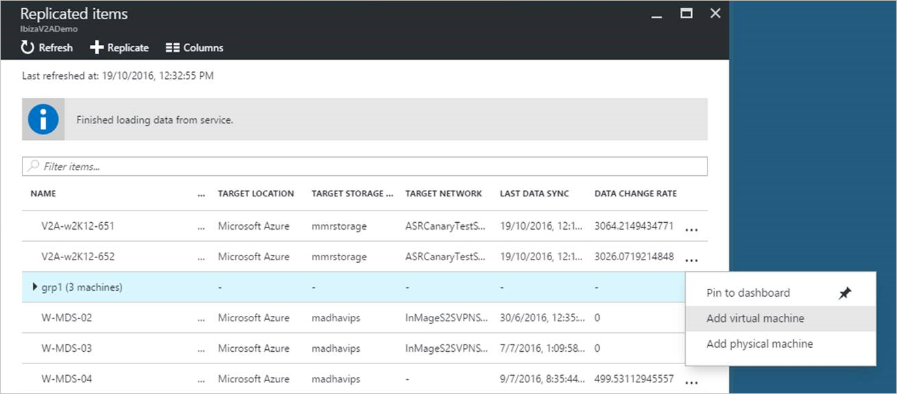

<properties
    pageTitle="Azure Website Wiederherstellung: Häufig gestellte Fragen | Microsoft Azure"
    description="In diesem Artikel werden häufige Fragen zur Azure-Website Wiederherstellung an."
    services="site-recovery"
    documentationCenter=""
    authors="rayne-wiselman"
    manager="cfreeman"
    editor=""/>

<tags
    ms.service="get-started-article"
    ms.devlang="na"
    ms.topic="article"
    ms.tgt_pltfrm="na"
    ms.workload="storage-backup-recovery"
    ms.date="10/10/2016"
    ms.author="raynew"/>

# Azure Website Wiederherstellung: Häufig gestellte Fragen (FAQ)

Dieser Artikel enthält häufig gestellte Fragen zur Azure-Website Wiederherstellung. Wenn Sie Fragen haben, nach dem in diesem Artikel lesen, veröffentlichen Sie diese im [Azure Wiederherstellung Services-Forum](https://social.msdn.microsoft.com/Forums/azure/home?forum=hypervrecovmgr).

## Allgemeine

### Welche Funktion hat die Website Wiederherstellung?

Website Wiederherstellung beiträgt zu Business Continuity und Disaster Wiederherstellung (BCDR) strategische, indem orchestriert und automatisierte Replikation aus lokalen virtuellen Computern und physischen Servern Azure oder einem sekundären Datencenter. [Erfahren Sie mehr](site-recovery-overview.md).

### Was kann Website Wiederherstellung schützen?

- **Hyper-V virtuellen Computern**: Website Wiederherstellung alle Arbeitsbelastung für einen virtuellen Hyper-V Computer ausgeführt schützen können.
- **Physische Server**: Website Wiederherstellung physische Server mit Windows oder Linux schützen können.
- **Virtuelle VMware-Computer**: Website Wiederherstellung alle in einer VMware VM ausgeführt Arbeitsbelastung schützen können.

### Unterstützt die Website Wiederherstellung Azure Ressourcenmanager Modell?

Zusätzlich zu der Website Wiederherstellung im klassischen Azure-Portal steht Website Wiederherstellung im Azure-Portal mit Unterstützung für Ressourcenmanager. Für die meisten Szenarien für die Bereitstellung Website Wiederherstellung in der Azure-Portal bietet eine optimierte Bereitstellung Erfahrung und Sie können virtuellen Computern und repliziert physische Server in der klassischen Speicher oder Ressourcenmanager Speicher. Hier sind die unterstützten Bereitstellungen aus:

- [Repliziert virtuelle VMware-Computer oder physischen Servern in Azure Azure-Portal](site-recovery-vmware-to-azure.md)
- [Repliziert Hyper-V virtuelle Computer in VMM Wolken in Azure Azure-Portal](site-recovery-vmm-to-azure.md)
- [Repliziert Hyper-V virtuellen Computern (ohne VMM) in Azure Azure-Portal](site-recovery-hyper-v-site-to-azure.md)
- [Repliziert Hyper-V virtuelle Computer in VMM Wolken an einem sekundären Standort Azure-Portal](site-recovery-vmm-to-vmm.md)

### Was muss kann ich in Hyper-V Replikation mit Website Wiederherstellung koordinieren?

Für die Hyper-V Hostserver hängt, benötigen Sie von der Bereitstellungsszenario. Die Hyper-V Vorkenntnisse in folgenden Artikeln:

- [Replikation von Hyper-V virtuellen Computern (ohne VMM) auf Azure](site-recovery-hyper-v-site-to-azure.md#before-you-start)
- [Replikation von Hyper-V virtueller Computer (mit VMM) auf Azure](site-recovery-vmm-to-azure.md#before-you-start)
- [Replikation von Hyper-V virtuelle Computer auf einem sekundären Datencenter](site-recovery-vmm-to-vmm.md#before-you-start)

- Wenn Sie zu einem sekundären Datencenter erfahren Sie mehr über [unterstützte Gast-Betriebssysteme für Hyper-V virtuelle Computer](https://technet.microsoft.com/library/mt126277.aspx)repliziert sind.
- Wenn Sie in Azure repliziert haben, unterstützt Website Wiederherstellung alle Gast-Betriebssysteme, der [von Azure unterstützt](https://technet.microsoft.com/library/cc794868%28v=ws.10%29.aspx)werden.

### Kann ich virtuelle Computer schützen, wenn Hyper-V auf einem Client-Betriebssystem ausgeführt wird?

Nein, müssen virtuellen Computern auf einem Hyper-V-Host-Server befinden, die auf einem unterstützten Windows Server ausgeführt wird. Wenn Sie einen Clientcomputer schützen müssen konnte Sie als physische Computer auf [Azure](site-recovery-vmware-to-azure.md) oder einer [sekundären Datacenter](site-recovery-vmware-to-vmware.md)repliziert werden.

### Welche Auslastung kann ich mit Website Wiederherstellung schützen?

Website Wiederherstellung können Sie die meisten Auslastung eines unterstützten virtuellen Computers oder die physischen Server ausgeführt schützen. Website Wiederherstellung unterstützt anwendungsspezifische Replikation, sodass apps in einer intelligenten Zustand wiederhergestellt werden können. Es bei Microsoft-Programmen wie SharePoint, Exchange, Dynamics, SQL Server und Active Directory integriert und arbeitet eng mit führenden Anbietern, einschließlich Oracle, SAP, IBM und Red Hat. [Erfahren Sie mehr](site-recovery-workload.md) über den Schutz von Arbeitsbelastung.

### Müssen Hyper-V-Hosts in VMM Wolken werden?

Wenn auf einem sekundären Datencenter, repliziert werden soll, und klicken Sie dann Hyper-V virtuelle Computer eingeschaltet sein muss hostet Hyper-V Server in eine VMM-Cloud. Wenn auf Azure repliziert werden soll, können Sie auf Hyper-V-Host-Server mit oder ohne VMM Wolken virtuellen Computern repliziert. [Weitere Informationen finden](site-recovery-hyper-v-site-to-azure.md).

### Kann ich Website Wiederherstellung mit VMM bereitstellen, wenn ich nur einen VMM-Server verfügen?

Ja. Virtuelle Computer können entweder in Hyper-V-Servern in der Cloud VMM in Azure repliziert oder können zwischen VMM Wolken auf demselben Server repliziert. Für lokal auf lokale Replikation empfehlen wir, dass Sie in der primären und sekundären Websites VMM-Server verfügen.  [Weitere Informationen](site-recovery-single-vmm.md)

### Welche physischen Servern kann ich schützen?

Sie können physische Server mit Windows und Linux Azure oder an einem sekundären Standort repliziert. [Erfahren Sie mehr über](site-recovery-vmware-to-azure.md#protected-machine-prerequisites) das Betriebssystem Anforderungen.  Die gleichen Vorschriften gelten, ob Sie physische Server Azure oder einem sekundären Standort repliziert sind.

Beachten Sie, dass physische Server als virtuellen Computern in Azure ausgeführt werden, wenn es sich bei Ihrem lokalen Server-fällt aus. Failback mit einer lokalen physischen Server wird derzeit nicht unterstützt, aber Sie können nicht wieder eine virtuellen Computern Hyper-V oder VMware ausgeführt.

### Welche VMware virtuellen Computern kann ich schützen?

Zum Schützen von VMware virtuellen Computern benötigen Sie ein vSphere Hypervisor und virtuellen Computern VMware Tools. Es empfiehlt sich auch, dass Sie einen VMware vCenter Server zum Verwalten der Hypervisors haben. [Erfahren Sie mehr](site-recovery-vmware-to-azure.md#protected-machine-prerequisites) über die genauen Anforderungen für die Replikation von VMware Server und virtuellen Computern Azure oder einem sekundären Standort.

### Kann ich für meine Verzweigung Büros mit Website Wiederherstellung Wiederherstellung verwalten?

Ja. Wenn Sie die Website Wiederherstellung um zu koordinieren von Replikation und Failover in Ihren Büros Zweig verwenden, erhalten Sie einen einheitlichen Orchestrierung und alle Zweig Office Auslastung Ansicht an einem zentralen Ort.. Sie können einfach Failovers ausführen und Wiederherstellung alle Verzweigungen in Ihre zentrale, ohne des Besuchs der Verzweigungen verwalten.

## Sicherheit

### Werden Replikationsdaten werden an der Website Wiederherstellung-Dienst gesendet?

Nein, Website Wiederherstellung nicht replizierte Daten abzufangen und verfügt nicht über alle Informationen, was auf Ihrem virtuellen Computern oder physische Server ausgeführt wird.
Replikation ist zwischen lokalen Hyper-V-Hosts, VMware-Hypervisoren oder physischen Servern und Azure-Speicher oder Ihrer Website sekundäre Datenaustausch. Website Wiederherstellung hat keine Möglichkeit, die Daten abzufangen. Nur die Metadaten, die zum Koordinieren von Replikation und Failover erforderlich sind, wird an den Website Wiederherstellung-Dienst gesendet.

Website Wiederherstellung ist ISO 27001:2013, 27018, HIPAA, DPA zertifiziert und gerade SOC2 und FedRAMP JAB Bewertung.

### Aus Gründen der Compliance muss auch unsere lokalen Metadaten innerhalb derselben geographischen Region bleiben. Kann Website Wiederherstellung uns?

Ja. Wenn Sie eine Website Wiederherstellung Tresor in einer Region erstellen, wir sicherstellen, dass alle Metadaten, die wir müssen aktivieren und koordinieren Replikation und Failover bleibt innerhalb der jeweiligen Region geografischen s Begrenzungslinie.

### Verschlüsselt Website Wiederherstellung Replikation?

Replikation zwischen lokalen Websites Verschlüsselung-in-Übertragung wird für virtuelle Computer und physische Server unterstützt. Für virtuelle Computer und physischen Servern auf Azure repliziert werden sowohl Verschlüsselung in-Übertragung und Verschlüsselung at Rest (in Azure) unterstützt.

## Replikation

### Gibt es für die Replikation von virtuellen Computern auf Azure Update erforderlich?

Virtuellen Computern auf Azure repliziert gewünschten sollten [Azure Anforderungen](site-recovery-best-practices.md#virtual-machines)entsprechen.

### Können Hyper-V Generation 2-virtuellen Computern in Azure werden repliziert?

Ja. Website Wiederherstellung, aus der zweiten Generation 2 zu Generation 1 während des Failovers konvertiert. Am Failback wird der Computer wieder in der zweiten Generation 2 konvertiert. [Weitere Informationen finden](http://azure.microsoft.com/blog/2015/04/28/disaster-recovery-to-azure-enhanced-and-were-listening/).

### Wenn ich auf Azure repliziert wie bezahlen ich für Azure-virtuellen Computern?

Während der regelmäßigen Replikation Daten an Geo redundante Azure-Speicher repliziert und müssen Sie keine IaaS Azure-virtuellen Computern-Gebühren bezahlen Bereitstellen einer erheblichen nutzen. Beim Ausführen eines Failovers in Azure Website Wiederherstellung erstellt automatisch IaaS Azure-virtuellen Computern und anschließend erhalten Sie Abrechnung für die Ressourcen berechnen, die Sie in Azure nutzen.

### Gibt es ein SDK kann ich mit den ASR-Workflow automatisieren?

Ja. Sie können die Wiederherstellung von Website-Workflows mithilfe der die Rest-API, PowerShell oder der Azure SDK automatisieren. Derzeit unterstützten Szenarien zur Bereitstellung von Website-Wiederherstellung mithilfe der PowerShell:

- [Hyper-V virtuellen Computern in VMMs Wolken auf Azure PowerShell klassischen repliziert](site-recovery-deploy-with-powershell.md)
- [Repliziert Hyper-V virtuellen Computern in VMMs Wolken zu Azure PowerShell-Ressourcenmanager](site-recovery-vmm-to-azure-powershell-resource-manager.md)
- [Hyper-V virtuelle Computer ohne VMM auf Azure PowerShell klassischen repliziert](site-recovery-hyper-v-site-to-azure-classic.md)
- [Repliziert Hyper-V virtuelle Computer ohne VMM Azure PowerShell Ressourcenmanager](site-recovery-deploy-with-powershell-resource-manager.md)

### Wenn ich auf Azure welche Art von Speicherkonto repliziert sind erforderlich?

- **Azure klassischen Portal**: Wenn Sie in der klassischen Azure-Portal Website Wiederherstellung bereitstellen, benötigen Sie ein [Speicherkonto standard Geo redundante](../storage/storage-redundancy.md#geo-redundant-storage). Premium Speicher wird derzeit nicht unterstützt. Das Konto muss sich in derselben Region als die Website Wiederherstellung Tresor.

- **Azure-Portal**: Wenn Sie Website Wiederherstellung Azure-Portal bereitstellen, benötigen Sie ein LRS oder GRS Speicher-Konto. Wir empfehlen GRS, so dass Daten ist flexibel, wenn ein regionalen Ausfall auftritt, oder die primäre Region nicht wiederhergestellt werden kann. Das Konto muss sich in derselben Region als der Wiederherstellung Services Tresor. Premium-Speicher wird nur unterstützt, wenn Sie virtuelle VMware-Computer oder physischen Servern repliziert sind.

### Wie oft können Daten werden repliziert?

- **Hyper-v** Hyper-V virtuellen Computern können alle 30 Sekunden, 5 Minuten oder 15 Minuten repliziert werden. Wenn Sie die SAN-Replikation eingerichtet haben, ist Replikation synchron.
- **VMware und physischen Servern:** Die Häufigkeit Replikation ist hier nicht relevant. Die Replikation ist fortlaufender.

### Kann ich die Replikation vom vorhandenen Wiederherstellung Website an einen anderen dritten Standort erweitern?

Erweiterte oder verkettete Replikation wird nicht unterstützt. Fordern Sie dieses Feature [Feedback](http://feedback.azure.com/forums/256299-site-recovery/suggestions/6097959-support-for-exisiting-extended-replication)-Forum.

### Kann ich eine offline Replikation beim ersten tun, die ich in Azure repliziert?

Dies wird nicht unterstützt. Fordern Sie dieses Feature im [Forum "Feedback"](http://feedback.azure.com/forums/256299-site-recovery/suggestions/6227386-support-for-offline-replication-data-transfer-from)ein.

### Können bestimmte Datenträger von der Replikation werden ausgeschlossen?

Dies wird unterstützt, wenn Sie in Azure sind, über das Azure-Portal [Replikation VMware virtuellen Computern und physische Server](site-recovery-vmware-to-azure.md#exclude-disks-from-replication) .

### Können virtuellen Computern mit dynamischen Festplatten werden repliziert?

Dynamische Datenträger werden unterstützt, wenn Hyper-V-virtuellen Computern repliziert. Sie werden auch unterstützt, wenn VMware virtuellen Computern und physische Computer in Azure repliziert. Der Datenträger Betriebssystem muss einen einfachen Datenträger.

### Kann ich einen neuen Computer zu einer vorhandenen Replikationsgruppe hinzufügen?

Hinzufügen von neuen Computern vorhandenen Replikation Gruppen wird unterstützt. Dazu wählen Sie die Replikationsgruppe (aus "Repliziert Objekte" Blade) und Kontextmenü in der Replikationsgruppe klicken Sie mit der rechten Maustaste auf/auswählen, und wählen Sie die entsprechende Option aus.

### Kann ich die Bandbreite, die für Hyper-V Replikationsdatenverkehr vorgesehene einschränken?

Ja. Weitere Informationen zum Einschränken der Bandbreite in den Artikeln Bereitstellung:

- [Planen der Replikation VMware virtuellen Computern und physischen Servern Kapazität](site-recovery-vmware-to-azure.md#step-5-capacity-planning)
- [Kapazität, Planung für die Replikation von Hyper-V virtuelle Computer in VMM Wolken](site-recovery-vmm-to-azure.md#step-5-capacity-planning)
- [Planen für die Replikation von Hyper-V virtuelle Computer ohne VMM Kapazität](site-recovery-hyper-v-site-to-azure.md#step-5-capacity-planning)

## Failover

### Wenn ich eine weiß über in Azure nicht Versuche, wie greife ich auf den Azure-virtuellen Computern nach Failover?

Sie können die Azure-virtuellen Computern über eine sichere Verbindung zum Internet, über ein VPN zwischen Standorten oder über Azure ExpressRoute zugreifen. Sie müssen eine Anzahl von Elementen und herstellen vorbereiten. Weitere Informationen finden Sie in:

- [Verbinden Sie mit Azure-virtuellen Computern nach Failover virtuelle VMware-Computer oder physische Server](hsite-recovery-vmware-to-azure.md#step-7-test-the-deployment)
- [Verbinden Sie mit Azure-virtuellen Computern nach Failover von Hyper-V virtuelle Computer in VMM Wolken](site-recovery-vmm-to-azure.md#step-7-test-your-deployment)
- [Verbinden Sie mit Azure-virtuellen Computern nach Failover von Hyper-V virtuelle Computer ohne VMM](site-recovery-hyper-v-site-to-azure.md#step-7-test-the-deployment)

### Wenn ich über in Azure nicht wie Azure sicherzustellen, sind meine Daten flexibel?

Azure ist Stabilität ausgelegt. Website Wiederherstellung ist bereits für Failover zu einem sekundären Azure Datencenter, gemäß der Vereinbarung zum SERVICELEVEL Azure ausgelegt, falls dies erforderlich ist. In diesem Fall wir Vergewissern Sie sich Ihre Metadaten und Depots bleiben innerhalb der gleichen geografischen Region, die Sie für den Tresor ignoriert.  

### Wenn ich zwischen zwei Datencenter was passiert repliziert bin, wenn mein primären Datencenter ein unerwarteten Ausfall auftritt?

Sie können ein ungeplantes Failover vom sekundären Standort ausgelöst wurde. Website Wiederherstellung benötigen nicht Connectivity vom primären Standort zum Ausführen des Failovers.

### Ist Failover automatische?

Failover nicht automatisch. Sie Failovers mit Klick im Portal initiieren, oder Sie können [Website Wiederherstellung PowerShell](https://msdn.microsoft.com/library/dn850420.aspx) verwenden, um ein Failover auslösen. Weiß nicht wieder ist eine einfache Aktion im Portal Wiederherstellung Website.

Um Sie automatisieren konnte verwenden Sie lokale Orchestrator oder Operations Manager erkennen, einen Fehler virtuellen Computern und dem Auslösen System durch die Verwendung von SDK.

- [Weitere Informationen finden Sie](site-recovery-create-recovery-plans.md) über Wiederherstellung Pläne.
- [Weitere Informationen finden Sie](site-recovery-failover.md) Informationen zum Failover.
- [Weitere Informationen finden Sie](site-recovery-failback-azure-to-vmware.md) Informationen zu fehlerhaften sichern VMware virtuellen Computern und physische Server

## Dienstanbieter

### Ich bin ein Dienstanbieter. Funktioniert die Website Wiederherstellung für Infrastruktur dedizierten und freigegebene Modelle?

Ja, unterstützt Website Wiederherstellung beide Modelle dedizierten und freigegebenen Infrastruktur.

### Für einen Dienstanbieter ist die Identität des Meine Mandanten, für die Website Wiederherstellung Dienst freigegeben?

Nein. Mandanten Identität bleibt anonyme. Zugriff auf das Portal Website Wiederherstellung erforderlich Ihrer Mandanten nicht. Nur die Dienstadministrator Anbieter interagiert mit dem Portal.

### Wechselt Mandanten Anwendungsdaten jemals zu Azure?

Wenn zwischen Service Provider im Besitz Websites repliziert werden, wechselt Anwendungsdaten nie in Azure. Daten werden in Übertragung und direkt zwischen den Dienst Anbieter-Websites repliziert verschlüsselt werden.

Wenn Sie in Azure repliziert sind, werden Anwendungsdaten zu Azure-Speicher jedoch nicht in der Website Wiederherstellung-Dienst gesendet. Daten werden von verschlüsselten Übertragung, und bleibt in Azure verschlüsselt.

### Werden meine Mandanten eine Rechnung für Azure Dienste erhalten?

Nein. Abrechnung des Azure-Beziehung ist direkt mit dem Dienstanbieter. Dienstanbieter sind für das Generieren von bestimmter Rechnung für ihren Mandanten verantwortlich.

### Wenn ich die Replikation auf Azure Versuche, benötigen wir auf virtuellen Computern Azure jederzeit ausgeführt werden?

Nein, werden die Daten mit einer Firma Azure-Speicher im Rahmen Ihres Abonnements repliziert. Wenn Sie ein Test-Failover (DR Drillup) oder eine tatsächliche Failover durchführen, erstellt Website Wiederherstellung virtuellen Computern automatisch in Ihrem Abonnement.

### Sicherstellen Sie Mandanten Ebene Isolation, wenn ich auf Azure repliziert?

Ja.

### Welche Plattformen unterstützen Sie aktuell?

Wir unterstützen Azure Pack, Cloud-Plattform-System, und System Center Grundlage (2012 und höhere) Bereitstellungen. [Weitere](https://technet.microsoft.com/library/dn850370.aspx) Informationen zur Integration von Azure Pack & Website Wiederherstellung.

### Unterstützen Sie einzelne Azure Pack und einzelnen VMM Server Bereitstellungen?

Ja, können Sie Hyper-V-virtuellen Computern auf Azure repliziert oder zwischen Service Provider Websites repliziert.  Beachten Sie, dass wenn zwischen Service Provider Websites repliziert, Azure Runbooks Integration nicht verfügbar ist.

## Nächste Schritte

- Lesen Sie die [Website Wiederherstellung (Übersicht)](site-recovery-overview.md)
- Erfahren Sie mehr über die [Website Wiederherstellung Architektur](site-recovery-components.md)  
