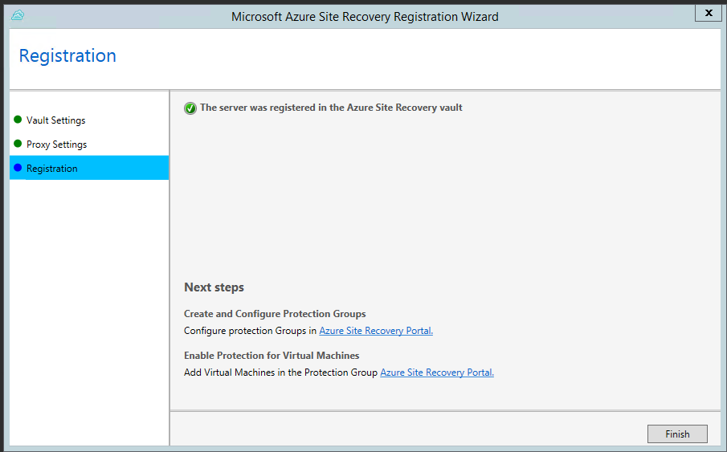

<properties
    pageTitle="Replikation zwischen lokalen Hyper-V-virtuellen Computern und Azure (ohne VMM) mit Website Wiederherstellung | Microsoft Azure"
    description="Dieser Artikel beschreibt, wie Hyper-V-virtuellen Computern in Azure mit Azure Website Wiederherstellung repliziert werden, wenn der Computer in VMM Wolken verwaltet werden nicht."
    services="site-recovery"
    documentationCenter=""
    authors="rayne-wiselman"
    manager="jwhit"
    editor=""/>

<tags
    ms.service="site-recovery"
    ms.devlang="na"
    ms.topic="article"
    ms.tgt_pltfrm="na"
    ms.workload="storage-backup-recovery"
    ms.date="09/19/2016"
    ms.author="raynew"/>

# Replikation zwischen lokalen Hyper-V-virtuellen Computern und Azure (ohne VMM) mit Azure Website Wiederherstellung

> [AZURE.SELECTOR]
- [Azure-Portal](site-recovery-hyper-v-site-to-azure.md)
- [PowerShell - Ressourcenmanager](site-recovery-deploy-with-powershell-resource-manager.md)
- [Klassische-Portal](site-recovery-hyper-v-site-to-azure-classic.md)

Lesen Sie diesen Artikel, um Informationen zum Bereitstellen von Website-Wiederherstellung, um-Replikation Hyper-V-virtuellen Computern auf Azure bei Hyper-V-Hosts in System Center virtuellen Computern Manager (VMM) Wolken verwaltet werden nicht an.

Im Artikel enthält eine Übersicht über die Bereitstellung erforderlichen Komponenten, hilft Ihnen bei Replikation Einstellungen konfigurieren, und Aktivieren des Schutzes für virtuelle Computer. Es wird beendet, indem testen Failover, um sicherzustellen, dass alles wie erwartet funktioniert.

Nach dem Lesen Kommentare oder Fragen auf das [Azure Wiederherstellung Services-Forum](https://social.msdn.microsoft.com/forums/azure/home?forum=hypervrecovmgr)oder unten in diesem Artikel.

## (Übersicht)

Organisationen benötigen eine Strategie Business Continuity- und Disaster Wiederherstellung (BCDR), die eine bestimmt, wie apps, Auslastung und Daten bleiben während der geplanten und ungeplanten Ausfallzeiten ausgeführt werden und verfügbar, und zum normalen Arbeit Umständen so früh wie möglich wiederherzustellen. Ihre BCDR Strategie im Mittelpunkt der Lösungen, die bei einem bei Datenverlusten Geschäftsdaten sicherer und wiederhergestellt, und Auslastung kontinuierlich verfügbar bleiben.

Website Wiederherstellung ist eine Azure-Dienst, der zur strategische BCDR beiträgt, durch die Replikation von physische Server lokal und in der Cloud (Azure) oder in einem sekundären Datencenter-virtuellen Computern orchestriert. Treten Ausfall in gewohnten Standort befinden, fehl Sie über den sekundären Standort zum Aktualisieren von apps und Auslastung zur Verfügung. Sie fehl zurück zur gewohnten Standort befinden, wenn sie normale Vorgänge zurückgibt.

Website Wiederherstellung in eine Reihe von Szenarios verwendet werden kann, und kann eine Reihe von Auslastung schützen. Erfahren Sie mehr in [Neuigkeiten Azure Website Wiederherstellung?](site-recovery-overview.md).

## Azure erforderliche Komponenten

- Benötigen Sie ein [Microsoft Azure](https://azure.microsoft.com/) -Konto ein. Sie können mit einer [kostenlosen Testversion](https://azure.microsoft.com/pricing/free-trial/)beginnen.
- Sie benötigen ein Konto Azure-Speicher replizierte Daten gespeichert. Das Konto benötigt Geo-Replikation aktiviert. Es sollte in derselben Region als der Azure-Website Wiederherstellung Tresor und mit dem gleichen Abonnement verknüpft werden. [Weitere Informationen zum Azure-Speicher](../storage/storage-introduction.md). Beachten Sie, dass wir nicht verschieben Speicherkonten erstellt die [neue Azure-Portal](../storage/storage-create-storage-account.md) über Ressourcengruppen unterstützen.
- Sie benötigen ein Azure-virtuelles Netzwerk, damit Azure-virtuellen Computern mit einem Netzwerk verbunden sein wird, wenn Sie von Ihrem primären Standort über fehl.

## Voraussetzungen für die Hyper-V

- In der Quellwebsite lokalen benötigen Sie eine **Windows Server 2012 R2** -Servern mit der Hyper-V-Rolle installiert oder **Microsoft Hyper-V Server 2012 R2**. Dieser Server sollte wie folgt:
- Enthalten Sie einen oder mehrere virtuelle Computer an.
- Werden mit dem Internet verbunden Sie direkt oder über einen Proxy.
- Ausführen der Updates, die in KB [2961977](https://support.microsoft.com/en-us/kb/2961977 "KB2961977")beschrieben.

## Voraussetzungen für die virtuellen Computern

Virtuellen Computern, die Sie schützen möchten, sollte mit [Azure-virtuellen Computern Anforderungen](site-recovery-best-practices.md#azure-virtual-machine-requirements)entsprechen.

## Anbieter und Agent erforderliche Komponenten

Als Teil der Bereitstellung der Azure-Website Wiederherstellung installieren Sie den Azure-Anbieter für Websites Wiederherstellung und der Azure-Agent Wiederherstellung Services auf jedem Hyper-V-Server. Beachten Sie Folgendes:

- Wir empfehlen Ihnen immer die neuesten Versionen der Anbieter und Agent ausführen. Diese stehen im Portal Website Wiederherstellung.
- Alle Hyper-V-Servern in einem Tresor sollte die gleichen Versionen der Anbieter und Agent haben.
- Der Anbieter auf dem Server ausgeführt, die mit Website Wiederherstellung über das Internet verbunden werden. Sie können dafür ohne einen Proxy, die aktuell auf dem Server Hyper-V konfigurierten Proxyeinstellungen oder benutzerdefinierte Proxyeinstellungen, die Sie während der Installation Anbieter konfigurieren. Sie müssen, um sicherzustellen, dass der Proxyserver, die, den Sie verwenden möchten, diese URLs für das Herstellen einer Verbindung mit Azure zugreifen kann:
    - *. hypervrecoverymanager.windowsazure.com
    - *. accesscontrol.windows.net
    - *. backup.windowsazure.com     
    - *. blob.core.windows.net
    - *. store.core.windows.net

- Darüber hinaus können Sie die IP-Adressen (443) [Azure Datacenter IP-Bereiche](https://www.microsoft.com/download/details.aspx?id=41653) und HTTPS-Protokoll beschrieben. Weiß-Liste IP-Bereiche des Azure Region, das Sie verwenden möchten und mit Westen US müssten.

Diese Grafik zeigt die verschiedenen Kommunikationskanäle und Wiederherstellung Website für die Orchestrierung und Replikation verwendeten ports

## Schritt 1: Erstellen einer Tresor

1. Melden Sie sich bei dem [Verwaltungsportal](https://portal.azure.com).

2. Erweitern Sie **Data Services** > **Wiederherstellung Services** , und klicken Sie auf **Website Wiederherstellung Tresor**.

3. Klicken Sie auf **neu erstellen** > **schnell zu erstellen**.

4. Geben Sie im Feld **Name**einen Anzeigenamen ein, um den Tresor zu identifizieren.

5. Wählen Sie in der **Region**das geografische Region für den Tresor ein. Zum Überprüfen der unterstützte Regionen finden Sie unter geografischen Verfügbarkeit in [Azure Website Wiederherstellung Preise Details](https://azure.microsoft.com/pricing/details/site-recovery/).

6. Klicken Sie auf **Erstellen Tresor**.

    

Überprüfen Sie die Statusleiste, um zu bestätigen, dass der Tresor erfolgreich erstellt wurde. Der Tresor werden auf der Wiederherstellung Services-Hauptseite als **aktiv** aufgelistet.

## Schritt 2: Erstellen einer Website Hyper-V

1. Klicken Sie auf den Tresor, um die Seite Schnellstart öffnen, auf der Seite Wiederherstellung Services. Schnellstart kann auch jederzeit auf das Symbol geöffnet werden.

    

2. Wählen Sie in der Dropdown-Liste **zwischen einer lokalen Hyper-V-Website und Azure**.

    

3. Klicken Sie **Erstellen einer Website Hyper-V** **Erstellen von Hyper-V-Website**. Geben Sie einen Websitenamen, und speichern.

    

## Schritt 3: Installieren Sie den Anbieter und agent
Installieren Sie den Anbieter und Agent auf jedem Hyper-V-Server, die virtuellen Computern enthält Sie schützen möchten.

Bei der Installation auf einem Hyper-V-Cluster sind, führt die Schritte 5 bis 11 auf den einzelnen Knoten im Failovercluster aus. Nachdem alle Knoten registriert sind, und Schutz aktiviert ist, wird virtuellen Computern geschützt werden, auch wenn sie über den Knoten im Cluster migrieren.

1. **Vorbereiten von Hyper-V-Servern**klicken Sie auf **einen Registrierungsschlüssel herunterladen** der Datei.
2. Klicken Sie auf **Download** neben der Website, auf der Seite **Registrierungsschlüssel herunterladen** . Laden Sie die Taste auf einem sicheren Ort, der vom Server Hyper-V problemlos zugegriffen werden kann. Der Schlüssel ist gültig für 5 Tage, nachdem er generiert wird.

    

4. Klicken Sie auf **den Anbieter herunterladen** , um die neueste Version zu erhalten.
5. Führen Sie die Datei auf jedem Hyper-V-Server, die Sie im Tresor erfassen möchten. Die Datei installiert zwei Komponenten:
    - **Anbieter für Azure Websites Wiederherstellung**– Kommunikation und Orchestrierung zwischen dem Hyper-V-Server und im Portal Azure Website Wiederherstellung behandelt.
    - **Azure Wiederherstellung Services-Agent**– Datenübertragung zwischen virtuellen Computern ausgeführt werden, klicken Sie auf die Hyper-V Quellserver und Azure-Speicher behandelt.
6. In **Microsoft Update** können Sie nach Updates suchen in optional. Mit dieser Einstellung aktiviert ist, werden entsprechend Ihrer Microsoft Update-Richtlinie Anbieter und Agent-Updates installiert.

    

7. Geben Sie in der **Installation** , in den Anbieter als auch Agent auf dem Server Hyper-V installiert werden soll.

    

8. Nach Abschluss der Installation weiterhin einrichten, um den Server im Tresor registrieren.

9. Klicken Sie auf **Durchsuchen** , um die Datei auszuwählen, klicken Sie auf der Einstellungsseite **Tresor** . Geben Sie das Abonnement Azure Website Wiederherstellung, den Namen Tresor und der Hyper-V-Website zu der der Hyper-V Server gehört.

    

10. Klicken Sie auf der Seite **Internet-Verbindung** Geben Sie an, wie der Anbieter und Azure-Website Wiederherstellung besteht. Wählen Sie **Standard-Systemproxyeinstellungen verwenden** , um die Internet-Verbindung Standardeinstellungen so konfiguriert, dass auf dem Server verwenden. Wenn Sie keinen Wert angeben, werden die Standardeinstellungen verwendet werden.

    

11. Registrierungsinformationen startet den Server im Tresor registrieren.

    

11. Nach Abschluss der Registrierung Metadaten von der Hyper-V Server durch Azure Website Wiederherstellung abgerufen wird und der Server ist auf der Registerkarte **Hyper-V-Websites** auf der Seite **Server** im Tresor angezeigt.

### Installieren Sie den Anbieter über die Befehlszeile

Alternativ können Sie den Azure-Anbieter für Websites Wiederherstellung über die Befehlszeile installieren. Verwenden Sie diese Methode, wenn Sie den Anbieter auf einem Computer unter Windows Server Core 2012 R2 installieren möchten. Führen Sie über die Befehlszeile wie folgt aus:

1. Laden Sie den Anbieter Datei- und Registrierungsinformationen Key in einen Ordner aus. Beispielsweise C:\ASR.
2. Führen Sie ein Eingabeaufforderungsfenster als Administrator an, und geben:

        C:\Windows\System32> CD C:\ASR
        C:\ASR> AzureSiteRecoveryProvider.exe /x:. /q

3. Dann installieren Sie den Anbieter, indem Sie ausführen:

        C:\ASR> setupdr.exe /i

4. Führen Sie vor, um die Anmeldung abzuschließen:

        CD C:\Program Files\Microsoft Azure Site Recovery Provider
        C:\Program Files\Microsoft Azure Site Recovery Provider\> DRConfigurator.exe /r  /Friendlyname <friendly name of the server> /Credentials <path of the credentials file> /EncryptionEnabled <full file name to save the encryption certificate>         

Wo Parametern gehören:

- **/Credentials**: Geben Sie den Speicherort der der Registrierungsschlüssel, die Sie heruntergeladen haben.
- **/FriendlyName**: Geben Sie einen Namen zum Identifizieren des Hyper-V-Host-Servers. Dieser Name wird im Portal angezeigt.
- **/EncryptionEnabled**: optional. Geben Sie an, ob Sie Replikat virtuellen Computern in Azure (bei Rest Verschlüsselung) verschlüsseln möchten.
- **/proxyAddress**; **/proxyport**; **/proxyUsername**; **/proxyPassword**: optional. Geben Sie Proxyparameter, wenn Sie einen benutzerdefinierten Proxy verwenden möchten, oder Ihr vorhandenen Proxy-Server erfordert Authentifizierung eine.

## Schritt 4: Erstellen Sie ein Konto Azure-Speicher

1. Wählen Sie **Vorbereiten Ressourcen** **Speicher-Konto erstellen** , um ein Konto Azure-Speicher zu erstellen, wenn Sie eine besitzen. Das Konto sollte Geo-Replikation aktiviert haben. Es sollte in derselben Region als der Azure-Website Wiederherstellung Tresor werden, und mit dem gleichen Abonnement verknüpft werden.

    

>[AZURE.NOTE] 1 wir unterstützen keine Speicher Kontotypen erstellt die [neue Azure-Portal](../storage/storage-create-storage-account.md) über Ressourcengruppen verschieben.                               2. [Migration von Speicherkonten](../resource-group-move-resources.md) zwischen Ressourcengruppen innerhalb des gleichen Abonnements oder übergreifend Abonnements wird Speicherkonten für die Bereitstellung von Website-Wiederherstellung nicht unterstützt.

## Schritt 5: Erstellen und Konfigurieren von Schutzgruppen

Schutzgruppen stellen eine Gruppierung von virtuellen Computern, die Sie mit den gleichen Schutz Einstellungen schützen möchten. Sie Schutz Einstellungen zu einer Schutzgruppe anwenden, und diese Einstellungen werden angewendet, um alle virtuellen Computern, die Sie zur Gruppe hinzufügen aus.

1. In **Erstellen und Konfigurieren von Schutzgruppen** klicken Sie auf **Erstellen einer Gruppe "Schutz"**. Wenn Sie alle erforderlichen Komponenten angeordnet werden nicht wird eine Meldung ausgegeben, und Sie können auf **Details anzeigen** für Weitere Informationen.

2. Fügen Sie einer Gruppe "Schutz" auf der Registerkarte **Schutzgruppen** hinzu. Geben Sie einen Namen, der Quellwebsite Hyper-V, das Ziel **Azure**, den Namen Ihres Abonnements Azure Website Wiederherstellung und das Konto Azure-Speicher.

    

2. Legen Sie **Replikation Einstellungen** der **Häufigkeit kopieren** um anzugeben, wie oft das Daten Delta zwischen der Quell- und Zielwebsites synchronisiert werden sollen. Sie können 30 Sekunden und 5 Minuten oder 15 Minuten festlegen.
3. Geben Sie in **beibehalten Wiederherstellung Punkt** an, wie viele Stunden Wiederherstellung Unterhaltungsverlauf gespeichert werden soll.
4. In **der Anwendung konsistent Momentaufnahmen Häufigkeit** können Sie angeben, ob zum Aufzeichnen von Momentaufnahmen, die Lautstärke Schatten Copy Service (VSS) verwenden, um sicherzustellen, dass die Programme in einem konsistenten Zustand sind, wenn die Momentaufnahme aufgezeichnet wird. Standardmäßig werden nicht diese geöffnet. Stellen Sie sicher, dass dieser Wert, der kleiner als die Anzahl von Wiederherstellungspunkten zusätzliche festgelegt ist, die Sie konfigurieren. Dies wird nur unterstützt, wenn die virtuellen Computern auf einem Windows-Betriebssystem ausgeführt wird.
5. Geben Sie **Initiale Replikation Startzeit** beim ersten Replikation von virtuellen Computern in der Gruppe "Schutz" an Azure gesendet werden soll.

    

## Schritt 6: Aktivieren des Schutzes von virtuellen Computern

Hinzufügen von virtuellen Computern zu einer Gruppe "Schutz" Schutz für diese zu aktivieren.

>[AZURE.NOTE] Schützen von virtuellen Computern mit Linux und eine statische IP-Adresse wird nicht unterstützt.

1. Klicken Sie auf der Registerkarte **Rechner** für die Gruppe "Schutz" auf** Add virtuellen Computern Schutz Gruppen Schutz aktivieren**.
2. Wählen Sie auf der Seite **Virtuellen Computern Schutz aktivieren** den virtuellen Computern, die Sie schützen möchten.

    

    Die Einzelvorgänge aktivieren Schutz beginnt. Sie können auf der Registerkarte **Aufträge** überwachen. Nachdem das Projekt Schutz Fertigstellen ausgeführt wird ist des virtuellen Computers Failoververarbeitung bereit.
3. Nach dem Schutz ist richten Sie können:

    - Anzeigen von virtuellen Computern auf **Geschützte Elemente** > **Schutzgruppen** > *Protectiongroup_name* > **virtuellen Computern** , die Sie auf Computer Details in der Registerkarte **Eigenschaften Drilldowns können** ...
    - Konfigurieren Sie die Failover-Eigenschaften für eine virtuelle Computer **Geschützte**Elemente > **Schutzgruppen** > *Protectiongroup_name* > **virtuellen Computern** *Virtual_machine_name* > **Konfigurieren**. Sie können konfigurieren:
        - **Name**: der Name des virtuellen Computers in Azure.
        - **Größe**: die Zielgröße des virtuellen Computers, die bei einem Ausfall.

        
    - Konfigurieren von Einstellungen des zusätzlichen virtuellen Computers *Geschützte*Elemente* > **Schutzgruppen** > *Protectiongroup_name* > **virtuellen Computern* * *Virtual_machine_name* > **Konfigurieren**, einschließlich:

        - **Netzwerkadapter**: die Anzahl der Netzwerkadapter wird durch die Größe, die Sie, für die Ziel-virtuellen Computern angeben vorgegeben. Aktivieren von [virtuellen Computern Größe Spezifikationen](../virtual-machines/virtual-machines-linux-sizes.md#size-tables) für die Anzahl der Nics, indem Sie die Größe des virtuellen Computers unterstützt.

            Beim Ändern der Größe eines virtuellen Computers und speichern die Einstellungen, wird die Anzahl der Netzwerkadapter ändern, wenn Sie die Seite **Konfigurieren** das nächste Mal öffnen. Die Anzahl der Netzwerkadapter Ziel virtueller Computer ist mindestens die Anzahl der Netzwerkadapter auf Quelle virtuellen Computern und die maximale Anzahl von Netzwerkadapter unterstützt, indem Sie die Größe des virtuellen Computers ausgewählt. Es werden nachstehend erklärt:

            - Wenn die Anzahl der Netzwerkadapter auf dem Quellcomputer kleiner oder gleich der Anzahl der Netzwerkadapter für die Größe des Target Computer zulässig ist, wird das Ziel als Quelle die gleiche Anzahl von Netzwerkadapter verfügbar.
            - Wenn die Anzahl der Netzwerkadapter für die Quelle virtuellen Computern die Höchstzahl überschreitet für die Zielgröße und dann das Ziel Größe Maximum verwendet werden soll.
            - Wenn beispielsweise ein Datenquelle Computer verfügt über zwei Netzwerkadapter und die Größe des Computers Target unterstützt vier, der Ziel-Computer werden zwei Netzwerkadapter haben. Wenn der Quellcomputer zwei Netzwerkadapter weist, aber die Größe der unterstützten Ziel nur einen unterstützt haben der Ziel-Computer nur einen Netzwerkadapter.     
        - **Azure Netzwerk**: Geben Sie im Netzwerk zu dem des virtuellen Computers über ausführen soll. Wenn die virtuellen Computern sind mehrere Netzwerkadapter, die alle Netzwerkadapter sollten mit im selben Azure-Netzwerk verbunden sind.
        - **Subnetz** Wählen Sie für jeden Netzwerkadapter des virtuellen Computers das Subnetz im Azure Netzwerk, das mit der Computer nach Failover verbunden sollte, ein.
        - **Ziel-IP-Adresse**: Wenn der Netzwerkadapter Quelle virtuellen Computers so konfiguriert ist, verwenden Sie statische IP-Adresse, und Sie können angeben, dass die IP-Adresse des virtuellen Computers Ziel, um sicherzustellen, dass der Computer die IP-Adresse nach Failover hat.  Wenn Sie nicht, dass eine IP-Adresse angeben wird eine verfügbare Adresse zum Zeitpunkt der Failover zugewiesen. Wenn Sie eine Adresse angeben, die verwendet wird, schlägt Failover fehl.

        > [AZURE.NOTE] [Migration von Netzwerken](../resource-group-move-resources.md) zwischen Ressourcengruppen innerhalb des gleichen Abonnements oder übergreifend Abonnements wird Netzwerke für die Website Wiederherstellung nicht unterstützt.

        

## Schritt 7: Erstellen eines Wiederherstellungsplans

Um festzustellen, ob die Bereitstellung können Sie einen Test-Failover für einen einzelnen virtuellen Computern oder eines Plans für die Wiederherstellung, das eine oder mehrere virtuelle Computer enthält ausführen. [Weitere](site-recovery-create-recovery-plans.md) Informationen zum Erstellen einer Wiederherstellungsdatei planen.

## Schritt 8: Testen der Bereitstellung

Es gibt zwei Methoden zum Ausführen eines Failovers Test in Azure.

- **Testen des Failoververhaltens ohne ein Azure-Netzwerk**– diese Art von Test Failover überprüft, dass die virtuellen Computern ordnungsgemäß in Azure auftauchen. Des virtuellen Computers wird nicht nach einem Failover mit einem beliebigen Azure Netzwerk verbunden sein.
- **Testen des Failoververhaltens mit einer Azure Netzwerk**– diese Art von Failover überprüft, dass die gesamte Replikation Umgebung bis erwartungsgemäß stammt und, die nicht über den virtuellen Computern auf das angegebene Ziel Azure Netzwerk verbunden. Beachten Sie, dass Failoververarbeitung Test im Subnetz des virtuellen Testcomputers fest sein wird, basierend auf dem Subnetz des Replikat virtuellen Computers. Dies ist anderen normale Replikation, wenn das Subnetz eines Replikat virtuellen Computers auf dem Subnetz des virtuellen Quellcomputers basiert.

Wenn Sie einen Test-Failover ohne Angabe eines Azure Netzwerk ausführen möchten brauchen Sie nichts vorbereiten.

Einen Test-Failover mit einem Ziel Azure Netzwerk ausführen müssen Sie ein neues Azure Netzwerk, das isoliert wurde aus Ihrem Netzwerk Azure Herstellung (Standardverhalten beim Erstellen eines neuen Netzwerks in Azure) erstellen. Lesen Sie weitere Details [ein Failovers Test ausgeführt](site-recovery-failover.md#run-a-test-failover) .

Um Ihre Bereitstellung Replikation und Netzwerk vollständig testen müssen Sie die Infrastruktur so einrichten, dass die repliziert virtuellen Computern entwickelt als erwartet. Eine Möglichkeit hierzu zum Einrichten eines virtuellen Computers als Domänencontroller mit DNS und auf Azure verwenden Website Wiederherstellung, um es im Testnetzwerk zu erstellen, indem Sie einen Failover Test ausgeführt repliziert werden.  [Weitere Informationen finden Sie](site-recovery-active-directory.md#considerations-for-test-failover) über Test Failover Hinweise für Active Directory.

Führen Sie das Test-Failover wie folgt aus:

>[AZURE.NOTE] Um die Leistung zu verbessern, wenn Sie einen Failover Azure Aufgaben, stellen Sie sicher, dass Sie der Azure-Agent in der geschützten Computer installiert haben. Dies kann in schneller starten und auch bei Problemen Diagnose. Linux-Agent werden kann, gefundenen [hier](https://github.com/Azure/WALinuxAgent) - und Windows Agent finden Sie [hier](http://go.microsoft.com/fwlink/?LinkID=394789)

1. Klicken Sie auf der Registerkarte **Wiederherstellung Pläne** wählen Sie den Plan aus, und klicken Sie auf **Failover testen**.
2. Wählen Sie auf der Seite **Bestätigen Test Failover** **keine** oder ein bestimmtes Azure Netzwerk aus.  Beachten Sie, dass bei Auswahl von **keine** Test-Failover werden überprüfen Sie, ob des virtuellen Computers auf Azure ordnungsgemäß repliziert, aber nicht die Replikation Netzwerkkonfiguration überprüfen.

    

3. Klicken Sie auf der Registerkarte **Aufträge** können Sie Failover überwachen. Sie sollten auch das virtuellen Computern Test Replikat Azure-Portal finden Sie unter sein. Wenn Sie von Ihrem lokalen Netzwerk festlegen auf Access-virtuellen Computern sind, können Sie eine Remotedesktop-Verbindung mit den virtuellen Computern initiieren.
4. Wenn das Failover **abgeschlossen testen** einer Phase erreicht, klicken Sie auf **Vollständige testen** , um das Test-Failover fertig zu stellen. Sie können einen Drilldown durchführen, klicken Sie auf der Registerkarte **Projekt** Failover Fortschritt und Status nachzuverfolgen, und alle Aktionen ausführen, die erforderlich sind.
5. Nach dem Failover werden Sie kann das virtuellen Computern Test Replikat Azure-Portal zu sehen sein. Wenn Sie von Ihrem lokalen Netzwerk festlegen auf Access-virtuellen Computern sind, können Sie eine Remotedesktop-Verbindung mit den virtuellen Computern initiieren.

    1. Stellen Sie sicher, dass die virtuellen Computer erfolgreich starten.
    2. Wenn Sie die Verbindung des virtuellen Computers in Azure mithilfe von Remotedesktop nach dem Failover möchten, aktivieren Sie Remote Desktop-Verbindung des virtuellen Computers vor dem Ausführen des Failovers testen. Sie müssen außerdem einen RDP Endpunkt des virtuellen Computers hinzufügen. Sie können eine [Azure Automatisierung Runbooks](site-recovery-runbook-automation.md) dazu nutzen.
    3. Nach dem Failover sicherzustellen, wenn Sie eine öffentliche IP-Adresse verwenden, um die Verbindung des virtuellen Computers in Azure mithilfe von Remotedesktop, verfügen Sie möglicherweise keine Domänenrichtlinien, die verhindern, dass Sie eine Verbindung zu einer virtuellen Computern mithilfe einer öffentlichen Adresse.

6. Nach Abschluss der Tests folgendermaßen Sie vor:

    - Klicken Sie auf **das Failover Test abgeschlossen ist**. Bereinigen Sie die testumgebung automatisch schalten aus, und löschen den Test virtuellen Computern.
    - Klicken Sie auf **Notizen** aufzeichnen und Speichern einer beliebigen Beobachtungen des Failovers Test zugeordnet.
7. Wenn das Failover erreicht die Phase **abgeschlossen testen** Fertig stellen die Überprüfung wie folgt:
    1. Anzeigen des Replikat virtuellen Computers Azure-Portal an. Stellen Sie sicher, dass die virtuellen Computern erfolgreich gestartet wird.
    2. Wenn Sie von Ihrem lokalen Netzwerk festlegen auf Access-virtuellen Computern sind, können Sie eine Remotedesktop-Verbindung mit den virtuellen Computern initiieren.
    3. Klicken Sie auf **abgeschlossen den Test** fertig zu stellen.
    4. Klicken Sie auf **Notizen** aufzeichnen und Speichern einer beliebigen Beobachtungen des Failovers Test zugeordnet.
    5.  Klicken Sie auf **das Failover Test abgeschlossen ist**. Bereinigen Sie die testumgebung automatisch schalten aus, und löschen die Test-virtuellen Computern.

## Nächste Schritte

Nach der Bereitstellung wird eingerichtet und ausgeführt, [informieren Sie sich](site-recovery-failover.md) über Failover.
