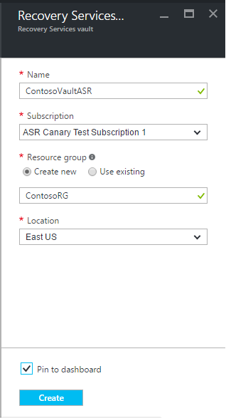
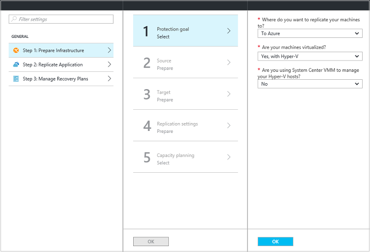
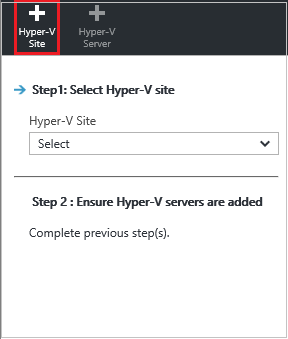
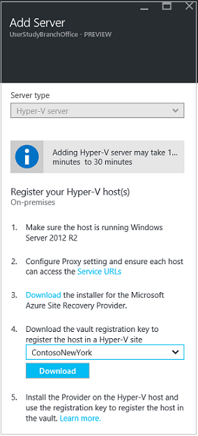
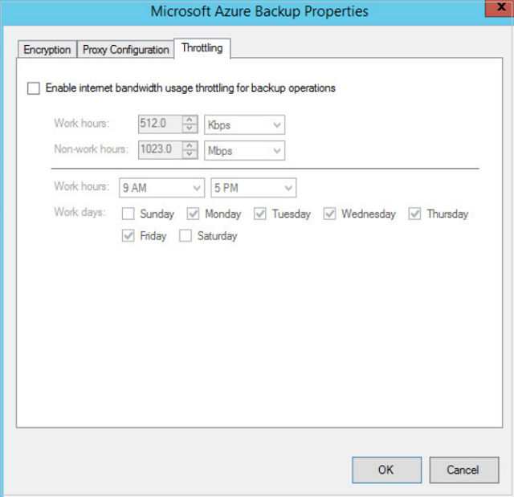
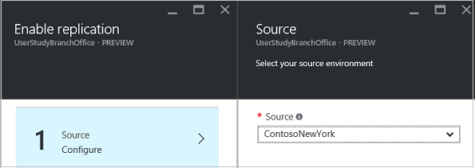
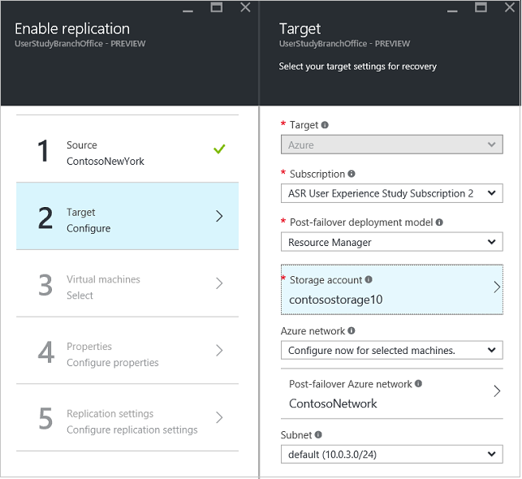
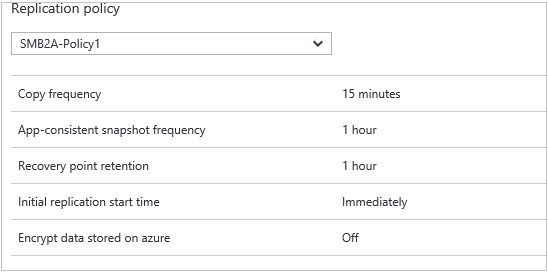

<properties
    pageTitle="Hyper-V virtuellen Computern (ohne VMM) auf Azure mit Azure Website Wiederherstellung mit dem Portal Azure repliziert | Microsoft Azure"
    description="Beschreibt, wie Sie Azure Website Wiederherstellung zum Koordinieren Replikation, Failover- und der lokalen Hyper-V virtuellen Computern, die vom VMM zum Verwenden des Portals Azure Azure verwaltet werden nicht bereitstellen"
    services="site-recovery"
    documentationCenter=""
    authors="rayne-wiselman"
    manager="jwhit"
    editor=""/>

<tags
    ms.service="site-recovery"
    ms.devlang="na"
    ms.topic="article"
    ms.tgt_pltfrm="na"
    ms.workload="storage-backup-recovery"
    ms.date="09/19/2016"
    ms.author="raynew"/>

# Repliziert Hyper-V virtuellen Computern (ohne VMM) in Azure mit Azure Website Wiederherstellung mit dem Azure-portal

> [AZURE.SELECTOR]
- [Azure-Portal](site-recovery-hyper-v-site-to-azure.md)
- [Azure klassischen](site-recovery-hyper-v-site-to-azure-classic.md)
- [PowerShell - Ressourcenmanager](site-recovery-deploy-with-powershell-resource-manager.md)

Willkommen bei Azure Website Wiederherstellung! Verwenden Sie in diesem Artikel lokalen Hyper-V virtuelle repliziert werden soll, **werden nicht** in System Center virtuellen Computern Manager (VMM) Wolken in Azure verwaltete Computer. In diesem Artikel werden die zum Einrichten der Replikation mithilfe von Azure Website Wiederherstellung Azure-Portal.

> [AZURE.NOTE] Azure weist zwei verschiedenen [Bereitstellungsmodelle](../resource-manager-deployment-model.md) für das Erstellen und Arbeiten mit Ressourcen: Azure Ressourcenmanager und Classic. Azure verfügt auch über zwei communityportalen – Azure klassischen Portals, die das Bereitstellungsmodell klassischen unterstützt, und der Azure-Portal mit Unterstützung für beide Bereitstellungsmodelle.

> Azure Website Wiederherstellung unterstützt die Wiederherstellung und die Migration von in Azure-virtuellen Computern Hyper-V. Die Schritte in diesem Artikel gelten genauso wie beim Konfigurieren der Replikation in Azure für die Wiederherstellung oder für die Migration Azure virtuelle Computer

Azure Website Wiederherstellung Azure-Portal bietet eine Reihe von neuen Funktionen:

- In der Azure sind Portal, Azure Sicherung und Wiederherstellung von Azure-Sites Services in einer einzigen Wiederherstellung Services Tresor kombiniert, damit Sie einrichten und Verwalten von Geschäftskontinuität und Wiederherstellung (BCDR) von einem einzigen Ort können. Ein einheitliches Dashboard können Sie überwachen und Verwalten von Vorgängen in Ihrem lokalen Websites und der Azure öffentlichen Cloud.
- Benutzer mit nach der Bereitstellung mit der Cloud Lösung Provider (CSP) Programm Azure-Abonnements können jetzt Website Wiederherstellungsvorgängen Azure-Portal verwalten.
- Website Wiederherstellung Azure-Portal kann Autos auf Ressourcenmanager Speicherkonten repliziert. Bei einem Failover erstellt Website Wiederherstellung Ressourcenmanager-basierten virtuellen Computern in Azure.
- Website Wiederherstellung befindet sich die Unterstützung der Replikation auf klassische Speicherkonten und Failover virtueller Computer mit dem Bereitstellungsmodell klassischen.

Nach dem Lesen diesen Artikel Beitrag Ihr Feedback unten im Abschnitt Kommentare Disqus. Fragen Sie technische im [Azure Wiederherstellung Services-Forum](https://social.msdn.microsoft.com/forums/azure/home?forum=hypervrecovmgr).

## (Übersicht)

Organisationen benötigen eine BCDR Strategie, die bestimmt, wie apps, Auslastung und Daten bleiben während der geplanten und ungeplanten Ausfallzeiten ausgeführt werden und verfügbar, und zum normalen Arbeit Umständen so früh wie möglich wiederherzustellen. Strategische BCDR wird Geschäftsdaten beibehalten, sicherer und wiederhergestellt, und stellen Sie sicher, dass diese ständig verfügbar sind, wenn bei Datenverlusten.

Website Wiederherstellung ist eine Azure-Dienst, der zur strategische BCDR beiträgt, durch die Replikation von physische Server lokal und in der Cloud (Azure) oder in einem sekundären Datencenter-virtuellen Computern orchestriert. Treten Ausfall in gewohnten Standort befinden, können Sie auf den zweiten Standort zum Aktualisieren von apps und Auslastung verfügbar über fehl. Sie können an Ihrem primären Standort fehl, wenn sie normale Vorgänge zurückgibt. Erfahren Sie mehr in [Neuigkeiten Azure Website Wiederherstellung?](site-recovery-overview.md)

Dieser Artikel enthält, dass alle Informationen zum lokalen Hyper-V virtuelle repliziert erforderlichen Maschinen, **werden nicht** in System Center virtuellen Computern Manager (VMM) Wolken in Azure verwaltet. Es enthält eine Übersicht über die Architektur, Planen von Informationen und Bereitstellungsschritte zum Konfigurieren von lokalen Servern Azure, einer Replikationsrichtlinie und Kapazität planen. Nach dem Einrichten der Infrastruktur haben können Sie Aktivieren der Replikation auf Computern, die Sie schützen möchten, und führen einen Failover testen, um die Einrichtung zu überprüfen. Sie können auch Ihre virtuellen Computer in Azure vom ersten Durchführung eines geplanten Failovers migrieren und führen Sie die Migration.

## Vorteile für Unternehmen

- Bietet externen (Azure) Failover für Business Auslastung und Anwendung, die auf Hyper-V virtuellen Computern ausgeführt.
- Stellt eine einzige Wiederherstellung Services-Konsole für einfaches Setup und Verwaltung der Replikation, Failover und Wiederherstellung Prozesse.
- Können Sie auf einfache Weise Failovers aus Ihrer lokalen Infrastruktur in Azure ausführen, und Fail-Back (Wiederherstellen) aus Azure in der lokalen Website.
- Sie können Wiederherstellung Pläne mit mehreren Computern so konfigurieren, dass gestufte Auslastung zusammen über fehl.

## Szenario-Architektur

Dies sind die Szenariokomponenten:

- **Hyper-V-Host oder Cluster**: lokale Hyper-V Hostserver oder Cluster. Die Hyper-V-Hosts Ausführen von virtuellen Computern, die Sie schützen möchten werden während der Bereitstellung der Website Wiederherstellung logische Hyper-V Sites erfasst.
- **Anbieter für Azure Websites Wiederherstellung und Wiederherstellung Services-Agent**: während der Bereitstellung Sie den Azure-Anbieter für Websites Wiederherstellung und des Microsoft Azure Wiederherstellung Services-Agents auf Hyper-V Hostservern installieren. Der Anbieter kommuniziert mit Azure Website Wiederherstellung über HTTPS 443 Orchestrierung repliziert. Der Agent auf dem Host-Server Hyper-V repliziert Daten für Azure-Speicher über HTTPS 443 standardmäßig.
- **Azure**: benötigen Sie ein Azure-Abonnement, ein Konto Azure-Speicher zum repliziert Speichern von Daten und ein Azure-virtuellen Netzwerk, damit Azure-virtuellen Computern nach Failover mit einem Netzwerk verbunden sind.

## Azure erforderliche Komponenten

Hier sind, was in Azure müssen Sie dieses Szenario bereitstellen.

**Voraussetzung** | **Details**
--- | ---
**Azure-Konto**| Benötigen Sie ein [Microsoft Azure](http://azure.microsoft.com/) -Konto ein. Sie können mit einer [kostenlosen Testversion](https://azure.microsoft.com/pricing/free-trial/)beginnen. [Erfahren Sie mehr](https://azure.microsoft.com/pricing/details/site-recovery/) über die Website Wiederherstellung Preise.
**Azure-Speicher** | Benötigen Sie ein Speicherkonto standard-ein. Sie können ein LRS oder GRS Speicher-Konto verwenden. Wir empfehlen GRS, so dass Daten ist flexibel, wenn ein regionalen Ausfall auftritt, oder die primäre Region nicht wiederhergestellt werden kann. [Erfahren Sie mehr](../storage/storage-redundancy.md). Das Konto muss sich in derselben Region als der Wiederherstellung Services Tresor.   Premium Speicher wird nicht unterstützt.   Replizierte Daten in Azure-Speicher gespeichert und Azure-virtuellen Computern erstellt werden, wenn ausgeführt wird.   [Informationen zu](../storage/storage-introduction.md) Azure-Speicher.
**Azure Netzwerk** | Sie benötigen ein Azure-virtuelles Netzwerk, dem mit Azure-virtuellen Computern verbunden werden soll, wenn ausgeführt wird. Das Azure virtuelle Netzwerk muss sich in derselben Region als der Wiederherstellung Services Tresor.

## Lokale erforderliche Komponenten

Hier finden Sie müssen lokale.

**Voraussetzung** | **Details**
--- | ---
**Hyper-V** | Ein oder mehrere lokalen Servern mit **Windows Server 2012 R2** mit den neuesten Updates und die Hyper-V-Rolle aktiviert oder **Microsoft Hyper-V Server 2012 R2**.  Der Hyper-V-Server sollte eine oder mehrere virtuelle Computer enthalten.  Hyper-V-Servern sollte direkt oder über einen Proxy mit dem Internet verbunden sein.  Hyper-V-Servern sollte erwähnten in [KB2961977](https://support.microsoft.com/en-us/kb/2961977 "KB2961977") installiert haben.
**Anbieter und agent** | Installieren Sie während der Bereitstellung der Wiederherstellung der Azure-Website den Azure-Anbieter für Websites Wiederherstellung. Die Anbieter-Installation wird auch der Azure-Agent Wiederherstellung Services installiert, auf allen Hyper-V-Servern, die mit virtuellen Computern, die Sie schützen möchten. Alle Hyper-V-Servern in einem Website-Wiederherstellung Tresor sollte die gleichen Versionen der Anbieter und Agent haben.  Der Anbieter wird über das Internet eine Verbindung mit Azure Website Wiederherstellung benötigen. Datenverkehr kann direkt oder über einen Proxy gesendet werden. Beachten Sie, dass HTTPS Proxy-basierte wird nicht unterstützt. Der Proxyserver sollte auf zugreifen dürfen:    *. hypervrecoverymanager.windowsazure.com     *. accesscontrol.windows.net    *. backup.windowsazure.com     *. blog.core.windows.net    *Store.Core.Windows.NET    https://www.msftncsi.com/ncsi.txt  Wenn Sie die IP-Adresse-basierte Firewall-Regeln auf dem Server haben, überprüfen Sie, dass die Regeln Kommunikation mit Azure zulassen. Sie müssen die [Azure Datacenter IP-Bereiche](https://www.microsoft.com/download/confirmation.aspx?id=41653) und den Port HTTPS (443) zulassen.  Lassen Sie die IP-Adressbereiche für die Azure Region Ihres Abonnements, und Westen US.

## Voraussetzungen für die geschützten Computer

**Voraussetzung** | **Details**
--- | ---
**Geschützten virtuellen Computern** | Bevor Sie über eines virtuellen Computers fehl müssen Sie sicherstellen, dass [Azure Vorkenntnisse](site-recovery-best-practices.md#azure-virtual-machine-requirements)entspricht der Namen, der den Azure-virtuellen Computer zugewiesen wird. Sie können den Namen ändern, nachdem Sie die Replikation für den virtuellen Computer aktiviert haben.   Einzelne die Speicherkapazität auf geschützten Computern dürfen nicht mehr als 1023 GB entsprechen. Ein virtueller Computer kann bis zu 16 Festplatten haben (sodass bis zu 16 TB).   Freigegebene Datenträger Gast, Cluster nicht unterstützt werden.   Wenn die Quelle virtueller Computer NIC-Kombination verfügt wird es in einen einzelnen Netzwerkadapter nach Failover auf Azure konvertiert.  Schützen von virtuellen Computern mit Linux und eine statische IP-Adresse wird nicht unterstützt.

## Bereiten für Bereitstellung vor

So bereiten Sie Bereitstellung zu benötigen:

1. [Richten Sie ein Azure-Netzwerk](#set-up-an-azure-network) in der Azure-virtuellen Computern gespeichert werden, wenn sie nach einem Failover erstellt haben.
2. [Richten Sie ein Konto Azure-Speicher](#set-up-an-azure-storage-account) für repliziert Daten.
3. [Vorbereiten der Hyper-V-Hosts](#prepare-the-hyper-v-hosts) , um sicherzustellen, dass sie die erforderlichen URLs zugreifen können.

### Richten Sie eine Azure Netzwerk

Richten Sie ein Azure-Netzwerk aus. Sie benötigen diese, damit der Azure-virtuellen Computern erstellt werden, nachdem Failover mit einem Netzwerk verbunden sind.

- Im Netzwerk sollten in derselben Region als, in dem Sie den Wiederherstellung Services Tresor bereitstellen werden.
- Je nach Ressourcenmodell, die, dem Sie für verwenden, über Azure-virtuellen Computern fehlgeschlagen ist möchten, können Sie die Azure Netzwerk [Ressourcenmanager](../virtual-network/virtual-networks-create-vnet-arm-pportal.md) oder [klassischen Modus](../virtual-network/virtual-networks-create-vnet-classic-pportal.md)einrichten.
- Es empfiehlt sich, dass Sie ein Netzwerk einrichten, bevor Sie beginnen. Wenn Sie Sie nicht während der Bereitstellung der Website Wiederherstellung erledigen müssen.

> [AZURE.NOTE] [Migration von Netzwerken](../resource-group-move-resources.md) zwischen Ressourcengruppen innerhalb des gleichen Abonnements oder übergreifend Abonnements wird Netzwerke für die Website Wiederherstellung nicht unterstützt.

### Richten Sie ein Konto Azure-Speicher

- Sie benötigen ein Konto standard Azure-Speicher auf Azure replizierte Daten aufnehmen zu können.
- Je nach Ressourcenmodell, die, dem Sie für verwenden, über Azure-virtuellen Computern fehlgeschlagen ist möchten, können Sie ein Konto im [Ressourcenmanager](../storage/storage-create-storage-account.md) oder [klassischen Modus](../storage/storage-create-storage-account-classic-portal.md)festlegen.
- Es empfiehlt sich, dass Sie eine Speicherkonto einrichten, bevor Sie beginnen. Wenn Sie Sie nicht während der Bereitstellung der Website Wiederherstellung erledigen müssen. Die Konten müssen in der gleichen Region als der Wiederherstellung Services Tresor sein.

> [AZURE.NOTE] [Migration von Speicherkonten](../resource-group-move-resources.md) zwischen Ressourcengruppen innerhalb des gleichen Abonnements oder übergreifend Abonnements wird Speicherkonten für die Bereitstellung von Website-Wiederherstellung nicht unterstützt.

### Vorbereiten der Hyper-V-hosts

- Stellen Sie sicher, dass die [Voraussetzungen für](#on-premises-prerequisites)die Hyper-V-Hosts einhalten.

### Erstellen einer Wiederherstellungsdatei Services Tresor

1. Melden Sie sich mit dem [Azure-Portal](https://portal.azure.com)aus.
2. Klicken Sie auf **neue** > **Management** > **Sicherung und Wiederherstellung der Website (OMS)**. Alternativ können Sie klicken, **Navigieren Sie** > **Wiederherstellung Services** Depots > **Hinzufügen**.

    

3. Geben Sie im Feld **Name** einen Anzeigenamen ein, um den Tresor zu identifizieren. Wenn Sie mehr als ein Abonnement besitzen, wählen Sie einen davon.
4. [Erstellen einer neuen Ressourcengruppe](../resource-group-template-deploy-portal.md) oder ein vorhandenes Layout auszuwählen, und geben Sie einen Bereich Azure. In diesem Bereich werden Autos repliziert werden. Zum Überprüfen der unterstützte Regionen finden Sie unter geografischen Verfügbarkeit in [Azure Website Wiederherstellung Preise-Details](https://azure.microsoft.com/pricing/details/site-recovery/)
4. Wenn Sie schnell den Tresor aus dem Dashboard zugreifen möchten klicken Sie auf **Pin zum Dashboard** , und klicken Sie dann auf **Tresor erstellen**.

    

Der neue Tresor wird angezeigt, auf dem **Dashboard** > **alle Ressourcen**, und klicken Sie auf dem primären **Wiederherstellung Services Depots** Blade.

## Erste Schritte

Website Wiederherstellung bietet eine überfordert Benutzeroberfläche, die Ihnen dabei hilft so schnell wie möglich bereitstellen. Erste Schritte erforderlichen Komponenten überprüft und führt Sie durch Website Wiederherstellung Bereitstellung in der richtigen Reihenfolge Schritte.

Erste Schritte wählen Sie den Typ der Computer repliziert werden soll, und auf repliziert werden soll. Sie richten Sie lokale Server, Azure-Speicherkonten und Netzwerke. Sie Replikation Richtlinien erstellen, und führen die Kapazität zu planen. Nachdem Sie Ihre Infrastruktur eingerichtet haben, können Sie Replikation für virtuelle Computer. Sie können Failovers für bestimmte Computer ausführen oder Wiederherstellung Pläne auf mehreren Computern treten erstellen.

Beginnen Sie erste Schritte, indem Sie auswählen, wie Sie Website Wiederherstellung bereitstellen möchten. Erste Schritte illustrieren ändert sich etwas je nach Ihren Anforderungen Replikation.

## Schritt 1: Wählen Sie Ihre Schutzziele

Wählen Sie repliziert werden soll, und wo auf repliziert werden soll.

1. Das Blade **Wiederherstellung Services Depots** wählen Sie Ihrem Tresor aus und dann auf **Einstellungen**.
2. In den **Einstellungen** > **Erste Schritte** , klicken Sie auf **Website Wiederherstellung** > **Schritt 1: Vorbereiten Infrastruktur** > **Schutz Zielsetzung**.

    

3. **Schutz** Ziels **Zu Azure**wählen Sie aus, und wählen Sie **Ja, mit Hyper-V**. Wählen Sie **Nein** , zu bestätigen, dass Sie nicht VMM verwenden. Klicken Sie dann auf **OK**.

    

## Schritt 2: Einrichten der Umgebung Quelle

Einrichten von Hyper-V-Website, installieren Sie den Azure-Anbieter für Websites Wiederherstellung und der Agent Azure Wiederherstellung Services auf Hyper-V-Hosts und Hosts im Tresor registrieren.

1. Klicken Sie auf **Schritt 2: Vorbereiten der Infrastruktur** > **Quelle**. Klicken Sie zum Hinzufügen einer neuen Hyper-V-Website als Container für Ihre Hyper-V-Hosts oder Cluster auf **+ Hyper-V-Website**.

    

2. Geben Sie in das **Erstellen von Hyper-V Website** Blade einen Namen für die Website ein. Klicken Sie dann auf **OK**. Wählen Sie die Website, die Sie soeben erstellt haben.

    

3. Klicken Sie auf **+ Hyper-V Server** um einen Server zu der Website hinzuzufügen.
4. Server **Hinzufügen** > **Server** zu überprüfen, dass **Hyper-V Server** angezeigt wird. Stellen Sie sicher, dass der Hyper-V-Server, die, den Sie hinzufügen möchten – mit den [erforderlichen Komponenten Konformität](#on-premises-prerequisites) und kann auf die angegebenen URLs zugreifen.
4. Die Azure Website Wiederherstellung Anbieter Installationsdatei nicht herunterladen. Sie können diese Datei, um sowohl den Anbieter als auch der Wiederherstellung Services-Agent auf jedem Hyper-V-Host installieren ausführen.
5. Herunterladen der Registrierungsschlüssel. Sie benötigen diese beim Setup. Der Schlüssel ist gültig für 5 Tage, nachdem Sie es erstellt haben.

    

6. Führen Sie den Anbieter Setupdatei auf jedem Host, die Sie zu der Website Hyper-V hinzugefügt. Wenn Sie auf einem Hyper-V-Cluster installieren, führen Sie Setup auf jedem Clusterknoten. Installieren und Registrieren der einzelnen Knoten Hyper-V ist sichergestellt, dass virtuellen Computern geschützt bleiben, auch wenn sie über Knoten migrieren.

### Installieren Sie den Anbieter und agent

1. Führen Sie den Anbieter Setupdatei.
2. In **Microsoft Update** können Sie in nach Updates suchen optional, damit Microsoft Update Richtlinie Anbieter Updates installiert werden.
3. Anzunehmen Sie in der **Installation** , oder ändern Sie den Speicherort der Standardinstallation Anbieter, und klicken Sie auf **Installieren**.
4. Klicken Sie in **Tresor** Einstellungsseite auf **Durchsuchen** , um die Datei mit Schlüssel Tresor auszuwählen, die Sie heruntergeladen haben. Geben Sie das Abonnement Azure Website Wiederherstellung, den Namen Tresor und der Hyper-V-Website zu der der Hyper-V Server gehört.

    

5 ° Geben Sie in **Proxyeinstellungen** an, wie der Anbieter, die auf dem Server installiert sein, mit Azure Website Wiederherstellung über das Internet verbinden möchten.

- Wählen Sie **direkt ohne einen Proxy verbinden**, wenn Sie den Anbieter direkt verbinden möchten.
- Wählen Sie **Verbinden mit vorhandenen Proxyeinstellungen**mit dem Proxy herstellen, die aktuell auf dem Server eingerichtet werden soll.
- Wenn Sie Ihre vorhandene Proxy erfordert Authentifizierung, oder verwenden einen benutzerdefinierten Proxy für **eine Verbindung herstellen mit benutzerdefinierten Proxyeinstellungen**Anbieter Verbindung auswählen möchten.
- Wenn Sie einen benutzerdefinierten Proxy verwenden, den Sie die Adresse, den Port und die Anmeldeinformationen angeben müssen
- Wenn Sie eine Tabellenerstellungsabfrage Proxy verwenden sind Sie sicher, dass die URLs der [erforderlichen Komponenten](#on-premises-prerequisites) beschrieben bis es zulässig.

    

6. Klicken Sie auf **Registrieren** , um den Server im Tresor registrieren, nach Abschluss der Installation.

7.das nach Abschluss der Registrierung-Metadaten aus der Hyper-V Server durch Azure Website Wiederherstellung abgerufen und der Server, auf die **Einstellungen**angezeigt > **Wiederherstellung Standortinfrastruktur** > **Hyper-V-Hosts** Blade.

### Befehlszeile-installation

Der Wiederherstellung-Anbieter für Azure-Websites und -Agent können auch mithilfe der folgenden Befehlszeile installiert werden. Diese Methode kann verwendet werden, um den Anbieter auf einem Server-Core für Windows Server 2012 R2 installieren.

1. Laden Sie den Anbieter Datei- und Registrierungsinformationen Key in einen Ordner aus. Beispielsweise C:\ASR.
2. Führen Sie diese Befehle zum Extrahieren des Installationsprogramms Anbieter aus ein erweitertes Eingabeaufforderungsfenster:

            C:\Windows\System32> CD C:\ASR
            C:\ASR> AzureSiteRecoveryProvider.exe /x:. /q
3. Führen Sie diesen Befehl, um die Komponenten zu installieren:

            C:\ASR> setupdr.exe /i

4. Führen Sie diese Befehle, um den Server im Tresor registrieren: CD c:\Programme\Microsoft c:\Programme\Microsoft Azure Website Wiederherstellung Provider\
            C:\Programme\Microsoft c:\Programme\Microsoft Azure Website Wiederherstellung Anbieter\> DRConfigurator.exe/r /Friendlyname <friendly name of the server> /Anmeldeinformationen<path of the credentials file>

 
Wobei Folgendes gilt:

- **/Credentials** : obligatorische Parameter, die den Speicherort angibt, in dem die Datei Key befindet,  
- **/FriendlyName** : obligatorische Parameter für den Namen des Servers Host Hyper-V, die im Portal Azure Website Wiederherstellung angezeigt wird.
- **/ProxyAddress** : Optionaler Parameter, die Adresse des Proxyservers angibt.
- **/ProxyPort** : Optionaler Parameter, den Port des Proxyservers angibt.
- **/proxyUsername** : Optionaler Parameter, Proxy-Benutzernamen angibt (wenn Proxy-Authentifizierung erforderlich ist).
- **/proxyPassword** : optionale Parameter, die angibt, das Kennwort für die Authentifizierung mit dem Proxyserver (wenn Proxy-Authentifizierung erforderlich ist).

## Schritt 3: Einrichten von zielumgebung

Geben Sie das Azure-Speicher-Konto verwendet werden, für die Replikation und dem Azure Netzwerk mit dem Azure-virtuellen Computern nach Failover verbinden möchten.

1.  Klicken Sie auf **Vorbereiten Infrastruktur** > **Ziel** , und wählen Sie die zu verwendende Azure-Abonnement.
2.  Geben Sie das Modell zur Bereitstellung, die, das Sie nach einem Failover für virtuelle Computer verwenden möchten.
3.  Website Wiederherstellung überprüft, dass Sie eine oder mehrere Konten kompatibel Azure-Speicher und Netzwerken haben.

    

4.  Wenn Sie ein Speicherkonto keine eingegangen sind und Sie eine erstellen möchten Ressourcenmanager verwenden, klicken Sie auf **+ Speicher** -Konto, um die Inline führen. Geben Sie auf das Blade **Speicher-Konto erstellen** einer Kontonamen, Typ, Abonnement und Speicherort aus. Das Konto am selben Speicherort wie der Wiederherstellung Services Tresor hinzugefügt werden.

    

    Wenn Sie ein Speicherkonto mithilfe der Option Klassisch erstellen möchten erhalten Sie die [Azure-Portal](../storage/storage-create-storage-account-classic-portal.md)ausführen.

5.  Wenn Sie keine sind ein Azure-Netzwerk eingegangen und für eine erstellen möchten mit Ressourcenmanager klicken Sie auf **+ Netzwerk** dieser Inline ausführen. Geben Sie einen Netzwerknamen, Adressbereichs, Subnetdetails, Abonnement und Speicherort, auf das Blade **virtuelles Netzwerk erstellen** . Im Netzwerk am selben Speicherort wie der Wiederherstellung Services Tresor hinzugefügt werden.

    

    Wenn Sie ein Netzwerk mit der Option Klassisch erstellen möchten erhalten Sie die [Azure-Portal](../virtual-network/virtual-networks-create-vnet-classic-pportal.md)ausführen.

## Schritt 4: Einrichten von Replikations-Einstellungen

1. Klicken Sie zum Erstellen einer neuen Replikations Richtlinie auf **Vorbereiten Infrastruktur** > **Replikation Einstellungen** > **+ Erstellen und zuordnen**.

    

2. **Erstellen** und zuordnen Richtlinie Geben Sie einen Richtliniennamen ein.
3. Geben Sie im Feld **Häufigkeit kopieren** an, wie oft Delta Daten nach der anfänglichen Replikation (alle 30 Sekunden, Version 5 oder 15 Minuten) repliziert werden soll.
4. **Wiederherstellung zeigen Aufbewahrungsrichtlinien**Geben Sie Stunden wie lange ist, wird das Fenster Aufbewahrung für jeden Wiederherstellungspunkt sein. Geschützte Maschinen können an einer beliebigen Stelle in einem Fenster wiederhergestellt werden.
6. In der **App-konsistente Momentaufnahme Häufigkeit** angeben, wie häufig (1 bis 12 Stunden) Wiederherstellungspunkte, die Anwendung konsistent Momentaufnahmen enthält sind, erstellt. Hyper-V verwendet zwei Arten von Momentaufnahmen – Momentaufnahme standard, der eine Momentaufnahme inkrementelle des gesamten virtuellen Computers enthält, und eine Anwendung konsistente Momentaufnahme, über die eine Point-in-Time-Momentaufnahme der Anwendungsdaten innerhalb des virtuellen Computers zu gelangen. Anwendung konsistent Momentaufnahmen verwenden Volume Schatten Copy Service (VSS), um sicherzustellen, dass Programme konsistent sind, wenn die Momentaufnahme aufgezeichnet wird. Beachten Sie, dass wenn Sie die Anwendung konsistent Momentaufnahmen aktivieren, die Leistung der Anwendung, die auf Quelle virtuellen Computern beeinträchtigt wird. Stellen Sie sicher, dass der Wert, den Sie festlegen kleiner als die Anzahl von Wiederherstellungspunkten zusätzliche ist, die Sie konfigurieren.
3. Geben Sie **Initiale Replikation Startzeit** wann die erste Replikation gestartet. Die Replikation erfolgt über die Internetbandbreite, damit er außerhalb Ihrer beschäftigt Stunden geplant werden soll. Klicken Sie dann auf **OK**.

    

Beim Erstellen einer neuen Richtlinie hat es automatisch die Hyper-V-Website zugeordnet. Klicken Sie auf **OK**. Sie können einer Website Hyper-V (und den virtuellen Computern in es) mit mehreren Replikation Richtlinien in den **Einstellungen**zuordnen > **Replikation** > Name der Richtlinie > **Hyper-V-Website zugeordnet werden soll**.

## Schritt 5: Planen der Kapazität

Jetzt, da Sie Ihre Basic haben Infrastruktur, die Sie einrichten kann denken Kapazität Planung und ermitteln, ob Sie zusätzliche Ressourcen benötigen.

Website Wiederherstellung bietet eine Kapazität können Sie die richtigen Ressourcen für Ihre Umgebung Quelle, die Website Wiederherstellung Komponenten, Netzwerke und Speicher zugewiesen werden können. Sie können den Planer im Schnellmodus für Abschätzung basierend auf einer durchschnittlichen Anzahl von virtuellen Computern, Datenträger und Speicher oder im detaillierten Modus, in dem Sie Zahlen auf der Ebene Arbeitsbelastung Eingabemethoden werden, ausführen. Bevor Sie beginnen müssen Sie:

- Sammeln Sie Informationen über Ihre Replikations-Umgebung, einschließlich virtuellen Computern, Datenträger pro virtuellen Computern und Speicherplatz pro Laufwerk ein.
- Schätzen der täglichen Rendite ändern (Änderung), die Sie für repliziert Daten haben. Die [Kapazitätsplaner für Hyper-V Replica](https://www.microsoft.com/download/details.aspx?id=39057) können Ihnen dabei helfen.

1.  Klicken Sie auf **herunterladen** , um das Tool herunterladen, und führen Sie es. [Lesen Sie den Artikel](site-recovery-capacity-planner.md) , der das Tool begleitet.
2.  Wenn Sie damit fertig sind wählen Sie **Ja** aus **haben Sie die Kapazität für ausführen**?

    

### Netzwerk Bandbreite Aspekte

Die Kapazitätsplanertools können die Bandbreite zu berechnen, die Sie für die Replikation (erste Replikation und dann Delta müssen). Um den Umfang der Bandbreite verwenden für die Replikation steuern müssen Sie einige Optionen aus:

- **Bandbreite**: Hyper-V, die in Azure repliziert Netzwerkverkehr über einen bestimmten Hyper-V-Host. Sie können die Bandbreite auf dem Hostserver einschränken.
- **Gibt die Bandbreite**: Sie können die Replikation mithilfe von ein paar Registrierungsschlüsseln verwendete Bandbreite beeinflussen.

#### Bandbreite

1. Öffnen Sie das Microsoft Azure Sicherung MMC-Snap-in auf dem Host-Server Hyper-V. Standardmäßig ist eine Abkürzung für Microsoft Azure Sicherung auf dem Desktop oder in c:\Programme\Microsoft c:\Programme\Microsoft Azure Wiederherstellung Services Agent\bin\wabadmin verfügbar.
2. Klicken Sie auf **Eigenschaften ändern**, in dem Snap-in.
3. Klicken Sie auf der Registerkarte **Beschränkung** die Option **Internet Bandbreite Verwendung begrenzungsebene für zusätzliche Vorgänge aktivieren**, und legen Sie die Grenzwerte für die Arbeit und nicht-Arbeit Stunden. Gültige Bereiche sind 512/s und 102/s pro Sekunde.

    

Sie können auch das Cmdlet " [Set-OBMachineSetting](https://technet.microsoft.com/library/hh770409.aspx) " verwenden, begrenzungsebene festlegen. Hier ist ein Beispiel:

    $mon = [System.DayOfWeek]::Monday
    $tue = [System.DayOfWeek]::Tuesday
    Set-OBMachineSetting -WorkDay $mon, $tue -StartWorkHour "9:00:00" -EndWorkHour "18:00:00" -WorkHourBandwidth  (512*1024) -NonWorkHourBandwidth (2048*1024)

**Set-OBMachineSetting-NoThrottle** gibt an, dass keine Beschränkung erforderlich ist.

#### Netzwerk-Bandbreite beeinflussen

1. Navigieren Sie in der Registrierung zu **HKEY_LOCAL_MACHINE\SOFTWARE\Microsoft\Windows Azure Backup\Replication**.
    - Um den Datenverkehr Bandbreite auf einem Datenträger repliziert beeinflussen, ändern Sie den Wert der **UploadThreadsPerVM**, oder erstellen Sie die Taste aus, wenn es nicht vorhanden ist.
    - Um die Bandbreite für Failback Datenverkehr aus Azure beeinflussen, ändern Sie den Wert **DownloadThreadsPerVM**ein.
2. Der Standardwert ist 4. In einem Netzwerk "overprovisioned" sollte diese Registrierungsschlüssel aus der Standardwerte geändert werden. Das Maximum beträgt 32. Überwachen Sie den Datenverkehr in den Wert zu optimieren.

## Schritt 6: Aktivieren Replikation

Aktivieren der Replikation jetzt wie folgt:

1. Klicken Sie auf **Schritt2: repliziert Anwendung** > **Quelle**. Nachdem Sie Replikation zum ersten Mal aktiviert haben, werden Sie **+ repliziert** im Tresor Replikation für zusätzliche Computer aktivieren klicken.

    

2. In der **Quelle** Blade > Wählen Sie die Hyper-V-Website. Klicken Sie dann auf **OK**.
3. Wählen Sie in der **Zielliste** das Abonnement Tresor und das Failover-Modell, die, das Sie in Azure (Classic oder Ressource Management) nach einem Failover verwenden möchten.
4. Wählen Sie das Speicherkonto, das Sie verwenden möchten. Wenn Sie ein als die anderen Speicherkonto verwenden möchten, müssen Sie Sie [Erstellen](#set-up-an-azure-storage-account)können. Klicken Sie zum Erstellen eines Speicher auf Konto mithilfe des Modells Ressourcenmanager **neu erstellen**. Wenn Sie ein Speicherkonto mithilfe der Option Klassisch erstellen möchten erhalten Sie die [Azure-Portal](../storage/storage-create-storage-account-classic-portal.md)ausführen. Klicken Sie dann auf **OK**.
5.  Wählen Sie die Azure Netzwerk und Subnetz mit dem Azure-virtuellen Computern verbinden möchten, wenn sie nach einem Failover erstellt wird, sind. Wählen Sie **jetzt für den ausgewählten Rechner konfigurieren** die Netzwerk-Einstellung auf alle Computer, die Sie auswählen, für den Schutz angewendet wird. Wählen Sie **später konfigurieren** , um das Azure Netzwerk pro Computer auszuwählen. Wenn Sie einem anderen Netzwerk herzustellen, die Sie verwenden möchten, müssen Sie Sie [Erstellen](#set-up-an-azure-network)können. Klicken Sie zum Erstellen ein Netzwerks mithilfe des Modells Ressourcenmanager auf **neu erstellen**. Wenn Sie ein Netzwerk mit der Option Klassisch erstellen möchten erhalten Sie die [Azure-Portal](../virtual-network/virtual-networks-create-vnet-classic-pportal.md)ausführen. Wählen Sie ein Subnetz ein, falls zutreffend. Klicken Sie dann auf **OK**.

    

6. Virtuellen **-** > auf**virtuellen Computern auswählen** , und wählen Sie jedem Computer repliziert werden soll. Sie können nur Autos auswählen, für die Replikation aktiviert werden kann. Klicken Sie dann auf **OK**.

    

11. **Eigenschaften** > **Eigenschaften konfigurieren**, wählen Sie das Betriebssystem, das für den ausgewählten virtuellen Computern und der OS Datenträger aus. Stellen Sie sicher, dass der Name des Azure virtuellen Computers (Zielname) [Azure-virtuellen Computern Anforderungen](site-recovery-best-practices.md#azure-virtual-machine-requirements) erfüllt, und ändern sie bei Bedarf. Klicken Sie dann auf **OK**. Sie können später weitere Eigenschaften festlegen.

    

12. In den **Einstellungen der Replikation** > **Replikation konfigurieren von Einstellungen**, wählen Sie die Replikationsrichtlinie für den geschützten virtuellen Computern anwenden möchten. Klicken Sie dann auf **OK**. Sie können die Replikationsrichtlinie in den **Einstellungen**ändern > **Replikation Richtlinien** > Name der Richtlinie > **Einstellungen bearbeiten**. Änderungen, die Sie anwenden, werden für Maschinen, die bereits repliziert werden, und neue Maschinen verwendet werden.

    

Sie können die Fortschritte des Projekts in den **Einstellungen** **Aktivieren Schutz** verfolgen > **Aufträge** > **Website Wiederherstellung Aufträge**. Für Failover bereitsteht nach der Auftrag **Fertigstellen Schutz** des Computers ausgeführt werden kann.

### Anzeigen und Verwalten von virtuellen Computer-Eigenschaften

Es empfiehlt sich, dass Sie die Eigenschaften des Quellcomputers überprüfen.

1. Klicken Sie auf **Einstellungen** > **Geschützte Elemente** > **Repliziert Elemente** >, und wählen Sie den Computer.

    

2. In den **Eigenschaften** können Sie die Replikation und Failover Informationen für den virtuellen Computer anzeigen.

    

3. **Berechnen**und Netzwerk > Sie können den Schriftgrad aus Azure-virtuellen Computer Name und Ziel**Eigenschaften zu berechnen** . Ändern Sie den Namen, um Sie im Bedarfsfall Azure Vorschriften entsprechen. Sie können auch anzeigen und Ändern von Informationen über die Zielnetzwerk, Subnetz und IP-Adresse, die den Azure-virtuellen Computer zugewiesen werden soll. Beachten Sie Folgendes:

    - Sie können die IP-Adresse des Ziels festlegen. DHCP werden verwendet, wenn Sie nicht über einen Computer eine Adresse, die den Fehler beim bereitstellen. Wenn Sie eine Adresse, die nicht am Failover verfügbar ist festlegen, wird das Failover fehl. Die Ziel IP-Adresse kann für Test Failover verwendet werden, wenn die Adresse im Netzwerk testen Failover verfügbar ist.
    - Die Anzahl der Netzwerkadapter wird durch die Größe vorgegeben, die Sie für das Ziel virtuellen Computern, wie folgt angeben:

        - Wenn die Anzahl der Netzwerkadapter auf dem Quellcomputer kleiner oder gleich der Anzahl der Netzwerkadapter für die Größe des Target Computer zulässig ist, wird das Ziel als Quelle die gleiche Anzahl von Netzwerkadapter verfügbar.
        - Wenn die Anzahl der Netzwerkadapter für die Quelle virtuellen Computern die Höchstzahl überschreitet für die Zielgröße und dann das Ziel Größe Maximum verwendet werden soll.
        - Wenn beispielsweise ein Datenquelle Computer verfügt über zwei Netzwerkadapter und die Größe des Computers Target unterstützt vier, der Ziel-Computer werden zwei Netzwerkadapter haben. Wenn der Quellcomputer zwei Netzwerkadapter weist, aber die Größe der unterstützten Ziel nur einen unterstützt haben der Ziel-Computer nur einen Netzwerkadapter.     
        - Wenn der virtuellen Computer mehrere Netzwerkadapter ist werden sie alle mit dem gleichen Netzwerk verbunden.

    

5.  In **Datenträger** können Sie das Betriebssystem und die Daten Datenträger des virtuellen Computers sehen, die repliziert werden.

## Schritt 7: Testen der Bereitstellung

Zum Testen der Bereitstellung können Sie einen Test-Failover für einen einzelnen virtuellen Computern oder eines Plans für die Wiederherstellung, das eine oder mehrere virtuelle Computer enthält ausführen.

### Bereiten für die Failover-Tests zurück vor

- Zum Ausführen eines Failovers Test wird empfohlen, dass Sie ein neues Azure Netzwerk, das isoliert wurde aus Ihrem Netzwerk Azure Herstellung erstellen (Dies ist Standardverhalten beim Erstellen eines neuen Netzwerks in Azure). [Erfahren Sie mehr](site-recovery-failover.md#run-a-test-failover) über das Testfailovers ausführen.
- Um die optimale Leistung zu gelangen, wenn Sie über in Azure fehlschlägt, installieren Sie den Azure-Agent auf dem geschützten Computer. Starten schneller macht, und hilft bei der Problembehandlung. Installieren des [Linux](https://github.com/Azure/WALinuxAgent) oder [Windows](http://go.microsoft.com/fwlink/?LinkID=394789) -Agents an.
- Wenn Ihre Bereitstellung vollständig testen benötigen Sie eine Infrastruktur für den repliziert Computer wie erwartet funktioniert. Wenn Sie Active Directory und DNS prüfen möchten, können Sie erstellen einen virtuellen Computer als Domänencontroller mit DNS- und repliziert dies in Azure Azure Website Wiederherstellung verwenden. Lesen Sie weitere in [Test Failover Aspekte für Active Directory](site-recovery-active-directory.md#considerations-for-test-failover).
- Beachten Sie Folgendes, wenn Sie in einer ungeplanten Failover anstelle eines Failovers Test ausgeführt werden sollen:

    - Falls möglich sollten Sie primäre Autos ausschalten, bevor Sie ein ungeplantes Failover ausführen. Dies sorgt dafür, dass sowohl die Quell- und Replikatpfade Computern zur gleichen Zeit nicht.
    - Beim Ausführen eines ungeplanten Failovers beendet Replikation der Daten aus der primären Maschinen, damit alle Daten Delta wird nicht übertragen werden, nachdem ein ungeplantes Failover beginnt. Darüber hinaus, wenn Sie ein ungeplantes Failover auf einen Wiederherstellungsplan ausführen kann es bis zum Abschluss, selbst wenn ausführen tritt ein Fehler auf.

### Vorbereiten der Verbindung zum Azure-virtuellen Computern nach failover

Wenn Sie Verbindung mit Azure-virtuellen Computern RDP nach Failover verwenden möchten, stellen Sie sicher, dass Sie die folgenden Aktionen ausführen:

Klicken Sie **auf dem lokalen Computer vor dem Failover**:

- Für den Zugriff über das Internet aktivieren RDP, sicherzustellen, dass TCP- und UDP-Regeln für das- **öffentlichen**hinzugefügt werden und sicherstellen, dass in der **Windows-Firewall**RDP zulässig ist -> **zulässige apps und Features** für alle Profile.
- Für den Zugriff über eine Verbindung zwischen Standorten RDP auf dem Computer aktivieren und sicherstellen, dass in der **Windows-Firewall**RDP zulässig ist -> **zulässige apps und Features** für die **Domäne** und **privaten** Netzwerken.
- Installieren Sie den [Agent Azure-virtuellen Computer](http://go.microsoft.com/fwlink/?LinkID=394789&clcid=0x409) , auf dem lokalen Computer.
- Stellen Sie sicher, dass das Betriebssystem SAN-Richtlinie OnlineAll festgelegt ist. [Weitere Informationen]( https://support.microsoft.com/kb/3031135)
- Deaktivieren des IPSec-Diensts aus, bevor Sie das Failover ausführen.

**Klicken Sie auf das Azure virtueller Computer nach Failover**:

- Hinzufügen einer öffentlichen IP-Adresse der Netzwerkschnittstellenkarte den Azure-virtuellen Computer RDP dürfen zugeordnet.
- Stellen Sie sicher, dass Sie keine Domänenrichtlinien besitzen, die verhindern, dass Sie eine Verbindung zu einer virtuellen Computern mithilfe einer öffentlichen Adresse.
- Versuchen Sie, eine Verbindung herstellen. Stellen Sie sicher, dass der virtuellen Computer ausgeführt wird, wenn Sie keine Verbindung herstellen können. Weitere Tipps zur Problembehandlung finden Sie in diesem [Artikel](http://social.technet.microsoft.com/wiki/contents/articles/31666.troubleshooting-remote-desktop-connection-after-failover-using-asr.aspx).

Wenn Sie eine Azure virtueller Computer mit Linux nach System durch Verwendung eines Secure Shell-Clients (ssh) zugreifen möchten, führen Sie folgende Schritte aus:

Klicken Sie **auf dem lokalen Computer vor dem Failover**:

- Sicherstellen Sie, dass der Secure Shell-Dienst des Azure-virtuellen Computers für den automatischen start Systemstart festgelegt ist.
- Überprüfen Sie, Firewall-Regeln eine SSH-Verbindung zu ermöglichen.

**Klicken Sie auf das Azure virtueller Computer nach Failover**:

- Die Regeln für Netzwerk Sicherheit auf Fehler beim virtuellen Computer und dem Azure Subnetz, mit dem er verbunden ist, müssen an den Port SSH eingehende Verbindungen zulassen.
- Eingehende Verbindungen auf den Port SSH (standardmäßig TCP-Port 22) zulässt, sollte ein öffentlicher Endpunkt erstellt werden.
- Wenn auf der virtuellen Computer über ein VPN (Express-Routing oder Website-zu-Standort VPN) zugegriffen wird kann der Client verwendet werden, direkt auf den virtuellen Computer über SSH verbinden.

### Ausführen eines Failovers testen

Führen Sie die Test Failover Folgendes ausführen:

1. Treten Sie über eines einzelnen virtuellen Computers in den **Einstellungen** > **Repliziert Elemente**, klicken Sie auf den virtuellen Computer > **+ Failover testen**.

    

2. Über einen Wiederherstellungsplan, in den **Einstellungen**treten > **Wiederherstellung Pläne**, mit der rechten Maustaste in des Plans > **Test Failover**. Zum Erstellen einer Wiederherstellungsdatei planen [Führen Sie diese Schritte](site-recovery-create-recovery-plans.md).

3. Wählen Sie **Test Failover** Azure Netzwerk mit dem Azure-virtuellen Computern verbunden werden, nachdem ausgeführt wird.

    

4. Klicken Sie auf **OK** , um das Failover zu beginnen. Sie können die Fortschritte verfolgen, indem Sie auf des virtuellen Computers, um Eigenschaften zu öffnen, oder klicken Sie auf den Auftrag **Test Failover** in den **Einstellungen** > **Website Wiederherstellung Aufträge**.
5. Wenn das Failover **abgeschlossen testen** einer Phase erreicht, folgendermaßen Sie vor:
    1. Anzeigen des Replikat virtuellen Computers Azure-Portal an. Stellen Sie sicher, dass die virtuellen Computern erfolgreich gestartet wird.
    2. Wenn Sie von Ihrem lokalen Netzwerk festlegen auf Access-virtuellen Computern sind, können Sie eine Remotedesktop-Verbindung mit den virtuellen Computern initiieren.
    3. Klicken Sie auf **abgeschlossen den Test** fertig zu stellen.
    4. Klicken Sie auf **Notizen** aufzeichnen und Speichern einer beliebigen Beobachtungen des Failovers Test zugeordnet.
    5. Klicken Sie auf **das Failover Test abgeschlossen ist**. Bereinigen Sie die testumgebung automatisch schalten aus, und löschen die Test-virtuellen Computern.
    6. In dieser Phase werden alle Elemente oder virtuellen Computern erstellt automatisch Website Wiederherstellung während des Failovers Test gelöscht. Alle zusätzlichen Elemente, die Sie testen Failoververarbeitung erstellt haben, werden nicht gelöscht.

    > [AZURE.NOTE] Wenn ein Test-Failover mehr weiterhin als zwei Wochen erzwungen abgeschlossen ist.

6. Nach Abschluss des Failovers darüber hinaus müssen kann das Replikat Azure sehen Computer angezeigt werden, in dem Azure-Portal > **virtuellen Computern**. Stellen Sie sicher, dass der virtuellen Computer geeignete Größe, ist, die sie mit dem entsprechenden Netzwerk, eine Verbindung hergestellt hat und ausgeführt wird.
7. Wenn Sie [für Verbindungen nach Failover vorbereiteter](#prepare-to-connect-to-Azure-VMs-after-failover) Sie Verbindung zu den Azure-virtuellen Computer hergestellt werden soll.

## Failover

Nachdem die erste Replikation für Ihre Computer abgeschlossen ist, können Sie Failovers aufrufen, je nach Bedarf ein. Website Wiederherstellung unterstützt verschiedene Arten von Failovers - Test Failover, geplante Failover und ungeplanten Failover.
[Weitere](site-recovery-failover.md) Informationen zu verschiedenen Arten von Failovers und detaillierte Beschreibungen der wann und wie Sie sie durchführen.

> [AZURE.NOTE] Wenn Sie planen, virtuellen Computern zur Azure migrieren, wird dringend empfohlen, dass Sie ein [Failover geplanter Vorgang](site-recovery-failover.md#run-a-planned-failover-primary-to-secondary) , den virtuellen Computern zur Azure migrieren. Nach der Überprüfung der migrierten Anwendungs in Azure testen Failover verwenden, gehen Sie angegeben ist, klicken Sie unter [Vollständige Migration](#Complete-migration-of-your-virtual-machines-to-Azure) vor, um die Migration von Ihrem virtuellen Computern abzuschließen. Sie müssen nicht zum Ausführen einer Commit oder löschen. Vollständige Migration Abschluss die Migration, entfernt den Schutz des virtuellen Computers und beendet Azure Website Wiederherstellung Abrechnung für den Computer.

###Ausführen eines ungeplanten Failovers

Dies sollte ausgewählt werden, wenn ein primärer Standort aufgrund einer unerwartete Vorfall, wie etwa ein Power Ausfall oder Virus Angriffen nicht mehr verfügbar ist. Dieses Verfahren beschreibt, wie ein 'ungeplantes Failover' für einen Wiederherstellungsplan ausführen. Alternativ können Sie das Failover für einen einzelnen virtuellen Computer auf der Registerkarte virtuellen Computern ausführen. Bevor Sie beginnen, stellen Sie sicher, dass alle virtuellen Computer, über ein Fehler auftreten soll, die erste Replikation abgeschlossen haben.

1. Wählen Sie **Wiederherstellung Pläne > Recoveryplan_name**.
2. Klicken Sie in der Wiederherstellung Plan Blade, auf **Ungeplanten Failover**.
3. Wählen Sie auf der Seite **ungeplanten Failover** die Quell- und Zielwebsites-Speicherorte aus.
4. Wählen Sie **fahren virtuellen Computer und die neuesten Daten synchronisieren** angegeben wird, dass die Website Wiederherstellung versuchen, fahren Sie den geschützten virtuellen Computern und die Daten zu synchronisieren, damit die neueste Version von Daten über einen Fehler beim sein wird.
5. Nach dem Failover sind die virtuellen Computer ein Commit ausstehen.  Klicken Sie auf **Commit ausführen** , um das Failover abzuschließen.

[Weitere Informationen](site-recovery-failover.md#run-an-unplanned-failover)

## Führen Sie die Migration von Ihrem virtuellen Computern in Azure

>[AZURE.NOTE] Die folgenden Schritte gelten nur, wenn Sie virtuellen Computern in Azure migrieren

1. Geplantes Failover als erwähnten [hier](site-recovery-failover.md) ausführen
2. In **Einstellungen > repliziert Elemente**mit der rechten Maustaste auf den virtuellen Computer, und wählen Sie die **Vollständige Migration**

    

2. Klicken Sie auf **OK** , um die Migration abzuschließen. Sie können die Fortschritte verfolgen, indem Sie des virtuellen Computers zu dessen Eigenschaften zu öffnen, oder mithilfe der vollständige Migration Projekt in **Einstellungen > Website Wiederherstellung Aufträge**.

## Überwachen der bereitstellungs

Hier ist, wie Sie die Einstellungen für die Konfiguration, Status und Gesundheit für die Bereitstellung Ihrer Website Wiederherstellung überwachen können:

1. Klicken Sie auf den Namen der Tresor auf das Dashboard **Essentials** zugreifen. In diesem Dashboard können Sie Website Wiederherstellung Aufträge, Replikationsstatus, Wiederherstellung Pläne, Server Gesundheit und Ereignisse an.  Sie können anpassen Essentials zum Anzeigen der Kacheln und Layouts, die Sie z. B. den Status der anderen Depots Sicherung und Wiederherstellung der Website besonders hilfreich sind.

    

2. In der Kachel **Systemzustand** können Sie Website-Servern überwachen, die Problem, und die Website Wiederherstellung in den letzten 24 Stunden ausgelöste Ereignisse aufgetreten ist.
3. Können Replikation **Repliziert Elemente**, **Wiederherstellung Pläne**, überwachen und verwalten und **Website Wiederherstellungsaufträge** Kacheln. Aufträge in den **Einstellungen**Drillinto -> **Aufträge** -> **Website Wiederherstellungsaufträge**.
