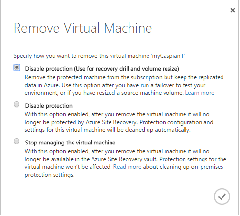

<properties
    pageTitle="Entfernen von Servern, und deaktivieren Sie den Schutz | Microsoft Azure" 
    description="Dieser Artikel beschreibt, wie Servern aus einer Website Wiederherstellung Tresor aufgehoben werden und Schutz für virtuellen Computern und physische Server zu deaktivieren." 
    services="site-recovery" 
    documentationCenter="" 
    authors="rayne-wiselman" 
    manager="jwhit" 
    editor=""/>

<tags 
    ms.service="site-recovery" 
    ms.devlang="na"
    ms.topic="article"
    ms.tgt_pltfrm="na"
    ms.workload="storage-backup-recovery" 
    ms.date="10/05/2016" 
    ms.author="raynew"/>

# Entfernen von Servern, und deaktivieren Sie den Schutz

Der Dienst Azure Website Wiederherstellung beiträgt zu Ihrer Strategie Business Continuity- und Disaster Wiederherstellung (BCDR) durch Replikation, Failover und Wiederherstellung von virtuellen Computern und physischen Servern orchestriert. Maschinen können Azure oder einem sekundären lokalen Data Center repliziert werden. Für einen schnellen Überblick lesen [Neuigkeiten Azure Website Wiederherstellung?](site-recovery-overview.md)

## (Übersicht)

Dieser Artikel beschreibt, wie Servern aus dem Tresor Website Wiederherstellung aufgehoben werden und So deaktivieren Sie den Schutz für virtuellen Computern durch Website Wiederherstellung geschützt ist. 

Posten Sie Kommentare oder Fragen am Ende dieses Artikels oder im [Azure Wiederherstellung Services-Forum](https://social.msdn.microsoft.com/forums/azure/home?forum=hypervrecovmgr).

## Aufheben der Registrierung von VMM-server

Sie die Registrierung einen VMM-Server aus einem Tresor durch Löschen des Servers auf der Registerkarte **Server** im Portal Azure Website Wiederherstellung aufheben. Beachten Sie Folgendes:

-  **Verbundene VMM-Server**: Es wird empfohlen, Sie den VMM-Server aufgehoben werden, wenn er mit Azure verbunden ist. Dadurch wird sichergestellt, dass die Einstellungen auf dem VMM-Server lokal und den VMM-Servern zugeordnet (VMM-Servern, die Wolken enthalten, die auf dem Server Wolken zugeordnet sind, die Sie löschen möchten) ordnungsgemäß bereinigt werden. Es empfiehlt sich, dass nur einen nicht verbundenen Server entfernen, wenn es ein permanent Problem mit der Konnektivität ist.
- **Nicht verbundenen VMM-Server**: Wenn VMM-Server verbunden ist, wenn Sie ihn löschen müssen Sie ein Skript manuell zum Ausführen der Aufräumen ausgeführt. Das Skript steht in der [Microsoft-Katalog](http://aka.ms/asr-cleanup-script-vmm). Beachten Sie die VMM-ID des Servers, um die manuelle Aufräumen abzuschließen.
- **VMM-Server in Cluster**: Wenn Sie einen VMM-Server aufgehoben werden, die in einem Cluster bereitgestellt werden müssen, gehen Sie wie folgt vor:

    - Wenn der Server angeschlossen ist, löschen Sie den verbundenen VMM-Server auf der Registerkarte **Server** aus. Um den Anbieter auf dem Server, melden Sie sich bei jeder Cluster-Knoten zu deinstallieren sie in der Systemsteuerung. Führen Sie zum Aufräumen Skript verwiesen wird, in dem vorherigen Abschnitt auf allen passiven Knoten im Cluster Registrierungseinträge löschen.
    - Wenn der Server nicht verbunden müssen Sie das Skript zum Aufräumen für alle Knoten ausführen.

### Aufheben der Registrierung von eines nicht verbundenen VMM-Servers

Klicken Sie auf dem VMM-Server, den Sie entfernen möchten:

1. Aufheben der Registrierung des VMM-Servers vom Azure-Portal.
2. Laden Sie das Skript zum Aufräumen auf dem Server VMM.
3. Öffnen Sie PowerShell mit Ausführen als Administratoroption aus, um die Ausführung-Richtlinien für den Standardbereich (LocalMachine) ändern.
4. Führen Sie die Schritte im Skript aus. 

Klicken Sie auf VMM-Server, die Wolken verfügen, die mit Wolken auf dem Server kombiniert werden, die Sie entfernen möchten:

1. Führen Sie die Schritte 2 bis 4, und führen Sie das Skript zum Aufräumen.
2. Geben Sie die VMM-ID für den VMM-Server, der nicht aufgehoben wurde. 
3. Mit diesem Skript werden die Registrierungsinformationen für die VMM-Server und Cloud paarweise Zuordnung Informationen entfernt.

## Aufheben der Registrierung von eines Servers Hyper-V auf einer Website Hyper-V

Bei der Bereitstellung Azure Website Wiederherstellung virtuellen Computern befindet sich auf einem Server Hyper-V auf einer Website Hyper-V (mit keine VMM-Server) schützen können Sie einen Hyper-V-Server aus einem Tresor wie folgt aufgehoben werden:

1. Deaktivieren Sie den Schutz für virtuelle Maschinen, die auf dem Server Hyper-V.
2. Wählen Sie auf der Registerkarte **Server** im Portal Azure Website Wiederherstellung den Server > löschen. Der Server können nicht mit Azure verbunden sein, wenn Sie dies tun.
3. Führen Sie das folgende Skript zum Aufräumen Einstellungen auf dem Server, und heben Sie die Registrierung aus dem Tresor. 

        pushd .
        try
        {
             $windowsIdentity=[System.Security.Principal.WindowsIdentity]::GetCurrent()
             $principal=new-object System.Security.Principal.WindowsPrincipal($windowsIdentity)
             $administrators=[System.Security.Principal.WindowsBuiltInRole]::Administrator
             $isAdmin=$principal.IsInRole($administrators)
             if (!$isAdmin)
             {
                "Please run the script as an administrator in elevated mode."
                $choice = Read-Host
                return;       
             }
    
            $error.Clear()    
            "This script will remove the old Azure Site Recovery Provider related properties. Do you want to continue (Y/N) ?"
            $choice =  Read-Host
        
            if (!($choice -eq 'Y' -or $choice -eq 'y'))
            {
            "Stopping cleanup."
            return;
            }
        
            $serviceName = "dra"
            $service = Get-Service -Name $serviceName
            if ($service.Status -eq "Running")
            {
                "Stopping the Azure Site Recovery service..."
                net stop $serviceName
            }
        
            $asrHivePath = "HKLM:\SOFTWARE\Microsoft\Azure Site Recovery"
            $registrationPath = $asrHivePath + '\Registration'
            $proxySettingsPath = $asrHivePath + '\ProxySettings'
            $draIdvalue = 'DraID'
        
            if (Test-Path $asrHivePath)
            {
                if (Test-Path $registrationPath)
                {
                    "Removing registration related registry keys."  
                    Remove-Item -Recurse -Path $registrationPath
                }
    
                if (Test-Path $proxySettingsPath)
            {
                    "Removing proxy settings"
                    Remove-Item -Recurse -Path $proxySettingsPath
                }
    
                $regNode = Get-ItemProperty -Path $asrHivePath
                if($regNode.DraID -ne $null)
                {            
                    "Removing DraId"
                    Remove-ItemProperty -Path $asrHivePath -Name $draIdValue
                }
                "Registry keys removed."
            }
    
            # First retrive all the certificates to be deleted
            $ASRcerts = Get-ChildItem -Path cert:\localmachine\my | where-object {$_.friendlyname.startswith('ASR_SRSAUTH_CERT_KEY_CONTAINER') -or $_.friendlyname.startswith('ASR_HYPER_V_HOST_CERT_KEY_CONTAINER')}
            # Open a cert store object
            $store = New-Object System.Security.Cryptography.X509Certificates.X509Store("My","LocalMachine")
            $store.Open('ReadWrite')
            # Delete the certs
            "Removing all related certificates"
            foreach ($cert in $ASRcerts)
            {
                $store.Remove($cert)
            }
        }catch
        {   
            [system.exception]
            Write-Host "Error occured" -ForegroundColor "Red"
            $error[0] 
            Write-Host "FAILED" -ForegroundColor "Red"
        }
        popd

## Beenden Sie den Schutz einer Hyper-V virtuellen Computern

Wenn Sie eine Hyper-V virtuellen Computern Schutz beenden möchten, müssen Sie dafür Schutz entfernen. Abhängigkeit, wie Sie Schutz entfernen, müssen Sie, um die Einstellungen Schutz manuell auf dem Computer zu bereinigen. 

### Aufheben des Schutzes

1. Wählen Sie auf der Registerkarte Eigenschaften der Cloud **virtuellen Computern** des virtuellen Computers > **Entfernen**.
2. Auf der Seite **Bestätigung zum Entfernen des virtuellen Computers** haben Sie zwei Optionen:

    - **Deaktivieren des Schutzes**– Wenn Sie aktivieren, und speichern diese Option des virtuellen Computers wird nicht mehr geschützt werden nach der Wiederherstellung der Website. Schutz der Einstellungen für den virtuellen Computer werden automatisch bereinigt.
    - **Aus dem Tresor entfernen**– Wenn Sie diese Option auswählen des virtuellen Computers wird nur von der Website Wiederherstellung Tresor entfernt. Lokale Schutz Einstellungen des virtuellen Computers werden davon nicht betroffen. Sie müssen manuell Einstellungen Schutz entfernen und Entfernen des virtuellen Computers aus dem Azure Abonnement entfernen Schutz Einstellungen, die Sie diese Aufräumen manuell mit den folgenden Anweisungen müssen Einstellungen aufräumen.

Wenn Sie zum Löschen des virtuellen Computers und deren Festplatten auswählen werden diese aus den Zielort entfernt.

### Aufräumen Sie Schutz Einstellungen manuell (zwischen VMM Websites)

Wenn Sie **nicht mehr Verwalten des virtuellen Computers**ausgewählt haben, Aufräumen Sie manuell Einstellungen aus:

1. Führen Sie dieses Skript auf dem primären Server aus der VMM-Konsole, um die Einstellungen für die primäre virtuellen Computern zu bereinigen. Klicken Sie in der VMM-Verwaltungskonsole auf die PowerShell-Schaltfläche, um die VMM PowerShell-Konsole zu öffnen. Ersetzen Sie SQLVM1 durch den Namen des virtuellen Computers.

         $vm = get-scvirtualmachine -Name "SQLVM1"
         Set-SCVirtualMachine -VM $vm -ClearDRProtection

2. Führen Sie dieses Skript, um die Einstellungen für die sekundären virtuellen Computers zu bereinigen, auf dem sekundären VMM-Server:

        $vm = get-scvirtualmachine -Name "SQLVM1"
        Remove-SCVirtualMachine -VM $vm -Force

3. Aktualisieren Sie auf dem sekundären VMM-Server nach dem führen Sie das Skript den virtuellen Computern auf dem Host-Server Hyper-V, so, dass der sekundäre virtuellen Computern erneut in der VMM-Verwaltungskonsole erkannt wird.
4. Die oben aufgeführten Schritte werden den Replikation Einstellungen nur VMM-Server gelöscht. Wenn Sie virtuellen Computern Replikation des virtuellen Computers entfernen möchten. Sie müssen führen Sie die nachstehenden Schritte zu der primären und sekundären virtuellen Computern. Führen Sie die unter Skript Replikation entfernen und Ersetzen von SQLVM1 durch den Namen des virtuellen Computers.

        Remove-VMReplication –VMName “SQLVM1”

### Aufräumen Sie Schutz Einstellungen manuell (zwischen lokalen VMM Websites und Azure)

1. Führen Sie dieses Skript, um die Einstellungen für die primäre virtuellen Computern zu bereinigen, auf die Quelle VMM-Server:

        $vm = get-scvirtualmachine -Name "SQLVM1"
        Set-SCVirtualMachine -VM $vm -ClearDRProtection

2. Die oben aufgeführten Schritte werden den Replikation Einstellungen nur VMM-Server deaktivieren. Stellen Sie sicher zum Entfernen der Replikation des virtuellen Computers, auf dem Hyper-V-Host-Server mit diesem Skript ausgeführt, nachdem Sie die Replikation VMM-Server entfernt haben. Ersetzen Sie SQLVM1 durch den Namen Ihrer virtuellen Computern und host01.contoso.com mit dem Namen des Servers Host Hyper-V ein.

        $vmName = "SQLVM1"
        $hostName  = "host01.contoso.com"
        $vm = Get-WmiObject -Namespace "root\virtualization\v2" -Query "Select * From Msvm_ComputerSystem Where ElementName = '$vmName'" -computername $hostName
        $replicationService = Get-WmiObject -Namespace "root\virtualization\v2"  -Query "Select * From Msvm_ReplicationService"  -computername $hostName
        $replicationService.RemoveReplicationRelationship($vm.__PATH)

### Aufräumen Sie Schutz Einstellungen manuell (zwischen Hyper-V-Websites und Azure)

1. Auf dem Server der Quelle Hyper-V-Host zum Entfernen des virtuellen Computers Replikation verwenden dieses Skript. Ersetzen Sie SQLVM1 durch den Namen des virtuellen Computers.

        $vmName = "SQLVM1"
        $vm = Get-WmiObject -Namespace "root\virtualization\v2" -Query "Select * From Msvm_ComputerSystem Where ElementName = '$vmName'"
        $replicationService = Get-WmiObject -Namespace "root\virtualization\v2"  -Query "Select * From Msvm_ReplicationService"
        $replicationService.RemoveReplicationRelationship($vm.__PATH)

## Beenden Sie den Schutz eines VMware virtuellen Computers oder einem physischen server

Wenn Sie den Schutz eines VMware virtuellen Computers oder einem physischen Server beenden möchten, müssen Sie dafür Schutz entfernen. Abhängigkeit, wie Sie Schutz entfernen, müssen Sie, um die Einstellungen Schutz manuell auf dem Computer zu bereinigen. 

### Aufheben des Schutzes

1. Wählen Sie auf der Registerkarte Eigenschaften der Cloud **virtuellen Computern** des virtuellen Computers > **Entfernen**.
2. Wählen Sie auf dem **virtuellen Computer entfernen** eine der Optionen aus:

    - **Deaktivieren des Schutzes (verwenden Sie für die Wiederherstellungsdatei Drillup und Lautstärke Größenänderungs-)**– wird nur angezeigt und aktivieren Sie diese Option aus, wenn Sie haben:
        - **Resized die Lautstärke virtuellen Computern**– Wenn Sie ein Volume Ändern der Größe des virtuellen Computers in einen kritischen Zustand wechselt. Wählen Sie diese Option, wenn diese Situation vorliegt. Schutz Beibehaltung der Wiederherstellungspunkte in Azure deaktiviert. Wenn Sie wieder Schutz des Computers aktivieren werden die Daten für die Lautstärke geänderter Größe in Azure übertragen.
        - **Ausführen ein Failovers**– Nachdem Sie Ihre Umgebung durch Ausführen eines Failovers aus lokalen VMware virtuellen Computern oder physischen Servern in Azure getestet haben, wählen Sie diese Option, um erneut mit dem Schutz Ihrer lokalen virtuellen Computern beginnen. Dieser Option wird jeder virtuelle Computer deaktiviert, und klicken Sie dann müssen, Schutz für diese wieder zu aktivieren. Beachten Sie Folgendes:
            - Deaktivieren des virtuellen Computers mit dieser Einstellung wirkt sich nicht auf das Replikat virtuellen Computern in Azure.
            - Sie darf nicht den Dienst Mobilität von virtuellen Computers deinstallieren.
    
    - **Deaktivieren des Schutzes**– Wenn Sie aktivieren, und speichern diese Option des Computers wird nicht mehr geschützt werden nach der Wiederherstellung der Website. Schutz der Einstellungen für den Computer werden automatisch bereinigt.
    - **Aus dem Tresor entfernen**– Wenn Sie diese Option auswählen, der Computer nur von der Website Wiederherstellung Tresor entfernt werden. Lokale Schutz Einstellungen für den Computer werden davon nicht betroffen. Einstellungen auf dem Computer zu entfernen und So entfernen Sie den virtuellen Computer aus der Azure müssen-Abonnement und Sie die Einstellungen bereinigen, indem Sie den Dienst Mobilität deinstallieren.
    
        

