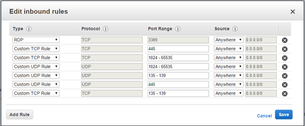

<properties
    pageTitle="Migrieren der Windows-virtuellen Computern Amazon-Webdiensten auf Azure mit Website Wiederherstellung | Microsoft Azure"
    description="Dieser Artikel beschreibt, wie virtuelle Windows Maschinen in Amazon Web Services (AWA) in Azure mit Azure Website Wiederherstellung migrieren."
    services="site-recovery"
    documentationCenter=""
    authors="rayne-wiselman"
    manager="jwhit"
    editor=""/>

<tags
    ms.service="site-recovery"
    ms.devlang="na"
    ms.topic="article"
    ms.tgt_pltfrm="na"
    ms.workload="backup-recovery"
    ms.date="08/22/2016"
    ms.author="raynew"/>

#  Migrieren von Windows-virtuellen Computern in Amazon Web Services (AWS) zu Azure mit Azure Website Wiederherstellung

## (Übersicht)

Willkommen bei der Wiederherstellung Azure-Website. Lesen Sie diesen Artikel zum Migrieren von Windows Instanzen in AWS in Azure mit Website Wiederherstellung ausgeführt. Bevor Sie beginnen, beachten Sie Folgendes:

- Azure weist zwei verschiedenen Bereitstellungsmodelle für das Erstellen und Arbeiten mit Ressourcen: Azure Ressourcenmanager und Classic. Azure verfügt auch über zwei communityportalen – Azure klassischen Portals, die das Bereitstellungsmodell klassischen unterstützt, und der Azure-Portal mit Unterstützung für beide Bereitstellungsmodelle. Die grundlegenden Schritte für die Migration sind gleich, ob Sie Website Wiederherstellung in Ressourcenmanager oder klassische konfigurieren möchten. Jedoch die Benutzeroberfläche Anweisungen und Screenshots in diesem Artikel für das Azure Portal relevant sind.
- **Zurzeit können Sie nur von AWS in Azure migrieren. Ein Fehler auftreten, über virtuelle Computer aus AWS Azure, aber Sie können keine nicht diese wieder erneut. Es gibt keine laufenden Replikation aus.**
- Die Migration Anweisungen in diesem Artikel basieren auf den Anweisungen für die Replikation von eines physischen Computers auf Azure. Sie enthält Links zu den Schritten in [virtuelle VMware-Computer repliziert oder physischen Servern in Azure](site-recovery-vmware-to-azure.md), die beschreibt, wie einen physischen Server in der Azure-Portal repliziert.
- Wenn Sie Website Wiederherstellung im klassischen Portal einrichten, folgen Sie den detaillierten Anweisungen in [diesem Artikel](site-recovery-vmware-to-azure-classic.md). **Sie sollten nicht mehr** den Anweisungen in diesem [Artikel älterer Versionen](site-recovery-vmware-to-azure-classic-legacy.md).

Posten Sie Kommentare oder Fragen am Ende dieses Artikels oder im [Azure Wiederherstellung Services-Forum](https://social.msdn.microsoft.com/forums/azure/home?forum=hypervrecovmgr)

## Erforderliche Komponenten

Hier sind die Voraussetzungen für die Bereitstellung

- **Konfigurations-Server**: eine lokale virtueller Computer unter Windows Server 2012 R2 als Konfigurationsserver fungiert. Installation die anderen Website Wiederherstellung Komponenten (einschließlich der Prozess Servers und einer Gestaltungsvorlage Ziel) dieses virtuellen Computers zu. Erfahren Sie mehr in [Szenario Architektur](site-recovery-vmware-to-azure.md#scenario-architecture) und [Konfiguration Server erforderliche Komponenten](site-recovery-vmware-to-azure.md#configuration-server-prerequisites).
- **Instanzen EC2 virtueller Computer**: Instanzen Windows ausgeführt, die Sie migrieren möchten.

## Vor der Bereitstellung

In diesem Abschnitt werden die Schritte im neuen Azure-Portal an. Wenn Sie diese Bereitstellungsschritte in der klassischen Portal für die Website Wiederherstellung benötigen, finden Sie in [diesem Artikel](site-recovery-vmware-to-azure-classic.md).

1. [Erstellen einer Tresor](site-recovery-vmware-to-azure.md#create-a-recovery-services-vault).
2. [Bereitstellen einer Konfiguration-Servers](site-recovery-vmware-to-azure.md#step-2-set-up-the-source-environment).
3. Nachdem Sie den Konfigurationsserver bereitgestellt haben, überprüfen Sie, dass es kommunizieren kann mit den virtuellen Computern, die Sie migrieren möchten.
4. [Einrichten von Replikation Einstellungen](site-recovery-vmware-to-azure.md#step-4-set-up-replication-settings). Erstellen einer Replikationsrichtlinie und auf dem Konfigurationsserver zuweisen.
5. [Installieren Sie den Dienst Mobilität](site-recovery-vmware-to-azure.md#step-6-replication-application). Jeder virtueller Computer, die Sie schützen möchten benötigt Mobilität Dienst installiert. Dieser Dienst sendet Daten an den Prozess-Server. Der Dienst Mobilität kann manuell installiert oder abgelegt und automatisch installiert durch den Prozess-Server Wenn Schutz für den virtuellen Computer aktiviert ist. Firewall-Regeln auf EC2 Instanzen, die Sie migrieren möchten sollte konfiguriert sein, um Pushbenachrichtigungen Installation von diesen Dienst ermöglichen. Die Sicherheitsgruppe für EC2 Instanzen sollte die folgenden Regeln aufzustellen:

    

6. Die [Replikation aktivieren](site-recovery-vmware-to-azure.md#enable-replication). Aktivieren Sie die Replikation für die virtuellen Computern, die Sie migrieren möchten. Sie können erkennen, dass die EC2 Instanzen mit der privaten IP-Adressen, die Sie aus der EC2-Verwaltungskonsole zugreifen können.
7. [Ausführen ein ungeplantes Failover](site-recovery-failover.md#run-an-unplanned-failover). Nach Abschluss der ersten Replikation, können Sie ein ungeplantes Failover über AWS in Azure für jeden virtuellen Computer ausführen. Optional können Sie einen Wiederherstellungsplan erstellen und Ausführen ein ungeplantes Failover, um mehrere virtuelle Computer in Azure AWS migrieren. [Erfahren Sie mehr](site-recovery-create-recovery-plans.md) über Wiederherstellung Pläne.

## Nächste Schritte

Weitere Informationen zu anderen Replikationsszenarien in [Neuigkeiten Azure Website Wiederherstellung?](site-recovery-overview.md)
