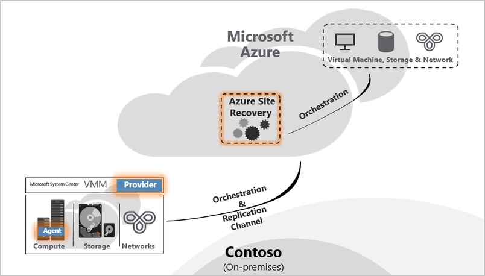
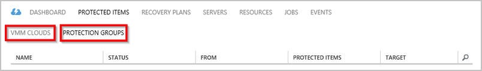
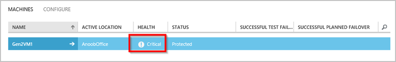
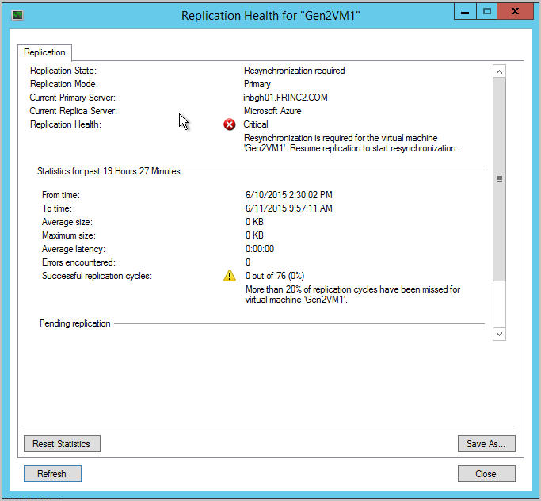
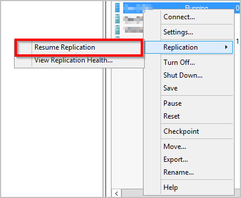
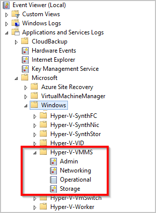
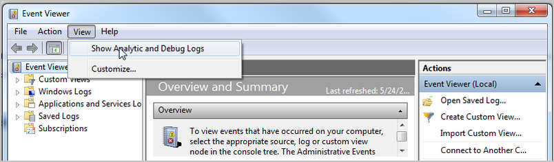
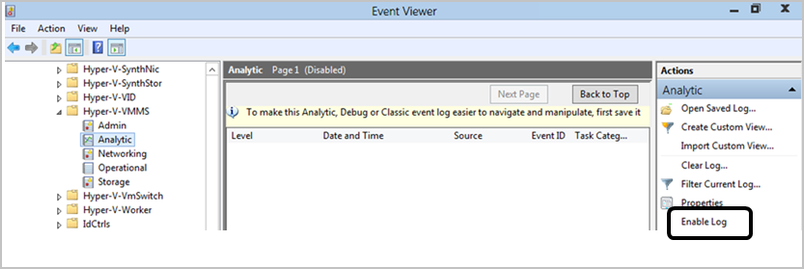

<properties
    pageTitle="Überwachen und Behandeln von Problemen mit Schutz für virtuellen Computern und physische Server | Microsoft Auzre" 
    description="Azure Website Wiederherstellung koordiniert die Replikation, Failover- und von virtuellen Computern befinden sich auf lokalen Servern Azure oder einem sekundären Datencenter. Verwenden Sie in diesem Artikel zum Überwachen und Behandeln von Problemen mit Schutz von VMM oder Hyper-V-Website ein." 
    services="site-recovery" 
    documentationCenter="" 
    authors="anbacker" 
    manager="mkjain" 
    editor=""/>

<tags 
    ms.service="site-recovery" 
    ms.devlang="na"
    ms.topic="article"
    ms.tgt_pltfrm="na"
    ms.workload="storage-backup-recovery" 
    ms.date="10/13/2016"    
    ms.author="rajanaki"/>
    
# Überwachen Sie und Behandeln von Problemen mit Schutz für virtuellen Computern und physische Server

Diese Überwachung und Problembehandlung ermöglicht es Ihnen, erfahren Sie die Replikation Integrität nachverfolgen und Techniken für die Website Wiederherstellung Azure zur Problembehandlung aus.

## Grundlegendes zu den Komponenten

### VMware/physische Site Deployment für die Replikation zwischen lokalen und Azure.
Um Setup DR zwischen lokalen VMware/physische Computer; Konfigurations-Servers, Master Ziel und Prozess muss konfiguriert. Beim Aktivieren der Schutz für den Quellserver installiert Azure Website Wiederherstellung Mobilität-Dienst aus. Beitrag lokalen Ausfall sobald die Quellserver fehlschlägt-Over in Azure, Kunden muss für die Einrichtung von einem Server Prozess in Azure und lokale zum Schutz des Quellservers wieder in neu erstellten lokalen einem Master Ziel-Server. 

### VMM Website-Bereitstellung für die Replikation zwischen lokalen Website.

Im Rahmen der Einrichtung DR zwischen zwei lokalen Speicherort; Azure Website Wiederherstellung Anbieter muss heruntergeladen und auf dem Server VMM installiert werden. Anbieter benötigt Internet Connectivity, um sicherzustellen, dass alle Vorgänge ausgelöst wurde vom Azure-Portal auf lokale-Operationen wie Schutz, aktivieren war(en) primären Seite virtuellen Computern als Teil des Failoverzeitraums usw. umgewandelt wird.

### VMM-Bereitstellung für die Replikation zwischen lokalen und Azure-Website.

Im Rahmen der Einrichtung DR zwischen lokalen und Azure; Azure Website Wiederherstellung Anbieter muss heruntergeladen und installiert werden, auf dem Server VMM zusammen mit Azure Wiederherstellung Services-Agent der muss auf jedem Hyper-V-Host installiert sein. Weitere Informationen finden Sie unter [Grundlegendes zu Website Azure Schutz](./site-recovery-understanding-site-to-azure-protection.md) .

### Bereitstellung von Hyper-V-Website für die Replikation zwischen lokalen und Azure

Dies ist der VMM-Bereitstellung identisch – nur Unterschied Anbieter & Agent wird auf dem Host von Hyper-V selbst installiert wird. Weitere Informationen finden Sie unter [Grundlegendes zu Website Azure Schutz](./site-recovery-understanding-site-to-azure-protection.md) .

## Überwachen von Konfiguration, Schutz und Wiederherstellung

Jeder Vorgang in ASR überwacht wird und unter der Registerkarte "Aufträge" verfolgt wird. Navigieren Sie bei einem beliebigen Konfiguration, Schutz oder Fehler bei der Wiederherstellung zu der Registerkarte Aufträge und festzustellen Sie, ob Fehler auftreten.

Nachdem Sie Fehlern unter der Ansicht Aufträge gefunden haben, wählen Sie den Auftrag, und klicken Sie auf FEHLERDETAILS für dieses Projekt.

Die Fehlerdetails helfen Ihnen mögliche Ursache und Empfehlungen für das Problem zu identifizieren.

Im obigen Beispiel scheint von einem anderen Vorgang was abgehalten wird aufgrund der Konfiguration für den Schutz fehlschlägt. Stellen Sie sicher, dass Sie das Problem gemäß empfohlen – dort nach, klicken Sie auf RESART, um den Vorgang erneut zu initiieren auflösen.

Option zum Neustart ist nicht verfügbar für alle Vorgänge – für diejenigen, die die Option RESTART, navigieren Sie wieder auf das Objekt, und wiederholen Sie den Vorgang erneut aufweist. Jeder kann an einer beliebigen Stelle der Zeit und Vorgangsstatus mithilfe der Schaltfläche "Abbrechen" abgebrochen werden.

## Überwachen der Replikation Gesundheit für virtuellen Computern

ASR Anbieter zentralen und remote-Überwachung über das Azure-Portal für jede der geschützten Elemente. Navigieren Sie auf die GESCHÜTZTEN Elemente dort nach select VMM WOLKEN oder SCHUTZGRUPPEN. VMM WOLKEN Registerkarte ist nur für VMM Grundlage Bereitstellungen und alle anderen Szenarien haben die geschützten Elemente unter der Registerkarte SCHUTZGRUPPEN.

Dort nach Auswählen der geschützten Entität unter der jeweiligen Cloud oder der Gruppe "Schutz". Nach Auswahl die geschützte Entität alle zulässig sind Vorgänge im unteren Bereich angezeigt.

Im Fall des virtuellen Computers obigen Gesundheit kritisch – ist können Sie die FEHLERDETAILS auf nach unten, um den Fehler finden Sie unter klicken. Basierend auf der "möglichen Ursachen" und "Empfohlen" erwähnt kann das Problem beheben.

Hinweis: Wenn aktiven Vorgänge in Bearbeitung oder Fehler beim gehören vorhanden sind dann navigieren Sie zu der EINZELVORGÄNGE Ansicht wie bereits zuvor erwähnt, den Auftrag Fehler anzeigen.

## Behandeln von Problemen für lokale Hyper-V

Verbinden mit der lokalen Hyper-V-Manager-Verwaltungskonsole, wählen Sie die virtuellen Computern und finden Sie unter die Replikation Integrität.

In diesem Fall ist die *Replikation Gesundheit* als kritisch – *Ansicht Replikation Systemzustand* , um die Details finden Sie unter angezeigt wird.

Fälle, in dem Replikation des virtuellen Computers angehalten ist, mit der rechten Maustaste Select *Replikation*->*Lebenslauf Replikation*

Falls virtuellen Computern einen neuen Hyper-V-Host (innerhalb der Cluster oder einem eigenständigen Computer), migriert die ASR konfiguriert wurde werden, würde nicht Replikation für den virtuellen Computer beeinträchtigt werden. Stellen Sie sicher, dass der neue Hyper-V-Host alle die pro-Komponenten erfüllt und mit ASR konfiguriert ist.

### Ereignisprotokoll

| Ereignisquellen                | Details                                                                                                                                                                                           |
|-------------------------  |:------------------------------------------------------------------------------------------------------------------------------------------------------------------------------------------------------    |
| **Anwendungen und Protokolle/Microsoft/VirtualMachineManager/Server/Dienstadministrator** (VMM Server)   |  Auf diese Weise hilfreich Protokollierung für Behandeln von Problemen mit vielen verschiedenen VMM. |
| **Anwendungen und Protokolle/MicrosoftAzureRecoveryServices/Replikation** (Hyper-V-Host)   | Auf diese Weise hilfreich Protokollierung für Behandeln von Problemen mit Microsoft Azure Wiederherstellung Services Agent viele.    |
| **Anwendungen und Dienst Protokolle/Microsoft/Azure Website Wiederherstellung/Anbieter/Betrieb** (Hyper-V-Host)   | Auf diese Weise hilfreich Protokollierung zur Behandlung dieses Problems viele Microsoft Azure-Website Wiederherstellung Dienstprobleme.    |
| **Anwendungen und Protokolle/Microsoft/Windows/Hyper-V-VMMS/Dienstadministrator** (Hyper-V-Host) | Auf diese Weise hilfreich Protokollierung für Behandeln von Problemen mit vielen Hyper-V virtuellen Computern Management.    |

### Hyper-V Protokollierung Replikationsoptionen

Alle Ereignisse im Zusammenhang Hyper-V Replica Hyper-V-VMMS angemeldet sind\\Admin-Protokoll finden Sie unter **Anwendungen und Dienste Protokolle\\Microsoft\\Windows**. Darüber hinaus kann ein analytisches Log für Hyper-V-VMMS aktiviert werden. Um dieses Protokoll zu aktivieren, sollten Sie zuerst die Protokolle der analytischen und Debuggen kann in der Ereignisanzeige angezeigt werden. Öffnen Sie die Ereignisanzeige, klicken Sie dann im **Menü ' Ansicht '**, klicken Sie auf **analytischen anzeigen und Debuggen von Protokollen**.

Ein analytisches Log wird unter Hyper-V-VMMS angezeigt

Klicken Sie im Bereich **Aktionen** auf **Log aktivieren**. Sobald aktiviert ist, wird Sie in **Performance Monitor** , wie ein Ereignis Spur Sitzung finden Sie unter **Collection Datasets.**

Zum Anzeigen der erfassten Informationen werden zuerst beenden Sie die Sitzung gezeichnet, die durch das Protokoll zu deaktivieren und dann speichern Sie das Protokoll und öffnen Sie es erneut in der Ereignisanzeige oder verwenden Sie andere Tools, wie gewünscht zu konvertieren.

## Anbieten, für den Microsoft-Support

### Log-Websitesammlung

Schutz VMM Website finden Sie unter Sammeln der erforderlichen Protokolle [ASR Log Websitesammlung mithilfe von Tools für die Unterstützung Diagnose Plattform (SDP)](http://social.technet.microsoft.com/wiki/contents/articles/28198.asr-data-collection-and-analysis-using-the-vmm-support-diagnostics-platform-sdp-tool.aspx) .

Laden Sie für den Schutz von Hyper-V-Website das [Tool](https://dcupload.microsoft.com/tools/win7files/DIAG_ASRHyperV_global.DiagCab) , und führen Sie sie auf dem Host Hyper-V die Protokolle sammeln.

VMware/physische Szenarien finden Sie unter [Azure-Wiederherstellung Log-Websitesammlung für VMware und physisch Website Schutz](http://social.technet.microsoft.com/wiki/contents/articles/30677.azure-site-recovery-log-collection-for-vmware-and-physical-site-protection.aspx) Sammeln der erforderlichen Protokolle.

Tool sammelt die Protokolle lokal unter einem zufällig benannten Unterordner unter **%LocalAppData%\ElevatedDiagnostics**

### Öffnen einer Support-ticket

Zum Support-Ticket für ASR auslösen erreichen Sie, um Azure unterstützen, indem Sie die URL zu <http://aka.ms/getazuresupport>

## Knowledge Base-Artikel

-   [Wie Sie den Buchstaben des Laufwerks für geschützten virtuellen Computern beibehalten, die über einen Fehler oder auf Azure migriert werden](http://support.microsoft.com/kb/3031135)
-   [Zum Verwalten der lokalen Azure Schutz Netzwerk Bandbreite Einsatz](https://support.microsoft.com/kb/3056159)
-   [ASR: "die Ressource nicht gefunden" zurück, bei dem Versuch, aktivieren Sie den Schutz für einen virtuellen Computer](http://support.microsoft.com/kb/3010979)
-   [Erkennen Sie und Beheben von Hyper-V Replica Leitfaden](http://www.microsoft.com/en-in/download/details.aspx?id=29016) 

## Allgemeine ASR Fehler und deren Auflösung

Nachstehend sind die häufigen, die Sie treffen möglicherweise und dazugehörigen Lösungen. Jede des Fehlers ist in einer separaten Wiki-Seite beschrieben.

### Allgemeine
-   Neu [Aufträge weiß nicht Fehler "ein Vorgang ausgeführt wird." Fehler 505, 514, 532](http://social.technet.microsoft.com/wiki/contents/articles/32190.azure-site-recovery-jobs-failing-with-error-an-operation-is-in-progress-error-505-514-532.aspx)
-   Neu [Aufträge weiß nicht mit dem Fehler "Server ist nicht mit dem Internet verbunden". Fehler 25018](http://social.technet.microsoft.com/wiki/contents/articles/32192.azure-site-recovery-jobs-failing-with-error-server-isn-t-connected-to-the-internet-error-25018.aspx)

### Setup
-   [Interner Fehler kann der VMM-Server registriert werden. Finden Sie in der Ansicht Aufträge im Portal Wiederherstellung Website weitere Details zu dem Fehler. Führen Sie Setup erneut aus, um den Server zu registrieren.](http://social.technet.microsoft.com/wiki/contents/articles/25570.the-vmm-server-cannot-be-registered-due-to-an-internal-error-please-refer-to-the-jobs-view-in-the-site-recovery-portal-for-more-details-on-the-error-run-setup-again-to-register-the-server.aspx)
-   [Zum Hyper-V Wiederherstellung Manager Tresor kann eine Verbindung hergestellt werden. Überprüfen Sie die Proxyeinstellungen, oder versuchen Sie es später erneut.](http://social.technet.microsoft.com/wiki/contents/articles/25571.a-connection-cant-be-established-to-the-hyper-v-recovery-manager-vault-verify-the-proxy-settings-or-try-again-later.aspx)

### Konfiguration
-   [Zum Erstellen der Gruppe "Schutz" können nicht genutzt werden: Fehler beim Abrufen der Liste der Server.](http://blogs.technet.com/b/somaning/archive/2015/08/12/unable-to-create-the-protection-group-in-azure-site-recovery-portal.aspx)
-   [Hyper-V-Hostcluster enthält mindestens eine statische Netzwerkadapter oder keine verbundenen Netzwerkadapter Verwendung von DHCP konfiguriert werden.](http://social.technet.microsoft.com/wiki/contents/articles/25498.hyper-v-host-cluster-contains-at-least-one-static-network-adapter-or-no-connected-adapters-are-configured-to-use-dhcp.aspx)
-   [VMM verfügt nicht über Berechtigungen zum Ausführen einer Aktion](http://social.technet.microsoft.com/wiki/contents/articles/31110.vmm-does-not-have-permissions-to-complete-an-action.aspx)
-   [Wählen Sie das Speicherkonto innerhalb des Abonnements beim Konfigurieren des Schutzes nicht möglich](http://social.technet.microsoft.com/wiki/contents/articles/32027.can-t-select-the-storage-account-within-the-subscription-while-configuring-protection.aspx)

### Schutz
- Neu Mit "konnten nicht Fehler Schutz des virtuellen Computers konfiguriert sein" [Schutz aktivieren-fehl. Fehler 60007, 40003](http://social.technet.microsoft.com/wiki/contents/articles/32194.azure-site-recovery-enable-protection-failing-with-error-protection-couldn-t-be-configured-for-the-virtual-machine-error-60007-40003.aspx)
- Neu [Schutz aktivieren fehlerhaften mit "konnten nicht Fehler Schutz des virtuellen Computers aktiviert werden." Fehler 70094](http://social.technet.microsoft.com/wiki/contents/articles/32195.azure-site-recovery-enable-protection-failing-with-error-protection-couldn-t-be-enabled-for-the-virtual-machine-error-70094.aspx)
- Neu [Live-Migrationsfehler 23848 - des virtuellen Computers ist Typ Live mit verschoben werden soll. Dies kann den Wiederherstellung Schutzstatus des virtuellen Computers unterbrechen.](http://social.technet.microsoft.com/wiki/contents/articles/32021.live-migration-error-23848-the-virtual-machine-is-going-to-be-moved-using-type-live-this-could-break-the-recovery-protection-status-of-the-virtual-machine.aspx) 
- [Aktivieren des Schutzes fehlgeschlagen ist, da der Agent nicht auf dem Host-Computer installiert](http://social.technet.microsoft.com/wiki/contents/articles/31105.enable-protection-failed-since-agent-not-installed-on-host-machine.aspx)
- [Berechnen Sie ein geeigneter Host für Replikat virtuellen Computers kann nicht gefunden werden - aufgrund von niedrig zu Ressourcen](http://social.technet.microsoft.com/wiki/contents/articles/25501.a-suitable-host-for-the-replica-virtual-machine-can-t-be-found-due-to-low-compute-resources.aspx)
- [Ein geeigneter Host für Replikat virtuellen Computers werden nicht - aufgrund keine logischen Netzwerk verbunden gefunden](http://social.technet.microsoft.com/wiki/contents/articles/25502.a-suitable-host-for-the-replica-virtual-machine-can-t-be-found-due-to-no-logical-network-attached.aspx)
- [Kann keine Verbindung herstellen mit dem Replikat Host-Computer - Verbindung konnte nicht hergestellt werden](http://social.technet.microsoft.com/wiki/contents/articles/31106.cannot-connect-to-the-replica-host-machine-connection-could-not-be-established.aspx)

### Wiederherstellung
- Den Vorgang Host kann nicht VMM abgeschlossen werden-
    -   [Möglicher Fehler über dem ausgewählten Wiederherstellung Punkt für virtuellen Computern: Allgemeine Zugriff verweigert zurück.](http://social.technet.microsoft.com/wiki/contents/articles/25504.fail-over-to-the-selected-recovery-point-for-virtual-machine-general-access-denied-error.aspx)
    -   [Hyper-V über dem ausgewählten Wiederherstellung Punkt für virtuellen Computern treten Fehler: der Vorgang wurde abgebrochen versuchen, einen neueren Wiederherstellungspunkt. (0 x 80004004)](http://social.technet.microsoft.com/wiki/contents/articles/25503.hyper-v-failed-to-fail-over-to-the-selected-recovery-point-for-virtual-machine-operation-aborted-try-a-more-recent-recovery-point-0x80004004.aspx)
    -   Eine Verbindung mit dem Server konnte nicht definierte (0x00002EFD) werden.
        -   [Fehler beim Aktivieren der reverse Replikation für virtuellen Computern Hyper-V](http://social.technet.microsoft.com/wiki/contents/articles/25505.a-connection-with-the-server-could-not-be-established-0x00002efd-hyper-v-failed-to-enable-reverse-replication-for-virtual-machine.aspx)
        -   [Fehler beim Aktivieren der Replikation für virtuellen Computern virtuellen Computern Hyper-V](http://social.technet.microsoft.com/wiki/contents/articles/25506.a-connection-with-the-server-could-not-be-established-0x00002efd-hyper-v-failed-to-enable-replication-for-virtual-machine-virtual-machine.aspx)
    -   [Failover für virtuellen Computern konnte kein Commit ausgeführt.](http://social.technet.microsoft.com/wiki/contents/articles/25508.could-not-commit-failover-for-virtual-machine.aspx)
-   [Der Wiederherstellungsplan enthält virtuellen Computern, die nicht für die geplanten Failover bereit sind](http://social.technet.microsoft.com/wiki/contents/articles/25509.the-recovery-plan-contains-virtual-machines-which-are-not-ready-for-planned-failover.aspx)
-   [Des virtuellen Computers nicht geplanten Failoververarbeitung bereit ist.](http://social.technet.microsoft.com/wiki/contents/articles/25507.the-virtual-machine-isn-t-ready-for-planned-failover.aspx)
-   [Virtuellen Computern nicht ausgeführt wird und nicht ausgeschaltet](http://social.technet.microsoft.com/wiki/contents/articles/25510.virtual-machine-is-not-running-and-is-not-powered-off.aspx)
-   [Out-of-Band-Vorgang ist auf einen virtuellen Computern und Commit Failover fehlgeschlagen](http://social.technet.microsoft.com/wiki/contents/articles/25507.the-virtual-machine-isn-t-ready-for-planned-failover.aspx)
-   Testen des Failoververhaltens
    -   [Failover konnte nicht initiiert werden, da Test Failover ausgeführt wird](http://social.technet.microsoft.com/wiki/contents/articles/31111.failover-could-not-be-initiated-since-test-failover-is-in-progress.aspx)
-   Neu  Failover tritt ein Timeout mit 'PreFailoverWorkflow Task WaitForScriptExecutionTaskTimeout' aufgrund der Konfiguration Einstellungen der Netzwerk-Sicherheitsgruppe zugeordnet des virtuellen Computers oder das Subnetz, zu dem der Computer gehört. Details finden Sie unter ["PreFailoverWorkflow Aufgabe WaitForScriptExecutionTaskTimeout"](https://aka.ms/troubleshoot-nsg-issue-azure-site-recovery) .

### Konfiguration Server, Prozessserver Master Ziel
Konfigurationsserver (CS), Prozessserver (PS), Master Targer (MT)
-   [Der ESXi-Host auf dem die PS/k gehostet wird, wie ein virtueller Computer mit einem violetten Bildschirm Death schlägt fehl.](http://social.technet.microsoft.com/wiki/contents/articles/31107.vmware-esxi-host-experiences-a-purple-screen-of-death.aspx)

### Remotedesktop Problembehandlung nach failover
-   Viele Kunden haben Probleme über virtueller Computer in Azure Verbindung zu den fehlerhaften konfrontiert. [Verwenden Sie das Dokument zur Problembehandlung RDP in den virtuellen Computer](http://social.technet.microsoft.com/wiki/contents/articles/31666.troubleshooting-remote-desktop-connection-after-failover-using-asr.aspx)

#### Hinzufügen von eine öffentliche IP-Adresse einer Ressource-Manager virtuellen Computern
Wenn die Schaltfläche **Verbinden** im Portal abgeblendeter, und es keine Azure über einen Express-Routing oder Website-zu-Standort VPN-Verbindung besteht, müssen Sie erstellen und Ihre virtuellen Computer eine öffentliche IP-Adresse zuweisen, bevor Sie RDP/SSH verwenden können. Gehen Sie folgendermaßen vor, um eine öffentliche IP-Adresse an der Schnittstelle des virtuellen Computers hinzuzufügen.  

