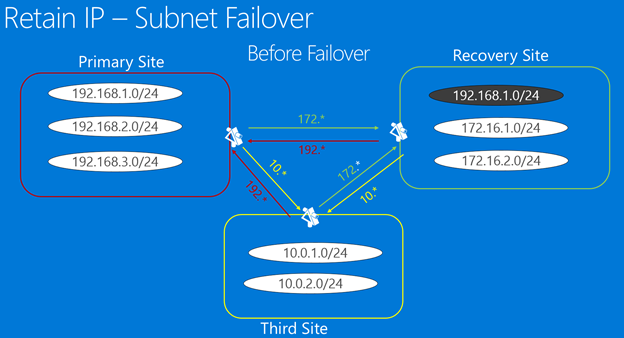
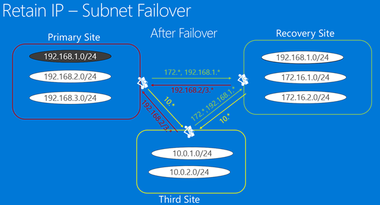
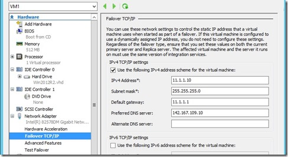
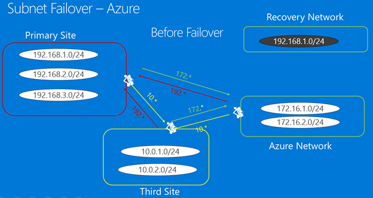
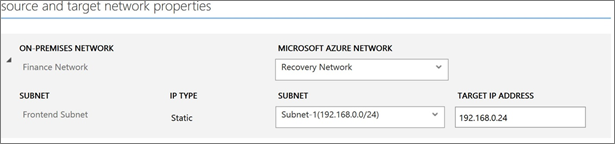
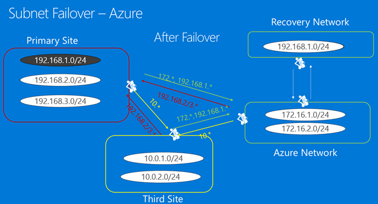
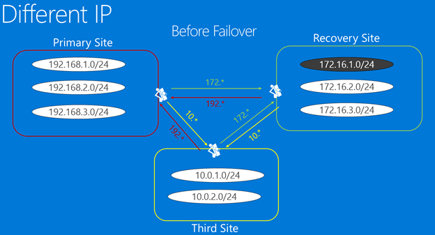
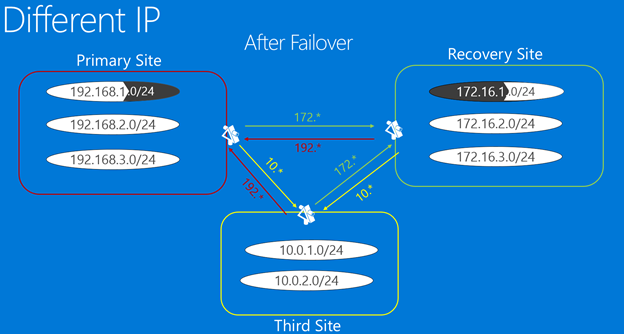

<properties
    pageTitle="Entwerfen der Infrastruktur des Netzwerks für die Wiederherstellung | Microsoft Azure"
    description="In diesem Artikel wird erläutert, gibt Netzwerk für Azure Website Wiederherstellung"
    services="site-recovery"
    documentationCenter=""
    authors="prateek9us"
    manager="jwhit"
    editor=""/>

<tags
    ms.service="site-recovery"
    ms.devlang="na"
    ms.topic="article"
    ms.tgt_pltfrm="na"
    ms.workload="storage-backup-recovery"
    ms.date="09/19/2016"
    ms.author="pratshar"/>

#  Entwerfen der Infrastruktur des Netzwerks für die Wiederherstellung

In diesem Artikel wird an IT-Experten weitergeleitet, die verantwortlich für die Architektur, implementieren und unterstützen und verbessern Sie ihre Dienste BCDR Unterstützung Geschäftskontinuität und Wiederherstellungsinfrastruktur (BCDR) und wer Microsoft Azure Website Wiederherstellung (ASR), nutzen möchten. Dieses Dokument befasst praktische Aspekte für die Bereitstellung von System Center virtuellen Computern Manager Server, die vor- und Nachteile der gestreckt Subnetze im Vergleich zu Subnetz Failover und Wiederherstellung für virtuelle Websites in Microsoft Azure strukturieren.

## (Übersicht)

[Azure Website Wiederherstellung (ASR)](https://azure.microsoft.com/services/site-recovery/) ist ein Microsoft Azure-Dienst, der den Schutz und Wiederherstellung Ihrer virtualisierten Programme für Business Continuity (BCDR) Wiederherstellungszwecke koordiniert. Dieses Dokument wird den Reader durch das Verfahren der Netzwerke entwerfen Konzentration auf Architektur IP-Adressbereiche und Subnetze auf Notfallwiederherstellungsstandort, bei der Replikation von virtuellen Computern (virtuellen Computern) mit Website Wiederherstellung Leitfaden soll.

Dieser Artikel beschreibt darüber hinaus wie Website Wiederherstellung ermöglicht, die Architektur und Implementieren eines aktivierter virtuellen Datencenters BCDR Services zum Zeitpunkt der Test oder Disaster unterstützt.

In einer Welt, in dem alle 24/7 Connectivity erwartet wird, ist es mehr wichtig als je zuvor Ihre Infrastruktur und Applikationen aufrechterhalten und ausgeführt. Der Zweck der Geschäftskontinuität und Disaster Wiederherstellung (BCDR) ist Fehler beim Komponenten wiederherstellen, damit die Organisation schnell normale Vorgänge fortgesetzt werden kann. Entwickeln Strategien für zur Wiederherstellung wahrscheinlich nicht, verheerend Ereignisse behandelt ist sehr anspruchsvoll. Dies ist aufgrund gehörende schwierig, sieht die Zukunft Vorhersage besonders im Hinblick auf unmögliches Ereignisse und den hohen Kosten ausreichend Measures Schutz vor weit reichende Interaktion bereitstellen betrachtet. 

Für die Planung BCDR entscheidend, müssen Wiederherstellung Time Ziel (RTO) und Wiederherstellung Point Ziel (RPO) als Teil eines Plans zur Wiederherstellung definiert werden. Wenn der vom Kunden Data Center Azure Website Wiederherstellung, Kunden können schnell verwenden (niedrig RTO) Katastrophe Onlineschalten Sie repliziert virtuelle Computer befindet sich im entweder sekundäre Datacenter oder Microsoft Azure mit minimalen Datenverlust (niedriger RPO). 

Failover wird durch ASR ermöglicht das Anfangs kopiert vorgesehenen virtuellen Computern aus der Mitte des primären Daten in das sekundäre Data Center oder in Azure (je nach dem Szenario), und klicken Sie dann die Replikate in bestimmten Abständen aktualisiert. Während der Planung von Infrastruktur sollte Netzwerkentwurf als möglicher Engpass angesehen werden, die Sie aus der Besprechung Unternehmen RTO und RPO Ziele verhindern können.  

Wenn Administratoren planen, eine Disaster Wiederherstellung Lösung bereitstellen, ist eine der wichtigsten Fragen in deren Grundschülern wie des virtuellen Computers erreichbar ist nach dem Abschluss der. ASR kann der Administrator das Netzwerk auszuwählen, mit dem nach einem Failover ein virtuellen Computers zu verbunden werden möchten. Wenn der primäre Standort von einem Server VMM verwaltet wird wird dies erreicht Netzwerk Zuordnung verwenden. Weitere Informationen hierzu finden Sie unter [Vorbereiten für die Zuordnung Netzwerk](site-recovery-network-mapping.md) .

Während des Entwurfs im Netzwerks für die Website Wiederherstellung, hat der Administrator zwei Optionen:

- Verwenden Sie einen anderen IP-Adressenbereich für das Netzwerk Wiederherstellung Website ein. In diesem Szenario des virtuellen Computers nach Failover eine neue IP-Adresse erhalten, und der Administrator nutzen, müssen Sie eine Aktualisierung von DNS-führen. Lesen Sie weitere Informationen zum Führen Sie die DNS-Einträge aktualisieren [hier](site-recovery-vmm-to-vmm.md#test-your-deployment) 
- Verwenden Sie derselben IP-Adressenbereich für das Netzwerk bei der Wiederherstellung Website an. In bestimmten Szenarien bevorzugen Administratoren die IP-Adressen beibehalten, die sie auf der primären Website auch nach dem Failover. In einem normalen Szenario müssten Administrator Aktualisieren der weitergeleitet, um die neue Position der IP-Adressen anzugeben. Aber in dem Szenario, wo ein gestreckter VLAN zwischen der primären und der Wiederherstellung Websites bereitgestellt wird, eine attraktive Option wird die IP-Adressen für die virtuellen Computer beibehalten. Das gleiche IP planmäßigen Adressen erleichtert die Wiederherstellung Entfernung von jedes Netzwerk Zusammenhang Beitrag-Failover Schritte.

Wenn Administratoren planen, eine Disaster Wiederherstellung Lösung bereitstellen, ist eine der wichtigsten Fragen in ihre Meinung an, wie die Applikationen erreichbar werden nach dem Abschluss der. Moderne Applikationen hängen fast immer Netzwerke zu einem gewissen Grad, also physisch verschieben, dass ein Dienst von einer Website in eine andere Netzwerke zur Herausforderung darstellt. Es gibt zwei Hauptmethoden zum, die dieses Problem in Disaster Wiederherstellung Lösungen beantwortet wird. Der erste Ansatz besteht darin feste IP-Adressen verwalten. Trotz der Dienste verschieben und die hosting-Servern in unterschiedlichen physischen Standorten, sondern dauern Applications-Konfiguration die IP-Adresse mit ihnen an die neue Position. Die zweite Vorgehensweise umfasst vollständig die IP-Adresse während des Übergangs in die wiederhergestellte Website ändern. Jeder Ansatz hat mehrere Implementierung Variationen die unter zusammengefasst werden.

Während des Entwurfs im Netzwerks für die Website Wiederherstellung, hat der Administrator zwei Optionen:

## Option 1: Beibehalten der IP-Adressen 

Im Hinblick auf Disaster Wiederherstellung Vorgang mit festen IP-Adressen die einfachste Methode zum Implementieren zu sein scheint, aber es verfügt über eine Reihe von möglichen Probleme, die in der Praxis, den mindestens beliebten Ansatz wird. Azure Website Wiederherstellung bietet die Möglichkeit, die IP-Adressen in allen Szenarien beibehalten. Bevor eine beschließt, IP beibehalten, sollten entsprechende Gedanke an die Einschränkungen, die gleichzeitig auf die Failoverfunktionen jedoch, erteilt werden. Lassen Sie uns schauen Sie sich die Faktoren, die Sie IP-Adressen oder nicht beibehalten entscheiden helfen können. Dies kann auf zwei Arten mithilfe einer gestreckt Subnetz oder einen vollständigen Subnetz Failover wie folgt erreicht werden.

### Gestreckter Subnetz

Hier wird das Subnetz gleichzeitig in Primär- und DR Speicherorte verfügbar gemacht. Einfach ausgedrückt bedeutet dies können Sie einen Server und seine Konfiguration IP (Schicht 3) in der zweiten Website verschieben und im Netzwerk leitet den Datenverkehr an die neue Position automatisch ein. Dies ist sehr einfach zu im Hinblick auf Server behandelt, aber es hat eine Reihe von Problemen:

- Im Hinblick auf Ebene 2 (Data Link Layer) Es ist erforderlich, Netzwerkgeräte, die ein gestreckter VLAN verwalten kann, aber dies geworden kleiner eines Problems wie es jetzt stark verfügbar ist. Zweite und schwierige Problem vorliegt, durch das VLAN die potenziellen Fehlerstrukturanalyse-Domäne auf beiden Websites, erweitert wird immer im Wesentlichen auf einen einzelnen Punkt des Fehlers Strecken. Während sich höchstwahrscheinlich handelt, ist es passiert, dass eine übertragenen Storm gestartet, jedoch nicht isoliert werden. Wir haben bereits festgestellt gemischten Meinung zu diesem Problem letzten und viele erfolgreiche Implementierung haben ebenso wie "wir nie hier diese Technologie implementieren werden" angezeigt.
- Gestreckter Subnetz ist nicht möglich, wenn Sie mit Microsoft Azure als DR-Standort arbeiten.

### Subnetz failover

Es ist möglich, implementieren Subnetz Failover, um die Vorteile der oben beschriebenen, ohne das Subnetz übergreifend auf mehreren Websites Strecken gestreckt Subnetz Lösung zu erhalten. Hier wäre ein angegebenen Subnetz am Standort 1 oder 2, aber nie auf beiden Websites präsentieren gleichzeitig. Um den Abstand IP-Adresse, fällt eine beibehalten möchten, ist es möglich, ordnen Sie programmgesteuert für die Router Infrastruktur die Subnetze von einer Website in eine andere zu verschieben. Geschützte werden virtuellen Computern in einem Failover-Szenario, das die Subnetze mit dem zugeordneten verschieben möchten. Der Hauptnachteil dieser Ansatz ist, im Fall eines Fehlers, das müssen Sie das gesamte Subnetz wechseln, das sich möglicherweise OK, wirkt sich dies möglicherweise auf die Failover Genauigkeit Aspekte. 

Betrachten Sie, wie eine fiktive Enterprise mit dem Namen "Contoso" seine virtuellen Computern an einem Wiederherstellungsspeicherort bei fehlerhaften über die gesamte Subnetz repliziert werden. Wir uns zunächst anschauen Contoso wie Verwalten ihrer Subnetze Replikation von virtuellen Computern zwischen zwei lokalen Speicherorte ist, und klicken Sie dann erörtert Subnetz Failover wann Funktionsweise [Azure als Notfallwiederherstellungsstandort verwendet wird](#failover-to-azure).

#### Failover zu einer sekundären lokalen Website

Lassen Sie uns ein Szenario betrachtet, möchten wir die IP-Adresse der einzelnen der virtuellen Computern beibehalten und Fail-Over im abgeschlossen Subnetz zusammen. Der primäre Standort weist Applications in Subnetz 192.168.1.0/24 ausgeführt. Wenn das Failover geschieht, alle virtuellen Computern, die diesem Subnetz gehören wird werden konnte nicht über der Wiederherstellung Website und behalten die IP-Adressen. Leitet müssen entsprechend geändert werden, um anzugeben, die allen virtuellen Computern, die zu 192.168.1.0/24 Subnetz gehören jetzt in der Wiederherstellung Website verschoben haben. 

In der folgenden Abbildung, die Arbeitspläne zwischen primären Standort und Wiederherstellung, dritten Standort und primären Standort und dritten Standort und Wiederherstellungsstandort entsprechend geändert werden müssen. 

Die folgenden Bilder zeigt die Subnetze vor dem Failover. Subnetz 192.168.0.1/24 auf der primären Website vor dem Failover aktiv ist und der Wiederherstellung Website aktiviert wird, nach dem failover 

Vor dem failover

Die nachstehende Abbildung zeigt Netzwerke und Subnetze nach Failover.
    

Nach dem failover

Werden Sie auf Ihrer Website sekundäre lokal und Sie werden VMM-Server verwenden, um ihn zu verwalten, und klicken Sie dann beim Schutz für einen bestimmten virtuellen Computer aktivieren, wird ASR Netzwerke Ressourcen entsprechend den folgenden Workflow zugewiesen:

- ASR weist eine IP-Adresse für jede Netzwerkschnittstelle des virtuellen Computers zu aus dem statischen IP-Adresspool im entsprechenden Netzwerk für jede Instanz System Center VMM definiert.
- Wenn der Administrator den gleichen Pool IP-Adressen für das Netzwerk auf der Website Wiederherstellung wie Pool IP-Adresse des Netzwerks auf dem primären Standort definiert während Zuweisen von Replikat virtuellen Computers ASR die IP-Adresse die IP-Adresse als die des primären virtuellen Computers reservieren.  Die IP-Adresse ist in VMM reserviert, aber nicht als Failover IP-Adresse festgelegt. Failover IP wird unmittelbar vor dem Failover festgelegt.

    
Abbildung 5

Abbildung 5 zeigt die Failover TCP/IP Einstellungen für das Replikat virtuellen Computers (auf der Hyper-V-Verwaltungskonsole). Diese Einstellungen würde aufgefüllt werden, einfach, bevor Sie nach einem Failover des virtuellen Computers gestartet wird

Wenn Sie die gleiche IP-Adresse nicht verfügbar ist, würde ASR einige verfügbare IP-Adresse aus dem Pool der definierten IP-Adressen zuweisen. 

Nachdem Sie der virtuellen Computer für Schutz aktiviert ist, die Sie folgenden Beispielskript verwenden können, um zu überprüfen, die IP-Adresse, die die virtuellen Computern zugewiesen wurde. Das gleiche IP würde als Failover IP festlegen und den virtuellen Computer zum Zeitpunkt der Failover zugewiesen werden:

        $vm = Get-SCVirtualMachine -Name <VM_NAME>
        $na = $vm[0].VirtualNetworkAdapters>
        $ip = Get-SCIPAddress -GrantToObjectID $na[0].id
        $ip.address  

>[AZURE.NOTE] In dem Szenario, in dem virtuellen Computern DHCP verwenden, ist die Verwaltung von IP-Adressen vollständig außerhalb des Steuerelements von ASR. Ein Administrator muss sicherstellen, dass der DHCP-Server die IP-Adressen auf der Website Wiederherstellung erstellen aus dem gleichen Bereich als, die der primären Site dienen kann.

#### Failover auf Azure

Azure Website Wiederherstellung Sprachbenutzerschnittstellen ermöglicht Microsoft Azure als eine Notfallwiederherstellungsstandort für Ihren virtuellen Computern verwendet werden soll. In diesem Fall müssen Sie eine weitere Einschränkung behandelt. 

Sehen wir uns ein Szenario, bei denen ein fiktives Unternehmen, die mit dem Namen Woodgrove Bank lokalen Infrastruktur ihrer Zeile branchenanwendungen Hostinganbieter ist, und sie ihre Windows-Dienste auf Azure hosten. Konnektivität zwischen Woodgrove Bank virtuellen Computern in Azure und lokalen Servern werden durch eine Website-zu-Standort (S2S) Virtuelle Private Netzwerk (VPN) bereitgestellt. S2S VPN ermöglicht Woodgrove Bank virtuelle Netzwerk in Azure als Erweiterung des Woodgrove Bank lokalen Netzwerk angezeigt werden. Diese Kommunikation ist von S2S VPN zwischen Woodgrove Bank Rand und Azure virtuelles Netzwerk aktiviert. Woodgrove möchte nun ASR verwenden, deren Auslastung in deren Datacenter in Azure ausgeführt repliziert. Diese Option entspricht die Anforderungen Woodgrove, welche möchte, dass eine preisgünstige DR-Option und öffentliche Cloud-Umgebungen Daten speichern können. Umgang mit Anwendungen und Konfigurationen der hartcodierte IP-Adressen abhängen Woodgrove muss, damit haben sie eine Vorbedingung IP-Adressen für eine Anwendung wird nach einem über zu Azure beibehalten.

Woodgrove entschieden hat, zum Zuweisen von IP-Adressen über IP-Adressenbereich (172.16.1.0/24, 172.16.2.0/24) auf die Ressourcen in Azure ausgeführt.

Für Woodgrove zugehörigen virtuellen Computern in Azure repliziert Beibehaltung der IP-Adressen können muss ein Azure-virtuellen Netzwerk erstellt werden. Es sollte eine Erweiterung des lokalen Netzwerks sein, sodass Applikationen Failover von der lokalen Website auf Azure nahtlos können. Azure ermöglicht Ihnen, die virtuellen Netzwerke erstellt in Azure-Standorten sowie Punkt-zu-Standort VPN-Konnektivität hinzuzufügen. Wenn Sie eine Verbindung zwischen Standorten festlegen, kann Azure Netzwerk Sie Datenverkehr auf den lokalen Speicherort (Azure ruft sie LAN) nur, wenn der Bereich der IP-Adresse über die lokale IP-Adressenbereich, anderen ist, da Azure Dehnen Subnetze nicht unterstützt.  Dies bedeutet, dass, wenn Sie ein Subnetz 192.168.1.0/24 lokalen ist nicht möglich, Hinzufügen einer LAN 192.168.1.0/24 im Netzwerk Azure. Wird erwartet Azure wissen nicht, dass es keine aktiven virtuellen Computern im Subnetz gibt und das Subnetz nur für DR Zwecke erstellt wird. Damit ordnungsgemäß Netzwerkdatenverkehr aus einem Azure Netzwerk die Subnetze im Netzwerk und die LAN weiterzuleiten werden darf nicht in Konflikt stehen. 

Vor dem failover

Um Woodgrove ihrer geschäftlichen Erfordernissen gerecht zu erleichtern, müssen die folgenden Workflows implementieren:

- Erstellen Sie eine zusätzliche Netzwerk, lassen Sie uns nennen Sie diese Wiederherstellung Netzwerk, in dem der Fehler beim auf virtuellen Computern erstellt werden.
- Wechseln Sie zur Registerkarte konfigurieren unter Eigenschaften virtueller Computer, um sicherzustellen, dass die IP-Adresse eines virtuellen Computers nach einem Failover beibehalten wird, geben Sie das gleiche IP, dass der virtuellen Computer lokal ist, und dann auf Speichern. Wenn Sie über der virtuellen Computer fehlgeschlagen ist, werden Azure Website Wiederherstellung die bereitgestellte IP-Adresse des virtuellen Computers zuweisen. 

Sobald das Failover wird ausgelöst, und die virtuellen Computer im Netzwerk Wiederherstellung mit der gewünschten IP-erstellt werden, kann die Verbindung zu diesem Netzwerk mithilfe einer [Vnet zu Vnet Verbindung](../vpn-gateway/virtual-networks-configure-vnet-to-vnet-connection.md)hergestellt werden. Falls erforderlich, kann diese Aktion Skripts verwendet werden.  Wie im vorherigen Abschnitt zu Subnetz Failover, auch wenn Failover auf Azure erläutert müssten leitet entsprechend geändert werden, um anzuzeigen, dass die 192.168.1.0/24 jetzt Azure verschoben wurde. 

Nach dem failover

Wenn Sie in der Abbildung oben gezeigte "Azure Netzwerk" haben. Sie können eine Verbindung zu anderen Websites Vpn zwischen Ihrem 'Primären Site' und 'Wiederherstellung Netzwerk' nach dem Failover erstellen.  

## Option 2: Ändern der IP-Adressen

Dieser Ansatz anscheinend die am häufigsten auftretenden basierend auf gesehen haben. Dauert das Formular zum Ändern der IP-Adresse jeder virtueller Computer, an denen das Failover beteiligt ist. Eine Rückerstattung von diesem Ansatz ist das eingehende Netzwerk ' Informationen ', dass die Anwendung, die bei IPx wurde jetzt am IPy ist erforderlich. Auch wenn IPx und IPy logische Namen, DNS-Einträge in der Regel geändert oder im gesamten Netzwerk, geleert werden müssen und zwischengespeicherten Einträge in Network Tabellen aktualisiert oder geleert werden müssen, daher eine Ausfallzeit konnte gesehen werden je nachdem, wie die DNS-Infrastruktur eingerichtet sind. Diese Probleme können verringert werden, indem Sie niedrige TTL Werte im Falle von Applications Intranet und [Azure Datenverkehr-Manager mit ASR](http://azure.microsoft.com/blog/2015/03/03/reduce-rto-by-using-azure-traffic-manager-with-azure-site-recovery/) für Internet-basierte Applikationen verwenden

### Ändern die IP-Adressen - (Abbildung)

Lassen Sie uns betrachten Sie dem Szenario, in dem Planen Sie unterschiedliche IP-Adressen im gesamten der primären und der Wiederherstellung Websites verwenden. Im folgenden Beispiel wir auch haben eine dritte Website aus, in dem die Anwendungen auf dem primären oder Wiederherstellung gehostet kann die Website zugegriffen werden.

Abbildung 11

Abbildung 11 einige Programme in Subnetz 192.168.1.0/24 Subnetz auf der primären Website gehostet sind, und sie zum nach einem Failover auf der Website Wiederherstellung in Subnetz 172.16.1.0/24 beantwortende konfiguriert wurden. VPN-Verbindungen/Netzwerk weitergeleitet wurden ordnungsgemäß konfiguriert, dass alle drei Websites untereinander zugreifen können.
 
Wie 12 zeigt, wird nach einem über einer oder mehrerer Anmeldungen ermitteln, werden diese im Subnetz Wiederherstellung wiederhergestellt werden. In diesem Fall sind wir nicht auf Failover das gesamte Subnetz zur gleichen Zeit beschränkt. Keine Änderungen sind erforderlich, VPN oder Netzwerk leitet neu zu konfigurieren. Ein Failover und einige DNS-Aktualisierungen stellt sicher, dass es sich bei Applikationen zugänglich bleiben. DNS konfiguriert ist, um dynamische Updates zuzulassen würde den virtuellen Computern registrieren Sie sich mithilfe von den neuen IP, nachdem sie nach einem Failover neu starten. 

Abbildung 12

Nach dem fehlerhaften-Over möglicherweise Replikat virtuellen Computers eine IP-Adresse, die nicht die IP-Adresse des primären virtuellen Computers identisch ist. Virtuellen Computern den DNS-Server, die verwendeten wird aktualisiert, nachdem sie neu starten. DNS-Einträge in der Regel geändert oder im gesamten Netzwerk geleert werden müssen, und zwischengespeicherten Einträge in Network Tabellen müssen geleert, oder aktualisiert werden, damit es nicht zu mit Ausfallzeiten konfrontiert werden, während Sie diese Zustandsänderungen stattfinden selten ist. Dieses Problem kann durch verringert werden:

- Verwenden niedrige TTL-Werte für Applikationen Intranet aus.
- Verwenden von Azure Datenverkehr-Manager mit ASR für Internet basiert Applications.
- Verwenden das folgende Skript innerhalb Ihres Wiederherstellungsplans zum Aktualisieren der DNS-Server, um eine Aktualisierung von schnell sicherzustellen (das Skript ist nicht erforderlich, wenn die dynamische DNS-Registrierung konfiguriert ist wird)

        string]$Zone,
        [string]$name,
        [string]$IP
        )
        $Record = Get-DnsServerResourceRecord -ZoneName $zone -Name $name
        $newrecord = $record.clone()
        $newrecord.RecordData[0].IPv4Address  =  $IP
        Set-DnsServerResourceRecord -zonename $zone -OldInputObject $record -NewInputObject $Newrecord

### Ändern die IP-Adressen – DR in Azure

Im Blogbeitrag [Networking Infrastructure Setup für Microsoft Azure als eine Notfallwiederherstellungsstandort](http://azure.microsoft.com/blog/2014/09/04/networking-infrastructure-setup-for-microsoft-azure-as-a-disaster-recovery-site/) wird erläutert, wie die erforderliche Azure Netzwerke Infrastruktur wenn Aufbewahrung IP-Adressen nicht möglich eine Vorbedingung ist für die Einrichtung. Beginnt mit zur Beschreibung der Anwendungs, und sehen Sie dann nach an, wie lokale Netzwerke für die Einrichtung und Azure und dann so führen Sie ein Failover testen und einem geplanten Failover.

## Nächste Schritte

[Sie erhalten grundlegende Informationen](site-recovery-network-mapping.md) wie Website Wiederherstellung Karten Quell- und Zielwebsites Netzwerken beim VMM-Server zum Verwalten der primäre Standort verwendet wird. 
