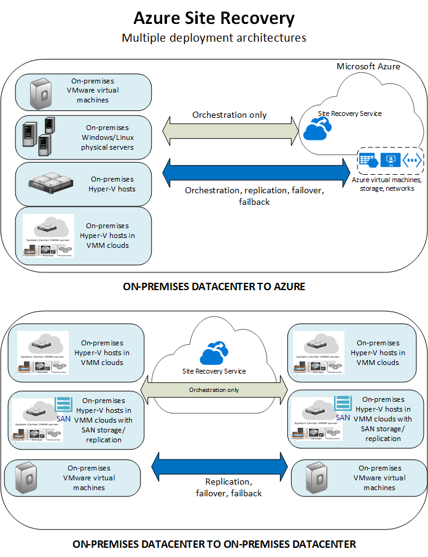

<properties
    pageTitle="Was ist eine Website Wiederherstellung? | Microsoft Azure"
    description="Bietet einen Überblick über den Dienst Azure Website Wiederherstellung und Bereitstellungsszenarien zusammenfasst."
    services="site-recovery"
    documentationCenter=""
    authors="rayne-wiselman"
    manager="cfreeman"
    editor=""/>

<tags
    ms.service="site-recovery"
    ms.devlang="na"
    ms.topic="get-started-article"
    ms.tgt_pltfrm="na"
    ms.workload="storage-backup-recovery"
    ms.date="10/13/2016"
    ms.author="raynew"/>

#  Was ist eine Website Wiederherstellung?

Willkommen bei der Wiederherstellung Azure-Website! Dieser Artikel bietet einen schnellen Überblick über die Website Wiederherstellung Service und wie sie für Ihr Geschäft beiträgt.

Ihre Organisation benötigt einen Geschäftskontinuität und Wiederherstellen (BCDR) nach Datenverlusten, die apps, Auslastung und Daten sicher und verfügbar sind bei geplanten und ungeplanten Ausfällen beibehalten und stellt zum normalen Arbeit Umständen so früh wie möglich wieder her. Wiederherstellung Website ist eine Azure-Dienst, der zu dieser Strategie beiträgt.

Website Wiederherstellung koordiniert Replikation der Auslastung lokalen physischen Servern und virtuellen Computern ausgeführt werden. Servers und virtuellen Computern können aus einem primären Datencenter in der Cloud (Azure) oder einem sekundären Datencenter repliziert. Treten Ausfall des primären Standorts, fehl Sie über den sekundären Standort apps und Auslastung zugänglich und verfügbar bleiben. Sie fehl zurück zur gewohnten Standort befinden, wenn sie normale Vorgänge zurückgibt.

## Website Wiederherstellung Azure-Portal

Azure weist zwei verschiedenen [Bereitstellungsmodelle](../resource-manager-deployment-model.md) für das Erstellen und Arbeiten mit Ressourcen. Das Modell Azure Ressourcenmanager und Modell Management Services klassischen. Azure, weist ebenfalls zwei communityportalen – [Azure klassischen Portal](https://manage.windowsazure.com/) , die das Bereitstellungsmodell klassischen unterstützt, und der [Azure-Portal](https://portal.azure.com) mit Unterstützung für das klassische und Ressourcenmanager Modelle.

- Website Wiederherstellung steht in der klassischen Portal und Azure-Portal.
- Im Portal Azure klassischen können Sie die Website Wiederherstellung mit dem klassischen Services-Modell Management unterstützen.
- Im Portal Azure können Sie das klassische Modell oder Ressourcenmanager Bereitstellungen unterstützen. 

Klassische und Azure Portals Bereitstellungen gilt für die Informationen in diesem Artikel. Unterschiede werden entsprechend gekennzeichnet.

## Gründe für die Bereitstellung der Website Wiederherstellung

Hier ist, was Wiederherstellung Website für Ihr Unternehmen ausführen können:

- **Vereinfachen Sie BCDR**– Sie können die Replikation, Failover- und von mehreren Auslastung an einem einzigen Speicherort im Portal Azure behandeln. Website Wiederherstellung koordiniert Replikation und Failover, aber nicht Ihre Anwendungsdaten abzufangen oder haben Sie alle Informationen zu erhalten.
- **Flexible Replikation bereitstellen**– Website Wiederherstellung verwenden, können Auslastung unter unterstützten Hyper-V virtuelle Computer, virtuelle VMware-Computer und Windows/Linux physischen Servern repliziert.
- **Einfache Replikation ausführen testen**– Website Wiederherstellung bietet Testfailovers Disaster Wiederherstellung einen Drilldown, Fertigung Umgebungen nicht unterstützt.
- **Möglicher Fehler über und Wiederherstellen**– Sie können mit minimalen Datenverlust (je nach Häufigkeit Replikation) für unerwartete Datenverluste geplanten Failovers für erwarteten Ausfall mit einem Datenverlust von 0 (null) oder nicht geplanten Failover ausführen. Nach einem Failover können Sie Failback primären Websites aus. Website Wiederherstellung bietet Wiederherstellung-Pläne, die Skripts und Azure Automatisierung Arbeitsmappen enthalten sein können, sodass Sie Failover und Wiederherstellung von Applications mit mehreren Ebenen anpassen können.
- **Eine sekundäre Datacenter unterdrücken**– Auslastung können mit Azure, statt mit einem sekundären Standort repliziert. Dadurch werden die Kosten und Komplexität einer sekundären Datacenter verwalten. Replizierte Daten werden in Azure-Speicher mit allen der Stabilität gespeichert, die bereitstellt. Mit den Daten replizierten werden virtuellen Computern erstellt, wenn ausgeführt wird.
- **Integrieren in vorhandene BCDR Technologien**– Wiederherstellung Website, die andere BCDR-Funktionen integriert. Website Wiederherstellung können Sie die SQL Server-Back-End-des Unternehmens Auslastung, einschließlich der systemeigenen Unterstützung für SQL Server AlwaysOn zum Verwalten des Failovers der Verfügbarkeit von Gruppen schützen.

## Was kann ich werden repliziert?

Hier finden Sie eine Zusammenfassung der was repliziert werden können Wiederherstellung Website verwenden.

**REPLIZIERT** | **REPLIKATION AUF** 
---|---
Auslastung auf lokale VMware virtuellen Computern ausgeführt | [Azure](site-recovery-vmware-to-azure-classic.md)   [Sekundären](site-recovery-vmware-to-vmware.md)
Auslastung auf lokale Hyper-V virtuellen Computern ausgeführt verwaltete in VMM Wolken  | [Azure](site-recovery-vmm-to-azure.md)   [Sekundären](site-recovery-vmm-to-vmm.md) 
Arbeitsbelastung auf lokale Hyper-V virtuellen Computern ausgeführt verwaltete in VMM Wolken, mit SAN-Speicher|  [Sekundären](site-recovery-vmm-san.md)
Auslastung auf lokale Hyper-V virtuellen Computern, ohne VMM ausgeführt | [Azure](site-recovery-hyper-v-site-to-azure.md)
Auslastung für lokale physische Windows/Linux Server ausgeführt | [Azure](site-recovery-vmware-to-azure-classic.md)   [Sekundären](site-recovery-vmware-to-vmware.md)

## Welche Auslastung kann ich schützen?

Website Wiederherstellung ermöglicht anwendungsspezifische BCDR, damit Auslastung und apps in ein konsistentes ausgeführt werden soll weiterhin, wenn Ausfall ausgeführt werden. Website Wiederherstellung bietet:

- **Anwendung konsistent Momentaufnahmen**– Autos Replikation mithilfe von Anwendung konsistent Momentaufnahmen für einzelne oder mehrere Ebenen apps. Zusätzlich zum Erfassen von Daten auf der Festplatte, alle Daten im Speicher und alle Transaktionen im Prozess Anwendung konsistent Momentaufnahmen erfassen erfassen.
- **In der Nähe synchroner Replikation**– Wiederherstellung Website stellt die Häufigkeit Replikation ist so niedrig wie 30 Sekunden für Hyper-V und die fortlaufende Replikation für VMware.
- **Flexible Wiederherstellung Pläne**– Sie können erstellen und Anpassen von Wiederherstellung Pläne mit externen Skripts und manuelle Aktionen. Integration in Azure Automatisierung Runbooks können Sie einen gesamte Anwendungsstapel mit einem einzigen Klick wiederherstellen.
- **Integration in SQL Server AlwaysOn**– Sie können das Failover der Verfügbarkeit von Gruppen in Website Wiederherstellung Wiederherstellung Pläne verwalten.
- **Automatisierungsbibliothek**– eine umfangreiche Automatisierung Azure-Bibliothek bietet einsatzbereit, anwendungsspezifische Skripts, die heruntergeladen und Wiederherstellung Website integriert werden können.
- **Simple Network Management**– erweiterte Netzwerk-Management in Website Wiederherstellung und Azure vereinfacht die Anwendung Netzwerk Anforderungen, einschließlich reserviert werden IP-Adressen, Lastenausgleich konfigurieren und Integrieren von Azure Datenverkehr Manager für effizienten Netzwerk-Serverarrays.

## Nächste Schritte

- Weitere Informationen in [welche Auslastung können Website Wiederherstellung schützen?](site-recovery-workload.md)
- Weitere Informationen zu der Website Wiederherstellung Architektur in [wie Website Wiederherstellung funktioniert?](site-recovery-components.md)
 
