<properties
    pageTitle="Testen der Leistung und Skalierung die Suchergebnisse für lokale auf lokale Hyper-V Replikation mit Website Wiederherstellung | Microsoft Azure"
    description="Dieser Artikel enthält Informationen zur Leistung für lokale auf lokale Replikation mithilfe von Azure Website Wiederherstellung testen."
    services="site-recovery"
    documentationCenter=""
    authors="rayne-wiselman"
    manager="jwhit"
    editor="tysonn"/>

<tags
    ms.service="site-recovery"
    ms.devlang="na"
    ms.topic="article"
    ms.tgt_pltfrm="na"
    ms.workload="storage-backup-recovery"
    ms.date="07/06/2016"
    ms.author="raynew"/>

# Leistung testen und skalieren Ergebnisse für lokale auf lokale Hyper-V Replikation mit Website Wiederherstellung

Microsoft Azure-Website wiederherstellen können Sie koordinieren und Verwalten von virtuellen Computern und physischen Servern Azure oder einem sekundären Datencenter Replikation. Dieser Artikel enthält die Ergebnisse, die wir konnten, wenn Replikation von Hyper-V-virtuellen Computern zwischen zwei Rechenzentren lokalen Testen der Leistung.

## (Übersicht)

Das Ziel des Testens wurde zu überprüfen, wie Azure Website Wiederherstellung während der Replikation dauerhaft Zustand ausführt. Bundesstaat dauerhaft Replikation, bei virtuellen Computern erste Replikation abgeschlossen haben, und Delta Änderungen synchronisiert werden. Es ist wichtig, Messen der Leistung mithilfe von dauerhaft Zustand, weil es im Zustand ist, in dem meisten virtuellen Computern bleiben, es sei denn, unerwartete Ausfall auftreten.

Die Bereitstellung Test Bestand aus zwei lokalen Websites mit einem VMM-Server an jedem Standort. Diese Test-Bereitstellung ist mit zentrale als primären Standort und der Zweigstelle wie für die Website des sekundären oder Wiederherstellung einer am Office/Zweig Office-Bereitstellung typische.

### Was wir haben

Hier ist, was wir in den Test bestanden haben:

1. Erstellt von virtuellen Computern VMM Vorlagen verwenden.

1. Schritte virtuellen Computern und geplante Performance-Werte über 12 Stunden erfassen.

1. Erstellten Wolken auf Primär und Wiederherstellung VMM-Servern.

1. Konfiguriert Cloud Schutz in Azure Website Wiederherstellung, einschließlich der Quell- und Wiederherstellung Wolken Zuordnung.

1. Schutz für virtuellen Computern aktiviert und diese anfänglichen Replikation abgeschlossen zulassen.

1. Gewartet hat ein paar Stunden für System Stabilisierung aus.

1. Erfasst Leistungswerte über 12 Stunden, um sicherzustellen, dass alle virtuellen Computer in einem erwarteten Replikation Zustand für diese 12 Stunden geblieben.

1. Messen Sie das Delta zwischen der geplanten Performance-Werte und der Replikation Performance-Werte ein.

## Testergebnisse für Bereitstellung

### Primärer Server Leistung

- Hyper-V Replica verfolgt asynchrone Änderungen in einer Protokolldatei mit minimalen Speicher Verwaltungsaufwand auf dem primären Server.

- Hyper-V Replica nutzt Self geführten Arbeitsspeichercache um IOPS Aufwand für die Überwachung zu minimieren. Es speichert in der VHDX im Speicher schreibt und leert sie in die Protokolldatei vor der Zeit, die das Protokoll zu der Website Wiederherstellung gesendet wird. Ein leeren Datenträger geschieht auch auf, wenn die schreibt vordefinierten maximal Treffer.

- Das Diagramm unten zeigt den Bundesstaat dauerhaft IOPS Aufwand für die Replikation. Wir sehen, dass die IOPS Aufwand aufgrund der Replikation ist ungefähr 5 % der gering ist.

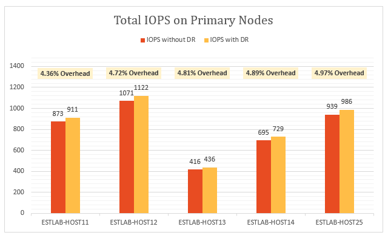

Hyper-V Replica nutzt Speicher auf dem primären Server zur Optimierung der Datenträger Performance. Wie im folgenden Diagramm angezeigt wird, ist Arbeitsspeicher Aufwand auf allen Servern in die primäre Cluster geringfügig. Der Arbeitsspeicher Aufwand dargestellt ist der Prozentsatz des Arbeitsspeichers, die von der Replikation im Vergleich zu den gesamten installierten Speicher auf dem Server Hyper-V verwendet.

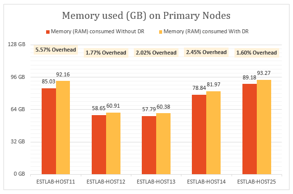

Hyper-V Replica hat minimale CPU-Auslastung. Wie im Diagramm angezeigt wird, befindet sich im Bereich von 2 und 3 % Replikation Verwaltungsaufwand.

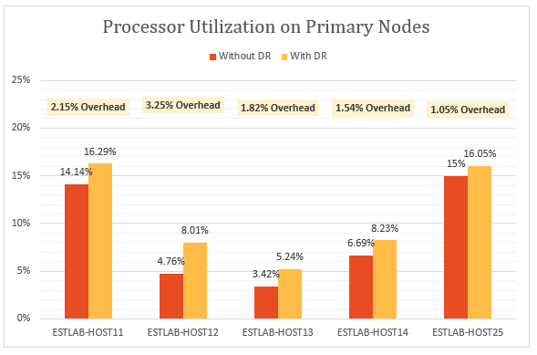

### Leistung des sekundären (Wiederherstellung)

Hyper-V Replica verwendet ein wenig Speicherplatz auf dem Wiederherstellungsserver, um die Anzahl der Speichervorgänge zu optimieren. Das Diagramm enthält eine Zusammenfassung der arbeitsspeicherauslastung auf dem Wiederherstellungsserver aus. Der Arbeitsspeicher Aufwand dargestellt ist der Prozentsatz des Arbeitsspeichers, die von der Replikation im Vergleich zu den gesamten installierten Speicher auf dem Server Hyper-V verwendet.

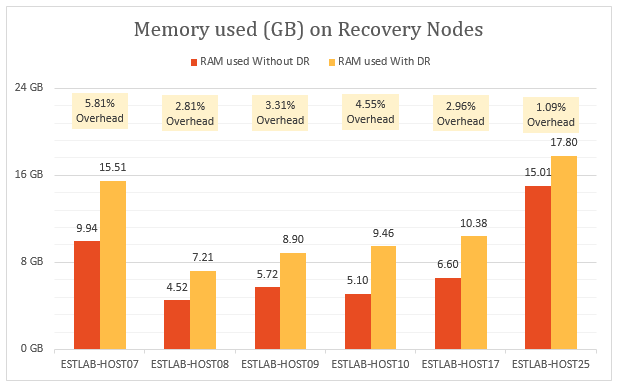

Der Betrag der i/o-Vorgänge auf der Website der Wiederherstellung ist eine Funktion, die Anzahl der Vorgänge auf dem primären Standort. Lassen Sie uns sehen Sie sich die gesamte e/a-Vorgänge auf der Website Wiederherstellung im Vergleich zu der gesamte e/a-Vorgänge und Vorgänge auf dem primären Standort schreiben. Das Diagramm zeigt, dass die Summe IOPS auf der Website der Wiederherstellung ist

- Ungefähr 1,5 Mal der schreiben IOPS auf dem primären.

- Rund 37 % von der total IOPS auf dem primären Standort.

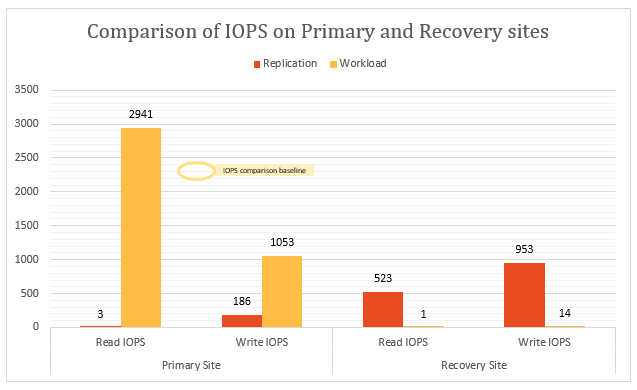

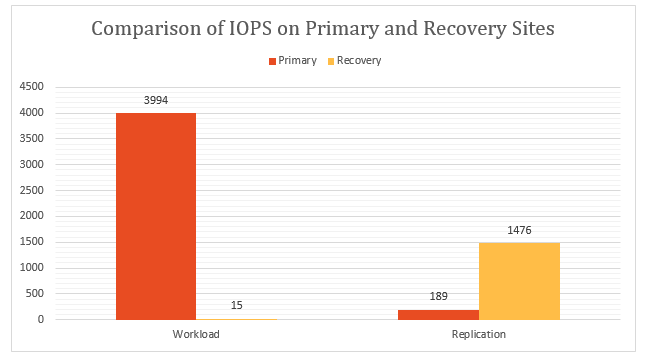

### Auswirkung der Replikation auf Netzwerk Auslastung

Ein Mittelwert der 275 MB pro Sekunde Netzwerk-Bandbreite wurde zwischen der primären und der Wiederherstellung Knoten (mit aktivierter Komprimierung) anhand einer vorhandenen Bandbreite von 5 GB pro Sekunde verwendet.

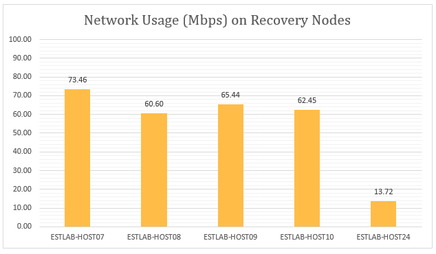

### Auswirkung der Replikation auf die Leistung von virtuellen Computern

Ein wichtiger Aspekt ist, den Einfluss der Replikation auf Produktionsarbeitslasten auf den virtuellen Computern ausgeführt wird. Wenn die primäre Website angemessen Replikation bereitgestellt wird, sollte nicht auf die Auslastung alle beeinträchtigt werden. Hyper-V Replica des Lightweight nachverfolgen Verfahren ist sichergestellt, dass die Auslastung auf den virtuellen Computern ausgeführt während der Replikation Fließgleichgewicht nicht betroffen sind. Dies wird in den folgenden Grafiken veranschaulicht.

Dieses Diagramm zeigt IOPS ausgeführte Arbeit von virtuellen Computern ausgeführt werden verschiedene Auslastung vor und nach der Replikation aktiviert wurde. Sie können beobachten, wie es gibt keinen Unterschied zwischen den beiden.

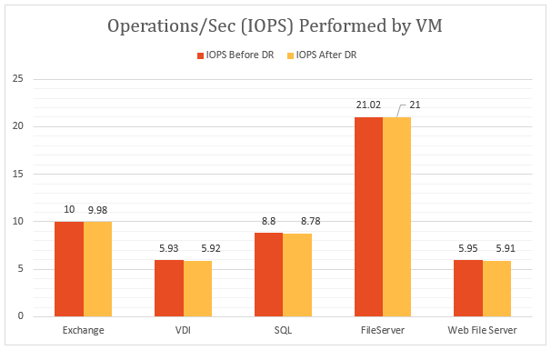

Das folgende Diagramm veranschaulicht den Durchsatz von virtuellen Computern ausgeführt werden verschiedene Auslastung vor und nach der Replikation aktiviert wurde. Sie können die Aktionen beobachten, dass die Replikation nicht signifikante beeinträchtigt wird.

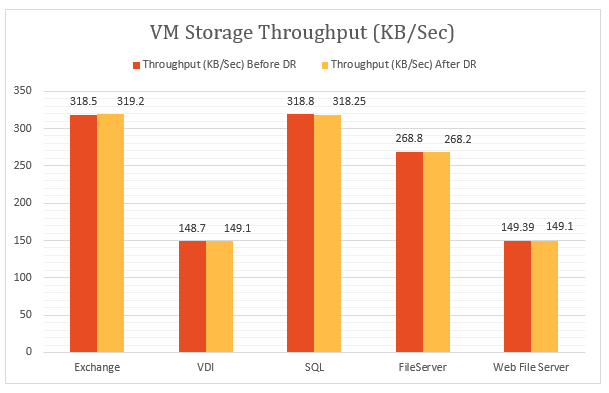

### Abschluss

Die Ergebnisse anzeigen klar an, ob Azure Website Wiederherstellung, in Verbindung mit Hyper-V, dazu gehören auch mit minimalen Verwaltungsaufwand für eine große Cluster skaliert.  Azure Website Wiederherstellung bietet einfache Bereitstellung, Replikation, Verwaltung und Überwachung. Hyper-V Replica bietet die notwendigen Infrastruktur für die erfolgreiche Replikation Skalierung an. Bei der Planung einer optimalen bereitstellungs empfehlen wir, dass Sie die [Hyper-V Replikat Kapazität für](https://www.microsoft.com/download/details.aspx?id=39057)herunterladen.

## Details zur Umgebung testen

### Primärer Standort

- Der primäre Standort hat einen Cluster mit fünf Hyper-V-Servern 470 virtuellen Computern ausgeführt.

- Führen Sie den virtuellen Computern anderen Auslastung und alle Azure Website Wiederherstellung Schutz aktiviert haben.

- Speicherplatz für den Clusterknoten wird von einem iSCSI-SAN bereitgestellt. Modell – Hitachi HUS130.

- Jeder Clusterserver verfügt über vier Network Cards (NIC) von einem Gbps.

- Zwei der Netzwerkkarten mit einer privaten iSCSI-Netzwerk verbunden sind, und zwei der mit einem externen Unternehmensnetzwerk verbunden sind. Die externen Netzwerke ist für Clusterkommunikation nur reserviert.

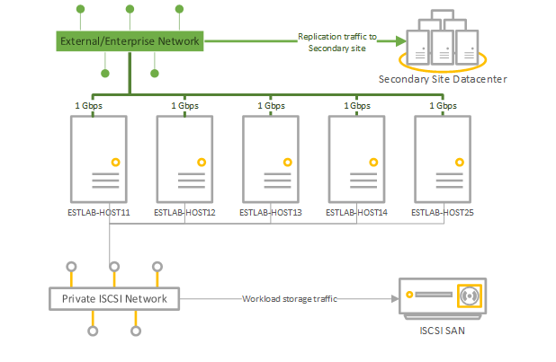

|Server|RAM|Modell|Prozessor|Anzahl der Prozessoren|NIC|Software|
|---|---|---|---|---|---|---|
|Hyper-V Server in Cluster:  ESTLAB-HOST11 ESTLAB-HOST12 ESTLAB-HOST13 ESTLAB-HOST14 ESTLAB-HOST25|128ESTLAB-HOST25 verfügt über 256 MB|Dell™ PowerEdge™-R820|Intel (r) Xeon(R) CPU E5-4620 0 @ 2,20 GHz|4|Ich Gbps x 4|Windows Server Datacenter 2012 R2 (x64) + Hyper-V-Rolle|
|VMM-Server|2|||2|1 Gbps|Windows Server 2012-Datenbank R2 (x 64) + VMM 2012 R2|

### Website sekundären (Wiederherstellung)

- Der sekundäre Standort weist einen Cluster sechs-Knoten.

- Speicherplatz für den Clusterknoten wird von einem iSCSI-SAN bereitgestellt. Modell – Hitachi HUS130.

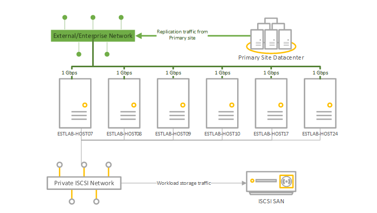

|Server|RAM|Modell|Prozessor|Anzahl der Prozessoren|NIC|Software|
|---|---|---|---|---|---|---|
|Hyper-V Server in Cluster:  ESTLAB-HOST07 ESTLAB-HOST08 ESTLAB-HOST09 ESTLAB-HOST10|96|Dell™ PowerEdge™-R720|Intel (r) Xeon(R) CPU E5-2630 0 @ 2,30 GHz|2|Ich Gbps x 4|Windows Server Datacenter 2012 R2 (x64) + Hyper-V-Rolle|
|ESTLAB-HOST17|128|Dell™ PowerEdge™-R820|Intel (r) Xeon(R) CPU E5-4620 0 @ 2,20 GHz|4||Windows Server Datacenter 2012 R2 (x64) + Hyper-V-Rolle|
|ESTLAB-HOST24|256|Dell™ PowerEdge™-R820|Intel (r) Xeon(R) CPU E5-4620 0 @ 2,20 GHz|2||Windows Server Datacenter 2012 R2 (x64) + Hyper-V-Rolle|
|VMM-Server|2|||2|1 Gbps|Windows Server 2012-Datenbank R2 (x 64) + VMM 2012 R2|

### Arbeitsbelastung der Server

- Testzwecken entnommen wir in Enterprise-Kundenszenarien gängige Auslastung.

- Wir verwenden [IOMeter](http://www.iometer.org) mit die Arbeitsbelastung-Eigenschaft in der Tabelle für die Simulation zusammengefasst.

- Alle IOMeter Profile festgelegt sind, dass schreiben, dass zufällige Bytes, um den ungünstigsten Fall zu reproduzieren Muster für Auslastung schreiben.

|Arbeitsbelastung|E/a-Größe (KB)|% Access|% Gelesen|Verbleibenden ein-und Ausgaben|E/a-Muster|
|---|---|---|---|---|---|
|Dateiserver|48163264|60 % 20 %5 %5 % 10 %|80 80 % 80 % 80 % 80 %|88888|Alle (100 %) Zufallszahl|
|SQL Server (Volume 1) SQL Server (Volume 2)|864|100 % (100 %)|70 %0 %|88|100 % random100 % sequenziellen|
|Exchange|32|(100 %)|67 %|8|Zufallszahl (100 %)|
|Arbeitsstationen/VDI|464|66 % 34 %|95 70 %|11|Beide Zufallszahl (100 %)|
|Webserver-Datei|4864|33 % 34 % 33 %|95 95 % 95 %|888|Alle 75 % Zufallszahl|

### Konfiguration des virtuellen Computers

- 470 virtuellen Computern auf dem primären Cluster.

- Alle virtuellen Computern VHDX Datenträger.

- Virtuellen Computern Auslastung in der Tabelle zusammengefasst. Alle mit VMM Vorlagen erstellt wurden.

|Arbeitsbelastung|# Virtuellen Computern|Minimale RAM (GB)|Maximale RAM (GB)|Logische Datenträgergröße (GB) pro virtueller Computer|Maximale IOPS|
|---|---|---|---|---|---|
|SqlServer|51|1|4|167|10|
|Exchange Server|71|1|4|552|10|
|Dateiserver|50|1|2|552|22|
|VDI|149|.5|1|80|6|
|Webserver|149|.5|1|80|6|
|SUMME|470|||96.83 TB|4108|

### Azure Einstellungen der Website Wiederherstellung

- Azure Website Wiederherstellung wurde für lokale auf lokale Schutz konfiguriert.

- Der VMM-Server hat vier Wolken konfiguriert ist, mit den Hyper-V Cluster-Servern und deren virtuellen Computern.

|Primäre VMM cloud|Geschützte virtuelle Maschinen in der cloud|Häufigkeit Replikation|Zusätzliche Wiederherstellungspunkte|
|---|---|---|---|
|PrimaryCloudRpo15m|142|15 Minuten|Keine|
|PrimaryCloudRpo30s|47|30 Sekunden|Keine|
|PrimaryCloudRpo30sArp1|47|30 Sekunden|1|
|PrimaryCloudRpo5m|235|5 Min.|Keine|

### Leistungswerte

Die Tabelle enthält eine Übersicht über die Leistungswerte und Datenquellen, die in der Bereitstellung gemessen wurden.

|Metrisch|Indikator|
|---|---|
|CPU|\Processor(_Total)\% CPU-Zeit|
|Verfügbaren Arbeitsspeicher|\Memory\Available MB|
|IOPS|\PhysicalDisk (_Total) \Disk/s|
|Virtueller Computer lesen (IOPS) pro Sekunde|Virtuelle Speichergerät \Hyper-V (<VHD>) \Read pro Sekunde|
|Virtueller Computer schreiben (IOPS) pro Sekunde|Virtuelle Speichergerät \Hyper-V (<VHD>) \Write Operationen/S|
|Virtueller Computer Durchsatz lesen|Virtuelle Speichergerät \Hyper-V (<VHD>) \Read Bytes/s|
|Virtueller Computer schreiben Durchsatz|Virtuelle Speichergerät \Hyper-V (<VHD>) \Write Bytes/s|

## Nächste Schritte

- [Einrichten von Schutz zwischen zwei lokalen VMM Websites](site-recovery-vmm-to-vmm.md)
