<properties
   pageTitle="Hinzufügen von Azure Automatisierung Runbooks für Wiederherstellung Pläne | Microsoft Azure"
   description="Dieser Artikel beschreibt, wie Azure Website Wiederherstellung jetzt erweitern Wiederherstellung Pläne mithilfe der Azure Automatisierung komplexer Aufgaben während der Wiederherstellung in Azure ermöglicht"
   services="site-recovery"
   documentationCenter=""
   authors="ruturaj"
   manager="gauravd"
   editor=""/>

<tags
   ms.service="site-recovery"
   ms.devlang="powershell"
   ms.tgt_pltfrm="na"
   ms.topic="article"
   ms.workload="required"
   ms.date="10/23/2016"
   ms.author="ruturajd@microsoft.com"/>


# <a name="add-azure-automation-runbooks-to-recovery-plans---classic"></a>Hinzufügen von Azure Automatisierung Runbooks für Wiederherstellung Pläne - klassisch


In diesem Lernprogramm beschreibt die Integration von Azure Website Wiederherstellung mit Azure Automatisierung Erweiterbarkeit für Wiederherstellung Pläne bereitstellen. Wiederherstellung Pläne Koordinieren von Wiederherstellung Ihrer virtuellen Maschinen geschützt Azure Website Wiederherstellung für Replikation sekundäre Cloud und Replikation Azure Szenarien verwenden können. Sie unterstützen darüber hinaus in der Wiederherstellung **konsistente genau**, **wiederholt**und **Automatische**vornehmen. Wenn Sie über Ihre virtuellen Computer in Azure fehlschlagen, Integration in Azure Automatisierung der Wiederherstellung Pläne erweitert, und ermöglicht Runbooks, wodurch leistungsfähige Automatisierungsaufgaben ausführen.

Wenn Sie nicht über die Azure-Automatisierung noch gehört haben, melden Sie sich [hier](https://azure.microsoft.com/services/automation/) , und Laden Sie ihre Skripts Stichprobe [hier](https://azure.microsoft.com/documentation/scripts/). Weitere Informationen zur [Azure Website Wiederherstellung](https://azure.microsoft.com/services/site-recovery/) und zum Koordinieren von Wiederherstellung in Azure Wiederherstellung Pläne verwenden [können](https://azure.microsoft.com/blog/?p=166264).

In diesem Lernprogramm kurze betrachten wir wie Sie Azure Automatisierung Runbooks in Wiederherstellung Pläne integrieren können. Wir automatisieren von einfachen Aufgaben, die zuvor manuellen Eingriff erforderlich und erfahren, wie eine Multi-Wiederherstellung Schritt in einer Wiederherstellungsaktion einzelner Klick konvertieren. Wir betrachten wird außerdem wie Sie ein einfaches Skript beheben können, wenn es schief geht.

## <a name="protect-the-application-to-azure"></a>Schützen Sie die Anwendung in Azure

Lassen Sie uns beginnen Sie mit einer einfachen Anwendung aus zwei virtuellen Computern. Hier haben wir eine Anwendung HRweb von Fabrikam. Fabrikam-HRweb-Front-End sind Fabrikam-Hrweb-Back-End- und die zwei virtuellen Computern in Azure geschützt Azure Website Wiederherstellung verwenden. Gehen Sie wie folgt vor den virtuellen Computern Azure Website Wiederherstellung verwenden um zu schützen.

1.  Aktivieren Sie Schutz für die virtuellen Computer.

2.  Stellen Sie sicher, dass die virtuellen Computer erste Replikation abgeschlossen haben und repliziert werden.

3.  Warten Sie, bis die erste Replikation abgeschlossen ist, und der Status der Replikation geschützten besagt.

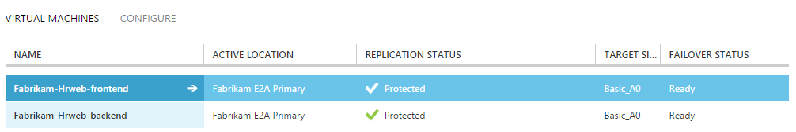
---------------------

In diesem Lernprogramm erstellen wir einen Wiederherstellungsplan für die Anwendung Fabrikam HRweb Failover der Anwendung in Azure. Dann wird es mit einem Runbooks integrieren, die einen Endpunkt auf den Fehler beim Erstellen über Azure-virtuellen Computern zu Webseiten an Port 80 dienen.

Zunächst erstellen wir einen Wiederherstellungsplan für unsere Anwendung.

## <a name="create-the-recovery-plan"></a>Erstellen Sie den Wiederherstellungsplan

Um die Anwendung in Azure wiederherstellen möchten, müssen Sie einen Wiederherstellungsplan zu erstellen.
Verwenden eines Wiederherstellungsplans, dass Sie die Reihenfolge der Wiederherstellung der virtuellen Computer angeben können. Des virtuellen Computers in der Gruppe 1 platziert werden wiederherstellen und ersten Starten, und klicken Sie dann den virtuellen Computern in der Gruppe 2 vor.

Erstellen einer Wiederherstellungsdatei planen, die unter aussieht.

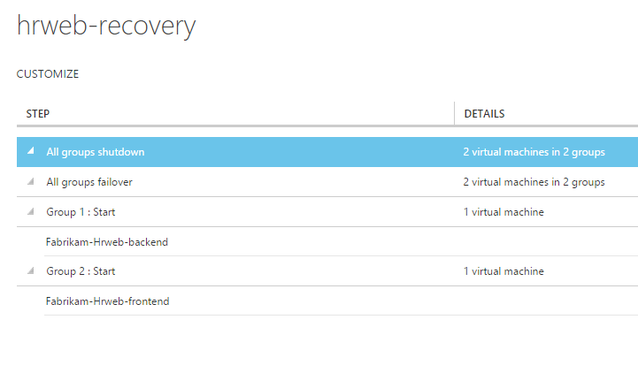

Weitere Informationen über Wiederherstellung Pläne, lesen Sie Dokumentation [hier](https://msdn.microsoft.com/library/azure/dn788799.aspx "hier").

Als Nächstes erstellen wir die notwendigen Elemente in Azure Automatisierung.

## <a name="create-the-automation-account-and-its-assets"></a>Erstellen Sie das Konto Automatisierung und ihre Ressourcen

Benötigen Sie ein Konto Azure Automatisierung Runbooks zu erstellen. Wenn Sie noch nicht über ein Konto verfügen, navigieren Sie zu Azure Automatisierung Registerkarte gekennzeichnet durch und ein neues Konto erstellen.

1.  Benennen Sie dem Konto mit identifizieren müssen.

2.  Geben Sie einen geografischen Bereich, in dem das Konto eingefügt werden sollen.

Es wird empfohlen, um das Konto in derselben Region als die ASR Tresor zu platzieren.

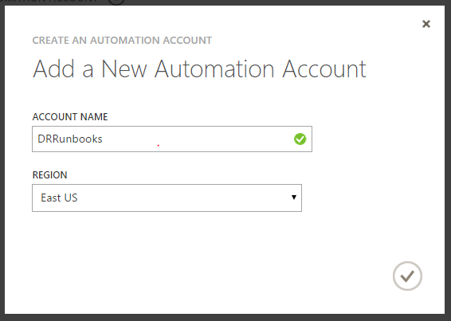

Erstellen Sie anschließend die folgenden Elemente in das Konto ein.

### <a name="add-a-subscription-name-as-asset"></a>Fügen Sie einen Abonnementnamen als Anlage hinzu.

1.  Fügen Sie eine neue Einstellung 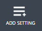 Azure Automatisierung Posten und auswählen, um

2.  Wählen Sie den Typ der als **Zeichenfolge** aus.

3.  Geben Sie Variablennamen als **AzureSubscriptionName** an.

    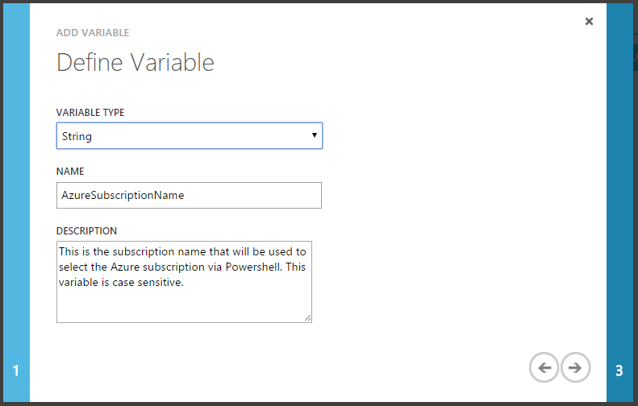

4.  Geben Sie den Namen Ihres tatsächlichen Azure-Abonnements als Wert der Variablen an.

    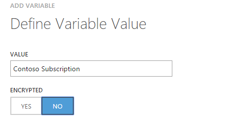

Sie können den Namen Ihres Abonnements aus der Einstellungsseite Ihres Kontos auf dem Azure-Portal zu identifizieren.

### <a name="add-an-azure-login-credential-as-asset"></a>Hinzufügen einer Azure Login Anmeldeinformationen als Anlage

Azure Automatisierung Azure PowerShell in Verbindung mit dem Abonnement verwendet und wirkt sich auf die Elemente vorhanden. Dazu müssen Sie mit Ihrem Microsoft-Konto oder einem geschäftlichen oder schulnotizbücher Konto authentifizieren.
Sie können die Anmeldeinformationen des Kontos in einer Anlage auf sichere Weise von des Runbooks verwendet werden gespeichert.

1.  Fügen Sie eine neue Einstellung  Azure Automatisierung Posten und auswählen

2.  Wählen Sie den Typ der Anmeldeinformationen als **Windows PowerShell-Anmeldeinformationen**

3.  Geben Sie den Namen als **AzureCredential** an.

    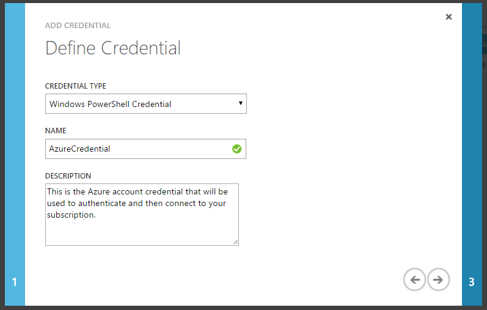

4.  Geben Sie den Benutzernamen und das Kennwort zum Anmelden mit.

Jetzt sind beide diese Einstellungen in Ihre Bestände jederzeit verfügbar.

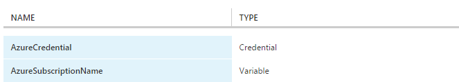

Weitere Informationen dazu, wie Sie Ihr Abonnement über PowerShell Verbindung angegeben ist [hier](../powershell-install-configure.md).

Als Nächstes erstellen Sie eine Runbooks in Azure Automatisierung, die einen Endpunkt für die Front-End-virtuellen Computern nach Failover hinzufügen können.

## <a name="azure-automation-context"></a>Azure Automatisierung Kontext

ASR übergibt eine Kontextvariable des Runbooks, die Sie schreiben deterministisch Skripts unterstützen. Eine konnte sagen, dass die Namen der Cloud-Dienst und des virtuellen Computers vorhersehbar sind, aber geschieht, dass es nicht immer der Fall wegen bestimmte Szenarien wie die Stelle, an der der Name der Name des virtuellen Computers möglicherweise aufgrund von nicht unterstützten Zeichen in Azure geändert haben. Daher wird diese Informationen an den ASR Wiederherstellungsplan als Teil des *Kontext*übergeben.

Nachstehend ist ein Beispiel für das Aussehen der Variablen Kontext aus.

        {"RecoveryPlanName":"hrweb-recovery",

        "FailoverType":"Test",

        "FailoverDirection":"PrimaryToSecondary",

        "GroupId":"1",

        "VmMap":{"7a1069c6-c1d6-49c5-8c5d-33bfce8dd183":

                {"CloudServiceName":"pod02hrweb-Chicago-test",

                "RoleName":"Fabrikam-Hrweb-frontend-test"}

                }

        }


In der nachfolgenden Tabelle enthält die Namen und eine Beschreibung für jede Variable im Kontext.

**Variablennamen** | **Beschreibung**
---|---
RecoveryPlanName | Name der Plan ausgeführt wird. Hilft Ihnen, basierend auf den Namen, die mit dem gleichen Skript bezüglich
FailoverType | Gibt an, ob das Failover testen, geplanten oder ungeplanten.
FailoverDirection | Geben Sie an, ob Wiederherstellung primäre oder sekundäre ist
Gruppen-ID | Die Anzahl der Gruppe innerhalb der Wiederherstellungsplans zu identifizieren, wenn Sie der Plan ausgeführt wird
VmMap | Array aller virtuellen Computer in der Gruppe
VMMap Schlüssel | Eindeutiger Schlüssel (GUID) für jeden virtuellen Computer. Es ist die VMM-ID des virtuellen Computers entspricht, sofern zutreffend.
RoleName | Name des den Azure-virtuellen Computer, die wiederhergestellt werden
CloudServiceName | Name der Azure-Cloud-Dienst unter dem des virtuellen Computers erstellt wird.


Das VmMap Key im Kontext identifizieren Sie auch wechseln Sie zur Eigenschaftenseite virtueller Computer ASR und prüfen Sie die Eigenschaft VM GUID konnte.

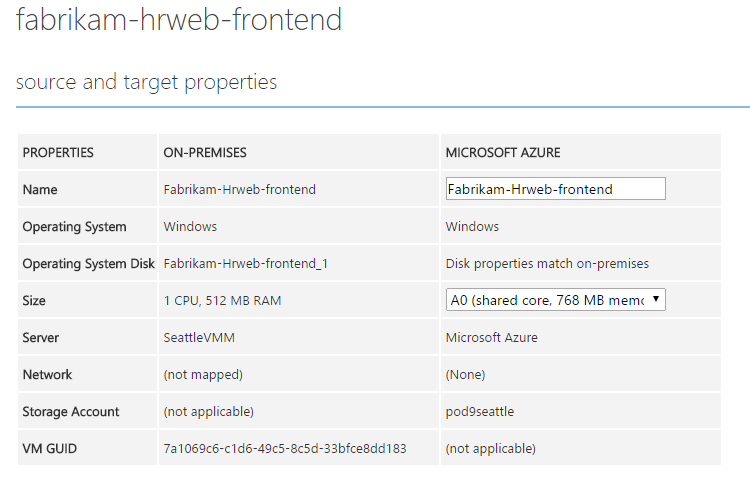

## <a name="author-an-automation-runbook"></a>Erstellen einer Runbooks Automatisierung

Erstellen Sie jetzt des Runbooks um Anschluss 80 der Front-End-virtuellen Computers zu öffnen.

1.  Erstellen einer neuen Runbooks in die Automatisierung Azure-Konto mit dem Namen **OpenPort80**

    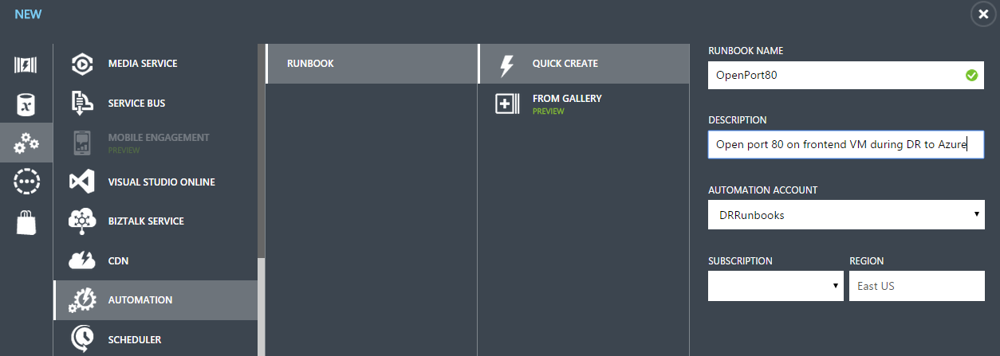

2.  Navigieren Sie zu der Ansicht Autor des Runbooks, und geben Sie im Entwurfsmodus.

3.  Geben Sie zuerst die Variable als der Wiederherstellung Plankontext zu verwendende

    ```
        param (
            [Object]$RecoveryPlanContext
        )

    ```

4.  Als Nächstes in das Abonnement mithilfe des Namens Anmelde- und Abonnement verbinden

    ```
        $Cred = Get-AutomationPSCredential -Name 'AzureCredential'

        # Connect to Azure
        $AzureAccount = Add-AzureAccount -Credential $Cred
        $AzureSubscriptionName = Get-AutomationVariable –Name ‘AzureSubscriptionName’
        Select-AzureSubscription -SubscriptionName $AzureSubscriptionName
    ```

    Beachten Sie, dass Sie die Azure Anlagen – **AzureCredential** und **AzureSubscriptionName** hier verwenden.

5.  Geben Sie nun die Endpunktdetails und die GUID des virtuellen Computers für die Sie den Endpunkt verfügbar machen möchten. In diesem Fall der Front-End-virtuellen Computern.

    ```
        # Specify the parameters to be used by the script
        $AEProtocol = "TCP"
        $AELocalPort = 80
        $AEPublicPort = 80
        $AEName = "Port 80 for HTTP"
        $VMGUID = "7a1069c6-c1d6-49c5-8c5d-33bfce8dd183"
    ```

    Gibt das Endpunktprotokoll Azure, lokalen Port des virtuellen Computers und den zugehörigen zugeordneten öffentlichen Port an. Diese Variablen sind Parameter, die durch die Azure-Befehle, die Endpunkte virtuellen Computern hinzufügen erforderlich. Die VMGUID enthält die GUID des virtuellen Computers, die Sie für ausgeführt werden müssen.

6.  Das Skript wird nun im Kontext für die angegebene VM GUID extrahieren und erstellen einen Endpunkt des virtuellen Computers verwiesen wird, indem Sie es.

    ```
        #Read the VM GUID from the context
        $VM = $RecoveryPlanContext.VmMap.$VMGUID

        if ($VM -ne $null)
        {
            # Invoke pipeline commands within an InlineScript

            $EndpointStatus = InlineScript {
                # Invoke the necessary pipeline commands to add a Azure Endpoint to a specified Virtual Machine
                # Commands include: Get-AzureVM | Add-AzureEndpoint | Update-AzureVM (including parameters)

                $Status = Get-AzureVM -ServiceName $Using:VM.CloudServiceName -Name $Using:VM.RoleName | `
                    Add-AzureEndpoint -Name $Using:AEName -Protocol $Using:AEProtocol -PublicPort $Using:AEPublicPort -LocalPort $Using:AELocalPort | `
                    Update-AzureVM
                Write-Output $Status
            }
        }
    ```

7. Nachdem dieser Vorgang abgeschlossen ist, ist Treffer veröffentlichen  Ihr Skript für die Ausführung verfügbar sein dürfen.

Das vollständige Skript wird für den Verweis unten angezeigt.

```
  workflow OpenPort80
  {
    param (
        [Object]$RecoveryPlanContext
    )

    $Cred = Get-AutomationPSCredential -Name 'AzureCredential'

    # Connect to Azure
    $AzureAccount = Add-AzureAccount -Credential $Cred
    $AzureSubscriptionName = Get-AutomationVariable –Name ‘AzureSubscriptionName’
    Select-AzureSubscription -SubscriptionName $AzureSubscriptionName

    # Specify the parameters to be used by the script
    $AEProtocol = "TCP"
    $AELocalPort = 80
    $AEPublicPort = 80
    $AEName = "Port 80 for HTTP"
    $VMGUID = "7a1069c6-c1d6-49c5-8c5d-33bfce8dd183"

    #Read the VM GUID from the context
    $VM = $RecoveryPlanContext.VmMap.$VMGUID

    if ($VM -ne $null)
    {
        # Invoke pipeline commands within an InlineScript

        $EndpointStatus = InlineScript {
            # Invoke the necessary pipeline commands to add an Azure Endpoint to a specified Virtual Machine
            # This set of commands includes: Get-AzureVM | Add-AzureEndpoint | Update-AzureVM (including necessary parameters)

            $Status = Get-AzureVM -ServiceName $Using:VM.CloudServiceName -Name $Using:VM.RoleName | `
                Add-AzureEndpoint -Name $Using:AEName -Protocol $Using:AEProtocol -PublicPort $Using:AEPublicPort -LocalPort $Using:AELocalPort | `
                Update-AzureVM
            Write-Output $Status
        }
    }
  }
```

## <a name="add-the-script-to-the-recovery-plan"></a>Fügen Sie das Skript zum Wiederherstellungsplan

Nachdem Sie das Skript bereit ist, können Sie es mit dem Wiederherstellungsplan hinzufügen, die Sie zuvor erstellt haben.

1.  Wählen Sie in der Wiederherstellungsplan, die, den Sie erstellt haben, nach der Gruppe 2 ein Skript hinzufügen. 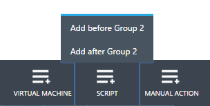

2.  Geben Sie einen Skript an. Dies ist nur einen Anzeigenamen für dieses Skript mit innerhalb der Wiederherstellungsplans.

3.  Wählen Sie in der Failover zu Azure Skript – den Azure Automatisierung Konto Namen ein.

4.  Wählen Sie in der Runbooks Azure die von Ihnen verfasste Runbooks.

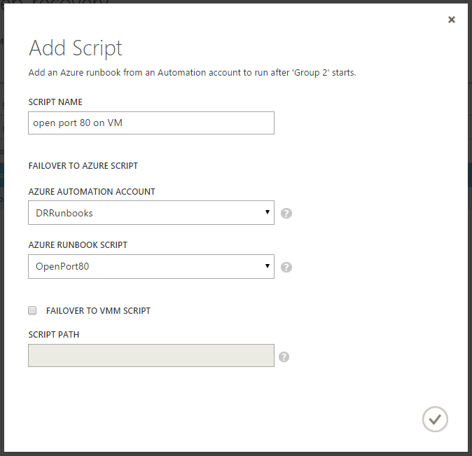

## <a name="primary-side-scripts"></a>Primäre clientseitige Skripts

Wenn Sie einen Failover auf Azure ausführen möchten, können Sie auch zum Ausführen von Skripts primären Seite auswählen. Diese Skripts werden auf dem Server VMM während Failover ausgeführt wird.
Primäre clientseitige Skripts sind nur verfügbar, nur für die Vorabversion war(en) und war(en) Phasen bereitstellen. Dies ist, da wir die primäre Website in der Regel nicht verfügbar, wenn es sich bei einer Katastrophe erwartet.
Bei einer ungeplanten Failover wird nur dann, wenn Sie für primäre Website-Vorgänge in Suchbegriffen wird versucht, die primäre Seite Skripts ausgeführt werden. Wenn sie nicht erreichbar sind oder Timeout, das Failover weiterhin den virtuellen Computern wiederherstellen.
Primäre clientseitige Skripts stehen dauerhaften für VMware/physische/Hyper-V Websites ohne VMM in Azure - während Failover in Azure geschützt.
Jedoch kann Wenn Sie Failback aus Azure lokal primären Seite Skripts (Runbooks) für alle Ziele außer VMware verwendet werden.

## <a name="test-the-recovery-plan"></a>Testen des Wiederherstellungsplans

Nachdem Sie auf den Plan, können Sie ein Test-Failover initiiert und müssen Sie erleben des Runbooks hinzugefügt haben. Es wird immer empfohlen zum Ausführen eines Failovers Test zum Testen der Anwendung und den Wiederherstellungsplan, um sicherzustellen, dass keine Fehler vorliegen.

1.  Wählen Sie den Wiederherstellungsplan und ein Test-Failover initiiert.

2.  Während der Ausführung planen können Sie sehen, ob die Runbooks ausgeführt wurde oder nicht über deren Status.

    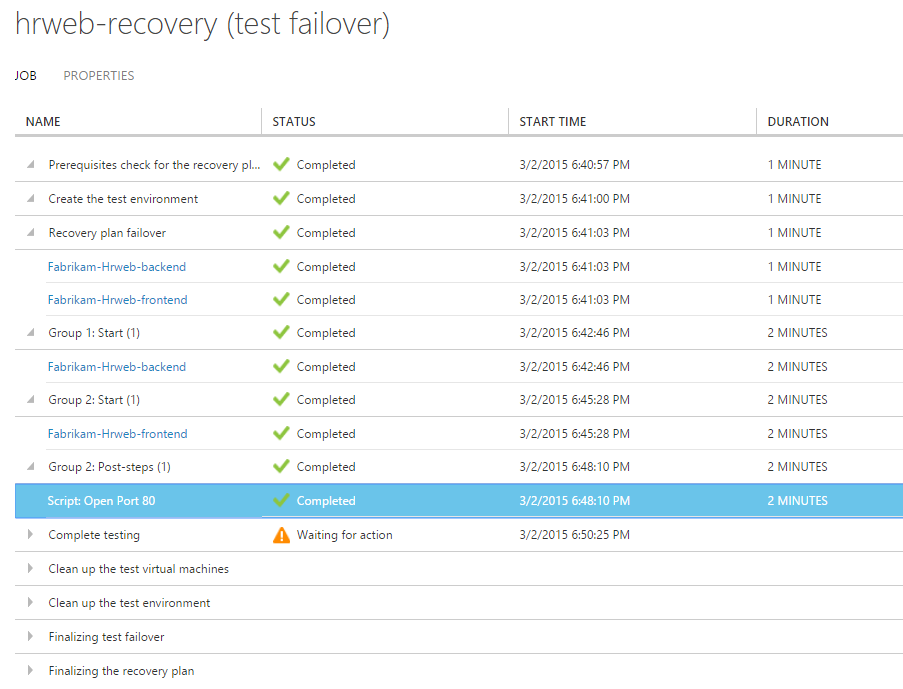

3.  Sie können auch den detaillierte Runbooks Ausführungsstatus auf der Seite für die Runbooks Automatisierung Azure-Projekte anzeigen.

    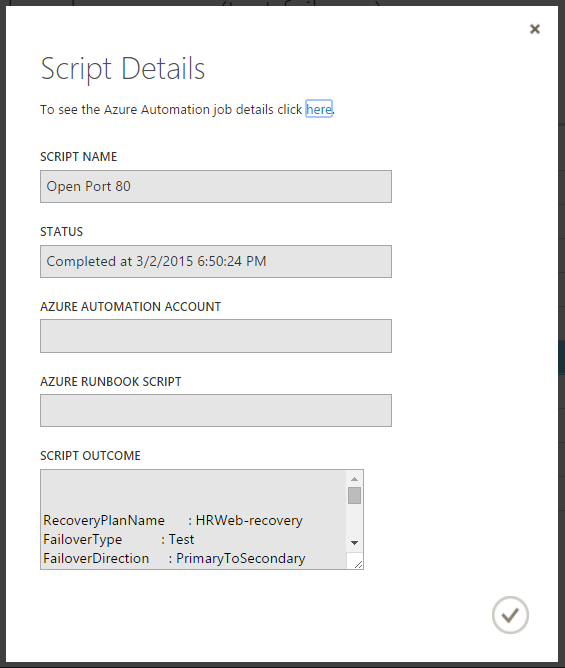

4.  Nach Abschluss des Failovers neben das Ergebnis der Ausführung des Runbooks, können Sie sehen, ob die Ausführung erfolgreich ist oder nicht durch die Azure-virtuellen Computern Seite besuchen, und suchen Sie die Endpunkte.

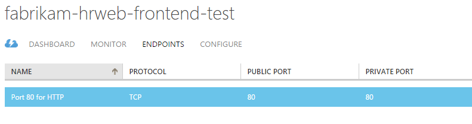

## <a name="sample-scripts"></a>Beispiel für Skripts

Während uns abgelehnt durch Hinzufügen von außen liegenden Tabellenblättern zu einer Azure-virtuellen Computern in diesem Lernprogramm automatisieren eine häufig verwendet, könnten Sie eine Reihe von anderen leistungsfähige Automatisierungsaufgaben mithilfe der Azure Automatisierung ausführen. Microsoft und der Community Azure Automatisierung bieten Stichprobe Runbooks, die Ihnen helfen können Schritte Erstellen eigener Lösungen und Programm Runbooks, die Sie als Bausteine für größere Automatisierungsaufgaben verwenden können. Verwenden sie aus dem Katalog aus, und erstellen Sie leistungsfähige ein-Klick-Wiederherstellung Pläne für Ihre Anwendung mit Azure Website Wiederherstellung.

## <a name="additional-resources"></a>Zusätzliche Ressourcen

[Azure Automatisierung (Übersicht)] (http://msdn.microsoft.com/library/azure/dn643629.aspx "Azure Automatisierung (Übersicht)")

[Beispiel für Azure Automatisierungsskripts] (http://gallery.technet.microsoft.com/scriptcenter/site/search?f[0].Type=User&f[0].Value=SC%20Automation%20Product%20Team&f[0].Text=SC%20Automation%20Product%20Team "Beispiel für Azure Automatisierungsskripts")
