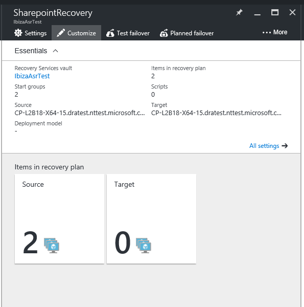
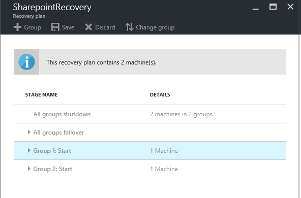
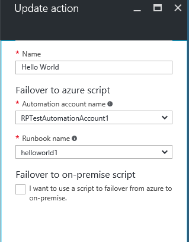
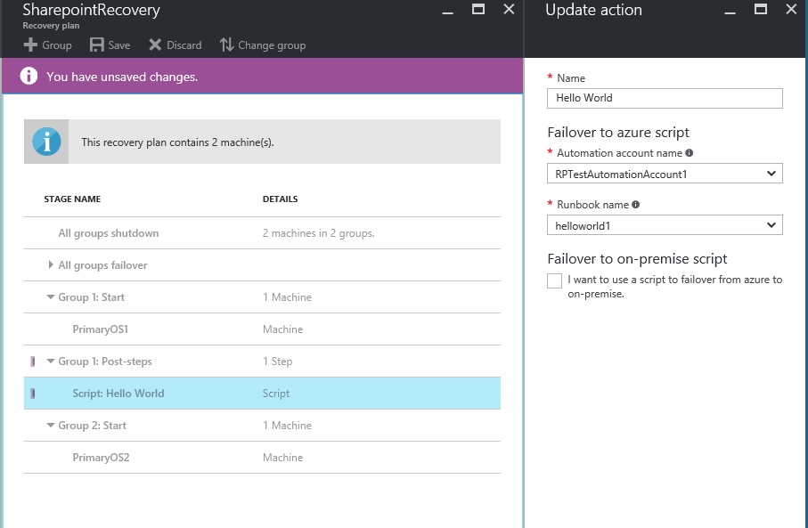

<properties
   pageTitle="Hinzufügen von Azure Automatisierung Runbooks für Wiederherstellung Pläne | Microsoft Azure"
   description="Dieser Artikel beschreibt, wie Azure Website Wiederherstellung jetzt erweitern Wiederherstellung Pläne mithilfe der Azure Automatisierung komplexer Aufgaben während der Wiederherstellung in Azure ermöglicht"
   services="site-recovery"
   documentationCenter=""
   authors="ruturaj"
   manager="gauravd"
   editor=""/>

<tags
   ms.service="site-recovery"
   ms.devlang="powershell"
   ms.tgt_pltfrm="na"
   ms.topic="article"
   ms.workload="required"
   ms.date="10/23/2016"
   ms.author="ruturajd@microsoft.com"/>

# Hinzufügen von Azure Automatisierung Runbooks für Wiederherstellung-Pläne

In diesem Lernprogramm beschreibt die Integration von Azure Website Wiederherstellung mit Azure Automatisierung Erweiterbarkeit für Wiederherstellung Pläne bereitstellen. Wiederherstellung Pläne Koordinieren von Wiederherstellung Ihrer virtuellen Maschinen geschützt Azure Website Wiederherstellung für Replikation sekundäre Cloud und Replikation Azure Szenarien verwenden können. Sie unterstützen darüber hinaus in der Wiederherstellung **konsistente genau**, **wiederholt**und **Automatische**vornehmen. Wenn Sie über Ihre virtuellen Computer in Azure fehlschlagen, Integration in Azure Automatisierung der Wiederherstellung Pläne erweitert, und ermöglicht Runbooks, wodurch leistungsfähige Automatisierungsaufgaben ausführen.

Wenn Sie nicht über die Azure-Automatisierung noch gehört haben, melden Sie sich [hier](https://azure.microsoft.com/services/automation/) , und Laden Sie ihre Skripts Stichprobe [hier](https://azure.microsoft.com/documentation/scripts/). Weitere Informationen zur [Azure Website Wiederherstellung](https://azure.microsoft.com/services/site-recovery/) und zum Koordinieren von Wiederherstellung in Azure Wiederherstellung Pläne verwenden [können](https://azure.microsoft.com/blog/?p=166264).

In diesem Lernprogramm betrachten wir wie Sie Azure Automatisierung Runbooks in Wiederherstellung Pläne integrieren können. Wir automatisieren von einfachen Aufgaben, die zuvor manuellen Eingriff erforderlich und erfahren, wie eine Wiederherstellung mit mehreren Schritte in einer Wiederherstellungsaktion einzelner Klick konvertieren. Wir betrachten wird außerdem wie Sie ein einfaches Skript beheben können, wenn es schief geht.

## Anpassen des Wiederherstellungsplans

1. Lassen Sie uns zunächst Operning Ressource Falz der Wiederherstellung planen. Sie können sehen, hat der Wiederherstellungsplan zwei virtuellen Computern für Wiederherstellung hinzugefügt. 

    
---------------------

2. Klicken Sie auf die Schaltfläche "anpassen" zum Hinzufügen eines Runbooks beginnen. Dadurch wird den Wiederherstellungsplan geöffnet Blade anpassen.

    

3. Klicken Sie mit der rechten Maustaste auf die Startgruppe 1, und wählen Sie zum Hinzufügen einer Aktions' Beitrag hinzufügen".

4. Wählen Sie ein Skript in das neue Blade auswählen.

5. Benennen Sie das Skript "Hallo Welt".

6. Wählen Sie einen Automatisierung Kontonamen ein. Dies ist die Automatisierung Azure-Konto. Beachten Sie, dass dieses Konto kann in einer beliebigen Azure Geography aber im selben Abonnement als die Website Wiederherstellung Tresor sein soll.

7. Wählen Sie eine Runbooks des Kontos Automatisierung aus. Dies ist das Skript, das während der Ausführung des Wiederherstellungsplans nach der Wiederherstellung der ersten Gruppe ausgeführt wird.

    

8. Wählen Sie OK, um das Skript zu speichern. Dadurch wird das Skript hinzugefügt, zur Gruppe Beitrag Aktion Gruppe 1: starten.

    

## Hinzufügen eines Skripts Vertriebsstrategie interessante

1. Sie können klicken Sie mit der rechten Maustaste auf das Skript und 'Schritt löschen' oder 'update Skript' auswählen.

2. Ein Skript kann auf die Azure während Failover zwischen lokalen und Azure ausführen, und kann auf Azure als primären Seite Skript vor war(en), während des Failbacks aus Azure zu lokalen ausführen.

3. Wenn ein Skript ausgeführt wird, wird diese einen Wiederherstellung Plankontext einfügen.

Nachstehend ist ein Beispiel für das Aussehen der Variablen Kontext aus.

        {"RecoveryPlanName":"hrweb-recovery",

        "FailoverType":"Test",

        "FailoverDirection":"PrimaryToSecondary",

        "GroupId":"1",

        "VmMap":{"7a1069c6-c1d6-49c5-8c5d-33bfce8dd183":

                {"CloudServiceName":"pod02hrweb-Chicago-test",

                "RoleName":"Fabrikam-Hrweb-frontend-test"}

                }

        }

In der nachfolgenden Tabelle enthält die Namen und eine Beschreibung für jede Variable im Kontext.

**Variablennamen** | **Beschreibung**
---|---
RecoveryPlanName | Name der Plan ausgeführt wird. Hilft Ihnen, basierend auf den Namen, die mit dem gleichen Skript bezüglich
FailoverType | Gibt an, ob das Failover testen, geplanten oder ungeplanten.
FailoverDirection | Geben Sie an, ob Wiederherstellung primäre oder sekundäre ist
Gruppen-ID | Die Anzahl der Gruppe innerhalb der Wiederherstellungsplans zu identifizieren, wenn Sie der Plan ausgeführt wird
VmMap | Array aller virtuellen Computer in der Gruppe
VMMap Schlüssel | Eindeutiger Schlüssel (GUID) für jeden virtuellen Computer. Es ist die VMM-ID des virtuellen Computers entspricht, sofern zutreffend.
RoleName | Name des den Azure-virtuellen Computer, die wiederhergestellt werden
CloudServiceName | Name der Azure-Cloud-Dienst unter dem des virtuellen Computers erstellt wird.
CloudServiceName (im Modell zur Bereitstellung von Ressourcenmanager) | Ressourcengruppe Azure Name unter dem des virtuellen Computers erstellt wird.

## Verwenden von komplexen Variablen pro Plan für die Wiederherstellung

In manchen Fällen ist eine Runbooks mehr Informationen als nur die RecoveryPlanContext erforderlich. Es kommt keine erster Klasse Verfahren ein Parameters an eine Runbooks übergeben. Jedoch wenn Sie dasselbe Skript über mehrere Wiederherstellung Pläne verwenden möchten Sie können die Wiederherstellung Plankontext Variable 'RecoveryPlanName' und Verwenden der unter Versuche Technik, eine Azure Automatisierung komplexen Variable in einer Runbooks zu verwenden. Das Beispiel unten zeigt, wie Sie drei verschiedene komplexen Variable Posten erstellen und diese in des Runbooks basierend auf den Namen des Wiederherstellungsplans verwenden.

Beachten Sie, dass Sie 3 zusätzlichen Parameter in einer Runbooks verwenden möchten. Lassen Sie uns in einem Formular JSON codieren {"Var1": "Testautomation", "Var2": "Nicht geplant", "Var3": "PrimaryToSecondary"}

Verwenden Sie zum Erstellen einer neuen Automatisierung Anlage [AA komplexen Variable](../automation/automation-variables.md#variable-types Complex variable) ein.
Benennen Sie die Variable als <RecoveryPlanName>- Parameter.
Den Bezug Hier können Sie um eine [komplexe Variable](https://msdn.microsoft.com/library/dn913767.aspx?f=255&MSPPError=-2147217396)zu erstellen.

Benennen Sie die Variable als für andere Wiederherstellung-Pläne

1. recoveryPlanName1 >-Parameter
2. recoveryPlanName2 >-Parameter
3. recoveryPlanName3 >-Parameter

Nun in das Skript verweisen Sie, um die Parameter als

1. Rufen Sie den Namen der RP in der $rpname $Recoveryplancontext Variable =
2. Abrufen der Anlage von $paramValue = "$($rpname)-Parameter"
3. Verwenden Sie diese als komplexen Variable für den Wiederherstellungsplan, indem Sie Get-AzureAutomationVariable [-AutomationAccountName] <String> -$paramValue nennen.

Als Beispiel um die komplexen Variable-Parameter für den SharepointApp Wiederherstellungsplan zu gelangen, Erstellen einer Azure Automatisierung komplexen Variable namens 'SharepointApp-Parameter'.

Diese in den Wiederherstellungsplan verwenden, indem Sie die Variable aus der Anlage, die mit der Anweisung Get-AzureAutomationVariable extrahieren [-AutomationAccountName] <String> [-Name] $paramValue. [Verwiesen Sie dies für weitere Details wird](https://msdn.microsoft.com/library/dn913772.aspx)

Auf diese Weise dasselbe Skript kann für verschiedene Wiederherstellungsplan verwendet werden, durch die Plan bestimmte komplexen Variable in die Anlagen speichern.

## Beispiel für Skripts

Ein Repository von Skripts, die Sie direkt in Ihr Konto Automatisierung importieren können, finden Sie unter [Kristian Neses OMS Repository für Skripts](https://github.com/krnese/AzureDeploy/tree/master/OMS/MSOMS/Solutions/asrautomation)

Das Skript hier ist eine Ressourcenmanager Azure-Vorlage, die alle bereitstellen, wird die unter Skripts

* NSG

Des Runbooks NSG öffentlichen IP-Adressen jeder virtuellen Computer innerhalb der Wiederherstellung planen ordnen und deren virtuelle Netzwerkadapter zu einer Netzwerk-Sicherheitsgruppe, der Standard-Kommunikation ermöglicht Anfügen

* PublicIP

Öffentliche IP-Adressen wird jeder virtuellen Computer innerhalb der Wiederherstellung Planen des Runbooks öffentliche IP-Adresse zuweisen. Zugriff auf den Computern und Applikationen hängt von der Firewalleinstellungen in jeder Gast

* CustomScript

Des Runbooks CustomScript wird jeder virtuellen Computer innerhalb der Wiederherstellung Planen der öffentlichen IP-Adressen zuweisen und installieren Sie eine benutzerdefiniertes Skript-Erweiterung, die das Skript extrahieren wird, die, das Sie während der Bereitstellung der Vorlage verweisen

* NSGwithCustomScript

Die NSGwithCustomScript Runbooks öffentlichen IP-Adressen zu jeder virtuellen Computer innerhalb der Wiederherstellung planen, installieren Sie ein benutzerdefiniertes Skript mit der Erweiterung und Herstellen einer Verbindung eine NSG wird mit der virtuelle Netzwerkadapter erfasst werden standardmäßig eingehende und ausgehende Kommunikation für den Remotezugriff

## Zusätzliche Ressourcen

[Automatisierung Azure Service als Konto ausführen](../automation/automation-sec-configure-azure-runas-account.md)

[Azure Automatisierung (Übersicht)] (http://msdn.microsoft.com/library/azure/dn643629.aspx "Azure Automatisierung (Übersicht)")

[Beispiel für Azure Automatisierungsskripts] (http://gallery.technet.microsoft.com/scriptcenter/site/search?f[0].Type=User&f[0].Value=SC%20Automation%20Product%20Team&f[0].Text=SC%20Automation%20Product%20Team "Beispiel für Azure Automatisierungsskripts")
