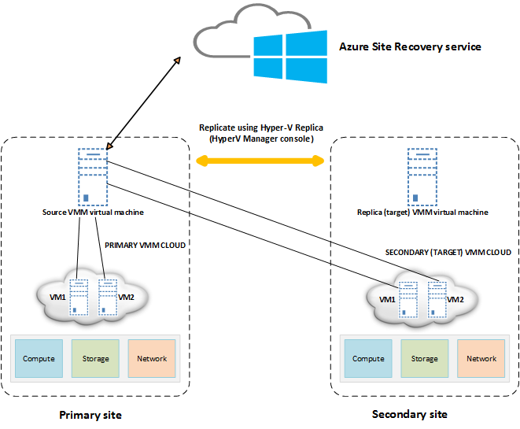
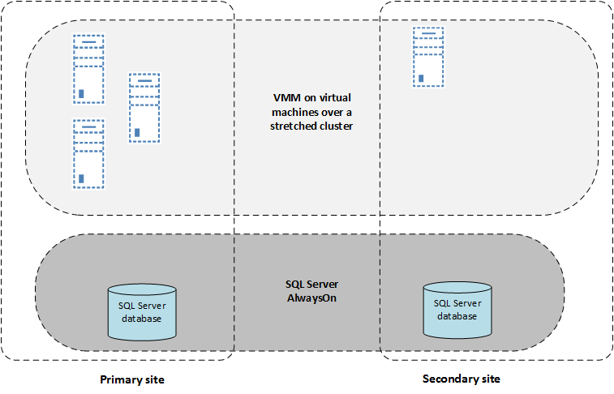

<properties
    pageTitle="Azure Website Wiederherstellung: Repliziert Hyper-V-virtuellen Computern auf einem einzelnen VMM Server | Microsoft Azure"
    description="Dieser Artikel beschreibt, wie Hyper-V-virtuellen Computern repliziert werden, wenn Sie nur einen einzelnen VMM-Server verfügen."
    services="site-recovery"
    documentationCenter=""
    authors="rayne-wiselman"
    manager="jwhit"
    editor=""/>

<tags
    ms.service="site-recovery"
    ms.devlang="na"
    ms.topic="article"
    ms.tgt_pltfrm="na"
    ms.workload="backup-recovery"
    ms.date="08/24/2016"
    ms.author="raynew"/>

#  Repliziert Hyper-V-virtuellen Computern auf einem einzelnen VMM-server

Lesen Sie in diesem Artikel erfahren Sie, wie repliziert Hyper-V virtuellen Computern, die sich auf einem Server in der Cloud VMM Hyper-V-Host befindet, wenn Sie nur einen einzelnen VMM-Server Ihre Bereitstellung haben.

Azure weist zwei verschiedenen [Bereitstellungsmodelle](../resource-manager-deployment-model.md) für das Erstellen und Arbeiten mit Ressourcen: Azure Ressourcenmanager und Classic. Azure verfügt auch über zwei communityportalen – Azure klassischen Portals, die das Bereitstellungsmodell klassischen unterstützt, und der Azure-Portal mit Unterstützung für beide Bereitstellungsmodelle. Dieser Artikel enthält Anweisungen zum Einrichten der Replikation Azure-Portal an.

Wenn Sie Fragen haben, nach dem in diesem Artikel lesen, veröffentlichen Sie diese in den Kommentaren Disqus am Ende dieses Artikels oder im [Forum Azure Wiederherstellung Services](https://social.msdn.microsoft.com/forums/azure/home?forum=hypervrecovmgr).

## (Übersicht)

Wenn Hyper-V virtuelle Computer befindet sich auf Hyper-V-Hosts in VMM repliziert werden soll, und Sie nur einen einzelnen VMM-Server verfügen, können Sie [auf Azure repliziert](site-recovery-vmm-to-azure.md), oder zwischen Wolken auf die einzelnen VMM-Server.

Es empfiehlt sich, dass Sie in Azure repliziert, da Failover und Wiederherstellung nahtlose nicht, wenn zwischen Wolken repliziert und einige manuelle Schritte erforderlich sind. Wenn Sie mit dem VMM-Server repliziert möchten, können Sie die folgenden Aktionen ausführen:

- Mit einem einzelnen eigenständigen VMM Server repliziert
- Mit einem einzigen VMM-Server befinden, die in einem Windows-Cluster gestreckt repliziert

## Replikation über Websites mit einem einzelnen eigenständigen VMM-server

In diesem Szenario den einzelnen VMM-Server als virtueller Computer in der primären Standort bereitstellen und repliziert diesem virtuellen Computer an einem sekundären Standort Website Wiederherstellung und Hyper-V Kopie verwenden.

1. Einrichten von VMM eine Hyper-V virtuellen Computers. Es wird empfohlen, dass die Installation von SQL Server-Instanz von VMM des gleichen virtuellen Computers verwendet, um Zeit zu sparen. Wenn Sie verwenden möchten eine remote-Instanz von SQL Server und einem Ausfall auftritt, müssen Sie die betreffende Instanz wiederherstellen, bevor Sie VMM wiederherstellen können.
2. Stellen Sie sicher, dass der VMM-Server mindestens zwei Wolken konfiguriert ist. Eine Cloud enthält die virtuellen Computern repliziert werden soll, und die anderen Cloud fungiert als sekundäre Speicherort. Die Cloud, die die virtuellen Computern enthält Sie schützen möchten, sollten haben:

    - Eine oder mehrere VMM Hostgruppen, die einem oder mehreren Hyper-V Hostservern in jeder Hostgruppe enthält.
    - Mindestens ein Hyper-V virtuellen Computern auf jedem Hyper-V-Host-Server.

3. Erstellen Sie einer Wiederherstellungsdatei Services Tresor, generieren herunterladen Sie einen Registrierungsschlüssel Tresor und registrieren Sie den VMM-Server im Tresor. Während der Registrierung installieren Sie den Azure-Anbieter für Websites Wiederherstellung auf dem VMM-Server an.
4. Einrichten von einer oder mehreren Wolken auf die VMM VM, und fügen Sie den Hyper-V-Hosts diese Wolken.
3. Konfigurieren von Schutz Einstellungen für die Wolken. Sie geben Sie den Namen der einzelnen VMM-Server als der Quell- und Zielwebsites Speicherorte. Um Netzwerk-Zuordnung zu konfigurieren, ordnen Sie das Netzwerk virtueller Computer für die Cloud mit den virtuellen Computern, die Sie mit dem Netzwerk virtueller Computer für die Replikation Cloud schützen möchten.
4. Aktivieren Sie die erste Replikation für virtuelle Computer über das Netzwerk schützen, da beide Wolken auf demselben Server befinden soll.
4. Aktivieren Sie in der Verwaltungskonsole Hyper-V-Manager Hyper-V Replica auf dem Host von Hyper-V, der die VMM VM enthält, und aktivieren Sie die Replikation des virtuellen Computers. Stellen Sie sicher, dass Sie die VMM VM Wolken hinzufügen nicht, die von der Website Wiederherstellung geschützt sind. Dadurch wird sichergestellt, dass Hyper-V Replica Einstellungen von Website-Wiederherstellung überschrieben nicht zur Verfügung.
5. Wenn Sie die Wiederherstellung Pläne erstellen möchten, geben Sie den gleichen VMM-Server für Quell- und Zielwebsites aus.

Führen Sie die Schritte in [diesem Artikel](site-recovery-vmm-to-vmm.md) zum Erstellen einer Tresor Registrieren des Servers und Einrichten von Schutz aus.

### Was zu tun ist in einer einem Dienstausfall

Wenn Sie eine vollständige Ausfall auftritt, und Sie aus der sekundäre Standort ausgeführt werden müssen, führen Sie folgende Schritte aus:

1.  Führen Sie in der Verwaltungskonsole Hyper-V-Manager in den sekundären Standort eines ungeplanten Failovers über die VMM VM vom primären zum sekundären fehlschlägt.
2.  Stellen Sie sicher, dass die VM VMM sekundären Standort einsatzbereit ist.
3.  Führen Sie in der Wiederherstellung Services Tresor eines ungeplanten Failovers über die Arbeitsbelastung virtuellen Computern zwischen primärem sekundäre Wolken fehlschlägt. Um das ungeplanten Failover für die virtuellen Computern abgeschlossen haben, abzuschließen Sie das Failover, oder wählen Sie einen anderen Wiederherstellungspunkt nach Bedarf.
4.  Nachdem das ungeplante Failover abgeschlossen ist, können Benutzer Arbeitsbelastung Ressourcen in der sekundäre Standort zugreifen.

Wenn der primäre Standort wieder ordnungsgemäß funktioniert, führen Sie folgende Schritte aus:

1.  Aktivieren Sie in der Verwaltungskonsole Hyper-V-Manager reverse Replikation für die VMM VM, um ihn vom sekundären zum primären Replikation zu starten.
2.  Führen Sie in der Verwaltungskonsole Hyper-V-Manager ein geplantes Failover, um wieder die VMM VM mit dem primären Standort ein Fehler auftreten. Übernehmen des Failovers, um ihn abzuschließen. Aktivieren Sie dann reverse Replikation VMM vom primären auf sekundären repliziert gestartet.
3.  Aktivieren Sie in der Wiederherstellung Services Tresor reverse Replikation für die Arbeitsbelastung virtuelle Computer, starten sie vom sekundären zum primären repliziert.
4.  Führen Sie im Tresor Wiederherstellung Services ein geplantes Failover, um wieder die Arbeitsbelastung virtuellen Computern mit dem primären Standort ein Fehler auftreten. Übernehmen des Failovers, um ihn abzuschließen. Aktivieren Sie dann reverse Replikation so starten Sie die Arbeitsbelastung virtuellen Computern vom primären auf sekundären repliziert.

## Mit einem einzigen VMM-Server in einem Cluster gestreckt websiteübergreifend repliziert

Statt Bereitstellen von einem eigenständigen VMM Server als ein virtueller Computer, die an einem sekundären Standort repliziert, können Sie VMM hochgradig verfügbar machen, indem es als eines virtuellen Computers in einen Windows-Failovercluster bereitstellen. Dies stellt Arbeitsbelastung Stabilität und Schutz vor Hardware-Fehlern. Zum Bereitstellen von mit Website Wiederherstellung sollten die VMM VM geografischen Standorten in einem Dehnen Cluster bereitgestellt werden. Zweck

1. Installieren von VMM auf einem virtuellen Computer in einem Windows-Failovercluster, und wählen Sie die Option, um den Server als hoch verfügbar während der Installation.
2. SQL Server-Instanz, die von VMM verwendet werden sollte mit SQL Server AlwaysOn Verfügbarkeit Gruppen repliziert werden, damit es wird eine Kopie der Datenbank in den sekundären Standort.
3. Führen Sie die Schritte in [diesem Artikel](site-recovery-vmm-to-vmm.md) zum Erstellen einer Tresor Registrieren des Servers und Einrichten von Schutz aus. Sie müssen jede VMM-Server im Cluster im Tresor Wiederherstellung Services registrieren. Hierzu den Anbieter auf einem aktiven Knoten installieren und den VMM-Server zu registrieren. Dann können Sie den Anbieter auf anderen Knoten installieren.

### Was zu tun ist in einem Ausfall

Bei einem Ausfall, den VMM-Server und die entsprechenden SQL Server-Datenbank über fehlgeschlagen ist und der sekundäre Standort zugegriffen.

## Nächste Schritte

[Erfahren Sie mehr](site-recovery-vmm-to-vmm.md) über die ausführliche Website Wiederherstellung Bereitstellung für VMM auf VMM Replikation.
