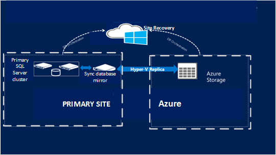

<properties 
    pageTitle="Schützen von SQL Server mit SQL Server-Wiederherstellung und Azure-Website Wiederherstellung | Microsoft Azure" 
    description="Dieser Artikel beschreibt, wie repliziert SQL Server Disaster-Azure Website Wiederherstellung von SQL Server-Funktionen verwenden." 
    services="site-recovery" 
    documentationCenter="" 
    authors="rayne-wiselman" 
    manager="jwhit" 
    editor=""/>

<tags 
    ms.service="site-recovery" 
    ms.workload="backup-recovery" 
    ms.tgt_pltfrm="na" 
    ms.devlang="na" 
    ms.topic="article" 
    ms.date="08/04/2016" 
    ms.author="raynew"/>

# Schützen von SQL Server mit SQL Server-Wiederherstellung und Azure-Website Wiederherstellung 

Der Dienst Azure Website Wiederherstellung beiträgt zu Ihrer Strategie Business Continuity- und Disaster Wiederherstellung (BCDR) durch Replikation, Failover und Wiederherstellung von virtuellen Computern und physischen Servern orchestriert. Maschinen können Azure oder einem sekundären lokalen Data Center repliziert werden. Für einen schnellen Überblick lesen [Neuigkeiten Azure Website Wiederherstellung?](site-recovery-overview.md).

 Dieser Artikel beschreibt, wie Sie die SQL Server-Back-End der Anwendung, die mit einer Kombination aus SQL Server-BCDR-Technologien und Azure-Website Wiederherstellung schützen. Sollten Sie verstehen, SQL Server Disaster Wiederherstellungsfunktionen haben (Failoverclustering, AlwaysOn Verfügbarkeit Gruppen Database-Spiegelung, melden Sie sich Versand) und der Azure-Website Wiederherstellung, bevor Sie die in diesem Artikel beschriebenen Szenarien bereitstellen.

## (Übersicht)

Viele Auslastung mithilfe von SQL Server als Grundlage. SQL Server Formular Anwendungen wie SharePoint, Dynamics und SAP mit Datendienste implementieren.  Bereitstellen von Applications SQL Server in eine Reihe von verschiedenen Methoden:

- **Eigenständige SQL Server**: SQL Server und alle Datenbanken auf einem einzigen Computer (physische oder eine virtuelle) gehostet werden. Wenn virtualisierten, wird für lokale hohe Verfügbarkeit Host Cluster verwendet. Es wird keine Gast Ebene hoher Verfügbarkeit implementiert.
- **SQL Server Failover Cluster-Instanzen (immer auf FCI)**: zwei oder mehr Knoten SQL Server-Instanzen freigegebene Datenträger in einem Windows-Failovercluster konfiguriert sind. Ist eine der Instanzen Cluster nach unten, kann der Cluster über SQL Server zu einer anderen Instanz fehl. Setup wird in der Regel für HA auf einem primären Standort verwendet. Es keine Fehler oder einem Dienstausfall in den freigegebenen Speicher Layer gescannt. Freigegebene Datenträger kann mithilfe von ISCSI, Hinsicht oder freigegebene VHDx implementiert werden.
- **SQL immer auf Verfügbarkeit Gruppen**: Bei dieser Einstellung wird zwei Knoten Setup in einer gemeinsam genutzten nichts cluster mit SQL Server-Datenbanken, die in einer Gruppe Verfügbarkeit mit synchroner Replikation und automatisches Failover konfiguriert sind.

In Enterprise-Editionen bietet SQL Server auch systemeigenen Disaster Wiederherstellung Technologien zum Wiederherstellen von Datenbanken in einem entfernten Standort. In diesem Artikel werden wir nutzen und mit diesen systemeigenen SQL Disaster Wiederherstellung Technologien integriert werden soll: 

- SQL immer auf Verfügbarkeit Gruppen für Wiederherstellung für SQL Server 2012 oder 2014 Enterprise Edition.
- SQL-Datenbank in hoher Sicherheit Modus für SQL Server Standard Edition (beliebige Version) oder für SQL Server 2008 R2 Spiegelung.

Website Wiederherstellung Schutz kann von SQL Server in der Tabelle zusammengefasst.

 |**Lokal zu (lokal)** | **Lokal in Azure** 
---|---|---
**Hyper-V** | Ja | Ja
**VMware** | Ja | Ja 
**Physische server** | Ja | Ja

## Support und integration

Durch die Szenarios in diesem Artikel werden diese SQL Server-Versionen unterstützt:

- SQL Server 2014 Enterprise oder Standard
- SQL Server 2012 Enterprise oder Standard
- SQL Server 2008 R2 Enterprise oder Standard

Website Wiederherstellung kann in einer systemeigenen SQL Server BCDR Technologies in der folgenden Tabelle zusammengefasst werden, um eine Disaster Wiederherstellung Lösung liefern integriert werden.

**Feature** |**Details** | **SQL Server-version** 
---|---|---
**AlwaysOn Verfügbarkeit Gruppe** | Führen Sie mehrere eigenständigen Instanzen von SQL Server in einem Failovercluster, der mehrere Knoten verfügt.  Datenbanken können in Gruppen Failover gruppiert werden, die Sie (gespiegelt) auf SQL Server-Instanzen kopieren, damit keine freigegebener Speicher erforderlich ist.  Bietet Wiederherstellung zwischen einer primären Standort und einen oder mehrere sekundäre Websites. Zwei Knoten können in einer gemeinsam genutzten nichts eingerichtet werden, Cluster mit SQL Server-Datenbanken in einer Gruppe Verfügbarkeit mit synchroner Replikation und automatisches Failover konfiguriert. | SQL Server 2014 & 2012 Enterprise edition
**Failoverclustering (AlwaysOn FCI)** | SQL Server nutzt Windows-Failoverclustering hohen Verfügbarkeit der lokalen SQL Server-Auslastung.  Instanzen von SQL Server ausgeführt, freigegebene Datenträger Knoten werden in einem Failovercluster konfiguriert. Ist eine Instanz nach unten wechselt Cluster auf anderen Drucker.  Ausfall oder Ausfall in freigegebenen Speicher nicht Cluster gescannt. Der freigegebene Datenträger kann mit iSCSI, Hinsicht, implementiert werden oder VHDXs freigegeben. | SQL Server Enterprise Edition  SQL Server Standard Edition (nur zwei Knoten beschränkt)
**Datenbank Spiegelung (hohe Sicherheit Modus)** | Loss eine einzelne Datenbank auf eine einzelne sekundäre Kopie an. In den beiden hohe Sicherheit (synchron) verfügbar und hohe Leistung (asynchrone) Replikationsmodi. Einen Failovercluster nicht erforderlich ist. | SQL Server 2008 R2  SQL Server Enterprise alle Editionen
**Eigenständige SQL Server** | Die SQL Server und die Datenbank werden auf einem Server (physische oder virtuelle) gehostet. Host Cluster wird für hohen Verfügbarkeit verwendet, wenn der Server virtuelle ist. Keine hohe Verfügbarkeit der Gast Ebene. | Enterprise oder Standard edition

## Empfehlungen für Bereitstellung

In dieser Tabelle werden unsere Empfehlungen für die Integration von SQL Server BCDR Technologien mit Website Wiederherstellung zusammengefasst.

**Version** |**Edition** | **Bereitstellung** | **Prem zu auf prem** | **Prem in Azure** 
---|---|---|---|---
SQLServer 2014 oder 2012 | Enterprise | Failoverclusterinstanz | AlwaysOn Verfügbarkeit Gruppen | AlwaysOn Verfügbarkeit Gruppen
 | Enterprise | AlwaysOn Verfügbarkeit Gruppen für hohe Verfügbarkeit | AlwaysOn Verfügbarkeit Gruppen | AlwaysOn Verfügbarkeit Gruppen
 | Standard | Failoverclusterinstanz (FCI) | Website Wiederherstellung Replikation mit lokalen Spiegelung | Website Wiederherstellung Replikation mit lokalen Spiegelung
 | Enterprise oder Standard | Eigenständige | Website Wiederherstellung Replikation | Website Wiederherstellung Replikation
SQL Server 2008 R2 | Enterprise oder Standard | Failoverclusterinstanz (FCI) | Website Wiederherstellung Replikation mit lokalen Spiegelung | Website Wiederherstellung Replikation mit lokalen Spiegelung
 | Enterprise oder Standard | Eigenständige | Website Wiederherstellung Replikation | Website Wiederherstellung Replikation
SQL Server (beliebige Version) | Enterprise oder Standard | Failoverclusterinstanz - DTC Anwendung | Website Wiederherstellung Replikation | Nicht unterstützt

## Voraussetzungen für die Bereitstellung

Hier sind die Voraussetzungen Punkte, bevor Sie beginnen:

- Einer lokalen SQL Server-Bereitstellung auf eine unterstützte Version von SQL Server ausgeführt. In der Regel benötigen Sie ein lokales Active Directory auch für SqlServer.
- Die Komponenten für das Szenario, die Sie bereitstellen möchten. Erforderliche Komponenten können in jedem Bereitstellung Artikel gefunden werden. Links zu diesen Komponenten werden in der [Website Wiederherstellung Übersicht](site-recovery-overview.md)bereitgestellt.
- Wenn Sie die Wiederherstellung in Azure einrichten möchten, müssen Sie zum Ausführen der [Azure](http://www.microsoft.com/download/details.aspx?id=40898) -virtuellen Computern Readiness Analysetool auf Ihre virtuellen Computern SQL Server, um sicherzustellen, dass er mit Azure und Website Wiederherstellung kompatibel sind.

## Einrichten von Active Directory

Sie benötigen Active Directory auf der Website sekundäre Wiederherstellung für SQL Server ordnungsgemäß ausführen zu können. Es gibt zwei Optionen:

- **Kleines Unternehmen**– Wenn Sie eine kleine Anzahl von Applications und einer einzelnen Domänencontroller für die lokale Website haben und über die gesamte Website ein Fehler auftreten, werden soll, es empfiehlt sich, Website Wiederherstellung Repication verwenden, um die Domänencontroller sekundäre Datencenter oder Azure repliziert.

- **Mittelständische und große Unternehmen**– Wenn Ihnen eine große Anzahl der Anwendung, die Active Directory-Struktur ausgeführt sind und ein Fehler auftreten, um weiter Anwendung oder Arbeitsbelastung möchten, sollten Sie Sie einen zusätzlichen Domänencontroller im sekundären Datencenter oder in Azure einrichten. Beachten Sie, wenn Sie an einem entfernten Standort wiederherstellen AlwaysOn Verfügbarkeit Gruppen verwenden wir, dass Sie einen anderen zusätzliche Domänencontroller im sekundären oder Azure einrichten empfehlen, für die wiederhergestellte SQL Server-Instanz verwendet werden soll.

Die Anweisungen in diesem Dokument davon aus, dass ein Domänencontroller sekundäre Speicherort verfügbar ist. [Weitere Informationen finden Sie](site-recovery-active-directory.md) Informationen zum Schutz von Active Directory mit Wiederherstellung Website.

## Integrieren von Schutz mit SQL Server ununterbrochenes (lokal in Azure)

Website Wiederherstellung unterstützt SQL AlwaysOn. Wenn Sie mit einer Azure-virtuellen Computern eingerichtet werden als 'Sekundären' können Sie Website Wiederherstellung verwenden, das Failover für die Verfügbarkeit von Gruppen verwalten einer SQL Verfügbarkeit Gruppe erstellt haben. 

>[AZURE.NOTE] Diese Funktion ist derzeit in der Vorschau und verfügbar, wenn Hyper-V-Host-Servern im primären Rechenzentrum in VMM Wolken verwaltet werden, und wenn VMware Setup von einem [Server Konfiguration](site-recovery-vmware-to-azure.md#configuration-server-prerequisites)verwaltet wird. Bis zu diesem Zeitpunkt diese Funktion nicht in das neue Azure-Portal verfügbar ist.

#### Erforderliche Komponenten

So sieht Sie müssen SQL AlwaysOn mit Website Wiederherstellung integriert werden soll:

- Einer lokalen SQL Server (eigenständigen Server oder einem Failovercluster).
- Eine oder mehrere Azure-virtuellen Computern mit SQL Server installiert ist
- Eine SQL Verfügbarkeit Gruppe eingerichtet zwischen einer lokalen SQL Server und SQL Server in Azure ausgeführt
- Remote PowerShell sollte auf dem lokalen SQL Server-Computer aktiviert werden. Die VMM-Server oder die Server-Konfiguration sollten remote PowerShell Anrufe auf dem SQL Server vorzunehmen.
- Ein Benutzerkonto sollte auf dem lokalen SQL Server, in diesen SQL-Benutzergruppen mit mindestens folgende Berechtigungen hinzugefügt werden:
    - ALTER Verfügbarkeit: Gruppenberechtigungen [hier](https://msdn.microsoft.com/library/hh231018.aspx)und [hier](https://msdn.microsoft.com/library/ff878601.aspx#Anchor_3)
    - ALTER DATABASE - Berechtigungen[hier](https://msdn.microsoft.com/library/ff877956.aspx#Security)
- Ein Konto RunAs auf VMM-Server erstellt werden soll, oder ein Konto erstellt werden soll, auf dem Konfigurationsserver mithilfe der CSPSConfigtool.exe für den Benutzer, die im vorherigen Schritt erwähnt 
- Das Modul SQL PS sollte SQL Server lokal ausgeführt, und Azure-virtuellen Computern installiert werden
- Des virtuellen Computer-Agents sollten installierten virtuellen Computern Azure
- NTAUTHORITY\System sollten folgende Berechtigungen auf SQL Server auf virtuellen Computern in Azure ausgeführt haben:
    - ALTER Verfügbarkeit GROUP - Berechtigungen [hier](https://msdn.microsoft.com/library/hh231018.aspx)und [hier](https://msdn.microsoft.com/library/ff878601.aspx#Anchor_3)
    - ALTER DATABASE - Berechtigungen [hier](https://msdn.microsoft.com/library/ff877956.aspx#Security)

####  Schritt 1: Hinzufügen eines Sql_servers

1. Klicken Sie auf **SQL hinzufügen** , um einen neuen SQL Server hinzuzufügen. 

    

2. In der **SQL-Einstellungen konfigurieren** > **Namen** angeben, einen Anzeigenamen ein, auf dem SQL Server verweisen.
3. **In SQL Server (FQDN)** Geben Sie den vollqualifizierten Domänennamen der Quelle SQL Server, die Sie hinzufügen möchten. Für den Fall, dass der SQL Server auf einem Failovercluster installiert ist, geben Sie dann auf FQDN Cluster und nicht der Cluster-Knoten.  
4. Wählen Sie die Standardinstanz aus **SQL Server-Instanz** oder geben Sie den Namen der benutzerdefinierten Instanz.
5. Wählen Sie in **Management Server** VMM-Server oder in der Website Wiederherstellung Tresor registriert Konfigurations-Server aus. Website Wiederherstellung verwendet diese Management Server zur Kommunikation mit dem SQL Server.
6. Geben Sie den Namen eines Kontos RunAs, die auf dem angegebenen VMM-Server erstellt wurde oder das Konto, das auf dem Configuraaaon Server erstellt wurde, in **als Konto ausführen** . Dieses Konto wird verwendet, um den SQL Server zugreifen und sollten Berechtigungen zum Lesen und Failover auf Verfügbarkeit Gruppen auf dem SQL Server-Computer besitzen.

    

Nachdem Sie die SQL Server hinzugefügt wird es in der **SQL Server** -Registerkarte angezeigt. 

#### Schritt 2: Hinzufügen einer SQL-Gruppe Verfügbarkeit

1. Nach dem SQL Server ist Computer hinzugefügt, dass im nächsten Schritt wird die Verfügbarkeit von Gruppen Wiederherstellung Website hinzufügen. Klicken Sie dazu Ausführen eines Drilldowns in der SQL Server, die im vorherigen Schritt hinzugefügten aus, und klicken Sie auf SQL-Verfügbarkeit-Gruppe hinzufügen. 

    

2. SQL-Verfügbarkeit Gruppe können auf einem oder mehreren Computern in Azure repliziert werden. Beim Hinzufügen der Sql-Verfügbarkeit-Gruppe, die Sie für die Namen und der Azure-virtuellen Computern die Verfügbarkeit Gruppe Stelle fehlgeschlagen über zum nach der Wiederherstellung Website-Abonnement erforderlich sind.

    

3. Im Beispiel oben werden Verfügbarkeit Gruppe DB1-AG primären auf virtuellen Computern SQLAGVM2 innerhalb Abonnement DevTesting2 für ein Failover ausgeführt. 

>[AZURE.NOTE] Nur die Verfügbarkeit von Gruppen, die auf dem SQL Server in den vorstehenden Schritt hinzugefügten primär sind stehen Wiederherstellung Website hinzugefügt werden. Wenn Sie auf dem SQL Server ein Verfügbarkeit Gruppe primäre vorgenommen haben, oder wenn Sie weitere Verfügbarkeit Gruppen auf dem SQL Server hinzugefügt haben, nachdem er hinzugefügt wurde, aktualisieren ihn mit den verfügbaren Optionen jetzt aktualisieren auf dem SQL Server.

#### Schritt 3: Erstellen eines Wiederherstellungsplans

Im nächste Schritt besteht im Erstellen eines Wiederherstellungsdatei Plans mit virtuellen Computern und die Verfügbarkeit von Gruppen. Wählen Sie in Schritt 1 derselben VMM-Server oder Server-Konfiguration, die Sie verwendet, als Quell- und Microsoft Azure als Ziel.

Im Beispiel besteht aus die Sharepoint-Anwendung 3 virtuellen Computern die Gruppe Verfügbarkeit SQL als deren Back-End-verwenden. In diesem Wiederherstellungsplan, dass sowohl die Verfügbarkeit Gruppe ebenfalls ausgewählt werden konnte darstellen des virtuellen Computers, die die Anwendung. 

Sie können den Wiederherstellungsplan weiter anpassen, indem virtuellen Computern in verschiedenen Failover-Gruppen, um die Reihenfolge der Failover Sequenz verschieben. Verfügbarkeit-Gruppe ist immer über die ersten konnte nicht, wie diese als eine Back-End-jeder Anwendung verwendet werden soll. 

### Schritt 4: Über fehl

Andere Failoveroptionen sind verfügbar, nachdem Sie einen Plan für die Wiederherstellung einer Gruppe Verfügbarkeit hinzugefügt wurde.

Failover | Details
--- | ---
**Geplantes failover** | Geplantes Failover impliziert keine Datenverlust Failover. Um zu erreichen, dass SQL Availability Group Verfügbarkeitsmodus zuerst auf synchron festgelegt ist, und dann ein Failover ausgelöst wird, um die Verfügbarkeit Gruppe primär an beim Hinzufügen von der Verfügbarkeit Gruppe zur Website Wiederherstellung bereitgestellten virtuellen Computers zu machen. Sobald das Failover abgeschlossen ist, wird auf den gleichen Wert Verfügbarkeitsmodus festgelegt, vor dem geplante Failover ausgelöst wurde.
**Ungeplanten failover** | Ungeplantes Failover kann in Datenverlust führen. Beim Auslösen der ungeplanten Failover Modus für die Verfügbarkeit der Verfügbarkeit Gruppe nicht geändert, und besteht aus It primären an den virtuellen Computern, die beim Hinzufügen von der Verfügbarkeit Gruppe zur Website Wiederherstellung bereitgestellt. Wenn ungeplantes Failover abgeschlossen ist, und den lokalen Computer mit SQL Server wieder verfügbar ist, muss Reverse Replikation in der Gruppe Verfügbarkeit ausgelöst werden. Beachten Sie, dass diese Aktion nicht verfügbar ist, klicken Sie auf den Wiederherstellungsplan ist und SQL Verfügbarkeit Gruppe, unter der Registerkarte "SQL Server geschaltet werden"
**Test-failover** | Test-Failover für SQL Verfügbarkeit Gruppe wird nicht unterstützt. Wenn Sie Test-Failover von a Wiederherstellung Plan mit SQL Verfügbarkeit Gruppe ausgelöst wird, würde Failover bei Verfügbarkeit Gruppe übersprungen werden.

Betrachten Sie diese Failoveroptionen aus.

Option | Details
--- | ---
**Option 1** | 1 Führen Sie 1 ein Failover Testen der Anwendung und Front-End-Ebenen.  2. Aktualisieren der Anwendungsebene Zugriff auf die Replikat-Kopie im schreibgeschützten Modus, und führen Sie einen schreibgeschützte Test der Anwendung.
**Option 2** | 1. erstellen Sie 1. eine Kopie der SQL Server virtuellen Computern Instanzreplikats (mit VMM Klonen für Standort-zu-Standort oder Azure Sicherung) und in einem Testnetzwerk aufzurufen   2. Führen Sie der Test System durch Verwendung von den Wiederherstellungsplan aus.

Schritt 5: Fail zurück

Wenn Sie die Gruppe Verfügbarkeit erneut auf dem lokalen SQL Server primären vornehmen möchten können dann Sie dazu auslösen geplanter Failover auf der Wiederherstellung planen, und wählen Sie die Richtung Microsoft Azure auf lokale VMM-Server.

>[AZURE.NOTE] Nach einer ungeplanten Failover muss reverse Replikation in der Gruppe Verfügbarkeit zum Fortsetzen der Replikations ausgelöst werden. Die Replikation bleibt angehalten, bis Sie dies tun.

### Schützen von Computern ohne VMM-Server oder einem Server-Konfiguration

Für die Umgebungen, die nicht von einem VMM-Server oder einem Server-Konfiguration verwaltet werden, können Azure Automatisierung Runbooks so konfigurieren Sie ein Skript Failover SQL Verfügbarkeit Gruppen verwendet werden. Im folgenden sind die Schritte, die zu konfigurieren:

1.  Erstellen Sie eine lokale Datei für das Skript über eine Gruppe Verfügbarkeit fehlschlägt. Dieses Beispielskript gibt einen Pfad zur Gruppe Verfügbarkeit auf das Azure Replikat und es über die Instanzreplikats nicht. Dieses Skript wird auf dem SQL Server ausgeführt werden, das Replikat virtuellen Computers durch Übergabe mit der Erweiterung benutzerdefinierter Skripts ist.

        Param(
        [string]$SQLAvailabilityGroupPath
        )
        import-module sqlps
        Switch-SqlAvailabilityGroup -Path $SQLAvailabilityGroupPath -AllowDataLoss -force

2.  Laden Sie das Skript auf ein Blob in einem Konto Azure-Speicher. Verwenden Sie dieses Beispiel:

        $context = New-AzureStorageContext -StorageAccountName "Account" -StorageAccountKey "Key"
        Set-AzureStorageBlobContent -Blob "AGFailover.ps1" -Container "script-container" -File "ScriptLocalFilePath" -context $context

3.  Erstellen einer Runbooks Azure Automatisierung, um die Skripts auf Replikat virtuellen Computers mit SQL Server in Azure aufzurufen. Verwenden Sie dieses Beispielskript zu diesem Zweck. [Weitere](site-recovery-runbook-automation.md) Informationen zum Verwenden von Automatisierung Runbooks in Wiederherstellung Pläne. 

        workflow SQLAvailabilityGroupFailover
        {
            param (
                [Object]$RecoveryPlanContext
            )

            $Cred = Get-AutomationPSCredential -name 'AzureCredential'
    
            #Connect to Azure
            $AzureAccount = Add-AzureAccount -Credential $Cred
            $AzureSubscriptionName = Get-AutomationVariable –Name ‘AzureSubscriptionName’
            Select-AzureSubscription -SubscriptionName $AzureSubscriptionName
    
            InLineScript
            {
            #Update the script with name of your storage account, key and blob name
            $context = New-AzureStorageContext -StorageAccountName "Account" -StorageAccountKey "Key";
            $sasuri = New-AzureStorageBlobSASToken -Container "script-container"- Blob "AGFailover.ps1" -Permission r -FullUri -Context $context;
     
            Write-output "failovertype " + $Using:RecoveryPlanContext.FailoverType;
               
            if ($Using:RecoveryPlanContext.FailoverType -eq "Test")
                {
                #Skipping TFO in this version.
                #We will update the script in a follow-up post with TFO support
                Write-output "tfo: Skipping SQL Failover";
                }
            else
                {
                Write-output "pfo/ufo";
                #Get the SQL Azure Replica VM.
                #Update the script to use the name of your VM and Cloud Service
                $VM = Get-AzureVM -Name "SQLAzureVM" -ServiceName "SQLAzureReplica";     
       
                Write-Output "Installing custom script extension"
                #Install the Custom Script Extension on teh SQL Replica VM
                Set-AzureVMExtension -ExtensionName CustomScriptExtension -VM $VM -Publisher Microsoft.Compute -Version 1.3| Update-AzureVM; 
                    
                Write-output "Starting AG Failover";
                #Execute the SQL Failover script
                #Pass the SQL AG path as the argument.
       
                $AGArgs="-SQLAvailabilityGroupPath sqlserver:\sql\sqlazureVM\default\availabilitygroups\testag";
       
                Set-AzureVMCustomScriptExtension -VM $VM -FileUri $sasuri -Run "AGFailover.ps1" -Argument $AGArgs | Update-AzureVM;
       
                Write-output "Completed AG Failover";

                }
        
            }
        }

4.  Beim Erstellen ein Wiederherstellungsdatei Plan für die Anwendung einen "vor dem Gruppieren 1 Boot" Skript Schritt, der die Automatisierung Runbooks über die Verfügbarkeit von Gruppen treten ruft hinzufügen.

## Integrieren von Schutz mit SQL AlwaysOn (lokal, lokal)

Wenn SQL Server Verfügbarkeit von Gruppen für eine hohe Verfügbarkeit oder einer Failoverclusterinstanz verwendet wird, wird empfohlen, mit der Verfügbarkeit von Gruppen auf der Wiederherstellung-Website. Beachten Sie, dass diese Anleitung für Applikationen gilt, die nicht verteilte Transaktionen verwenden.

1. [Konfigurieren von Datenbanken](https://msdn.microsoft.com/library/hh213078.aspx) in Verfügbarkeit Gruppen.
2. Erstellen eines neuen virtuellen Netzwerks auf sekundären an.
3. Richten Sie eine Website-zu-Standort VPN zwischen der primären und das neue virtuelle Netzwerk aus.
4. Erstellen eines virtuellen Computers auf der Website Wiederherstellung und Installieren von SQL Server.
5. Erweitern Sie vorhandenen AlwaysOn Verfügbarkeit Gruppen, um die neue SQL Server-virtuellen Computern an. Konfigurieren Sie diese Instanz von SQL Server als ein asynchrones Replikat kopieren.
6. Erstellen Sie einer Verfügbarkeit Gruppe Zuhörer, oder aktualisieren Sie die vorhandenen Zuhörer um asynchrones Replikat virtuellen Computers enthalten.
7. Stellen Sie sicher, dass die Anwendungsfarm Setup mithilfe der Zuhörer ist. Wenn sie Setup mithilfe der Datenbankservername ist, aktualisieren Sie, um die Zuhörer verwenden, damit Sie nicht konfigurieren, um ihn nach dem Failover.

Für Applikationen, die verteilte Transaktionen verwenden wir Empfehlungen Sie [Website-Wiederherstellung mit SAN-Replikation](site-recovery-vmm-san.md) oder [VMWare/physische Server - Standorten Replikation](site-recovery-vmware-to-vmware.md)verwenden.

### Wiederherstellung Plan Aspekte

1. Dieses Beispielskript zur Bibliothek VMM primären und sekundären-Websites hinzufügen.

        Param(
        [string]$SQLAvailabilityGroupPath
        )
        import-module sqlps
        Switch-SqlAvailabilityGroup -Path $SQLAvailabilityGroupPath -AllowDataLoss -force

2. Beim Erstellen ein Wiederherstellungsdatei Plan für die Anwendung einen "vor dem Gruppieren 1 Boot" Skript Schritt, der das Skript zum Fehlschlagen über die Verfügbarkeit von Gruppen ruft hinzufügen.

## Schützen Sie ein eigenständigen SQL Server

In dieser Konfiguration wird empfohlen, dass Sie die Website Wiederherstellung Replikation zum Schutz des Computers mit SQL Server verwenden. Die genauen Schritte hängt davon ab, ob SQL Server als virtuellen Computern oder physischen Server eingerichtet ist und ob auf Azure repliziert werden soll oder einer sekundären lokalen Website. Erhalten Sie Anweisungen für alle Szenarien für die Bereitstellung in der [Website Wiederherstellung Übersicht](site-recovery-overview.md).

## Schützen eines SQL Server-Clusters (Standard oder 2008 R2)

Für einen Cluster unter SQL Server Standard Edition oder SQL Server 2008 R2 empfehlen wir, dass Sie Website Wiederherstellung Replikation zum Schutz von SQL Server verwenden.

### Lokal zu (lokal)

- Wenn der Anwendungs verteilte Transaktionen verwendet, empfehlen wir, dass Sie [Website Wiederherstellung mit SAN-Replikation](site-recovery-vmm-san.md) für VMware-Umgebung für Hyper-V-Umgebung und [VMware/physische Server VMware](site-recovery-vmware-to-vmware.md) bereitstellen.

- Nutzen Sie für Applikationen nicht DTC um der Cluster als eigenständigen Server wiederhergestellt werden durch eine lokale hohe Sicherheit DB gegenüberliegende Nutzung dieses Vorgehen.

### Lokal in Azure

Website Wiederherstellung unterstützt keine Gast Cluster-Unterstützung bei der Replikation auf Azure. SQL Server bereitstellen nicht auch eine kostengünstiger Disaster Wiederherstellung Lösung für Standard Edition. Wir empfehlen Ihnen schützen den lokalen SQL Server-Cluster zu einem eigenständigen SQL Server in Azure wiederherstellen zu können.

1. Konfigurieren Sie eine zusätzliche eigenständigen SQL Server-Instanz auf der lokalen Website ein.
2. Konfigurieren Sie diese Instanz als eine Spiegelung für die Datenbanken, die Schutz benötigen, dienen soll. Konfigurieren der Spiegelung im Modus hoher Sicherheit.
3.  Konfigurieren der Wiederherstellung Website auf der lokalen Website basierend auf der Umgebung ([Hyper-V](site-recovery-hyper-v-site-to-azure.md) oder [VMware/physische Server](site-recovery-vmware-to-azure-classic.md).
4.  Verwenden Sie neue SQL Server-Instanz auf Azure repliziert Website Wiederherstellung Replikation ein. Es ist eine hohe Sicherheit gegenüberliegende Kopie und daher wird mit dem primären Cluster synchronisiert werden, aber es wird zum Verwenden der Website Wiederherstellung Replikation Azure repliziert werden.

Die folgende Abbildung veranschaulicht diese einrichten.

### Failback Aspekte

Für SQL-standard Cluster Failback nach einer ungeplanten Failover erfordern eine SQL-Sicherung und Wiederherstellen aus der gegenüberliegende Instanz der ursprünglichen Cluster und die Spiegelung neu eingerichtet.

## Nächste Schritte
[Weitere](site-recovery-best-practices.md) Informationen zum Aufrufen der Website Wiederherstellung bereitstellen.

 