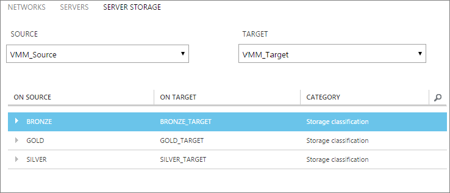
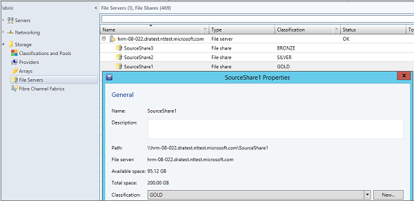

<properties
    pageTitle="Zuordnen von Speicher in Azure Website Wiederherstellung für Hyper-V virtuellen Computern Replikation zwischen lokalen Rechenzentren | Microsoft Azure"
    description="Vorbereiten der Zuordnung von Speicherplatz für Hyper-V virtuellen Computern Replikation zwischen zwei lokalen Datencenter mit Azure Website Wiederherstellung."
    services="site-recovery"
    documentationCenter=""
    authors="rayne-wiselman"
    manager="jwhit"
    editor=""/>

<tags
    ms.service="site-recovery"
    ms.devlang="na"
    ms.topic="article"
    ms.tgt_pltfrm="na"
    ms.workload="storage-backup-recovery"
    ms.date="07/06/2016"
    ms.author="raynew"/>

# Vorbereiten der Zuordnung von Speicherplatz für Hyper-V virtuellen Computern Replikation zwischen zwei lokalen Datencenter mit Azure Website Wiederherstellung

Azure Website Wiederherstellung wird der gesamtspeicherbasis strategische Wiederherstellung (BCDR) Business Continuity und Disaster durch Replikation, Failover und Wiederherstellung von virtuellen Computern und physischen Servern orchestriert. In diesem Artikel werden die Zuordnung von Speicher, wodurch optimale vorgenommenen Speicher verwenden, wenn Sie Hyper-V-virtuellen Computern zwischen zwei lokalen VMM Rechenzentren repliziert Wiederherstellung Website verwenden.

Posten Sie Kommentare oder Fragen am Ende dieses Artikels oder im [Azure Wiederherstellung Services-Forum](https://social.msdn.microsoft.com/forums/azure/home?forum=hypervrecovmgr).

## (Übersicht)

Speicher Zuordnung ist nur relevant, wenn Sie Hyper-V-virtuellen Computern repliziert sind, die sich in VMM Wolken aus einem primären Datencenter in einem sekundären Datencenter mit Hyper-V Replica oder SAN Replikation wie folgt befinden:

- **Lokal auf lokale Replikation mit Hyper-V Replica)** – Sie Speicher Zuordnung durch Zuordnung Speicher Klassifizierung auf Einrichten einer Quelle und Ziel VMM-Server, um die folgenden Aktionen auszuführen:

    - **Identifizieren Ziel Speicherplatz für Replikat virtuellen Computern**– virtuellen Computern wird in eine Speicherziel-(SMB freigeben oder cluster freigegebene Datenmengen (CSVs)) repliziert werden, die Sie auswählen.
    - **Replikat virtuellen Computers Platzierung**– Speicher Zuordnung wird verwendet, um Replikat virtuellen Computern auf Hyper-V Hostservern optimal zu platzieren. Replikat virtuellen Computern wird auf Hosts platziert werden, die die zugeordnete Speicherplatz Einstufung zugreifen können.
    - **Keine Zuordnung Speicher**– Wenn Sie Speicherplatz Zuordnung nicht konfiguriert haben, wird virtuellen Computern an den Standardspeicherort angegeben haben, auf dem Hyper-V Hostserver Replikat virtuellen Computers zugeordnet repliziert werden.

- **Lokal auf lokale Replikation mit SAN**– Sie Speicher Zuordnung durch Zuordnung Matrizen Speicherpools auf Einrichten einer Quelle und Ziel VMM-Server.
    - **Angeben von Ressourcenpool**– gibt an, welche sekundäre Speicherpool Replikationsdaten aus dem Pool primären empfängt.
    - **Identifizieren Ziel Speicherpools**– stellt sicher, dass die zugeordnete Ziel Speicherpool Ihrer Wahl LUNs in einer Quelle Replikationsgruppe repliziert werden.

## Einrichten von Speicher Branchen für Hyper-V Replikation

Wenn Sie Hyper-V Replica Replikation mit Website Wiederherstellung verwenden, ordnen Sie zwischen Speicher Klassifizierung auf Quell- und Zielwebsites VMM-Servern oder auf einem einzelnen VMM-Server, wenn zwei Websites vom gleichen VMM Server verwaltet werden. Beachten Sie Folgendes:

- Wenn Zuordnung ordnungsgemäß konfiguriert ist und die Replikation aktiviert ist, wird von Speicher in der zugeordneten-Zielort virtuelle Festplatte des virtuellen Computers am primären Standort repliziert werden.
- Klassifizierung von Speicher müssen die Hostgruppen in der Quell- und Zielwebsites Wolken zur Verfügung stehen.
- Klassifizierung erforderlich vom gleichen Typ Speicher sind nicht. Beispielsweise können Sie eine Datenquelle Klassifizierung zuordnen, die SMB-Freigaben für eine gewünschte Klassifizierung enthält, die CSVs enthält.
- Erfahren Sie mehr unter [How to Klassifizierung von Speicher in VMM zu erstellen](https://technet.microsoft.com/library/gg610685.aspx).

## Beispiel

Wenn Klassifizierung ordnungsgemäß in VMM konfiguriert sind, wenn Sie bei der Zuordnung von Speicher der Quell- und Zielwebsites VMM-Server auswählen, werden die Quell- und Zielwebsites Einstufung angezeigt. Hier ist ein Beispiel für Speicher-Dateifreigaben und Branchen für eine Organisation mit zwei Standorten in New York und Chicago.

**Speicherort** | **VMM-server** | **Dateifreigabe (Quelle)** | **Klassifizierung (Quelle)** | **Zugeordneten** | **Dateifreigabe (Ziel)**
---|---|--- |---|---|---
Berlin | VMM_Source| SourceShare1 | GOLD | GOLD_TARGET | TargetShare1
 |  | SourceShare2 | SILBER | SILVER_TARGET | TargetShare2
 | | SourceShare3 | BRONZE | BRONZE_TARGET | TargetShare3
Chicago | VMM_Target |  | GOLD_TARGET | Nicht zugeordnete |
| | | SILVER_TARGET | Nicht zugeordnete |
 | | | BRONZE_TARGET | Nicht zugeordnete

Sie möchten diese auf der Registerkarte **Server Speicherplatz** auf der Seite **Ressourcen** des Portals Website Wiederherstellung konfigurieren.

Mit diesem Beispiel:
- Wenn ein Replikat virtuellen Computers ist für alle virtuellen Computern GOLD Speichermenge (SourceShare1) erstellt, wird es in eine GOLD_TARGET Storage (TargetShare1) repliziert werden.
- Beim Erstellen ein Replikat virtuellen Computers für alle virtuellen Computern auf Silber-Speicher (SourceShare2) wird in einem SILVER_TARGET (TargetShare2) Speicher repliziert werden, und so weiter.

Im nächsten Screenshot der tatsächlichen Dateifreigaben und deren zugeordneten Klassifizierung in VMM angezeigt.

## Mehrere Speicherorte

Die gewünschte Klassifizierung mit mehreren SMB-Freigaben oder CSVs zugewiesen ist, wird der optimale Speicherort automatisch ausgewählt werden, wenn die virtuellen Computern geschützt ist. Wenn keine geeignete Zielspeicher mit der angegebenen Klassifizierung verfügbar ist, wird der Standardspeicherort auf dem Host von Hyper-V angegeben virtuellen Festplatten Replikat platziert verwendet.

In der folgenden Tabelle zeigen, wie Speicher Klassifizierung und freigegebene Datenmengen in diesem Beispiel eingerichtet sind.

**Speicherort** | **Klassifizierung** | **Zugehörige Speicher**
---|---|---
Berlin | GOLD | 
C:\ClusterStorage\SourceVolume1

\\FileServer\SourceShare1

 | SILBER | 
C:\ClusterStorage\SourceVolume2

\\FileServer\SourceShare2

Chicago | GOLD_TARGET | 
C:\ClusterStorage\TargetVolume1

\\FileServer\TargetShare1

 | SILVER_TARGET| 
C:\ClusterStorage\TargetVolume2

\\FileServer\TargetShare2

In dieser Tabelle wird das Verhalten zusammengefasst, wenn Sie den Schutz für virtuellen Computern (VM1 - VM5) in diesem Beispiel Umgebung aktivieren.

**Virtuellen Computern** | **Ursprünglicher Speicher** | **Klassifizierung von Quelle** | **Zugeordnete Zielspeicher**
---|---|---|---
VM1 | C:\ClusterStorage\SourceVolume1 | GOLD | 
C:\ClusterStorage\SourceVolume1

\\\FileServer\SourceShare1

Beide GOLD_TARGET

VM2 | \\FileServer\SourceShare1 | GOLD | 
C:\ClusterStorage\SourceVolume1

\\FileServer\SourceShare1
 
Beide GOLD_TARGET

VM3 | C:\ClusterStorage\SourceVolume2 | SILBER | 
C:\ClusterStorage\SourceVolume2

\FileServer\SourceShare2

VM4 | \FileServer\SourceShare2 | SILBER |
C:\ClusterStorage\SourceVolume2

\\FileServer\SourceShare2

Beide SILVER_TARGET

VM5 | C:\ClusterStorage\SourceVolume3 | N/V | Keine Zuordnung, damit der Standardspeicherort der Hyper-V-Hosts verwendet wird

## Nächste Schritte

Nachdem Sie nun ein besseres Verständnis der Zuordnung von Speicher, [Fertigstellen Azure Website Wiederherstellung bereitstellen](site-recovery-best-practices.md)stehen Ihnen.
