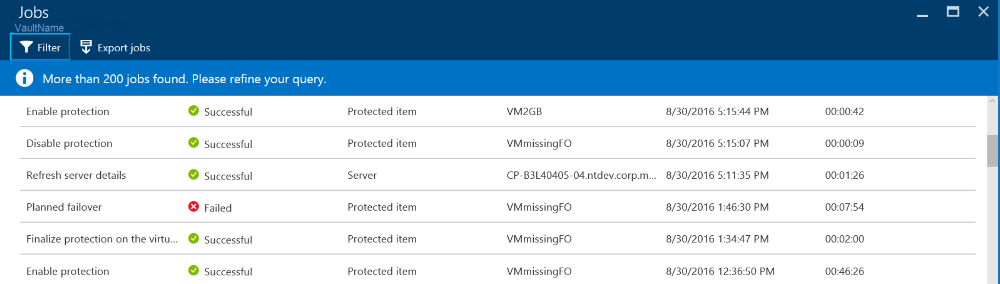
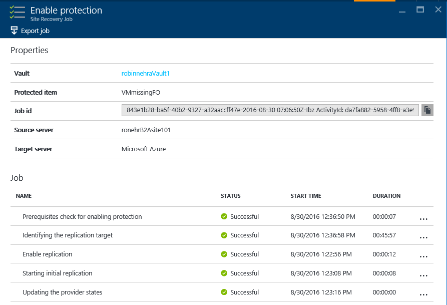
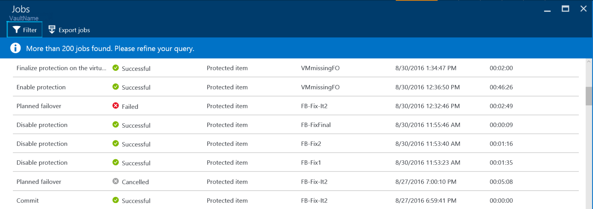
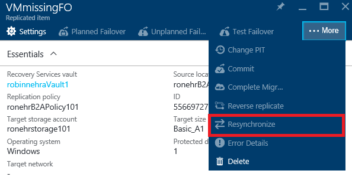

<properties
    pageTitle="Hyper-V Replikation mit Azure Website Wiederherstellung | Microsoft Azure"
    description="Lesen Sie diesen Artikel um zu verstehen, die technischen Konzepte, mit denen Sie erfolgreich installieren, konfigurieren und Verwalten von Azure Website Wiederherstellung."
    services="site-recovery"
    documentationCenter=""
    authors="Rajani-Janaki-Ram"
    manager="mkjain"
    editor=""/>

<tags
    ms.service="site-recovery"
    ms.devlang="na"
    ms.topic="article"
    ms.tgt_pltfrm="na"
    ms.workload="storage-backup-recovery"
    ms.date="09/12/2016"
    ms.author="rajanaki"/>  

# Hyper-V Replikation mit Azure Website Wiederherstellung

In diesem Artikel werden die technischen Konzepte, die Ihnen, die erfolgreich konfigurieren und Verwalten von einer Website Hyper-V oder System Center virtuellen Computern Manager (VMM) Website auf Azure Schutz helfen mithilfe der Wiederherstellung der Azure-Website.

## Einrichten der Umgebung Quelle für die Replikation zwischen lokalen und Azure

Im Rahmen der Einrichtung der Wiederherstellung zwischen lokalen und Azure unbedingt herunterladen und installieren auf dem Server VMM Azure Website Wiederherstellung Anbieter. Installieren Sie Azure Wiederherstellung Services-Agent auf jedem Hyper-V-Host ein.

Einrichten der Umgebung Quelle in einer Hyper-V verwalteten Infrastruktur ähnelt dem Einrichten der Umgebung Quelle in einer VMM verwalteten Infrastruktur zur Verfügung. Der einzige Unterschied ist, dass der Anbieter und der Agent auf dem Host von Hyper-V selbst installiert sind. In der Umgebung VMM der Anbieter auf dem VMM-Server installiert ist, und der Agent auf den Hyper-V-Hosts (im Falle einer Replikation in Azure) installiert ist.

## Workflows

### Aktivieren des Schutzes
Nachdem Sie einen virtuellen Computer aus dem Azure-Portal oder lokalen schützen, beginnt Website Wiederherstellung Auftrag **Schutz aktivieren** . Sie können sie unter der Registerkarte **Aufträge** überwachen.

**Aktivieren des Schutzes** Auftrags überprüft für die erforderlichen Komponenten vor Aufrufen der [CreateReplicationRelationship](https://msdn.microsoft.com/library/hh850036.aspx) -Methode. Diese Methode erstellt Azure-Replikation mithilfe von Eingaben, die während Schutz konfiguriert werden.

Der Auftrag **Schutz aktivieren** wird die erste Replikation aus lokalen durch Aufrufen der Methode [StartReplication](https://msdn.microsoft.com/library/hh850303.aspx) gestartet. Diese Methode sendet virtuelle Laufwerke des virtuellen Computers zu Azure.

### Fertigstellen Sie Schutz des virtuellen Computers
Wenn die erste Replikation ausgelöst wird, wird eine [Momentaufnahme eines Hyper-V virtuellen Computers](https://technet.microsoft.com/library/dd560637.aspx) übernommen. Virtueller Festplatten sind verarbeiteten nacheinander, bis alle Datenträger auf Azure hochgeladen werden. Dieser Vorgang dauert normalerweise eine Weile fertig sind, basierend auf der Festplattengröße und die Bandbreite. Zum Optimieren Ihrer Netzwerkverwendung von, finden Sie unter [Verwalten der lokalen Azure Schutz Netzwerk Bandbreite: Einsatz hinzu](https://support.microsoft.com/kb/3056159).

Nachdem die erste Replikation abgeschlossen ist, konfiguriert der Auftrag **Finalize Schutz des virtuellen Computers** im Netzwerk befinden und nach der Replikation Einstellungen aus. Während der anfänglichen Replikation ausgeführt wird:

- Alle Änderungen an den Datenträger werden nachverfolgt. 
- Zusätzlichen Speicherplatz verbraucht ist für die Momentaufnahme und Dateien von Hyper-V Replikat Log (HRL).

Der erste Replikation fertig sind wird die Momentaufnahme eines Hyper-V virtuellen Computers gelöscht. Zusammenführen von Änderungen von Daten nach dem ersten Replikation auf den übergeordneten Datenträger führt dieser Löschvorgang.

### Deltareplikation
Hyper-V Replikat Replikation Tracker, die Teil der Hyper-V Replikat-Replikations-Engine, Titel der Änderungen auf eine virtuelle Festplatte als Hyper-V Replikat (*.hrl) Protokolldateien ist. HRL Dateien werden in demselben Verzeichnis wie die zugehörigen Datenträger.

Jedes Laufwerk, das für die Replikation konfiguriert ist verfügt über eine zugeordnete HRL-Datei. Dieses Protokoll wird an den Kunden Speicherkonto gesendet, nachdem erste Replikation abgeschlossen ist. Wenn ein Protokoll auf dem Weg zu Azure ist, werden die Änderungen in der primären in einer anderen Protokolldatei im selben Verzeichnis nachverfolgt.

Bei der anfänglichen Replikation oder Deltareplikation können Sie die virtuellen Computer Replikation Dienststatus in der Ansicht virtueller Computer überwachen, wie [Monitor Replikation Gesundheit für virtuellen Computern](./site-recovery-monitoring-and-troubleshooting.md#monitor-replication-health-for-virtual-machine)angegeben.  

### Erneute Synchronisierung
Eine virtuellen Computern wird für eine erneute Synchronisierung markiert, wenn sowohl Deltareplikation schlägt fehl, und erste vollständige Replikation in Bezug auf die Bandbreite oder einer Uhrzeit teure ist. Wenn Stapeln angeordnete HRL Dateigröße bis zu 50 % der Gesamtgröße des Datenträgers angegeben, wird angenommen, des virtuellen Computers für eine erneute Synchronisierung markiert. Erneute Synchronisierung minimiert die Menge der Daten, die über das Netzwerk gesendet werden, indem Sie Kontrollsummen der Quell- und Zielwebsites virtuellen Computern Datenträger, und nur die Differenz zu senden.

Nach Abschluss der erneuten Synchronisierung sollte normal Deltareplikation fortsetzen. Sie können die erneute Synchronisierung fortsetzen ein Netzwerkausfall oder ein anderes einem Dienstausfall eintreten.

Standardmäßig wird automatisch geplanten erneute Synchronisierung so konfiguriert, dass außerhalb Arbeitszeit erfolgen. Wenn des virtuellen Computers manuell neu synchronisiert werden muss, wählen Sie aus dem Portal des virtuellen Computers aus, und klicken Sie auf **neu zu synchronisieren**.

Erneute Synchronisierung verwendet einen-Block Aufteilung Stelle, an der Quell- und Zielwebsites Dateien werden in feste Abschnitte unterteilt. Prüfsummen für jeden Datenblock generiert und anschließend verglichen, um zu bestimmen, welche Blöcke aus der Quelle auf das Ziel angewendet werden müssen.

### Wiederholen Sie Logik
Es gibt integrierte "Wiederholen" Logik Replikation Fehler aus. Diese Logik kann in zwei Kategorien unterteilt werden:

| Kategorie                  | Szenarien                                    |
|---------------------------|----------------------------------------------|
| Nicht behebbarer Fehler     | Ist keine Wiederholung des Vorgangs. Status von virtuellen Computern Replikation ist **kritisch**und Administratoreingriff erforderlich ist. Beispiele für: <ul><li>Fehlerhafte virtuelle Festplatte Kette</li><li>Ungültiger Status für die Replikat virtuellen Computern</li><li>Fehler im Netzwerk-Authentifizierung</li><li>Fehler bei der Berechtigung</li><li>Virtuellen Computern, die bei einem eigenständigen Hyper-V Server gefunden wird</li></ul>|
| Behebbarer Fehler         | Wiederholungsversuche auftreten, jeder Replikationsintervall, mithilfe einer exponentiellen Back-deaktivieren, die vom Anfang des ersten Versuch (1, 2, 4, 8, 10 Minuten) des Wiederholungsintervalls erhöht wird. Wenn ein Fehler auftritt, wiederholen Sie alle 30 Minuten. Beispiele für: <ul><li>Netzwerkfehler</li><li>Wenig Speicherplatz</li><li>Nicht genügend Speicher verfügbar</li></ul>|

## Schutz und Wiederherstellung Lebenszyklus von Hyper-V-Computer

## Weitere Ressourcen

- [Überwachen Sie und Behandeln von Problemen mit Schutz für VMware, VMM, Hyper-V und physische Websites](./site-recovery-monitoring-and-troubleshooting.md)
- [Anbieten, für den Microsoft-Support](./site-recovery-monitoring-and-troubleshooting.md#reaching-out-for-microsoft-support)
- [Allgemeine Azure Website Wiederherstellung Fehler und deren Auflösung](./site-recovery-monitoring-and-troubleshooting.md#common-asr-errors-and-their-resolutions)
