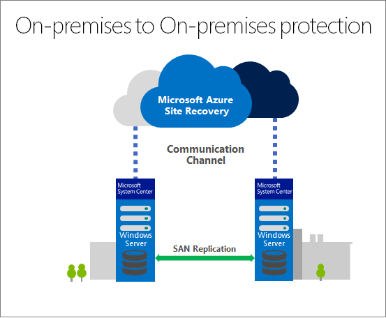
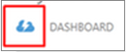
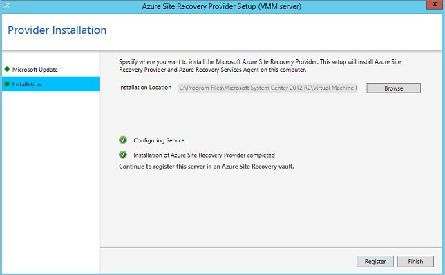
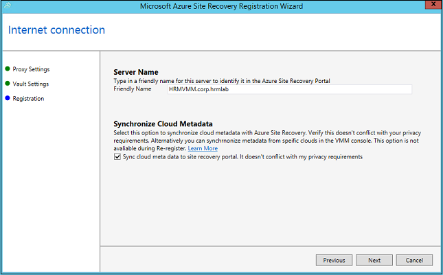
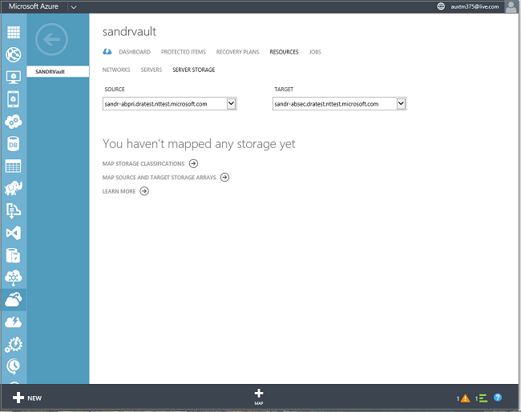
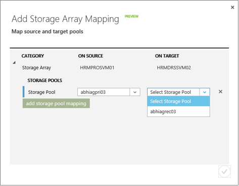
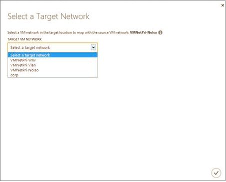
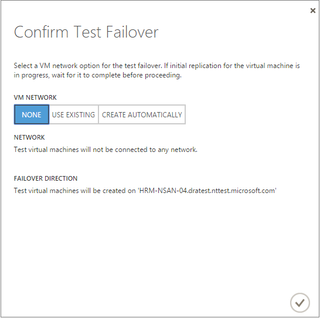

<properties
    pageTitle="Hyper-V virtuellen Computern in einer Cloud VMM an einem sekundären Standort mit Azure Website Wiederherstellung mit SAN repliziert | Microsoft Azure"
    description="Dieser Artikel beschreibt, wie Hyper-V-virtuellen Computern zwischen zwei Websites mit Azure Website Wiederherstellung mit SAN-Replikation repliziert."
    services="site-recovery"
    documentationCenter=""
    authors="rayne-wiselman"
    manager="jwhit"
    editor=""/>

<tags
    ms.service="site-recovery"
    ms.workload="backup-recovery"
    ms.tgt_pltfrm="na"
    ms.devlang="na"
    ms.topic="article"
    ms.date="07/06/2016"
    ms.author="raynew"/>

# Repliziert Hyper-V virtuellen Computern in einer Cloud VMM an einem sekundären Standort mit Azure Website Wiederherstellung mit SAN

In diesem Artikel erfahren Sie, wie Sie Website Wiederherstellung zum Koordinieren und automatisieren SAN-Replikation und Failover für Hyper-V virtuelle Computer befindet sich im System Center VMM Wolken zu einer sekundären VMM Website bereitstellen.

Nach dem Lesen diesen Artikel Beitrag Kommentare oder Fragen unten in diesem Artikel oder im [Azure Wiederherstellung Services-Forum](https://social.msdn.microsoft.com/forums/azure/home?forum=hypervrecovmgr). 

## (Übersicht)

Organisationen benötigen eine Strategie Business Continuity- und Disaster Wiederherstellung (BCDR), die eine bestimmt, wie apps, Auslastung und Daten bleiben während der geplanten und ungeplanten Ausfallzeiten ausgeführt werden und verfügbar, und zum normalen Arbeit Umständen so früh wie möglich wiederherzustellen. Ihre BCDR Strategie im Mittelpunkt der Lösungen, die bei einem bei Datenverlusten Geschäftsdaten sicherer und wiederhergestellt, und Auslastung kontinuierlich verfügbar bleiben.

Website Wiederherstellung ist eine Azure-Dienst, der zur strategische BCDR beiträgt, indem orchestriert Replikation von physische Server lokal und in der Cloud (Azure) oder zu einem sekundären Datencenter-virtuellen Computern an. Treten Ausfall in gewohnten Standort befinden, fehl Sie über den sekundären Standort zum Aktualisieren von apps und Auslastung zur Verfügung. Sie fehl zurück zur gewohnten Standort befinden, wenn sie normale Vorgänge zurückgibt. Website Wiederherstellung in eine Reihe von Szenarios verwendet werden kann, und kann eine Reihe von Auslastung schützen. Erfahren Sie mehr in [Neuigkeiten Azure Website Wiederherstellung?](site-recovery-overview.md)

Dieser Artikel enthält Anweisungen zum Einrichten von Replikation von Hyper-V virtuelle Computer aus einer VMM-Website in eine andere SAN Relication verwenden. Es enthält eine Übersicht über die Architektur, und Voraussetzungen für die Bereitstellung und Anweisungen. Sie ermitteln und klassifizieren SAN-Speicher in VMM, Bereitstellen von LUNs, und weisen Sie Speicher zu Hyper-V Cluster. Es wird beendet, indem testen Failover, um sicherzustellen, dass alles wie erwartet funktioniert.

## Warum mit SAN werden repliziert?

So sieht wie dieses Szenario bietet:

- Stellt eine Website Wiederherstellung automatisierte Enterprise skalierbare Replikations-Lösung.
- Nutzt SAN Replikationsfunktionen von Enterprise-Speicher Partner über beide Fibre Channel und iSCSI-Speicher. Finden Sie unter unseren [Partner für SAN-Speicher](http://social.technet.microsoft.com/wiki/contents/articles/28317.deploying-azure-site-recovery-with-vmm-and-san-supported-storage-arrays.aspx).
- Nutzt Ihre vorhandene SAN-Infrastruktur zum Schützen wichtiger Anwendung, die in Hyper-V Cluster bereitgestellt.
- Gast Cluster unterstützt.
- Sorgt für Replikationskonsistenz auf verschiedenen Ebenen einer Anwendung mit synchronisierten Replikation für niedrig RTO und RPO und asynchrone Replikation für hohe Flexibilität, je nach Storage Array-Funktionen.  
- Integration mit VMM bietet SAN Management innerhalb der VMM-Verwaltungskonsole und SMI-S in VMM erkennt vorhandene Speicher.  

## Architektur

Dieses Szenario Loss Ihrer Auslastung durch Sichern von Hyper-V-virtuellen Computern aus einer lokalen VMM-Website in eine andere SAN-Replikation verwenden.

In diesem Szenario Komponenten umfassen:

- **Lokale virtuellen Computern**– Ihrer lokalen Hyper-V-Servern, die in VMM private Wolken verwaltet werden, enthalten virtuellen Computern, die Sie schützen möchten.
- **Lokale VMM-Servern**– Sie können einen oder mehrere VMM-Server ausgeführt wird, klicken Sie auf der primären Website, die Sie schützen möchten, und klicken Sie auf den sekundären Standort.
- **SAN-Speicher**– A SAN Array auf dem primären Standort und eine im sekundären Standort
-  **Azure Website Wiederherstellung Tresor**– der Tresor koordiniert und koordiniert Daten Replikat, Failover und Wiederherstellung zwischen Ihrem lokalen Websites.
- **Anbieter für Azure Websites Wiederherstellung**– Anbieter auf jede VMM-Server installiert ist.

## Bevor Sie beginnen

Stellen Sie sicher, dass Sie diese erforderlichen Komponenten angeordnet haben:

**Erforderliche Komponenten** | **Details** 
--- | ---
**Azure**| Benötigen Sie ein [Microsoft Azure](https://azure.microsoft.com/) -Konto ein. Sie können mit einer [kostenlosen Testversion](https://azure.microsoft.com/pricing/free-trial/)beginnen. [Erfahren Sie mehr](https://azure.microsoft.com/pricing/details/site-recovery/) über die Website Wiederherstellung Preise. 
**VMM** | Sie benötigen mindestens eine VMM-Server als eine physische oder virtuelle eigenständigen Server oder einen virtuellen Cluster bereitgestellt.   Der VMM-Server sollte mit den neuesten kumulativen Updates System Center 2012 R2 ausgeführt werden.  Sie benötigen mindestens eine Cloud so konfiguriert, dass auf dem primären VMM-Server, die, den Sie schützen möchten, und eine Cloud so konfiguriert, dass der sekundäre VMM-Server, die, den Sie für Schutz und Wiederherstellung verwenden möchten.  Die Quelle Cloud, die Sie schützen möchten, muss eine oder mehrere VMM Hostgruppen enthalten.  Alle VMM Wolken müssen das Hyper-V Kapazität Profil festgelegt.  Weitere Informationen zum Einrichten von VMM Wolken in [der Cloud-Textur VMM konfigurieren](https://msdn.microsoft.com/library/azure/dn469075.aspx#BKMK_Fabric), und [Exemplarische Vorgehensweise: Erstellen von privaten Wolken mit System Center 2012 SP1 VMM](http://blogs.technet.com/b/keithmayer/archive/2013/04/18/walkthrough-creating-private-clouds-with-system-center-2012-sp1-virtual-machine-manager-build-your-private-cloud-in-a-month.aspx).
**Hyper-V** | Benötigen Sie eine oder mehrere Hyper-V Cluster in der primären und sekundären Websites und einen oder mehrere virtuelle Computer auf Quelle Hyper-V Cluster. Jede Gruppe sollte VMM Hostgruppen in der primären und sekundären Speicherorte einen oder mehrere Hyper-V Cluster enthalten.  Die Hyper-V-Server Host und Zielliste müssen mindestens ausführen Windows Server 2012 mit Hyper-V-Rolle und die neuesten Updates installiert haben.  Alle Hyper-V Server mit virtuellen Computern, die Sie schützen möchten, muss in der Cloud VMM befinden.  Wenn Sie Hyper-V in einer Notiz Cluster dieser Bank Cluster ausführen wird nicht automatisch erstellt, wenn Sie einen statischen IP-Adresse-basierten Cluster haben. Sie müssen der Cluster Makler manuell konfigurieren. [Weitere Informationen finden Sie](https://www.petri.com/use-hyper-v-replica-broker-prepare-host-clusters) in der Andreas Finn Blogeintrag.
**SAN-Speicher** | Verwenden der Replikation SAN kann Gast gruppierten virtuellen Computern mit iSCSI oder Fibre Channel-Speicher oder Verwenden von freigegebenen virtuelle Festplatten (Vhdx) repliziert.  Sie benötigen zwei SAN Arrays einrichten, eine in der primären Standort und eine in den sekundären.  Netzwerk-Infrastruktur sollte zwischen den Arrays eingerichtet werden. Peering und Replikation konfiguriert werden soll. Replikation Lizenzen sollte gemäß der Matrix Speicher eingerichtet werden.  Netzwerke sollte zwischen den Hyper-V-Host-Servern und Speicher-Array eingerichtet werden, damit Hosts mit Speicher LUNs kommunizieren können mit ISCSI oder FC.   Überprüfen Sie die Liste [Speicher-Arrays unterstützt](http://social.technet.microsoft.com/wiki/contents/articles/28317.deploying-azure-site-recovery-with-vmm-and-san-supported-storage-arrays.aspx).  SMI-S Provider, bereitgestellten Speicher Array Hersteller installiert werden soll, und die SAN Arrays vom Anbieter verwaltet werden soll. Richten Sie den Anbieter nach deren Dokumentation aus.  Stellen Sie sicher, dass der SMI-S-Anbieter für die Matrix auf einem Server ist, die über das Netzwerk IP-Adresse oder FQDN VMM-Server zugreifen können.  Jedes Array SAN sollte mindestens Speicherpools verfügbar in dieser Bereitstellung verwenden müssen. Muss der VMM-Server am primären Standort des primären Arrays verwalten aus, und der sekundäre VMM-Server wird die sekundäre Matrix verwalten.  Der VMM-Server am primären Standort sollte das primäre Array verwalten und sekundäre VMM-Server sollte die sekundäre Matrix verwalten.
**Netzwerk-Zuordnung** | Sie können Netzwerk-Zuordnung, um sicherzustellen, dass repliziert virtuellen Computern optimal nach Failover auf sekundäre Hyper-V-Host-Servern platziert werden und sie zum entsprechenden virtuellen Computer Netzwerken eine Verbindung herstellen können, konfigurieren. Wenn Sie nicht Netzwerk konfigurieren wird nicht Replikat Zuordnung virtuellen Computern mit jedes Netzwerk nach Failover verbunden sein.  Zum Einrichten des Netzwerks Zuordnung während der Bereitstellung sicherzustellen, dass die virtuellen Computer auf dem Server der Quelle Hyper-V-Host mit einem VMM VM-Netzwerk verbunden sind. Diesem Netzwerk verknüpft werden soll, um ein logisches Netzwerk, das mit der Cloud. ist < Br / Die Cloud Ziel auf dem sekundären VMM-Server, mit denen Sie für die Wiederherstellung sollte eine entsprechende virtueller Computer Netzwerk konfiguriert haben, und es wiederum verknüpft werden soll mit einem entsprechenden logischen Netzwerk, das mit der Cloud Ziel verknüpft ist.  [Weitere](site-recovery-network-mapping.md) Informationen zum Netzwerk-Zuordnung.

## Schritt 1: Vorbereiten der VMM Infrastruktur

Vorbereiten Ihrer Infrastruktur VMM müssen Sie:

1. Stellen Sie sicher, dass VMM Wolken eingerichtet sind
2. Integrieren und SAN-Speicher in VMM klassifizieren
3. Erstellen von LUNs und weisen Sie Speicher
4. Erstellen von Replikationsgruppen
5. Einrichten von virtuellen Computer Netzwerken

### Stellen Sie sicher, dass VMM Wolken eingerichtet sind

Website Wiederherstellung koordiniert Schutz für virtuelle Maschinen, die sich auf Hyper-V Hostservern in VMM Wolken befinden. Sie müssen Sie sicherstellen, dass diese Wolken ordnungsgemäß eingerichtet sind, vor der Bereitstellung der Website Wiederherstellung. Weitere in [privaten Wolken erstellen](http://blogs.technet.com/b/keithmayer/archive/2013/04/18/walkthrough-creating-private-clouds-with-system-center-2012-sp1-virtual-machine-manager-build-your-private-cloud-in-a-month.aspx) in Keith Mayers Blog.

### Integrieren und SAN-Speicher in VMM klassifizieren

Fügen Sie in der VMM-Verwaltungskonsole eine klassifizieren SANs hinzu:

1. Klicken Sie im Arbeitsbereich **Fabric** **Speicher**ein. Klicken Sie auf **Start** > **Ressourcen hinzufügen** > **Speichergeräte** So starten Sie den Assistenten zum Hinzufügen von Speicher Geräten.
2. Wählen Sie Seite **Wählen Sie einen Speichertyp** **SAN und NAS Geräte erkannt und von einem SMI-S-Anbieter verwaltet werden**.

    

3. Klicken Sie auf der Seite **Protokoll angeben und die Adresse des Anbieters SMI-S Speicher** **SMI-S CIMXML** wählen Sie aus, und geben Sie die Einstellungen für das Herstellen einer Verbindung mit dem Anbieter.
4. Geben Sie in **Anbieter IP-Adresse oder den vollqualifizierten Domänennamen** und **TCP/IP Port**die Einstellungen für das Herstellen einer Verbindung mit dem Anbieter. Sie können nur eine SSL-Verbindung für SMI-S CIMXML verwenden.

    

5. Geben Sie ein, der Zugriff auf den Anbieter oder Erstellen einer neuen Firma kann VMM Ausführen als Konto **als Konto ausführen** .
6. Klicken Sie auf der Seite **Informationen sammeln** versucht VMM automatisch ermitteln und Importieren von Informationen im Speicher-Gerät. Um die Suche zu wiederholen, klicken Sie auf **Scannen Anbieter**. Wenn der Erkennungsvorgang erfolgreich, den ermittelten Speicher-Arrays, Speicherpools war, Hersteller, Modell und Kapazität auf der Seite aufgelistet.

    

7. **Speicherpools zu positionieren, klicken Sie unter Verwaltung und weisen Sie eine Klassifizierung auswählen**wählen Sie die Speicherpools VMM verwalten und eine Einstufung nachgeführt wird. LUN-Informationen werden aus der Speicherpools importiert werden. Erstellen Sie LUNs basierend auf den Clientanwendungen, die müssen Sie schützen möchten, deren Kapazität Anforderungen und Ihrer Anforderung für was zusammen repliziert werden muss.

    

### Erstellen von LUNs und weisen Sie Speicher

1. Erstellen Sie anschließend SAN-Speicher in VMM integriert ist (bereitstellen) logische Einheiten (LUNs):

    - [So markieren Sie eine Methode zum Erstellen von logischer Einheiten in VMM](https://technet.microsoft.com/library/gg610624.aspx)
    - [Gewusst wie: Bereitstellen von Speicher logischen Einheiten in VMM](https://technet.microsoft.com/library/gg696973.aspx)

    >[AZURE.NOTE] Nachdem Sie die Replikation für einen Computer aktivieren haben dürfen nicht Sie virtuelle Festplatten dafür LUNs hinzufügen, die in einer Website Wiederherstellung Replikationsgruppe ansässig sind nicht. In diesem Fall wird nicht sie nach der Wiederherstellung Website erkannt werden.

2. Klicken Sie dann reservieren Sie Speicherkapazität zum Cluster Host Hyper-V so, dass VMM bereitgestellte Speicher virtuellen Computerdaten bereitstellen kann:

    - Vor dem Zuweisen von Speicher zu Cluster müssen Sie es in der Gruppe VMM Host zugewiesen werden auf dem Cluster befindet. Finden Sie unter [wie Speicher logischen Einheiten zu einer Hostgruppe zugewiesen werden](https://technet.microsoft.com/library/gg610686.aspx) und [wie Speicherpools zu einer Hostgruppe zugewiesen werden](https://technet.microsoft.com/library/gg610635.aspx). </a>.
    - Fügen Sie dann Speicherkapazität zum Cluster beschriebenen im [Speicher auf einem Hyper-V Hostcluster in VMM konfigurieren](https://technet.microsoft.com/library/gg610692.aspx). </a>.

### Erstellen von Replikationsgruppen

Erstellen Sie eine Replikationsgruppe, die alle enthält, die zusammen repliziert werden müssen.

1. Öffnen Sie die Registerkarte **Replikationsgruppen** Speicher Matrix Eigenschaften in der VMM-Verwaltungskonsole, und auf **neu**.
2. Erstellen Sie dann die Replikations-Gruppe ein.

    

### Einrichten von Netzwerken

Wenn Sie konfigurieren Netzwerk Zuordnung den folgenden Vorgang ausführen möchten:

1. [Informationen zu](site-recovery-network-mapping.md) Netzwerk-Zuordnung.
2. Bereiten Sie virtueller Computer Netzwerke in VMM an vor:

    - [Logische Netzwerke einrichten](https://technet.microsoft.com/library/jj721568.aspx).
    - [Einrichten von virtuellen Computer Netzwerken](https://technet.microsoft.com/library/jj721575.aspx).

## Schritt 2: Erstellen einer Tresor

1. Melden Sie sich mit dem [Verwaltungsportal](https://portal.azure.com) aus dem VMM-Server, die, den Sie erfassen möchten.

2. Erweitern Sie **Data Services** > **Wiederherstellung Services** und auf der **Website Wiederherstellung Tresor**.

3. Klicken Sie auf **neu erstellen** > **schnell zu erstellen**.

4. Geben Sie im Feld **Name**einen Anzeigenamen ein, um den Tresor zu identifizieren.

5. Wählen Sie in der **Region** das geografische Region für den Tresor ein. Zum Überprüfen der unterstützte Regionen finden Sie unter geografischen Verfügbarkeit in [Azure Website Wiederherstellung Preise Details](https://azure.microsoft.com/pricing/details/site-recovery/).

6. Klicken Sie auf **Erstellen Tresor**.

    

Überprüfen Sie die Statusleiste, um zu bestätigen, dass der Tresor erfolgreich erstellt wurde. Der Tresor werden auf der **Wiederherstellung Services** -Hauptseite als **aktiv** aufgelistet.

### Registrieren Sie die VMM-Server

1. Öffnen Sie die Seite Schnellstart, von der Seite **Wiederherstellung Dienste** . Schnellstart kann auch jederzeit auf das Symbol geöffnet werden.

    

2. Wählen Sie in der Dropdown-Liste **zwischen Hyper-V lokalen Website mit Array-Replikation**aus.

    

3. **Vorbereiten VMM-Servern**die neueste Version der Datei Installation Azure Website Wiederherstellung Anbieter herunterladen.
4. Führen Sie diese Datei auf dem Server der Quelle VMM. VMM in einem Cluster bereitgestellt wird, und Installieren der Datenanbieter für das erste Mal auf einem aktiven Knoten zu installieren, und schließen Sie die Installation, um den Server VMM im Tresor zu registrieren. Installieren Sie den Anbieter klicken Sie dann auf den anderen Knoten. Beachten Sie, wenn Sie den Anbieter aktualisieren, müssen Sie auf allen Knoten aktualisiert werden soll, da sie alle dieselbe Version Anbieter ausgeführt werden soll.
5. Das Installationsprogramm unterstützt ein Paar **Pre Anforderungen überprüfen** und Besprechungsanfragen über die Berechtigung zum Beenden des Diensts VMM um Anbieter Setup zu beginnen. VMM-Dienst wird automatisch neu gestartet werden, wenn Setup abgeschlossen ist. Bei der Installation auf einem Cluster VMM werden Sie aufgefordert, die Rolle des Cluster zu beenden.
6. In **Microsoft Update** können Sie nach Updates suchen in optional. Diese Einstellung aktiviert Anbieter entsprechend Ihrer Microsoft Update-Richtlinie Updates installiert werden.

    

7. Auf der Speicherort für die Installation festgelegt ist ** <SystemDrive>\Programme\Microsoft System Center 2012 R2\Virtual Computer Manager\bin**. Klicken Sie auf die Schaltfläche "installieren" So starten Sie den Anbieter installieren.

    

8. Klicken Sie auf "Registrieren" unten, um den Server im Tresor registrieren, nach der Installation von des Anbieters.

    

9. Geben Sie in **Verbindung mit dem Internet** an, wie der Anbieter ausgeführt wird, klicken Sie auf dem VMM-Server mit dem Internet verbunden. Wählen Sie **Standard-Systemproxyeinstellungen verwenden** , um die Internet-Verbindung Standardeinstellungen so konfiguriert, dass auf dem Server verwenden.

    

    - Wenn Sie einen benutzerdefinierten Proxy verwenden möchten sollten Sie es einrichten, bevor Sie den Anbieter installieren. Wenn Sie benutzerdefinierte Proxyeinstellungen konfigurieren wird ein Test ausgeführt, um die Proxy-Verbindung zu überprüfen.
    - Wenn Sie einen benutzerdefinierten Proxy verwende oder Ihr Standard-Proxy-Server erfordert eine Authentifizierung, Sie die Proxy-Details, einschließlich der Proxyadresse und den Port eingeben müssen.
    - Folgen Urls sollte aus dem VMM-Server und Hyper-V-Host zugänglich sein
        - *. hypervrecoverymanager.windowsazure.com
        - *. accesscontrol.windows.net
        - *. backup.windowsazure.com
        - *. blob.core.windows.net
        - *. store.core.windows.net
    - Ermöglichen Sie die IP-Adressen (443) [Azure Datacenter IP-Bereiche](https://www.microsoft.com/download/confirmation.aspx?id=41653) und HTTPS-Protokoll beschrieben. Weiß-Liste IP-Bereiche des Azure Region, das Sie verwenden möchten und mit Westen US müssten.
    - Wenn Sie einen benutzerdefinierten Proxy verwenden werden automatisch mit den angegebenen Proxy-Anmeldeinformationen ein Kontos VMM RunAs (DRAProxyAccount) erstellt werden. Konfigurieren Sie den Proxy-Server so, dass dieses Konto erfolgreich authentifiziert werden kann. Die kontoeinstellungen VMM RunAs können in der VMM-Verwaltungskonsole geändert werden. Hierzu öffnen Sie den Arbeitsbereich Einstellungen, erweitern Sie Sicherheit, klicken Sie auf als Konten ausführen und dann ändern Sie des Kennworts für DRAProxyAccount. Sie müssen den VMM-Dienst neu zu starten, damit diese Einstellung wirksam wird.

10. Wählen Sie im **Registrierungsschlüssel**, die Sie aus der Wiederherstellung der Azure-Website heruntergeladen und auf dem Server VMM kopiert haben.
11. **Tresor Name**überprüfen Sie den Namen der Tresor, in dem der Server registriert wird. 

    

12. Die Einstellung für die Verschlüsselung wird nur für VMM zu Azure Szenario verwendet, wenn Sie eine VMM VMM nur Benutzer sind, und klicken Sie dann diesen Bildschirm ignoriert werden können.

    

13. Geben Sie im Feld **Servername**einen Anzeigenamen ein, um den VMM-Server im Tresor zu identifizieren. Geben Sie in einer Cluster-Konfiguration den VMM Cluster Rollennamen ein.
14. Geben Sie einen Anzeigenamen für den Server, der im Tresor angezeigt werden sollen, und wählen Sie aus, ob Sie Metadaten für alle Wolken auf dem VMM-Server mit dem Tresor synchronisieren möchten, in **Initiale Cloud Metadaten synchronisieren** . Diese Aktion muss nur einmal an jeden Server erfolgen. Wenn Sie nicht alle Wolken synchronisieren möchten, können Sie diese Einstellung deaktiviert lassen und Synchronisieren jedes Cloud einzeln in der Cloud Eigenschaften, die in der VMM-Verwaltungskonsole.

    

15. Klicken Sie auf **Weiter** , um zu den Prozess abzuschließen. Nach der Registrierung werden die Metadaten aus dem VMM-Server von Azure Website Wiederherstellung abgerufen. Der Server ist auf der Registerkarte *VMM-Server* auf der Seite **Server** im Tresor angezeigt.

### Befehlszeile-installation

Den Azure-Anbieter für Websites Wiederherstellung kann auch mithilfe der folgenden Befehlszeile installiert werden. Diese Methode kann verwendet werden, um den Anbieter auf einem Server-CORE für Windows Server 2012 R2 installieren.

1. Herunterladen der Datei für die Installation Anbieter und Registrierungsschlüssel in einen Ordner sagen C:\ASR
2. Beenden Sie den System Center-virtuellen Computern Manager-Dienst
3. Extrahieren Sie das Installationsprogramm Anbieter durch Ausführen der Folgendes Befehlszeile mit **Administratorrechten** an:

        C:\Windows\System32> CD C:\ASR
        C:\ASR> AzureSiteRecoveryProvider.exe /x:. /q

4. Installieren Sie den Anbieter, indem Sie mit einer der folgenden:

        C:\ASR> setupdr.exe /i

5. Registrieren Sie den Anbieter, indem Sie mit einer der folgenden:

        CD C:\Program Files\Microsoft System Center 2012 R2\Virtual Machine Manager\bin
        C:\Program Files\Microsoft System Center 2012 R2\Virtual Machine Manager\bin\> DRConfigurator.exe /r  /Friendlyname <friendly name of the server> /Credentials <path of the credentials file> /EncryptionEnabled <full file name to save the encryption certificate>         

Wo sind die Parameter ein:

 - **/Credentials** : obligatorische Parameter, die den Speicherort angibt, in dem die Datei Key befindet,  
 - **/FriendlyName** : obligatorische Parameter für den Namen des Servers Host Hyper-V, die im Portal Azure Website Wiederherstellung angezeigt wird.
 - **/EncryptionEnabled** : optionale Parameter, die Sie benötigen nur in der VMM zu Azure Szenario verwenden, wenn Sie Ihren virtuellen Computern am statisch in Azure Verschlüsselung benötigen. Stellen Sie sicher, die den Namen der Datei, die Sie bereitstellen, die Erweiterung **PFX-Datei** hat.
 - **/ProxyAddress** : Optionaler Parameter, die Adresse des Proxyservers angibt.
 - **/ProxyPort** : Optionaler Parameter, den Port des Proxyservers angibt.
 - **/proxyUsername** : Optionaler Parameter, Proxy-Benutzernamen angibt (wenn Proxy-Authentifizierung erforderlich ist).
 - **/proxyPassword** : optionale Parameter, die angibt, das Kennwort für die Authentifizierung mit dem Proxyserver (wenn Proxy-Authentifizierung erforderlich ist).

## Schritt 3: Zuordnen von Speicher-Arrays und pools

Zuordnen von Matrizen zurück, um anzugeben, welche sekundäre Speicherpool Replikationsdaten aus dem Pool primären empfängt. Sie sollten Speicher zuordnen, bevor Sie Cloud Schutz konfigurieren, da die Zuordnungsinformationen verwendet wird, wenn Sie den Schutz für Replikationsgruppen aktivieren.

Bevor Sie überprüfen, die Wolken angezeigt werden im Tresor beginnen. Wird ausgewählt, dass alle Wolken synchronisieren, wenn Sie den Anbieter installieren oder, indem Sie eine bestimmte Cloud auf der Registerkarte **Allgemein** die Eigenschaften der Cloud in der VMM-Verwaltungskonsole für die Synchronisierung auswählen, werden Wolken erkannt. Klicken Sie dann wie folgt Speicher-Arrays zugeordnet:

1. Klicken Sie auf **Ressourcen** > **Server-Speicher** > **Karte Quell- und Zielliste**.
    
2. Wählen Sie die Speicher-Arrays auf dem primären Standort und Speicher-Arrays auf den sekundären Standort zuordnen.
3.  Zuordnen von Quell- und Zielwebsites Speicherpools in den Arrays. Wählen Sie hierzu **Speicherpools** eines Quell- und Zielwebsites Speicherpools zuordnen.

    

## Schritt 4: Konfigurieren von Cloud Schutz-Einstellungen

Nach dem VMM-Server registriert sind, können Sie die Cloud Schutz Einstellungen konfigurieren. Die Option **Synchronisieren von Daten mit dem Tresor Cloud** wird aktiviert, wenn Sie den Anbieter installiert haben, damit alle Wolken auf dem Server VMM auf der Registerkarte <b>Geschützten Elemente</b> im Tresor angezeigt werden.

1. Klicken Sie auf der Seite Schnellstart auf **Schutz für VMM Wolken einrichten**.
2. Wählen Sie auf der Registerkarte **Geschützte Elemente** aus der Cloud, die Sie konfigurieren, und wechseln Sie zur Registerkarte **Konfiguration** möchten. Beachten Sie Folgendes:
3. Wählen Sie in der **Zielliste** **VMM**ein.
4. Wählen Sie- **Zielort ein**den vor Ort VMM-Server, der die Cloud verwaltet werden, die Sie für die Wiederherstellung verwenden möchten.
5. Wählen Sie **Ziel Cloud**die Cloud Ziel für Failover von virtuellen Computern in der Cloud Quelle verwendet werden soll. Beachten Sie Folgendes:
    - Es empfiehlt sich, eine Cloud Ziel auszuwählen, die Wiederherstellung für den virtuellen Computern erfüllt, die Sie schützen können.
    - Eine Cloud kann nur auf ein paar einzelnen Cloud gehören – entweder als einer primären oder einem Ziel Cloud.
6. Azure Website Wiederherstellung stellt sicher, dass Wolken auf SAN Replikation in Speicher zugreifen und Speicher-Arrays Dies sind. Teilnehmenden Array Kollegen werden angezeigt.
7. Wenn die Überprüfung erfolgreich ist, in den **Typ der Replikation**ist, wählen Sie **SAN**aus.

Nach dem Speichern der Einstellungen ein Auftrags erstellt werden, und klicken Sie auf der Registerkarte **Aufträge** überwacht werden kann. Klicken Sie auf die Registerkarte **Konfigurieren** können Cloud Einstellungen geändert werden. Wenn Sie die Ziel-Speicherort oder Zielliste Cloud ändern möchten müssen Sie Entfernen der Cloud-Konfiguration, und konfigurieren Sie dann mit die Cloud.

## Schritt 5: Aktivieren Sie Netzwerk-Zuordnung

1. Klicken Sie auf der Seite Schnellstart auf **Netzwerke zuordnen**.
2. Wählen Sie die Quelle VMM-Server Netzwerken zuordnen soll, und das Ziel VMM-Server, den die Netzwerken zugeordnet werden soll. Die Liste der Quellnetzwerke und deren zugeordnete Ziel-Netzwerke werden angezeigt. Ein leerer Wert ist für Netzwerke angezeigt, die derzeit nicht zugeordnet sind. Klicken Sie auf das Informationssymbol neben den Netzwerknamen Quell- und Zielwebsites die Subnetze für jedes Netzwerk anzeigen.
3. Wählen Sie ein Netzwerk im **Netzwerk Quelle**, und klicken Sie dann auf **Karte**. Der Dienst erkennt die Netzwerke virtueller Computer, auf dem Zielserver und zeigt sie an.

    

4. Wählen Sie im Dialogfeld, das angezeigt wird eine der virtuellen Computer Netzwerke vom Ziel VMM Server aus.

    

5. Wenn Sie ein Zielnetzwerk auswählen, werden die geschützten Wolken, die das Quellnetzwerk verwenden angezeigt. Verfügbaren Ziel Netzwerke, die zum Schutz vor verwendet Wolken zugeordnet sind, werden ebenfalls angezeigt. Es empfiehlt sich, dass Sie Zielnetzwerk auswählen, die für alle Wolken zur Verfügung steht, die Sie für den Schutz verwenden.
6.  Klicken Sie auf das Häkchen, um die Zuordnung abzuschließen. Verfolgen des Fortschritts Zuordnung wird ein Projekt gestartet. Sie können sie auf der Registerkarte **Aufträge** anzeigen.

## Schritt 6: Aktivieren der Replikation für Replikationsgruppen

Bevor Sie Schutz für virtuelle Computer aktivieren können, die Sie für die Replikationsgruppen Speicher Replikation zu aktivieren müssen.

1. Öffnen Sie im Portal Azure Website Wiederherstellung auf der Eigenschaftenseite der primären Cloud Registerkarte **virtuelle Computer** ein. Klicken Sie auf die **Replikation Gruppe hinzufügen**.
2. Wählen Sie eine oder mehrere VMM Replikationsgruppen, die mit der Cloud, verknüpft sind überprüfen die Quell- und Zielwebsites Matrizen und Häufigkeit der Replikation angeben.

Wenn dieser Vorgang abgeschlossen ist, Azure Website Wiederherstellung, zusammen mit VMM die SMI-S Provider die Ziel-Onlinespeicher LUNs bereitstellen und Speicherreplikation aktivieren. Wenn die Replikationsgruppe bereits repliziert ist, Azure Website Wiederherstellung verwendet die vorhandene Replikation Beziehung wieder und aktualisiert die Informationen in Azure Website Wiederherstellung.

## Schritt 7: Aktivieren des Schutzes für virtuellen Computern

Nachdem eine Speicher Gruppe Replikation ist, Aktivieren des Schutzes für virtuelle Computer in der VMM-Verwaltungskonsole verwenden eine der folgenden Methoden:

- **Neuen virtuellen Computern**– In VMM Console beim Erstellen eines neuen virtuellen Computers Sie Azure Website Wiederherstellung Schutz aktivieren und der Replikationsgruppe des virtuellen Computers zugeordnet.
Mit dieser Option verwendet VMM intelligente Platzierung, um die virtuellen Speicher optimal der LUNs der Replikationsgruppe zu platzieren. Azure Website Wiederherstellung koordiniert die Erstellung eines Schattens virtuellen Computers auf dem sekundären Standort und reserviert Kapazität, sodass Replikat virtuellen Computern nach Failover gestartet werden kann.
- **Vorhandenen virtuellen Computern**– Wenn ein virtuelle Computer bereits in VMM bereitgestellt wird, können Sie Azure Website Wiederherstellung Schutz aktivieren, und führen Sie eine Speichermigration zu einer Replikationsgruppe. Nach dem Abschluss VMM Azure Website Wiederherstellung den neuen virtuellen Computer erkennen und beginnen Sie für den Schutz in Azure Website Wiederherstellung zu verwalten. Einen Schatten virtuellen Computern wird auf der Sekundärachse Website erstellt und reserviert Kapazität, sodass Replikat virtuellen Computers nach Failover gestartet werden kann.

    

Nachdem virtuellen Computern für Schutz aktiviert sind, werden sie in der Verwaltungskonsole Azure Website Wiederherstellung angezeigt. Sie können Anzeigen der Eigenschaften von virtuellen Computern, Status zu verfolgen und fail über Replikationsgruppen, die mehrere virtuelle Computer enthalten. Beachten Sie, dass in SAN-Replikation alle virtuellen Computer mit einer Replikationsgruppe verknüpfte über zusammen ausgeführt werden müssen. Dies ist, da Failover zuerst an den Layer Speicher erfolgt. Es ist wichtig, um Ihre Replikationsgruppen ordnungsgemäß zu gruppieren und Ort nur verknüpften virtuellen Computern zusammen.

>[AZURE.NOTE] Nachdem Sie die Replikation für einen Computer aktivieren haben dürfen nicht Sie virtuelle Festplatten dafür LUNs hinzufügen, die in einer Website Wiederherstellung Replikationsgruppe ansässig sind nicht. In diesem Fall wird nicht sie nach der Wiederherstellung Website erkannt werden.

Sie können die Aktion Schutz aktivieren in der Registerkarte **Aufträge** , einschließlich der ersten Replikations überwachen. Nachdem das Projekt Schutz Fertigstellen ausgeführt wird ist des virtuellen Computers Failoververarbeitung bereit.

## Schritt 8: Testen der Bereitstellung

Testen der bereitstellungs, um sicherzustellen, dass virtuellen Computern und Daten wie erwartet über ein Fehler auftreten. Dazu erstellen Sie einen Wiederherstellungsplan, indem Sie Replikationsgruppen auswählen. Führen Sie dann einen Test-Failover auf den Plan.

1. Klicken Sie auf der Registerkarte **Wiederherstellung Pläne** auf **Planen der Wiederherstellung erstellen**.
2. Geben Sie einen Namen für den Plan für die Wiederherstellung und Quell- und Zielwebsites VMM-Servers ein. Der Server für die Datenquelle müssen virtuellen Computern, die für Failover und Wiederherstellung aktiviert sind. Wählen Sie **SAN** nur Wolken anzeigen möchten, die für SAN-Replikation konfiguriert sind.
3.
    

4. Wählen Sie unter **Wählen Sie virtuellen Computern**Replikationsgruppen ein. Alle virtuellen Computern Replikationsgruppe zugeordnet werden ausgewählt und den Wiederherstellungsplan hinzugefügt werden. Diesen virtuellen Computern der Wiederherstellung Plan Standardgruppe hinzugefügt werden – Gruppe 1. Sie können weitere Gruppen hinzufügen, falls erforderlich. Beachten Sie, dass nach der Replikation virtuellen Computern gemäß der Reihenfolge der Wiederherstellung Plangruppen gestartet werden kann.

    
5. Nach der Behebung weist Plan erstellt wurde, es wird in der Liste auf der Registerkarte **Wiederherstellung Pläne** .
6. Wählen Sie auf der Registerkarte **Wiederherstellung Pläne** den Plan aus, und klicken auf **Failover testen**.
7. Wählen Sie auf der Seite **Bestätigen Test Failover** **keine**aus. Notiz, die mit dieser Option die fehlgeschlagene über Replikat virtuellen Computern aktiviert wird nicht mit einem beliebigen Netzwerk verbunden sein. Dies wird, dass des virtuellen Computers über schlägt fehl, wie erwartet, jedoch nicht, Ihre Replikation Netzwerk-Umgebung testen zu testen. Schauen Sie sich für weitere Details zur Verwendung von Optionen für verschiedene Netzwerke [einen Failover Test ausgeführt](site-recovery-failover.md#run-a-test-failover) .

    

8. Die Test-virtuellen Computern wird auf demselben Host als Host erstellt für die Replikat virtuellen Computers vorhanden sind. Es wird nicht in der Cloud eingetragen in dem Replikat virtuellen Computers gespeichert ist.
9. Nach der Replikation haben Replikat virtuellen Computers eine IP-Adresse, die nicht die IP-Adresse des primären virtuellen Computers identisch ist. Wenn Sie Adressen von DHCP veranlassen wird dann automatisch aktualisiert werden. Wenn Sie nicht DHCP verwenden, und Sie möchten sicherstellen, dass die Adressen gleich sind, müssen Sie ein paar Skripts ausführen.
10. Führen Sie dieses Beispielskript zum Abrufen der IP-Adresse ein.

        $vm = Get-SCVirtualMachine -Name <VM_NAME>
        $na = $vm[0].VirtualNetworkAdapters>
        $ip = Get-SCIPAddress -GrantToObjectID $na[0].id
        $ip.address  

11. Führen Sie dieses Beispielskript zum Aktualisieren von DNS-Einträge, die IP-Adresse mit dem vorherigen Beispielskript abgerufene angeben.

        [string]$Zone,
        [string]$name,
        [string]$IP
        )
        $Record = Get-DnsServerResourceRecord -ZoneName $zone -Name $name
        $newrecord = $record.clone()
        $newrecord.RecordData[0].IPv4Address  =  $IP
        Set-DnsServerResourceRecord -zonename $zone -OldInputObject $record -NewInputObject $Newrecord

## Nächste Schritte

Nach haben Sie einen Test-Failover zu überprüfen, dass Ihre Umgebung wie erwartet, [Informationen zu](site-recovery-failover.md) verschiedenen Arten von Failovers arbeitet ausführen.
