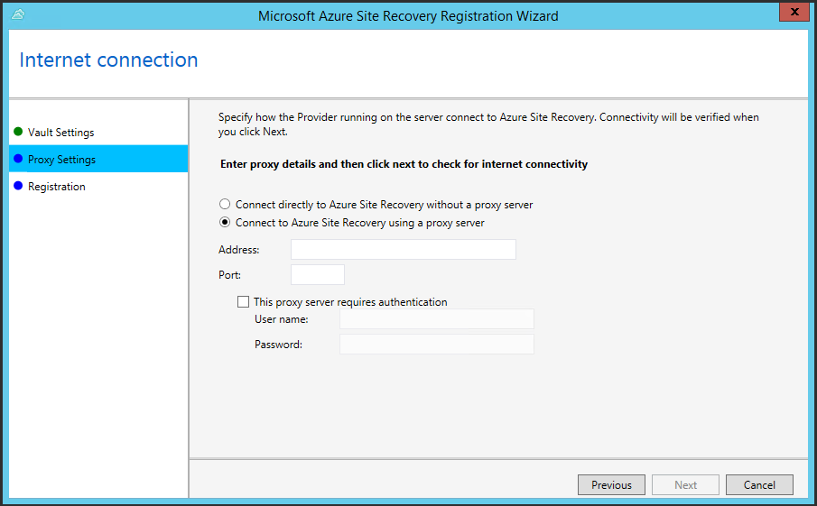

<properties
    pageTitle="Hyper-V virtuelle Computer in VMM Wolken auf Azure repliziert | Microsoft Azure"
    description="Dieser Artikel beschreibt, wie auf Hyper-V-Hosts befindet sich im System Center VMM Wolken in Azure-virtuellen Computern Hyper-V repliziert."
    services="site-recovery"
    documentationCenter=""
    authors="rayne-wiselman"
    manager="jwhit"
    editor=""/>

<tags
    ms.service="site-recovery"
    ms.workload="backup-recovery"
    ms.tgt_pltfrm="na"
    ms.devlang="na"
    ms.topic="hero-article"
    ms.date="05/06/2016"
    ms.author="raynew"/>

#  Hyper-V virtuelle Computer in VMM Wolken auf Azure repliziert

> [AZURE.SELECTOR]
- [Azure-Portal](site-recovery-vmm-to-azure.md)
- [PowerShell - Ressourcenmanager](site-recovery-vmm-to-azure-powershell-resource-manager.md)
- [Klassische Portal](site-recovery-vmm-to-azure-classic.md)
- [PowerShell - klassisch](site-recovery-deploy-with-powershell.md)

Der Dienst Azure Website Wiederherstellung beiträgt zu Ihrer Strategie Business Continuity- und Disaster Wiederherstellung (BCDR) durch Replikation, Failover und Wiederherstellung von virtuellen Computern und physischen Servern orchestriert. Maschinen können Azure oder einem sekundären lokalen Data Center repliziert werden. Für einen schnellen Überblick lesen [Neuigkeiten Azure Website Wiederherstellung?](site-recovery-overview.md).

## (Übersicht)

In diesem Artikel werden die zum Bereitstellen von Website-Wiederherstellung, um Hyper-V-virtuellen Computern auf Hyper-V Hostservern repliziert, die sich in VMM private Wolken in Azure befinden.

Im Artikel enthält erforderliche Komponenten für das Szenario und zeigt, wie Sie das Einrichten einer Website Wiederherstellung Tresor, erhalten den Anbieter Azure Websites Wiederherstellung serverseitig VMM Quelle installiert, Registrieren des Servers im Tresor, Azure-Speicherkonto hinzufügen, den Agent Azure Wiederherstellung Services auf Hyper-V Hostservern installieren, konfigurieren Schutz Einstellungen für VMM Wolken, die alle geschützten virtuellen Computern angewendet wird , und klicken Sie dann Aktivieren des Schutzes für diese virtuelle Computer. Einrichtung abzuschließen Sie, indem Sie das Failover, um sicherzustellen, dass alles wie erwartet funktioniert.

Posten Sie Kommentare oder Fragen am Ende dieses Artikels oder im [Azure Wiederherstellung Services-Forum](https://social.msdn.microsoft.com/forums/azure/home?forum=hypervrecovmgr).

## Architektur

- Den Azure-Anbieter für Websites Wiederherstellung VMM während der Bereitstellung der Website Wiederherstellung installiert ist, und der VMM-Server in der Website Wiederherstellung Tresor registriert ist. Der Anbieter kommuniziert mit Website Wiederherstellung Replikation Orchestrierung verarbeitet.
- Der Azure Wiederherstellung Services-Agent ist während der Wiederherstellung Website Bereitstellung auf Hyper-V Hostservern installiert. Ganzer Datenreplikation Azure-Speicher.

## Azure erforderliche Komponenten

Hier sind in Azure müssen.

**Voraussetzung** | **Details**
--- | ---
**Azure-Konto**| Benötigen Sie ein [Microsoft Azure](https://azure.microsoft.com/) -Konto ein. Sie können mit einer [kostenlosen Testversion](https://azure.microsoft.com/pricing/free-trial/)beginnen. [Erfahren Sie mehr](https://azure.microsoft.com/pricing/details/site-recovery/) über die Website Wiederherstellung Preise.
**Azure-Speicher** | Sie benötigen ein Konto Azure-Speicher replizierte Daten gespeichert. Replizierte Daten in Azure-Speicher gespeichert und Azure-virtuellen Computern erstellt werden, wenn ausgeführt wird.   Sie benötigen einen [standard Geo redundante Speicher-Konto](../storage/storage-redundancy.md#geo-redundant-storage). Das Konto muss in der gleichen Region wie der Website Wiederherstellung Dienst und mit dem gleichen Abonnement verknüpft werden. Beachten Sie, dass die Replikation mit Premium Speicherkonten wird derzeit nicht unterstützt und dürfen nicht verwendet werden.  [Informationen zu](../storage/storage-introduction.md) Azure-Speicher.
**Azure Netzwerk** | Sie benötigen ein Azure-virtuelles Netzwerk, dem mit Azure-virtuellen Computern verbunden werden soll, wenn ausgeführt wird. Das Azure virtuelle Netzwerk muss sich in derselben Region als die Website Wiederherstellung Tresor.

## Lokale erforderliche Komponenten

Hier finden Sie müssen lokale.

**Voraussetzung** | **Details**
--- | ---
**VMM** | Sie benötigen mindestens eine VMM-Server als eine physische oder virtuelle eigenständigen Server oder einen virtuellen Cluster bereitgestellt.   Der VMM-Server sollte mit den neuesten kumulativen Updates System Center 2012 R2 ausgeführt werden.  Sie benötigen mindestens eine Cloud auf dem Server VMM konfiguriert.  Die Quelle Cloud, die Sie schützen möchten, muss eine oder mehrere VMM Hostgruppen enthalten.  Erfahren Sie mehr über das Einrichten von VMM Wolken in [Exemplarische Vorgehensweise: Erstellen von privaten Wolken mit System Center 2012 SP1 VMM](http://blogs.technet.com/b/keithmayer/archive/2013/04/18/walkthrough-creating-private-clouds-with-system-center-2012-sp1-virtual-machine-manager-build-your-private-cloud-in-a-month.aspx) in Keith Mayers Blog.
**Hyper-V** | Sie benötigen mindestens Hyper-V-Host-Servern oder in der Cloud VMM Cluster. Das Hostserver sollte verfügen und einen oder mehrere virtuelle Computer.   Die Hyper-V installiert werden auf mindestens **Windows Server 2012 R2** mit der Rolle für Hyper-V oder **Microsoft Hyper-V Server 2012 R2** und die neuesten Updates installiert haben.  Alle Hyper-V Server mit virtuellen Computern, die Sie schützen möchten, muss in der Cloud VMM befinden.  Wenn Sie Hyper-V in einer Notiz Cluster dieser Bank Cluster ausführen wird nicht automatisch erstellt, wenn Sie einen statischen IP-Adresse-basierten Cluster haben. Sie müssen der Cluster Makler manuell konfigurieren. [Weitere Informationen finden Sie](https://www.petri.com/use-hyper-v-replica-broker-prepare-host-clusters) in der Andreas Finn Blogeintrag.
**Geschützte Computer** | Virtuellen Computern, die Sie schützen möchten sollten [Azure Anforderungen](site-recovery-best-practices.md#azure-virtual-machine-requirements)entsprechen.

## Voraussetzungen für Netzwerk-Zuordnung
Wenn Sie virtuellen Computern Azure Netzwerk Zuordnung Karten zwischen Netzwerken virtueller Computer, auf dem Server der Quelle VMM schützen und Adressieren Azure Netzwerke, um Folgendes zu aktivieren:

- Alle Computer miteinander, welche Failover im selben Netzwerk verbinden kann unabhängig von der Wiederherstellung planen sie sind.
- Ist ein Netzwerk-Gateway am Ziel Azure Netzwerk einrichten, können virtuellen Computern mit anderen lokalen virtuellen Computern verbinden.
- Wenn Sie nicht Netzwerk Zuordnung nur virtuellen Computern, die nicht über im gleichen Wiederherstellungsplan konfigurieren werden können nach Failover auf Azure miteinander verbunden.

Wenn Sie Netzwerk-Zuordnung bereitstellen möchten benötigen Sie Folgendes:

- Den virtuellen Computern, die Sie auf die Quelle VMM-Server schützen möchten, sollten mit einem virtueller Computer-Netzwerk verbunden werden. Diesem Netzwerk sollte ein logisches Netzwerk verknüpft werden, die mit der Cloud verknüpft ist.
- Ein Azure-Netzwerk mit dem repliziert virtuellen Computern nach Failover verbinden können. Dieses Netzwerk wählen Sie zum Zeitpunkt der Failover. Das Netzwerk sollte in derselben Region als Ihr Abonnement Azure Website Wiederherstellung sein.

Bereiten Sie für die Zuordnung von Netzwerk wie folgt vor:

1. [Informationen zu](site-recovery-network-mapping.md) Netzwerk Zuordnung Anforderungen.
2. Bereiten Sie virtueller Computer Netzwerke in VMM an vor:

    - [Logische Netzwerke einrichten](https://technet.microsoft.com/library/jj721568.aspx).
    - [Einrichten von virtuellen Computer Netzwerken](https://technet.microsoft.com/library/jj721575.aspx).

## Schritt 1: Erstellen einer Website Wiederherstellung Tresor

1. Melden Sie sich mit dem [Verwaltungsportal](https://portal.azure.com) aus dem VMM-Server, die, den Sie erfassen möchten.
2. Klicken Sie auf **Data Services** > **Wiederherstellung Services** > **Website Wiederherstellung Tresor**.
3. Klicken Sie auf **neu erstellen** > **schnell zu erstellen**.
4. Geben Sie im Feld **Name**einen Anzeigenamen ein, um den Tresor zu identifizieren.
5. Wählen Sie in der **Region**das geografische Region für den Tresor ein. Zum Überprüfen der unterstützte Regionen finden Sie unter geografischen Verfügbarkeit in [Azure Website Wiederherstellung Preise Details](https://azure.microsoft.com/pricing/details/site-recovery/).
6. Klicken Sie auf **Erstellen Tresor**.

    

Überprüfen Sie die Statusleiste, um zu bestätigen, dass der Tresor erfolgreich erstellt wurde. Der Tresor werden auf der Wiederherstellung Services-Hauptseite als **aktiv** aufgelistet.

## Schritt 2: Generieren Sie einen Tresor Registrierungsschlüssel

Erstellen Sie einen Registrierungsschlüssel im Tresor. Nachdem Sie den Anbieter für Azure Websites Wiederherstellung herunterladen und installieren es auf dem Server VMM, verwenden Sie diesen Schlüssel, um den VMM-Server im Tresor registrieren.

1. Klicken Sie auf den Tresor, um die Seite Schnellstart öffnen, auf der Seite **Wiederherstellung Services** . Schnellstart kann auch jederzeit auf das Symbol geöffnet werden.

    

2. Wählen Sie in der Dropdown-Liste **zwischen einer lokalen VMM-Website und Microsoft Azure**.
3. **Vorbereiten der VMM-Servern**klicken Sie auf **generieren Registrierungsschlüssel** Datei. Die Datei wird automatisch generiert und gilt für 5 Tage, nachdem er generiert wird. Wenn Sie nicht Azure-Portal aus dem VMM-Server zugreifen möchten, müssen Sie diese Datei auf dem Server zu kopieren.

    

## Schritt 3: Installieren des Wiederherstellung-Anbieters Azure-Website

1. In **Schnellstart** > **Vorbereiten VMM-Servern**, klicken Sie auf **Herunterladen von Microsoft Azure Website Wiederherstellung Anbieter für die Installation auf Servern VMM** , um die neueste Version der Datei Installation Anbieter zu erhalten.
2. Führen Sie diese Datei auf dem Server der Quelle VMM.

    >[AZURE.NOTE] VMM in einem Cluster bereitgestellt wird, und Installieren der Datenanbieter für das erste Mal auf einem aktiven Knoten zu installieren, und schließen Sie die Installation, um den Server VMM im Tresor zu registrieren. Installieren Sie dann den Anbieter auf den anderen Knoten. Beachten Sie, wenn Sie den Anbieter aktualisieren, müssen Sie auf allen Knoten aktualisiert werden soll, da sie alle dieselbe Version Anbieter ausgeführt werden soll.

3. Das Installationsprogramm führt eine Prüfung Prerequirements und über die Berechtigung zum Beenden des Diensts VMM Einrichtung Anbieters zunächst anfordert. VMM-Dienst wird automatisch neu gestartet werden, wenn Setup abgeschlossen ist. Bei der Installation auf einem Cluster VMM werden Sie aufgefordert, die Rolle des Cluster zu beenden.

4. In **Microsoft Update** können Sie nach Updates suchen in optional. Diese Einstellung aktiviert Anbieter entsprechend Ihrer Microsoft Update-Richtlinie Updates installiert werden.

    

5.  Auf der Speicherort für die Installation für den Anbieter festgelegt ist ** <SystemDrive>\Programme\Microsoft System Center 2012 R2\Virtual Computer Manager\bin**. Klicken Sie auf **Installieren**.

    

6. Klicken Sie auf **Registrieren** , um den Server im Tresor registrieren, nachdem Sie der Anbieter installiert ist.

    

9. **Tresor Name**überprüfen Sie den Namen der Tresor, in dem der Server registriert wird. Klicken Sie auf *Weiter*.

    

7. Geben Sie in **Verbindung mit dem Internet** an, wie der Anbieter ausgeführt wird, klicken Sie auf dem VMM-Server mit dem Internet verbunden. Wählen Sie **Verbinden mit vorhandenen Proxyeinstellungen** Internet Verbindung Standardeinstellungen so konfiguriert, dass auf dem Server verwenden aus.

    

    - Wenn Sie einen benutzerdefinierten Proxy verwenden möchten sollten Sie es einrichten, bevor Sie den Anbieter installieren. Wenn Sie benutzerdefinierte Proxyeinstellungen konfigurieren wird ein Test ausgeführt, um die Proxy-Verbindung zu überprüfen.
    - Wenn Sie einen benutzerdefinierten Proxy verwende oder Ihr Standard-Proxy-Server erfordert eine Authentifizierung, Sie die Proxy-Details, einschließlich der Proxyadresse und den Port eingeben müssen.
    - Folgen Urls sollte aus dem VMM-Server und Hyper-V-Host zugänglich sein
        - *. hypervrecoverymanager.windowsazure.com
        - *. accesscontrol.windows.net
        - *. backup.windowsazure.com
        - *. blob.core.windows.net
        - *. store.core.windows.net
    - Ermöglichen Sie die IP-Adressen (443) [Azure Datacenter IP-Bereiche](https://www.microsoft.com/download/confirmation.aspx?id=41653) und HTTPS-Protokoll beschrieben. Weiß-Liste IP-Bereiche des Azure Region, das Sie verwenden möchten und mit Westen US müssten.
    - Wenn Sie einen benutzerdefinierten Proxy verwenden werden automatisch mit den angegebenen Proxy-Anmeldeinformationen ein Kontos VMM RunAs (DRAProxyAccount) erstellt werden. Konfigurieren Sie den Proxy-Server so, dass dieses Konto erfolgreich authentifiziert werden kann. Die kontoeinstellungen VMM RunAs können in der VMM-Verwaltungskonsole geändert werden. Hierzu öffnen Sie den Arbeitsbereich **Einstellungen** , erweitern Sie **Sicherheit**, klicken Sie auf **Als Konten ausführen**und dann ändern Sie des Kennworts für DRAProxyAccount. Sie müssen den VMM-Dienst neu zu starten, damit diese Einstellung wirksam wird.

8. **Registrierungsschlüssel**wählen Sie die Taste, die Sie aus der Wiederherstellung der Azure-Website heruntergeladen und auf dem Server VMM kopiert haben.

10.  Die Einstellung für die Verschlüsselung wird nur verwendet, wenn Sie Hyper-V virtuelle Computer in VMM Wolken in Azure repliziert sind. Wenn Sie an einem sekundären Standort repliziert sind, wird es nicht verwendet.

11.  Geben Sie im Feld **Servername**einen Anzeigenamen ein, um den VMM-Server im Tresor zu identifizieren. Geben Sie in einer Cluster-Konfiguration den VMM Cluster Rollennamen ein.
12.  **Synchronisieren Cloud Metadaten** auswählen, ob Sie Metadaten für alle Wolken auf dem VMM-Server mit dem Tresor synchronisieren möchten. Diese Aktion muss nur einmal an jeden Server erfolgen. Wenn Sie nicht alle Wolken synchronisieren möchten, können Sie diese Einstellung deaktiviert lassen und Synchronisieren jedes Cloud einzeln in der Cloud Eigenschaften, die in der VMM-Verwaltungskonsole.

13.  Klicken Sie auf **Weiter** , um zu den Prozess abzuschließen. Nach der Registrierung werden die Metadaten aus dem VMM-Server von Azure Website Wiederherstellung abgerufen. Der Server ist auf der Registerkarte **VMM-Server** auf der Seite **Server** im Tresor angezeigt.

    

Nach der Registrierung werden die Metadaten aus dem VMM-Server von Azure Website Wiederherstellung abgerufen. Der Server ist auf der Registerkarte **VMM-Server** auf der Seite **Server** im Tresor angezeigt.

### Befehlszeile-installation

Den Azure-Anbieter für Websites Wiederherstellung kann auch mithilfe der folgenden Befehlszeile installiert werden. Diese Methode kann verwendet werden, um den Anbieter auf einem Server-Core für Windows Server 2012 R2 installieren.

1. Laden Sie den Anbieter Datei- und Registrierungsinformationen Key in einen Ordner aus. Beispiel: C:\ASR.
2. Beenden Sie den Dienst System Center virtuellen Computern Manager
3. Extrahieren Sie ein erweitertes Eingabeaufforderungsfenster das Installationsprogramm Anbieter mit diesen Befehlen

        C:\Windows\System32> CD C:\ASR
        C:\ASR> AzureSiteRecoveryProvider.exe /x:. /q

4. Installieren Sie den Anbieter wie folgt ein:

        C:\ASR> setupdr.exe /i

5. Registrieren Sie den Anbieter wie folgt ein:

        CD C:\Program Files\Microsoft System Center 2012 R2\Virtual Machine Manager\bin
        C:\Program Files\Microsoft System Center 2012 R2\Virtual Machine Manager\bin\> DRConfigurator.exe /r  /Friendlyname <friendly name of the server> /Credentials <path of the credentials file> /EncryptionEnabled <full file name to save the encryption certificate>       

Wo sind Parameter wie folgt ein:

 - **/Credentials** : obligatorische Parameter, die den Speicherort angibt, in dem die Datei Key befindet,  
 - **/FriendlyName** : obligatorische Parameter für den Namen des Servers Host Hyper-V, die im Portal Azure Website Wiederherstellung angezeigt wird.
 - **/EncryptionEnabled** : optional Parameter, um anzugeben, ob Sie Ihre virtuellen Computer in Azure (bei Rest Verschlüsselung) Verschlüsselung möchten. Der Dateiname sollte die Erweiterung **PFX** haben.
 - **/ProxyAddress** : Optionaler Parameter, die Adresse des Proxyservers angibt.
 - **/ProxyPort** : Optionaler Parameter, den Port des Proxyservers angibt.
 - **/proxyUsername** : Optionaler Parameter, Proxy-Benutzernamen angibt.
 - **/proxyPassword** : Optionaler Parameter, Proxy-Kennwort angibt.  

## Schritt 4: Erstellen Sie ein Konto Azure-Speicher

1. Wenn Sie besitzen ein Konto Azure-Speicher klicken Sie auf **Konto Azure Speicher hinzufügen** zum Erstellen eines Kontos.
2. Erstellen Sie ein Konto mit Geo-Replikation aktiviert. Sie müssen in der gleichen Region wie der Dienst Azure Website Wiederherstellung, und mit dem gleichen Abonnement verknüpft werden.

    

> [AZURE.NOTE] [Migration von Speicherkonten](../resource-group-move-resources.md) zwischen Ressourcengruppen innerhalb des gleichen Abonnements oder übergreifend Abonnements wird Speicherkonten für die Bereitstellung von Website-Wiederherstellung nicht unterstützt.

## Schritt 5: Installieren des Wiederherstellung Azure-Agents Services

Installieren des Agents Azure Wiederherstellung Services auf jedem Hyper-V-Host-Server in der Cloud VMM an.

1. Klicken Sie auf **Schnellstart** > **Azure Website Wiederherstellung Services-Agent herunterladen und installieren auf Hosts** die neueste Version der Datei Agent Installation zu erhalten.

    

2. Führen Sie die Installationsdatei auf jedem Hyper-V-Host-Server.
3. Klicken Sie auf der Seite **Erforderliche Komponenten prüfen** auf **Weiter**. Alle fehlenden erforderlichen Komponenten werden automatisch installiert.

    

4. Geben Sie auf der Einstellungsseite **Installation** Sie möchten den Agent installieren, und wählen Sie den Speicherort des in dem Sicherungsdatei Metadaten installiert wird. Klicken Sie dann auf **Installieren**.
5. Nach Abschluss der Installation klicken Sie auf **Schließen** , wenn Sie den Assistenten zu beenden.

    

### Befehlszeile-installation

Sie können auch die Microsoft Azure Wiederherstellung Services-Agent über die Befehlszeile mit dem folgenden Befehl installieren:

    marsagentinstaller.exe /q /nu

## Schritt 6: Konfigurieren von Cloud Schutz-Einstellungen

Nach der VMM-Server registriert ist, können Sie die Cloud Schutz Einstellungen konfigurieren. Die Option **Synchronisieren von Daten mit dem Tresor Cloud** wird aktiviert, wenn Sie den Anbieter installiert haben, damit alle Wolken auf dem Server VMM auf der Registerkarte <b>Geschützten Elemente</b> im Tresor angezeigt werden.

1. Klicken Sie auf der Seite Schnellstart auf **Schutz für VMM Wolken einrichten**.
2. Klicken Sie auf der Registerkarte **Geschützten Elemente** auf der Cloud zu konfigurieren, und wechseln Sie zur Registerkarte **Konfiguration** gewünschte.
3. Wählen Sie in der **Zielliste** **Azure**ein.
4. Wählen Sie im **Speicher-Konto** das Azure-Speicher-Konto, die, das Sie für die Replikation verwenden.
5. Legen Sie **Verschlüsseln gespeicherten Daten** zu **Deaktivieren**. Diese Einstellung gibt an, dass die Daten zwischen dem lokalen Standort und Azure repliziert verschlüsselt werden soll.
6. Lassen Sie im Feld **Kopieren Häufigkeit** die Standardeinstellung ein. Dieser Wert gibt an, wie häufig Daten zwischen Quell- und Zielwebsites Speicherorte synchronisiert werden sollen.
7. Lassen Sie in **beibehalten Wiederherstellungspunkte für**die Standardeinstellung aus. Mit einem Standardwert 0 (null) wird nur der neueste Wiederherstellungspunkt für einen primären virtuellen Computer auf einen Host Replikatserver gespeichert.
8. Lassen Sie in **der Anwendung konsistent Momentaufnahmen Häufigkeit**die Standardeinstellung. Dieser Wert gibt an, wie oft Momentaufnahmen erstellen. Momentaufnahmen verwenden Volume Schatten Copy Service (VSS), um sicherzustellen, dass die Programme in einem konsistenten Zustand sind, wenn die Momentaufnahme aufgezeichnet wird.  Wenn Sie einen Wert festlegen, stellen Sie sicher, dass es kleiner als die Anzahl von Wiederherstellungspunkten zusätzliche ist, die Sie konfigurieren.
9. Geben Sie die **Startzeit für Replikation**bei der anfänglichen Replikation von Daten in Azure gestartet werden soll. Die Zeitzone auf dem Host-Server Hyper-V wird verwendet werden. Es empfiehlt sich, dass Sie die erste Replikation zu Zeiten planen.

    

Nach dem Speichern der Einstellungen ein Auftrags erstellt werden, und klicken Sie auf der Registerkarte **Aufträge** überwacht werden kann. Alle Hyper-V-Host-Servern in der Cloud VMM Quelle werden für die Replikation konfiguriert sein.

Nach dem Speichern, können die Cloud-Einstellungen auf der Registerkarte **Konfigurieren** geändert werden. Um den Zielort oder die Ziel-Speicher-Konto ändern, müssen Sie zum Entfernen der Cloud-Konfiguration, und konfigurieren Sie dann mit der Cloud. Beachten Sie, dass, wenn Sie das Speicherkonto ändern die Änderung nur für virtuellen Computern angewendet wird, die für den Schutz aktiviert werden, nachdem das Speicherkonto geändert wurde. Vorhandenen virtuellen Computern sind nicht mit dem neuen Speicherkonto migriert werden.

## Schritt 7: Konfigurieren von Netzwerk-Zuordnung
Vorbemerkung Netzwerk Zuordnung überprüfen, ob virtuellen Computern auf die Quelle VMM-Server mit einem virtuellen Computer-Netzwerk verbunden sind. Darüber hinaus erstellen Sie ein oder mehrere Azure virtuelle Netzwerke. Beachten Sie, dass mehrere virtueller Computer Netzwerke mit einem einzelnen Azure Netzwerk zugeordnet werden können.

1. Klicken Sie auf der Seite Schnellstart auf **Netzwerke zuordnen**.
2. Wählen Sie auf der Registerkarte **Netzwerke** **Quellspeicherorts**, den Quelle VMM-Server aus. Wählen Sie im **Zielort** Azure ein.
3. Eine Liste der virtuellen Computer Netzwerke mit dem VMM-Server verbunden sind in **Quelle** Netzwerke werden angezeigt. In Netzwerken **Ziel** leuchten die Azure Netzwerken mit dem Abonnement verknüpft ist.
4. Wählen Sie aus der Quelle virtueller Computer-Netzwerk, und klicken auf **Karte**.
5. Wählen Sie auf der Seite **Wählen Sie ein Netzwerk Ziel** das Ziel Azure Netzwerk, die Sie verwenden möchten.
6. Klicken Sie auf das Häkchen, um die Zuordnung abzuschließen.

    

Nachdem Sie die Einstellungen speichern ein Auftrags Verfolgen des Fortschritts Zuordnung beginnt und können Sie auf der Registerkarte Aufträge überwacht werden. Alle vorhandenen Replikat virtuellen Computern, die die Quelle virtueller Computer Netzwerk entsprechen, wird mit dem Ziel Azure verbunden werden Netzwerken. Neuer virtueller Maschinen, der die Quelle virtueller Computer-Netzwerk verbunden sind wird mit dem zugeordneten Azure Netzwerk nach der Replikation verbunden sein. Wenn Sie eine Verknüpfung mit einem neuen Netzwerk vorhandene ändern, wird die neuen Einstellungen verwenden Replikat virtuellen Computern verbunden sein.

Beachten Sie, dass, wenn das Zielnetzwerk verfügt über mehrere Subnetze von diesen Subnetzen verfügt und denselben Namen wie Subnetz Grundlage der Quelle virtuellen Computern befindet, und dann Replikat virtuellen Computers wird mit diesem Ziel Subnetz nach Failover verbunden sein. Ist kein Ziel Subnetz mit einem übereinstimmenden Namen, wird der virtuellen Computern mit dem ersten Subnetz im Netzwerk verbunden.

> [AZURE.NOTE] [Migration von Netzwerken](../resource-group-move-resources.md) zwischen Ressourcengruppen innerhalb des gleichen Abonnements oder übergreifend Abonnements wird Netzwerke für die Website Wiederherstellung nicht unterstützt.

## Schritt 8: Aktivieren des Schutzes für virtuellen Computern

Nach dem Server, Wolken und Netzwerke ordnungsgemäß konfiguriert sind, können Sie den Schutz für virtuelle Computer in der Cloud aktivieren. Beachten Sie Folgendes:

- Virtuellen Computern müssen [Azure](site-recovery-best-practices.md#azure-virtual-machine-requirements)erfüllen.
- Zum Schutz des Betriebssystems und Betriebssystem aktivieren müssen Datenträgereigenschaften des virtuellen Computers festgelegt werden. Beim Erstellen eines virtuellen Computers in VMM mithilfe einer Vorlage virtuellen Computern können Sie die Eigenschaft festlegen. Sie können diese Eigenschaften für vorhandenen virtuellen Computern auch auf den Registerkarten **Allgemein** und **Hardwarekonfiguration** des virtuellen Computereigenschaften festlegen. Wenn Sie keinen dieser Eigenschaften in VMM festlegen werden Sie diese im Portal Azure Website Wiederherstellung konfiguriert sein.

    

    

1. Damit Schutz, klicken Sie auf der Registerkarte **virtuellen Computern** in der Cloud, in dem sich die virtuellen Computern befindet, klicken Sie auf **Aktivieren des Schutzes** > **virtuelle Computer hinzufügen**.
2. Wählen Sie aus der Liste von virtuellen Computern in der Cloud, die Sie schützen möchten.

    

    Nachverfolgen von Fortschritt der Aktion in der Registerkarte **Aufträge** , einschließlich der ersten Replikations **Schutz aktivieren** . Nachdem das Projekt **Schutz Fertigstellen** ausgeführt wird ist des virtuellen Computers Failoververarbeitung bereit. Nachdem der Schutz aktiviert ist, und virtuellen Computern repliziert werden, werden Sie diese in Azure angezeigt werden sollen.

    

3. Überprüfen Sie die Eigenschaften des virtuellen Computers und je nach Bedarf ändern.

    

4. Auf der Registerkarte **Konfigurieren** der Eigenschaften von virtuellen Computern können die folgenden Netzwerkeigenschaften geändert werden.

- **Anzahl der Netzwerkadapter auf die Ziel-virtuellen Computern** – die Anzahl der Netzwerkadapter wird von der Größe vorgegeben, die Sie für die Ziel-virtuellen Computern angeben. Aktivieren von [virtuellen Computern Größe Spezifikationen](../virtual-machines/virtual-machines-linux-sizes.md#size-tables) für die Anzahl der Netzwerkadapter, indem Sie die Größe des virtuellen Computers unterstützt. Beim Ändern der Größe eines virtuellen Computers und speichern die Einstellungen, wird die Anzahl der Netzwerkadapter ändern, wenn Sie die Seite **Konfigurieren** das nächste Mal öffnen. Die Anzahl der Netzwerkadapter der Ziel-virtuellen Computern ist die minimale Anzahl der Netzwerkadapter auf Quelle virtuellen Computern und die maximale Anzahl von Netzwerkadapter unterstützt, indem Sie die Größe des virtuellen Computers ausgewählt ist, wie folgt:

    - Wenn die Anzahl der Netzwerkadapter auf dem Quellcomputer kleiner oder gleich der Anzahl der Netzwerkadapter für die Größe des Target Computer zulässig ist, wird das Ziel als Quelle die gleiche Anzahl von Netzwerkadapter verfügbar.
    - Wenn die Anzahl der Netzwerkadapter für die Quelle virtuellen Computern die Höchstzahl überschreitet für die Zielgröße und dann das Ziel Größe Maximum verwendet werden soll.
    - Beispielsweise, wenn ein Quellcomputer verfügt über zwei Netzwerkadapter und die Größe des Computers Target vier unterstützt, haben der Ziel-Computer zwei Netzwerkadapter. Wenn der Quellcomputer zwei Netzwerkadapter weist, aber die Größe der unterstützten Ziel nur einen unterstützt haben der Ziel-Computer nur einen Netzwerkadapter.    

- **Netzwerk des virtuellen Computers Ziel** – das Netzwerk, zu dem eine des virtuellen Computers Verbindung zu wird durch Netzwerk Zuordnung des Netzwerks Quelle virtuellen Computers bestimmt. Wenn die Quelle virtuellen Computern mehr als einen Netzwerkadapter hat und anderen Netzwerken Zielwert Quelle Netzwerken zugeordnet sind, müssen Sie zwischen einem der Netzwerke Ziel auswählen.
- **Subnetz von jedem Netzwerkadapter** - für jeden Netzwerkadapter können Sie auswählen, das Subnetz, dem der Fehler beim über virtuellen Computers zu verbinden möchten.
- **Ziel-IP-Adresse** – Wenn der Netzwerkadapter Quelle virtuellen Computers so konfiguriert ist, um eine statische IP-Adresse zu verwenden, und klicken Sie dann Sie die IP-Adresse für das Ziel virtuellen Computern bereitstellen können. Verwenden Sie diese Funktion die IP-Adresse eines virtuellen Quellcomputers nach einem Failover beibehalten. Wenn keine IP-Adresse angegeben wird wird eine verfügbare IP-Adresse der Netzwerkadapter zum Zeitpunkt der Failover angegeben. Die Ziel-IP-Adresse angegeben, wird bereits von einer anderen virtuellen Computern ausgeführt in Azure verwendet jedoch tritt Failover.  

    

>[AZURE.NOTE] Virtuelle Linux-Computer mit statischen IP-Adresse werden nicht unterstützt.

## Testen der Bereitstellung

Zum Testen der Bereitstellung können Sie einen Test-Failover für einen einzelnen virtuellen Computern ausführen oder erstellen einen Wiederherstellungsdatei Plan aus mehreren virtuellen Computern, und führen einen Test-Failover für den Plan.  

Test Failover simuliert Ihrer Failover und Wiederherstellung Verfahren in einem Netzwerk isoliert. Beachten Sie Folgendes:

- Wenn Sie die Verbindung des virtuellen Computers in Azure mithilfe von Remotedesktop nach dem Failover möchten, aktivieren Sie Remote Desktop-Verbindung des virtuellen Computers vor dem Ausführen des Failovers testen.
- Eine öffentliche IP-Adresse verwenden Sie nach einem Failover des virtuellen Computers in Azure mithilfe von Remotedesktop Verbindung. Wenn Sie dies tun möchten, stellen Sie sicher, dass Sie keine Domänenrichtlinien besitzen, die verhindern, dass Sie eine Verbindung zu einer virtuellen Computern mithilfe einer öffentlichen Adresse.

>[AZURE.NOTE] Um die Leistung zu verbessern, wenn Sie einen Failover Azure Aufgaben, stellen Sie sicher, dass Sie der Azure-Agent in der geschützten Computer installiert haben. Dies kann in schneller starten und auch bei Problemen Diagnose. Linux-Agent werden kann, gefundenen [hier](https://github.com/Azure/WALinuxAgent) - und Windows Agent finden Sie [hier](http://go.microsoft.com/fwlink/?LinkID=394789)

### Erstellen Sie einen Wiederherstellungsplan

1. Fügen Sie einen neuen Plan auf der Registerkarte **Wiederherstellung Pläne** hinzu. Geben Sie einen Namen, **VMM** **Quellentyp**, und der Quelle VMM-Server in der **Quelle**, das Ziel werden Azure.

    

2. Wählen Sie auf der Seite **Wählen Sie virtuellen Computern** virtuellen Computern in der Wiederherstellung Abonnementplan hinzufügen möchten. Diesen virtuellen Computern der Wiederherstellung Plan Standardgruppe hinzugefügt werden – Gruppe 1. Bis zu 100 virtuellen Computern in einem einzigen Wiederherstellungsplan getestet wurden.

- Wenn Sie die Eigenschaften des virtuellen Computers zu überprüfen, bevor Sie den Plan hinzu, klicken Sie auf den virtuellen Computer auf der Eigenschaftenseite der Cloud, in dem sich ihr möchten enthalten. Sie können auch die Eigenschaften des virtuellen Computers in der VMM-Verwaltungskonsole konfigurieren.
- Alle virtuellen Computern, die angezeigt werden wurden für Schutz aktiviert. Die Liste enthält die beiden virtuellen Computern, die für Schutz und die erste Replikation abgeschlossen hat, und Personen, die für den Schutz mit aktiviert sind Replikation ausstehend Anfangsbuchstaben aktiviert sind. Nur virtuelle Computer mit erste Replikation abgeschlossen können als Teil eines Wiederherstellungsplans über fehl.

    

Nachdem Sie ein Wiederherstellungsplan erstellt wurde, es wird auf der Registerkarte **Wiederherstellung Pläne** angezeigt. Sie können auch den Wiederherstellungsplan zum Automatisieren von Aktionen während des Failovers [Azure Automatisierung Runbooks](site-recovery-runbook-automation.md) hinzufügen.

### Ausführen eines Failovers testen

Es gibt zwei Methoden zum Ausführen eines Failovers Test in Azure.

- **Testen des Failoververhaltens ohne ein Azure-Netzwerk**– diese Art von Test Failover überprüft, dass die virtuellen Computern ordnungsgemäß in Azure auftauchen. Des virtuellen Computers wird nicht nach einem Failover alle Azure-Netzwerk verbunden sein.
- **Testen des Failoververhaltens mit einer Azure Netzwerk**– diese Art von Failover überprüft, dass die gesamte Replikation Umgebung bis erwartungsgemäß stammt und, die nicht über den virtuellen Computern wird mit dem angegebenen Ziel Azure Netzwerk verbunden werden. Für die Behandlung von Subnetz gehören, wird für Test Failover im Subnetz des virtuellen Testcomputers basierend auf dem Subnetz des virtuellen Computers Replikat fest sein. Dies ist anderen normale Replikation, wenn das Subnetz eines Replikat virtuellen Computers auf dem Subnetz des virtuellen Quellcomputers basiert.

Wenn Sie einen Test-Failover für einen virtuellen Computer für Schutz in Azure ohne Angabe eines Azure Zielnetzwerk aktiviert ausführen möchten brauchen Sie nichts vorbereiten. Einen Test-Failover mit einem Ziel Azure Netzwerk ausführen müssen Sie ein neues Azure Netzwerk, das isoliert wurde aus Ihrem Netzwerk Azure Herstellung (Standardverhalten beim Erstellen eines neuen Netzwerks in Azure) erstellen. Schauen Sie sich für weitere Details [ein Failovers Test ausgeführt](site-recovery-failover.md#run-a-test-failover) .

Sie müssen auch nach dem Einrichten der Infrastruktur für die repliziert virtuellen Computern wie erwartet. Beispielsweise ein virtuellen Computer mit Domain Controller und DNS auf Azure mit Azure Website Wiederherstellung repliziert werden können und im Testnetzwerk mit Failover Testen erstellt werden können. Schauen Sie sich [Testen Failover Aspekte für active Directory](site-recovery-active-directory.md#considerations-for-test-failover) -Abschnitt für weitere Details.

Führen Sie einen Test Failover Folgendes ausführen:

1. Wählen Sie auf der Registerkarte **Wiederherstellung Pläne** den Plan aus, und klicken auf **Failover testen**.
2. Wählen Sie auf der Seite **Bestätigen Test Failover** **keine** oder ein bestimmtes Azure Netzwerk aus.  Beachten Sie, wenn Sie keine das Test Failover werden überprüfen Sie, ob des virtuellen Computers ordnungsgemäß auf repliziert Azure aber Ihre Netzwerkkonfiguration Replikation Kontrollkästchen nicht.

    

3. Wenn für die Cloud-Verschlüsselung aktiviert ist, wählen Sie in **Verschlüsselungsschlüssels** das Zertifikat, das während der Installation des Anbieters auf dem VMM-Server ausgestellt wurde, wenn Sie die Option zum Aktivieren der Daten einer Cloud-Verschlüsselung aktiviert.
4. Klicken Sie auf der Registerkarte **Aufträge** können Sie Failover überwachen. Sie sollten auch das virtuellen Computern Test Replikat Azure-Portal finden Sie unter sein. Wenn Sie von Ihrem lokalen Netzwerk festlegen auf Access-virtuellen Computern sind, können Sie eine Remotedesktop-Verbindung mit den virtuellen Computern initiieren.
5. Wenn das Failover **abgeschlossen testen** einer Phase erreicht, klicken Sie auf **Vollständige testen** , um das Test-Failover fertig zu stellen. Sie können Drilldowns, auf der Registerkarte **Projekt** Failover Fortschritt und Status nachzuverfolgen, und alle Aktionen ausführen, die erforderlich sind.
6. Nach dem Failover erhalten Sie das virtuellen Computern Test Replikat Azure-Portal finden Sie unter sein. Wenn Sie von Ihrem lokalen Netzwerk festlegen auf Access-virtuellen Computern sind, können Sie eine Remotedesktop-Verbindung mit den virtuellen Computern initiieren. Gehen Sie wie folgt vor:

    1. Stellen Sie sicher, dass die virtuellen Computer erfolgreich starten.
    2. Wenn Sie die Verbindung des virtuellen Computers in Azure mithilfe von Remotedesktop nach dem Failover möchten, aktivieren Sie Remote Desktop-Verbindung des virtuellen Computers vor dem Ausführen des Failovers testen. Sie müssen außerdem einen RDP Endpunkt des virtuellen Computers hinzufügen. Sie können eine [Azure Automatisierung Runbooks](site-recovery-runbook-automation.md) dazu nutzen.
    3. Nach dem Failover sicherzustellen, wenn Sie eine öffentliche IP-Adresse verwenden, um die Verbindung des virtuellen Computers in Azure mithilfe von Remotedesktop, verfügen Sie möglicherweise keine Domänenrichtlinien, die verhindern, dass Sie eine Verbindung zu einer virtuellen Computern mithilfe einer öffentlichen Adresse.

7.  Nach Abschluss der Tests folgendermaßen Sie vor:
    - Klicken Sie auf **das Failover Test abgeschlossen ist**. Bereinigen Sie die testumgebung automatisch schalten aus, und löschen den Test virtuellen Computern.
    - Klicken Sie auf **Notizen** aufzeichnen und Speichern einer beliebigen Beobachtungen des Failovers Test zugeordnet.

>

## Nächste Schritte

Lernen Sie [das Einrichten der Wiederherstellung Pläne](site-recovery-create-recovery-plans.md) und [Failover](site-recovery-failover.md)aus.
