<properties
    pageTitle="Hyper-V virtuelle Computer in VMM Wolken auf Azure mithilfe von Website-Wiederherstellung mit dem Portal Azure repliziert | Microsoft Azure"
    description="Beschreibt, wie Sie Azure Website Wiederherstellung zum Koordinieren von Replikation, Failover- und Hyper-V virtueller Computer in VMM Wolken in Azure mithilfe des Azure-Portals bereitstellen"
    services="site-recovery"
    documentationCenter=""
    authors="rayne-wiselman"
    manager="jwhit"
    editor="tysonn"/>

<tags
    ms.service="site-recovery"
    ms.workload="backup-recovery"
    ms.tgt_pltfrm="na"
    ms.devlang="na"
    ms.topic="hero-article"
    ms.date="09/16/2016"
    ms.author="raynew"/>

# Hyper-V virtuelle Computer in VMM Wolken auf Azure mit Azure Website Wiederherstellung mit dem Portal Azure repliziert | Microsoft Azure

> [AZURE.SELECTOR]
- [Azure-portal](site-recovery-vmm-to-azure.md)
- [Klassische Azure](site-recovery-vmm-to-azure-classic.md)
- [Ressourcenmanager PowerShell](site-recovery-vmm-to-azure-powershell-resource-manager.md)
- [PowerShell-klassisch](site-recovery-deploy-with-powershell.md)

Willkommen bei Azure Website Wiederherstellung! Verwendung von in diesem Artikel verwalteten, wenn soll lokalen Hyper-V-virtuellen Computern repliziert in System Center virtuellen Computern Manager (VMM) Wolken in Azure Azure Website Wiederherstellung Azure-Portal verwenden.

> [AZURE.NOTE]Azure weist zwei verschiedenen [Bereitstellungsmodelle](../resource-manager-deployment-model
> ) für das Erstellen und Arbeiten mit Ressourcen: Azure Ressourcenmanager und Classic. Azure verfügt auch über zwei communityportalen – Azure klassischen Portals, die das Bereitstellungsmodell klassischen unterstützt, und der Azure-Portal mit Unterstützung für beide Bereitstellungsmodelle.

Azure Website Wiederherstellung Azure-Portal bietet mehrere neue Features:

- Azure-Portal werden die Dienste Azure-Sicherung und Wiederherstellung der Azure-Website in einem einzigen Wiederherstellung Services Tresor kombiniert, damit Sie einrichten und Verwalten von Geschäftskontinuität und Wiederherstellung (BCDR) von einem einzigen Ort können. Ein einheitliches Dashboard ermöglicht das Überwachen und Verwalten von Vorgängen über Ihren lokalen Websites und der Azure öffentlichen Cloud.
- Benutzer mit nach der Bereitstellung mit der Cloud Lösung Provider (CSP) Programm Azure-Abonnements können jetzt Website Wiederherstellungsvorgängen Azure-Portal verwalten.
- Website Wiederherstellung Azure-Portal kann Autos auf Azure Ressourcenmanager Speicherkonten repliziert. Bei einem Failover erstellt Website Wiederherstellung Ressourcenmanager-basierten virtuellen Computern in Azure.
- Website Wiederherstellung befindet sich die Unterstützung der Replikation auf klassische Speicherkonten. Bei einem Failover erstellt Website Wiederherstellung virtueller Computer mit der Option Klassisch.

Nach dem Lesen dieses Artikels, Posten Sie eventuelle Kommentare in den Kommentaren Disqus unten aus. Fragen Sie technische im [Azure Wiederherstellung Services-Forum](https://social.msdn.microsoft.com/forums/azure/home?forum=hypervrecovmgr).

## (Übersicht)

Organisationen benötigen eine BCDR Strategie, die bestimmt, wie apps, Auslastung und Daten bleiben während der geplanten und ungeplanten Ausfallzeiten ausgeführt werden und verfügbar, und zum normalen Arbeit Umständen so früh wie möglich wiederherzustellen. Strategische BCDR sollten Geschäftsdaten beibehalten, sicherer und wiederhergestellt, und vergewissern Sie sich Auslastung kontinuierlich verfügbar bleiben, wenn bei Datenverlusten.

Website Wiederherstellung ist ein Azure-Dienst, der zur strategische BCDR von der Replikation physische Server lokal und in der Cloud (Azure) oder einer sekundären Datacenter-virtuellen Computern orchestriert beiträgt. Treten Ausfall in gewohnten Standort befinden, fehl Sie über den zweiten Standort zum Aktualisieren von apps und Auslastung zur Verfügung. Sie fehl zurück zur gewohnten Standort befinden, wenn sie normale Vorgänge zurückgibt. Erfahren Sie mehr in [Neuigkeiten Azure Website Wiederherstellung?](site-recovery-overview.md)

Dieser Artikel enthält alle Informationen, die Sie repliziert müssen Hyper-V virtuelle Computer in VMM Wolken in Azure lokalen. Es enthält eine Übersicht über die Architektur, Planen von Informationen und Bereitstellungsschritte zum Konfigurieren von Azure, lokalen Servern, Replikation Einstellungen und Kapazität zu planen. Nach dem Einrichten der Infrastruktur haben Sie Replikation auf Computern, die Sie schützen aktivieren können, und überprüfen Sie, dass die Failover funktioniert möchten.

## Vorteile für Unternehmen

- Website Wiederherstellung bietet einen externen Schutz für Business Auslastung und Anwendung, die auf Hyper-V virtuellen Computern ausgeführt.
- Das Portal Wiederherstellung bietet einen Speicherort zum Einrichten, verwalten und Überwachen der Replikation, Failover und Wiederherstellung.
- Sie können ganz einfach Failovers aus Ihrer lokalen Infrastruktur Azure und Failback (Wiederherstellen) aus Azure Hyper-V-Host-Server in Ihrer lokalen Website ausführen.
- Sie können Wiederherstellung Pläne mit mehreren Computern konfigurieren, damit gestufte Auslastung zusammen über fehl.

## Szenario-Architektur

Dies sind die Szenariokomponenten:

- **VMM-Server**: eine lokale VMM-Server mit einer oder mehreren Wolken.
- **Hyper-V-Host oder Cluster**: Hyper-V Hostserver oder Cluster in VMM Wolken verwaltet.
- **Anbieter für Azure Websites Wiederherstellung und Wiederherstellung Services-Agent**: während der Bereitstellung installieren Sie den Azure-Anbieter für Websites Wiederherstellung auf dem VMM-Server und des Microsoft Azure Wiederherstellung Services-Agents auf Hyper-V-Host-Servern. Der Anbieter auf dem Server VMM kommuniziert mit Website Wiederherstellung über HTTPS 443 Orchestrierung repliziert. Der Agent auf dem Host-Server Hyper-V repliziert Daten für Azure-Speicher über HTTPS 443 standardmäßig.
- **Azure**: benötigen Sie ein Azure-Abonnement, ein Konto Azure-Speicher zum repliziert Speichern von Daten und ein Azure-virtuellen Netzwerk, damit Azure-virtuellen Computern nach Failover mit einem Netzwerk verbunden sind.

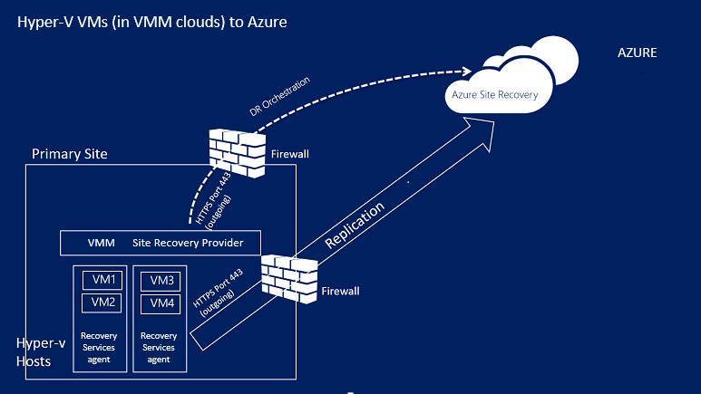

## Azure erforderliche Komponenten

Hier sind, was Sie in Azure müssen dieses Szenario bereitstellen.

**Voraussetzung** | **Details**
--- | ---
**Azure-Konto**| Sie benötigen eine [Microsoft Azure](http://azure.microsoft.com/) -Konto. Sie können mit einer [kostenlosen Testversion](https://azure.microsoft.com/pricing/free-trial/)beginnen. [Erfahren Sie mehr](https://azure.microsoft.com/pricing/details/site-recovery/) über die Website Wiederherstellung Preise.
**Azure-Speicher** | Benötigen Sie ein Konto standard Azure-Speicher replizierte Daten gespeichert. Sie können ein LRS oder GRS Speicher-Konto verwenden. Wir empfehlen GRS, so dass Daten ist flexibel, wenn ein regionalen Ausfall auftritt, oder die primäre Region nicht wiederhergestellt werden kann. [Erfahren Sie mehr](../storage/storage-redundancy.md). Das Konto muss sich in derselben Region als der Wiederherstellung Services Tresor.  Premium Speicher wird nicht unterstützt.   Replizierte Daten in Azure-Speicher gespeichert und Azure-virtuellen Computern erstellt werden, wenn ausgeführt wird.    [Informationen zu](../storage/storage-introduction.md) Azure-Speicher.
**Azure Netzwerk** | Sie benötigen ein Azure virtuelles Netzwerk aus, das Azure-virtuellen Computern herstellen einer Verbindung mit Wenn ausgeführt wird. Das Netzwerk muss sich in derselben Region als der Wiederherstellung Services Tresor.

## Lokale erforderliche Komponenten

Hier sind die Voraussetzungen lokalen

**Voraussetzung** | **Details**
--- | ---
**VMM**| Einen oder mehrere VMM-Server ausgeführt wird, klicken Sie auf System Center 2012 R2. Jede VMM-Server sollte einer oder mehreren Wolken konfiguriert haben. Es sollte eine Cloud enthalten:   Eine oder mehrere VMM Hostgruppen.   Eine oder mehrere Hyper-V-Host-Server oder Cluster in jeder Hostgruppe.  [Weitere](http://www.server-log.com/blog/2011/8/26/vmm-2012-and-the-clouds.html) Informationen zum Einrichten von VMM Wolken.
**Hyper-V** | Hyper-V-Hostserver müssen mindestens ausführen **Windows Server 2012 R2** mit Hyper-V-Rolle oder **Microsoft Hyper-V Server 2012 R2** und die neuesten Updates installiert haben.   Ein Hyper-V-Server sollte eine oder mehrere virtuelle Computer enthalten.   Einem Hyper-V Hostserver oder Cluster, die virtuellen Computern umfasst repliziert werden soll, muss in der Cloud VMM verwaltet werden.  Hyper-V-Servern sollte direkt oder über einen Proxy mit dem Internet verbunden sein.  Hyper-V-Servern sollte erwähnten in diesem Artikel [2961977](https://support.microsoft.com/kb/2961977) installiert haben.  Hyper-V-Hostservern benötigen Internetzugang Replikation in Azure-Daten.
**Anbieter und agent** | Während der Bereitstellung von Azure Website Wiederherstellung installieren Sie den Azure-Anbieter für Websites Wiederherstellung auf dem VMM-Server und der Wiederherstellung Services-Agent auf Hyper-V-Hosts. Der Anbieter und der Agent müssen zum Azure über das Internet direkt oder über einen Proxy herstellen. Beachten Sie, dass ein HTTPS-basierte Proxy nicht unterstützt wird. Der Proxyserver auf dem VMM-Server und Hyper-V-Hosts sollte auf zugreifen dürfen:    *. hypervrecoverymanager.windowsazure.com     *. accesscontrol.windows.net    *. backup.windowsazure.com     *. blob.core.windows.net    *. store.core.windows.net  Wenn Sie die IP-Adresse-basierte Firewall-Regeln auf dem Server VMM haben, überprüfen Sie, dass die Regeln Kommunikation mit Azure zulassen. Sie müssen die [Azure Datacenter IP-Bereiche](https://www.microsoft.com/download/confirmation.aspx?id=41653) und den Port HTTPS (443) zulassen.  Lassen Sie die IP-Adressbereiche für die Azure Region Ihres Abonnements, und Westen US.  Außerdem. der Proxyserver auf dem Server VMM benötigt Zugriff auf https://www.msftncsi.com/ncsi.txt

## Voraussetzungen für die geschützten Computer

**Voraussetzung** | **Details**
--- | ---
**Geschützten virtuellen Computern** | Bevor Sie über einen virtuellen fehlschlägt, stellen Sie sicher, dass der Name, den Azure-virtuellen Computer zugewiesen ist, [Azure Vorkenntnisse](site-recovery-best-practices.md#azure-virtual-machine-requirements)entspricht. Sie können den Namen ändern, nachdem Sie die Replikation für den virtuellen Computer aktiviert haben.    Einzelne die Speicherkapazität auf geschützten Computern dürfen nicht mehr als 1023 GB entsprechen. Ein virtueller Computer kann bis zu 16 Festplatten haben (sodass bis zu 16 TB).   Freigegebene Datenträger Gast, Cluster nicht unterstützt werden.   Unified Extensible Firmware Interface (UEFI) / Extensible Firmware Interface(EFI) Boot nicht unterstützt.   Wenn die Quelle virtueller Computer NIC-Kombination verfügt wird es in einen einzelnen Netzwerkadapter nach Failover auf Azure konvertiert.  Schützen von virtuellen Computern mit Linux und eine statische IP-Adresse wird nicht unterstützt.

## Bereiten für Bereitstellung vor

Zum Vorbereiten für die Bereitstellung muss:

1. [Richten Sie ein Azure-Netzwerk](#set-up-an-azure-network) in der Azure-virtuellen Computern nach Failover befinden soll.
2. [Richten Sie ein Konto Azure-Speicher](#set-up-an-azure-storage-account) für repliziert Daten.
4. [Vorbereiten der VMM-Server](#prepare-the-vmm-server) für die Bereitstellung der Website Wiederherstellung.
5. [Vorbereiten für die Zuordnung Netzwerk](#prepare-for-network-mapping). Netzwerken so richten Sie ein, dass Sie Netzwerk-Zuordnung während der Wiederherstellung Website Bereitstellung konfigurieren können.

### Richten Sie eine Azure Netzwerk

Sie benötigen ein Azure-Netzwerk, damit der Azure-virtuellen Computern erstellt werden, nachdem Failover das Herstellen einer Verbindung wird.

- Im Netzwerk sollten in derselben Region als, in dem Sie den Wiederherstellung Services Tresor bereitstellen.
- Je nach Ressourcenmodell, die, dem Sie für verwenden, über Azure-virtuellen Computern fehlgeschlagen ist möchten, können Sie die Azure Netzwerk [Ressourcenmanager](../virtual-network/virtual-networks-create-vnet-arm-pportal.md) oder [klassischen Modus](../virtual-network/virtual-networks-create-vnet-classic-pportal.md)einrichten.
- Es empfiehlt sich, dass Sie ein Netzwerk einrichten, bevor Sie beginnen. Wenn Sie nicht möchten, müssen Sie während der Bereitstellung der Website Wiederherstellung erledigen.

> [AZURE.NOTE] [Migration von Netzwerken](../resource-group-move-resources.md) zwischen Ressourcengruppen innerhalb des gleichen Abonnements oder übergreifend Abonnements wird Netzwerke für die Website Wiederherstellung nicht unterstützt.

### Richten Sie ein Konto Azure-Speicher

- Sie benötigen ein Konto standard Azure-Speicher auf Azure replizierte Daten aufnehmen zu können. Das Konto muss sich in derselben Region als der Wiederherstellung Services Tresor.
- Je nach Ressourcenmodell, die, dem Sie für verwenden, über Azure-virtuellen Computern fehlgeschlagen ist möchten, richten Sie ein Konto in [Ressourcenmanager](../storage/storage-create-storage-account.md) oder [klassischen Modus](../storage/storage-create-storage-account-classic-portal.md)ein.
- Es empfiehlt sich, dass Sie ein Konto einrichten, bevor Sie beginnen. Wenn Sie nicht möchten, müssen Sie während der Bereitstellung der Website Wiederherstellung erledigen.

> [AZURE.NOTE] [Migration von Speicherkonten](../resource-group-move-resources.md) zwischen Ressourcengruppen innerhalb des gleichen Abonnements oder übergreifend Abonnements wird Speicherkonten für die Bereitstellung von Website-Wiederherstellung nicht unterstützt.

### Vorbereiten des VMM-Servers

- Stellen Sie sicher, dass die [Voraussetzungen für](#on-premises-prerequisites)der VMM-Server entspricht.
- Während der Bereitstellung der Website Wiederherstellung können Sie angeben, dass alle Wolken auf einem Server VMM Azure-Portal verfügbar sein soll. Wenn Sie nur bestimmte Wolken im Portal angezeigt werden soll, können Sie diese Einstellung in der Cloud in der VMM-Verwaltungskonsole aktivieren.

### Bereiten für die Zuordnung Netzwerk vor

Sie müssen Netzwerk Zuordnung während der Bereitstellung der Wiederherstellung Website einrichten. Netzwerk-Zuordnung Karten zwischen Quelle VMM VM Netzwerke und Adressieren Azure Netzwerke, um Folgendes zu aktivieren:

- Maschinen, die nicht über die gleichen Netzwerk können miteinander, eine Verbindung herstellen, selbst wenn sie nicht über auf die gleiche Weise oder im gleichen Wiederherstellungsplan fehlgeschlagen sind.
- Wenn ein Netzwerk-Gateway am Ziel Azure Netzwerk haben eingerichtet, können Azure-virtuellen Computern mit lokalen virtuellen Computern verbinden.
- Zum Einrichten des Netzwerks wird hier Zuordnung müssen vorbereiten:

    - Stellen Sie sicher, dass virtuelle Computer, auf dem Quelle Hyper-V-Host-Server mit einem VMM VM-Netzwerk verbunden sind. Diesem Netzwerk sollte ein logisches Netzwerk verknüpft werden, die mit der Cloud verknüpft ist.
    - Ein Azure-Netzwerk wie beschrieben [oben](#set-up-an-azure-network)

- [Erfahren Sie mehr](site-recovery-network-mapping.md) über die Funktionsweise der Netzwerk-Zuordnung.

## Erstellen einer Wiederherstellungsdatei Services Tresor

1. Melden Sie sich mit dem [Azure-Portal](https://portal.azure.com)aus.
2. Klicken Sie auf **neue** > **Management** > **Wiederherstellung Services**. Alternativ können Sie klicken, **Navigieren Sie** > **Wiederherstellung Services** Depots > **Hinzufügen**.

    

3. Geben Sie im Feld **Name**einen Anzeigenamen ein, um den Tresor zu identifizieren. Wenn Sie mehr als ein Abonnement besitzen, wählen Sie einen davon.
4. [Erstellen einer Ressourcengruppe](../resource-group-template-deploy-portal.md), oder ein vorhandenes Layout auszuwählen. Geben Sie einen Bereich Azure an. In diesem Bereich werden Autos repliziert werden. Zum Überprüfen der unterstützte Regionen finden Sie unter geografischen Verfügbarkeit in [Azure Website Wiederherstellung Preise-Details](https://azure.microsoft.com/pricing/details/site-recovery/)
4. Wenn Sie schnell den Tresor aus dem Dashboard zugreifen möchten, klicken Sie auf **Pin zum Dashboard** > **Tresor erstellen**.

    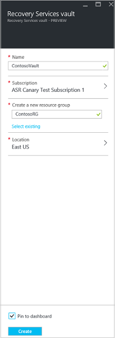

Der neue Tresor angezeigt wird, auf dem **Dashboard** > **alle Ressourcen**, und auf dem primären **Wiederherstellung Services Depots** Blade.

## Erste Schritte

Website Wiederherstellung bietet eine überfordert Benutzeroberfläche, die Ihnen dabei hilft so schnell wie möglich bereitstellen. Erste Schritte erforderlichen Komponenten überprüft und führt Sie durch Website Wiederherstellung Bereitstellung in der richtigen Reihenfolge Schritte.

Erste Schritte wählen Sie den Typ der Computer repliziert werden soll, und auf repliziert werden soll. Sie richten Sie lokale Server, Azure-Speicherkonten und Netzwerke. Sie Replikation Richtlinien erstellen, und führen die Kapazität zu planen. Nachdem Sie Ihre Infrastruktur eingerichtet haben, können Sie Replikation für virtuelle Computer. Sie können Failovers für bestimmte Computer ausführen, oder erstellen Wiederherstellung Pläne über mehrere Computer fehlschlägt.

Beginnen Sie erste Schritte, indem Sie auswählen, wie Sie Website Wiederherstellung bereitstellen möchten. Erste Schritte illustrieren ändert sich etwas je nach Ihren Anforderungen Replikation.

## Schritt 1: Wählen Sie Ihre Schutzziele

Wählen Sie repliziert werden soll, und wo auf repliziert werden soll.

1. Wählen Sie in der **Wiederherstellung Services Depots** Blade aus Ihrem Tresor, und klicken Sie auf **Einstellungen**.
2. Klicken Sie unter **Erste Schritte** auf **Website Wiederherstellung** > **Schritt 1: Vorbereiten Infrastruktur** > **Schutz Zielsetzung**.

    

3. **Schutz** Ziels **Zu Azure**wählen Sie aus, und wählen Sie **Ja, mit Hyper-V**. Wählen Sie **Ja,** um zu bestätigen, dass Sie zum Verwalten von Hyper-V-Hosts und der Wiederherstellung Website VMM verwenden. Klicken Sie dann auf **OK**.

    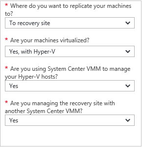

## Schritt 2: Einrichten der Umgebung Quelle

Installieren Sie den Azure-Anbieter für Websites Wiederherstellung auf dem VMM-Server und registrieren Sie den Server im Tresor. Installieren des Agents Azure Wiederherstellung Services auf Hyper-V-Hosts.

1. Klicken Sie auf **Schritt 2: Vorbereiten der Infrastruktur** > **Quelle**.

    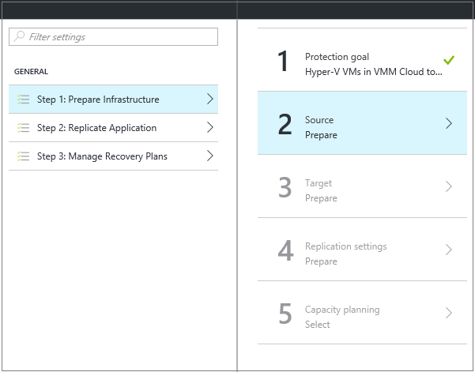

2. Klicken Sie in **Quelle vorbereiten** auf **+ VMM** zum Hinzufügen eines VMM-Servers.

    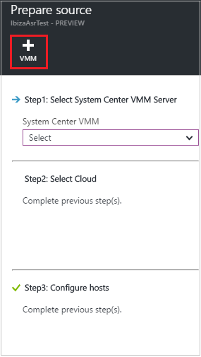

3. In das **System Center VMM Server** im Feld **Server geben** und die angezeigte **Server hinzufügen** Blade Häkchen entspricht der VMM-Server [erforderliche Komponenten und URL-Anforderungen](#on-premises-prerequisites).
4. Die Azure Website Wiederherstellung Anbieter Installationsdatei nicht herunterladen.
5. Herunterladen der Registrierungsschlüssel. Sie benötigen beim Setup. Der Schlüssel ist gültig für fünf Tage, nachdem Sie es erstellt haben.

    

6. Installieren Sie den Azure-Anbieter für Websites Wiederherstellung auf dem VMM-Server.

### Einrichten von den Azure-Anbieter für Websites Wiederherstellung

1.  Führen Sie den Anbieter Setupdatei.
2. In **Microsoft Update** können Sie in nach Updates suchen optional, damit Microsoft Update Richtlinie Anbieter Updates installiert werden.
3. Anzunehmen Sie in der **Installation**, oder ändern Sie den Speicherort der Standardinstallation Anbieter, und klicken Sie auf **Installieren**.

    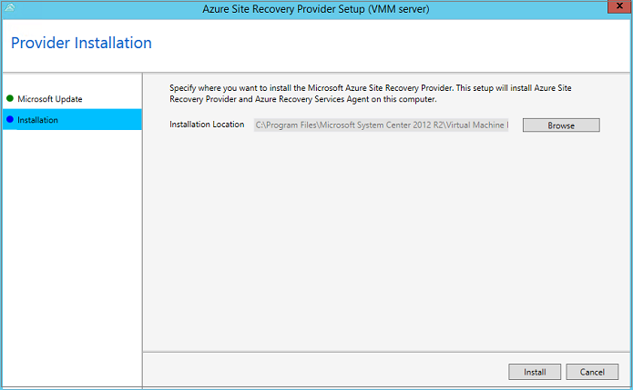

4. Nach Abschluss der Installation klicken Sie auf **Registrieren** , um den Server VMM im Tresor zu registrieren.
5. Klicken Sie in **Tresor** Einstellungsseite auf **Durchsuchen** , um die Datei mit Schlüssel Tresor auszuwählen. Geben Sie das Abonnement Azure Website Wiederherstellung und den Tresor Namen.

    

6. Geben Sie in **Verbindung mit dem Internet**wie der Anbieter ausgeführt wird, auf dem Server VMM Website Wiederherstellung über das Internet eine Verbindung herstellt.

    - Wählen Sie **direkt mit Azure Website Wiederherstellung ohne einen Proxy verbinden**, wenn Sie den Anbieter direkt verbinden möchten.
    - Wenn Ihre vorhandene Proxy Authentifizierung erfordert oder eine benutzerdefinierte Proxy SELECT-Anweisung **mit Azure Website Wiederherstellung verwenden einen Proxyserver**verwenden möchten.
    - Wenn Sie einen benutzerdefinierten Proxy verwenden, geben Sie die Adresse, den Port und die Anmeldeinformationen.
    - Wenn Sie einen Proxy verwenden sollte Sie die [erforderlichen Komponenten](#on-premises-prerequisites)beschrieben URLs bereits zulässig.
    - Wenn Sie einen benutzerdefinierten Proxy verwenden werden automatisch mit den angegebenen Proxy-Anmeldeinformationen ein Kontos VMM RunAs (DRAProxyAccount) erstellt werden. Konfigurieren Sie den Proxy-Server so, dass dieses Konto erfolgreich authentifiziert werden kann. Die kontoeinstellungen VMM RunAs können in der VMM-Verwaltungskonsole geändert werden. Erweitern Sie in den **Einstellungen**die **Sicherheit** > **Als Konten ausführen**, und klicken Sie dann das Kennwort für DRAProxyAccount ändern. Sie müssen den VMM-Dienst neu zu starten, damit diese Einstellung wirksam wird.

    

7. Akzeptieren Sie oder ändern Sie die Position eines SSL-Zertifikats, das für die Verschlüsselung der Daten automatisch generiert wird. Dieses Zertifikat wird verwendet, wenn Sie Daten einer geschützten von Azure im Portal Azure Website Wiederherstellung Cloud-Verschlüsselung aktivieren. Schützen Sie dieses Zertifikat. Beim Ausführen eines Failovers in Azure benötigen Sie diese Informationen zu entschlüsseln, wenn Daten Verschlüsselung aktiviert ist.

8. Geben Sie im Feld **Servername**einen Anzeigenamen ein, um den VMM-Server im Tresor zu identifizieren. Geben Sie in einer Cluster-Konfiguration den VMM Cluster Rollennamen ein.
9. Aktivieren Sie **Synchronisieren Cloud Metadaten** aus, wenn Sie die Metadaten für alle Wolken auf dem VMM-Server mit dem Tresor synchronisieren möchten. Diese Aktion muss nur einmal an jeden Server erfolgen. Wenn Sie nicht alle Wolken synchronisieren möchten, können Sie diese Einstellung deaktiviert lassen und Synchronisieren jedes Cloud einzeln in der Cloud Eigenschaften, die in der VMM-Verwaltungskonsole. Klicken Sie auf **Registrieren** , um den Vorgang abzuschließen.

    

10. Registrierung wird gestartet. Nach Abschluss der Registrierung wird der Server angezeigt, auf der **Einstellungen** > **Servern** vorher in den Tresor.

#### Befehlszeile-Installation für den Azure-Anbieter für Websites Wiederherstellung

Den Azure-Anbieter für Websites Wiederherstellung kann über die Befehlszeile installiert werden. Diese Methode können Sie den Anbieter auf Server Core für Windows Server 2012 R2 installieren verwendet werden.

1. Laden Sie den Anbieter Datei- und Registrierungsinformationen Key in einen Ordner aus. Beispielsweise C:\ASR.
2. Führen Sie diese Befehle zum Extrahieren des Installationsprogramms Anbieter aus ein erweitertes Eingabeaufforderungsfenster:

            C:\Windows\System32> CD C:\ASR
            C:\ASR> AzureSiteRecoveryProvider.exe /x:. /q
3. Führen Sie diesen Befehl, um die Komponenten zu installieren:

            C:\ASR> setupdr.exe /i

4. Führen Sie diese Befehle an den Server im Tresor zu registrieren:

        CD C:\Program Files\Microsoft System Center 2012 R2\Virtual Machine Manager\bin
        C:\Program Files\Microsoft System Center 2012 R2\Virtual Machine Manager\bin\> DRConfigurator.exe /r  /Friendlyname <friendly name of the server> /Credentials <path of the credentials file> /EncryptionEnabled <full file name to save the encryption certificate>       

Wobei Folgendes gilt:

- **/Credentials**: obligatorische Parameter, die angibt, wo die Registrierung Key-Datei befindet.  
- **/FriendlyName**: obligatorische Parameter für den Namen des Servers Host Hyper-V, die im Portal Azure Website Wiederherstellung angezeigt wird.
- - **/EncryptionEnabled**: Optionaler Parameter, wenn Sie Hyper-V virtuelle Computer in VMM repliziert sind für Wolken in Azure. Geben Sie an, ob Sie virtuellen Computern in Azure (bei Rest Verschlüsselung) verschlüsseln möchten. Stellen Sie sicher, dass der Name der Datei die Erweiterung **PFX-Datei** hat. Verschlüsselung ist standardmäßig deaktiviert.
- **/ProxyAddress**: Optionaler Parameter, die Adresse des Proxyservers angibt.
- **/ProxyPort**: Optionaler Parameter, den Port des Proxyservers angibt.
- **/proxyUsername**: Optionaler Parameter, Proxy-Benutzernamen angibt (wenn Proxy-Authentifizierung erforderlich ist).
- **/proxyPassword**: optionale Parameter, die angibt, das Kennwort für die Proxyserver Authentifizierung (wenn der Proxy-Authentifizierung erforderlich ist).

### Installieren des Agents Azure Wiederherstellung Services auf Hyper-V-hosts

1. Nachdem Sie den Anbieter eingerichtet haben, müssen Sie die Installationsdatei für den Azure Wiederherstellung Services-Agent herunterladen. Führen Sie Setup auf jedem Hyper-V Server in der Cloud VMM aus.

    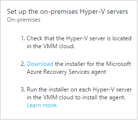

2. Klicken Sie auf der Seite **Erforderliche Komponenten prüfen** klicken Sie auf **Weiter**. Alle fehlenden erforderlichen Komponenten werden automatisch installiert.

    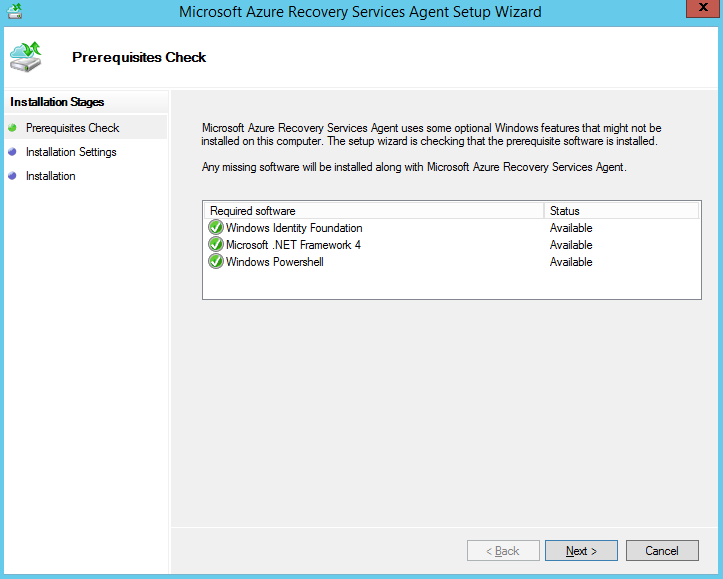

3. Klicken Sie auf der Seite **Einstellungen für die Installation** akzeptieren Sie, oder ändern Sie den Installationsspeicherort und den Speicherort des. Sie können den Cache konfigurieren, auf einem Laufwerk mit mindestens 5 GB Speicher zur Verfügung, aber es empfiehlt sich ein Cachelaufwerk mit 600 GB oder mehr Speicherplatz. Klicken Sie dann auf **Installieren**.
4. Nach Abschluss der Installation klicken Sie auf **Schließen** um fertig zu stellen.

    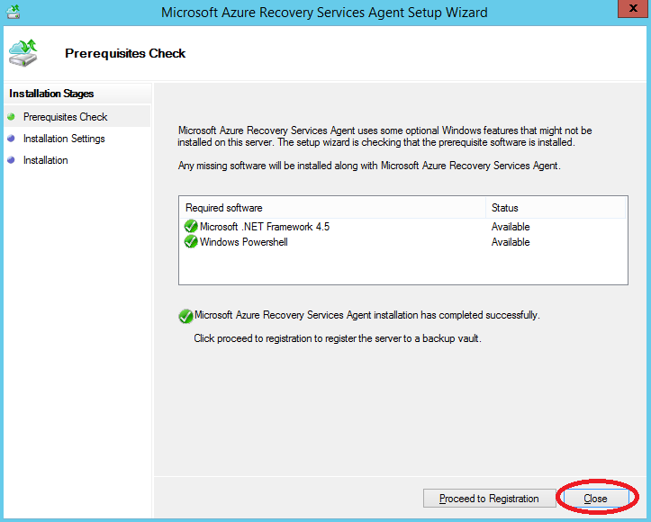

#### Befehlszeile-Installation für Azure Site Wiederherstellung Services-agent

Sie können Microsoft Azure Wiederherstellung Services Agent über die Befehlszeile mit dem folgenden Befehl installieren:

     marsagentinstaller.exe /q /nu

#### Einrichten von Zugriff auf das Internet Proxy-Website Wiederherstellung von Hyper-V-hosts

Der-Agent Wiederherstellung Services ausgeführt wird, klicken Sie auf Hyper-V-Hosts benötigt Internet-Zugriff auf Azure Replikation virtueller Computer. Wenn Sie über einen Proxy auf das Internet zugreifen, richten sie Sie wie folgt:

1. Öffnen Sie das Microsoft Azure Sicherung MMC-Snap-in auf dem Host von Hyper-V. Standardmäßig ist eine Abkürzung für Microsoft Azure Sicherung auf dem Desktop oder in c:\Programme\Microsoft c:\Programme\Microsoft Azure Wiederherstellung Services Agent\bin\wabadmin verfügbar.
2. Klicken Sie auf **Eigenschaften ändern**, in dem Snap-in.
3. Geben Sie auf der Registerkarte **Proxy-Konfiguration** Proxy-Serverinformationen ein.

    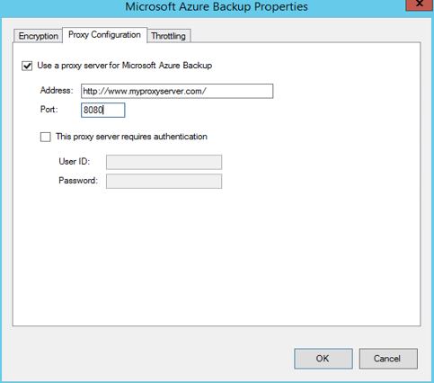

4. Stellen Sie sicher, dass der Agent die URLs der [erforderlichen Komponenten](#on-premises-prerequisites)beschrieben erreichen kann.

## Schritt 3: Einrichten von zielumgebung

Geben Sie das Azure-Speicher-Konto verwendet werden, für die Replikation und dem Azure Netzwerk mit dem Azure-virtuellen Computern nach Failover verbinden möchten.

1.  Klicken Sie auf **Vorbereiten Infrastruktur** > **Ziel** , und wählen Sie die zu verwendende Azure-Abonnement.
2.  Geben Sie das Modell zur Bereitstellung, die, das Sie nach einem Failover für virtuelle Computer verwenden möchten.
3.  Website Wiederherstellung überprüft, dass Sie eine oder mehrere Konten kompatibel Azure-Speicher und Netzwerken haben.

    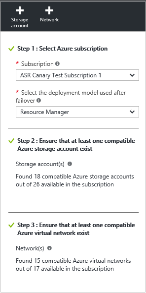

4.  Wenn Sie ein Speicherkonto keine eingegangen sind und Sie eine erstellen möchten mit Ressourcenmanager, klicken Sie auf **+ Speicher-Konto** in dieser eingebetteten führen.  Geben Sie auf das Blade **Speicher-Konto erstellen** einer Kontonamen, Typ, Abonnement und Speicherort aus. Das Konto am selben Speicherort wie der Wiederherstellung Services Tresor hinzugefügt werden.

    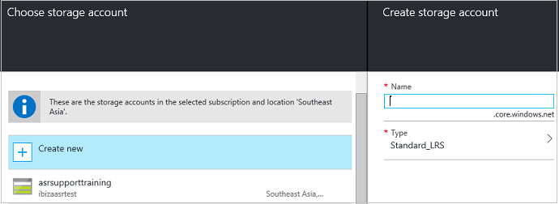

    Beachten Sie Folgendes:

    - Wenn Sie eine mit der Option Klassisch Speicher-Konto erstellen möchten, führen Sie, die Azure-Portal. [Weitere Informationen](../storage/storage-create-storage-account-classic-portal.md)
    - Wenn Sie ein Premium Speicher-Konto für repliziert Daten verwenden, müssen Sie ein zusätzlicher standard-Speicher-Konto einrichten, um Replikation Protokolle speichern, die laufende Änderungen lokaler Daten zu erfassen.

4.  Wenn Sie keine sind ein Azure-Netzwerk eingegangen und für eine erstellen möchten mit Ressourcenmanager klicken Sie auf **+ Netzwerk** dieser Inline ausführen. Geben Sie einen Netzwerknamen, Adressbereichs, Subnetdetails, Abonnement und Speicherort, auf das Blade **virtuelles Netzwerk erstellen** . Im Netzwerk am selben Speicherort wie der Wiederherstellung Services Tresor hinzugefügt werden.

    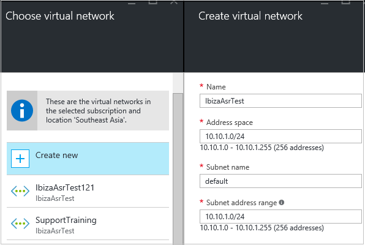

    Wenn Sie ein Netzwerk mit der Option Klassisch erstellen möchten wird im Portal Azure folgt. [Erfahren Sie mehr](../virtual-network/virtual-networks-create-vnet-classic-pportal.md).

### Konfigurieren von Netzwerk-Zuordnung

- [Gelesen](#prepare-for-network-mapping) hat ein schnellen Überblick über welche Netzwerk-Zuordnung an. [Lesen Sie diese Informationen](site-recovery-network-mapping.md) für eine ausführlichere Beschreibung.
- Stellen Sie sicher, dass virtuellen Computern auf dem VMM-Server mit einem virtuellen Computer-Netzwerk verbunden sind und Sie mindestens ein Azure virtuelles Netzwerk erstellt haben. Mehrere virtueller Computer Netzwerke können mit einem einzelnen Azure Netzwerk zugeordnet werden.

Konfigurieren Sie die Zuordnung wie folgt:

1. In den **Einstellungen** > **Wiederherstellung Standortinfrastruktur** > **Netzwerk Zuordnungen** > **Netzwerk Zuordnung**, klicken Sie auf das Symbol **+ Netzwerk zuordnen** .

    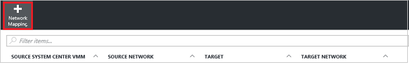

2. Wählen Sie auf der **Netzwerk-Zuordnung hinzufügen** der Quelle VMM-Server und **Azure** als Ziel ein.
3. Überprüfen Sie das Abonnement und das Bereitstellungsmodell nach Failover ein.
4. **Quellnetzwerk**wählen Sie das Quelle lokalen virtueller Computer-Netzwerk, die, das Sie aus der Liste zugeordnet ist, mit dem VMM-Server zuordnen möchten.
5. Wählen Sie **Ziel-Netzwerk**das Azure Netzwerk, in welche, das Replikat Azure-virtuellen Computern gespeichert werden, wenn sie erstellt haben. Klicken Sie dann auf **OK**.

    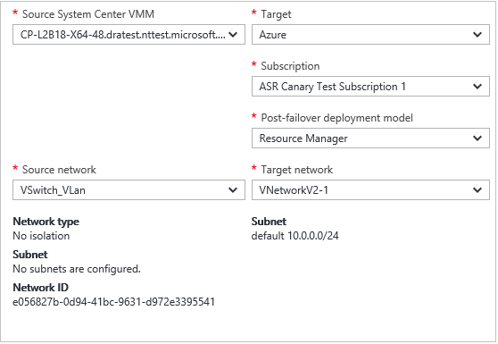

Hier ist, was passiert, wenn die Zuordnung Netzwerk beginnt:

- Vorhandene virtuellen Computern Netzwerk virtueller Computer Quelle werden mit dem Zielnetzwerk verbunden, wenn die Zuordnung beginnt. Neue virtuelle Computer mit dem Quelle virtueller Computer-Netzwerk verbunden sind die zugeordnete Azure bestehender bei der Replikation.
- Wenn Sie eine vorhandene Netzwerk-Zuordnung ändern, wird die neuen Einstellungen verwenden Replikat virtuellen Computern verbunden sein.
- Wenn das Zielnetzwerk verfügt über mehrere Subnetze und von diesen Subnetzen denselben Namen wie Subnetz hat, auf dem sich die Quelle virtuellen Computern befindet, wird dann Replikat virtuellen Computers mit diesem Ziel Subnetz nach Failover verbunden sein.
- Ist kein Ziel Subnetz mit einem übereinstimmenden Namen, wird der virtuellen Computern mit dem ersten Subnetz im Netzwerk verbunden.

## Schritt 4: Einrichten von Replikations-Einstellungen

1. Klicken Sie zum Erstellen einer neuen Replikationsrichtlinie **Infrastruktur vorbereiten**auf > **Replikation Einstellungen** > **+ Erstellen und zuordnen**.

    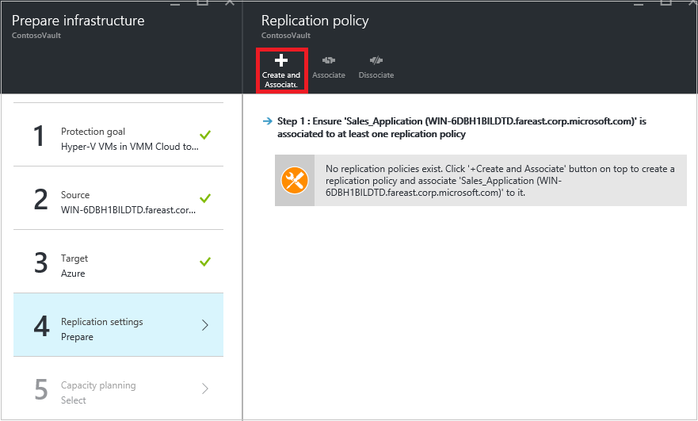

2. **Erstellen und zuordnen Richtlinie**Geben Sie einen Richtliniennamen ein.
3. Geben Sie im Feld **Kopieren Häufigkeit**wie oft Delta Daten nach der anfänglichen Replikation (alle 30 Sekunden, Version 5 oder 15 Minuten) repliziert werden soll.
4. **Wiederherstellung zeigen Aufbewahrungsrichtlinien**Geben Sie Stunden wie lange ist, wird das Fenster Aufbewahrung für jeden Wiederherstellungspunkt sein. Geschützte Maschinen können an einer beliebigen Stelle in einem Fenster wiederhergestellt werden.
6. In der **App-konsistente Momentaufnahme Häufigkeit**angeben, wie häufig (1 bis 12 Stunden) Wiederherstellungspunkte, die Anwendung konsistent Momentaufnahmen enthält sind, erstellt. Hyper-V verwendet zwei Arten von Momentaufnahmen – Momentaufnahme standard, der eine Momentaufnahme inkrementelle des gesamten virtuellen Computers enthält, und eine Anwendung konsistente Momentaufnahme, über die eine Point-in-Time-Momentaufnahme der Anwendungsdaten innerhalb des virtuellen Computers zu gelangen. Anwendung konsistent Momentaufnahmen verwenden Volume Schatten Copy Service (VSS), um sicherzustellen, dass Programme konsistent sind, wenn die Momentaufnahme aufgezeichnet wird. Beachten Sie, dass wenn Sie die Anwendung konsistent Momentaufnahmen aktivieren, die Leistung der Anwendung, die auf Quelle virtuellen Computern beeinträchtigt wird. Stellen Sie sicher, dass der Wert, den Sie festlegen kleiner als die Anzahl von Wiederherstellungspunkten zusätzliche ist, die Sie konfigurieren.
3. **Initiale Replikation beginnt**zeigen an, wann die erste Replikation zu starten. Die Replikation erfolgt über die Internetbandbreite, damit er außerhalb Ihrer beschäftigt Stunden geplant werden soll.
5. **Verschlüsseln von Daten auf Azure gespeichert**Geben Sie an, ob die restlichen Daten in Azure-Speicher verschlüsselt. Klicken Sie dann auf **OK**.

    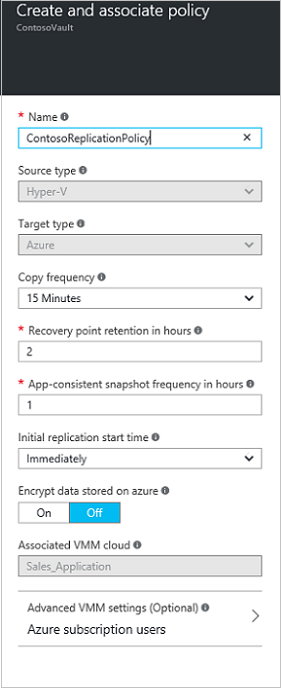

6. Beim Erstellen einer neuen Richtlinie hat es automatisch mit der Cloud VMM verknüpft ist. Klicken Sie auf **OK**. Zusätzliche VMM Wolken (und den virtuellen Computern in diese) können mit dieser Replikationsrichtlinie in den **Einstellungen**zuordnen > **Replikation** > Name der Richtlinie > **VMM Cloud zugeordnet werden soll**.

    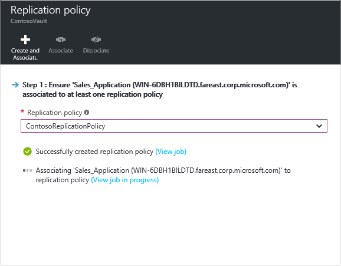

## Schritt 5: Planen der Kapazität

Jetzt, da Sie Ihre Basic haben Infrastruktur, die Sie einrichten kann denken Kapazität Planung und ermitteln, ob Sie zusätzliche Ressourcen benötigen.

Website Wiederherstellung bietet eine Kapazität können Sie die richtigen Ressourcen für Ihre Umgebung Quelle, die Website Wiederherstellung Komponenten, Netzwerke und Speicher zugewiesen werden können. Sie können den Planer im Schnellmodus für Abschätzung basierend auf einer durchschnittlichen Anzahl von virtuellen Computern, Datenträger und Speicher oder im detaillierten Modus, in dem Sie Zahlen auf der Ebene Arbeitsbelastung Eingabemethoden werden, ausführen. Bevor Sie beginnen müssen Sie:

- Sammeln Sie Informationen über Ihre Replikations-Umgebung, einschließlich virtuellen Computern, Datenträger pro virtuellen Computern und Speicherplatz pro Laufwerk ein.
- Schätzen der täglichen Rendite ändern (Änderung), die Sie für repliziert Daten haben. Die [Kapazitätsplaner für Hyper-V Replica](https://www.microsoft.com/download/details.aspx?id=39057) können Ihnen dabei helfen.

1.  Klicken Sie auf **herunterladen** , um das Tool herunterladen, und führen Sie es. [Lesen Sie den Artikel](site-recovery-capacity-planner.md) , der das Tool begleitet.
2.  Wenn Sie damit fertig sind wählen Sie **Ja** aus **haben Sie die Kapazität für ausführen**?

    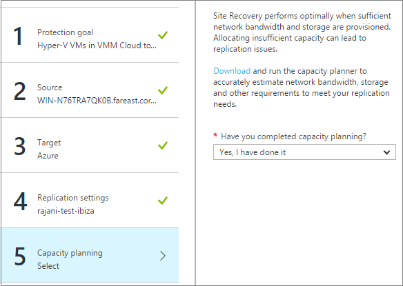

### Netzwerk Bandbreite Aspekte

Die Kapazitätsplanertools können die Bandbreite zu berechnen, die Sie für die Replikation (erste Replikation und dann Delta müssen). Um den Umfang der Bandbreite verwenden für die Replikation steuern müssen Sie einige Optionen aus:

- **Bandbreite**: Hyper-V, die an einem sekundären Standort repliziert Netzwerkverkehr über einen bestimmten Hyper-V-Host. Sie können die Bandbreite auf dem Hostserver einschränken.
- **Gibt die Bandbreite**: Sie können die Replikation mithilfe von ein paar Registrierungsschlüsseln verwendete Bandbreite beeinflussen.

#### Bandbreite

1. Öffnen Sie das Microsoft Azure Sicherung MMC-Snap-in auf dem Host-Server Hyper-V. Standardmäßig ist eine Abkürzung für Microsoft Azure Sicherung auf dem Desktop oder in c:\Programme\Microsoft c:\Programme\Microsoft Azure Wiederherstellung Services Agent\bin\wabadmin verfügbar.
2. Klicken Sie auf **Eigenschaften ändern**, in dem Snap-in.
3. Klicken Sie auf der Registerkarte **Beschränkung** die Option **Internet Bandbreite Verwendung begrenzungsebene für zusätzliche Vorgänge aktivieren**, und legen Sie die Grenzwerte für die Arbeit und nicht-Arbeit Stunden. Gültige Bereiche sind 512/s und 102/s pro Sekunde.

    

Sie können auch das Cmdlet " [Set-OBMachineSetting](https://technet.microsoft.com/library/hh770409.aspx) " verwenden, begrenzungsebene festlegen. Hier ist ein Beispiel:

    $mon = [System.DayOfWeek]::Monday
    $tue = [System.DayOfWeek]::Tuesday
    Set-OBMachineSetting -WorkDay $mon, $tue -StartWorkHour "9:00:00" -EndWorkHour "18:00:00" -WorkHourBandwidth  (512*1024) -NonWorkHourBandwidth (2048*1024)

**Set-OBMachineSetting-NoThrottle** gibt an, dass keine Beschränkung erforderlich ist.

#### Netzwerk-Bandbreite beeinflussen

Der Registrierungseintrag **UploadThreadsPerVM** steuert die Anzahl der, der für die Datenübertragung (Initiale oder Delta Replikation) eines Datenträgers verwendet werden. Ein höherer Wert erhöht die Bandbreite für die Replikation verwendet. Der Registrierungseintrag **DownloadThreadsPerVM** gibt die Anzahl der Threads, die für die Datenübertragung während des Failbacks verwendet.

1. Navigieren Sie in der Registrierung zu **HKEY_LOCAL_MACHINE\SOFTWARE\Microsoft\Windows Azure Backup\Replication**.

    - Ändern Sie den Wert **UploadThreadsPerVM** (oder die Taste erstellen, wenn es nicht vorhanden ist) zur Threadsteuerung Datenträger Replikation verwendet.
    - Ändern Sie den Wert **DownloadThreadsPerVM** (oder die Taste erstellen, wenn es nicht vorhanden ist) zur Threadsteuerung für Failback Verkehr aus Azure verwendet.
2. Der Standardwert ist 4. In einem Netzwerk "overprovisioned" sollte diese Registrierungsschlüssel aus der Standardwerte geändert werden. Das Maximum beträgt 32. Überwachen Sie den Datenverkehr in den Wert zu optimieren.

## Schritt 6: Aktivieren Replikation

Aktivieren der Replikation jetzt wie folgt:

1. Klicken Sie auf **Schritt2: repliziert Anwendung** > **Quelle**. Nachdem Sie die Replikation zum ersten Mal aktiviert haben klicken Sie auf **+ repliziert** im Tresor Replikation für zusätzliche Computer aktivieren.

    

2. In der **Quelle** Blade > Wählen Sie aus dem VMM-Server und der Cloud, in dem die Hyper-V-Hosts befinden. Klicken Sie dann auf **OK**.

    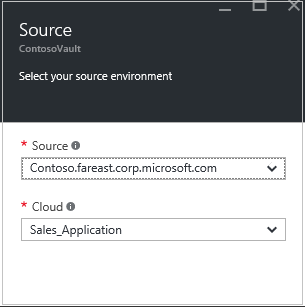

3. Wählen Sie in der **Zielliste** das Abonnement, Modell zur Bereitstellung von Beitrag-Failover und Speicher-Konto, das Sie für repliziert Daten verwenden.

    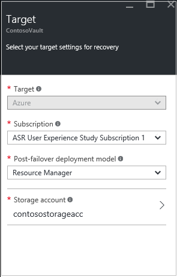

4. Wählen Sie das Speicherkonto, das Sie verwenden möchten. Wenn Sie ein als die anderen Speicherkonto verwenden möchten, müssen Sie Sie [Erstellen](#set-up-an-azure-storage-account)können. Klicken Sie zum Erstellen eines Speicher auf Konto mithilfe des Modells Ressourcenmanager **neu erstellen**. Wenn Sie eine mit der Option Klassisch Speicher-Konto erstellen möchten, führen Sie dieser [Azure-Portal](../storage/storage-create-storage-account-classic-portal.md). Klicken Sie dann auf **OK**.
5. Wählen Sie die Azure Netzwerk und Subnetz mit dem Azure-virtuellen Computern verbinden möchten, wenn sie nach einem Failover erstellt wird, sind. Wählen Sie **jetzt für den ausgewählten Rechner konfigurieren** die Netzwerk-Einstellung auf alle Computer, die Sie auswählen, für den Schutz angewendet wird. Wählen Sie **später konfigurieren** , um das Azure Netzwerk pro Computer auszuwählen. Wenn Sie einem anderen Netzwerk herzustellen, die Sie verwenden möchten, müssen Sie Sie [Erstellen](#set-up-an-azure-network)können. Klicken Sie zum Erstellen ein Netzwerks mithilfe des Modells Ressourcenmanager auf **neu erstellen**. Wenn Sie ein Netzwerk mit der Option Klassisch erstellen möchten erhalten Sie die [Azure-Portal](../virtual-network/virtual-networks-create-vnet-classic-pportal.md)ausführen. Wählen Sie ein Subnetz ein, falls zutreffend. Klicken Sie dann auf **OK**.
6. Virtuellen **-** > auf**virtuellen Computern auswählen** , und wählen Sie jedem Computer repliziert werden soll. Sie können nur Autos auswählen, für die Replikation aktiviert werden kann. Klicken Sie dann auf **OK**.

    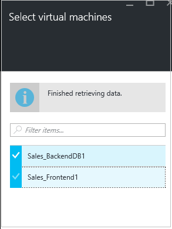

5. **Eigenschaften** > **Eigenschaften konfigurieren**, wählen Sie das Betriebssystem, das für den ausgewählten virtuellen Computern und der OS Datenträger aus. Klicken Sie dann auf **OK**. Sie können später weitere Eigenschaften festlegen.

    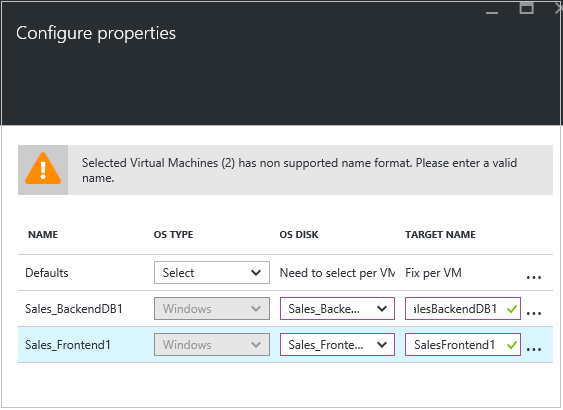

12. In den **Einstellungen der Replikation** > **Replikation konfigurieren von Einstellungen**, wählen Sie die Replikationsrichtlinie für den geschützten virtuellen Computern anwenden möchten. Klicken Sie dann auf **OK**. Sie können die Replikationsrichtlinie in den **Einstellungen**ändern > **Replikation Richtlinien** > Name der Richtlinie > **Einstellungen bearbeiten**. Änderungen, die angewendet, werden verwendet, für den neuen Computer und Maschinen, die bereits repliziert werden.

    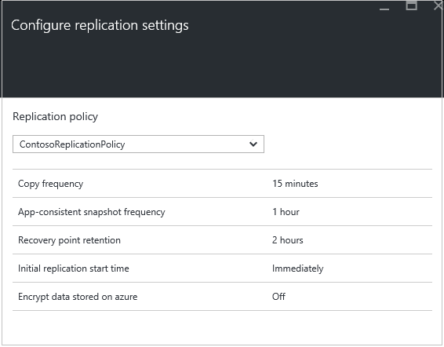

Sie können die Fortschritte des Projekts in den **Einstellungen** **Aktivieren Schutz** verfolgen > **Aufträge** > **Website Wiederherstellung Aufträge**. Für Failover bereitsteht nach der Auftrag **Fertigstellen Schutz** des Computers ausgeführt werden kann.

### Anzeigen und Verwalten von virtuellen Computer Eigenschaften

Es empfiehlt sich, dass Sie die Eigenschaften des Quellcomputers überprüfen. Denken Sie daran, dass der Name des Azure-virtuellen Computers mit [Azure-virtuellen Computern Anforderungen](site-recovery-best-practices.md#azure-virtual-machine-requirements)entsprechen sollen.

1. Klicken Sie auf **Einstellungen** > **Geschützte Elemente** > **Repliziert Elemente** >, und wählen Sie den Computer, um die Details anzuzeigen.

    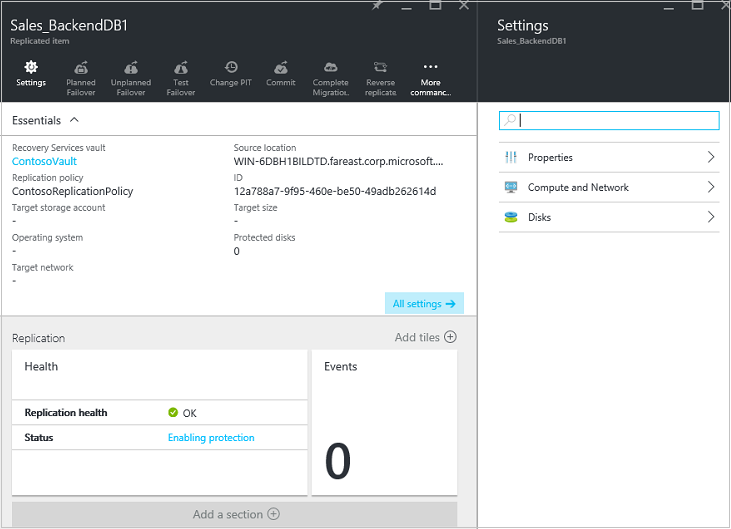

2. In den **Eigenschaften** können Sie die Replikation und Failover Informationen für den virtuellen Computer anzeigen.

    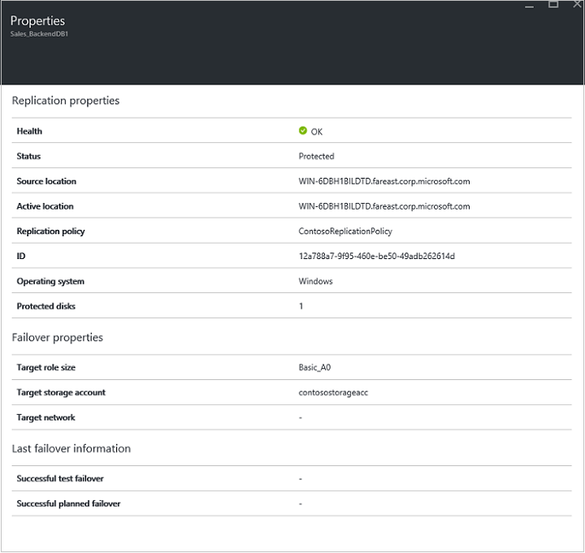

3. **Berechnen**und Netzwerk > Sie können den Schriftgrad aus Azure-virtuellen Computer Name und Ziel**Eigenschaften zu berechnen** . Ändern Sie den Namen, um Sie im Bedarfsfall [Azure Vorschriften](site-recovery-best-practices.md#azure-virtual-machine-requirements) entsprechen. Sie können auch anzeigen und Ändern von Informationen über die Zielnetzwerk, Subnetz und IP-Adresse, die den Azure-virtuellen Computer zugewiesen ist. Beachten Sie Folgendes:

    - Sie können die IP-Adresse des Ziels festlegen. DHCP werden verwendet, wenn Sie nicht über einen Computer eine Adresse, die den Fehler beim bereitstellen. Wenn Sie eine Adresse, die nicht am Failover verfügbar ist festlegen, wird das Failover fehl. Die Ziel IP-Adresse kann für Test Failover verwendet werden, wenn die Adresse im Netzwerk testen Failover verfügbar ist.
    - Die Anzahl der Netzwerkadapter wird durch die Größe vorgegeben, die Sie für das Ziel virtuellen Computern, wie folgt angeben:

        - Wenn die Anzahl der Netzwerkadapter auf dem Quellcomputer kleiner oder gleich der Anzahl der Netzwerkadapter für die Größe des Target Computer zulässig ist, wird das Ziel als Quelle die gleiche Anzahl von Netzwerkadapter verfügbar.
        - Wenn die Anzahl der Netzwerkadapter für die Quelle virtuellen Computern, die für die Zielgröße und der Größe des Target die maximal zulässige Anzahl überschreitet wird verwendet.
        - Wenn beispielsweise ein Datenquelle Computer verfügt über zwei Netzwerkadapter und die Größe des Computers Target unterstützt vier, der Ziel-Computer werden zwei Netzwerkadapter haben. Wenn der Quellcomputer zwei Netzwerkadapter weist, aber die Größe der unterstützten Ziel nur einen unterstützt haben der Ziel-Computer nur einen Netzwerkadapter.     
        - Wenn der virtuellen Computer mehrere Netzwerkadapter ist werden sie alle mit dem gleichen Netzwerk verbunden.

    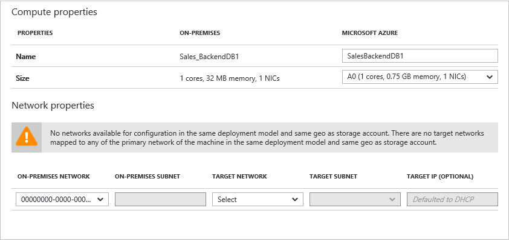

5.  In **Datenträger** können Sie das Betriebssystem und die Daten Datenträger des virtuellen Computers sehen, die repliziert werden.

## Schritt 7: Testen der bereitstellungs

Zum Testen der Bereitstellung können Sie einen Test-Failover für einen einzelnen virtuellen Computern oder eines Plans für die Wiederherstellung, das eine oder mehrere virtuelle Computer enthält ausführen.

### Bereiten für Failover vor

- Zum Ausführen eines Failovers Test wird empfohlen, dass Sie ein neues Azure Netzwerk, das isoliert wurde aus Ihrem Netzwerk Azure Herstellung erstellen (Dies ist Standardverhalten beim Erstellen eines neuen Netzwerks in Azure). [Erfahren Sie mehr](site-recovery-failover.md#run-a-test-failover) über das Testfailovers ausführen.
- Um die optimale Leistung zu gelangen, wenn Sie über in Azure fehlschlägt, installieren Sie den Azure-Agent auf dem geschützten Computer. Starten schneller macht, und hilft bei der Problembehandlung. Installieren des [Linux](https://github.com/Azure/WALinuxAgent) oder [Windows](http://go.microsoft.com/fwlink/?LinkID=394789) -Agents an.
- Wenn Ihre Bereitstellung vollständig testen benötigen Sie eine Infrastruktur für den repliziert Computer wie erwartet funktioniert. Wenn Sie Active Directory und DNS prüfen möchten, können Sie erstellen einen virtuellen Computer als Domänencontroller mit DNS- und repliziert dies in Azure Azure Website Wiederherstellung verwenden. Lesen Sie weitere in [Test Failover Aspekte für Active Directory](site-recovery-active-directory.md#considerations-for-test-failover).
- Beachten Sie Folgendes, wenn Sie in einer ungeplanten Failover anstelle eines Failovers Test ausgeführt werden sollen:

    - Falls möglich sollten Sie primäre Autos ausschalten, bevor Sie ein ungeplantes Failover ausführen. Dies sorgt dafür, dass sowohl die Quell- und Replikatpfade Computern zur gleichen Zeit nicht.
    - Beim Ausführen eines ungeplanten Failovers beendet Replikation der Daten aus der primären Maschinen, damit alle Daten Delta wird nicht übertragen werden, nachdem ein ungeplantes Failover beginnt. Darüber hinaus, wenn Sie ein ungeplantes Failover auf einen Wiederherstellungsplan ausführen kann es bis zum Abschluss, selbst wenn ausführen tritt ein Fehler auf.

### Vorbereiten der Verbindung zum Azure-virtuellen Computern nach failover

Wenn Sie Verbindung mit Azure-virtuellen Computern RDP nach Failover verwenden möchten, stellen Sie sicher, dass Sie die folgenden Aktionen ausführen:

Klicken Sie **auf dem lokalen Computer vor dem Failover**:

- Für den Zugriff über das Internet aktivieren RDP, sicherzustellen, dass TCP- und UDP-Regeln für das- **öffentlichen**hinzugefügt werden und sicherstellen, dass in der **Windows-Firewall**RDP zulässig ist -> **zulässige apps und Features** für alle Profile.
- Für den Zugriff über eine Verbindung zwischen Standorten RDP auf dem Computer aktivieren und sicherstellen, dass in der **Windows-Firewall**RDP zulässig ist -> **zulässige apps und Features** für die **Domäne** und **privaten** Netzwerken.
- Installieren Sie den [Agent Azure-virtuellen Computer](http://go.microsoft.com/fwlink/?LinkID=394789&clcid=0x409) , auf dem lokalen Computer.
- Stellen Sie sicher, dass das Betriebssystem SAN-Richtlinie OnlineAll festgelegt ist. [Weitere Informationen]( https://support.microsoft.com/kb/3031135)
- Deaktivieren des IPSec-Diensts aus, bevor Sie das Failover ausführen.

**Klicken Sie auf das Azure virtueller Computer nach Failover**:

- Fügen Sie eine öffentliche Endpunkt für das RDP-Protokoll (Port 3389) hinzu, und geben Sie die Anmeldeinformationen für die Anmeldung.
- Stellen Sie sicher, dass Sie keine Domänenrichtlinien besitzen, die verhindern, dass Sie eine Verbindung zu einer virtuellen Computern mithilfe einer öffentlichen Adresse.
- Versuchen Sie, eine Verbindung herstellen. Wenn Sie keine Verbindung herstellen können, stellen Sie sicher, dass der virtuellen Computer ausgeführt wird. Weitere Tipps zur Problembehandlung finden Sie in diesem [Artikel](http://social.technet.microsoft.com/wiki/contents/articles/31666.troubleshooting-remote-desktop-connection-after-failover-using-asr.aspx).

Wenn Sie eine Azure virtueller Computer mit Linux nach System durch Verwendung eines Secure Shell-Clients (ssh) zugreifen möchten, führen Sie folgende Schritte aus:

Klicken Sie **auf dem lokalen Computer vor dem Failover**:

- Sicherstellen Sie, dass der Secure Shell-Dienst des Azure-virtuellen Computers für den automatischen start Systemstart festgelegt ist.
- Überprüfen Sie, Firewall-Regeln eine SSH-Verbindung zu ermöglichen.

**Klicken Sie auf das Azure virtueller Computer nach Failover**:

- Die Regeln für Netzwerk Sicherheit auf Fehler beim virtuellen Computer und dem Azure Subnetz, mit dem er verbunden ist, müssen an den Port SSH eingehende Verbindungen zulassen.
- Eingehende Verbindungen auf den Port SSH (standardmäßig TCP-Port 22) zulässt, sollte ein öffentlicher Endpunkt erstellt werden.
- Wenn auf der virtuellen Computer über ein VPN (Express-Routing oder zu anderen Websites VPN) zugegriffen wird kann der Client verwendet werden, direkt auf den virtuellen Computer über SSH verbinden.

### Ausführen eines Failovers testen

Führen Sie die Test Failover Folgendes ausführen:

1. Treten Sie über eines einzelnen virtuellen Computers in den **Einstellungen** > **Repliziert Elemente**, klicken Sie auf den virtuellen Computer > **+ Failover testen**.
2. Über einen Wiederherstellungsplan, in den **Einstellungen**treten > **Wiederherstellung Pläne**, mit der rechten Maustaste in des Plans > **Test Failover**. Zum Erstellen einer Wiederherstellungsdatei planen [Führen Sie diese Schritte](site-recovery-create-recovery-plans.md).

3. Wählen Sie **Test Failover** Azure Netzwerk mit dem Azure-virtuellen Computern verbinden, nachdem ausgeführt wird.
4. Klicken Sie auf **OK** , um das Failover zu beginnen. Sie können die Fortschritte verfolgen, indem Sie auf des virtuellen Computers zu dessen Eigenschaften zu öffnen und den **Test Failover** Auftrag in den **Einstellungen** > **Website Wiederherstellung Aufträge**.
5. Wenn das Failover **abgeschlossen testen** einer Phase erreicht, führen Sie folgende Schritte aus:

    1. Anzeigen des Replikat virtuellen Computers Azure-Portal an. Stellen Sie sicher, dass die virtuellen Computern erfolgreich gestartet wird.
    2. Wenn Sie von Ihrem lokalen Netzwerk festlegen auf Access-virtuellen Computern sind, können Sie eine Remotedesktop-Verbindung mit den virtuellen Computern initiieren.
    3. Klicken Sie auf **abgeschlossen den Test** fertig zu stellen.
    4. Klicken Sie auf **Notizen** aufzeichnen und Speichern einer beliebigen Beobachtungen des Failovers Test zugeordnet.
    5. Klicken Sie auf **das Failover Test abgeschlossen ist**. Bereinigen Sie die testumgebung automatisch schalten aus, und löschen die Test-virtuellen Computern.
    6. In dieser Phase werden alle Elemente oder virtuellen Computern erstellt automatisch Website Wiederherstellung während des Failovers Test gelöscht. Alle zusätzlichen Elemente, die Sie testen Failoververarbeitung erstellt haben, werden nicht gelöscht.

    > [AZURE.NOTE] Wenn ein Test-Failover mehr weiterhin als zwei Wochen erzwungen abgeschlossen ist.

6. Nach Abschluss des Failovers darüber hinaus müssen kann das Replikat Azure sehen Computer angezeigt werden, in dem Azure-Portal > **virtuellen Computern**. Stellen Sie sicher, dass der virtuellen Computer geeignete Größe, ist, die sie mit dem entsprechenden Netzwerk, eine Verbindung hergestellt hat und ausgeführt wird.
7. Wenn Sie [für Verbindungen nach Failover vorbereiteter](#prepare-to-connect-to-Azure-VMs-after-failover) Sie Verbindung zu den Azure-virtuellen Computer hergestellt werden soll.

## Überwachen der bereitstellungs

Hier ist, wie Sie die Einstellungen für die Konfiguration, Status und Gesundheit für die Bereitstellung Ihrer Website Wiederherstellung überwachen können:

1. Klicken Sie auf den Namen der Tresor auf das Dashboard **Essentials** zugreifen. In diesem Dashboard können Sie Website Wiederherstellung Aufträge, Replikationsstatus, Wiederherstellung Pläne, Server Gesundheit und Ereignisse an.  Sie können anpassen Essentials zum Anzeigen der Kacheln und Layouts, die Sie z. B. den Status der anderen Depots Sicherung und Wiederherstellung der Website besonders hilfreich sind.

    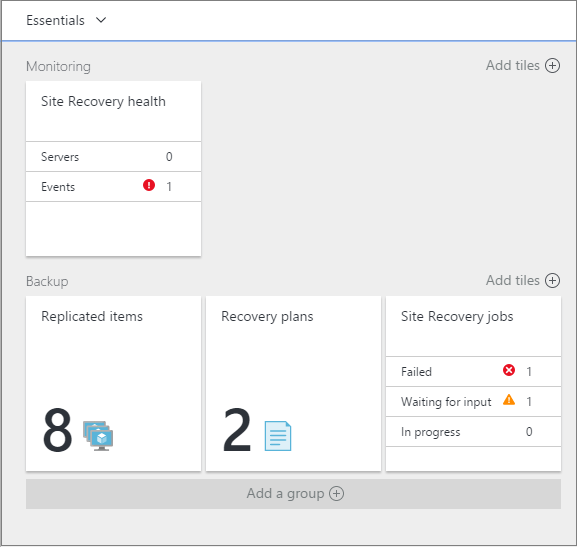

2. In der Kachel **Systemzustand** können Sie Website-Servern (Konfiguration oder VMM-Server) überwachen, die Problem, und die Website Wiederherstellung in den letzten 24 Stunden ausgelöste Ereignisse aufgetreten ist.
3. Können Replikation **Repliziert Elemente**, **Wiederherstellung Pläne**, überwachen und verwalten und **Website Wiederherstellungsaufträge** Kacheln. Aufträge in den **Einstellungen**Drillinto -> **Aufträge** -> **Website Wiederherstellungsaufträge**.

## Nächste Schritte

Nach der Bereitstellung eingerichtet wurde, und [erfahren Sie mehr](site-recovery-failover.md) über die verschiedenen Arten von Failover ausgeführt.
