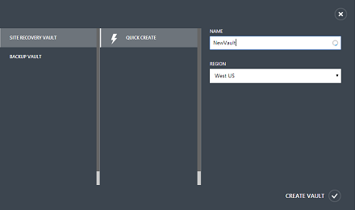

<properties
    pageTitle="Hyper-V virtuelle Computer in VMM Wolken auf einem sekundären VMM Standort repliziert | Microsoft Azure"
    description="Dieser Artikel beschreibt, wie Hyper-V virtuelle Computer in VMM Wolken zu einer sekundären VMM-Website mit Azure Website Wiederherstellung repliziert."
    services="site-recovery"
    documentationCenter=""
    authors="rayne-wiselman"
    manager="jwhit"
    editor=""/>

<tags
    ms.service="site-recovery"
    ms.workload="backup-recovery"
    ms.tgt_pltfrm="na"
    ms.devlang="na"
    ms.topic="article"
    ms.date="08/23/2016"
    ms.author="raynew"/>

# Repliziert Hyper-V virtuelle Computer in VMM Wolken zu einer sekundären VMM-Website

> [AZURE.SELECTOR]
- [Azure-portal](site-recovery-vmm-to-vmm.md)
- [Klassische-portal](site-recovery-vmm-to-vmm-classic.md)
- [PowerShell - Ressourcenmanager](site-recovery-vmm-to-vmm-powershell-resource-manager.md)

Der Dienst Azure Website Wiederherstellung beiträgt zu Ihrer Strategie Business Continuity- und Disaster Wiederherstellung (BCDR) durch Replikation, Failover und Wiederherstellung von virtuellen Computern und physischen Servern orchestriert. Maschinen können Azure oder einem sekundären lokalen Data Center repliziert werden. Für einen schnellen Überblick lesen [Neuigkeiten Azure Website Wiederherstellung?](site-recovery-overview.md)

## (Übersicht)

Dieser Artikel beschreibt, wie Hyper-V-virtuellen Computern auf Hyper-V Hostservern repliziert, die in VMM Wolken sekundäre VMM Verwendung zur Azure-Website Wiederherstellung verwaltet werden.

Im Artikel enthält erforderliche Komponenten, wird gezeigt, wie das Einrichten einer Website Wiederherstellung Tresor, installieren den Azure-Anbieter für Websites Wiederherstellung auf Quelle Ziel VMM-Server, registrieren Sie den Server im Tresor, Schutz Einstellungen für VMM Wolken konfigurieren und dann Aktivieren des Schutzes für Hyper-V virtuelle Computer. Einrichtung abzuschließen Sie, indem Sie das Failover, um sicherzustellen, dass alles wie erwartet funktioniert.

Posten Sie Kommentare oder Fragen am Ende dieses Artikels oder im [Azure Wiederherstellung Services-Forum](https://social.msdn.microsoft.com/forums/azure/home?forum=hypervrecovmgr).

## Architektur

Die nachstehende Abbildung zeigt die verschiedenen Kommunikationskanäle und Azure-Website Wiederherstellung für die Orchestrierung und Replikation verwendeten ports

## Bevor Sie beginnen

Stellen Sie sicher, dass Sie diese erforderlichen Komponenten angeordnet haben:

**Erforderliche Komponenten** | **Details**
--- | ---
**Azure**| Sie benötigen eine [Microsoft Azure](https://azure.microsoft.com/) -Konto. Sie können mit einer [kostenlosen Testversion](https://azure.microsoft.com/pricing/free-trial/)beginnen. [Erfahren Sie mehr](https://azure.microsoft.com/pricing/details/site-recovery/) über die Website Wiederherstellung Preise.
**VMM** | Sie benötigen mindestens eine VMM-Server.  Mindestens sollte der VMM-Server ausgeführt System Center 2012 SP1 mit den neuesten kumulativen Updates.  Wenn Sie mit einem einzigen VMM Server Schutz einrichten möchten, benötigen Sie mindestens zwei Wolken so konfiguriert, dass auf dem Server.  Wenn Sie den Schutz mit zwei VMM-Servern bereitstellen möchten, muss jeder Server verfügen mindestens eine Cloud so konfiguriert, dass auf dem primären VMM-Server, die, den Sie schützen möchten, und eine Cloud so konfiguriert, dass der sekundäre VMM-Server, die, den Sie für Schutz und Wiederherstellung verwenden möchten.  Alle VMM Wolken müssen das Hyper-V Videofunktionen Profil festgelegt.  Die Quelle Cloud, die Sie schützen möchten, muss eine oder mehrere VMM Hostgruppen enthalten.  Erfahren Sie mehr über das Einrichten von VMM Wolken in [Exemplarische Vorgehensweise: Erstellen von privaten Wolken mit System Center 2012 SP1 VMM](http://blogs.technet.com/b/keithmayer/archive/2013/04/18/walkthrough-creating-private-clouds-with-system-center-2012-sp1-virtual-machine-manager-build-your-private-cloud-in-a-month.aspx) in Keith Mayers Blog.
**Hyper-V** | Sie benötigen einen oder mehrere Hyper-V Hostserver in der primären und sekundären VMM Hostgruppen und einen oder mehrere virtuelle Computer auf jedem Hyper-V-Host-Server.  Die Hyper-V-Server Host und Zielliste müssen mindestens ausführen Windows Server 2012 mit Hyper-V-Rolle und die neuesten Updates installiert haben.  Alle Hyper-V Server mit virtuellen Computern, die Sie schützen möchten, muss in der Cloud VMM befinden.  Wenn Sie Hyper-V in einem Cluster ausführen, beachten Sie, dass die Bank Cluster automatisch erstellt nicht zur Verfügung, wenn Sie einen statischen IP-Adresse-basierten Cluster haben. Sie müssen der Cluster Makler manuell konfigurieren. [Weitere Informationen finden Sie](https://www.petri.com/use-hyper-v-replica-broker-prepare-host-clusters) in der Andreas Finn Blogeintrag.
**Netzwerk-Zuordnung** | Sie können Netzwerk-Zuordnung, um sicherzustellen, dass repliziert virtuellen Computern optimal nach Failover auf sekundäre Hyper-V-Host-Servern platziert werden und sie zum entsprechenden virtuellen Computer Netzwerken eine Verbindung herstellen können, konfigurieren. Wenn Sie Netzwerk-Zuordnung nicht konfiguriert haben, wird nicht nach einem Failover Replikat virtuellen Computern mit keinem Netzwerk verbunden werden.  Zum Einrichten der Netzwerk-Zuordnung während der Bereitstellung stellen Sie sicher, dass die virtuellen Computer auf dem Server der Quelle Hyper-V-Host mit einem VMM VM-Netzwerk verbunden sind. Diesem Netzwerk verknüpft werden soll, um ein logisches Netzwerk, das mit der Cloud. ist < Br / Die Cloud Ziel auf dem sekundären VMM-Server, mit denen Sie für die Wiederherstellung sollte eine entsprechende virtueller Computer Netzwerk konfiguriert haben, und es wiederum verknüpft werden soll mit einem entsprechenden logischen Netzwerk, das mit der Cloud Ziel verknüpft ist.  [Weitere](site-recovery-network-mapping.md) Informationen zum Netzwerk-Zuordnung.
**Speicher-Zuordnung** | Standardmäßig bei der Replikation eines virtuellen Computers auf einem Server Quelle Hyper-V Host an einem Server Target Host Hyper-V ist replizierte Daten am Standardspeicherort gespeichert, die für das Ziel Hyper-V-Host Hyper-V Manager gekennzeichnet ist. Für mehr Kontrolle über replizierte Daten gespeichert ist können Sie die Zuordnung von Speicher konfigurieren.   Um Speicher-Zuordnung zu konfigurieren, müssen Sie Einrichten von Speicher Klassifizierung für die Quelle und Ziel: VMM Server vor der Bereitstellung. [Erfahren Sie mehr](site-recovery-storage-mapping.md).

## Schritt 1: Erstellen einer Website Wiederherstellung Tresor

1. Melden Sie sich mit dem [Verwaltungsportal](https://portal.azure.com) aus dem VMM-Server, die, den Sie erfassen möchten.

2. Erweitern Sie **Data Services** > **Wiederherstellung Services** und auf der **Website Wiederherstellung Tresor**.

3. Klicken Sie auf **neu erstellen** > **schnell zu erstellen**.

4. Geben Sie im Feld **Name**einen Anzeigenamen ein, um den Tresor zu identifizieren.

5. Wählen Sie in der **Region** das geografische Region für den Tresor ein. Zum Überprüfen der unterstützte Regionen finden Sie unter geografischen Verfügbarkeit in [Azure Website Wiederherstellung Preise Details](http://go.microsoft.com/fwlink/?LinkId=389880).

6. Klicken Sie auf **Erstellen Tresor**.

    

Aktivieren Sie in der Statusleiste angezeigt, dass der Tresor erstellt wurde. Der Tresor werden auf der Wiederherstellung Services-Hauptseite als **aktiv** aufgelistet.

## Schritt 2: Generieren Sie einen Tresor Registrierungsschlüssel

Erstellen Sie einen Registrierungsschlüssel im Tresor. Nachdem Sie den Anbieter für Azure Websites Wiederherstellung herunterladen und installieren es auf dem Server VMM, verwenden Sie diesen Schlüssel, um den VMM-Server im Tresor registrieren.

1. Klicken Sie auf den Tresor, um die Seite Schnellstart öffnen, auf der Seite **Wiederherstellung Services** . Schnellstart kann auch jederzeit auf das Symbol geöffnet werden.

    

2. Wählen Sie in der Dropdown-Liste **zwischen zwei lokalen VMM Websites**.
3. **Vorbereiten der VMM-Servern**klicken Sie auf **generieren Registrierung Key-Datei**. Die Datei wird automatisch generiert und gilt für 5 Tage, nachdem er generiert wird. Wenn Sie nicht das Azure-Portal aus dem VMM-Server zugreifen, müssen Sie diese Datei auf dem Server zu kopieren.

    

## Schritt 3: Installieren des Wiederherstellung-Anbieters Azure-Website

4. Klicken Sie auf der Seite **Schnellstart** in **VMM vorbereiten-Servern**auf **Herunterladen von Microsoft Azure Website Wiederherstellung Anbieter für die Installation auf Servern VMM** , um die neueste Version der Datei Installation Anbieter zu erhalten.

2. Führen Sie diese Datei auf dem Server der Quelle VMM.

    >[AZURE.NOTE] VMM in einem Cluster bereitgestellt wird, und Installieren der Datenanbieter für das erste Mal auf einem aktiven Knoten zu installieren, und schließen Sie die Installation, um den Server VMM im Tresor zu registrieren. Installieren Sie den Anbieter klicken Sie dann auf den anderen Knoten. Beachten Sie, wenn Sie den Anbieter aktualisieren müssen Sie auf allen Knoten zu aktualisieren, da sie alle dieselbe Version Anbieter ausgeführt werden soll.

3. Das Installationsprogramm unterstützt ein Paar **Pre Anforderungen überprüfen** und Besprechungsanfragen über die Berechtigung zum Beenden des Diensts VMM um Anbieter Setup zu beginnen. VMM-Dienst wird automatisch neu gestartet werden, wenn Setup abgeschlossen ist. Bei der Installation auf einem Cluster VMM werden Sie aufgefordert, die Rolle des Cluster zu beenden.

4. In **Microsoft Update** können Sie nach Updates suchen in optional. Diese Einstellung aktiviert Anbieter entsprechend Ihrer Microsoft Update-Richtlinie Updates installiert werden.

    

5. Auf der Speicherort für die Installation festgelegt ist ** <SystemDrive>\Programme\Microsoft System Center 2012 R2\Virtual Computer Manager\bin**. Klicken Sie auf die Schaltfläche "installieren" So starten Sie den Anbieter installieren.

    

6. Klicken Sie auf **Registrieren** , um den Server im Tresor registrieren, nachdem Sie der Anbieter installiert ist.

    
9. **Tresor Name**überprüfen Sie den Namen der Tresor, in dem der Server registriert wird. Klicken Sie auf *Weiter*.

    

7. Geben Sie in **Verbindung mit dem Internet** an, wie der Anbieter ausgeführt wird, klicken Sie auf dem VMM-Server mit dem Internet verbunden. Wählen Sie **Verbinden mit vorhandenen Proxyeinstellungen** Internet Verbindung Standardeinstellungen so konfiguriert, dass auf dem Server verwenden aus.

    

    - Wenn Sie einen benutzerdefinierten Proxy verwenden möchten sollten Sie es einrichten, bevor Sie den Anbieter installieren. Wenn Sie benutzerdefinierte Proxyeinstellungen konfigurieren wird ein Test ausgeführt, um die Proxy-Verbindung zu überprüfen.
    - Wenn Sie einen benutzerdefinierten Proxy verwende oder Ihr Standard-Proxy-Server erfordert eine Authentifizierung Sie die Proxy-Details, einschließlich der Proxyadresse und den Port eingeben müssen.
    - Folgen Urls sollte aus dem VMM-Server und Hyper-V-Host zugänglich sein
        - *. hypervrecoverymanager.windowsazure.com
        - *. accesscontrol.windows.net
        - *. backup.windowsazure.com
        - *. blob.core.windows.net
        - *. store.core.windows.net
    - Ermöglichen Sie die IP-Adressen (443) [Azure Datacenter IP-Bereiche](https://www.microsoft.com/download/confirmation.aspx?id=41653) und HTTPS-Protokoll beschrieben. Weiß-Liste IP-Bereiche des Azure Region, das Sie verwenden möchten und mit Westen US müssten.
    - Wenn Sie einen benutzerdefinierten Proxy verwenden werden automatisch mit den angegebenen Proxy-Anmeldeinformationen ein Kontos VMM RunAs (DRAProxyAccount) erstellt werden. Konfigurieren Sie den Proxy-Server so, dass dieses Konto erfolgreich authentifiziert werden kann. Die kontoeinstellungen VMM RunAs können in der VMM-Verwaltungskonsole geändert werden. Hierzu öffnen Sie den Arbeitsbereich **Einstellungen** , erweitern Sie **Sicherheit**, klicken Sie auf **Als Konten ausführen**und dann ändern Sie des Kennworts für DRAProxyAccount. Sie müssen den VMM-Dienst neu zu starten, damit diese Einstellung wirksam wird.

8. **Registrierungsschlüssel**wählen Sie die Taste, die Sie aus der Wiederherstellung der Azure-Website heruntergeladen und auf dem Server VMM kopiert haben.

10.  Die Einstellung für die Verschlüsselung wird nur verwendet, wenn Sie Hyper-V virtuelle Computer in VMM Wolken in Azure repliziert sind. Wenn Sie an einem sekundären Standort repliziert sind, wird es nicht verwendet.

11.  Geben Sie im Feld **Servername**einen Anzeigenamen ein, um den VMM-Server im Tresor zu identifizieren. Geben Sie in einer Cluster-Konfiguration den VMM Cluster Rollennamen ein.
12.  **Synchronisieren Cloud Metadaten** auswählen, ob Sie Metadaten für alle Wolken auf dem VMM-Server mit dem Tresor synchronisieren möchten. Diese Aktion muss nur einmal an jeden Server erfolgen. Wenn Sie nicht alle Wolken synchronisieren möchten, können Sie diese Einstellung deaktiviert lassen und Synchronisieren jedes Cloud einzeln in der Cloud Eigenschaften, die in der VMM-Verwaltungskonsole.

13.  Klicken Sie auf **Weiter** , um zu den Prozess abzuschließen. Nach der Registrierung werden die Metadaten aus dem VMM-Server von Azure Website Wiederherstellung abgerufen. Der Server ist in **VMM Servern**angezeigt > **Servern** im Tresor.

    

### Befehlszeile-installation

Den Azure-Anbieter für Websites Wiederherstellung kann auch über die Befehlszeile installiert werden. Diese Methode kann verwendet werden, um den Anbieter auf einem Server-CORE für Windows Server 2012 R2 installieren.

1. Laden Sie den Anbieter Datei- und Registrierungsinformationen Key in einen Ordner aus. Beispielsweise C:\ASR.
2. Beenden Sie den System Center-virtuellen Computern Manager-Dienst
3. Extrahieren Sie das Installationsprogramm Anbieter durch Ausführen der folgenden Befehle aus einer Befehlszeile mit **Administratorrechten** an:

        C:\Windows\System32> CD C:\ASR
        C:\ASR> AzureSiteRecoveryProvider.exe /x:. /q

4. Installieren Sie den Anbieter, indem Sie ausführen:

        C:\ASR> setupdr.exe /i

5. Registrieren Sie den Anbieter, indem Sie ausführen:

        CD C:\Program Files\Microsoft System Center 2012 R2\Virtual Machine Manager\bin
        C:\Program Files\Microsoft System Center 2012 R2\Virtual Machine Manager\bin\> DRConfigurator.exe /r  /Friendlyname <friendly name of the server> /Credentials <path of the credentials file> /EncryptionEnabled <full file name to save the encryption certificate>     

Wo sind die Parameter ein:

 - **/Credentials**: obligatorische Parameter, die den Speicherort angibt, in dem die Datei Key befindet,  
 - **/FriendlyName**: obligatorische Parameter für den Namen des Servers Host Hyper-V, die im Portal Azure Website Wiederherstellung angezeigt wird.
 - **/EncryptionEnabled**: optionale Parameter, die Sie benötigen nur in der VMM zu Azure Szenario verwenden, wenn Sie Ihren virtuellen Computern am statisch in Azure Verschlüsselung benötigen. Stellen Sie sicher, die den Namen der Datei, die Sie bereitstellen, die Erweiterung **PFX-Datei** hat.
 - **/ProxyAddress**: Optionaler Parameter, die Adresse des Proxyservers angibt.
 - **/ProxyPort**: Optionaler Parameter, den Port des Proxyservers angibt.
 - **/proxyUsername**: Optionaler Parameter, Proxy-Benutzernamen angibt (wenn Proxy-Authentifizierung erforderlich ist).
 - **/proxyPassword**: optionale Parameter, die angibt, das Kennwort für die Authentifizierung mit dem Proxyserver (wenn Proxy-Authentifizierung erforderlich ist).  

## Schritt 4: Konfigurieren von Cloud Schutz-Einstellungen

Nach dem VMM-Server registriert sind, können Sie die Cloud Schutz Einstellungen konfigurieren. Wenn Sie die Option **Synchronisieren von Daten mit dem Tresor Cloud** aktiviert, wenn Sie den Anbieter installiert haben, werden also alle Wolken auf dem Server VMM auf der Registerkarte **Geschützten Elemente** im Tresor angezeigt. Wenn Sie Sie nicht synchronisieren eine bestimmte Cloud mit Azure Website Wiederherstellung in der Registerkarte **Allgemein** die Eigenschaftsseite Cloud in der VMM-Verwaltungskonsole.

1. Klicken Sie auf der Seite Schnellstart auf **Schutz für VMM Wolken einrichten**.
2. Wählen Sie auf der Registerkarte **VMM Wolken** der Cloud, die Sie konfigurieren, und wechseln Sie zur Registerkarte **Konfiguration** möchten.
3. Wählen Sie in der **Zielliste** **VMM**ein.
4. Wählen Sie- **Zielort ein**den vor Ort VMM-Server, der die Cloud verwaltet werden, die Sie für die Wiederherstellung verwenden möchten.
4. Wählen Sie **Ziel Cloud**die Cloud Ziel für Failover von virtuellen Computern in der Cloud Quelle verwendet werden soll. Beachten Sie Folgendes:

    - Es empfiehlt sich, eine Cloud Ziel auszuwählen, die Wiederherstellung für den virtuellen Computern erfüllt, die Sie schützen können.
    - Eine Cloud kann nur auf ein paar einzelnen Cloud gehören – entweder als einer primären oder einem Ziel Cloud.

5. Geben Sie im Feld **Häufigkeit kopieren**, wie oft Daten zwischen 5he Quell- und Zielwebsites Speicherorte synchronisiert werden soll. Beachten Sie, dass diese Einstellung nur relevant sind, wenn der Hyper-V-Host Windows Server 2012 R2 ausgeführt wird. Für andere Server ist eine Standardeinstellung von fünf Minuten verwendet.
6. **Zusätzliche Wiederherstellungspunkte**geben an, ob Sie zusätzliche Wiederherstellungspunkte erstellen möchten. Der Standardwert 0 (null) gibt an, dass nur der neueste Wiederherstellungspunkt für einen primären virtuellen Computer auf einen Host Replikatserver gespeichert ist. Beachten Sie, dass mehrere Wiederherstellungspunkte aktivieren zusätzlichen Speicher für die Momentaufnahmen erforderlich ist, die an jeder Stelle Wiederherstellung gespeichert werden. Standardmäßig werden Wiederherstellungspunkte stündlich, erstellt, damit jeder Wiederherstellungspunkt eine Stunde die Einheiten im Wert von Daten enthält. Der Wiederherstellung Punktwert, den Sie für den virtuellen Computer in der VMM-Verwaltungskonsole zuweisen sollte nicht kleiner als der Wert sein, die Sie in der Verwaltungskonsole Azure Website Wiederherstellung zuweisen.
7. Geben Sie in **der Anwendung konsistent Momentaufnahmen Häufigkeit**wie oft die Anwendung konsistent Momentaufnahmen erstellen an. Hyper-V verwendet zwei Arten von Momentaufnahmen – Momentaufnahme standard, der eine Momentaufnahme inkrementelle des gesamten virtuellen Computers enthält, und eine Anwendung konsistente Momentaufnahme, über die eine Point-in-Time-Momentaufnahme der Anwendungsdaten innerhalb des virtuellen Computers zu gelangen. Anwendung konsistent Momentaufnahmen verwenden Volume Schatten Copy Service (VSS), um sicherzustellen, dass Programme konsistent sind, wenn die Momentaufnahme aufgezeichnet wird. Beachten Sie, dass wenn Sie die Anwendung konsistent Momentaufnahmen aktivieren, die Leistung der Anwendung, die auf Quelle virtuellen Computern beeinträchtigt wird. Stellen Sie sicher, dass der Wert, den Sie festlegen kleiner als die Anzahl von Wiederherstellungspunkten zusätzliche ist, die Sie konfigurieren.

    

8. Geben Sie unter **Datenübertragung Komprimierung**, ob replizierte übertragenen Daten komprimiert werden soll.
9. Geben Sie **Authentifizierung**wie Datenverkehr zwischen der primären und der Wiederherstellung Hyper-V-Host-Servern authentifiziert wird. Wählen Sie HTTPS, es sei denn, Sie haben eine arbeiten so konfiguriert, dass Kerberos-Umgebung. Azure Website Wiederherstellung konfiguriert automatisch Zertifikate für HTTPS-Authentifizierung. Es ist keine manuelle Konfiguration erforderlich. Wenn Sie Kerberos auswählen, wird ein Kerberos-Ticket für die gemeinsamen Authentifizierung von den Hostservern verwendet werden. Standardmäßig wird Anschluss 8083 und 8084 (für Zertifikate) in der Windows-Firewall auf die Hyper-V-Host-Server geöffnet werden. Beachten Sie, dass diese Einstellung nur für Hyper-V Hostserver auf Windows Server 2012 R2 relevant sind.
10. Im **Anschluss**ändern Sie die Nummer des Ports auf der Hostcomputer Quell- und Zielwebsites Replikationsdatenverkehr abzuhören. Beispielsweise können Sie die Einstellung ändern, wenn Quality of Service (QoS) Netzwerk-Bandbreite für den Replikationsdatenverkehr begrenzungsebene anwenden möchten. Überprüfen Sie, dass der Port von einer anderen Anwendung verwendet wird nicht und in der Firewalleinstellungen geöffnet wurde.
11. Geben Sie **Replikationsmethode**wie die erste Replikation von Daten aus der Quelle zum Zielspeicherorte behandelt werden vor Beginn der normalen Replikation:

    - **Über Netzwerk**– Kopieren von Daten über das Netzwerk zeitaufwändiger und Ressourcen ankommt werden kann. Es empfiehlt sich, dass Sie diese Option verwenden, wenn die Cloud virtuellen Computern mit relativ kleinen virtuellen Festplatten enthält, und der primäre Standort über eine Verbindung mit große Bandbreite an den sekundären Standort verbunden ist. Sie können angeben, dass die Kopie sofort gestartet wird, oder wählen Sie eine Zeit aus. Wenn Sie Netzwerkreplikation verwenden, empfehlen wir, dass Sie ihn in Zeiten planen.
    - **Offline**– diese Methode gibt an, dass die erste Replikation mithilfe von externen Media ausgeführt werden. Es ist sinnvoll, wenn Sie Verschlechterung Netzwerk-Performance oder für entfernten Speicherorte vermeiden möchten. Zum Verwenden dieser Methode geben Sie den Exportspeicherort in der Cloud Quelle und den Speicherort importieren auf die Ziel-Cloud. Wenn Sie den Schutz für einen virtuellen Computer aktivieren, wird die virtuelle Festplatte an die Position des angegebenen Export kopiert. Sie an die Zielwebsite zu senden, und kopieren ihn in den Speicherort importieren. Das System kopiert die importierte Daten mit den Replikat virtuellen Computern an.

12. Wählen Sie **Löschen Replikat virtuellen Computers** angegeben wird, dass das Replikat virtuellen Computern gelöscht werden soll, wenn Sie beenden Sie den Schutz des virtuellen Computers durch Auswahl der Option **Schutz des virtuellen Computers löschen** auf der Registerkarte virtuellen Computern Eigenschaften der Cloud. Diese Einstellung aktiviert ist, Deaktivierung von Schutz des virtuellen Computers wird aus Azure Website Wiederherstellung entfernt, werden die Website Wiederherstellung Einstellungen des virtuellen Computers in der VMM-Verwaltungskonsole entfernt, und das Replikat wird gelöscht.

    

Nach dem Speichern der Einstellungen ein Auftrags erstellt werden, und klicken Sie auf der Registerkarte **Aufträge** überwacht werden kann. Alle Hyper-V-Host-Servern in der Cloud VMM Quelle werden für die Replikation konfiguriert sein. Klicken Sie auf die Registerkarte **Konfigurieren** können Cloud Einstellungen geändert werden. Wenn Sie die Ziel-Speicherort oder Zielliste Cloud ändern möchten müssen Sie Entfernen der Cloud-Konfiguration, und konfigurieren Sie dann mit die Cloud.

### Bereiten Sie für offline erste Replikation vor

Sie müssen So bereiten Sie offline erste Replikation die folgenden Aktionen ausführen:

- Auf dem Quellserver erhalten Sie einen Pfad zum Speicherort angeben, aus dem der Datenexport erfolgt. Zuweisen von Vollzugriff für NTFS- und Freigabeberechtigungen Berechtigungen zur Verwaltung der VMM-Dienst auf den Pfad exportieren. Auf dem Zielserver erhalten Sie einen Pfad zum Speicherort angeben, aus dem des Datenimports stattfindet. Weisen Sie dieselben Berechtigungen auf dieser Pfad importieren.
- Der Pfad importieren oder exportieren freigegeben ist, weisen Sie Administrator, Hauptbenutzer, Druck-Operator und Server-Operator Gruppenmitgliedschaft für das VMM Dienstkonto auf dem Remotecomputer, auf dem die freigegebenen befindet.
- Wenn Sie zum Hinzufügen von Hosts, auf der Seite importieren und Exportieren von Pfaden, zuweisen gelesen und Schreibberechtigungen für die Konten ausführen als in VMM alle Konten ausführen als verwenden.
- Die Import / Export-Freigaben sollte auf allen Computern als Hyper-V Hostserver, verwendet nicht gefunden werden, da Loopback Konfiguration von Hyper-V nicht unterstützt wird.
- In Active Directory auf jede Hyper-V eingeschränkte Hostserver mit virtuellen Computern, die zu schützen, aktivieren und Konfigurieren der Delegierung die Remotecomputern vertrauen, in denen die Pfade importieren und exportieren, wie folgt befinden:
    1. Öffnen Sie auf dem Domänencontroller **Active Directory-Benutzer und Computer**aus.
    2. Klicken Sie im Strukturbaum auf **Domänenname** > **Computern**.
    3. Mit der rechten Maustaste in des Servernamens für Hyper-V-Host > **Eigenschaften**.
    4. Klicken Sie auf der Registerkarte **Delegierung** auf T**Rost von diesem Computer für die Delegierung bestimmter Dienste**.
    5. Klicken Sie auf **eine beliebige Authentication-Protokoll verwenden**.
    6. Klicken Sie auf **Hinzufügen** > **Benutzer und Computer**.
    7. Geben Sie den Namen des Computers ein, der den Pfad exportieren hostet > **OK**. Aus der Liste der verfügbaren Dienste, halten Sie die STRG-Taste gedrückt, und klicken Sie auf **Cifs** > **OK**. Wiederholen Sie für den Namen des Computers, auf den Pfad importieren befindet. Wiederholen Sie diese Schritte für weitere Hyper-V-Host-Servern.

## Schritt 5: Konfigurieren von Netzwerk-Zuordnung
1. Klicken Sie auf der Seite Schnellstart auf **Netzwerke zuordnen**.
2. Wählen Sie die Quelle VMM-Server Netzwerken zuordnen soll, und das Ziel VMM-Server, den die Netzwerken zugeordnet werden soll. Die Liste der Quellnetzwerke und deren zugeordnete Ziel-Netzwerke werden angezeigt. Ein leerer Wert ist für Netzwerke angezeigt, die derzeit nicht zugeordnet sind.
3. Wählen Sie ein Netzwerk im **Netzwerk Quelle** > **Karte**. Der Dienst erkennt die Netzwerke virtueller Computer, auf dem Zielserver und zeigt sie an. Klicken Sie auf das Informationssymbol neben den Netzwerknamen Quell- und Zielwebsites die Subnetze für jedes Netzwerk anzeigen.

    

4. Wählen Sie im Dialogfeld eine der virtuellen Computer Netzwerke aus dem Ziel VMM-Server aus.

    

5. Wenn Sie ein Zielnetzwerk auswählen, werden die geschützten Wolken, die das Quellnetzwerk verwenden angezeigt. Verfügbaren Ziel Netzwerke, die zum Schutz vor verwendet Wolken zugeordnet sind, werden ebenfalls angezeigt. Es empfiehlt sich, dass Sie Zielnetzwerk auswählen, die für alle Wolken zur Verfügung steht, die Sie für den Schutz verwenden. Oder können Sie auch auf dem Server VMM wechseln und ändern Sie die Eigenschaften "Cloud" zum Hinzufügen des logischen Netzwerks entspricht dem virtuellen Computer-Netzwerk, das Sie auswählen möchten.
6. Klicken Sie auf das Häkchen, um die Zuordnung abzuschließen. Verfolgen des Fortschritts Zuordnung wird ein Projekt gestartet. Sie können sie auf der Registerkarte **Aufträge** anzeigen.

## Schritt 6: Konfigurieren von Speicher-Zuordnung
Standardmäßig bei der Replikation eines virtuellen Computers auf einem Server Quelle Hyper-V Host an einem Server Target Host Hyper-V ist replizierte Daten am Standardspeicherort gespeichert, die für das Ziel Hyper-V-Host Hyper-V Manager gekennzeichnet ist. Für mehr Kontrolle über replizierte Daten gespeichert ist können Sie wie folgt Speicher Zuordnungen zu konfigurieren:

1. Definieren von Speicher Klassifizierung auf Quell- und Zielliste VMM-Servern. [Erfahren Sie mehr](https://technet.microsoft.com/library/gg610685.aspx). Klassifizierung muss die Hyper-V-Host-Servern in Quell- und Zielwebsites Wolken zur Verfügung. Klassifizierung erforderlich vom gleichen Typ Speicher sind nicht. Beispielsweise können Sie eine Datenquelle Klassifizierung zuordnen, die SMB-Freigaben für eine gewünschte Klassifizierung enthält, die CSVs enthält.
2. Nachdem Klassifizierung angeordnet sind, können Sie Zuordnungen zu erstellen. Dazu klicken Sie auf der Seite **Schnellstart** > **Speicher zuordnen**.
3. Klicken Sie auf die Registerkarte **Speicher** > **Speicher Klassifizierung zuordnen**.
4. Wählen Sie auf der Registerkarte **Speicher Klassifizierung zuordnen** Klassifizierung für die Quelle und Ziel VMM-Server. Speichern Sie Ihre Einstellungen.

    

## Schritt 7: Aktivieren des Schutzes von virtuellen Computern
Nach dem Server, Wolken und Netzwerke ordnungsgemäß konfiguriert sind, können Sie den Schutz für virtuelle Computer in der Cloud aktivieren.

1. Klicken Sie auf der Registerkarte **virtuellen Computern** in der Cloud, in dem sich die virtuellen Computern befindet, auf **Schutz aktivieren** > **virtuelle Computer hinzufügen**.
2. Wählen Sie aus der Liste von virtuellen Computern in der Cloud, die Sie schützen möchten.

    

3. Nachverfolgen von Fortschritt der Aktion in der Registerkarte **Aufträge** , einschließlich der ersten Replikations Schutz aktivieren. Nachdem das Projekt Schutz Fertigstellen ausgeführt wird ist des virtuellen Computers Failoververarbeitung bereit. Nachdem der Schutz aktiviert ist, und virtuellen Computern repliziert werden, werden Sie diese in Azure angezeigt werden sollen.

    

>[AZURE.NOTE] Sie können auch Schutz für virtuelle Computer in der VMM-Verwaltungskonsole aktivieren. Klicken Sie auf der Symbolleiste auf der Registerkarte **Azure Website Wiederherstellung** in den Eigenschaften des virtuellen Computers auf **Schutz aktivieren** .

### Integrierte vorhandenen virtuellen Computern

Wenn Sie die vorhandenen virtuellen Computern in VMM verfügen, die mit Hyper-V Replica repliziert werden benötigen auf integrierte sie für die Website Wiederherstellung Azure Schutz wie folgt Sie Folgendes:

1. Stellen Sie sicher, dass Sie die primäre und sekundäre Wolken haben. Stellen Sie sicher, dass der Hyper-V Server Hosten des vorhandenen virtuellen Computers sich in der Cloud primären befindet und der Hyper-V Server hosten Replikat virtuellen Computers in der Cloud sekundäre befindet. Stellen Sie sicher, dass Sie haben Schutz Einstellungen für die Wolken konfiguriert. Die Einstellungen sollte den derzeit konfigurierten für Hyper-V Replica übereinstimmen. Andernfalls virtuellen Computern Replikation funktioniert möglicherweise nicht wie erwartet.
2. Aktivieren Sie dann Schutz des primären virtuellen Computers. Azure Website Wiederherstellung und VMM wird sichergestellt, die gleichen Replika-Server und virtuellen Computern erkannt wird, und Azure-Website Wiederherstellung wird wiederverwenden und Replikation mit den Einstellungen so konfiguriert, dass während der Cloud-Konfiguration erneut.

## Testen der bereitstellungs

Zum Ausführen eines Failovers Test für einen einzelnen virtuellen Computern oder ein Wiederherstellungsplans aus mehreren virtuellen Computern erstellen und Ausführen ein Failovers Test für den Plan, Testen der Bereitstellung.  Test Failover simuliert Ihrer Failover und Wiederherstellung Verfahren in einem Netzwerk isoliert.

### Erstellen Sie einen Wiederherstellungsplan

1. Klicken Sie auf der Registerkarte **Wiederherstellung Pläne** auf **Planen der Wiederherstellung erstellen**.
2. Geben Sie einen Namen für den Plan für die Wiederherstellung und Quell- und Zielwebsites VMM-Servers ein. Der Server für die Datenquelle müssen virtuellen Computern, die für Failover und Wiederherstellung aktiviert sind. Wählen Sie **Hyper-V** nur Wolken anzeigen möchten, die für die Replikation Hyper-V konfiguriert sind.

    

3. Wählen Sie unter **Wählen Sie virtuellen Computern**Replikationsgruppen ein. Alle virtuellen Computern Replikationsgruppe zugeordnet werden ausgewählt und den Wiederherstellungsplan hinzugefügt werden. Diesen virtuellen Computern der Wiederherstellung Plan Standardgruppe hinzugefügt werden – Gruppe 1. Sie können weitere Gruppen hinzufügen, falls erforderlich. Beachten Sie, dass nach der Replikation virtuellen Computern gemäß der Reihenfolge der Wiederherstellung Plangruppen von gestartet werden kann.

    

Nach der Behebung weist Plan erstellt wurde, es wird in der Liste auf der Registerkarte **Wiederherstellung Pläne** .

###Ausführen eines Failovers testen

1. Wählen Sie auf der Registerkarte **Wiederherstellung Pläne** den Plan aus, und klicken auf **Failover testen**.
2. Wählen Sie auf der Seite **Bestätigen Test Failover** **keine**aus. Notiz, die mit dieser Option die fehlgeschlagene über Replikat virtuellen Computern aktiviert wird nicht mit einem beliebigen Netzwerk verbunden sein. Dies wird, dass des virtuellen Computers über schlägt fehl, wie erwartet, jedoch nicht, Ihre Replikation Netzwerk-Umgebung testen zu testen. Schauen Sie sich für weitere Details zur Verwendung von Optionen für verschiedene Netzwerke [einen Failover Test ausgeführt](site-recovery-failover.md#run-a-test-failover) .
3. Die Test-virtuellen Computern wird auf demselben Host als Host erstellt für die Replikat virtuellen Computers vorhanden sind. Es wird in der gleichen Cloud hinzugefügt, in dem Replikat virtuellen Computers gespeichert ist.

### Führen Sie einen Wiederherstellungsplan
Nach der Replikation möglicherweise Replikat virtuellen Computers keine IP-Adresse, die die IP-Adresse des primären virtuellen Computers identisch ist. Virtuellen Computern den DNS-Server, die verwendeten wird aktualisiert, nachdem sie neu starten. Sie können auch ein Skript zum Aktualisieren der DNS-Server, um eine Aktualisierung von schnell sicherzustellen hinzufügen.

#### Skript zum Abrufen der IP-Adresse
Führen Sie dieses Beispielskript zum Abrufen der IP-Adresse ein.

        $vm = Get-SCVirtualMachine -Name <VM_NAME>
        $na = $vm[0].VirtualNetworkAdapters>
        $ip = Get-SCIPAddress -GrantToObjectID $na[0].id
        $ip.address  

#### Skript zum Aktualisieren von DNS-Einträge
Führen Sie dieses Beispielskript zum Aktualisieren von DNS-Einträge, die IP-Adresse mit dem vorherigen Beispielskript abgerufene angeben.

        string]$Zone,
        [string]$name,
        [string]$IP
        )
        $Record = Get-DnsServerResourceRecord -ZoneName $zone -Name $name
        $newrecord = $record.clone()
        $newrecord.RecordData[0].IPv4Address  =  $IP
        Set-DnsServerResourceRecord -zonename $zone -OldInputObject $record -NewInputObject $Newrecord

## Informationen zum Datenschutz für die Website Wiederherstellung

Dieser Abschnitt enthält weitere Datenschutzinformationen für die Microsoft Azure-Website wiederherstellen Dienst (""). Zum Anzeigen des Datenschutzbestimmungen für Microsoft Azure Services finden Sie unter den [Datenschutzbestimmungen für Microsoft Azure](http://go.microsoft.com/fwlink/?LinkId=324899)

**Feature: Registrierung**

- **Was bedeutet**: Server mit Service registriert, sodass virtuellen Computern geschützt werden können
- **Informationen erfasst**: nach dem Dienst registrieren sammelt, verarbeitet und übermittelt Management Zertifikatsinformationen aus dem VMM-Server, dem festgelegt ist, verwenden den Namen des VMM-Servers und den Namen des virtuellen Computers Wolken auf dem Server VMM Wiederherstellung bereitstellen.
- **Verwendung der Informationen**:
    - Management Zertifikat – Hiermit wird zum Identifizieren und authentifizieren den registrierten VMM-Server für den Zugriff auf den Dienst. Der Dienst verwendet den öffentlichen Key Teil des Zertifikats ein Token gesichert, die nur der registrierte VMM-Server zugreifen kann. Der Server muss dieses Token verwenden, den Zugriff auf die Service-Features.
    - Name des Servers VMM – das VMM Servername ist erforderlich, um zu identifizieren und zu kommunizieren mit den entsprechenden VMM-Server, auf denen die Wolken befinden.
    - Namen aus dem VMM-Server Cloud – der Namen Cloud ist erforderlich, wenn der Cloud Service mit paarweise Zuordnung/unpairing Feature nachfolgend beschriebenen. Wenn Sie feststellen, in der Cloud aus einem primären Data Center mit einem anderen Cloud in der Mitte der Wiederherstellung Daten zu verbinden, werden die Namen von allen Wolken aus der Mitte der Wiederherstellung Daten dargestellt.

- **Auswahl**: Diese Informationen ist ein wesentlicher Bestandteil der Registrierung Dienst, da besser Sie und den Dienst VMM-Server zu identifizieren, für die Sie Azure Website Wiederherstellung Schutz auch unter ', um den richtigen registrierten VMM Server identifizieren bereitstellen möchten. Wenn Sie nicht diese Informationen an den Dienst senden möchten, verwenden Sie diesen Dienst nicht. Wenn Sie Ihre Server registrieren und dann später es aufgehoben werden soll, können Sie hierzu löschen die Serverinformationen VMM vom Dienst-Portal (also den Azure-Portal).

**Feature: Aktivieren Sie Azure Website Wiederherstellung Schutz**

- **Was bedeutet**: Kabel für die Kommunikation mit dem Dienst für das Azure Wiederherstellung Anbieter für Websites auf dem Server VMM installiert wird. Der Anbieter ist eine Dynamic Link Library (DLL) in den Prozess VMM gehostet wird. Nachdem Sie der Anbieter installiert ist, wird das Feature "Datacenter Wiederherstellung" in der VMM-Verwaltungskonsole aktiviert. Alle neuen oder vorhandenen virtuellen Computern in der Cloud können eine Eigenschaft namens "Datacenter Wiederherstellung" zum Schutz des virtuellen Computers aktivieren. Nachdem Sie diese Eigenschaft festgelegt ist, sendet der Anbieter den Namen und die ID des virtuellen Computers an den Dienst an. Virtuelle Schutz wird von Windows Server 2012 oder Windows Server 2012 R2 Hyper-V-Technologie für die Replikation aktiviert. Die virtuellen Computerdaten werden von einem Hyper-V-Host zu einem anderen (normalerweise befindet sich in einem anderen "Wiederherstellung" Data Center) repliziert.

- **Gesammelte Informationen**: der Dienst gesammelt, verarbeitet und übermittelt Metadaten des virtuellen Computers, wozu auch die Name, ID, virtuelles Netzwerk und den Namen der Cloud zu der sie gehört.

- **Verwendung der Informationen**: der Dienst verwendet die obige Informationen, um die virtuellen Computerinformationen über Ihre Service-Portal zu füllen.

- **Auswahl**: Dies ist ein wesentlicher Bestandteil des Diensts und kann nicht deaktiviert werden. Wenn Sie nicht, dass diese Informationen an den Dienst gesendet werden möchten, aktivieren Sie Azure Website Wiederherstellung Schutz für alle virtuellen Computern nicht. Beachten Sie, dass alle Daten, die an dem Dienst durch den Anbieter gesendeten über HTTPS gesendet wird.

**Funktion: Plan für die Wiederherstellung**

- **Was bedeutet**: dieses Feature hilft Ihnen, um eine Orchestrierung Plan für "Wiederherstellung" Data Center zu erstellen. Sie können die Reihenfolge definieren, in der die virtuellen Computer oder einer Gruppe von virtuellen Computern bei der Wiederherstellung Website gestartet werden soll. Sie können auch eine automatisierte Skripts benutzerspezifisch ausführen oder beliebiger manuelle Aktion ausgeführt werden, zum Zeitpunkt der Wiederherstellung für jeden virtuellen Computer angeben. Failover (im nächsten Abschnitt behandelt) wird in der Regel auf der Ebene Wiederherstellung planen für aufeinander abgestimmte Wiederherstellung ausgelöst.

- **Gesammelte Informationen**: der Dienst sammelt, verarbeitet und Metadaten für den Wiederherstellungsplan, einschließlich virtuellen Computern Metadaten und Metadaten von Automatisierungsskripts und manuelle Aktion Notizen übermittelt.

- **Verwendung der Informationen**: die oben beschriebene Metadaten wird verwendet, um den Wiederherstellungsplan Ihrer Service-Portal zu erstellen.

- **Auswahl**: Dies ist ein wesentlicher Bestandteil des Diensts und kann nicht deaktiviert werden. Wenn Sie nicht, dass diese Informationen an den Dienst gesendet werden möchten, erstellen Sie nicht Wiederherstellung in diesem Dienst-Pläne.

**Feature: Netzwerk-Zuordnung**

- **Was bedeutet**: dieses Features können Sie Netzwerkinformationen aus der Mitte des primären Daten das Wiederherstellung Data Center zuordnen. Wenn die virtuellen Computer auf der Website der Wiederherstellung wiederhergestellt werden, können diese Zuordnung beim Herstellen Netzwerkkonnektivität für diese aus.

- **Informationen erfasst**: als Teil des Netzwerks Zuordnung Features, den Dienst sammelt, verarbeitet, und die Metadaten für jeden Standort (Primär- und Datacenter) die logischen Netzwerke übermittelt.

- **Verwendung der Informationen**: der Dienst verwendet die Metadaten Ihrer Service-Portal gefüllt wird, können Sie die Informationen zuordnen.

- **Auswahl**: Dies ist ein wesentlicher Bestandteil des Diensts und kann nicht deaktiviert werden. Wenn Sie nicht, dass diese Informationen an den Dienst gesendet werden möchten, verwenden Sie das Netzwerk Zuordnung Feature nicht.

**Feature: Failover - geplanten, ungeplanten, testen**

- **Was bedeutet**: dieses Feature hilft Failover eines virtuellen Computers eine VMM verwalteten Data Center auf ein anderes VMM verwalteten Datacenter. Die Aktion Failover wird durch den Benutzer über deren Service-Portal ausgelöst. Mögliche Gründe für ein Failover sind ein ungeplantes Ereignis (beispielsweise im Fall eines natürliche disaster0; einer geplanten (beispielsweise Datacenter Lastenausgleich); ein Test-Failover (beispielsweise ein Plan Probelauf Wiederherstellung).

Auf dem Server VMM Anbieter werden benachrichtigt, der das Ereignis aus dem Dienst und führt eine Aktion Failover auf dem Host Hyper-V über VMM-Schnittstellen. Ist-Failover des virtuellen Computers von einem Hyper-V-Host zu einem anderen (normalerweise in einem anderen "Wiederherstellung" Data Center ausgeführt) erfolgt über die Windows Server 2012 oder Windows Server 2012 R2 Hyper-V Replikation Technologie. Nach Abschluss des Failovers sendet der Anbieter auf dem VMM-Server das "Wiederherstellung" Data Center installiert die Erfolg Informationen an den Dienst an.

- **Gesammelte Informationen**: der Dienst verwendet die obige Informationen, um den Status der Aktion Failover Informationen über Ihre Service-Portal zu füllen.

- **Verwendung der Informationen**: der Dienst verwendet die obige Informationen wie folgt:

    - Management Zertifikat – Hiermit wird zum Identifizieren und authentifizieren den registrierten VMM-Server für den Zugriff auf den Dienst. Der Dienst verwendet den öffentlichen Key Teil des Zertifikats ein Token gesichert, die nur der registrierte VMM-Server zugreifen kann. Der Server muss dieses Token verwenden, den Zugriff auf die Service-Features.
    - Name des Servers VMM – das VMM Servername ist erforderlich, um zu identifizieren und zu kommunizieren mit den entsprechenden VMM-Server, auf denen die Wolken befinden.
    - Namen aus dem VMM-Server Cloud – der Namen Cloud ist erforderlich, wenn der Cloud Service mit paarweise Zuordnung/unpairing Feature nachfolgend beschriebenen. Wenn Sie feststellen, in der Cloud aus einem primären Data Center mit einem anderen Cloud in der Mitte der Wiederherstellung Daten zu verbinden, werden die Namen von allen Wolken aus der Mitte der Wiederherstellung Daten dargestellt.

- **Auswahl**: Dies ist ein wesentlicher Bestandteil des Diensts und kann nicht deaktiviert werden. Wenn Sie nicht, dass diese Informationen an den Dienst gesendet werden möchten, verwenden Sie diesen Dienst nicht.

## Nächste Schritte

Nach haben Sie einen Test-Failover zu überprüfen, dass Ihre Umgebung wie erwartet, [Informationen zu](site-recovery-failover.md) verschiedenen Arten von Failovers arbeitet ausführen.
