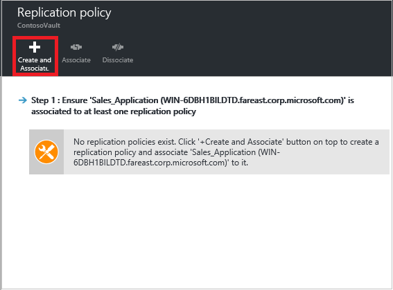
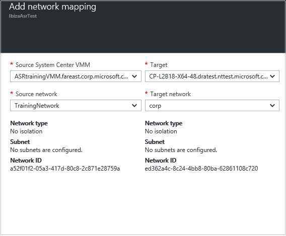
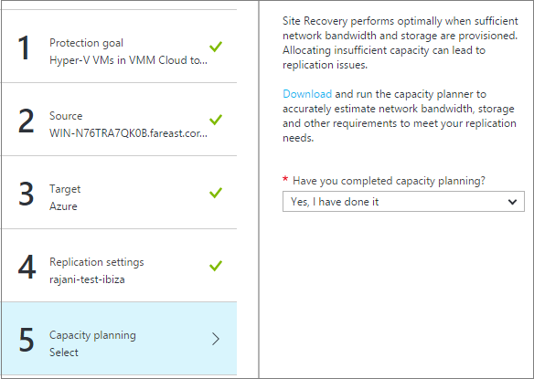

<properties
    pageTitle="Hyper-V virtuelle Computer in VMM Wolken zu einer sekundären VMM-Website mit dem Azure-Portal repliziert | Microsoft Azure"
    description="Beschreibt, wie Azure Website Wiederherstellung zum Koordinieren von Replikation, Failover- und Hyper-V virtueller Computer in VMM Wolken zu einer sekundären VMM-Website mit dem Azure-Portal bereitstellen."
    services="site-recovery"
    documentationCenter=""
    authors="rayne-wiselman"
    manager="jwhit"
    editor=""/>

<tags
    ms.service="site-recovery"
    ms.workload="backup-recovery"
    ms.tgt_pltfrm="na"
    ms.devlang="na"
    ms.topic="article"
    ms.date="08/23/2016"
    ms.author="raynew"/>

# Repliziert Hyper-V virtuelle Computer in VMM Wolken zu einer sekundären VMM-Website mit dem Azure-portal

> [AZURE.SELECTOR]
- [Azure-portal](site-recovery-vmm-to-vmm.md)
- [Klassische-portal](site-recovery-vmm-to-vmm-classic.md)
- [PowerShell - Ressourcenmanager](site-recovery-vmm-to-vmm-powershell-resource-manager.md)

Willkommen bei Azure Website Wiederherstellung! Verwenden Sie in diesem Artikel, wenn soll lokalen Hyper-V-virtuellen Computern repliziert in System Center virtuellen Computern Manager (VMM) Wolken an einem sekundären Standort verwaltet. In diesem Artikel werden die zum Einrichten der Replikation mithilfe von Azure Website Wiederherstellung Azure-Portal.

> [AZURE.NOTE] Azure weist zwei verschiedenen [Bereitstellungsmodelle](../resource-manager-deployment-model.md) für das Erstellen und Arbeiten mit Ressourcen: Azure Ressourcenmanager und Classic. Azure verfügt auch über zwei communityportalen – Azure klassischen Portals, die das Bereitstellungsmodell klassischen unterstützt, und der Azure-Portal mit Unterstützung für beide Bereitstellungsmodelle.

Azure Website Wiederherstellung Azure-Portal bietet mehrere neue Features:

- In der Azure sind Portal, Azure Sicherung und Wiederherstellung von Azure-Sites Services in einer einzigen Wiederherstellung Services Tresor, kombiniert, damit Sie einrichten und Verwalten von Geschäftskontinuität und Wiederherstellung (BCDR) von einem einzigen Ort können. Ein einheitliches Dashboard ermöglicht das Überwachen und Verwalten von Vorgängen über Ihren lokalen Websites und der Azure öffentlichen Cloud.
- Benutzer mit nach der Bereitstellung mit der Cloud Lösung Provider (CSP) Programm Azure-Abonnements können jetzt Website Wiederherstellungsvorgängen Azure-Portal verwalten.

Nach dem Lesen in diesem Artikel, Posten Sie eventuelle Kommentare in den Kommentaren Disqus unten aus. Fragen Sie technische im [Azure Wiederherstellung Services-Forum](https://social.msdn.microsoft.com/forums/azure/home?forum=hypervrecovmgr).

## (Übersicht)

Organisationen benötigen eine BCDR Strategie, die bestimmt, wie apps, Auslastung und Daten bleiben während der geplanten und ungeplanten Ausfallzeiten ausgeführt werden und verfügbar, und zum normalen Arbeit Umständen so früh wie möglich wiederherzustellen. Strategische BCDR sollten Geschäftsdaten beibehalten, sicherer und wiederhergestellt, und vergewissern Sie sich Auslastung kontinuierlich verfügbar bleiben, wenn bei Datenverlusten.

Website Wiederherstellung ist eine Azure-Dienst, der zur strategische BCDR beiträgt, indem orchestriert Replikation von physische Server lokal und in der Cloud (Azure) oder zu einem sekundären Datencenter-virtuellen Computern an. Treten Ausfall in gewohnten Standort befinden, fehl Sie über den zweiten Standort zum Aktualisieren von apps und Auslastung zur Verfügung. Sie fehl zurück zur gewohnten Standort befinden, wenn sie normale Vorgänge zurückgibt. Erfahren Sie mehr in [Neuigkeiten Azure Website Wiederherstellung?](site-recovery-overview.md)

Dieser Artikel enthält alle Informationen, die Sie repliziert müssen Hyper-V virtuelle Computer in VMM Wolken zu einer sekundären VMM Website lokal. Es enthält eine Übersicht über die Architektur, Planen von Informationen und Bereitstellungsschritte zum Konfigurieren von lokalen Servern, Replikation Einstellungen und Kapazität zu planen. Nach dem Einrichten der Infrastruktur haben Sie Replikation auf Computern, die Sie schützen aktivieren können, und überprüfen Sie, dass die Failover funktioniert möchten.

## Vorteile für Unternehmen

- Website Wiederherstellung bietet Schutz für Business Auslastung und Anwendung, die auf Hyper-V virtuellen Computern ausgeführt werden, da sie einem sekundären Hyper-V Server repliziert werden.
- Das Portal Wiederherstellung bietet einen Speicherort zum Einrichten, verwalten und Überwachen der Replikation, Failover und Wiederherstellung.
- Sie können ganz einfach ausführen Failovers aus Ihrer primären lokalen Infrastruktur sekundären und Failback (Wiederherstellen) aus der sekundäre Standort des primären ausführen.
- Sie können Wiederherstellung Pläne mit mehreren Computern konfigurieren, damit gestufte Auslastung zusammen über fehl.

## Szenario-Architektur

Dies sind die Szenariokomponenten:

- **Primärer Standort**: der primären Website vorhanden sind eine oder mehrere Hyper-V Hostservern Ausführen von Quelle virtuellen Computern repliziert werden soll. Diese primären Hostserver befinden sich in eine VMM private Cloud.
- **Sekundären**: der sekundäre-Website eine oder mehrere Hyper-V Hostserver mit vorhanden sind Ziel virtuellen Computern, dem Sie die primären virtuellen Computern repliziert. Diese Hostserver befinden sich in einem VMM private Cloud. Die Cloud kann auf dem primären Server (Wenn Sie nur einen einzelnen VMM-Server verwenden) oder auf einem sekundären VMM-Server sein.
- **Anbieter**: während der Wiederherstellung Website Bereitstellung Sie den Azure-Anbieter für Websites Wiederherstellung auf den Servern VMM installieren und diesen Servern in einem Tresor Wiederherstellung Services registrieren. Der Anbieter ausgeführt wird, auf dem Server VMM kommuniziert mit Website Wiederherstellung über HTTPS 443 Orchestrierung repliziert. Datenreplikation tritt zwischen primären und sekundären Hyper-V-Host-Server. Replizierte Daten innerhalb der lokalen Websites und Netzwerke bleibt und nicht an Azure gesendet. Weitere Informationen zum [Datenschutz](#privacy-information-for-site-recovery).

### Übersicht über Data-Datenschutz

In dieser Tabelle fasst zusammen, wie Daten in diesem Szenario gespeichert werden:
****
Aktion | **Details** | **Gesammelten Daten** | **Verwendung** | **Erforderlich**
--- | --- | --- | --- | ---
**Registrierung** | Sie registrieren VMM-Server in einem Tresor Wiederherstellung Services. Wenn Sie später einen Server aufgehoben werden möchten, können Sie dazu löschen die Serverinformationen aus dem Azure-Portal. | Nach ein VMM-Server registriert ist, Website Wiederherstellung sammelt, Prozesse, und Metadaten zu dem VMM-Server und die Namen der VMM Wolken von Website-Wiederherstellung entdeckt weiterleitet. | Die Daten werden verwendet, um zu identifizieren und Kommunikation mit dem entsprechenden VMM-Server und Konfigurieren von Einstellungen für die entsprechende VMM Wolken. | Dieses Feature ist erforderlich. Wenn Sie nicht, senden diese Informationen zu der Website Wiederherstellung möchten dürfen nicht Sie den Website Wiederherstellung-Dienst verwenden.
**Aktivieren der Replikation** | Den Azure-Anbieter für Websites Wiederherstellung auf dem VMM-Server installiert ist und Kabel für die Kommunikation mit dem Dienst Website Wiederherstellung wird. Der Anbieter ist eine Dynamic Link Library (DLL) in den Prozess VMM gehostet wird. Nachdem Sie der Anbieter installiert ist, wird das Feature "Datacenter Wiederherstellung" in der VMM-Verwaltungskonsole aktiviert. Neue und vorhandene virtuellen Computern können dieses Feature aktivieren Schutz für einen virtuellen Computer aktivieren. | Diese Eigenschaft festgelegt sendet der Anbieter den Namen und den virtuellen Computer-ID an Wiederherstellung Website an.  Replikation ist in Windows Server 2012 oder Windows Server 2012 R2 Hyper-V Replica aktiviert. Die virtuellen Computerdaten werden von einem Hyper-V-Host zu einem anderen (normalerweise befindet sich in einem anderen "Wiederherstellung" Data Center) repliziert. | Website Wiederherstellung anhand der Metadaten, die virtuellen Computer Informationen im Portal Azure gefüllt wird. | Dieses Feature ist ein wesentlicher Bestandteil des Diensts und kann nicht deaktiviert werden. Wenn Sie nicht diese Informationen senden möchten, aktivieren Sie Website Wiederherstellung Schutz für virtuelle Computer nicht. Beachten Sie, dass alle Daten, die von den Anbieter gesendet, um die Website Wiederherstellung über HTTPS gesendet wird.
**Planen der Wiederherstellung** | Wiederherstellung Pläne helfen Sie bei der Erstellung eines Orchestrierung Plans für die Wiederherstellungsdatei Data Center. Sie können die Reihenfolge definieren, in der virtuellen Computern oder einer Gruppe von virtuellen Computern bei der Wiederherstellung Website gestartet werden soll. Sie können auch eine automatisierte Skripts benutzerspezifisch ausführen oder beliebiger manuelle Aktion ausgeführt werden, zum Zeitpunkt der Wiederherstellung für jeden virtuellen Computer angeben. Failover ist in der Regel für aufeinander abgestimmte Wiederherstellung Ebene Planen der Wiederherstellung ausgelöst wurde. | Website Wiederherstellung sammelt, verarbeitet und Metadaten für den Wiederherstellungsplan, einschließlich virtuellen Computern Metadaten und Metadaten von Automatisierungsskripts und manuelle Aktion Notizen übermittelt. | Die Metadaten werden verwendet, um den Wiederherstellungsplan Azure-Portal zu erstellen. | Dieses Feature ist ein wesentlicher Bestandteil des Diensts und kann nicht deaktiviert werden. Wenn Sie nicht diese Informationen auf der Website Wiederherstellung senden möchten, erstellen Sie Pläne Wiederherstellung nicht.
**Netzwerk-Zuordnung** | Karten Netzwerkinformationen aus dem primären Data Center Wiederherstellung Data Center. Wenn auf der Website Wiederherstellung virtuellen Computern wiederhergestellt werden, können Netzwerk-Zuordnung beim Herstellen der Verbindung zum Netzwerk ein. | Website Wiederherstellung sammelt, verarbeitet und die Metadaten für jeden Standort (Primär- und Datacenter) die logischen Netzwerke übermittelt. | Die Metadaten wird verwendet, um die Einstellungen im Netzwerk füllen, sodass die Netzwerkinformationen zugeordnet werden kann. | Dieses Feature ist ein wesentlicher Bestandteil des Diensts und kann nicht deaktiviert werden. Wenn Sie nicht diese Informationen auf der Website Wiederherstellung senden möchten, verwenden Sie Netzwerk-Zuordnung nicht.
**Failover (geplanter/ungeplanten/Test)** | Failover schlägt über virtuelle Computer aus einer VMM verwaltet Datacenter in ein anderes. Die Aktion Failover wird der Azure-Portal manuell ausgelöst. | Der Anbieter auf dem VMM-Server nach der Wiederherstellung der Website des Failoverereignisses benachrichtigt, und führt eine Aktion Failover auf dem Host von Hyper-V über VMM-Schnittstellen. Ist-Failover eines virtuellen Computers befindet sich in einem Hyper-V-Host auf eine andere und von Windows Server 2012 oder Windows Server 2012 R2 Hyper-V Replica. Nach Abschluss der Failover sendet der Anbieter auf dem VMM-Server in der Mitte der Wiederherstellung Daten Erfolg Informationen an Wiederherstellung Website an. | Website Wiederherstellung verwendet die Informationen gesendet, um den Status der Failover Aktivitätsinformationen zur Azure-Portal zu füllen. | Dieses Feature ist ein wesentlicher Bestandteil des Diensts und kann nicht deaktiviert werden. Wenn Sie nicht diese Informationen auf der Website Wiederherstellung senden möchten, verwenden Sie Failover nicht.

## Azure erforderliche Komponenten

Hier ist, was Sie in Azure müssen dieses Szenario bereitstellen:

**Erforderliche Komponenten** | **Details**
--- | ---
**Azure**| Sie benötigen eine [Microsoft Azure](http://azure.microsoft.com/) -Konto. Sie können mit einer [kostenlosen Testversion](https://azure.microsoft.com/pricing/free-trial/)beginnen. [Erfahren Sie mehr](https://azure.microsoft.com/pricing/details/site-recovery/) über die Website Wiederherstellung Preise.

## Lokale erforderliche Komponenten

Hier ist, was Sie in der primären und sekundären lokalen Websites müssen dieses Szenario bereitstellen:

**Erforderliche Komponenten** | **Details**
--- | ---
**VMM** | Es empfiehlt sich, dass Sie eine VMM-Server in der primären Standort und einem VMM-Server in der sekundäre Standort bereitstellen.   Sie können auch die [Replikation zwischen Wolken auf einem einzelnen VMM-Server](site-recovery-single-vmm.md). Dazu benötigen Sie mindestens zwei Wolken auf dem Server VMM konfiguriert.   VMM Server sollte mindestens ausführen System Center 2012 SP1 mit den neuesten Updates.   Jede VMM-Server muss in eine oder mehrere Wolken konfiguriert und alle Wolken das Hyper-V Kapazität Profil festlegen müssen.   Wolken müssen eine oder mehrere VMM Hostgruppen enthalten.  Weitere Informationen zum Einrichten von VMM Wolken in [der Cloud-Textur VMM konfigurieren](https://msdn.microsoft.com/library/azure/dn469075.aspx#BKMK_Fabric), und [Exemplarische Vorgehensweise: Erstellen von privaten Wolken mit System Center 2012 SP1 VMM](http://blogs.technet.com/b/keithmayer/archive/2013/04/18/walkthrough-creating-private-clouds-with-system-center-2012-sp1-virtual-machine-manager-build-your-private-cloud-in-a-month.aspx).   Zugriff auf das Internet benötigen VMM-Server.
**Hyper-V** | Hyper-V Server müssen mindestens ausführen Windows Server 2012 mit Hyper-V-Rolle und die neuesten Updates installiert haben.   Ein Hyper-V-Server sollte eine oder mehrere virtuelle Computer enthalten.    Hyper-V-Hostservern sollte in Hostgruppen in der primären und sekundären VMM Wolken befinden.   Wenn Sie Hyper-V in einem Cluster in Windows Server 2012 R2 ausführen sollten Sie [Aktualisieren 2961977](https://support.microsoft.com/kb/2961977) installieren   Wenn Sie Hyper-V in Windows Server 2012 in einem Cluster ausführen, beachten Sie, dass die Bank Cluster automatisch erstellt nicht zur Verfügung, wenn Sie einen statischen IP-Adresse-basierten Cluster haben. Sie müssen der Cluster Makler manuell konfigurieren. [Weitere Informationen finden](http://social.technet.microsoft.com/wiki/contents/articles/18792.configure-replica-broker-role-cluster-to-cluster-replication.aspx).
**Anbieter** | Während der Bereitstellung der Website Wiederherstellung installieren Sie den Azure-Anbieter für Websites Wiederherstellung auf VMM-Servern. Der Anbieter kommuniziert mit Website Wiederherstellung über HTTPS 443 zu koordinieren Replikation. Datenreplikation tritt zwischen der primären und sekundären Hyper-V-Servern über das LAN oder eine VPN-Verbindung.   Der Anbieter ausgeführt wird, auf dem Server VMM benötigt Zugriff auf diese URLs: *. hypervrecoverymanager.windowsazure.com; *. AccessControl.Windows.NET; *. backup.windowsazure.com; *. BLOB.Core.Windows.NET; *. store.core.windows.net.   Darüber hinaus lässt Firewall Kommunikation von den Servern VMM für die [IP-Adressbereiche Azure Datacenter](https://www.microsoft.com/download/confirmation.aspx?id=41653) und das Protokoll HTTPS (443).

## Bereiten für Bereitstellung vor

Zum Vorbereiten für die Bereitstellung muss:

1. [Vorbereiten der VMM-Server](#prepare-the-vmm-server) für die Bereitstellung der Website Wiederherstellung.
2. [Vorbereiten für die Zuordnung Netzwerk](#prepare-for-network-mapping). Netzwerken so richten Sie ein, dass Sie die Zuordnung Netzwerk konfigurieren können.

### Vorbereiten des VMM-Servers

Stellen Sie sicher, dass der VMM-Server – mit den [erforderlichen Komponenten Konformität](#on-premises-prerequisites) und kann die aufgeführten URLs zugreifen.

### Bereiten für die Zuordnung Netzwerk vor

Netzwerk-Zuordnung Karten zwischen VMM VM Netzwerken auf der primären und sekundären VMM-Server zu:

- Platzieren Sie optimal Replikat virtuellen Computern auf sekundäre Hyper-V-Hosts nach Failover.
- Herstellen einer Verbindung entsprechenden virtuellen Computer Netzwerken mit Replikat virtuellen Computern.
- Wenn Sie nicht Netzwerk konfigurieren wird nicht Replikat Zuordnung virtuellen Computern mit jedes Netzwerk nach Failover verbunden sein.
- Wenn Sie Netzwerk einrichten möchten ist Zuordnung während der Wiederherstellung Sites Bereitstellung hier, benötigen Sie:

    - Stellen Sie sicher, dass virtuelle Computer, auf dem Quelle Hyper-V-Host-Server mit einem VMM VM-Netzwerk verbunden sind. Diesem Netzwerk sollte ein logisches Netzwerk verknüpft werden, die mit der Cloud verknüpft ist.
    - Stellen Sie sicher, dass die sekundäre Cloud, mit denen Sie für die Wiederherstellungsdatei ein entsprechender virtueller Computer Netzwerk konfiguriert hat. Die virtuellen Computer Netzwerk mit einem logischen Netzwerk verknüpft werden soll, die der sekundäre Cloud zugeordnet ist.

- [Erfahren Sie mehr](site-recovery-network-mapping.md) über die Funktionsweise der Netzwerk-Zuordnung.

## Bereiten Sie für die Bereitstellung mit einem einzelnen VMM-Server vor

Wenn Sie nur einen einzigen VMM Server haben kann in Hyper-V-Hosts in der Cloud VMM [Azure](site-recovery-vmm-to-azure.md) oder einer sekundären VMM Cloud virtuellen Computern repliziert. Es empfiehlt sich, dass die erste Option ist was Sie tun müssen, da Replikation zwischen Wolken nahtlose nicht zur Verfügung, aber wenn Sie dies tun müssen:

1. **Einrichten von VMM eine Hyper-V virtuellen Computers**. Wenn wir dies tun sollten Sie SQL Server-Instanz verwendeten VMM des gleichen virtuellen Computers zu installieren. Dadurch sparen Zeit wie nur einen Computer erstellt werden muss. Wenn Sie verwenden möchten remote-Instanz von SQL Server und einem Ausfall auftritt, müssen Sie die betreffende Instanz wiederherstellen, bevor Sie VMM wiederherstellen können.
2. **Sicherstellen, dass die VMM-Server hat mindestens zwei Wolken konfiguriert**. Eine Cloud wird die virtuellen Computern enthalten soll repliziert und die anderen Cloud wird als sekundäre Speicherort dienen. [Erforderliche Komponenten](#on-premises-prerequisites)sollte die Cloud, die die virtuellen Computern enthält zu schützende einhalten.
3. Richten Sie in diesem Artikel beschriebenen Website Wiederherstellung aus. Erstellen Sie und registrieren Sie den VMM-Server im Tresor, richten Sie eine Replikationsrichtlinie und aktivieren Sie Replikation. Geben Sie an, dass die erste Replikation über das Netzwerk stattfindet.
4. Beim Einrichten von Netzwerk-Zuordnung ordnen Sie mit dem Netzwerk virtueller Computer für die sekundäre Cloud im Netzwerk virtueller Computer für die primäre Cloud.
5. Aktivieren Sie in der Verwaltungskonsole Hyper-V-Manager Hyper-V Replica auf dem Host von Hyper-V, der die VMM VM enthält, und aktivieren Sie die Replikation des virtuellen Computers. Stellen Sie sicher, dass Sie VMM virtuellen Computers Wolken hinzufügen nicht, die von der Website Wiederherstellung, um sicherzustellen, dass Hyper-V Replica Einstellungen von Website-Wiederherstellung überschrieben werden nicht geschützt werden.
6. Wenn Sie Wiederherstellung Pläne für Failover erstellen verwenden Sie den gleichen VMM-Server für Quell- und Zielwebsites.
7. Sie über fehlschlagen und Wiederherstellen wie folgt:

    - Über die VMM VM an den sekundären Standort, der mit dem Hyper-V-Manager mit einem geplanten Failover manuell fehl.
    - Über die virtuellen Computern fehl.
    - Nach der primären Log in Azure-Portal an, die VMM VM wiederhergestellt wurde, ->, Wiederherstellung Services Vaulting und Ausführen ein ungeplantes Failover für die virtuellen Computern vom sekundären zum primären Standort.
    - Nachdem das ungeplante Failover abgeschlossen ist, können alle Ressourcen erneut vom primären Standort zugegriffen werden.

### Erstellen einer Wiederherstellungsdatei Services Tresor

1. Melden Sie sich mit dem [Azure-Portal](https://portal.azure.com)aus.
2. Klicken Sie auf **neue** > **Management** > **Wiederherstellung Services**. Alternativ können Sie klicken, **Navigieren Sie** > **Wiederherstellung Services** Depots > **Hinzufügen**.

    

3. Geben Sie im Feld **Name** einen Anzeigenamen ein, um den Tresor zu identifizieren. Wenn Sie mehr als ein Abonnement besitzen, wählen Sie einen davon.
4. [Erstellen einer neuen Ressourcengruppe](../resource-group-template-deploy-portal.md) oder ein vorhandenes Layout auszuwählen, und geben Sie einen Bereich Azure. In diesem Bereich werden Autos repliziert werden. Zum Überprüfen der unterstützte Regionen finden Sie unter geografischen Verfügbarkeit in [Azure Website Wiederherstellung Preise-Details](https://azure.microsoft.com/pricing/details/site-recovery/)
4. Wenn Sie schnell den Tresor aus dem Dashboard zugreifen möchten, klicken Sie auf **Pin zum Dashboard** > **Tresor erstellen**.

    

Der neue Tresor wird angezeigt, auf dem **Dashboard** > **alle Ressourcen**, und klicken Sie auf dem primären **Wiederherstellung Services Depots** Blade.

## Erste Schritte

Website Wiederherstellung bietet eine überfordert Benutzeroberfläche, die Ihnen dabei hilft so schnell wie möglich bereitstellen. Erste Schritte erforderlichen Komponenten überprüft und führt Sie durch Website Wiederherstellung Bereitstellung in der richtigen Reihenfolge Schritte.

Erste Schritte wählen Sie den Typ der Computer repliziert werden soll, und auf repliziert werden soll. Sie richten Sie lokale Server, Replikation Richtlinien erstellen und Kapazität Planung ausführen. Nachdem Sie Ihre Infrastruktur eingerichtet haben, können Sie Replikation für virtuelle Computer. Sie können Failovers für bestimmte Computer ausführen oder Wiederherstellung Pläne auf mehreren Computern treten erstellen.

Beginnen Sie erste Schritte, indem Sie auswählen, wie Sie Website Wiederherstellung bereitstellen möchten. Erste Schritte illustrieren ändert sich etwas je nach Ihren Anforderungen Replikation.

## Schritt 1: Wählen Sie Ihr Ziel Schutz

Wählen Sie repliziert werden soll, und wo auf repliziert werden soll.

1. Das Blade **Wiederherstellung Services Depots** wählen Sie Ihrem Tresor aus und dann auf **Einstellungen**.
2. In den **Einstellungen** > **Erste Schritte** , klicken Sie auf **Website Wiederherstellung** > **Schritt 1: Vorbereiten Infrastruktur** > **Schutz Zielsetzung**.
3. **Schutz** Ziels **Wiederherstellung Website**wählen Sie aus, und wählen Sie **Ja, mit Hyper-V**.
4. Wählen Sie **Ja,** um darauf hinzuweisen, dass Sie VMM zum Verwalten von Hyper-V-Host, und wählen Sie **Ja** , wenn Sie einen sekundären VMM-Server verfügen, verwenden möchten. Wenn Sie Replikation zwischen Wolken auf einem einzelnen VMM Server bereitstellen klicken Sie auf **Nein**. Klicken Sie dann auf **OK**.

    

## Schritt 2: Einrichten der Umgebung Quelle

Installieren der Azure-Anbieter für Websites Wiederherstellung auf Servern VMM, und Server im Tresor zu registrieren.

1. Klicken Sie auf **Schritt 2: Vorbereiten der Infrastruktur** > **Quelle**.

    

2. Klicken Sie in **Quelle vorbereiten** auf **+ VMM** zum Hinzufügen eines VMM-Servers.

    

2. In das **System Center VMM Server** im Feld **Server geben** und die angezeigte **Server hinzufügen** Blade Häkchen entspricht der VMM-Server [erforderliche Komponenten und URL-Anforderungen](#on-premises-prerequisites).
4. Die Azure Website Wiederherstellung Anbieter Installationsdatei nicht herunterladen.
5. Herunterladen der Registrierungsschlüssel. Sie benötigen beim Setup. Der Schlüssel ist gültig für 5 Tage, nachdem Sie es erstellt haben.

    

6. Installieren Sie den Azure-Anbieter für Websites Wiederherstellung auf dem VMM-Server.

> [AZURE.NOTE] Sie brauchen nichts explizit auf Hyper-V Hostservern zu installieren.

### Einrichten von den Azure-Anbieter für Websites Wiederherstellung

1. Führen Sie den Anbieter Setupdatei auf jede VMM-Server. VMM in einem Cluster bereitgestellt wird, und Installieren der Datenanbieter für das erste Mal auf einem aktiven Knoten zu installieren, und schließen Sie die Installation, um den Server VMM im Tresor zu registrieren. Installieren Sie den Anbieter klicken Sie dann auf den anderen Knoten. Cluster-Knoten alle dieselbe Version des Anbieters ausgeführt werden soll.
2. Setup wird ausgeführt ein paar prerequirement überprüft und über die Berechtigung zum Beenden des Diensts VMM anfordert. VMM-Dienst wird automatisch neu gestartet werden, wenn Setup abgeschlossen ist. Bei der Installation auf einem Cluster VMM werden Sie aufgefordert, die Rolle des Cluster zu beenden.

2.  In **Microsoft Update** können Sie in nach Updates suchen optional, damit Microsoft Update Richtlinie Anbieter Updates installiert werden.
3. Anzunehmen Sie in der **Installation** , oder ändern Sie den Speicherort der Standardinstallation Anbieter, und klicken Sie auf **Installieren**.

    

3. Nach Abschluss der Installation klicken Sie auf **Registrieren** , um den Server im Tresor registrieren.

    

9. **Tresor Name**überprüfen Sie den Namen der Tresor, in dem der Server registriert wird. Klicken Sie auf *Weiter*.

    

7. Geben Sie in **Verbindung mit dem Internet** an, wie der Anbieter ausgeführt wird, klicken Sie auf dem VMM-Server mit dem Internet verbunden. Wählen Sie **Verbinden mit vorhandenen Proxyeinstellungen** Internet Verbindung Standardeinstellungen so konfiguriert, dass auf dem Server verwenden aus.

    

    - Wenn Sie einen benutzerdefinierten Proxy verwenden möchten sollten Sie es einrichten, bevor Sie den Anbieter installieren. Wenn Sie benutzerdefinierte Proxyeinstellungen konfigurieren wird ein Test ausgeführt, um die Proxy-Verbindung zu überprüfen.
    - Wenn Sie einen benutzerdefinierten Proxy verwende oder Ihr Standard-Proxy-Server erfordert eine Authentifizierung Sie die Proxy-Details, einschließlich der Proxyadresse und den Port eingeben müssen.
    - Folgen Urls sollte aus dem VMM-Server und Hyper-V-Host zugänglich sein
        - *. hypervrecoverymanager.windowsazure.com
        - *. accesscontrol.windows.net
        - *. backup.windowsazure.com
        - *. blob.core.windows.net
        - *. store.core.windows.net
    - Ermöglichen Sie die IP-Adressen (443) [Azure Datacenter IP-Bereiche](https://www.microsoft.com/download/confirmation.aspx?id=41653) und HTTPS-Protokoll beschrieben. Weiß-Liste IP-Bereiche des Azure Region, das Sie verwenden möchten und mit Westen US müssten.
    - Wenn Sie einen benutzerdefinierten Proxy verwenden werden automatisch mit den angegebenen Proxy-Anmeldeinformationen ein Kontos VMM RunAs (DRAProxyAccount) erstellt werden. Konfigurieren Sie den Proxy-Server so, dass dieses Konto erfolgreich authentifiziert werden kann. Die kontoeinstellungen VMM RunAs können in der VMM-Verwaltungskonsole geändert werden. Hierzu öffnen Sie den Arbeitsbereich **Einstellungen** , erweitern Sie **Sicherheit**, klicken Sie auf **Als Konten ausführen**und dann ändern Sie des Kennworts für DRAProxyAccount. Sie müssen den VMM-Dienst neu zu starten, damit diese Einstellung wirksam wird.

8. **Registrierungsschlüssel**wählen Sie die Taste, die Sie aus der Wiederherstellung der Azure-Website heruntergeladen und auf dem Server VMM kopiert haben.

10.  Die Einstellung für die Verschlüsselung wird nur verwendet, wenn Sie Hyper-V virtuelle Computer in VMM Wolken in Azure repliziert sind. Wenn Sie an einem sekundären Standort repliziert sind, wird es nicht verwendet.

11.  Geben Sie im Feld **Servername**einen Anzeigenamen ein, um den VMM-Server im Tresor zu identifizieren. Geben Sie in einer Cluster-Konfiguration den VMM Cluster Rollennamen ein.
12.  **Synchronisieren Cloud Metadaten** auswählen, ob Sie Metadaten für alle Wolken auf dem VMM-Server mit dem Tresor synchronisieren möchten. Diese Aktion muss nur einmal an jeden Server erfolgen. Wenn Sie nicht alle Wolken synchronisieren möchten, können Sie diese Einstellung deaktiviert lassen und Synchronisieren jedes Cloud einzeln in der Cloud Eigenschaften, die in der VMM-Verwaltungskonsole.

13.  Klicken Sie auf **Weiter** , um zu den Prozess abzuschließen. Nach der Registrierung werden die Metadaten aus dem VMM-Server von Azure Website Wiederherstellung abgerufen. Der Server ist auf der Registerkarte **VMM-Server** auf der Seite **Server** im Tresor angezeigt.

    

11. Nachdem der Server zur Verfügung stehen in der Verwaltungskonsole Website Wiederherstellung in **Quelle** > **Vorbereiten Quelle** wählen Sie den VMM-Server, und wählen Sie aus der Cloud, in dem der Hyper-V-Host befindet. Klicken Sie dann auf **OK**.

#### Befehlszeile-installation

Den Azure-Anbieter für Websites Wiederherstellung kann über die Befehlszeile installiert werden. Diese Methode können Sie den Anbieter auf Server Core für Windows Server 2012 R2 installieren verwendet werden.

1. Laden Sie den Anbieter Datei- und Registrierungsinformationen Key in einen Ordner aus. Beispielsweise C:\ASR.
2. Beenden Sie den System Center-virtuellen Computern Manager-Dienst.
3. Führen Sie diese Befehle zum Extrahieren des Installationsprogramms Anbieter aus ein erweitertes Eingabeaufforderungsfenster:

        C:\Windows\System32> CD C:\ASR
        C:\ASR> AzureSiteRecoveryProvider.exe /x:. /q

4. Führen Sie diesen Befehl, um den Provider zu installieren:

        C:\ASR> setupdr.exe /i

5. Führen Sie diese Befehle an den Server im Tresor zu registrieren:

        CD C:\Program Files\Microsoft System Center 2012 R2\Virtual Machine Manager\bin
        C:\Program Files\Microsoft System Center 2012 R2\Virtual Machine Manager\bin\> DRConfigurator.exe /r  /Friendlyname <friendly name of the server> /Credentials <path of the credentials file> /EncryptionEnabled <full file name to save the encryption certificate>     

Wo sind die Parameter ein:

 - **/Credentials**: obligatorische Parameter, die den Speicherort angibt, in dem die Datei Key befindet,  
 - **/FriendlyName**: obligatorische Parameter für den Namen des Servers Host Hyper-V, die im Portal Azure Website Wiederherstellung angezeigt wird.
 - **/EncryptionEnabled**: optionale Parameter, die Sie nur verwenden bei der Replikation von VMM auf Azure.
 - **/ProxyAddress**: Optionaler Parameter, die Adresse des Proxyservers angibt.
 - **/ProxyPort**: Optionaler Parameter, den Port des Proxyservers angibt.
 - **/proxyUsername**: Optionaler Parameter, Proxy-Benutzernamen angibt (wenn Proxy-Authentifizierung erforderlich ist).
 - **/proxyPassword**: optionale Parameter, die angibt, das Kennwort für die Authentifizierung mit dem Proxyserver (wenn Proxy-Authentifizierung erforderlich ist).  

## Schritt 3: Einrichten von zielumgebung

Wählen Sie das Ziel VMM-Server und Cloud.

1. Klicken Sie auf **Vorbereiten Infrastruktur** > **Ziel** , und wählen Sie das Ziel VMM-Server verwenden möchten.
2.  Wolken auf dem Server, die mit der Wiederherstellung Website synchronisiert werden, werden angezeigt. Wählen Sie aus der Cloud Ziel.

    

## Schritt 4: Einrichten von Replikations-Einstellungen

1. Klicken Sie zum Erstellen einer neuen Replikations Richtlinie auf **Vorbereiten Infrastruktur** > **Replikation Einstellungen** > **+ Erstellen und zuordnen**.

    

2. **Erstellen** und zuordnen Richtlinie Geben Sie einen Richtliniennamen ein. Der Quell- und Zielwebsites Typ sollten **Hyper-V**.
3. Wählen Sie **Hyper-V Host Version** des Betriebssystems auf dem Host ausgeführt wird.

    > [AZURE.NOTE] Die Cloud VMM kann Hyper-V-Hosts mit verschiedenen (unterstützten) Versionen von Windows Server enthalten, jedoch eine Replikationsrichtlinie ist angewendete Hosts das gleiche Betriebssystem ausgeführt. Wenn Sie mehr als eine Betriebssystemversion ausgeführt Hosts erstellen Sie dann auf separaten Replikation Richtlinien besitzen.

4. Als **Authentifizierungstyp** und **Authentifizierung Port** festlegen Sie, wie Datenverkehr zwischen der primären und der Wiederherstellung Hyper-V-Host-Servern authentifiziert wird. Wählen Sie **Zertifikat** , es sei denn, Sie ein Kerberos-Umgebung, die nicht funktioniert haben. Azure Website Wiederherstellung konfiguriert automatisch Zertifikate für HTTPS-Authentifizierung. Sie brauchen nichts manuell vornehmen. Standardmäßig wird Anschluss 8083 und 8084 (für Zertifikate) in der Windows-Firewall auf die Hyper-V-Host-Server geöffnet werden. Wenn Sie **Kerberos**auswählen, wird ein Kerberos-Ticket für die gemeinsamen Authentifizierung von den Hostservern verwendet werden. Beachten Sie, dass diese Einstellung nur für Hyper-V Hostserver auf Windows Server 2012 R2 relevant sind.
3. Geben Sie im Feld **Häufigkeit kopieren** an, wie oft Delta Daten nach der anfänglichen Replikation (alle 30 Sekunden, Version 5 oder 15 Minuten) repliziert werden soll.
4. **Wiederherstellung zeigen Aufbewahrungsrichtlinien**Geben Sie Stunden wie lange ist, wird das Fenster Aufbewahrung für jeden Wiederherstellungspunkt sein. Geschützte Maschinen können an einer beliebigen Stelle in einem Fenster wiederhergestellt werden.
6. In der **App-konsistente Momentaufnahme Häufigkeit** angeben, wie häufig (1 bis 12 Stunden) Wiederherstellungspunkte, die Anwendung konsistent Momentaufnahmen enthält sind, erstellt. Hyper-V verwendet zwei Arten von Momentaufnahmen – Momentaufnahme standard, der eine Momentaufnahme inkrementelle des gesamten virtuellen Computers enthält, und eine Anwendung konsistente Momentaufnahme, über die eine Point-in-Time-Momentaufnahme der Anwendungsdaten innerhalb des virtuellen Computers zu gelangen. Anwendung konsistent Momentaufnahmen verwenden Volume Schatten Copy Service (VSS), um sicherzustellen, dass Programme konsistent sind, wenn die Momentaufnahme aufgezeichnet wird. Beachten Sie, dass wenn Sie die Anwendung konsistent Momentaufnahmen aktivieren, die Leistung der Anwendung, die auf Quelle virtuellen Computern beeinträchtigt wird. Stellen Sie sicher, dass der Wert, den Sie festlegen kleiner als die Anzahl von Wiederherstellungspunkten zusätzliche ist, die Sie konfigurieren.
7. **Datenübertragung Komprimierung** geben an, ob replizierte übertragenen Daten komprimiert werden soll.
8. Wählen Sie **Replikat virtueller Computer löschen** , um anzugeben, dass das Replikat virtuellen Computern gelöscht werden soll, wenn Sie den Schutz für die Quelle virtueller Computer deaktivieren. Wenn Sie diese Einstellung aktivieren, wenn Sie Schutz für die Quelle virtueller Computer deaktivieren, die sie von der Website Wiederherstellung Konsole entfernt wird, Website Wiederherstellung Einstellungen für die VMM werden aus der VMM-Verwaltungskonsole entfernt, und das Replikat wird gelöscht.
3. In **Initiale Replikationsmethode** , wenn Sie über das Netzwerk repliziert sind Geben Sie an, ob die erste Replikation beginnen oder einen Terminplan. Um Bandbreite speichern sollten Sie ihn außerhalb Ihrer beschäftigt Stunden zu planen. Klicken Sie dann auf **OK**.

    

6. Beim Erstellen einer neuen Richtlinie hat es automatisch mit der Cloud VMM verknüpft ist. **Replikationsrichtlinie** klicken Sie auf **OK**. Zusätzliche VMM Wolken (und den virtuellen Computern in diese) können mit dieser Replikationsrichtlinie in den **Einstellungen**zuordnen > **Replikation** > Name der Richtlinie > **VMM Cloud zugeordnet werden soll**.

    

### Bereiten Sie für offline erste Replikation vor

Sie können für die Ausgangsdaten Kopie offline Replikation ausführen. Dies bereiten können Sie wie folgt vor:

- Auf dem Quellserver erhalten Sie einen Pfad zum Speicherort angeben, aus dem der Datenexport erfolgt. Zuweisen von Vollzugriff für NTFS- und Freigabeberechtigungen Berechtigungen zur Verwaltung der VMM-Dienst auf den Pfad exportieren. Auf dem Zielserver erhalten Sie einen Pfad zum Speicherort angeben, aus dem des Datenimports stattfindet. Weisen Sie dieselben Berechtigungen auf dieser Pfad importieren.
- Der Pfad importieren oder exportieren freigegeben ist, weisen Sie Administrator, Hauptbenutzer, Druck-Operator und Server-Operator Gruppenmitgliedschaft für das VMM Dienstkonto auf dem Remotecomputer, auf dem die freigegebenen befindet.
- Wenn Sie zum Hinzufügen von Hosts, auf der Seite importieren und Exportieren von Pfaden, zuweisen gelesen und Schreibberechtigungen für die Konten ausführen als in VMM alle Konten ausführen als verwenden.
- Die Import / Export-Freigaben sollte auf allen Computern als Hyper-V Hostserver, verwendet nicht gefunden werden, da Loopback Konfiguration von Hyper-V nicht unterstützt wird.
- In Active Directory auf jede Hyper-V eingeschränkte Hostserver mit virtuellen Computern, die zu schützen, aktivieren und Konfigurieren der Delegierung die Remotecomputern vertrauen, in denen die Pfade importieren und exportieren, wie folgt befinden:
    1. Öffnen Sie auf dem Domänencontroller **Active Directory-Benutzer und Computer**aus.
    2. Klicken Sie im Strukturbaum auf **Domänenname** > **Computern**.
    3. Mit der rechten Maustaste in des Servernamens für Hyper-V-Host > **Eigenschaften**.
    4. Klicken Sie auf der Registerkarte **Delegierung** auf **diesem Computer für die Delegierung bestimmter Dienste vertrauen**.
    5. Klicken Sie auf **eine beliebige Authentication-Protokoll verwenden**.
    6. Klicken Sie auf **Hinzufügen** > **Benutzer und Computer**.
    7. Geben Sie den Namen des Computers ein, der den Pfad exportieren hostet > **OK**. Aus der Liste der verfügbaren Dienste, halten Sie die STRG-Taste gedrückt, und klicken Sie auf **Cifs** > **OK**. Wiederholen Sie für den Namen des Computers, auf den Pfad importieren befindet. Wiederholen Sie diese Schritte für weitere Hyper-V-Host-Servern.

### Konfigurieren von Netzwerk-Zuordnung

Netzwerk-Zuordnung zwischen Quell- und Zielwebsites Netzwerken einrichten.

- [Lesen](#prepare-for-network-mapping) für einen schnellen Überblick über welche Netzwerk-Zuordnung unterstützt. In die Erweiterung für eine genauere Erklärung [Lesen](site-recovery-network-mapping.md) .
- Stellen Sie sicher, dass virtuellen Computern auf VMM-Servern mit einem virtuellen Computer-Netzwerk verbunden sind.

Konfigurieren Sie die Zuordnung wie folgt:

1. **Einstellungen** > **Wiederherstellung Standortinfrastruktur** > **Netzwerk Zuordnung** > **Netzwerk Zuordnungen** klicken Sie auf **+ Netzwerk zuordnen**.

    

2. Wählen Sie auf der Registerkarte **Netzwerk-Zuordnung hinzufügen** der Quelle und Ziel VMM-Server. Die virtuellen Computer Netzwerke VMM-Servern zugeordnet werden abgerufen.
3. Wählen Sie in der **Quellnetzwerk**im Netzwerk, die, das Sie in der Liste der virtuellen Computer Netzwerken zugeordnet primären VMM-Server verwenden möchten.
6. Wählen Sie **Zielnetzwerk** im Netzwerk, die, das Sie auf dem sekundären VMM-Server verwenden möchten. Klicken Sie dann auf **OK**.

    

Hier ist, was passiert, wenn die Zuordnung Netzwerk beginnt:

- Alle vorhandenen Replikat virtuellen Computern, die die Quelle virtueller Computer Netzwerk entsprechen, werden mit dem Ziel virtueller Computer-Netzwerk verbunden werden.
- Neuen virtuellen Computern, die die Quelle virtueller Computer-Netzwerk verbunden sind, wird nach der Replikation mit dem zugeordnet-Zielnetzwerk verbunden werden.
- Wenn Sie eine Verknüpfung mit einem neuen Netzwerk vorhandene ändern, wird die neuen Einstellungen verwenden Replikat virtuellen Computern verbunden sein.
- Wenn das Zielnetzwerk verfügt über mehrere Subnetze und von diesen Subnetzen denselben Namen wie Subnetz hat, auf dem sich die Quelle virtuellen Computern befindet, wird dann Replikat virtuellen Computers mit diesem Ziel Subnetz nach Failover verbunden sein. Ist kein Ziel Subnetz mit einem übereinstimmenden Namen, wird der virtuellen Computern mit dem ersten Subnetz im Netzwerk verbunden.

### Konfigurieren von Speicher-Zuordnung
Standardmäßig bei der Replikation eines virtuellen Computers auf einem Server Quelle Hyper-V Host an einem Server Target Host Hyper-V ist replizierte Daten am Standardspeicherort gespeichert, die für das Ziel Hyper-V-Host Hyper-V Manager gekennzeichnet ist. Für mehr Kontrolle über replizierte Daten gespeichert ist können Sie die Zuordnung von Speicher konfigurieren.   Um Speicher-Zuordnung zu konfigurieren, müssen Sie Einrichten von Speicher Klassifizierung für die Quelle und Ziel: VMM Server vor der Bereitstellung. Speicher Zuordnung über neue Azure-Portal wird derzeit nicht unterstützt. Sie können jedoch über Powershell aktiviert werden. [Erfahren Sie mehr](site-recovery-vmm-to-vmm-powershell-resource-manager.md#step-6-configure-storage-mapping).

## Schritt 5: Planen der Kapazität

Jetzt, da Sie Ihre Basic haben Infrastruktur, die Sie einrichten kann denken Kapazität Planung und ermitteln, ob Sie zusätzliche Ressourcen benötigen.

Website Wiederherstellung bietet eine Excel-basierten Kapazität können Sie die richtigen Ressourcen für Ihre Umgebung Quelle, die Website Wiederherstellung Komponenten, Netzwerke und Speicher zugewiesen werden können. Sie können den Planer im Schnellmodus für Abschätzung basierend auf einer durchschnittlichen Anzahl von virtuellen Computern, Datenträger und Speicher oder im detaillierten Modus, in dem Sie Zahlen auf der Ebene Arbeitsbelastung Eingabemethoden werden, ausführen. Bevor Sie beginnen müssen Sie:

- Sammeln Sie Informationen über Ihre Replikations-Umgebung, einschließlich virtuellen Computern, Datenträger pro virtuellen Computern und Speicherplatz pro Laufwerk ein.
- Schätzen der täglichen Rendite ändern (Änderung), die Sie für repliziert Delta Daten haben. Die [Kapazitätsplaner für Hyper-V Replica](https://www.microsoft.com/download/details.aspx?id=39057) können Ihnen dabei helfen.

1.  Klicken Sie auf **herunterladen** , um das Tool herunterladen, und führen Sie es. [Lesen Sie den Artikel](site-recovery-capacity-planner.md) , der das Tool begleitet.
2.  Wenn Sie damit fertig sind wählen Sie **Ja** aus **haben Sie die Kapazität für ausführen**?

    

### Steuerelement Bandbreite

Nachdem Sie mithilfe der Kapazität für Hyper-V Replica in Echtzeit Delta Replikations-Informationen gesammelt haben, unterstützt das Tool das Excel-basierten Kapazität können Sie die Bandbreite zu berechnen, die Sie für die Replikation (Initiale und Delta) müssen. Um den Umfang der Replikation verwendete Bandbreite steuern können Sie die NetQos Richtlinie mithilfe von Gruppenrichtlinien oder Windows PowerShell konfigurieren. Es gibt ein paar Verfahren, wie Sie dies tun können:

**PowerShell** | **Details**
--- | ---
**Neu - NetQosPolicy "QoS zum Ziel Subnetz"** | Einschränken von einem Hyper-V-Host unter Windows Server 2012 R2 mit einem sekundären Subnetz Datenverkehr an. Verwenden Sie, wenn die primären und sekundären Subnetzen unterscheiden.
**Neu - NetQosPolicy "QoS zum Zielport"** | Einschränken von einem Hyper-V-Host mit Windows Server 2012 R2 an eine Zielanschluss Datenverkehr an.
**Neue - NetQosPolicy "Steuerung Datenverkehr von VMM"** | Einschränken von vmms.exe Datenverkehr an. Dadurch wird die Hyper-V und Live Migration Datenverkehr einschränken. Sie können IP-Protokolle und Ports verfeinern entsprechen.

Sie können Bandbreite Stärke Einstellungen verwenden oder Datenverkehr einschränken, indem Sie Bits pro sekundären. Wenn Sie einen Cluster verwenden, müssen Sie dazu auf alle Cluster-Knoten. Weitere Informationen finden Sie unter:

- Thomas Maurers Blog auf [Begrenzungsebene Hyper-V Replikat Datenverkehr](http://www.thomasmaurer.ch/2013/12/throttling-hyper-v-replica-traffic/)
- Weitere Informationen zu den [neu NetQosPolicy Cmdlet](https://technet.microsoft.com/library/hh967468.aspx).

## Schritt 6: Aktivieren Replikation

Aktivieren der Replikation jetzt wie folgt:

1. Klicken Sie auf **Schritt2: repliziert Anwendung** > **Quelle**. Nachdem Sie die Replikation zum ersten Mal aktiviert haben, klicken Sie auf **+ repliziert** im Tresor Replikation für zusätzliche Computer aktivieren.

    

2. In der **Quelle** Blade > Wählen Sie VMM-Server und in der Cloud, in dem die Hyper-V-Hosts repliziert soll befinden. Klicken Sie dann auf **OK**.

    

3. Überprüfen Sie in der **Zielliste** Blade der sekundäre VMM-Server und Cloud aus.
4. Wählen Sie **virtuellen Computern** der virtuellen Computern, die Sie aus der Liste schützen möchten.

    

Fortschritt der Aktion in den Einstellungen **Aktivieren Schutz** können verfolgen > **Aufträge** > **Website Wiederherstellung Aufträge**. Nachdem das Projekt **Schutz Fertigstellen** ausgeführt wird ist des virtuellen Computers Failoververarbeitung bereit.

>[AZURE.NOTE] Sie können auch Schutz für virtuelle Computer in der VMM-Verwaltungskonsole aktivieren. Klicken Sie auf der Symbolleiste in den Eigenschaften des virtuellen Computers **Schutz aktivieren** auf > Registerkarte **Azure Website wiederherstellen** .

Nachdem Sie die Replikation aktiviert haben können Sie die Eigenschaften für den virtuellen Computer in den **Einstellungen**anzeigen > **Repliziert Elemente** > Name des virtuellen Computers. Auf dem Dashboard **Essentials** können Sie Informationen über die Replikationsrichtlinie für den virtuellen Computer und deren Status anzeigen. Klicken Sie auf **Eigenschaften** für weitere Details.

### Integrierte vorhandenen virtuellen Computern

Wenn Sie vom vorhandenen virtuellen Computern in VMM verfügen, die mit Hyper-V Replica Replikation ausführen können Sie integrierte Sie für die Website Wiederherstellung Azure Schutz wie folgt:

1. Stellen Sie sicher, dass der Hyper-V Server hosten den vorhandenen virtuellen Computer sich in der Cloud primären befindet und der Hyper-V Server hosten Replikat virtuellen Computers in der Cloud sekundäre befindet.
2. Stellen Sie sicher, dass für die primäre VMM Cloud eine Replikationsrichtlinie konfiguriert ist.
2. Aktivieren der Replikation des primären virtuellen Computers. Azure Website Wiederherstellung und VMM wird sichergestellt, die gleichen Replika-Server und virtuellen Computern erkannt wird, und Azure-Website Wiederherstellung wird wiederverwenden und mit den angegebenen Einstellungen Replikation erneut.

## Schritt 7: Testen der bereitstellungs

Zum Testen der Bereitstellung können Sie einen Test-Failover für einen einzelnen virtuellen Computer ausführen, oder erstellen ein Plans für die Wiederherstellung, das eine oder mehrere virtuelle Computer enthält.

### Bereiten für Failover vor

- Wenn Ihre Bereitstellung vollständig testen benötigen Sie eine Infrastruktur für den repliziert Computer wie erwartet funktioniert. Wenn Sie Active Directory und DNS prüfen möchten, können Sie erstellen einen virtuellen Computer als Domänencontroller mit DNS- und repliziert dies in Azure Azure Website Wiederherstellung verwenden. Lesen Sie weitere in [Test Failover Aspekte für Active Directory](site-recovery-active-directory.md#considerations-for-test-failover).
- Die Anweisungen in diesem Artikel wird beschrieben, wie einen Test-Failover mit kein Netzwerk ausführen. Diese Option wird, der virtuellen Computer über ein Fehler auftritt, jedoch wird nicht die Einstellungen für den virtuellen Computer im Netzwerk testen zu testen. [Erfahren Sie mehr](site-recovery-failover.md#run-a-test-failover) zu den weiteren Optionen.
- Beachten Sie Folgendes, wenn Sie in einer ungeplanten Failover anstelle eines Failovers Test ausgeführt werden sollen:

    - Falls möglich sollten Sie primäre Autos ausschalten, bevor Sie ein ungeplantes Failover ausführen. Dies sorgt dafür, dass sowohl die Quell- und Replikatpfade Computern zur gleichen Zeit nicht.
    - Beim Ausführen eines ungeplanten Failovers beendet Replikation der Daten aus der primären Maschinen, damit alle Daten Delta wird nicht übertragen werden, nachdem ein ungeplantes Failover beginnt. Darüber hinaus, wenn Sie ein ungeplantes Failover auf einen Wiederherstellungsplan ausführen kann es bis zum Abschluss, selbst wenn ausführen tritt ein Fehler auf.

### Ausführen eines Failovers testen

1. Treten Sie über eines einzelnen virtuellen Computers in den **Einstellungen** > **Repliziert Elemente**, klicken Sie auf den virtuellen Computer > **+ Failover testen**.

    

2. Über einen Wiederherstellungsplan, in den **Einstellungen**treten > **Wiederherstellung Pläne**, mit der rechten Maustaste in des Plans > **Test Failover**. Zum Erstellen einer Wiederherstellungsdatei planen [Führen Sie diese Schritte](site-recovery-create-recovery-plans.md).
2. Wählen Sie in **Test-Failover** **keine**aus. Mit dieser Option testen Sie, ob der virtuellen Computer über schlägt fehl, wie erwartet, aber der replizierte virtuellen Computer wird nicht mit einem Netzwerk verbunden sein.

    

3. Klicken Sie auf **OK** , um das Failover zu beginnen. Sie können die Fortschritte verfolgen, indem Sie auf des virtuellen Computers zu dessen Eigenschaften zu öffnen, oder klicken Sie auf den Auftrag **Test Failover** in den **Einstellungen** > **Aufträge** > **Website Wiederherstellung Aufträge**.
4. Der Auftrag Failover **abgeschlossen testen** einer Phase erreicht, wie folgt vor:

    -  Anzeigen des Replikats virtueller Computer in der sekundäre VMM Cloud.
    -  Klicken Sie auf **abgeschlossen den Test** , um das Test-Failover fertig zu stellen.
    -  Klicken Sie auf **Notizen** aufzeichnen und Speichern einer beliebigen Beobachtungen des Failovers Test zugeordnet.

5. Die Test-virtuellen Computern wird auf demselben Host als Host erstellt für die Replikat virtuellen Computers vorhanden sind. Es wird in der gleichen Cloud hinzugefügt, in dem Replikat virtuellen Computers gespeichert ist.
6. Nachdem Sie die virtuellen Computern beginnen erfolgreich überprüft klicken Sie auf **das Failover Test abgeschlossen ist**. In dieser Phase werden alle Elemente, die automatisch erstellte Website Wiederherstellung während des Failovers Test gelöscht.  

    > [AZURE.NOTE] Wenn ein Test-Failover mehr weiterhin als zwei Wochen erzwungen abgeschlossen ist.

### Aktualisieren von DNS-Einträge mit dem Replikat VM IP-Adresse

Nach dem Failover möglicherweise das Replikat virtueller Computer nicht die IP-Adresse als die primäre virtuellen Computern.

- Virtuellen Computern den DNS-Server, die verwendeten wird aktualisiert, nachdem sie neu starten.
- Sie können auch manuell DNS wie folgt aktualisieren:

#### Abrufen der IP-Adresse

Führen Sie dieses Beispielskript zum Abrufen der IP-Adresse ein.

        $vm = Get-SCVirtualMachine -Name <VM_NAME>
        $na = $vm[0].VirtualNetworkAdapters>
        $ip = Get-SCIPAddress -GrantToObjectID $na[0].id
        $ip.address  

#### Aktualisieren von DNS-Einträge

Führen Sie dieses Beispielskript zum Aktualisieren von DNS-Einträge, die IP-Adresse mit dem vorherigen Beispielskript abgerufene angeben.

        string]$Zone,
        [string]$name,
        [string]$IP
        )
        $Record = Get-DnsServerResourceRecord -ZoneName $zone -Name $name
        $newrecord = $record.clone()
        $newrecord.RecordData[0].IPv4Address  =  $IP
        Set-DnsServerResourceRecord -zonename $zone -OldInputObject $record -NewInputObject $Newrecord

## Nächste Schritte

Nach der Bereitstellung eingerichtet wurde, und [erfahren Sie mehr](site-recovery-failover.md) über die verschiedenen Arten von Failovers ausgeführt.
