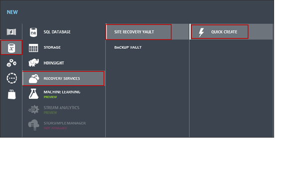
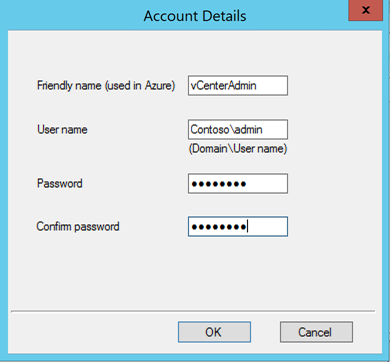

<properties
    pageTitle="VMware virtuellen Computern und physischen Servern Replikation auf Azure mit Azure Website Wiederherstellung (Legacy) | Microsoft Azure" 
    description="Beschreibt, wie Sie lokalen virtuellen Computern repliziert und Windows/Linux physische Servern in Azure verwenden Azure Website Wiederherstellung in einer älteren Bereitstellung im klassischen Portal." 
    services="site-recovery"
    documentationCenter=""
    authors="rayne-wiselman"
    manager="jwhit"
    editor=""/>

<tags
    ms.service="site-recovery"
    ms.workload="backup-recovery"
    ms.tgt_pltfrm="na"
    ms.devlang="na"
    ms.topic="article"
    ms.date="09/29/2016"
    ms.author="raynew"/>

# VMware virtuellen Computern und physischen Servern Replikation auf Azure mit Azure Website Wiederherstellung über das klassische-Portal (ältere Versionen)

> [AZURE.SELECTOR]
- [Azure-Portal](site-recovery-vmware-to-azure.md)
- [Klassische-Portal](site-recovery-vmware-to-azure-classic.md)
- [Klassische-Portal (ältere Versionen)](site-recovery-vmware-to-azure-classic-legacy.md)

Willkommen bei Azure Website Wiederherstellung! Dieser Artikel beschreibt eine ältere Bereitstellung von lokalen VMware virtuellen Computern oder Windows/Linux physischen Servern auf Azure mithilfe des Azure Website Wiederherstellung in der klassischen Portal repliziert.

## (Übersicht)

Organisationen benötigen eine BCDR Strategie, die bestimmt, wie apps, Auslastung und Daten bleiben während der geplanten und ungeplanten Ausfallzeiten ausgeführt werden und verfügbar, und zum normalen Arbeit Umständen so früh wie möglich wiederherzustellen. Strategische BCDR sollten Geschäftsdaten beibehalten, sicherer und wiederhergestellt, und vergewissern Sie sich Auslastung kontinuierlich verfügbar bleiben, wenn bei Datenverlusten.

Website Wiederherstellung ist eine Azure-Dienst, der zur strategische BCDR beiträgt, durch die Replikation von physische Server lokal und in der Cloud (Azure) oder in einem sekundären Datencenter-virtuellen Computern orchestriert. Treten Ausfall in gewohnten Standort befinden, fehl Sie über den zweiten Standort zum Aktualisieren von apps und Auslastung zur Verfügung. Sie fehl zurück zur gewohnten Standort befinden, wenn sie normale Vorgänge zurückgibt. Erfahren Sie mehr in [Neuigkeiten Azure Website Wiederherstellung?](site-recovery-overview.md)

>[AZURE.WARNING] Dieser Artikel enthält **Anweisungen älterer Versionen**. Verwenden Sie nicht für die Bereitstellung neuer. In diesem Fall [Anweisungen](site-recovery-vmware-to-azure.md) bereitzustellende Website Wiederherstellung Azure-Portal oder [Gehen Sie folgendermaßen vor](site-recovery-vmware-to-azure-classic.md) , um die erweiterte Bereitstellung im klassischen Portal zu konfigurieren. Wenn Sie bereits mithilfe der Methode, die in diesem Artikel beschriebenen bereitgestellt haben, empfehlen wir, dass Sie mit der erweiterten Bereitstellung im klassischen Portal migrieren.

## Migrieren von mit erweiterten-Bereitstellung

In diesem Abschnitt ist nur relevant, wenn Sie bereits Website Wiederherstellung anhand der Anweisungen in diesem Artikel bereitgestellt haben.

Eine vorhandene Bereitstellung migrieren zu benötigen:

1. Bereitstellen von neuen Website Wiederherstellung Komponenten in Ihrer lokalen Website.
2. Konfigurieren der Anmeldeinformationen für die automatische Erkennung von VMware virtuellen Computern auf dem neuen Konfigurationsserver.
3. Ermitteln Sie die VMware-Server mit dem neuen Konfigurationsserver.
3. Erstellen einer neuen Gruppe "Schutz" mit dem neuen Konfigurationsserver.

Bevor Sie beginnen:

- Es empfiehlt sich, dass Sie ein Wartungsfenster für die Migration eingerichtet.
- Die **Autos migrieren** Option ist nur verfügbar, wenn Sie vorhandene Schutzgruppen haben, die während einer Bereitstellung älterer Versionen erstellt wurden.
- Nachdem Sie die Migrationsschritte abgeschlossen haben, kann es 15 Minuten dauern oder mehr aktualisieren, die Anmeldeinformationen, und ermitteln und virtuellen Computern aktualisieren, damit Sie sie zu einer Schutzgruppe hinzufügen können. Sie können anstatt zu warten manuell aktualisieren. 

Migrieren von wie folgt:

1. Weitere Informationen zum [erweiterten Bereitstellung im klassischen Portal](site-recovery-vmware-to-azure-classic.md#enhanced-deployment). Überprüfen Sie die erweiterten [Architektur](site-recovery-vmware-to-azure-classic.md#scenario-architecture)und [erforderliche Komponenten](site-recovery-vmware-to-azure-classic.md#before-you-start-deployment).
2. Deinstallieren Sie den Dienst Mobilität aus Computern, die Sie zurzeit repliziert sind. Wenn Sie die neue Gruppe "Schutz" hinzufügen, wird eine neue Version des Diensts auf den Computern installiert.
3. Herunterladen einer [Tresor Registrierungsschlüssel](site-recovery-vmware-to-azure-classic.md#step-4-download-a-vault-registration-key) und [den einheitlichen Setup-Assistenten ausführen](site-recovery-vmware-to-azure-classic.md#step-5-install-the-management-server) , die Konfigurationsserver, Prozessserver und master Ziel-Server-Komponenten zu installieren. Weitere Informationen zum [Planen der Kapazität](site-recovery-vmware-to-azure-classic.md#capacity-planning).
4. [Einrichten von Anmeldeinformationen](site-recovery-vmware-to-azure-classic.md#step-6-set-up-credentials-for-the-vcenter-server) dieser Website Wiederherstellung können Zugriff auf VMware Server um VMware virtuellen Computern automatisch ermitteln. Informationen Sie zu [erforderlichen Berechtigungen](site-recovery-vmware-to-azure-classic.md#vmware-permissions-for-vcenter-access).
5. [VCenter Servern oder vSphere Hosts](site-recovery-vmware-to-azure-classic.md#step-7-add-vcenter-servers-and-esxi-hosts)hinzufügen. Es dauert 15 Minuten, damit weitere für Server im Portal Wiederherstellung der Website angezeigt werden.
6. Erstellen einer [neuen Gruppe "Schutz"](site-recovery-vmware-to-azure-classic.md#step-8-create-a-protection-group). Es kann bis zu 15 Minuten dauern für das Portal zu aktualisieren, damit die virtuellen Computer erkannt werden und angezeigt. Wenn Sie nicht warten möchten können, markieren Sie den Servernamen Management (nicht klicken Sie darauf) > **Aktualisieren**.
7. Klicken Sie unter der neuen Gruppe "Schutz" auf **Computern migrieren**.

    

8. Wählen Sie virtuellen **Wählen Sie** aus der Gruppe "Schutz", die Sie migrieren möchten, und die Computer, die Sie migrieren möchten.

    

9. **Konfigurieren von Einstellungen** geben an, ob Sie verwenden möchten, verwenden Sie die gleichen Einstellungen für alle Computer, und wählen Sie den Prozessserver und Azure-Speicher-Konto. Wenn Sie einen separaten Prozessserver besitzen werden dadurch die die IP-Adresse des Servers Server Konfiguration.

    

    > [AZURE.NOTE] [Migration von Speicherkonten](../resource-group-move-resources.md) zwischen Ressourcengruppen innerhalb des gleichen Abonnements oder übergreifend Abonnements wird Speicherkonten für die Bereitstellung von Website-Wiederherstellung nicht unterstützt.

10. Wählen Sie in **Konten angeben**das Konto, dass Sie für den Prozess-Server auf den Computer, um die neue Version des Diensts Mobilität Pushbenachrichtigungen zugreifen erstellt haben.

    

11. Website Wiederherstellung Migrieren der replizierten Daten mit dem Konto Azure-Speicher, die Sie zur Verfügung gestellt. Optional können Sie das Speicherkonto wiederverwenden, die, das Sie in der legacy-Bereitstellung verwendet.
12. Nachdem Sie der Auftrag endet werden virtuellen Computern automatisch synchronisiert. Nach Abschluss der Synchronisierung können Sie die virtuellen Computer aus der Schutzgruppe älterer Versionen löschen.
13. Nachdem alle Computer migriert haben, können Sie die Schutzgruppe legacy löschen.
14. Denken Sie daran, die Failover Eigenschaften für Computer und den Azure Netzwerkeinstellungen angeben, nach Abschluss der Synchronisierung.
15. Wenn Sie vorhandene Pläne, die Wiederherstellung verfügen, können Sie sie mit der erweiterten Bereitstellung die Option **Planen der Wiederherstellung migrieren** migrieren. Sie sollten dies nur tun, nachdem Sie alle geschützten Computer migriert wurden. 

    

>[AZURE.NOTE] Nachdem Sie die Migration abschließen im [erweiterten Artikel](site-recovery-vmware-to-azure-classic.md)fort. Im weiteren Verlauf dieses Artikels älterer Versionen werden nicht mehr relevant, und Sie brauchen keine weiteren im It ** beschriebenen Schritte folgen.

## Was muss ich?

Dieses Diagramm zeigt die Bereitstellung Komponenten.

Hier ist, was Sie benötigen:

**Komponente** | **Bereitstellung** | **Details**
--- | --- | ---
**Konfigurationsserver** | Ein Azure standard A3-virtuellen Computern im selben Abonnement als Website Wiederherstellung. | Die Konfiguration Server Koordinaten Kommunikation zwischen geschützten Maschinen, Prozessserver und master Zielservern in Azure. Er legt von Replikation und Koordinaten Wiederherstellung in Azure, wenn ausgeführt wird.
**Master Ziel-server** | Ein Azure-virtuellen Computern – entweder ein WindowsServer basierend auf einem Windows Server 2012 R2 Katalog Bild (Windows-Computer schützen) oder als Linux Server auf Grundlage einer OpenLogic CentOS 6.6 Katalog Bild (Linux-Computern schützen möchten).   Drei Ziehpunkte Optionen stehen – Standard A4, Standard D14 und Standard DS4.   Der Server ist mit dem gleichen Azure Netzwerk wie der Konfigurationsserver verbunden.   Einrichten der Website Wiederherstellung-Portal | Empfängt und behält replizierte Daten aus der geschützten Computern mit angefügten virtuellen Festplatten auf Blob-Speicher in Ihr Konto Azure-Speicher erstellt.   Wählen Sie Standard DS4 speziell für das Konfigurieren des Schutzes für Auslastung mit Anforderung der konsistent hohe Leistung und niedrige Wartezeit mit Premium-Speicher-Konto an.
**Prozessserver** | Einem lokalen virtuellen oder physischen Server unter Windows Server 2012 R2   Es empfiehlt sich, wird auf dem gleichen Netzwerk und LAN-Segment wie die Computer, die Sie schützen möchten platziert, aber ausführen können in einem anderen Netzwerk solange geschützte Computern L3 Netzwerk Sichtbarkeit zu haben.   Sie es eingerichtet und auf dem Konfigurationsserver der Website Wiederherstellung-Portal zu registrieren. | Geschützte Computern senden Replikationsdaten auf dem lokalen Prozess-Server. Es hat einen Datenträger-basierte zwischenzuspeichern Replikation-Daten, die sie empfängt. Es führt eine Reihe von Aktionen für die Daten aus.   Daten werden durch das Zwischenspeichern, komprimieren und Verschlüsseln sie vor dem Senden an den Zielserver master optimiert.   Ganzer Pushbenachrichtigungen Installation des Diensts Mobilität.   Automatische Erkennung von VMware virtuellen Computern durchgeführt.
**Lokalen Computer** | Lokale VMware virtuellen Computern oder physische Server mit Windows oder Linux. | Sie konfigurieren die Replikation Einstellungen, die einen oder mehrere Computer anwenden. Sie können über eine einzelne Computer oder die am häufigsten, mehreren Computern fehl, die Sie zusammen in einen Wiederherstellungsplan sammeln. 
**Mobilität-Dienst** | Klicken Sie auf jedes virtuellen Computers oder physischen Server, die Sie schützen möchten installiert   Können manuell installiert oder abgelegt und installiert werden automatisch nach den Prozess-Server Wenn Sie die Replikation für einen Computer aktivieren. | Der Dienst Mobilität sendet Daten auf dem Prozessserver während der ersten Replikation (synchronisieren). Nachdem der Computer in einem geschützten Zustand ist (nach synchronisieren endet) wird der Mobilität-Dienst schreibt auf dem Datenträger in-Memory erfasst und an den Prozess-Server gesendet werden. Applicationconsistency für Windows-Server erfolgt mithilfe von VSS.
**Azure Website Wiederherstellung Tresor** | Erstellen einer Website Wiederherstellung Tresor mit einem Azure-Abonnement und Servern im Tresor registrieren. | Der Tresor koordiniert und koordiniert Datenreplikation, Failover und Wiederherstellung zwischen Ihrem lokalen Standort und Azure.
**Replikationsmechanismus** | **Über das Internet**– kommuniziert und repliziert Daten von geschützten lokalen Servern in Azure mit sicherer SSL/TLS-Kanal über das Internet. Dies ist die Standardoption.   **VPN/ExpressRoute**– kommuniziert und repliziert Daten zwischen lokalen Servern und Azure über ein VPN-Verbindung. Sie müssen ein Standort-zu-Standort VPN oder eine ExpressRoute Verbindung zwischen Ihrem lokalen Standort und Azure einrichten.   Sie können auswählen, wie während der Bereitstellung der Website Wiederherstellung repliziert werden soll. Sie können das Verfahren nicht ändern, nachdem er konfiguriert ist, ohne dass die Replikation der vorhandenen Computer beeinträchtigt. | Da keine der Optionen müssen Sie alle eingehenden Netzwerk-Ports auf geschützten Computern zu öffnen. Alle Netzwerkkommunikation wird von der lokalen Website initiiert. 

## Planen der Kapazität

Die wichtigsten Bereiche, die Sie berücksichtigen müssen:

- **Quelle Umgebung**– das VMware Infrastruktur, computereinstellungen Quelle und Anforderungen.
- **Inhaltverarbeitungskomponenten-Servern**– der Prozessserver, Konfigurationsserver und master Ziel-Server 

### Überlegungen für die Quelle-Umgebung

- **Maximalgröße des Datenträger**– die aktuelle maximale Größe des Datenträgers, die einen virtuellen Computer angefügt werden kann, wird 1 TB. Daher beträgt die maximale Größe eines Datenträgers Quelle, die repliziert werden, kann auch 1 TB.
- **Maximalgröße pro Quelle**– die maximale Größe eines einzelnen Quellcomputers ist 31 TB (mit 31 Datenträger) und mit einem D14 Instanz nach der Bereitstellung für die Gestaltungsvorlage Ziel-Server. 
- **Anzahl der Quellen pro master Ziel-Server**– mehrere Quelle Computer mit einem einzigen master Ziel-Server geschützt werden können. Jedoch kann kein einzelnen Quellcomputer auf mehrere master Zielserver geschützt werden, da als Festplatten repliziert, eine virtuelle Festplatte, die die Größe des Datenträgers spiegelt Azure Blob-Speicher erstellt wird und als einen Datenträger auf dem Zielserver master angefügt.  
- **Maximale täglich Änderung Kostensätze pro Quelle**– es gibt drei Faktoren, die bei der empfohlenen ändern Zinssatz pro Quelle in Betracht ziehen berücksichtigt werden müssen. Zwei IOPS sind für die Aspekte Ziel basierend auf dem Zieldatenträger für jeden Vorgang auf die Datenquelle erforderlich. Dies ist, da beim Lesen von alten Daten und einen Schreibvorgang für die neuen Daten auf dem Zieldatenträger erfolgen werden. 
    - **Täglich ändern (Disagio) unterstützt werden, indem Sie den Prozess-Server**– ein Quellcomputer kann nicht mehrere Prozess-Server umfassen. Ein einzelner Prozess-Server kann bis zu 1 TB pro Tag ändern unterstützen. Daher ist 1 TB an, dass die maximalen täglichen Daten Zins für einen Quellcomputer unterstützt ändern. 
    - **Maximale Durchsatz von der Zieldatenträger unterstützt**– Maximum Änderung pro Quelldatenträger kann nicht mehr als 144 GB pro Tag (mit 8 K Schreibgröße) sein. Finden Sie in der Tabelle im Zielabschnitt master für das Durchsatz und IOPs des Ziels für verschiedener Größen schreiben. Diese Nummer muss mit zwei geteilt werden, weil jeder Quelle IOP 2 IOPS auf dem Zieldatenträger generiert. Informationen Sie zu [Azure Skalierbarkeit und Leistung Ziele](../storage/storage-scalability-targets.md#scalability-targets-for-premium-storage-accounts) ein, wenn das Ziel für Premium Speicherkonten konfigurieren.
    - **Maximale Durchsatz durch das Speicherkonto unterstützt**– eine Quelle kann nicht mehrere Speicherkonten umfassen. Ausgehend, dass ein Speicher berücksichtigt bis zu 20.000 Abfragen pro Sekunde, und jeder Quelle IOP 2 IOPS auf dem Zielserver master generiert, empfehlen wir, dass Sie die Anzahl der IOPS über die Quelle 10.000 beibehalten. Erfahren Sie, wenn die Quelle für Premium Speicherkonten konfigurieren [Azure Skalierbarkeit und Leistung Ziele](../storage/storage-scalability-targets.md#scalability-targets-for-premium-storage-accounts) aus.

### Aspekte für inhaltverarbeitungskomponenten-Servern

Tabelle 1 enthält eine Übersicht über die virtuellen Computern Größen für das Konfigurieren und master Zielservern.

**Komponente** | **Bereitgestellte Azure Instanzen** | **Kerne** | **Arbeitsspeicher** | **Max-Datenträger** | **Größe des Datenträger**
--- | --- | --- | --- | --- | ---
Konfigurationsserver | Standard-A3 | 4 | 7 GB | 8 | 1023 GB
Master Ziel-server | Standard A4 | 8 | 14 GB | 16 | 1023 GB
 | Standard D14 | 16 | 112 GB | 32 | 1023 GB
 | Standard-DS4 | 8 | 28 GB | 16 | 1023 GB

**Tabelle 1**

#### Prozess-Server-Aspekte

Im Allgemeinen hängt Prozess Server Ziehpunkts tägliche Änderungsrate über alle geschützten Auslastung.

- Sie benötigen ausreichende berechnen für Aufgaben wie Inline-Komprimierung und Verschlüsselung.
- Prozess-Server verwendet Datenträger-basiertes Cache. Vergewissern Sie sich den Abstand empfohlene Cache und Datenträgerdurchsatz steht im Falle einer Netzwerkengpass oder einem Dienstausfall gespeicherten Daten Änderungen zu erleichtern. 
- Stellen Sie sicher ausreichende Bandbreite damit der Prozess-Server die Daten auf dem Zielserver master zu kontinuierlichen Datenschutz bieten hochladen kann. 

Tabelle 2 enthält eine Übersicht über den Prozess-Server-Richtlinien.

**Ändern von Daten Zins** | **CPU** | **Arbeitsspeicher** | **Datenträger Cachegröße**| **Datenträgerdurchsatz Cache** | **Bandbreite eingehende/Ausgang**
--- | --- | --- | --- | --- | ---
< 300 GB | 4 vCPUs (Sockets 2 * 2 Kernen @ 2,5 GHz) | 4 GB | 600 GB | 7 bis 10 MB pro Sekunde | 30/s/21/s
300 bis 600 GB | 8 vCPUs (Sockets 2 * 4 Kernen @ 2,5 GHz) | 6 GB | 600 GB | 11 bis 15 MB pro Sekunde | 60/s/42/s
600 GB zu 1 TB | 12 vCPUs (2 Sockets * 6 Kerne @ 2,5 GHz) | 8 GB | 600 GB | 16 bis 20 MB pro Sekunde | 100 MB/s/70/s
> 1 TB | Bereitstellen von einem anderen Prozessserver | | | | 

**Tabelle 2**

Wobei Folgendes gilt: 

- Eingehende ist Download Bandbreite (Intranet zwischen dem Quell- und Prozess-Server).
- Ausgang ist Bandbreite zum Hochladen (Internet zwischen den Prozess Servers und einer Gestaltungsvorlage Ziel). Ausgang Zahlen davon Mittelwert 30 %-Prozess Server Komprimierung aus.
- Datenträger eine separate OS Festplatte der minimalen 128 GB empfiehlt sich für den Cache für alle Prozess-Server.
- Der folgende Speicher wurde für Datenträgerdurchsatz Cache für Benchmarks verwendet: 8 SAS-Laufwerke von 10 Min. mit RAID 10-Konfiguration.

#### Konfiguration Server Aspekte

Jede Konfigurationsserver kann bis zu 100 Quelle Autos mit 3 und 4 Datenmengen unterstützen. Wenn Ihre Bereitstellung größer wird empfohlen, dass Sie eine andere Konfigurationsserver bereitstellen. Die virtuellen Computern Standardeigenschaften des Servers Konfiguration finden Sie unter Tabelle 1. 

#### Master Ziel Server- und Konto Aspekte

Die Speicherung für jeden master Zielserver umfasst eine OS Datenträger, einen Datenträger Aufbewahrung und Daten Datenträger. Das Laufwerk Aufbewahrung verwaltet die Erfassung von Datenträger Änderungen für die Dauer des Fensters Aufbewahrung im Portal Website Wiederherstellung definiert.  Die virtuellen Computereigenschaften des Zielservers master finden Sie in Tabelle 1. Tabelle 3 zeigt, wie die Datenträger von A4 verwendet werden.

**Instanz** | **OS Datenträger** | **Aufbewahrungsrichtlinien** | **Daten Datenträger**
--- | --- | --- | ---
 | | **Aufbewahrungsrichtlinien** | **Daten Datenträger**
Standard-A4 | 1 Datenträger (1 * 1023 GB) | 1 Datenträger (1 * 1023 GB) | 15 Festplatten (15 * 1023 GB)
Standard D14 |  1 Datenträger (1 * 1023 GB) | 1 Datenträger (1 * 1023 GB) | 31 Datenträger (15 * 1023 GB)
Standard-DS4 |  1 Datenträger (1 * 1023 GB) | 1 Datenträger (1 * 1023 GB) | 15 Festplatten (15 * 1023 GB)

**Tabelle 3**

Kapazität, Planung mit dem Ziel master-Server abhängig:

- Azure-Speicher Leistung und Einschränkungen
    - Die maximale Anzahl von hochgradig Datenträger für einen Standard in virtuellen Computer genutzt, etwa 40 (20.000/500 IOPS pro Datenträger) in einem einzigen Speicher-Konto ist. Weitere Informationen Sie zu [Skalierbarkeit Ziele für standard-Speicher Sccounts](../storage/storage-scalability-targets.md#scalability-targets-for-standard-storage-accounts) und für [Premium Speicher Sccounts](../storage/storage-scalability-targets.md#scalability-targets-for-premium-storage-accounts).
-   Pro Tag ändern 
-   Volumen-Speicher Aufbewahrungsrichtlinien.

Beachten Sie Folgendes:

- Eine Datenquelle kann nicht mehrere Speicherkonten umfassen. Dies gilt für die Daten-Datenträger, der wechseln Sie zu der Speicherkonten ausgewählt, wenn Sie den Schutz konfigurieren. Das Betriebssystem und die Aufbewahrung Datenträger in der Regel wechseln Sie zu dem Speicherkonto automatisch bereitgestellten.
- Dem Aufbewahrungsrichtlinien Speicher Volumen hängt davon ab, pro den Tag ändern und die Anzahl der Tage der Aufbewahrungsrichtlinien. Die Aufbewahrung Speicherplatz pro master Ziel-Server erforderlich Änderung gesamt aus Quelle pro Tag = * Anzahl der Tage der Aufbewahrungsrichtlinien. 
- Jedem master Server hat nur eine Aufbewahrung Lautstärke. Die Lautstärke Aufbewahrung wird über die mit dem Ziel master-Server verbundenen Datenträger freigegeben. Beispiel:
    - Wenn es ein Quellcomputer mit 5 Festplatten und auf jedem Datenträger 120 IOPS (8K Größe) auf die Datenquelle generiert, bedeutet dies 240 IOPS pro Datenträger (2 Vorgänge auf dem Zieldatenträger pro Quelle EA). 240 IOPS befindet sich innerhalb der Azure pro Datenträger IOPS maximal 500.
    - Auf dem Datenträger Aufbewahrungsrichtlinien, wird dies 120 * 5 = 600 IOPS und dies eine Ringnut Flaschen machen können. In diesem Szenario wäre eine gute Möglichkeit, die Lautstärke Aufbewahrung weitere Festplatten hinzu, und es über, als RAID Streifen Konfiguration umfassen. Dies wird Leistung verbessern, da die IOPS über mehrere Laufwerke verteilt sind. Die Anzahl der Laufwerke der Aufbewahrungsrichtlinien Lautstärke hinzugefügt werden, werden wie folgt:
        - Gesamte IOPS aus der Quelle Umgebung / 500
        - Änderung gesamt pro Tag aus der Quelle-Umgebung (nicht komprimiert) / 287 GB. 287 GB ist die maximalen Durchsatz von einem Zieldatenträger pro Tag unterstützt. Diese Metrik wird die Schreibgröße mit einem Faktor von 8 K, je nach, da in diesem Fall K 8 es davon ausgegangen, dass Schreibgröße ist. Ist die Schreibgröße 4 KB sein Durchsatz beispielsweise 287/2. Und die Schreibgröße 16 KB ist dann Durchsatz 287 * 2.
- Die Anzahl der erforderlichen Speicherkonten = Summe Quelle IOPs/10000.

## Bevor Sie beginnen

**Komponente** | **Anforderungen** | **Details**
--- | --- | --- 
**Azure-Konto** | Benötigen Sie ein [Microsoft Azure](https://azure.microsoft.com/) -Konto ein. Sie können mit einer [kostenlosen Testversion](https://azure.microsoft.com/pricing/free-trial/)beginnen.
**Azure-Speicher** | Benötigen Sie ein Konto Azure-Speicher replizierte Daten gespeichert   Entweder das Konto sollte ein [Standardkonto Geo redundante Speicher](../storage/storage-redundancy.md#geo-redundant-storage) oder [Premium Speicher-Konto](../storage/storage-premium-storage.md)an.   Sie müssen in der gleichen Region wie der Dienst Azure Website Wiederherstellung, und mit dem gleichen Abonnement verknüpft werden. Verschieben von Speicherkonten erstellt die [neue Azure-Portal](../storage/storage-create-storage-account.md) zwischen Ressourcengruppen wird nicht unterstützt.   Weitere Informationen lesen [Einführung in Microsoft Azure-Speicher](../storage/storage-introduction.md)
**Azure virtuelles Netzwerk** | Sie benötigen ein Azure-virtuelles Netzwerk, auf dem die Konfiguration Servers und einer Gestaltungsvorlage Ziel bereitgestellt werden. Sie sollten in der gleichen Abonnement und Region als der Azure-Website Wiederherstellung Tresor. Wunsch Replikation von Daten über eine ExpressRoute oder VPN-Verbindung muss das Azure virtuelle Netzwerk über eine ExpressRoute oder eine Website-zu-Standort VPN-Verbindung mit Ihrem lokalen Netzwerk verbunden sein.
**Azure-Ressourcen** | Stellen Sie sicher, dass Sie genügend Azure Ressourcen für alle Komponenten bereitgestellt haben. Lesen Sie weitere in [Azure Abonnement Grenzwerte](../azure-subscription-service-limits.md).
**Azure-virtuellen Computern** | Virtuellen Computern, die Sie schützen möchten, sollte mit [Azure erforderliche Komponenten](site-recovery-best-practices.md)entsprechen.   **Anzahl der Datenträger**– bis 31 Datenträger kann auf einem einzelnen geschützten Server unterstützt werden   **Datenträgergrößen**– einzelne Speicherkapazität dürfen nicht mehr als 1023 GB entsprechen   **Cluster**– gruppierte Servern werden nicht unterstützt.   **Boot**– Unified Extensible Firmware Interface (UEFI) / Extensible Firmware Interface(EFI) Boot nicht unterstützt.   **Datenmengen**– Bitlocker verschlüsselte Datenmengen werden nicht unterstützt.   **Die Namen der Server**– Namen sollten zwischen 1 und 63 Zeichen (Buchstaben, Zahlen und Bindestriche) enthalten. Der Name muss mit einem Buchstaben oder einer Zahl beginnen und enden mit einen Buchstaben oder eine Zahl. Nach ein Computer geschützt ist, können Sie den Namen der Azure ändern.
**Konfigurationsserver** | Standard A3 virtuellen Computern basierend auf ein Azure Website Wiederherstellung Windows Server 2012 R2 Gallery-Bild wird in Ihrem Abonnement für den Konfigurationsserver erstellt. Es wird als die erste Instanz in einer neuen Cloud-Dienst erstellt. Wenn Sie Public Internet auswählen, wie die Verbindungstyp für den Konfigurationsserver Cloud-Dienst eine reservierte öffentliche IP-Adresse erstellt wird.   Der Pfad zum nur englische Zeichen hinzugefügt werden.
**Master Ziel-server** | Azure-virtuellen Computern, standard A4, D14 oder DS4.   Der Pfad zum nur englische Zeichen hinzugefügt werden. Beispielsweise sollten der Pfad **/usr/local/ASR** bei master Ziel-Servern unter Linux.
**Prozessserver** | Sie können den Prozess-Server auf physischen oder virtuellen Computern unter Windows Server 2012 R2 mit den neuesten Updates bereitstellen. Installieren auf C: /.   Es empfiehlt sich, dass Sie den Server auf dem gleichen Netzwerk und Subnetz wie die Computer platzieren, die Sie schützen möchten.   Installieren von VMware vSphere CLI 5.5.0 auf den Prozess-Server. Die VMware vSphere CLI Komponente ist auf dem Prozessserver erforderlich, um virtuellen Computern, die von einem Server vCenter verwaltet oder virtuellen Computern eine ESXi Host ermitteln.   Der Pfad zum nur englische Zeichen hinzugefügt werden.   Verweise Dateisystem wird nicht unterstützt.
**VMware** | Verwalten Ihrer VMware vSphere Hypervisoren VMware vCenter Server. Es sollte vCenter Version 5.1 oder 5.5 mit den neuesten Updates ausgeführt werden.   Eine oder mehrere vSphere Hypervisoren mit VMware virtuellen Computern, die Sie schützen möchten. Der Hypervisor sollte mit den neuesten Updates für ESX/ESXi Version 5.1 oder 5.5 ausgeführt werden.   Virtuelle VMware-Computer sollte VMware Tools installiert sein und ausgeführt haben. 
**Windows-Computer** | Geschützten physischen Servern oder VMware virtuellen Computern unter Windows müssen eine Reihe von Anforderungen an.   A unterstützt 64-Bit-Betriebssystem: **Windows Server 2012 R2**, **Windows Server 2012**, oder **Windows Server 2008 R2 mit am minimalen SP1**.   Hostname, Bereitstellungspunkte, Gerätenamen, Windows-Systempfad (z. B.: C:\Windows) nur auf Englisch verfügbar sein sollte.   Auf Laufwerk C:\ sollte das Betriebssystem installiert werden.   Nur grundlegende Datenträger werden unterstützt. Dynamische Datenträger werden nicht unterstützt.   Firewall-Regeln auf geschützten Computern sollte ermöglicht es ihnen, die Konfiguration und Master-Server in Azure.p Ziel erreichen >
Sie müssen ein Administratorkonto bereitstellen (muss ein lokaler Administrator auf dem Windows-Computer) zu Pushbenachrichtigungen Installieren der Mobilität Dienst auf Windows-Servern. Das bereitgestellte Konto ist ein Konto nicht Domäne müssen Sie Remote des Benutzerzugriffs Steuerelement auf dem lokalen Computer zu deaktivieren. Hinzufügen den LocalAccountTokenFilterPolicy DWORD-Registrierungseintrag mit dem Wert 1 unter HKEY_LOCAL_MACHINE\SOFTWARE\Microsoft\Windows\CurrentVersion\Policies\System. Um den Registrierungseintrag aus einem geöffneten Cmd CLI oder Powershell hinzufügen, und geben Sie **`REG ADD HKEY_LOCAL_MACHINE\SOFTWARE\Microsoft\Windows\CurrentVersion\Policies\System /v LocalAccountTokenFilterPolicy /t REG_DWORD /d 1`**. [Weitere](https://msdn.microsoft.com/library/aa826699.aspx) Informationen zu Access-Steuerelement.   Nach Failover Wenn soll eine Verbindung mit Windows-virtuellen Computern in Azure mit Remotedesktop stellen Sie sicher, dass Remotedesktop für den lokalen Computer aktiviert ist. Wenn Sie nicht über VPN herstellen, sollten Firewall-Regeln Remote Desktop-Verbindungen über das Internet zulässt.
**Linux-Computern** | Eine unterstützte 64-Bit-Betriebssystem: **Centos 6.4, 6.5, 6.6**; **Oracle Enterprise Linux 6.4, 6.5 unter der Red Hat kompatibel Kernel oder Enterprise Kernel unverwüstliche Release 3 (UEK3)**, **SUSE Linux Enterprise Server 11 SP3**.   Firewall-Regeln auf geschützten Computern sollten sie die Konfiguration und master Zielservern in Azure erreichen zulassen.   / etc/hosts-Dateien auf geschützten Computern sollte Einträge enthalten, die alle NICs zugeordneten IP-Adressen den lokale Hostname zuordnen    Verbindung mit einer Azure-virtuellen Computern Linux nach System durch Verwendung eines Secure Shell-Clients (ssh) ausgeführt werden soll, stellen Sie sicher, dass der Secure Shell-Dienst auf dem geschützten Computer festgelegt ist, um bei Systemstart automatisch starten und Firewall-Regeln zulassen einer ssh Verbindung dazu.   Der Hostname, Bereitstellungspunkte, Gerät, und Linux Systempfade und Dateinamen (z.B./usw. /; / usr) sollte nur auf Englisch verfügbar sein.   Schutz für lokalen Computer mit den folgenden Speicher aktiviert werden kann:- Dateisystem: EXT3, ETX4, ReiserFS XFS Mehrere Pfade Software-Gerät Mapper (mehrere Pfade) Volumen-Manager: LVM2 Physische Server mit HP CCISS Controller Speicher werden nicht unterstützt.
**Von Drittanbietern** | Einige Komponenten Bereitstellung in diesem Szenario abhängig von Drittanbieter-Software ordnungsgemäß funktioniert. Eine vollständige Liste finden Sie unter [Software Drittanbietern und Informationen](#third-party)

### Netzwerkkonnektivität

Beim Konfigurieren der Netzwerkkonnektivität zwischen der lokalen Website und das Azure virtuelle Netzwerk, auf dem die Infrastrukturkomponenten (Konfigurationsserver, master Zielservern) bereitgestellt werden, stehen Ihnen zwei Optionen zur Verfügung. Sie müssen entscheiden, welche Network Connectivity Option zu verwenden, bevor Sie Ihre Konfigurationsserver bereitstellen können. Sie müssen diese Einstellung zum Zeitpunkt der Bereitstellung auswählen. Es kann später geändert werden.

**Internet:** Kommunikation und Replikation von Daten zwischen den lokalen-Servern (Prozessserver, geschützten Computer) und Azure Infrastruktur inhaltverarbeitungskomponenten-Servern (Konfigurationsserver, master Ziel-Server) über eine sichere Verbindung SSL/TLS aus lokalen an die Endpunkte öffentlichen geschieht, klicken Sie auf den gewünschten Servern Konfiguration und Master-Shape. (Die einzige Ausnahme ist die Verbindung zwischen den Prozess-Server und auf dem Folienmaster Zielserver TCP-Port 9080 unverschlüsselter ist. Nur Steuerelementinformationen in Bezug auf das Replikationsprotokoll für Replikations-Setup wird auf diese Verbindung austauschen.)

**VPN**: Kommunikation und Replikation von Daten zwischen den lokalen-Servern (Prozessserver, geschützten Computer) und Azure Infrastruktur inhaltverarbeitungskomponenten-Servern (Konfigurationsserver, master Ziel-Server) geschieht über ein VPN-Verbindung zwischen Ihrem lokalen und Azure virtuelle Netzwerk auf dem die Konfigurationsserver und master Zielservern bereitgestellt werden. Stellen Sie sicher, dass es sich bei Ihrem lokalen Netzwerk durch eine ExpressRoute oder eine Website-zu-Standort VPN-Verbindung mit dem Azure-virtuellen-Netzwerk verbunden ist.

## Schritt 1: Erstellen einer Tresor

1. Melden Sie sich bei dem [Verwaltungsportal](https://portal.azure.com).

2. Erweitern Sie **Data Services** > **Wiederherstellung Services** , und klicken Sie auf **Website Wiederherstellung Tresor**.

3. Klicken Sie auf **neu erstellen** > **schnell zu erstellen**.

4. Geben Sie im Feld **Name**einen Anzeigenamen ein, um den Tresor zu identifizieren.

5. Wählen Sie in der **Region**das geografische Region für den Tresor ein. Zum Überprüfen der unterstützte Regionen finden Sie unter geografischen Verfügbarkeit in [Azure Website Wiederherstellung Preise-Details](https://azure.microsoft.com/pricing/details/site-recovery/)

6. Klicken Sie auf **Erstellen Tresor**.

    

Überprüfen Sie die Statusleiste, um zu bestätigen, dass der Tresor erfolgreich erstellt wurde. Der Tresor werden auf der **Wiederherstellung Services** -Hauptseite als **aktiv** aufgelistet.

## Schritt 2: Bereitstellen eines Servers Konfiguration

### Konfigurieren der servereinstellungen

1. Klicken Sie auf den Tresor, um die Seite Schnellstart öffnen, auf der Seite **Wiederherstellung Services** . Schnellstart kann auch jederzeit auf das Symbol geöffnet werden.

    

2. Wählen Sie in der Dropdown-Liste **zwischen einer lokalen Website mit VMware/physische Servers und Azure**.
3. **Vorbereiten der Target(Azure) Ressourcen** klicken auf **Konfigurationsserver bereitstellen**.

    

4. Geben Sie in der **Neuen Konfiguration Server Details** :

    - Einen Namen für die Konfigurationsserver und die Anmeldeinformationen zum Herstellen der Verbindung.
    - In den Typ der Netzwerk-Konnektivität Dropdown-Liste auswählen **Öffentlichen Internet** oder **VPN**. Beachten Sie, dass Sie diese Einstellung, nachdem sie angewendet wird nicht ändern können.
    - Wählen Sie aus dem Azure Netzwerk auf dem Server befinden soll. Wenn Sie die Option VPN erstellen verwenden ist sicher im Netzwerk Azure mit Ihrem lokalen Netzwerk verbunden wie erwartet. 
    - Geben Sie die interne IP-Adresse und Subnetz gehören, die auf dem Server zugewiesen werden. Beachten Sie, dass die ersten vier IP-Adressen in einem beliebigen Subnetz für interne Azure Verwendung reserviert werden. Verwenden Sie eine beliebige andere verfügbare IP-Adresse ein.
    
    

5. Nachdem Sie auf **OK** eines standard A3-virtuellen Computern, basierend auf ein Bild aus der Galerie Azure Website Wiederherstellung Windows Server 2012 R2 werden in Ihrem Abonnement für den Konfigurationsserver erstellt. Es wird als die erste Instanz in einer neuen Cloud-Dienst erstellt. Wenn Sie die Verbindung über das Internet ausgewählt wird Cloud-Dienst mit eine reservierte öffentliche IP-Adresse erstellt. Sie können in der Registerkarte **Aufträge** überwachen.

    

6.  Wenn Sie über das Internet herstellen, wird nach dem Konfigurationsserver bereitgestellten Notiz die öffentliche IP-Adresse auf der Seite **virtuellen Computern** Azure-Portal zugewiesen. Klicken Sie dann zugeordneten auf die **Endpunkte** Registerkarte Notiz den öffentlichen HTTPS-Anschluss private Port 443. Sie benötigen diese Informationen später, wenn Sie den Folienmaster Ziel- und Prozess-Servers mit dem Konfigurationsserver registrieren. Der Konfigurationsserver wird mit folgenden Endpunkten bereitgestellt:

    - HTTPS: Mit einem öffentlicher Port wird verwendet, um die Kommunikation zwischen inhaltverarbeitungskomponenten-Servern und Azure über das Internet koordinieren. Privater Port 443 wird verwendet, um die Kommunikation zwischen inhaltverarbeitungskomponenten-Servern und Azure über VPN koordinieren.
    - Benutzerdefiniert: Mit einem öffentlicher Port wird für Failback Tool Kommunikation über das Internet verwendet. Privater Port 9443 wird für Failback Tool Kommunikation über VPN verwendet.
    - PowerShell: Private Port 5986
    - Remotedesktop: Private Port 3389
    
    

    >[AZURE.WARNING] Nicht löschen oder Ändern der öffentlichen oder privaten Port-Anzahl von beliebigen Endpunkten während der Konfiguration Server Bereitstellung erstellt.

Der Konfigurationsserver wird in einer automatisch erstellten Azure-Cloud-Dienst eine reservierte IP-Adresse bereitgestellt. Reservierte Adresse ist erforderlich, um sicherzustellen, dass die Konfiguration Server Cloud-Dienst-IP-Adresse auch nach einem Neustart der virtuellen Computer (einschließlich des Konfiguration Servers) unverändert bleibt Cloud-Dienst. Die reservierte öffentliche IP-Adresse müssen manuell nicht reserviert sein, wenn die Konfiguration erfüllt ist oder diese reservierte verbleibt. Es ist standardmäßig maximal 20 Reservierte öffentliche IP-Adressen pro Abonnement aus. [Erfahren Sie mehr](../virtual-network/virtual-networks-reserved-private-ip.md) über reservierte IP-Adressen. 

### Die Konfigurationsserver im Tresor registrieren

1. Klicken Sie auf der Seite **Schnellstart** **Vorbereiten Zielressourcen** > **einen Registrierungsschlüssel herunterladen**. Die Datei wird automatisch generiert. Es gilt für 5 Tage, nachdem er generiert wird. Kopieren Sie es auf dem Konfigurationsserver aus.
2. Wählen Sie den Konfigurationsserver aus der Liste virtuellen Computern, virtuellen **** . Öffnen Sie die Registerkarte **Dashboard** und auf **Verbinden**. **Öffnen** der heruntergeladenen Datei RDP zur Anmeldung bei des Verwendung von Remotedesktop Konfiguration Servers. Wenn Sie die Option VPN arbeiten, verwenden Sie die interne IP-Adresse (die Adresse, die Sie angegeben haben, wenn Sie den Konfigurationsserver bereitgestellt) für eine Remotedesktop Verbindung von der lokalen Website. Der Azure-Website Wiederherstellung Server Setup-Assistenten für wird automatisch ausgeführt, wenn Sie zum ersten Mal anmelden.

    

3. Klicken Sie auf **ich stimme** zum Herunterladen und Installieren von MySQL, in **Die Installation der Software von Drittanbietern** .

    

4. Erstellen Sie Details für **MySQL** -Server Anmeldeinformationen zur Anmeldung bei der MySQL-Server-Instanz aus.

    

5. Geben Sie im **Internet Einstellungen** an, wie der Konfigurationsserver eine Verbindung mit dem Internet herstellen. Beachten Sie Folgendes:

    - Wenn Sie einen benutzerdefinierten Proxy verwenden möchten sollten Sie es einrichten, bevor Sie den Anbieter installieren.
    - Wenn Sie auf **Weiter** geklickt wird ein Test ausgeführt, um die Proxy-Verbindung zu überprüfen.
    - Wenn Sie einen benutzerdefinierten Proxy verwende oder Ihr Standard-Proxy-Server erfordert eine Authentifizierung, Sie die Proxy-Details, einschließlich der Adresse, den Port und die Anmeldeinformationen einzugeben müssen.
    - Die folgenden URLs sollten über den Proxy zugegriffen werden:
        - *. hypervrecoverymanager.windowsazure.com
        - *. accesscontrol.windows.net
        - *. backup.windowsazure.com
        - *. blob.core.windows.net
        - *. store.core.windows.net
    - Wenn IP-Adressen basierenden sicherstellen Firewall-Regeln an, dass die Regeln zulassen der Kommunikation vom Konfigurationsserver den IP-Adressen in [Azure Datacenter IP-Bereiche](https://msdn.microsoft.com/library/azure/dn175718.aspx) und HTTPS (443) Protokoll beschriebenen festgelegt sind. Weiß-Liste IP-Bereiche des Azure Region, das Sie verwenden möchten, und der Westen US müssten.

    

6. Geben Sie in den **Anbieter Fehler Nachricht Lokalisierung Einstellungen** in die Sprache Fehlermeldungen angezeigt werden sollen.

    

7. Durchsuchen Sie in **Azure Website Wiederherstellung Registrierung** , und wählen Sie die Taste Datei, die Sie auf dem Server kopiert haben.

    

8. Wählen Sie auf der letzten Seite des Assistenten dieser Optionen aus:

    - Wählen Sie **Konto Management Dialogfeld starten** , um anzugeben, dass das Dialogfeld ' Konten verwalten ' geöffnet werden soll, nachdem Sie den Assistenten zu beenden.
    - Wählen Sie **Erstellen eines desktop-Symbols für Cspsconfigtool** , um eine desktop-Verknüpfung auf dem Konfigurationsserver hinzuzufügen, damit das Dialogfeld ' **Konten verwalten** ' zu einem beliebigen Zeitpunkt geöffnet werden kann, ohne den Assistenten erneut ausführen.

    

9. Klicken Sie auf **Fertig stellen** , um den Assistenten abzuschließen. Es wird ein Kennwort generiert. Kopieren Sie sie an einem sicheren Ort. Sie benötigen diese Informationen zum Authentifizieren und den Prozess und master Ziel Servers mit dem Konfigurationsserver registrieren. Hiermit wird auch Channel Integrität im Konfigurations-Server-Kommunikation sicherzustellen. Sie können das Kennwort erneut, generieren, aber dann erneut registriert das Ziel master und verarbeiten Server verwenden das neue Kennwort müssen.

    

Nach der Registrierung werden der Konfigurationsserver auf der Seite **Konfiguration Servern** im Tresor aufgelistet.

### Einrichten und Verwalten von Konten

Während der Bereitstellung anfordert Website Wiederherstellung Anmeldeinformationen für die folgenden Aktionen aus:

- Ein VMware-Konto, damit ThatSite Wiederherstellung können automatisch Discovery-virtuellen Computern auf vCenter Servern oder vSphere Hosts. 
- Wenn Sie Computer für Schutz hinzufügen, sodass die Website Wiederherstellung diesen Dienst Mobilität installiert werden kann.

Nachdem Sie den Konfigurationsserver registriert haben, können Sie das Dialogfeld " **Konten verwalten** " hinzufügen und Verwalten von Konten, die für diese Aktionen verwendet werden sollte öffnen. Es gibt verschiedene Möglichkeiten zur Verfügung:

- Öffnen Sie die Verknüpfung, die Sie für das Dialogfeld auf der letzten Seite des Installationsprogramms für den Konfigurationsserver (Cspsconfigtool) zu erstellt entschieden.
- Öffnen Sie im Dialogfeld auf der Konfiguration Serversetup zu beenden.

1. Klicken Sie in **Konten verwalten** auf **Konto hinzufügen**. Sie können auch ändern und löschen vorhandene Konten.

    

2. Geben Sie einen Kontonamen verwenden **Account Details** in Azure und Anmeldeinformationen (Domäne/Benutzername). 

    

### Verbinden Sie mit dem Konfigurationsserver 

Es gibt zwei Möglichkeiten, um eine Verbindung mit dem Konfigurationsserver aus:

- Über ein VPN-Standort-zu-Standort oder ExpressRoute-Verbindung
- Über das internet 

Beachten Sie Folgendes:

- Verbindung zum Internet verwendet die Endpunkte des virtuellen Computers in Verbindung mit der öffentlichen virtuelle IP-Adresse des Servers.
- Eine VPN-Verbindung verwendet die interne IP-Adresse des Servers zusammen mit der privaten Endpunkt-Ports.
- Es ist eine einmalige Entscheidung entscheiden, ob Sie verbinden (Steuerelement und Replikation Daten) von Ihrem lokalen Servern ein, an die verschiedenen Komponentenserver (Konfigurationsserver, master Ziel-Server) in Azure über ein VPN oder im Internet ausführen. Sie ändern danach diese Einstellung nicht. In diesem Fall müssen Sie erneut das Szenario bereitstellen und Ihre Computer erneut.  

## Schritt 3: Bereitstellen von dem master Ziel-server

1. Klicken Sie auf **Target(Azure) Ressourcen vorbereiten** > **Bereitstellen master Ziel-Server**.
2. Geben Sie die Details zur Ziel master-Server und die Anmeldeinformationen ein. Der Server wird im gleichen Netzwerk wie der Konfigurationsserver Azure bereitgestellt werden. Beim Klicken auf eine Azure-virtuellen Computern abgeschlossen werden mit einer Windows oder Linux Katalog Bild erstellt.

    

Beachten Sie, dass die ersten vier IP-Adressen in einem beliebigen Subnetz für interne Azure Verwendung reserviert werden. Geben Sie eine beliebige andere verfügbare IP-Adresse ein.

>[AZURE.NOTE] Wählen Sie Standard DS4 beim Schutz für Auslastung konfigurieren die konsistent hohe e/a-Leistung und geringe Wartezeit benötigen, um e/a-stark Auslastung mit [Premium Speicher-Konto](../storage/storage-premium-storage.md)zu hosten.

3. Einem Windows Gestaltungsvorlagen Ziel-Server virtueller Computer mit dieser Endpunkte erstellt. Beachten Sie, dass öffentlichen Endpunkte erstellt werden, wenn nur der Herstellen einer Verbindung über das Internet.

    - Benutzerdefiniert: Öffentlichen Port von den Prozess-Server verwendet, um die Replikationsdaten über das Internet zu senden. Privater Anschluss 9443 wird durch den Prozess-Server zum Senden von Replikationsdaten auf dem Zielserver master über VPN verwendet.
    - Custom1: Öffentliche Port von den Prozess-Server verwendet, um die Metadaten über das Internet zu senden. Privater Anschluss 9080 wird von den Prozess-Server zum Senden von Metadaten auf dem Zielserver master über VPN.
    - PowerShell: Private Port 5986
    - Remotedesktop: Private Port 3389

4. Eine Linux master Ziel-Server virtueller Computer mit dieser Endpunkte erstellt wird. Beachten Sie, dass öffentliche Endpunkte erstellt werden, nur, wenn Sie über das Internet herstellen.

    - Benutzerdefiniert: Öffentlichen Port von Prozessserver verwendet, um die Replikationsdaten über das Internet zu senden. Privater Anschluss 9443 wird durch den Prozess-Server zum Senden von Replikationsdaten auf dem Zielserver master über VPN verwendet.
    - Custom1: Öffentliche Anschluss wird von den Prozess-Server verwendet, um Metadaten über das Internet zu senden. Privater Anschluss 9080 wird durch den Prozess-Server zum Senden von Metadaten auf dem Zielserver master über VPN verwendet.
    - SSH: Private-Anschluss 22

    >[AZURE.WARNING] Nicht löschen oder Ändern der öffentlich oder privat Port-Anzahl von einem der Endpunkte während der Server-Bereitstellung master Ziel erstellt.

5. In **virtuellen Computern** Warten des virtuellen Computers zu starten.

    - Wenn es sich um eine Windows Server Notieren Sie sich die Details des remote desktop ist.
    - Beachten Sie die interne IP-Adresse des virtuellen Computers, wenn es ein Linux-Server ist und Sie eine Verbindung über VPN herstellen. Beachten Sie die öffentliche IP-Adresse, wenn Sie über das Internet herstellen.

6.  Melden Sie sich mit dem Server, um die Installation abzuschließen und mit dem Konfigurationsserver zu registrieren. 
7.  Wenn Sie Windows ausführen:

    1. Rufen Sie eine Remotedesktop-Verbindung mit dem virtuellen Computer an. Sie melden Sie sich ein Skript zum erste Mal wird in einem Fenster PowerShell ausgeführt. Schließen Sie ihn nicht. Code nach Abschluss wird das Tool Host Agent Config automatisch geöffnet, um den Server zu registrieren.
    2. Geben Sie in **Host Agent Config** die interne IP-Adresse des Servers Konfiguration und Port 443 ein. Sie können interne Adresse und private Port 443, auch wenn Sie nicht über VPN eine Verbindung herstellen, da mit demselben Azure Netzwerk wie der Konfigurationsserver des virtuellen Computers angeschlossen ist. Lassen Sie **HTTPS verwenden** aktiviert. Geben Sie das Kennwort für den Konfigurationsserver, den Sie zuvor notiert haben. Klicken Sie auf **OK** , um den Server zu registrieren. Sie können die Optionen NAT ignorieren. Sie sind nicht verwendet.
    3. Ist der geschätzten Aufbewahrung Laufwerk Anforderung maximal 1 TB können Sie die Lautstärke Aufbewahrung (R:) mit einer virtuellen Datenträger und [Speicher Leerzeichen](http://blogs.technet.com/b/askpfeplat/archive/2013/10/21/storage-spaces-how-to-configure-storage-tiers-with-windows-server-2012-r2.aspx) konfigurieren.
    
    

8. Wenn Sie Linux ausführen:
    1. Stellen Sie sicher, dass Sie die neuesten Linux Integration Services (LIS) installiert sein, damit die Installation auf des Folienmaster Ziel-Servers installiert haben. Sie können die neueste Version von LIS zusammen mit Anweisungen zum Installieren finden [können](https://www.microsoft.com/download/details.aspx?id=46842). Starten Sie den Computer nach der Installation der LIS.
    2. Klicken Sie in der **Zielliste vorbereiten (Azure) Ressourcen** auf **herunterladen und installieren Sie zusätzlichen Software (nur für Linux Master-Ziel-Server)**. Kopieren der heruntergeladenen Tar-Datei mit einem Sftp-Client am virtuellen Computer an. Alternativ können Sie melden Sie sich bei dem bereitgestellten Linux master Ziel-Server und verwenden Sie *Wget http://go.microsoft.com/fwlink/?LinkID=529757&clcid=0x409* zum Herunterladen der Datei.
    2. Melden Sie sich an den Server mit einem Secure Shell-Client an. Verwenden Sie die interne IP-Adresse, wenn Sie über VPN mit dem Azure-Netzwerk verbunden sind. Verwenden Sie andernfalls die externe IP-Adresse und den öffentlichen SSH-Endpunkt.
    3. Extrahieren Sie die Dateien aus dem Gzipped Installer durch ausführen: **tar – Xvzf Microsoft-ASR_UA_8.4.0.0_RHEL6-64***
    
    4. Stellen Sie sicher, dass Sie sich im Verzeichnis befinden, dem Sie den Inhalt der Tar-Datei extrahiert haben.
    5. Kopieren Sie das Konfiguration Server Kennwort in einer lokalen Datei mit dem Befehl * *Echo* `<passphrase>` * > passphrase.txt**
    6. Führen Sie den Befehl "**Sudo. / t - installieren beide - ein hosten -R MasterTarget -d /usr/local/ASR i -* `<Configuration server internal IP address>` * -p 443 s - y - C Https -P passphrase.txt**".

    

9. Warten Sie einige Minuten (10 bis 15), und klicken Sie auf der Seite überprüfen, dass der Zielserver für die Gestaltungsvorlage aufgeführt ist, wie in **Servern**registriert > **Konfiguration Servern** **Server Details** Registerkarte. Wenn Sie auf dem Linux ausgeführt werden und nicht registriert Ausführen des Hosts Config Tool aus /usr/local/ASR/Vx/bin/hostconfigcli erneut. Sie müssen die Zugriffsberechtigungen festlegen, indem Sie Chmod als Root ausführen.

    

>[AZURE.NOTE] Es dauern, bis zu 15 Minuten nach der Registrierung für den Zielserver master im Portal aufgelistet wird, abgeschlossen ist. Um sofort zu aktualisieren, klicken Sie auf der Seite **Konfigurationsserver** auf **Aktualisieren** .

## Schritt 4: Bereitstellen von lokalen Prozess-server

Bevor Sie beginnen, empfehlen wir, dass Sie eine statische IP-Adresse auf den Prozess-Server so konfigurieren, dass diese auch nach einem Neustart beständigen werden garantiert.

1. Klicken Sie auf Schnellstart > **Installieren Prozessserver lokal** > **herunterladen und installieren Sie den Prozess-Server**.

    

2.  Kopieren Sie die heruntergeladene Zip-Datei auf dem Server, auf dem Sie vertraut sind, den Prozess-Server zu installieren. Zip-Datei enthält zwei Installationsdateien:

    - Microsoft-ASR_CX_TP_8.4.0.0_Windows*
    - Microsoft-ASR_CX_8.4.0.0_Windows*

3. Das Archiv Entzippen Sie ihn, und kopieren Sie die Installationsdateien an einem Speicherort auf dem Server.
4. Führen Sie die **Microsoft-ASR_CX_TP_8.4.0.0_Windows*** Installation ablegen, und folgen Sie den Anweisungen. So installieren Sie Drittanbieter-Komponenten für die Bereitstellung erforderlich sind.
5. Führen Sie dann **Microsoft-ASR_CX_8.4.0.0_Windows***.
6. Wählen Sie auf der Seite **Server-Modus** **Prozess-Server**aus.
7. Klicken Sie auf der Seite **Details zur Umgebung** folgendermaßen vor:

    - Wenn Sie virtuelle VMware schützen möchten klicken Sie auf Computer **Ja**
    - Wenn Sie nur wenige Server schützen möchten, und somit nicht, dass VMware vCLI auf den Prozess-Server installiert ist erforderlich. Klicken Sie auf **Nein** und Vorgang fortsetzen.

8. Beachten Sie bei der Installation von VMware vCLI Folgendes:

    - **Nur VMware vSphere CLI 5.5.0 unterstützt wird**. Prozess-Server funktioniert nicht mit anderen Versionen oder Updates von vSphere CLI.
    - Herunterladen von vSphere CLI 5.5.0 aus [hier.](https://my.vmware.com/web/vmware/details?downloadGroup=VCLI550&productId=352)
    - Wenn Sie unmittelbar, bevor Sie Schritte den Prozess-Server installieren und einrichten keine es erkennt vSphere CLI installiert, warten Sie bis zu fünf Minuten, bevor Sie Setup erneut versuchen. Dadurch wird sichergestellt, dass alle Umgebungsvariablen für vSphere CLI Erkennung ordnungsgemäß Initialisierung möglich gewesen erforderlich.

9.  Wählen Sie den Netzwerkadapter, den der Prozess-Server verwendet werden sollen, **NIC** Auswahl für Prozess-Server.

    

10. **Details zur Konfiguration-Server**:

    - Geben Sie für die IP-Adresse und den Port Wenn Sie über VPN herstellen die interne IP-Adresse des Servers Konfiguration und 443 für den Port. Geben Sie andernfalls den öffentlichen virtuelle IP-Adresse und den zugeordneten öffentlichen HTTP-Endpunkt ein.
    - Geben Sie das Kennwort des Konfigurations-Servers ein.
    - Wenn Sie die Überprüfung deaktiviert, wenn Sie automatische Pushbenachrichtigungen verwenden, um den Dienst installieren möchten, deaktivieren Sie **Überprüfen Mobilität Service Software Signatur** . Überprüfen von Signaturen benötigt Internet Connectivity aus den Prozess-Server.
    - Klicken Sie auf **Weiter**.

    

11. Wählen Sie in der **Installation wählen Sie Laufwerk** ein Cachelaufwerk ein. Prozess-Server benötigt ein Cachelaufwerk mit mindestens 600 GB freier Festplattenspeicher. Klicken Sie dann auf **Installieren**. 

    

12. Beachten Sie, dass Sie möglicherweise Neustart des Servers, um die Installation durchzuführen müssen. In der **Konfigurationsserver** > **Server Details** überprüfen Sie der Prozess-Server angezeigt wird, und im Tresor erfolgreich registriert ist.

>[AZURE.NOTE]Es kann bis zu 15 Minuten, nachdem die Registrierung abgeschlossen für den Prozess-Server angezeigt werden, klicken Sie unter der Konfigurationsserver nicht aufgeführt ist, dauern. Um sofort zu aktualisieren, aktualisieren Sie den Konfigurationsserver, indem Sie auf die Aktualisierungsschaltfläche am unteren Rand der Seite Konfiguration server
 

Wenn Sie überprüfen von Signaturen für den Dienst Mobilität deaktivieren, wenn Sie den Prozess-Server registriert haben können Sie es später wie folgt vorgehen:

1. Melden Sie sich an den Prozess-Server als Administrator an, und öffnen Sie die Datei C:\pushinstallsvc\pushinstaller.conf zur Bearbeitung. Fügen Sie diese Zeile unter dem Abschnitt **[PushInstaller.transport]** : **SignatureVerificationChecks = "0"**. Speichern Sie und schließen Sie die Datei.
2. Starten Sie den InMage PushInstall Dienst an.

## Schritt 5: Update-Website Wiederherstellung Komponenten

Website Wiederherstellung Komponenten werden von Zeit zu Zeit aktualisiert. Wenn neue Updates verfügbar sind, sollten Sie diese in der folgenden Reihenfolge installieren:

1. Konfigurationsserver
2. Prozessserver
3. Master Ziel-server
4. Failback Tool (vContinuum)

### Beziehen Sie und installieren Sie die updates

1. Sie erhalten Updates für die Konfiguration, Prozess und master Zielservern von der Website Wiederherstellung **Dashboard**. Für die Installation von Linux extrahieren Sie die Dateien aus dem Gzipped Installer, und führen Sie den Befehl "Sudo. / installieren", das Update zu installieren.
2. [Herunterladen](http://go.microsoft.com/fwlink/?LinkID=533813) des neuesten Updates für das Failback tool(vContinuum) aus.
3. Wenn Sie virtuellen Computern oder physischen Server, die bereits installierten Mobilität Dienst ausgeführt werden, können Sie die Updates für den Dienst erhalten:

    - **Option 1**: Herunterladen von Updates:
        - [Windows Server (nur 64-Bit)](http://download.microsoft.com/download/8/4/8/8487F25A-E7D9-4810-99E4-6C18DF13A6D3/Microsoft-ASR_UA_8.4.0.0_Windows_GA_28Jul2015_release.exe)
        - [CentOS 6.4,6.5,6.6 (nur 64-Bit)](http://download.microsoft.com/download/7/E/D/7ED50614-1FE1-41F8-B4D2-25D73F623E9B/Microsoft-ASR_UA_8.4.0.0_RHEL6-64_GA_28Jul2015_release.tar.gz)
        - [Oracle Enterprise Linux 6.4,6.5 (nur 64-Bit)](http://download.microsoft.com/download/5/2/6/526AFE4B-7280-4DC6-B10B-BA3FD18B8091/Microsoft-ASR_UA_8.4.0.0_OL6-64_GA_28Jul2015_release.tar.gz)
        - [SUSE Linux Enterprise Server SP3 (nur 64-Bit)](http://download.microsoft.com/download/B/4/2/B4229162-C25C-4DB2-AD40-D0AE90F92305/Microsoft-ASR_UA_8.4.0.0_SLES11-SP3-64_GA_28Jul2015_release.tar.gz)
        - Nach der Aktualisierung des Prozess-Servers sind die aktualisierte Version des Diensts Mobilität im Ordner C:\pushinstallsvc\repository auf den Prozess-Server verfügbar.
    - **Option 2**: Wenn Sie auf einen Computer mit einer älteren Version des Diensts Mobilität installiert haben, können Sie automatisch den Mobilität Dienst auf dem Computer aus dem Verwaltungsportal aktualisieren.

        1. Stellen Sie sicher, dass der Prozess-Server aktualisiert wird.
        2. Stellen Sie sicher, dass die [erforderlichen Komponenten](#install-the-mobility-service-automatically) automatisch legt den Dienst Mobilität der geschützte Computer entspricht, damit die Aktualisierung wie erwartet funktioniert.
        2. Wählen Sie aus der Gruppe "Schutz", markieren Sie den geschützten Computer, und klicken Sie auf **Mobilität Update-Dienst**. Diese Schaltfläche ist nur verfügbar, wenn eine neuere Version des Diensts Mobilität vorhanden ist. 

            

Geben Sie in der Select-Konten an das Administratorkonto verwendet werden, um die Mobilität Service auf dem geschützten Server zu aktualisieren. Klicken Sie auf OK, und warten Sie, bis die ausgelöste Auftrag abgeschlossen.

## Schritt 6: Hinzufügen von vCenter Servern oder vSphere hosts

1. Klicken Sie auf **Servern** > **Konfiguration Servern** > Konfigurationsserver >**Hinzufügen vCenter Server** einen vCenter Server- oder vSphere Host hinzufügen.

    

2. Geben Sie Details für den Server oder Host, und wählen Sie den Prozess-Server, der verwendet wird, um es zu ermitteln.

    - Wenn der Server vCenter nicht den Standardport 443 ausgeführt wird Geben Sie die Nummer des Ports auf der Server vCenter ausgeführt wird.
    - Prozess-Server muss sich in demselben Netzwerk als Host Server/vSphere vCenter und VMware vSphere CLI 5.5.0 installiert haben.

    

3. Nach Abschluss der Suche werden der Server vCenter unter die Konfiguration Serverdetails aufgelistet.

    

4. Wenn Sie ein Administratorkonto auf dem Server oder Host hinzufügen verwenden, stellen Sie sicher, dass das Konto über die folgenden Berechtigungen verfügt:

    - vCenter Konten sollte Datacenter, Datenspeicher, Ordner, Host, Netzwerk, Ressourcen, Speicher Ansichten, virtuellen Computern und vSphere verteilt Switch-Berechtigungen aus aktiviert haben.
    - vSphere Host Konten sollte die Datacenter, Datenspeicher, Ordner, Host, Netzwerk, Ressourcen, virtuellen Computern und vSphere verteilt Switch-Berechtigungen aus aktiviert haben.

## Schritt 7: Erstellen einer Gruppe "Schutz"

1. Öffnen Sie die **Geschützten Elemente** > **Gruppe "Schutz"** > **Schutz-Gruppe erstellen**.

    

2. Geben Sie auf der Seite **Einstellungen für einen Schutz Gruppe geben Sie** einen Namen für die Gruppe ein, und wählen Sie den Konfigurationsserver, auf dem Sie die Gruppe erstellen möchten.

    

3. Konfigurieren Sie die Replikation-Einstellungen, die für alle Computer in der Gruppe verwendet werden soll, auf der Einstellungsseite **Replikation angeben** .

    

4. Einstellungen:
    - **Multi virtueller Computer Konsistenz**: Wenn Sie diese Option aktivieren, erstellt es freigegebene Anwendung konsistente Wiederherstellungspunkte über die Computer in der Gruppe "Schutz". Diese Einstellung ist besonders relevant, wenn alle Computer in der Gruppe "Schutz" die gleiche Arbeitsbelastung ausgeführt werden. Alle Computer werden mit der gleichen Datenpunkt wiederhergestellt werden. Nur für Windows-Server verfügbar.
    - **RPO Schwellenwert**: Benachrichtigungen generiert werden, wenn die kontinuierlichen Schutz Replikation RPO den konfigurierten RPO-Schwellenwert überschreitet.
    - **Wiederherstellung zeigen Aufbewahrung**: Gibt die Aufbewahrung Fenster an. Geschützte Maschinen können an einer beliebigen Stelle in diesem Fenster wiederhergestellt werden.
    - **Anwendung konsistente Momentaufnahme Häufigkeit**: Gibt an, wie häufig Wiederherstellungspunkte, enthält die Anwendung konsistent Momentaufnahmen erstellt werden.

Wenn sie auf der Seite **Geschützte Elemente** erstellt haben, können Sie die Gruppe "Schutz" überwachen.

## Schritt 8: Einrichten von Maschinen, die Sie schützen möchten.

Sie müssen, installieren den Dienst Mobilität auf virtuellen Computern und physischen Servern, die Sie schützen möchten. Dies ist auf zwei Arten möglich:

- Automatisch drücken Sie, und installieren Sie den Dienst auf jedem Computer aus den Prozess-Server.
- Manuell installieren Sie den Dienst an. 

### Installieren Sie den Dienst Mobilität automatisch

Wenn Sie eine Gruppe "Schutz" Autos hinzufügen Mobilität Dienst automatisch abgelegt und auf jedem Computer installiert ist, indem Sie den Prozess-Server. 

**Automatisch Pushbenachrichtigungen Mobilität Dienst auf Windows-Servern installieren:** 

1. Installieren Sie die neuesten Updates für den Prozess-Server ein, wie in beschrieben [Schritt 5: Installieren der neuesten Updates für](#step-5-install-latest-updates), und stellen Sie sicher, dass der Prozessserver verfügbar ist. 
2. Stellen Sie sicher, Netzwerkkonnektivität zwischen der Quellcomputer und den Prozess-Server vorhanden ist, und der Quellcomputer verfügbare den Prozess-Server ist.  
3. Konfigurieren Sie die Windows-Firewall, um die **Datei- und Druckerfreigabe** und **Windows-Verwaltungsinstrumentation**zulassen. Klicken Sie unter Windows-Firewall-Einstellungen wählen Sie die Option "Zulassen einer app oder Feature durch die Firewall", und wählen Sie die Programme aus, wie in der folgenden Abbildung gezeigt. Für Maschinen, die zu einer Domäne gehören, können Sie die Firewallrichtlinie mit ein Gruppenrichtlinienobjekt konfigurieren.

    

4. Zur Durchführung der Installation Pushbenachrichtigungen verwendete Konto muss in der Gruppe der Administratoren auf dem Computer, die Sie schützen möchten. Diese Anmeldeinformationen werden nur für Pushbenachrichtigungen Installation des Diensts Mobilität verwendet, und Sie geben sie beim Hinzufügen eines Computers zu einer Gruppe "Schutz".
5. Wenn das bereitgestellte Konto ein Domänenkonto nicht müssen Sie Remote des Benutzerzugriffs Steuerelement auf dem lokalen Computer zu deaktivieren. Hinzufügen den LocalAccountTokenFilterPolicy DWORD-Registrierungseintrag mit dem Wert 1 unter HKEY_LOCAL_MACHINE\SOFTWARE\Microsoft\Windows\CurrentVersion\Policies\System. Um den Registrierungseintrag aus einem geöffneten Cmd CLI oder Powershell hinzufügen, und geben Sie **`REG ADD HKEY_LOCAL_MACHINE\SOFTWARE\Microsoft\Windows\CurrentVersion\Policies\System /v LocalAccountTokenFilterPolicy /t REG_DWORD /d 1`**. 

**Automatisch Pushbenachrichtigungen Mobilität Dienst auf Linux-Servern installieren:**

1. Installieren Sie die neuesten Updates für den Prozess-Server ein, wie in beschrieben [Schritt 5: Installieren der neuesten Updates für](#step-5-install-latest-updates), und stellen Sie sicher, dass der Prozessserver verfügbar ist.
2. Stellen Sie sicher, Netzwerkkonnektivität zwischen der Quellcomputer und den Prozess-Server vorhanden ist, und der Quellcomputer verfügbare den Prozess-Server ist.  
3. Stellen Sie sicher, dass das Konto ein Root-Benutzer auf die Quelle Linux-Server ist.
4. Stellen Sie sicher, dass die Datei/etc/Hosts serverseitig Linux Quelle Einträge enthält, die alle NICs zugeordneten IP-Adressen den lokale Hostname zuordnen.
5. Installieren Sie die neuesten Openssh, Openssh-Server Openssl-Paketen auf dem Computer, die, den Sie schützen möchten.
6. Stellen Sie sicher, dass SSH auf Anschluss 22 aktiviert ist und ausgeführt wird. 
7. Aktivieren Sie SFTP Subsystem und Kennwortauthentifizierung in der Datei Sshd_config wie folgt ein: 

    - a) melden Sie sich als Root.
    - b) suchen Sie die Zeile, die mit **PasswordAuthentication**beginnt, in der Datei /etc/ssh/sshd_config Datei.
    - c) kommentieren Sie die Zeile, und ändern Sie den Wert von "Nein", "Ja".

        

    - d) suchen Sie die Zeile, die mit Subsystem beginnt und kommentieren Sie die Zeile.
    
            

8. Stellen Sie sicher, dass die Quelle maschinellen Linux Variante unterstützt wird. 
 
### Manuell installieren des Diensts Mobilität

Die Softwarepaketen verwendet, um den Dienst Mobilität installieren werden auf dem Prozessserver in C:\pushinstallsvc\repository. Melden Sie sich an den Prozess-Server, und kopieren Sie das entsprechenden Installationspaket Quelle Computer basierend auf den in der nachfolgenden Tabelle:-

| Quellbetriebssystem                               | Mobilität Service-Paket auf Prozessserver                                                            |
|---------------------------------------------------    |------------------------------------------------------------------------------------------------------ |
| Windows Server (nur 64-Bit)                          | `C:\pushinstallsvc\repository\Microsoft-ASR_UA_8.4.0.0_Windows_GA_28Jul2015_release.exe`         |
| CentOS 6.4, 6.5, 6.6 (nur 64-Bit)                    | `C:\pushinstallsvc\repository\Microsoft-ASR_UA_8.4.0.0_RHEL6-64_GA_28Jul2015_release.tar.gz`     |
| SUSE Linux Enterprise Server 11 SP3 (nur 64-Bit)     | `C:\pushinstallsvc\repository\Microsoft-ASR_UA_8.4.0.0_SLES11-SP3-64_GA_28Jul2015_release.tar.gz`|
| Oracle Enterprise Linux 6.4, 6.5 (nur 64-Bit)        | `C:\pushinstallsvc\repository\Microsoft-ASR_UA_8.4.0.0_OL6-64_GA_28Jul2015_release.tar.gz`       |

**So installieren Sie den Dienst Mobilität manuell auf einem WindowsServer**, gehen Sie folgendermaßen vor:

1. Kopieren Sie das **Microsoft-ASR_UA_8.4.0.0_Windows_GA_28Jul2015_release.exe** -Paket aus dem Prozess Server Directory Pfad in der obigen Tabelle Quelle Computer aufgeführt.
2. Installieren Sie den Dienst Mobilität durch Ausführen der Programmdatei auf dem Quellcomputer ein.
3. Führen Sie die Anweisungen im Installationsprogramm aus.
4. Wählen Sie **Mobilität Service** wie die Rolle aus, und klicken Sie auf **Weiter**.
    
    

5. Lassen Sie das Installationsverzeichnis als den Pfad der Standard-Installation, und klicken Sie auf **Installieren**.
6. Geben Sie in den **Host Agent Config** IP-Adresse und HTTPS-Port des Servers Konfiguration aus.

    - Wenn Sie über das Internet herstellen Geben Sie die öffentliche virtuelle IP-Adresse und öffentliche HTTPS-Endpunkt den Port.
    - Geben Sie die interne IP-Adresse und für den Port 443, wenn Sie über VPN eine Verbindung herstellen. Verlassen **Verwenden HTTPS** aktiviert.

    

7. Geben Sie das Kennwort der Konfiguration Server, und klicken Sie auf **OK** , um den Dienst Mobilität mit dem Konfigurationsserver zu registrieren.

**Über die Befehlszeile ausführen:**

1. Kopieren Sie das Kennwort aus der CX zu der Datei "C:\connection.passphrase" auf dem Server, und führen Sie diesen Befehl. In diesem Beispiel CX i 104.40.75.37 und den HTTPS-Anschluss ist 62519:

    `C:\Microsoft-ASR_UA_8.2.0.0_Windows_PREVIEW_20Mar2015_Release.exe" -ip 104.40.75.37 -port 62519 -mode UA /LOG="C:\stdout.txt" /DIR="C:\Program Files (x86)\Microsoft Azure Site Recovery" /VERYSILENT  /SUPPRESSMSGBOXES /norestart  -usesysvolumes  /CommunicationMode https /PassphrasePath "C:\connection.passphrase"`

**Installieren Sie den Dienst Mobilität manuell auf einem Linux-Server**:

1. Kopieren Sie das entsprechenden Tar-Archiv, basierend auf der obigen Tabelle aus den Prozess-Server mit dem Quellcomputer.
2. Öffnen Sie ein Shell-Programm und Extrahieren des komprimierten Tar-Archivs auf einen lokalen Pfad durch Ausführen`tar -xvzf Microsoft-ASR_UA_8.2.0.0*`
3. Erstellen einer passphrase.txt-Datei im lokalen Verzeichnis, dem Sie den Inhalt der Tar-Archiv umwandelt extrahiert *`echo <passphrase> >passphrase.txt`* Shell aus.
4. Installieren Sie den Dienst Mobilität durch Eingeben von *`sudo ./install -t both -a host -R Agent -d /usr/local/ASR -i <IP address> -p <port> -s y -c https -P passphrase.txt`*.
5. Geben Sie die IP-Adresse und den Port an:

    - Wenn Sie auf dem Konfigurationsserver über das Internet verbinden, geben Sie die Konfiguration Server virtuelle öffentliche IP-Adresse und öffentliche HTTPS-Endpunkt in `<IP address>` und `<port>`.
    - Geben Sie die interne IP-Adresse und 443, wenn Sie über ein VPN-Verbindung herstellen.

Geben Sie **über die Befehlszeile ausführen**:

1. Kopieren Sie das Kennwort aus der CX zu der Datei "passphrase.txt" auf dem Server, und führen Sie diese Befehle. In diesem Beispiel CX i 104.40.75.37 und den HTTPS-Anschluss ist 62519:

So installieren Sie auf einem Server Herstellung

    ./install -t both -a host -R Agent -d /usr/local/ASR -i 104.40.75.37 -p 62519 -s y -c https -P passphrase.txt
 
So installieren Sie auf dem Zielserver:

    ./install -t both -a host -R MasterTarget -d /usr/local/ASR -i 104.40.75.37 -p 62519 -s y -c https -P passphrase.txt

>[AZURE.NOTE] Wenn Sie die Computer zu einer Gruppe "Schutz", die bereits eine geeignete Version des Diensts Mobilität klicken Sie dann auf die Installation Pushbenachrichtigungen ausführen wird übersprungen hinzufügen.

## Schritt 9: Aktivieren Schutz

Zum Schutz aktivieren, fügen Sie virtuellen Computern und physischen Servern zu einer Gruppe "Schutz" ein. Bevor Sie beginnen, beachten Sie Folgendes:

- Virtuelle Computer werden alle 15 Minuten entdeckt, und es kann bis zu 15 Minuten dauern in Azure Website Wiederherstellung nach der Erkennung angezeigt werden.
- Umgebung Änderungen des virtuellen Computers (z. B. VMware Tools-Installation) können auch in Wiederherstellung Website aktualisiert werden bis zu 15 Minuten dauern.
- Sie können die Uhrzeit der letzten ermittelten im Feld **Letzte Kontakt am** für den Server/ESXi Host vCenter, klicken Sie auf der Seite **Konfiguration Servers** überprüfen.
- Wenn Sie eine Gruppe "Schutz" bereits erstellt und vCenter Server- oder ESXi Host hinzufügen, nachdem Sie es dauert 15 Minuten für das Portal Azure Website Wiederherstellung aktualisieren und virtuellen Computern im Dialogfeld zum **Hinzufügen von Computern zu einer Gruppe "Schutz"** aufgelistet werden.
- Wenn Sie sofort Hinzufügen von Computern zur Gruppe "Schutz" ohne Wartezeit für den geplanten Erkennung fortsetzen möchten, markieren Sie den Konfigurationsserver (nicht klicken Sie darauf), und klicken Sie auf die Schaltfläche **Aktualisieren** .
- Wenn Sie eine Gruppe "Schutz" virtuellen Computern oder physische Computer hinzufügen, legt der Prozess-Server automatisch und Mobilität Dienst auf dem Quellserver installiert, wenn die It noch nicht installiert ist.
- Stellen Sie für die automatische Pushbenachrichtigungen Verfahren entwickelt sicher, dass Sie Ihre geschützten Computer eingerichtet haben, wie im vorherigen Schritt beschrieben.

Hinzufügen von Computern wie folgt:

1. Klicken Sie auf die **geschützten Elemente** > **Gruppe "Schutz"** > **Maschinen** > **Maschinen hinzuzufügen**. Als bewährte Methode empfiehlt sich, dass Schutzgruppen Ihrer Auslastung gespiegelt werden soll, damit Sie auf Computern, die eine bestimmte Anwendung in derselben Gruppe hinzufügen.
2. Wenn physisch geschützt sind, stellen, im Assistenten zum **Hinzufügen von physischen Computern** -Server auf **virtuellen Computern Wählen Sie** die IP-Adresse und den Anzeigenamen. Wählen Sie dann die Familie Betriebssystem aus.

    

3. Virtuellen **-Wählen Sie** Wenn VMware virtuellen Computern geschützt sind, wählen Sie einen vCenter Server, der Ihre virtuellen Computer (oder die EXSi-Host auf dem Ausführen) verwaltet, und wählen Sie dann auf die Computern.

     
4. Wählen Sie in der **Zielliste Ressourcen angeben** master Zielservern und Speicher für die Replikation verwenden, und wählen Sie, ob die Einstellungen für alle Auslastung verwendet werden soll. Wählen Sie beim Konfigurieren des Schutzes für Auslastung die konsistente EA leistungsstarke und geringe Wartezeit erfordern, um EA stark Auslastung zu hosten [Premium Speicher-Konto](../storage/storage-premium-storage.md) ein. Wenn Sie ein Konto Premium Speicher für Ihre Arbeitsbelastung Datenträger verwenden möchten, müssen Sie das Master-Shape Ziel der DS-Serie verwenden. Sie können keine Premium-Datenträger mit Master Ziel der DS-Serie verwenden.

    >[AZURE.NOTE] Verschieben von Speicherkonten erstellt die [neue Azure-Portal](../storage/storage-create-storage-account.md) zwischen Ressourcengruppen wird nicht unterstützt.

    

5. Wählen Sie das Konto aus, die, das Sie für die Installation von Mobilität Dienst auf geschützten Computern verwenden möchten, in **Konten angeben** . Die Anmeldeinformationen sind für die automatische Installation des Diensts Mobilität erforderlich. Wenn Sie ein Konto müssen auswählen können richten Sie eine wie in Schritt2 beschrieben. Beachten Sie, dass dieses Konto Azure zugreifen kann. Windows erzielen Server das Konto Administratorrechte auf dem Server für die Datenquelle ist. Für Linux muss das Konto aus.

    

6. Klicken Sie auf das Häkchen fungieren Maschinen zur Gruppe "Schutz" und starten Sie die erste Replikation für jeden Computer. Sie können den Status auf der Seite **Projekte** überwachen.

    

7. Sie können darüber hinaus Schutzstatus überwachen, indem Sie auf die **Geschützten Elemente** > Schutz Gruppennamen > **virtuellen Computern** . Nachdem die erste Replikation abgeschlossen ist, und die Computer Daten synchronisiert werden werden diese **geschützten** Status angezeigt.

    

### Festlegen der geschützten Computereigenschaften

1. Nach ein Computer **geschützten** Status aufweist, können Sie dessen Eigenschaften Failover konfigurieren. Die Details für das Schutz Gruppe wählen Sie den Computer, und öffnen Sie die Registerkarte **Konfigurieren** .
2. Sie können den Namen ändern, der auf dem Computer in Azure nach Failover und die Größe der Azure-virtuellen Computern gewährt wird. Sie können auch im Netzwerk Azure auswählen, das der Computer nach Failover verbunden werden soll.

    > [AZURE.NOTE] [Migration von Netzwerken](../resource-group-move-resources.md) zwischen Ressourcengruppen innerhalb des gleichen Abonnements oder übergreifend Abonnements wird Netzwerke für die Website Wiederherstellung nicht unterstützt.

    

Beachten Sie Folgendes:

- Der Namen des Computers Azure muss Azure Anforderungen entsprechen.
- Standardmäßig werden nicht repliziert virtuellen Computern in Azure mit einer Azure-Netzwerk verbunden. Wenn repliziert werden sollen, vergewissern virtuellen Computern kommunizieren im selben Azure Netzwerk für diese festlegen.
- Wenn Sie ein Volume auf einem physischen Server oder VMware virtuellen Computers verkleinern geht es in einen kritischen Zustand. Wenn Sie die Größe ändern müssen, führen Sie folgende Schritte aus:

    - eine) ändern Sie die Einstellung für die Größe ein.
    - b) in der Registerkarte **virtuellen Computern** wählen Sie den virtuellen Computer aus, und klicken Sie auf **Entfernen**.
    - c) Wählen Sie in **virtuellen Computern entfernen** die Option **Deaktivieren des Schutzes (für Wiederherstellung ausführen von Drilldowns oder verwenden und Ändern der Größe Lautstärke)**ein. Diese Option behält die Wiederherstellungspunkte in Azure jedoch Schutz deaktiviert.

        

    - d) reaktivieren Sie Schutz des virtuellen Computers. Wenn Sie Schutz wieder aktivieren werden die Daten für die Lautstärke geänderter Größe in Azure übertragen.

    

## Schritt 10: Ausführen ein Failovers

Zurzeit können Sie nur nicht geplanten Failover für geschützten VMware virtuellen Computern und physischen Servern ausführen. Beachten Sie Folgendes:

- Bevor Sie eine Failoverantwort auszulösen, stellen Sie sicher, dass die Konfiguration und Master-Ziel-Server ausgeführt werden und fehlerfrei sind. Andernfalls tritt ein Failover.
- Quelle Maschinen werden nicht als Teil einer ungeplanten Failover fahren. Durchführung eines ungeplanten Failovers stoppt Replikation der Daten für die geschützten Server. Sie müssen löschen Sie den Computer aus der Gruppe "Schutz", und fügen Sie sie erneut hinzu, und Schützen von Autos erneut nach Abschluss das ungeplante Failover beginnen.
- Wenn Sie über ein Fehler auftreten, ohne dass Datenverluste möchten, stellen Sie sicher, dass der primären Standort virtuellen Computern deaktiviert werden, bevor Sie die Failoverantwort auszulösen.

1. Klicken Sie auf der **Wiederherstellung Pläne** Seite, und fügen Sie einen Wiederherstellungsplan. Geben Sie Details für den Plan aus, und wählen Sie **Azure** als Ziel.

    

2. Klicken Sie auf **virtuellen Computern Wählen Sie** wählen Sie aus einer Gruppe "Schutz", und wählen Sie dann Autos in der Gruppe der Wiederherstellung Abonnementplan hinzufügen möchten. [Weitere Informationen finden Sie](site-recovery-create-recovery-plans.md) über Wiederherstellung Pläne.

    

3. Wenn Sie den Plan zum Erstellen von Gruppen und Sequenz der Reihenfolge anpassen können, benötigt in welchen Computern bei der Wiederherstellung Plan über durchgeführt wurde. Sie können auch die Anweisungen für die manuelle Aktionen und Skripts hinzufügen. Die Skripts beim in Azure wiederherstellen können mithilfe von [Azure Automatisierung Runbooks](site-recovery-runbook-automation.md)hinzugefügt werden.

4. Wählen Sie auf der Seite **Wiederherstellung Pläne** den Plan aus und klicken Sie auf **Ungeplanten Failover**.
5. **Bestätigen Failover** Vergewissern Sie sich die Richtung Failover (zu Azure), und wählen Sie den Wiederherstellungspunkt über zu treten.
6. Warten Sie, bis er Failover ausgefüllt, und vergewissern Sie sich, dass das Failover wie erwartet funktioniert hat und den repliziert virtuellen Computern in Azure erfolgreich starten.

## Schritt 11: Fail wieder über Autos aus Azure fehlgeschlagen ist

[Weitere](site-recovery-failback-azure-to-vmware-classic-legacy.md) Informationen über den Computer ausgeführt werden, der Fehler beim Schalten Azure zurück zu Ihrem lokalen Umgebung.

## Verwalten von Ihren Servern Prozess

Prozess-Server sendet Replikationsdaten auf dem Zielserver master in Azure und erkennt neue VMware virtuellen Computern auf einem Server vCenter hinzugefügt. In den folgenden Fällen sollten Sie den Prozess-Server in der Bereitstellung zu ändern:

- Wenn der aktuelle Prozessserver-fällt aus
- Wenn ein inakzeptables Maß für Ihre Organisation der Wiederherstellung Punkt RPO-Ziele erreicht.

Falls erforderlich, können Sie die Replikation von einigen oder allen Ihrer lokalen VMware virtuellen Computern und physische Server auf einem anderen Prozess-Server verschieben. Beispiel:

- **Fehler**– Wenn ein Prozessserver fehlschlägt oder nicht zur Verfügung können Sie die Replikation geschützten Computer verschieben, an einem anderen Prozess-Server. Metadaten der Quelle Computerrichtlinie und Replikat Computer wird in den neuen Prozess-Server verschoben werden und Daten synchronisiert werden. Neue Prozess-Server wird automatisch auf dem Server vCenter automatische Erkennung ausführen verbinden. Sie können den Status der Prozess-Server auf dem Dashboard Website Wiederherstellung überwachen.
- **Zum Anpassen der RPO Lastenausgleich**– für verbesserte Lastenausgleich Sie wählen Sie im Portal Website Wiederherstellung aus einem anderen Prozess-Server und Replikation von einen oder mehrere Computer darauf für manuelle den Lastenausgleich verschieben kann. In diesem Fall wird die Metadaten, die der ausgewählten Quelle und Kopie Computer auf den neuen Prozessserver verschoben. Der ursprünglichen Prozess-Server bleibt mit dem vCenter-Server verbunden. 

### Überwachen Sie den Prozess-server

Prozess-Server ist in einem kritischen Zustand wird eine Warnung Status auf der Website Wiederherstellung Dashboard angezeigt. Klicken Sie auf den Status auf die Registerkarte Events öffnen und dann Drilldowns auf bestimmte Projekte auf der Registerkarte Aufträge. 

### Ändern Sie den Prozess-Server für die Replikation

1. Öffnen des **Servers** > **Konfiguration Servern** > Konfigurationsserver > **Server Details**.
2. Klicken Sie auf **Prozess Server** > **Ändern Prozessserver** neben dem Server, die Sie ändern möchten.

    

3. In **Ändern Prozessserver** > **Ziel Prozess-Server** wählen Sie den neuen Server zu verwenden, und wählen Sie dann den virtuellen Computern, die auf dem neuen Server repliziert werden soll. Klicken Sie auf das Informationssymbol neben den Servernamen für Details freier Speicherplatz und Arbeitsspeicher verwendet wird. Der Mittelwert Speicherplatz, der erforderlich sind, um die einzelnen ausgewählten virtuellen Computer auf den neuen Prozessserver repliziert wird angezeigt, um Ihnen laden Entscheidungen treffen können.

    

4. Klicken Sie auf das Häkchen um Replikation auf den neuen Prozess-Server zu beginnen. Beachten Sie, wenn Sie alle virtuellen Computern aus einem Prozessserver entfernen, die kritische wurde es nicht mehr wichtige Warnung im Dashboard angezeigt werden soll.

## Hinweise zu Drittanbietern Software und Informationen

Keine übersetzen oder lokalisiert

Die Software und Firmware ausgeführt, in der Microsoft-Produkt oder Service basiert auf oder Material aus den unten aufgeführten Projekten übernimmt (zusammen "Drittanbieter Code").  Microsoft ist nicht ursprünglichen Autor des Codes Drittanbieter.  Der ursprünglichen obige Urheberrechtsvermerk und die Lizenz, unter dem Microsoft solche Drittanbieter-Code empfangen werden unten festgelegt.

Drittanbieter-Code Komponenten aus den unten aufgeführten Projekten bezieht sich auf die Informationen im Abschnitt A. Diese Lizenzen und die Informationen werden nur informativen Zwecken bereitgestellt.  Dieser Drittanbieter-Code wird Ihnen von Microsoft unter zur Lizenzierung von Microsoft Software-Lizenzbedingungen für Microsoft-Produkt oder Service relicensed wird.  

Die Informationen im Abschnitt B bezieht sich Code Drittanbieter-Komponenten auf, die Sie von Microsoft unter der ursprünglichen zur Lizenzierung Ausdrücke bereitgestellt werden.

Die vollständige Datei möglicherweise im [Microsoft Download Center](http://go.microsoft.com/fwlink/?LinkId=529428)gefunden werden. Microsoft behält sich vor alle Rechte hierin, nicht ausdrücklich gewährt, ob Benutzer durch Einbeziehung, Duldungsvollmacht oder auf andere Weise.
