<properties
    pageTitle="VMware virtuellen Computern und physischen Servern Replikation auf Azure mit Azure Website Wiederherstellung | Microsoft Azure"
    description="Dieser Artikel beschreibt, wie Azure Website Wiederherstellung zum Koordinieren von Replikation, Failover- und der lokalen VMware virtuellen Computern und Windows/Linux physischen Servern in Azure bereitgestellt."
    services="site-recovery"
    documentationCenter=""
    authors="rayne-wiselman"
    manager="jwhit"
    editor=""/>

<tags
    ms.service="site-recovery"
    ms.workload="backup-recovery"
    ms.tgt_pltfrm="na"
    ms.devlang="na"
    ms.topic="article"
    ms.date="09/29/2016"
    ms.author="raynew"/>

# VMware virtuellen Computern und physischen Servern Replikation auf Azure mit Azure Website Wiederherstellung

> [AZURE.SELECTOR]
- [Azure-Portal](site-recovery-vmware-to-azure.md)
- [Klassische-Portal](site-recovery-vmware-to-azure-classic.md)
- [Klassische-Portal (ältere Versionen)](site-recovery-vmware-to-azure-classic-legacy.md)

Der Dienst Azure Website Wiederherstellung beiträgt zu Ihrer Strategie Business Continuity- und Disaster Wiederherstellung (BCDR) durch Replikation, Failover und Wiederherstellung von virtuellen Computern und physischen Servern orchestriert. Maschinen können Azure oder einem sekundären lokalen Data Center repliziert werden. Für einen schnellen Überblick lesen [Neuigkeiten Azure Website Wiederherstellung?](site-recovery-overview.md).

## (Übersicht)

Dieser Artikel beschreibt, wie Sie:

- **Repliziert VMware virtuellen Computern in Azure**– Bereitstellen von Website-Wiederherstellung Replikation, Failover und Wiederherstellung der lokalen VMware virtuellen Computern zu Azure-Speicher koordiniert.
- **Physische Server in Azure repliziert**– Bereitstellen von Azure Website Wiederherstellung Replikation, Failover und Wiederherstellung der lokalen physischen Windows und Linux Servern in Azure koordinieren.

>[AZURE.NOTE] Dieser Artikel beschreibt, wie in Azure repliziert. Wenn virtuelle VMware-Computer oder Windows/Linux physischen Servern in einem sekundären Datencenter repliziert werden soll, folgen Sie den Anweisungen in [diesem Artikel](site-recovery-vmware-to-vmware.md).

Posten Sie Kommentare oder Fragen am Ende dieses Artikels oder im [Azure Wiederherstellung Services-Forum](https://social.msdn.microsoft.com/forums/azure/home?forum=hypervrecovmgr).

## Erweiterte Bereitstellung

Dieser Artikel enthält Anweisungen für eine erweiterte Bereitstellung im klassischen Azure-Portal enthält. Es empfiehlt sich, dass Sie diese Version für alle neuen Bereitstellungen verwenden. Wenn Sie bereits bereitgestellt haben, die frühere ältere Version verwenden, empfehlen wir, dass Sie auf die neue Version migrieren. Lesen Sie [Weitere](site-recovery-vmware-to-azure-classic-legacy.md##migrate-to-the-enhanced-deployment) Informationen zur Migration.

Die erweiterte Bereitstellung ist ein größeres Update. Hier ist eine Zusammenfassung der Verbesserungen, die wir gemacht haben:

- **Keine Infrastruktur virtuellen Computern in Azure**: Daten direkt an ein Konto Azure-Speicher repliziert. Darüber hinaus für Replikation und Failover besteht keine Notwendigkeit jede Infrastruktur virtuellen Computern (Konfigurationsserver, master Ziel-Server) einrichten, wir in der legacy Bereitstellung Bedarf.  
- **Einheitliche Installation**: eine einzelne Installation bietet einfaches Setup und Skalierbarkeit für lokale Komponenten.
- **Sichere Bereitstellung**: alle Datenverkehr wird verschlüsselt und Replikation Management Kommunikation über HTTPS 443 gesendet werden.
- **Wiederherstellungspunkte**: Unterstützung für Absturz und konsistente Anwendung Wiederherstellung Datenpunkte für Windows und Linux-Umgebungen und unterstützt sowohl single virtueller Computer und Multi-virtuellen Computer konsistente Konfigurationen.
- **Testen des Failoververhaltens**: Unterstützung von Failoververarbeitung ohne Unterbrechung Test in Azure, ohne Betriebseinschränkung oder Anhalten der Replikation.
- **Ungeplanten Failover**: Unterstützung für nicht geplanten Failover auf Azure mit einer erweiterten Option virtuellen Computern automatisch vor dem Failover beendet.
- **Failback**: integrierte Failback, die nur Delta Änderungen wieder in der lokalen Website repliziert.
- **vSphere 6.0**: eingeschränkte Unterstützung für VMware Vsphere 6.0 Bereitstellungen.

## Wie trägt Website Wiederherstellung zum Schutz des virtuellen Computern und physischen Servern?

- VMware-Administratoren können externe Schutz in Azure Business Auslastung und Anwendungen, die auf VMware virtuellen Computern konfigurieren. Server-Manager können physische lokalen Windows- und Linux-Servern auf Azure repliziert.
- Die Azure Website Wiederherstellung-Konsole bietet eine zentrale Stelle für einfaches Setup und Verwaltung der Replikation, Failover und Wiederherstellungsprozesse.
- Wenn VMware virtuellen Computern, die von einem Server vCenter verwaltet werden repliziert, können diese virtuellen Computern für Website Wiederherstellung automatisch ermitteln. Wenn der Computer auf einem Host ESXi sind erkennt Website Wiederherstellung virtuellen Computern auf dem Host an.
- Führen Sie einfach Failovers aus Ihrer lokalen Infrastruktur Azure und Failback (Wiederherstellen) aus Azure VMware VM Server am lokalen Standort ein.
- Konfigurieren der Wiederherstellung-Pläne, die Auslastung gruppieren, die auf mehreren Computern gestuft werden. Ein Fehler auftreten, über diese Pläne und Website Wiederherstellung stellt Konsistenz Multi-virtuellen Computer aus, damit Computern, die die gleichen Auslastung zusammen mit einem konsistenten Datenpunkt wiederhergestellt werden können.

## Unterstützte Betriebssysteme

### Windows-(nur 64-Bit)
- Windows Server 2008 R2 SP1 oder höher
- WindowsServer 2012
- Windows Server 2012 R2

### Linux (nur 64-Bit)
- Red Hat Enterprise Linux 6,7, 7.1, 7.2
- CentOS 6.5, 6.6, 6,7, 7.0, 7.1, 7.2
- Oracle Enterprise Linux 6.4, 6.5 unter der Red Hat kompatibel Kernel oder Enterprise Kernel unverwüstliche Release 3 (UEK3)
- SUSE Linux Enterprise Server 11 SP3

## Szenario-Architektur

Szenariokomponenten:

- **Eine lokale Management Server**: Management-Server ausgeführt wird, Website Wiederherstellung Komponenten:
    - **Konfigurations-Server**: koordiniert Kommunikation und Daten Replikation und Wiederherstellung Prozesse verwaltet.
    - **Prozess-Server**: fungiert als Gateway Replikation. Es empfängt Daten von geschützten Quelle Maschinen, es mit zwischenspeichern, Komprimierung und Verschlüsselung optimiert und sendet Replikationsdaten an Azure-Speicher. Auch Pushbenachrichtigungen Installation von Mobilität Service geschützten Maschinen behandelt und automatische Erkennung von VMware virtuellen Computern ausführt.
    - **Gestaltungsvorlagen Ziel-Server**: Replikationsdaten während des Failbacks aus Azure behandelt.
    Sie können auch einen Management-Server bereitstellen, der als nur einem Prozessserver fungiert, um Ihre Bereitstellung skalieren.
- **Der Mobilität Dienst**: Diese Komponente bereitgestellt wird, auf jedem Computer (VMware VM oder physischen Server), die auf Azure repliziert werden soll. Schreiben von Daten auf dem Computer erfasst und an den Prozess-Server weiterleitet.
- **Azure**: Sie müssen keine Azure-virtuellen Computern zum Behandeln von Replikation und Failover zu erstellen. Der Dienst Website Wiederherstellung verarbeitet Datenmanagement und Daten direkt an Azure-Speicher repliziert. Repliziert Azure-virtuellen Computern werden automatisch erstellt wird, nur, wenn in Azure ausgeführt wird. Gewünschte ausgeführt werden vom Azure wieder zu der Website auf eine lokale müssen Sie eine Azure-virtuellen Computer einrichten, dass Sie als Prozessserver fungieren.

Die Grafik zeigt, wie diese Komponenten interagieren.

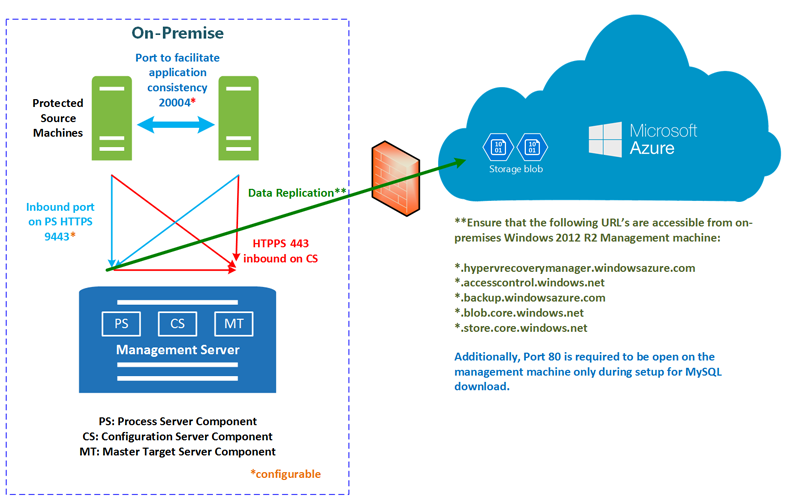

**Abbildung 1: VMware/physische in Azure** (Henry Robalino erstellt)

## Planen der Kapazität

Wann sind Sie Kapazität, hier die Planung müssen anzustellen:

- **Der Quelle-Umgebung**– Kapazität Planung oder die Anforderungen VMware Infrastruktur und die Quelle Computer.
- **Management-Server**– Planung für die lokale Management Server, die Website Wiederherstellung Komponenten ausgeführt werden.
- **Netzwerk-Bandbreite Quelle und Ziel**-Netzwerk-Bandbreite für die Replikation zwischen Quell- und Azure erforderlichen-Planung

### Aspekte der Quelle-Umgebung

- **Maximale täglich Änderung Zins**– ein geschützter Computer können Sie nur eine Prozessserver und ein einzelnen Prozessserver kann bis zu 2 TB Daten ändern pro Tag behandeln. Somit ist 2 TB an, dass die maximalen täglichen Daten Zins ändern, die für einen geschützten Computer unterstützt wird.
- **Maximale Durchsatz**– ein replizierter Computer angehören können eine Speicher-Konto in Azure. Ein standard Speicherkonto kann bis zu 20.000 Abfragen pro Sekunde verarbeitet, und es wird empfohlen, dass Sie die Anzahl der IOPS über einen Quellcomputer 20.000 beibehalten. Für Beispiel wenn Sie über einen Quellcomputer mit 5 Festplatten und auf jedem Datenträger verfügen 120 IOPS (8 K Größe) auf die Quelle generiert wird dann in der Azure pro Datenträger IOPS maximal 500 sein. Die Anzahl der erforderlichen Speicherkonten = Summe Quelle IOPs/20000.

### Server Gesichtspunkte

Management-Server ausgeführt wird, Website Wiederherstellung Komponenten, die Daten Optimierung, Replikation und Verwaltung behandelt. Sie sollten die tägliche ändern Zins Kapazität über alle Auslastung, die auf geschützten Computern verarbeiten, und ausreichend Bandbreite kontinuierlich Daten auf Azure-Speicher repliziert hat. Insbesondere:

- Prozess-Server empfängt Replikationsdaten von geschützten Computern und optimiert die es mit zwischenspeichern, Komprimierung und Verschlüsselung vor dem Senden an Azure. Der Management-Server sollte ausreichende Ressourcen zum Ausführen dieser Aufgaben verfügen.
- Prozess-Server verwendet Datenträger-basiertes Cache. Es empfiehlt sich, einen separaten Cachedatenträger 600 GB oder mehr verarbeitet Daten Änderungen, die bei einem Ausfall Netzwerkengpass gespeichert. Während der Bereitstellung können Sie den Cache konfigurieren, auf einem beliebigen Laufwerk mit mindestens 5 GB Speicher zur Verfügung, aber 600 GB empfiehlt es sich minimal.
- Als bewährte Methode empfiehlt sich, dass der Management-Server befinden sich in der gleichen Netzwerk und LAN-Segment wie die Computer, die Sie schützen möchten. Es kann sich in einem anderen Netzwerk befinden aber Maschinen, die Sie schützen möchten sollte L3 Netzwerk Sichtbarkeit darauf.

Größe Empfehlungen für den Management Server werden in der folgenden Tabelle zusammengefasst.

**Management Server CPU** | **Arbeitsspeicher** | **Datenträger Cachegröße** | **Ändern von Daten Zins** | **Geschützte Computer**
--- | --- | --- | --- | ---
8 vCPUs (Sockets 2 * 4 Kernen @ 2,5 GHz) | 16 GB | 300 GB | 500 GB oder weniger | Bereitstellen eines Management-Servers mit diesen Einstellungen weniger als 100 Computern repliziert.
12 vCPUs (2 Sockets * 6 Kerne @ 2,5 GHz) | 18 GB | 600 GB | 500 GB bis 1 TB | Bereitstellen eines Management-Servers mit diesen Einstellungen Replikation zwischen 100-150 Autos.
16 vCPUs (2 Sockets * 8 Kernen @ 2,5 GHz) | 32 GB | 1 TB | 1 TB bis 2 TB | Bereitstellen eines Management-Servers mit diesen Einstellungen zwischen 150-200 Computern repliziert.
Bereitstellen von einem anderen Prozessserver | | | > 2 TB | Bereitstellen Sie zusätzliche Prozess-Server, wenn Sie maximal 200 Computern repliziert sind oder, wenn die täglichen Daten ändern Rate 2 TB überschreitet.

Wobei Folgendes gilt:

- Jeder Quellcomputer wird mit 3 Datenträger von 100 GB konfiguriert.
- Wir verwendet benchmarking Speicherung von 10 K u/Min 8 SAS-Laufwerke mit RAID 10 für Cache Datenträger Maße.

### Netzwerk-Bandbreite von Quelle auf Ziel
Stellen Sie sicher, dass Sie die Bandbreite berechnen, die für die erste Replikation und Deltareplikation mithilfe des [Kapazitätsplanertools](site-recovery-capacity-planner.md) erforderlich

#### Einschränken der Bandbreite für die Replikation

VMware den Datenverkehr auf Azure repliziert geht über einen bestimmten Prozess-Server. Sie können die Bandbreite einschränken, die für die Website Wiederherstellung Replikation auf diesem Server verfügbar ist, wie folgt:

1. Öffnen nach der Bereitstellung der Microsoft Azure Sicherung MMC-Snap-in auf dem Hauptfenster Management Server oder auf einem Management Server ausgeführt zusätzliche Prozess-Servers. Werden standardmäßig eine Verknüpfung für Microsoft Azure Sicherung auf Desktop erstellt wird, oder Sie finden sie in: c:\Programme c:\Programme\Microsoft Azure Wiederherstellung Services Agent\bin\wabadmin.
2. Klicken Sie auf **Eigenschaften ändern**, in dem Snap-in.

    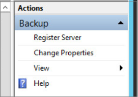

3. Geben Sie auf der Registerkarte **Beschränkung** die Bandbreite, die für die Website Wiederherstellung Replikation und die entsprechenden Planung verwendet werden kann.

    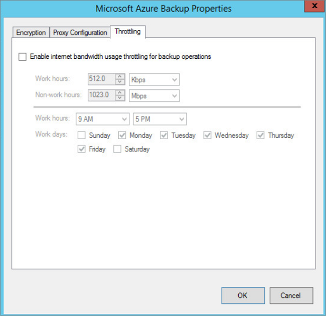

Optional können Sie auch festlegen, begrenzungsebene mithilfe der PowerShell. Hier ist ein Beispiel:

    Set-OBMachineSetting -WorkDay $mon, $tue -StartWorkHour "9:00:00" -EndWorkHour "18:00:00" -WorkHourBandwidth (512*1024) -NonWorkHourBandwidth (2048*1024)

#### Verwendung der Bandbreite maximieren
Klicken Sie zum Erhöhen der Bandbreite für die Replikation von Azure Website Wiederherstellung verwendete müssen Sie einen Registrierungsschlüssel ändern.

Der folgende Schlüssel steuert die Anzahl der Threads pro Datenträger repliziert, die bei der Replikation verwendet werden

    HKEY_LOCAL_MACHINE\SOFTWARE\Microsoft\Windows Azure Backup\Replication\UploadThreadsPerVM

 In einem Netzwerk "overprovisioned" diesen Registrierungsschlüssel aus der Standardwerte geändert werden soll. Wir unterstützen maximal 32.  

[Weitere](site-recovery-capacity-planner.md) Informationen zum Planen von detaillierten Kapazität.

### Zusätzliche Prozess-servers

Wenn Sie mehr als 200 Computern geschützt werden muss oder pro Tag ändern größer ist als 2 TB können Sie Hinzufügen weiterer Server, damit die Last bewältigt. Zum Skalieren, Sie können:

- Erhöhen Sie die Anzahl der Server für die Verwaltung. Beispielsweise können Sie bis zu 400 Autos mit zwei Management Server schützen.
- Hinzufügen von weiteren Prozess und den Verkehr statt (oder zusätzlich zu) verwenden Sie diese Management-Server.

In dieser Tabelle werden ein Szenario, in dem beschrieben:

- Die ursprünglichen Management Server einrichten als Konfigurationsserver nur Einsatzbreite.
- Sie richten Sie einen weiteren Prozessserver.
- Konfigurieren Sie geschützte virtuelle Maschinen, um zusätzliche Prozess-Server verwenden.
- Jeder geschützten Quellcomputer ist mit drei Datenträger von 100 GB konfiguriert.

**Ursprüngliche Management server**  (Konfigurationsserver) | **Zusätzliche Prozessserver**| **Datenträger Cachegröße** | **Ändern von Daten Zins** | **Geschützte Computer**
--- | --- | --- | --- | ---
8 vCPUs (Sockets 2 * 4 Kernen @ 2,5 GHz), 16 GB Arbeitsspeicher | 4 vCPUs (Sockets 2 * 2 Kernen @ 2,5 GHz), 8 GB Arbeitsspeicher | 300 GB | 250 GB oder weniger | Kleiner oder gleich 85 Maschinen können repliziert werden.
8 vCPUs (Sockets 2 * 4 Kernen @ 2,5 GHz), 16 GB Arbeitsspeicher | 8 vCPUs (Sockets 2 * 4 Kernen @ 2,5 GHz), 12 GB Arbeitsspeicher | 600 GB | 250 GB zu 1 TB | Sie können zwischen 85-150 Computern repliziert.
12 vCPUs (2 Sockets * 6 Kerne @ 2,5 GHz), 18 GB Arbeitsspeicher | 12 vCPUs (2 Sockets * 6 Kerne @ 2,5 GHz) 24 GB Arbeitsspeicher | 1 TB | 1 TB bis 2 TB | Sie können zwischen 150-225 Computern repliziert.

Die Möglichkeit, in der Sie Ihre Server skalieren, wird out-Modell skalieren oder die gewünschte Einstellung für einen Maßstab von abhängig.  Nach oben durch die Bereitstellung von wenigen High-End-Verwaltung und Prozess-Servern skalieren oder skalieren indem Sie mehr Server mit weniger Ressourcen. Beispiel: Wenn Sie 220 Autos geschützt werden muss könnten Sie eine der folgenden Aktionen ausführen:

- Konfigurieren Sie den ursprüngliche Management Server mit 12vCPU, 18 GB Arbeitsspeicher, einem weiteren Prozessserver mit 12vCPU, 24 GB Arbeitsspeicher, und Konfigurieren von geschützten Maschinen, um nur den zusätzlichen Prozess-Server verwenden.
- Oder alternativ Sie konnte zwei Management-Server (2 X 8vCPU, 16 GB RAM) und zwei zusätzliche Prozess-Server (1 x 8vCPU) und 4vCPU x 1 verarbeitet 135 + 85 (220) Computer konfigurieren und geschützte Maschinen, um nur die zusätzliche Prozess-Server verwenden.

Sie [Anweisungen](#deploy-additional-process-servers) zum Einrichten einer zusätzlichen Prozess-Servers ein.

## Bevor Sie beginnen Bereitstellung

Tabellen werden die erforderlichen Komponenten für dieses Szenario umsetzen.

### Azure erforderliche Komponenten

**Voraussetzung** | **Details**
--- | ---
**Azure-Konto**| Benötigen Sie ein [Microsoft Azure](https://azure.microsoft.com/) -Konto ein. Sie können mit einer [kostenlosen Testversion](https://azure.microsoft.com/pricing/free-trial/)beginnen. [Erfahren Sie mehr](https://azure.microsoft.com/pricing/details/site-recovery/) über die Website Wiederherstellung Preise.
**Azure-Speicher** | Sie benötigen ein Konto Azure-Speicher replizierte Daten gespeichert. Replizierte Daten in Azure-Speicher gespeichert und Azure-virtuellen Computern erstellt werden, wenn ausgeführt wird.   Sie benötigen einen [standard Geo redundante Speicher-Konto](../storage/storage-redundancy.md#geo-redundant-storage). Das Konto muss werden in der gleichen Region wie der Website Wiederherstellung Dienst und mit dem gleichen Abonnement verknüpft werden. Beachten Sie, dass die Replikation mit Premium Speicherkonten wird derzeit nicht unterstützt und dürfen nicht verwendet werden.  Verschieben von Speicherkonten erstellt die [neue Azure-Portal](../storage/storage-create-storage-account.md) zwischen Ressourcengruppen wird nicht unterstützt. [Informationen zu](../storage/storage-introduction.md) Azure-Speicher.  
**Azure Netzwerk** | Sie benötigen ein Azure-virtuelles Netzwerk, dem mit Azure-virtuellen Computern verbunden werden soll, wenn ausgeführt wird. Das Azure virtuelle Netzwerk muss sich in derselben Region als die Website Wiederherstellung Tresor.  Beachten Sie, dass die wieder nach Failover auf Azure treten ein VPN benötigen Verbindung (oder Azure ExpressRoute) einrichten aus dem Azure Netzwerk der lokalen Website.

### Lokale erforderliche Komponenten

**Voraussetzung** | **Details**
--- | ---
**Management server** | Sie benötigen einen lokale Windows 2012 R2-Server auf einem virtuellen Computern oder physischen Server ausgeführt. Alle lokalen Website Wiederherstellung Komponenten sind auf diesem Server Management installiert   Es empfiehlt sich, dass Sie auf den Server als eine hoch verfügbare VMware VM bereitstellen. Failback zu der Website lokalen aus Azure ist immer zu VMware virtuellen Computern unabhängig davon, ob Sie über einen virtuellen Computern oder physische Server ausgeführt werden. Wenn Sie nicht den Management Server als eine VMware VM konfigurieren müssen Sie einen separaten master Zielserver als eine VMware VM einrichten Failback Datenverkehr empfangen.  Der Server sollte eine Domänencontroller nicht sein.  Der Server sollte eine statische IP-Adresse verfügen.  Der Hostname des Servers sollten 15 Zeichen oder weniger.  Gebietsschema des Betriebssystems sollten nur Englisch.  Management-Server ist ein Internetzugang erforderlich.  Sie benötigen ausgehenden Zugriff vom Server wie folgt: temporären Zugriff auf HTTP-80 während der Installation der Website Wiederherstellung Komponenten (zum Herunterladen von MySQL); Laufenden ausgehenden Zugriff auf HTTPS 443 für Replikations-Management; Laufenden ausgehenden Zugriff auf HTTPS 9443 für Replikationsdatenverkehr (dieser Port kann geändert werden)   Stellen Sie sicher, dass diese URLs vom Server Management zugegriffen werden:  - \*. hypervrecoverymanager.windowsazure.com - \*. accesscontrol.windows.net - \*. backup.windowsazure.com - \*. blob.core.windows.net - \*. store.core.windows.net -https://www.msftncsi.com/ncsi.txt - [https://dev.MySQL.com/Get/Archives/MySQL-5.5/MySQL-5.5.37-Win32.msi]( https://dev.mysql.com/get/archives/mysql-5.5/mysql-5.5.37-win32.msi " https://dev.mysql.com/get/archives/mysql-5.5/mysql-5.5.37-win32.msi")  Wenn Sie die IP-Adresse-basierte Firewall-Regeln auf dem Server haben, überprüfen Sie, dass die Regeln Kommunikation mit Azure zulassen. Sie müssen die [Azure Datacenter IP-Bereiche](https://www.microsoft.com/download/details.aspx?id=41653) und den Port HTTPS (443) zulassen. Sie müssen außerdem an, für die Azure Region Ihres Abonnements und Westen US IP-Adressbereiche weiße Liste. Die URL [https://dev.mysql.com/get/archives/mysql-5.5/mysql-5.5.37-win32.msi](https://dev.mysql.com/get/archives/mysql-5.5/mysql-5.5.37-win32.msi " https://dev.mysql.com/get/archives/mysql-5.5/mysql-5.5.37-win32.msi") ist für MySQL herunterladen.
**VMware vCenter/ESXi Host**: | Sie benötigen mindestens vMware vSphere ESX/ESXi Hypervisoren Verwalten Ihrer virtuellen VMware Maschinen ESX/ESXi Version 6.0, 5.5 oder 5.1 mit den neuesten Updates ausgeführt.   Es empfiehlt sich, dass ein VMware vCenter Server zum Verwalten Ihrer ESXi Hosts bereitgestellt werden. Es sollte vCenter Version 6.0 oder 5.5 mit den neuesten Updates ausgeführt werden.  Beachten Sie, dass die Website Wiederherstellung unterstützt keine neuen vCenter und vSphere 6.0 Features wie cross, vCenter vMotion, virtuelle Datenmengen und Speicher DRS. Website Wiederherstellung Support ist beschränkt auf Features, die auch in der Version 5.5 verfügbar waren.
**Geschützten Computern**: | **AZURE**  Maschinen, die Sie schützen möchten, sollte mit [Azure erforderliche Komponenten](site-recovery-best-practices.md#azure-virtual-machine-requirements) zum Erstellen von Azure-virtuellen Computern entsprechen.  Wenn Sie nach einem Failover mit den Azure-virtuellen Computern verbinden möchten, müssen Sie Remote Desktop-Verbindungen auf die lokale Firewall aktivieren.  Einzelne die Speicherkapazität auf geschützten Computern dürfen nicht mehr als 1023 GB entsprechen. Ein virtueller Computer kann bis zu 64 Datenträger haben (also bis zu 64 TB). Wenn Sie Erwägung Datenträger mit mehr als 1 TB Datenbankreplikation, wie etwa SQL Server immer aktivieren oder Oracle Data Guard.  Mindestens 2 GB verfügbarer Speicherplatz auf dem Laufwerk für die Installation von Komponenten.  Freigegebene Datenträger Gast, Cluster nicht unterstützt werden. Wenn Sie eine gruppierte Bereitstellung bietet Datenbankreplikation wie etwa SQL Server immer aktivieren oder Oracle Data Guard besitzen.  Unified Extensible Firmware Interface (UEFI) / Extensible Firmware Interface(EFI) Boot nicht unterstützt.  Computernamen sollten zwischen 1 und 63 Zeichen (Buchstaben, Zahlen und Bindestriche) enthalten. Der Name muss mit einem Buchstaben oder einer Zahl beginnen und enden mit einen Buchstaben oder eine Zahl. Nach ein Computer geschützt ist, können Sie den Namen der Azure ändern.  **Virtuelle VMware-Computer**  Sie müssen VMware vSphere PowerCLI 6.0 installieren. auf den Management Server (Konfiguration).  VMware virtuellen Computern, die Sie schützen möchten, sollten VMware Tools installiert sein und ausgeführt haben.  Wenn die Quelle virtueller Computer NIC-Kombination verfügt wird es in einen einzelnen Netzwerkadapter nach Failover auf Azure konvertiert.  Geschützte virtuelle Computer iSCSI-Datenträger haben wandelt dann Website Wiederherstellung den geschützten virtuellen Computer iSCSI-Datenträger in eine Datei virtuelle Festplatte bei der virtuellen Computer über in Azure schlägt fehl. Wenn Sie iSCSI-Ziel über den Azure-virtuellen Computer erreicht werden kann wird es verbinden iSCSI-Ziel und finden Sie im Wesentlichen zwei Datenträger – die virtuelle Festplatte des Azure-virtuellen Computers und die Quelle iSCSI-Datenträger. In diesem Fall müssen Sie das iSCSI-Ziel zu trennen, das auf den fehlerhaften über Azure-virtuellen Computer angezeigt wird.  [Weitere](#vmware-permissions-for-vcenter-access) Informationen zu Benutzerberechtigungen VMware, die von der Website Wiederherstellung benötigt werden.   **WINDOWS-SERVERCOMPUTERN (auf VMware VM oder physischen Server)**  Der Server sollte ein unterstütztes 64-Bit-Betriebssystem ausgeführt werden: Windows Server 2012 R2, Windows Server 2012 oder Windows Server 2008 R2 mit am minimalen SP1.  Das Betriebssystem auf Laufwerk C:\ installiert werden soll, und der Datenträger OS sollten eine grundlegende Windows-Datenträger (OS dürfen nicht auf einem Windows dynamischen Datenträger installiert werden.)  Für Windows Server 2008 R2 Computer müssen Sie .NET Framework 3.5.1 installiert haben.  Sie müssen ein Administratorkonto bereitstellen (muss ein lokaler Administrator auf dem Windows-Computer) für die Installation Pushbenachrichtigungen Mobilität Dienst auf Windows-Servern. Das bereitgestellte Konto ist ein Konto nicht Domäne müssen Sie Remote des Benutzerzugriffs Steuerelement auf dem lokalen Computer zu deaktivieren. [Erfahren Sie mehr](#install-the-mobility-service-with-push-installation).  Website Wiederherstellung unterstützt virtuellen Computern RDM Datenträger.  Während des Failbacks verwendet Website Wiederherstellung den Datenträger RDM erneut, wenn die ursprüngliche Quelle virtueller Computer und RDM Datenträger verfügbar ist. Wenn sie nicht verfügbar sind, während des Failbacks erstellt Website Wiederherstellung eine neue VMDK-Datei für jeden Datenträger.  **LINUX-COMPUTERN**  Sie benötigen einen unterstützten 64-Bit-Betriebssystem: Red Hat Enterprise Linux 6,7; CentOS 6.5, 6.6,6.7; Oracle Enterprise Linux 6.4, 6.5 kompatibel Kernel Red Hat oder unverwüstliche Enterprise Kernel Release 3 (UEK3), SUSE Linux Enterprise Server 11 SP3 ausgeführt.  / etc/hosts-Dateien auf geschützten Computern sollte Einträge enthalten, die alle Netzwerkadapter zugeordneten IP-Adressen den lokale Hostname zuordnen.   Verbindung mit einer Azure-virtuellen Computern Linux nach System durch Verwendung eines Secure Shell-Clients (ssh) ausgeführt werden soll, stellen Sie sicher, dass der Secure Shell-Dienst auf dem geschützten Computer auf Systemstart automatisch gestartet festgelegt ist und Firewall-Regeln zulassen einer ssh Verbindung dazu.  Schutz kann nur für Linux-Computern mit den folgenden Speicher aktiviert werden: File System (EXT3, ETX4, ReiserFS, XFS); Mehrere Pfade Software Gerät Mapper (mehrere Pfade)); Volumen-Manager: (LVM2). Physische Server mit HP CCISS Controller Speicher werden nicht unterstützt. Das Dateisystem ReiserFS wird nur unter SUSE Linux Enterprise Server 11 SP3 unterstützt.  Website Wiederherstellung unterstützt virtuellen Computern RDM Datenträger.  Während des Failbacks für Linux wiederverwenden keine Website Wiederherstellung den Datenträger RDM. Stattdessen wird eine neue VMDK-Datei für jeden entsprechenden RDM Datenträger erstellt.

Nur für Linux VM - stellen Sie sicher, dass Sie die Einstellung disk.enableUUID=true Parameter den virtuellen Computer in VMware Konfiguration festlegen. Wenn diese Zeile nicht vorhanden ist, fügen Sie es hinzu. Dies ist erforderlich, um eine konsistente UUID der VMDK-Datei zur Verfügung stellen, damit sie ordnungsgemäß bereitgestellt werden. Beachten Sie, dass auch ohne diese Einstellung, Failback bewirkt einen vollständigen Download, auch wenn Sie der virtuellen Computer auf Vorz verfügbar ist Hinzufügen von dieser Einstellung wird sichergestellt, dass nur Delta Änderungen wieder während des Failbacks übertragen werden.

## Schritt 1: Erstellen einer Tresor

1. Melden Sie sich bei dem [Verwaltungsportal](https://manage.windowsazure.com/).
2. Erweitern Sie **Data Services** > **Wiederherstellung Services** , und klicken Sie auf **Website Wiederherstellung Tresor**.
3. Klicken Sie auf **neu erstellen** > **schnell zu erstellen**.
4. Geben Sie im Feld **Name**einen Anzeigenamen ein, um den Tresor zu identifizieren.
5. Wählen Sie in der **Region**das geografische Region für den Tresor ein. Zum Überprüfen der unterstützte Regionen finden Sie unter geografischen Verfügbarkeit in [Azure Website Wiederherstellung Preise-Details](https://azure.microsoft.com/pricing/details/site-recovery/)
6. Klicken Sie auf **Erstellen Tresor**.
    

Überprüfen Sie die Statusleiste, um zu bestätigen, dass der Tresor erfolgreich erstellt wurde. Der Tresor werden auf der **Wiederherstellung Services** -Hauptseite als **aktiv** aufgelistet.

## Schritt 2: Einrichten einer Azure Netzwerk

Richten Sie ein Azure-Netzwerk aus, damit Azure-virtuellen Computern nach Failover mit einem Netzwerk verbunden werden soll, und damit Failback zu der lokalen Website arbeiten kann, wie erwartet.

1. Im Portal Azure > **virtuelles Netzwerk erstellen** Geben Sie den Namen. IP-Adresse Bereichs- und Subnetz-Name.
2. Sie müssten VPN/ExpressRoute mit dem Netzwerk hinzufügen, wenn Sie Failback ausführen müssen. VPN/ExpressRoute können auch nach dem Failover mit dem Netzwerk hinzugefügt werden.

[Weitere Informationen finden Sie](../virtual-network/virtual-networks-overview.md) Informationen zum Azure Netzwerken.

> [AZURE.NOTE] [Migration von Netzwerken](../resource-group-move-resources.md) zwischen Ressourcengruppen innerhalb des gleichen Abonnements oder übergreifend Abonnements wird Netzwerke für die Website Wiederherstellung nicht unterstützt.

## Schritt 3: Installieren Sie die VMware-Komponenten

Virtuelle VMware repliziert werden soll Installieren der Computer die folgenden VMware-Komponenten auf dem Server Management:

1. [Herunterladen](https://developercenter.vmware.com/tool/vsphere_powercli/6.0) und installieren VMware vSphere PowerCLI 6.0.
2. Starten Sie den Server ein.

## Schritt 4: Herunterladen Sie einen Tresor Registrierungsschlüssel

1. Öffnen Sie aus der Verwaltung Server die Website Wiederherstellung Konsole in Azure. Klicken Sie in der **Wiederherstellung-** Seite auf die Tresor zum Öffnen der Seite Schnellstart. Schnellstart kann auch jederzeit auf das Symbol geöffnet werden.

    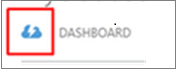

2. Klicken Sie auf der Seite **Schnellstart** auf **Vorbereiten Zielressourcen** > **einen Registrierungsschlüssel herunterladen**. Die Datei wird automatisch generiert. Es gilt für 5 Tage, nachdem er generiert wird.

## Schritt 5: Installieren Sie den Management server
> [AZURE.TIP] Stellen Sie sicher, dass diese URLs vom Server Management zugegriffen werden:
>
- *. hypervrecoverymanager.windowsazure.com
- *. accesscontrol.windows.net
- *. backup.windowsazure.com
- *. blob.core.windows.net
- *. store.core.windows.net
- https://dev.MySQL.com/Get/Archives/MySQL-5.5/MySQL-5.5.37-Win32.msi
- https://www.msftncsi.com/ncsi.txt

[AZURE.VIDEO enhanced-vmware-to-azure-setup-registration]

1. Laden Sie auf der Seite **Schnellstart** die Installationsdatei einheitlichen auf dem Server aus.

2. Führen Sie die Installationsdatei, um Setup im Website Wiederherstellung Unified Setup-Assistenten zu starten.

3.  Wählen Sie im **zuerst sich daher** **Installieren der Konfiguration Servers und einer Prozess**ein.

    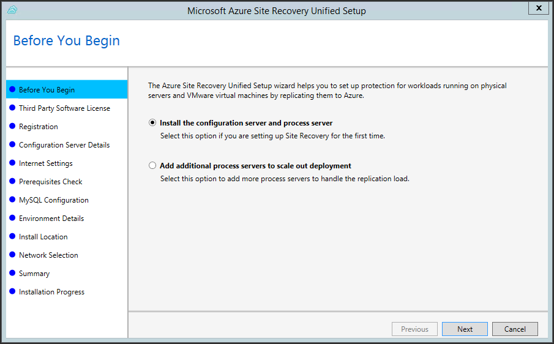
4. Klicken Sie auf **ich stimme** zum Herunterladen und Installieren von MySQL, in **Drittanbieter-Softwarelizenz** . 

    

5. Klicken Sie in der **Registrierung** suchen Sie, und wählen Sie die Registrierungsschlüssel, die Sie aus dem Tresor heruntergeladen haben.

    

6. Geben Sie im **Internet Einstellungen** an, wie der Anbieter ausgeführt wird, auf dem Konfigurationsserver mit Azure Website Wiederherstellung über das Internet verbinden möchten.

    - Wählen Sie **Verbinden mit vorhandenen Proxyeinstellungen**mit dem Proxy herstellen, die aktuell auf dem Computer eingerichtet werden soll.
    - Wählen Sie **direkt ohne einen Proxy verbinden**, wenn Sie den Anbieter direkt verbinden möchten.
    - Wenn der vorhandene Proxy Authentifizierung erfordert oder einen benutzerdefinierten Proxy für die Verbindung zu einem Internetdienstanbieter verwenden möchten, wählen Sie **Verbinden mit benutzerdefinierten Proxyeinstellungen**.
        - Wenn Sie einen benutzerdefinierten Proxy verwenden, den Sie die Adresse, den Port und die Anmeldeinformationen angeben müssen
        - Wenn Sie einen Proxy verwenden sollte Sie die folgenden URLs bereits zulässig:
            - *. hypervrecoverymanager.windowsazure.com;    
            - *. accesscontrol.windows.net; 
            - *. backup.windowsazure.com; 
            - *. blob.core.windows.net; 
            - *. store.core.windows.net
            

    

7. In **Erforderliche Komponenten prüfen** führt Setup ein Häkchen, um sicherzustellen, dass die Installation ausgeführt werden kann. 

    
    

     Stellen Sie sicher, dass die Uhrzeit auf die Systemuhr (**Datum und Uhrzeit** Einstellungen) die gewünschte Zeitzone identisch ist, wird eine Warnung, über den **globale Zeit Synchronisieren aktivieren angezeigt** .

    

8. Erstellen Sie **MySQL** -Konfiguration Anmeldeinformationen für die Anmeldung an der MySQL-Server-Instanz, die installiert werden.

    

9. **Details zur Umgebung** auswählen, ob Sie nun VMware virtuellen Computern repliziert. Wenn Sie sind, klicken Sie dann Setup überprüft, ob PowerCLI 6.0 installiert ist.

    

10. **Installieren von einem Speicherort** auswählen, in die Binärdateien installieren und speichern den Cache werden soll. Sie können ein Laufwerk mit mindestens 5 GB Speicher verfügbar auswählen, doch empfehlen wir Cachelaufwerk mit mindestens 600 GB freier Festplattenspeicher.

    

11. Geben Sie die Zuhörer (Netzwerkadapter und SSL-Anschluss), an dem der Konfigurationsserver werden Replikationsdaten senden und empfangen **Netzwerk** Auswahl an. Sie können die Standardeinstellung ändern port (9443). Zusätzlich zu diesem Port wird Port 443 von einem Webserver verwendet die Replikationsvorgänge koordiniert. 443 dürfen nicht für den Empfang von Replikationsdatenverkehr verwendet werden.

    

12.  Klicken Sie in der **Zusammenfassung** überprüfen Sie die Informationen, und klicken Sie auf **Installieren**. Nach Abschluss der Installation wird ein Kennwort generiert. Sie benötigen diese Informationen beim Aktivieren der Replikation also kopieren und an einem sicheren Ort aufbewahren.

    

13.  Überprüfen Sie die Informationen in der **Zusammenfassung** .

    

>[AZURE.WARNING]Microsoft Azure Wiederherstellung Service Agent des Proxyservers muss eingerichtet werden.
>Nach Abschluss die Installation Starten einer Anwendungs mit dem Namen "Microsoft Azure Wiederherstellung Services Shell" aus dem Windows-Startmenü auf. Führen Sie den folgenden Satz von Befehlen zur Einrichtung von Proxyeinstellungen im Befehlsfenster, das angezeigt wird.
>
    $pwd = ConvertTo-SecureString -String ProxyUserPassword
    Set-OBMachineSetting -ProxyServer http://myproxyserver.domain.com -ProxyPort PortNumb – ProxyUserName domain\username -ProxyPassword $pwd
    net stop obengine
    net start obengine

### Führen Sie Setup über die Befehlszeile

Sie können auch wie folgt einheitlichen Assistenten über die Befehlszeile ausführen:

    UnifiedSetup.exe [/ServerMode <CS/PS>] [/InstallDrive <DriveLetter>] [/MySQLCredsFilePath <MySQL credentials file path>] [/VaultCredsFilePath <Vault credentials file path>] [/EnvType <VMWare/NonVMWare>] [/PSIP <IP address to be used for data transfer] [/CSIP <IP address of CS to be registered with>] [/PassphraseFilePath <Passphrase file path>]

Wobei Folgendes gilt:

- / ServerMode: obligatorisch. Gibt an, ob es sich bei die Installation sollten die Konfiguration und Prozess-Server oder den Prozess-Server installieren (wird verwendet, um zusätzliche Prozess-Servern installieren). Eingabewerte: CS, folgenden
- InstallDrive: obligatorisch. Gibt den Ordner, in dem die Komponenten installiert sind.
- / MySQLCredFilePath. Obligatorisch. Gibt den Pfad zu einer Datei, wo sich die MySQL-Serveranmeldeinformationen Geschichte befinden. Rufen Sie die Vorlage zum Erstellen der Datei ein.
- / VaultCredFilePath. Obligatorisch. Speicherort der Datei Tresor Anmeldeinformationen
- / EnvType. Obligatorisch ist. Art der Installation. Werte: VMware, NonVMware
- / PSIP und /CSIP. Obligatorisch. IP-Adresse der Prozess Servers und Konfiguration.
- / PassphraseFilePath. Obligatorisch. Speicherort der Datei ein Kennwort.
- / ByPassProxy. Optional. Gibt an, dass der Verwaltungsserver und Azure ohne einen Proxy besteht.
- / ProxySettingsFilePath. Optional. Gibt die Einstellungen für einen benutzerdefinierten Proxy entweder (Standardproxy auf dem Server, der Authentifizierung erforderlich ist) oder benutzerdefinierten Proxy an

## Schritt 6: Einrichten von Anmeldeinformationen für den Server vCenter

> [AZURE.VIDEO enhanced-vmware-to-azure-discovery]

Prozess-Server kann VMware virtuellen Computern, die von einem Server vCenter verwaltet werden, automatisch ermitteln. Für automatische Erkennung benötigt Website Wiederherstellung ein Konto und die Anmeldeinformationen, die den vCenter Server zugreifen können. Dies ist nicht relevant, wenn Sie nur physische Servern repliziert sind.

Führen Sie diese wie folgt ein:

1. Klicken Sie auf die vCenter Server eine Rolle (**Azure_Site_Recovery**) auf der Ebene vCenter mit den [erforderlichen Berechtigungen](#vmware-permissions-for-vcenter-access)erstellen.
2. Die Rolle des **Azure_Site_Recovery** einer vCenter Benutzer zuweisen.

    >[AZURE.NOTE] Ein vCenter Benutzerkonto, das die Schreibschutz-Funktion kann Failover ausgeführt werden, ohne zu geschützten Quelle Autos beenden. Wenn Sie diese Computer beenden möchten, benötigen Sie die Rolle des Azure_Site_Recovery. Beachten Sie, dass wenn Sie virtuellen Computern nur von VMware in Azure migrieren sind und Failback nicht erforderlich, klicken Sie dann die Rolle schreibgeschützt ausreicht.

3. Klicken Sie zum Hinzufügen des Kontos **Cspsconfigtool**öffnen. Es ist als eine Verknüpfung auf dem Desktop verfügbar und sich im Ordner \home\svsystems\bin [Ort installieren].
2. Klicken Sie auf der Registerkarte **Konten verwalten** auf **Konto hinzufügen**.

    

3. Fügen Sie **Account Details** Anmeldeinformationen, die Zugriff auf den Server vCenter verwendet werden können. Beachten Sie, dass dauern kann maximal 15 Minuten für den Namen des Kontos im Portal angezeigt werden. Klicken Sie auf der Registerkarte **Server Konfiguration** auf aktualisieren, um direkt zu aktualisieren.

    

## Schritt 7: Hinzufügen von vCenter Servers und ESXi hosts

Wenn Sie virtuelle VMware-Computer repliziert sind, Sie eine vCenter Server (oder ESXi Host) hinzufügen müssen.

1. Klicken Sie auf den **Servern** > **Konfiguration Servern** tab, wählen Sie den Konfigurationsserver > **Hinzufügen vCenter Server**.

    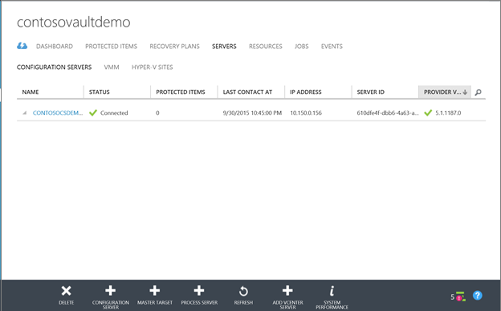

2. Fügen Sie dem Server vCenter oder ESXi Hostdetails, den Namen des Kontos, das Sie zum Zugreifen auf dem Server vCenter im vorherigen Schritt und den Prozess-Server, mit der virtuelle VMware-Computer zu ermitteln, die vom Server vCenter verwaltet werden, angegeben. Beachten Sie, dass der Server vCenter oder ESXi Host auf dem Prozess-Server installiert ist in demselben Netzwerk wie der Server platziert werden soll.

    >[AZURE.NOTE] Wenn Sie die vCenter Server oder ESXi Host mit einem Konto an, die auf dem Server vCenter oder Hostnamen nicht über Administratorrechte verfügen hinzufügen möchten, vergewissern Sie sich die vCenter oder ESXi Konten berechtigt diese aktiviert: Datacenter, Datenspeicher, Ordner, Jost, Netzwerk, Ressourcen, virtuellen Computers vSphere verteilt wechseln. Darüber hinaus benötigt der Server vCenter im Speicher Ansichten Recht.

    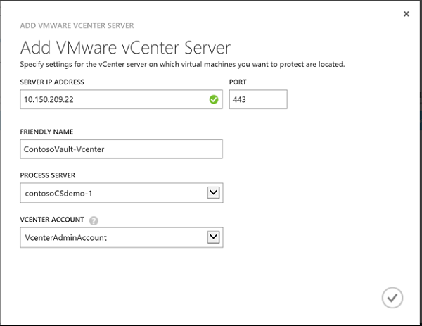

3. Nach Abschluss der Suche werden auf der Registerkarte **Konfiguration Servern** vCenter Server aufgelistet.

    

## Schritt 8: Erstellen einer Gruppe "Schutz"

> [AZURE.VIDEO enhanced-vmware-to-azure-protection]

Schutzgruppen stellen eine Gruppierung von virtuellen Computern oder physischen Server, die Sie mit den gleichen Schutz Einstellungen schützen möchten. Sie Schutz Einstellungen zu einer Schutzgruppe anwenden, und diese Einstellungen werden angewendet, um alle virtuellen Computern/physische Maschinen, die Sie zur Gruppe hinzufügen.

1. Öffnen Sie die **Geschützten Elemente** > **Gruppe "Schutz"** , und klicken Sie auf eine Gruppe "Schutz" hinzufügen.

    

2. Klicken Sie auf der Seite **Schutz Gruppeneinstellungen geben** Geben Sie einen Namen für die Gruppe an, und wählen Sie **in** des Konfiguration Servers, auf dem Sie die Gruppe erstellen möchten. **Ziel** ist Azure.

    

3. Konfigurieren Sie die Replikation-Einstellungen, die für alle Computer in der Gruppe verwendet werden soll, auf der Einstellungsseite **Replikation angeben** .

    

    - **Multi virtueller Computer Konsistenz**: Wenn Sie diese Option aktivieren, erstellt es freigegebene Anwendung konsistente Wiederherstellungspunkte über die Computer in der Gruppe "Schutz". Diese Einstellung ist besonders relevant, wenn alle Computer in der Gruppe "Schutz" die gleiche Arbeitsbelastung ausgeführt werden. Alle Computer werden mit der gleichen Datenpunkt wiederhergestellt werden. Dies ist zur Verfügung, ob Sie virtuelle VMware-Computer oder Windows/Linux physischen Servern repliziert.
    - **RPO Schwellenwert**: Legt das RPO. Benachrichtigungen werden generiert werden, wenn die kontinuierlichen Schutz Replikation den konfigurierten RPO-Schwellenwert überschreitet.
    - **Wiederherstellung zeigen Aufbewahrung**: Gibt die Aufbewahrung Fenster an. Geschützte Maschinen können an einer beliebigen Stelle in diesem Fenster wiederhergestellt werden.
    - **Anwendung konsistente Momentaufnahme Häufigkeit**: Gibt an, wie häufig Wiederherstellungspunkte, enthält die Anwendung konsistent Momentaufnahmen erstellt werden.

Beim Klicken auf das Häkchen wird einer Gruppe "Schutz" mit dem Namen erstellt, die Sie angegeben haben. In Addition wird eine zweite Gruppe "Schutz" erstellt, mit dem Namen < Schutz-Gruppe-Name-Failback). Diese Gruppe "Schutz" wird verwendet, wenn Sie wieder zur lokalen Website nach Failover auf Azure fehl. Sie können die Schutzgruppen überwachen, während sie auf der Seite **Geschützte Elemente** erstellt haben.

## Schritt 9: Installieren Sie den Dienst Mobilität

Schutz für virtuellen Computern und physischen Server ermöglichen der erste Schritt besteht darin Mobilität Dienst zu installieren. Dies ist auf zwei Arten möglich:

- Automatisch drücken Sie, und installieren Sie den Dienst auf jedem Computer aus den Prozess-Server. Beachten Sie, dass eine geeignete Version der Installation Pushbenachrichtigungen Mobilität Dienst ausgeführt, wenn Sie eine Gruppe "Schutz" Autos hinzu, und sie sich bereits befinden durchgeführt wird.
- Der Dienst, der mithilfe der Enterprise Pushbenachrichtigungen Methode wie WSUS oder System Center-Konfigurations-Manager automatisch installiert. Stellen Sie sicher, dass Sie den Management Server eingerichtet haben, bevor Sie dies tun.
- Installieren Sie manuell auf jedem Computer, die Sie schützen möchten. Erstellen haben Sie sicher, dass Sie den Management Server einrichten, bevor Sie folgende Schritte ausführen.

### Installieren des Diensts Mobilität mit Installation von Pushbenachrichtigungen

Wenn Sie eine Gruppe "Schutz" Autos hinzufügen Mobilität Dienst automatisch abgelegt und auf jedem Computer installiert ist, indem Sie den Prozess-Server.

#### Bereiten Sie für automatische Pushbenachrichtigungen auf Computern unter Windows vor

So sieht wie Windows-Computer vorzubereiten, sodass der Dienst Mobilität durch den Prozess-Server automatisch installiert werden kann.

1.  Erstellen Sie ein Konto aus, die vom Prozessserver zum Zugreifen auf des Computers verwendet werden kann. Das Konto muss Administratorrechte (lokal oder Domäne) verfügen. Beachten Sie, dass diese Anmeldeinformationen nur für Pushbenachrichtigungen Installation des Diensts Mobilität verwendet werden.

    >[AZURE.NOTE] Wenn Sie eine Domänenkonto nicht verwenden, müssen Sie Benutzerzugriff Remote-Steuerelement auf dem lokalen Computer zu deaktivieren. Fügen Sie hierzu im Journal unter HKEY_LOCAL_MACHINE\SOFTWARE\Microsoft\Windows\CurrentVersion\Policies\System den DWORD-Eintrag LocalAccountTokenFilterPolicy mit einem Wert von 1 unter. Hinzufügen die Registrierung Eintrag eine CLI Befehl öffnen, oder geben Sie die mithilfe der PowerShell **`REG ADD HKEY_LOCAL_MACHINE\SOFTWARE\Microsoft\Windows\CurrentVersion\Policies\System /v LocalAccountTokenFilterPolicy /t REG_DWORD /d 1`**.

2.  Klicken Sie auf die Windows-Firewall des Computers soll zu schützen, wählen Sie **Zulassen einer app oder Feature durch die Firewall** und **Datei- und Druckerfreigabe** und **Windows-Verwaltungsinstrumentation**aktivieren. Für Maschinen, die zu einer Domäne gehören, können Sie die Firewallrichtlinie mit ein Gruppenrichtlinienobjekt konfigurieren.

    

2. Fügen Sie das Konto aus, die, das Sie erstellt haben:

    - Öffnen Sie **Cspsconfigtool**. Es ist als eine Verknüpfung auf dem Desktop verfügbar und sich im Ordner \home\svsystems\bin [Ort installieren].
    - Klicken Sie auf **Konto hinzufügen**, auf der Registerkarte **Konten verwalten** .
    - Fügen Sie das Konto aus, die, das Sie erstellt haben. Nachdem Sie das Konto hinzugefügt haben, müssen Sie die Anmeldeinformationen bereitstellen, wenn Sie einen Computer zu einer Gruppe "Schutz" hinzufügen.

#### Bereiten Sie für automatische Pushbenachrichtigungen auf Linux-Servern vor

1.  Stellen Sie sicher, dass der Linux-Computer, die, den Sie schützen möchten, in [lokalen Vorkenntnisse](#on-premises-prerequisites)beschriebenen unterstützt wird. Sicherstellen, dass es ist Netzwerkkonnektivität zwischen dem Computer, die, den Sie schützen möchten, und dem Management Server ausgeführt, die den Prozess-Server.

2.  Erstellen Sie ein Konto aus, die vom Prozessserver zum Zugreifen auf des Computers verwendet werden kann. Das Konto sollte ein Root-Benutzer auf dem Server der Quelle Linux. Beachten Sie, dass diese Anmeldeinformationen nur für Pushbenachrichtigungen Installation des Diensts Mobilität verwendet werden.

    - Öffnen Sie **Cspsconfigtool**. Es ist als eine Verknüpfung auf dem Desktop verfügbar und sich im Ordner \home\svsystems\bin [Ort installieren].
    - Klicken Sie auf der Registerkarte **Konten verwalten** auf **Konto hinzufügen**.
    - Fügen Sie das Konto aus, die, das Sie erstellt haben. Nachdem Sie das Konto hinzugefügt haben, müssen Sie die Anmeldeinformationen bereitstellen, wenn Sie einen Computer zu einer Gruppe "Schutz" hinzufügen.

3.  Überprüfen Sie, dass die Datei/etc/Hosts serverseitig Linux Quelle Einträge enthält, die alle Netzwerkadapter zugeordneten IP-Adressen die lokale Hostname zuordnen.
4.  Installieren Sie die neuesten Openssh, Openssh-Server Openssl-Paketen auf dem Computer, die, den Sie schützen möchten.
5.  Stellen Sie sicher, dass SSH auf Anschluss 22 aktiviert ist und ausgeführt wird.
6.  Aktivieren Sie SFTP Subsystem und Kennwortauthentifizierung in der Datei Sshd_config wie folgt ein:

    - Melden Sie sich als Root an.
    - Suchen Sie die Zeile, die mit PasswordAuthentication beginnt, in der Datei /etc/ssh/sshd_config Datei.
    - Kommentieren Sie die Zeile, und ändern Sie den Wert von **keine** auf **Ja**.
    - Kommentieren Sie die Zeile, und suchen Sie die Zeile, die mit **Subsystem** beginnt.

        

### Manuell installieren des Diensts Mobilität

Der Installer stehen in c:\Programme\Microsoft Dateien (x86) \Microsoft Azure Site Recovery\home\svsystems\pushinstallsvc\repository.

Quellbetriebssystem | Mobilität Installation Dienstdatei
--- | ---
Windows Server (nur 64-Bit) | Microsoft-ASR_UA_9. *.0.0_Windows_* release.exe
CentOS 6.4, 6.5, 6.6 (nur 64-Bit) | Microsoft-ASR_UA_9. *.0.0_RHEL6-64_*release.tar.gz
SUSE Linux Enterprise Server 11 SP3 (nur 64-Bit) | Microsoft-ASR_UA_9. *.0.0_SLES11-SP3-64_*release.tar.gz
Oracle Enterprise Linux 6.4, 6.5 (nur 64-Bit) | Microsoft-ASR_UA_9. *.0.0_OL6-64_*release.tar.gz

#### Manuell installieren Sie auf einem WindowsServer

1. Herunterladen Sie, und führen Sie das Installationsprogramm relevante.
2. Wählen Sie in der **Vorbemerkung ** **Mobilität Dienst**ein.

    

3. Geben Sie die IP-Adresse des Servers Management und das Kennwort ein, das bei der Installation auf der Server Verwaltungskomponenten generiert wurde, **Konfiguration Server** Details. Sie können das Kennwort abrufen, indem Sie ausgeführt: ** <SiteRecoveryInstallationFolder>\home\sysystems\bin\genpassphrase.exe – n** auf dem Server Management.

    

4. Lassen Sie Speicherort **Installieren** am Standardspeicherort, und klicken auf **Weiter** um die Installation zu starten.
5. Im **Verlauf der Installation** überwachen Sie Installation, und starten Sie den Computer aus, wenn Sie dazu aufgefordert werden.

Sie können auch über die Befehlszeile installieren:

UnifiedAgent.exe [/ Rolle < Agent/MasterTarget >] [/ InstallLocation <Installation Directory>] [/ CSIP <IP address of CS to be registered with>] [/ PassphraseFilePath <Passphrase file path>] [/ LogFilePath <Log File Path>]

Wobei Folgendes gilt:

- / Rolle: obligatorisch. Gibt an, ob der Dienst Mobilität installiert werden soll.
- / InstallLocation: obligatorisch. Gibt an, wo Sie den Dienst zu installieren.
- / PassphraseFilePath: obligatorisch. Gibt die Konfiguration Server Kennwort an.
- / LogFilePath: obligatorisch. Gibt an, Speicherort für Protokolldateien einrichten

#### Deinstallieren Sie manuell Mobilität-Dienst

Mobilität Dienst kann deinstalliert werden, verwenden die entfernen Programm hinzufügen von Control Panel oder Verwenden von Befehlszeile.

Der Befehl So deinstallieren Sie die Befehlszeile mit Mobilität Dienst ist

    MsiExec.exe /qn /x {275197FC-14FD-4560-A5EB-38217F80CBD1}

#### Ändern Sie die IP-Adresse des Servers management

Nach dem Ausführen des Assistenten können Sie die IP-Adresse des Management Servers wie folgt ändern:

1. Öffnen Sie die Datei hostconfig.exe (befindet sich auf dem Desktop).
2. Klicken Sie auf der Registerkarte **Global** können Sie die IP-Adresse des Servers Management ändern.

    >[AZURE.NOTE] Sie sollten nur die IP-Adresse des Servers Management ändern. Die Port-Nummer für die Kommunikation von Management Server muss 443 und verwenden HTTPS links aktiviert werden soll. Das Kennwort sollte nicht geändert werden.

    

#### Manuell installieren Sie auf einem Linux-Server:

1. Kopieren Sie das entsprechenden Tar-Archiv, basierend auf der obigen Tabelle mit dem Linux-Computer, die, den Sie schützen möchten.
2. Öffnen Sie ein Shell-Programm zu und extrahieren Sie das komprimierte Tar-Archiv auf einen lokalen Pfad, indem Sie ausführen:`tar -xvzf Microsoft-ASR_UA_8.5.0.0*`
3. Erstellen Sie eine passphrase.txt-Datei im lokalen Verzeichnis, das Sie den Inhalt der Tar-Archiv extrahiert haben. Zu tun ist dies kopieren Sie das Kennwort aus C:\ProgramData\Microsoft Azure-Website Recovery\private\connection.passphrase auf dem Server, und speichern Sie diese in passphrase.txt durch Ausführen *`echo <passphrase> >passphrase.txt`* in Shell.
4. Installieren Sie den Dienst Mobilität durch Eingeben von *`sudo ./install -t both -a host -R Agent -d /usr/local/ASR -i <IP address> -p <port> -s y -c https -P passphrase.txt`*.
5. Geben Sie die interne IP-Adresse des Servers Management, und stellen Sie sicher, dass Port 443 ausgewählt ist.

**Sie können auch über die Befehlszeile installieren**:

1. Kopieren Sie das Kennwort aus c:\Programme Dateien (x86) \InMage Systems\private\connection auf dem Server, und speichern Sie es als "passphrase.txt" auf dem Server Management. Führen Sie dann diese Befehle aus. In diesem Beispiel wird die Management Server IP-Adresse 104.40.75.37 und der HTTPS-Anschluss 443 werden sollte:

So installieren Sie auf einem Server Herstellung

    ./install -t both -a host -R Agent -d /usr/local/ASR -i 104.40.75.37 -p 443 -s y -c https -P passphrase.txt

So installieren Sie auf dem Folienmaster Zielserver

    ./install -t both -a host -R MasterTarget -d /usr/local/ASR -i 104.40.75.37 -p 443 -s y -c https -P passphrase.txt

## Schritt 10: Aktivieren des Schutzes für einen Computer

Zum Schutz aktivieren, fügen Sie virtuellen Computern und physischen Servern zu einer Gruppe "Schutz" ein. Bevor Sie beginnen, beachten Sie Folgendes, wenn VMware virtuellen Computern geschützt sind:

- Virtuelle VMware-Computer werden alle 15 Minuten entdeckt und kann maximal 15 Minuten, damit im Portal Wiederherstellung der Website angezeigt werden, nach der Erkennung dauern.
- Umgebung Änderungen des virtuellen Computers (z. B. VMware Tools-Installation) können auch in Wiederherstellung Website aktualisiert werden maximal 15 Minuten dauern.
- Sie können die Uhrzeit der letzten ermittelten für VMware virtuelle Computer im Feld **Letzte Kontakt am** für den vCenter Server/ESXi Host auf der Registerkarte **Server Konfiguration** überprüfen.
- Wenn Sie eine Gruppe "Schutz" bereits erstellt haben und es kann vCenter Server- oder ESXi Host hinzufügen, nachdem Sie für das Portal Azure Website Wiederherstellung aktualisieren und virtuellen Computern im Dialogfeld zum **Hinzufügen von Computern zu einer Gruppe "Schutz"** aufgelistet wird mehr als 15 Minuten dauern.
- Wenn Sie sofort Hinzufügen von Computern zur Gruppe "Schutz" ohne Wartezeit für den geplanten Erkennung fortsetzen möchten, markieren Sie den Konfigurationsserver (nicht klicken Sie darauf), und klicken Sie auf die Schaltfläche **Aktualisieren** .

Darüber hinaus Beachten Sie Folgendes:

- Es empfiehlt sich, dass Sie Ihre Schutzgruppen entwerfen, damit, dass sie Ihre Auslastung spiegeln. Fügen Sie beispielsweise Maschinen Ausführen einer bestimmten Anwendungs in derselben Gruppe hinzu.
- Wenn Sie eine Gruppe "Schutz" Autos hinzufügen, legt der Prozess-Server automatisch und Mobilität Dienst installiert, wenn es nicht bereits installiert ist. Beachten Sie, dass Sie die Pushbenachrichtigungen Methode vorbereiten wie im vorherigen Schritt beschrieben müssen.

Hinzufügen von Computern zu einer Gruppe "Schutz":

1. Klicken Sie auf die **geschützten Elemente** > **Gruppe "Schutz"** > **Maschinen** > Autos hinzufügen. \As bewährte Methode
2. Virtuellen **-Wählen Sie** Wenn VMware virtuellen Computern geschützt sind, wählen Sie einen vCenter Server, der Ihre virtuellen Computer (oder die EXSi-Host auf dem Ausführen) verwaltet, und wählen Sie dann auf die Computern.

    

3.  Wenn physisch geschützt sind, stellen, im Assistenten zum **Hinzufügen von physischen Computern** -Server auf **virtuellen Computern Wählen Sie** die IP-Adresse und den Anzeigenamen. Wählen Sie dann die Familie Betriebssystem aus.

    

4. Wählen Sie das Speicherkonto für die Replikation verwenden, und wählen Sie aus, ob die Einstellungen für alle Auslastung verwendet werden soll, in der **Zielliste Ressourcen angeben** . Beachten Sie, dass Premium Speicherkonten derzeit nicht unterstützt werden.

    >[AZURE.NOTE] 1.klicken wir unterstützen keine Speicher Kontotypen erstellt die [neue Azure-Portal](../storage/storage-create-storage-account.md) über Ressourcengruppen verschieben.                           2.[Migration von Speicherkonten](../resource-group-move-resources.md) zwischen Ressourcengruppen innerhalb des gleichen Abonnements oder übergreifend Abonnements wird nicht für Speicherkonten für die Bereitstellung von Website-Wiederherstellung unterstützt.

    

5. Wählen Sie das Konto **Konten angeben** Sie [so konfiguriert, dass](#install-the-mobility-service-with-push-installation) für die automatische Installation des Diensts Mobilität verwendet werden soll.

    

6. Klicken Sie auf das Häkchen fungieren Maschinen zur Gruppe "Schutz" und starten Sie die erste Replikation für jeden Computer.

    >[AZURE.NOTE] Wenn Sie Pushbenachrichtigungen Installation Mobilität Dienst vorbereitet wurde, wird automatisch auf Computern installiert, die nicht vorhanden ist, wie er in der Gruppe "Schutz" hinzugefügt haben. Nach der Installation des Diensts wird ein Schutzauftrags beginnt, und schlägt fehl. Nach dem Fehler müssen Sie manuell jedem Computer neu zu starten, die den Mobilität Dienst installiert wurde. Nach dem Neustart beginnt der Schutzauftrag erneut und erste Replikation auftritt.

Sie können den Status auf der Seite **Projekte** überwachen.

Darüber hinaus kann Schutzstatus **Geschützte**Elemente überwacht werden > <protection group name> > **virtuellen Computern**. Nach Abschluss der ersten Replikation und Daten synchronisiert werden, ändert sich Computer Status in** geschützte**ein.

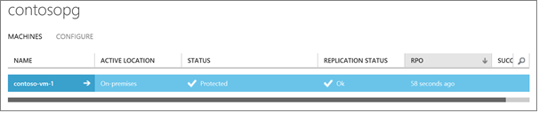

## Schritt 11: Festlegen geschützte Computereigenschaften

1. Nach ein Computer **geschützten** Status aufweist, können Sie dessen Eigenschaften Failover konfigurieren. Die Details für das Schutz Gruppe wählen Sie den Computer, und öffnen Sie die Registerkarte **Konfigurieren** .
2. Website Wiederherstellung vorgeschlagenen Eigenschaften für den Azure-virtuellen Computer automatisch und erkennt, dass die lokale Einstellungen Netzwerk.

    

3. Sie können diese Einstellungen ändern:

    -  **Name des Azure-virtuellen Computers**: Dies ist der Name, der auf dem Computer in Azure nach Failover gewährt wird. Der Name muss Azure Vorschriften entsprechen.

    -  **Azure virtueller Speicher**: die Anzahl der Netzwerkadapter wird durch die Größe, die Sie, für die Ziel-virtuellen Computern angeben vorgegeben. [Weitere Informationen finden Sie](../virtual-machines/virtual-machines-linux-sizes.md/#size-tables) Informationen zu Größen und Netzwerkadapter. Beachten Sie Folgendes:

        - Wenn Sie die Größe für einen virtuellen Computer ändern und speichern die Einstellungen, ändert sich die Anzahl der Netzwerkadapter beim nächsten die Registerkarte **Konfigurieren öffnen** . Die Anzahl der Netzwerkadapter Ziel virtueller Computer ist mindestens die Anzahl der Netzwerkadapter auf Quelle virtuellen Computern und die maximale Anzahl von Netzwerkadapter unterstützt, indem Sie die Größe des virtuellen Computers ausgewählt.
            - Wenn die Anzahl der Netzwerkadapter auf dem Quellcomputer kleiner oder gleich der Anzahl der Netzwerkadapter für die Größe des Target Computer zulässig ist, wird das Ziel als Quelle die gleiche Anzahl von Netzwerkadapter verfügbar.
            - Wenn die Anzahl der Netzwerkadapter für die Quelle virtuellen Computern die Höchstzahl überschreitet für die Zielgröße und dann das Ziel Größe Maximum verwendet werden soll.
            - Wenn beispielsweise ein Datenquelle Computer verfügt über zwei Netzwerkadapter und die Größe des Computers Target unterstützt vier, der Ziel-Computer werden zwei Netzwerkadapter haben. Wenn der Quellcomputer zwei Netzwerkadapter weist, aber die Größe der unterstützten Ziel nur einen unterstützt haben der Ziel-Computer nur einen Netzwerkadapter.
        - Wenn des virtuellen Computers weist mehrere Netzwerkadapter, die alle Netzwerkadapter sollten mit demselben Azure Netzwerk verbunden sind.
    - **Azure Netzwerk**: Geben Sie ein Azure-Netzwerk, die mit nach Failover Azure-virtuellen Computern verbunden werden soll. Wenn Sie keines angeben, wird nicht der Azure-virtuellen Computern mit keinem Netzwerk verbunden werden. Darüber hinaus müssen Sie ein Azure-Netzwerk angeben, wenn Sie zu der Website lokalen Failbacks aus Azure möchten. Failback erfordert eine VPN-Verbindung zwischen einer Azure Netzwerk und einem lokalen Netzwerk.
    - **Azure IP-Adresse/Subnetz**: für jeden Netzwerkadapter wählen Sie das Subnetz, der den Azure-virtuellen Computer verbinden sollten. Beachten Sie Folgendes:
        - Wenn der Netzwerkadapter des Quellcomputers so konfiguriert ist, um eine statische IP-Adresse zu verwenden, können Sie eine statische IP-Adresse für den Azure-virtuellen Computer angeben. Wenn Sie eine statische IP-Adresse nicht angeben, wird eine verfügbare IP-Adresse zugeordnet werden. Die Ziel-IP-Adresse angegeben, wird bereits von einem anderen virtuellen Computer in Azure verwendet, jedoch tritt Failover. Wenn der Netzwerkadapter des Quellcomputers so konfiguriert ist, um die Verwendung von DHCP müssen DHCP als die Einstellung für Azure Sie.

## Schritt 12: Erstellen einer Wiederherstellungsdatei planen und Ausführen eines Failovers

> [AZURE.VIDEO enhanced-vmware-to-azure-failover]

Sie können einen Failover für einen einzelnen Computer ausführen, oder Sie können über mehrere virtuelle Computer, der dieselbe Aufgabe durchführen, oder führen Sie die gleiche Arbeitsbelastung fehl. Über mehrere Computer gleichzeitig treten Sie einen Wiederherstellungsplan hinzufügen.

### Erstellen Sie einen Wiederherstellungsplan

1. Auf der Seite **Wiederherstellung Pläne** **Wiederherstellungsplan hinzufügen** klicken und Hinzufügen eines Wiederherstellungsplans. Geben Sie Details für den Plan aus, und wählen Sie **Azure** als Ziel.

    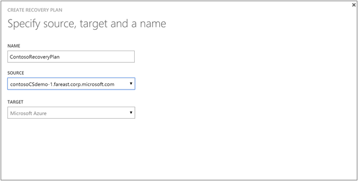

2. Klicken Sie auf **virtuellen Computern Wählen Sie** wählen Sie aus einer Gruppe "Schutz", und wählen Sie dann Autos in der Gruppe der Wiederherstellung Abonnementplan hinzufügen möchten.

    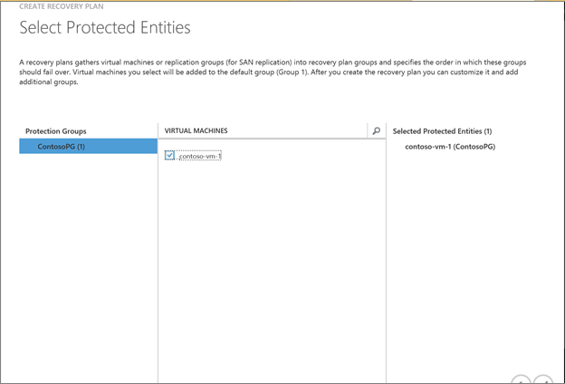

Sie können den Plan, Gruppen und Sequenz der Reihenfolge erstellen in der Computer in den Wiederherstellungsplan über Fehler beim sind anpassen. Sie können auch Skripts und fordert Sie auf manuelle Aktionen hinzufügen. Skripts können manuell oder mithilfe von [Azure Automatisierung Runbooks](site-recovery-runbook-automation.md)erstellt werden. [Erfahren Sie mehr](site-recovery-create-recovery-plans.md) über das Anpassen der Wiederherstellung Pläne.

## Ausführen eines Failovers

Beachten Sie, dass an, bevor Sie einen Failover ausführen:

- Stellen Sie sicher, dass der Management Server ausgeführt wird und verfügbar – andernfalls Failover schlägt fehl.
- Wenn Sie einer Notiz ungeplanten Failover ausführen:

    - Falls möglich sollten Sie primäre Autos ausschalten, bevor Sie ein ungeplantes Failover ausführen. Dies sorgt dafür, dass sowohl die Quell- und Replikatpfade Computern zur gleichen Zeit nicht. Wenn Sie virtuelle VMware-Computer repliziert sind können dann beim Ausführen eines ungeplanten Failovers Sie angeben, dass Website Wiederherstellung bemüht, beenden die Quelle Computer vornehmen soll. Je nach Status des primären Standorts dies möglicherweise oder funktioniert möglicherweise nicht. Wenn Sie physische Servern repliziert sind anbieten keine Website Wiederherstellung diese Option.
    - Bei der Durchführung eines ungeplanten Failovers beendet Replikation der Daten aus der primären Maschinen, damit alle Daten Delta wird nicht übertragen werden, nachdem ein ungeplantes Failover beginnt.

- Wenn Sie in Azure Replikat virtuellen Computer nach Failover verbinden möchten, aktivieren Sie Remote Desktop-Verbindung auf dem Quellcomputer ein, bevor Sie das Failover ausführen und RDP-Verbindung durch die Firewall zulassen. Sie müssen auch RDP auf den öffentlichen Azure-virtuellen Computern-Endpunkt nach Failover zu ermöglichen. Führen Sie diese [bewährte Methoden](http://social.technet.microsoft.com/wiki/contents/articles/31666.troubleshooting-remote-desktop-connection-after-failover-using-asr.aspx) , um sicherzustellen, dass RDP nach einem Failover funktioniert.

>[AZURE.NOTE] Um die Leistung zu verbessern, wenn Sie einen Failover Azure Aufgaben, stellen Sie sicher, dass Sie der Azure-Agent in der geschützten Computer installiert haben. Dies kann in schneller starten und auch bei Problemen Diagnose. Linux-Agent werden kann, gefundenen [hier](https://github.com/Azure/WALinuxAgent) - und Windows Agent finden Sie [hier](http://go.microsoft.com/fwlink/?LinkID=394789)

### Ausführen eines Failovers testen

Führen Sie einen Failover testen, um Ihre Failover und Wiederherstellung Geschäftsabläufe in einem Netzwerk isoliert zu reproduzieren, die Ihre Umgebung Herstellung beeinflussen nicht, und normale Replikation weiterhin normal. Test Failover eingestellt auf die Datenquelle, und Sie können auf verschiedene Weise ausführen:

- **Geben Sie ein Azure-Netzwerk**: Wenn Sie einen Test-Failover ohne Netzwerk der Test wird einfach überprüfen Sie ausführen, ob virtuellen Computern starten und in Azure ordnungsgemäß angezeigt werden. Virtuellen Computern wird nicht nach einem Failover Azure-Netzwerk verbunden sein.
- **Angeben einer Azure Netzwerk**: Diese Art von Failover überprüft, dass die gesamte Replikation Umgebung ordnungsgemäß bis stammen und Azure-virtuellen Computern mit dem angegebenen Netzwerk verbunden sind.

1. Der **Wiederherstellung Pläne** Seite Wählen Sie den Plan und dann auf **Failover testen**.

    

2. Wählen Sie **Bestätigen testen Failover** **keine** um anzugeben, dass Sie nicht möchten, das Test-Failover ein Azure-Netzwerk verwendet, oder wählen Sie das Netzwerk, das die Teststatistik eines virtuellen Computern nach Failover verbunden werden soll. Klicken Sie auf das Häkchen, um das Failover zu starten.

    

3. Failover Fortschritt auf der Registerkarte **Aufträge** .

    

4. Nach Abschluss des Failovers darüber hinaus müssen kann das Replikat Azure sehen Computer angezeigt werden, Azure-Portal > **virtuellen Computern**. Wenn Sie eine RDP-Verbindung zu den Azure-virtuellen Computer initiieren, Sie Port 3389 für den Endpunkt virtueller Computer öffnen müssen, möchten.

5. Nachdem Sie haben fertig sind, wenn Failover der abschließen erreicht testen Phase klicken Sie auf abgeschlossen Test auf Fertig stellen. In Notizen aufzeichnen und Speichern einer beliebigen Beobachtungen des Failovers Test zugeordnet.

6. Klicken Sie auf **das Failover Test abgeschlossen ist** , um die testumgebung automatisch zu bereinigen. Anschließend wird das Failover Test Status **abgeschlossen** angezeigt. Alle Elemente oder virtuellen Computern erstellt automatisch während des Failovers Test werden gelöscht. Beachten Sie, dass es, wenn mehr als zwei Wochen ein Test-Failover weiterhin erzwungen abgeschlossen ist.

### Ausführen eines ungeplanten Failovers

Ungeplantes Failover initiiert von Azure, und kann ausgeführt werden, auch wenn der primäre Standort nicht verfügbar ist.

1. Klicken Sie auf der Seite **Wiederherstellung Pläne** wählen Sie den Plan aus, und klicken Sie auf **Failover** > **Ungeplanten Failover**.

    

2. Wenn Sie VMware virtuellen Computern repliziert sind, die Sie auswählen können, versuchen Sie es, und fahren Sie mit lokal gehosteten virtuellen Computern. Dies ist die beste Leistung und Failover weiterhin, ob der Leistung oder nicht erfolgreich ist. Wenn sie nicht erfolgreich erscheint auf der Registerkarte **Aufträge **Fehlerdetails > **Ungeplanten Failover Aufträge**.

    

    >[AZURE.NOTE] Diese Option steht nicht zur Verfügung, wenn Sie physische Servern repliziert sind. Sie müssen versuchen, und fahren Sie diejenigen manuell falls möglich.

3. Vergewissern Sie sich **Bestätigen Failover** die Richtung Failover (in Azure), und wählen Sie des Wiederherstellung Punktes, den Sie für das Failover verwenden möchten. Wenn Sie Multi-virtuellen Computer aktiviert, wenn Sie so konfiguriert, dass die Replikationseigenschaften können Sie zu den neuesten Anwendung oder Absturz konsistente Wiederherstellungspunkt wiederherstellen. Sie können auch **benutzerdefinierte Wiederherstellung zeigen** Sie auf die zu einem früheren Zeitpunkt wiederherstellen auswählen. Klicken Sie auf das Häkchen, um das Failover zu starten.

    

3. Warten Sie, bis er ungeplanten Failover ausführen. Sie können Failover auf der Registerkarte **Aufträge** überwachen. Beachten Sie, dass selbst wenn während der ungeplanten Failover Fehler auftreten von der Wiederherstellungsplan ausgeführt wird, bis er abgeschlossen ist. Sie sollten auch das Replikat Azure finden Sie unter Computer werden in virtuellen Computern Azure-Portal.

### Herstellen einer Verbindung repliziert Azure-virtuellen Computern nach Failover mit

Um eine Verbindung herzustellen repliziert virtuellen Computern in Azure nach Failover hier ist, was Sie benötigen:

1. Auf dem primären Computer sollte eine Remotedesktop Verbindung aktiviert werden.
2. Die Windows-Firewall auf dem primären Computer RDP dürfen.
3. Nach einem Failover müssen Sie den öffentlichen Endpunkt für Azure-virtuellen Computern RDP hinzufügen.

[Weitere Informationen finden Sie](http://social.technet.microsoft.com/wiki/contents/articles/31666.troubleshooting-remote-desktop-connection-after-failover-using-asr.aspx) Informationen zum einrichten.

## Bereitstellen von weiteren Prozess

Wenn Sie Out skalieren die Bereitstellung Ihrer täglichen Änderung wie oft insgesamt Phasen 200 Quelle Computern überschreitet haben 2 TB sind zusätzliche Prozess-Servern die Lautstärke Datenverkehr verarbeitet erforderlich. Einrichten ein zusätzlichen Process-Server die Anforderungen in [zusätzliche Prozess Servern](#additional-process-servers) überprüfen und folgen Sie dann die Anweisungen, um den Prozess-Server einzurichten. Nach dem Einrichten des Servers können Sie die Quelle einen Computer, belastet konfigurieren.

### Richten Sie einen weiteren Prozessserver

Sie richten Sie einen weiteren Prozessserver wie folgt:

- Führen Sie den einheitlichen-Assistenten, um einen Management-Server als nur Prozessserver zu konfigurieren.
- Wenn Sie Datenreplikation mithilfe des neuen Prozess Servers verwalten möchten, müssen Sie Ihrer geschützten Computer dazu migrieren.

### Installieren Sie den Prozessserver

1. Laden Sie auf der Seite Schnellstart der einheitlichen Installationsdatei für die Website Wiederherstellung Komponenteninstallation aus. Führen Sie Setup.
2. Wählen Sie **zuerst sich daher** **zusätzliche Prozess-Servern Bereitstellung skalieren hinzufügen**.

    

3. Abschließen des Assistenten auf die gleiche Weise, wann Meinten, Sie den ersten Management Server [Einrichten](#step-5-install-the-management-server) .

4. Geben Sie in den **Details zur Konfiguration-Server** die IP-Adresse des ursprünglichen Management Servers auf dem Konfigurationsserver, und das Kennwort installiert. Auf dem ursprünglichen Management Server ausführen ** <SiteRecoveryInstallationFolder>\home\sysystems\bin\genpassphrase.exe – n** um das Kennwort zu erhalten.

    

### Migrieren von Maschinen, um den neuen Prozess-Server verwenden

1. Öffnen **Der Konfiguration-Servern** > **Server** >-Namen der ursprünglichen Management Server > **Server Details**.

    

2. Klicken Sie auf **Ändern Prozessserver** neben dem Server, die, den Sie ändern möchten, in der Liste **Prozess-Servers** .

    

3. In **Ändern Prozessserver** > **Ziel Prozess-Server** wählen Sie den neuen Management Server, und wählen Sie dann den virtuellen Computern, die der neuen Prozess-Server behandelt. Klicken Sie auf das Informationssymbol, um Informationen zu dem Server zu erhalten. Der Mittelwert Speicherplatz, die für jeden ausgewählten virtuellen Computer auf den neuen Prozessserver repliziert wird angezeigt, um Ihnen laden Entscheidungen treffen können. Klicken Sie auf das Häkchen um Replikation auf den neuen Prozess-Server zu starten.

    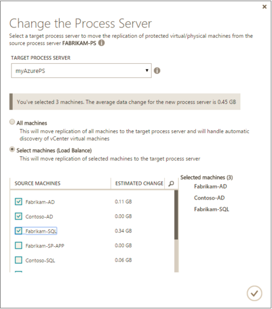

## VMware Berechtigungen für den Zugriff vCenter

Prozess-Server kann automatisch virtuellen Computern auf einem Server vCenter ermitteln. Um die automatische Erkennung ausführen müssen Sie eine Rolle (Azure_Site_Recovery) auf der Ebene vCenter Website Wiederherstellung Zugriff auf den Server vCenter dürfen definieren. Beachten Sie, dass, wenn Sie nur VMware Maschinen zu Azure migrieren und nicht müssen aus Azure Failback müssen, können Sie eine schreibgeschützte Rolle, deren ausreicht definieren. Legen Sie die Berechtigungen in beschriebenen [Schritt 6: Einrichten von Anmeldeinformationen für den Server vCenter](#step-6-set-up-credentials-for-the-vcenter-server) die Rollenberechtigungen werden in der folgenden Tabelle zusammengefasst.

**Rolle** | **Details** | **Berechtigungen**
--- | --- | ---
Azure_Site_Recovery Rolle | VMware VM-Ermittlung |Weisen Sie diese Berechtigungen für den Server V-Center:  Datenspeicher -> zuordnen Leerzeichen, durchsuchen Datenspeicher, geringere Ebene Datei Vorgänge., Datei entfernen, Update virtuellen Computern Dateien  Netzwerk-Netzwerk zuweisen >  Ressourcen -> zuweisen virtuellen Computern Ressourcenpool, virtuellen Computern ausgeschaltet migrieren, migrieren eingeschaltet virtuellen Computern  Aufgaben-Task erstellen, Update-Task >  Virtuellen Computern-Konfiguration >  Virtuellen Computern -> Interaktion-Frage beantworten, Gerät Verbindung., konfigurieren CD-Medien, Disketten konfigurieren, Power auszuschalten, klicken Sie auf >, VMware Tools installieren  Virtuellen Computern -> Inventory -> erstellen, Register Registrierung aufheben  Provisioning-virtuellen Computern > -> zulassen virtuellen Computern herunterladen, Hochladen von Dateien zulassen virtuellen Computern  Momentaufnahmen-virtuellen Computern > -> Momentaufnahmen entfernen
vCenter Benutzerrolle | VMware VM Discovery/Failover ohne war(en) der Quelle virtueller Computer | Weisen Sie diese Berechtigungen für den Server V-Center:  Data Center Objekt hat weitergeben untergeordneten Objekt, Rolle = schreibgeschützt   Der Benutzer Datacenter Ebene zugewiesen ist und daher Zugriff auf alle Objekte im Datencenter hat.  Wenn Sie den Zugriff einschränken möchten, Zuweisen von Rollen **keinen Zugriff** mit dem **weitergeben zu untergeordneten** Objekt zu untergeordneten Objekte (ESX Hosts, Datastores, virtuellen Computern und Netzwerken).
vCenter Benutzerrolle | Failover und failback | Weisen Sie diese Berechtigungen für den Server V-Center:  Datacenter Objekt – weitergeben untergeordneten Objekt, Rolle = Azure_Site_Recovery  Der Benutzer Datacenter Ebene zugewiesen ist und daher Zugriff auf alle Objekte im Datencenter hat.  Wenn Sie den Zugriff einschränken möchten, Zuweisen von Rollen **keinen Zugriff **mit der **untergeordneten Objekt weitergeben** zu untergeordneten Objekts (ESX Hosts, Datastores, virtuellen Computern und Netzwerken).  

## Hinweise zu Drittanbietern Software und Informationen

Keine übersetzen oder lokalisiert

Die Software und Firmware ausgeführt, in der Microsoft-Produkt oder Service basiert auf oder Material aus den unten aufgeführten Projekten übernimmt (zusammen "Drittanbieter Code").  Microsoft ist nicht ursprünglichen Autor des Codes Drittanbieter.  Der ursprünglichen obige Urheberrechtsvermerk und die Lizenz, unter dem Microsoft solche Drittanbieter-Code empfangen werden unten festgelegt.

Drittanbieter-Code Komponenten aus den unten aufgeführten Projekten bezieht sich auf die Informationen im Abschnitt A. Diese Lizenzen und die Informationen werden nur informativen Zwecken bereitgestellt.  Dieser Drittanbieter-Code wird Ihnen von Microsoft unter zur Lizenzierung von Microsoft Software-Lizenzbedingungen für Microsoft-Produkt oder Service relicensed wird.  

Die Informationen im Abschnitt B bezieht sich Code Drittanbieter-Komponenten auf, die Sie von Microsoft unter der ursprünglichen zur Lizenzierung Ausdrücke bereitgestellt werden.

Die vollständige Datei möglicherweise im [Microsoft Download Center](http://go.microsoft.com/fwlink/?LinkId=529428)gefunden werden. Microsoft behält sich vor alle Rechte hierin, nicht ausdrücklich gewährt, ob Benutzer durch Einbeziehung, Duldungsvollmacht oder auf andere Weise.

## Nächste Schritte

[Erfahren Sie mehr über Failback](site-recovery-failback-azure-to-vmware-classic.md) auf Computern ausgeführt werden in Azure der Fehler beim Schalten wieder in Ihrer lokalen Umgebung.
