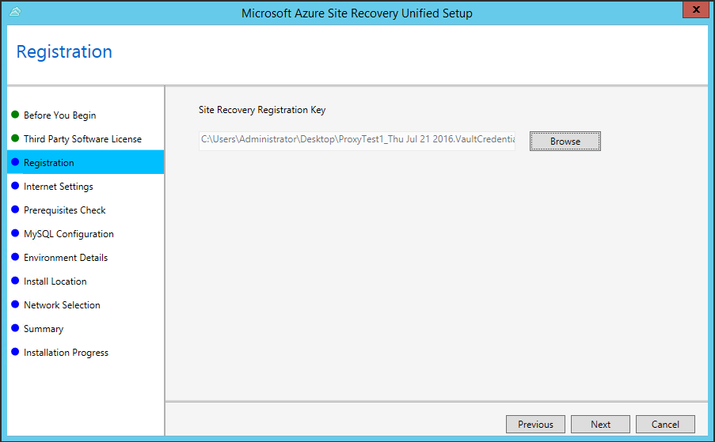
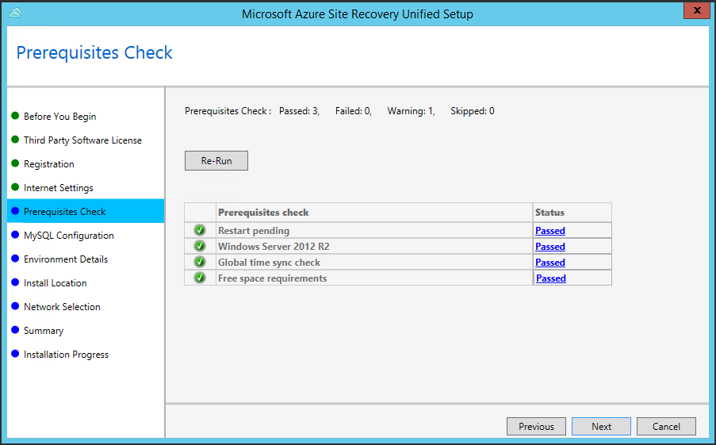
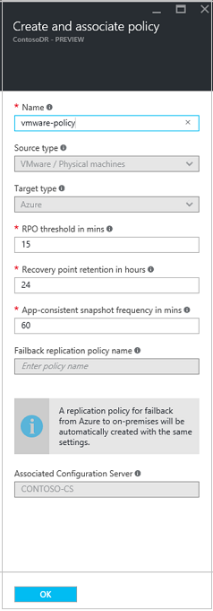

<properties
    pageTitle="VMware virtuellen Computern und Replikation physischen Servern auf Azure mit Azure Website Wiederherstellung im Portal Azure | Microsoft Azure"
    description="Beschreibt, wie Sie Azure Website Wiederherstellung zum Koordinieren von Replikation, Failover- und der lokalen VMware virtuellen Computern und Windows/Linux physische Server in der Azure-Portal mit Azure bereitstellen"
    services="site-recovery"
    documentationCenter=""
    authors="rayne-wiselman"
    manager="jwhit"
    editor=""/>

<tags
    ms.service="site-recovery"
    ms.workload="backup-recovery"
    ms.tgt_pltfrm="na"
    ms.devlang="na"
    ms.topic="article"
    ms.date="08/12/2016"
    ms.author="raynew"/>

# VMware virtuellen Computern und physische Computer Replikation auf Azure mit Azure Website Wiederherstellung über das Azure-portal

> [AZURE.SELECTOR]
- [Azure-Portal](site-recovery-vmware-to-azure.md)
- [Azure klassischen](site-recovery-vmware-to-azure-classic.md)
- [Azure klassischen (ältere Versionen)](site-recovery-vmware-to-azure-classic-legacy.md)

Willkommen bei Azure Website Wiederherstellung! Lesen Sie diesen Artikel, wenn lokalen VMware virtuellen Computern oder Windows/Linux physischen Servern in Azure Website Wiederherstellung Azure-Portal mit Azure repliziert werden soll.

> [AZURE.NOTE] Azure weist zwei verschiedenen [Bereitstellungsmodelle](../resource-manager-deployment-model.md) für das Erstellen und Arbeiten mit Ressourcen: Azure Ressource-Manager (Cloud) und der Standardansicht. Azure verfügt auch über zwei communityportalen – Azure klassischen Portals, die das Bereitstellungsmodell klassischen unterstützt, und der Azure-Portal mit Unterstützung für beide Bereitstellungsmodelle.

Website Wiederherstellung Azure-Portal bietet eine Reihe von neuen Funktionen:

- Die Dienste Azure-Sicherung und Wiederherstellung der Azure-Website sind in einer einzelnen Wiederherstellung Services Tresor zusammengefasst, sodass können Sie einrichten und Verwalten von Geschäftskontinuität und Wiederherstellung (BCDR) von einem einzigen Ort. Im einheitlichen Dashboard können Sie überwachen und Verwalten von Vorgängen in Ihrem lokalen Websites und der Azure öffentlichen Cloud.
- Benutzer mit nach der Bereitstellung mit der Cloud Lösung Provider (CSP) Programm Azure-Abonnements können jetzt Website Wiederherstellungsvorgängen Azure-Portal verwalten.
- Website Wiederherstellung Azure-Portal kann Autos an Cloud-Speicherkonten repliziert. Bei einem Failover erstellt Website Wiederherstellung Cloud-basierte virtuellen Computern in Azure.
- Website Wiederherstellung befindet sich die Unterstützung der Replikation auf klassische Speicherkonten. Bei einem Failover erstellt Website Wiederherstellung virtuellen Computern, die mit der Option Klassisch.

Nach dem Lesen diesen Artikel Beitrag Kommentare in den Kommentaren Disqus unten. Fragen Sie technische im [Azure Wiederherstellung Services-Forum](https://social.msdn.microsoft.com/forums/azure/home?forum=hypervrecovmgr).

## (Übersicht)

Organisationen benötigen eine BCDR Strategie, die bestimmt, wie apps, Auslastung und Daten bleiben während der geplanten und ungeplanten Ausfallzeiten ausgeführt werden und verfügbar, und zum normalen Arbeit Umständen so früh wie möglich wiederherzustellen. Strategische BCDR sollten Geschäftsdaten beibehalten, sicherer und wiederhergestellt, und vergewissern Sie sich Auslastung kontinuierlich verfügbar bleiben, wenn bei Datenverlusten.

Website Wiederherstellung ist eine Azure-Dienst, der zur strategische BCDR beiträgt, indem orchestriert Replikation von physische Server lokal und in der Cloud (Azure) oder zu einem sekundären Datencenter-virtuellen Computern an. Treten Ausfall in gewohnten Standort befinden, fehl Sie über den zweiten Standort zum Aktualisieren von apps und Auslastung zur Verfügung. Sie fehl zurück zur gewohnten Standort befinden, wenn sie normale Vorgänge zurückgibt. Erfahren Sie mehr in [Neuigkeiten Azure Website Wiederherstellung?](site-recovery-overview.md)

Dieser Artikel enthält alle Informationen, die Sie repliziert müssen VMware virtuellen Computern und Windows/Linux physische Azure-Server lokal an. Es enthält eine Übersicht über die Architektur, Planen von Informationen und Bereitstellungsschritte zum Konfigurieren von Azure, lokalen Servern, Replikation Einstellungen und Kapazität zu planen. Nach dem Einrichten der Infrastruktur haben Sie Replikation auf Computern, die Sie schützen aktivieren können, und überprüfen Sie, dass die Failover funktioniert möchten.

## Vorteile für Unternehmen

- Website Wiederherstellung bietet einen externen Schutz für Business Auslastung und Anwendung, die auf VMware virtuellen Computern und physische Server ausgeführt.
- Das Portal Wiederherstellung bietet einen Speicherort zum Einrichten, verwalten und Überwachen der Replikation, Failover und Wiederherstellung.
- Website Wiederherstellung kann VMware virtuellen Computern hinzugefügt vSphere Hosts automatisch ermitteln.
- Sie können ganz einfach Failovers aus Ihrer lokalen Infrastruktur Azure und Failback (Wiederherstellen) aus Azure VMware VM-Servern in Ihrer lokalen Website ausführen.
- Sie können Multi-virtuellen Computer aktivieren und Replikationsgruppen erstellen, damit Auslastung über mehrere Maschinen Replikation zur gleichen Zeit gestuft. Alle Computer in einer Replikationsgruppe haben Absturz konsistente und konsistente app Wiederherstellungspunkte, wenn sie sich über nicht. Failoververarbeitung können Sie mehrere Computer in Wiederherstellung Pläne erfassen, damit gestufte Auslastung zusammen über fehl.

## Unterstützte Betriebssysteme

### Windows-(nur 64-Bit)
- Windows Server 2008 R2 SP1 oder höher
- WindowsServer 2012
- Windows Server 2012 R2

### Linux (nur 64-Bit)
- Red Hat Enterprise Linux 6,7, 7.1, 7.2
- CentOS 6.5, 6.6, 6,7, 7.0, 7.1, 7.2
- Oracle Enterprise Linux 6.4, 6.5 unter der Red Hat kompatibel Kernel oder Enterprise Kernel unverwüstliche Release 3 (UEK3)
- SUSE Linux Enterprise Server 11 SP3

## Szenario-Architektur

Dies sind die Szenariokomponenten:

- **Konfigurations-Server**: einer lokalen Computer, die Kommunikation koordiniert und verwaltet Daten Replikation und Wiederherstellung Prozesse. Auf diesem Computer wird eine einzelne Setupdatei zum Installieren der Konfigurationsserver und diese zusätzlichen Komponenten ausgeführt wird:
    - **Prozess-Server**: fungiert als Gateway Replikation. Es empfängt Replikationsdaten von geschützten Quelle Maschinen, optimiert ihn mit zwischenspeichern, Komprimierung und Verschlüsselung und sendet es an Azure-Speicher. Auch Pushbenachrichtigungen Installation des Diensts Mobilität geschützten Computern behandelt, und automatische Erkennung von VMware virtuellen Computern ausführt. Der Prozess Standardserver wird auf dem Konfigurationsserver installiert. Sie können weitere eigenständigen Prozess Server, um Ihre Bereitstellung skalieren bereitstellen.
    - **Gestaltungsvorlagen Ziel-Server**: Replikationsdaten während des Failbacks aus Azure behandelt.

- **Mobilität Dienst**: Diese Komponente bereitgestellt wird, auf jedem Computer (VMware VM oder physischen Server), die auf Azure repliziert werden soll. Schreiben von Daten auf dem Computer erfasst und an den Prozess-Server weiterleitet.
- **Azure**: Sie müssen keine Azure-virtuellen Computern zum Behandeln von Replikation und Failover auf Azure zu erstellen.  Sie benötigen eine Azure-Abonnement ein Konto Azure-Speicher repliziert Daten und ein Azure-virtuellen Netzwerk speichern, damit Azure-virtuellen Computern nach Failover mit einem Netzwerk verbunden sind. Die Speicher-Konto und das Netzwerk muss sich in derselben Region als der Wiederherstellung Services Tresor.
- **Failback**: Wenn Sie nach einem Failover zu Ihrer Website lokalen wieder aus Azure treten bereit sind, müssen Sie eine Azure-virtuellen Computer als temporäre Prozessserver erstellen. Sie können sie nach Abschluss der Failback löschen. Für das Failback auch benötigen Sie eine VPN (oder Azure ExpressRoute) Verbindung zwischen der lokalen Website und der Azure Netzwerk, in dem Ihre Azure-virtuellen Computern gespeichert sind. Ist Failback Datenverkehr beanspruchen müssen Sie auch eine dedizierte Master Ziel-Server Computer lokalen einrichten. Für den Datenverkehr heller kann master Ziel Standardserver ausgeführt wird, auf dem Konfigurationsserver verwendet werden.

Die Grafik zeigt, wie diese Komponenten interagieren.

**Abbildung 1: VMware/physische in Azure**

## Azure erforderliche Komponenten

Hier sind, was in Azure müssen Sie dieses Szenario bereitstellen.

**Voraussetzung** | **Details**
--- | ---
**Azure-Konto**| Benötigen Sie ein [Microsoft Azure](http://azure.microsoft.com/) -Konto ein. Sie können mit einer [kostenlosen Testversion](https://azure.microsoft.com/pricing/free-trial/)beginnen. [Erfahren Sie mehr](https://azure.microsoft.com/pricing/details/site-recovery/) über die Website Wiederherstellung Preise.
**Azure-Speicher** | Replizierte Daten in Azure-Speicher gespeichert und Azure-virtuellen Computern erstellt werden, wenn ausgeführt wird.   Zum Speichern der Daten benötigen Sie ein Speicherkonto standard oder Premium in derselben Region als der Wiederherstellung Services Tresor.  Sie können ein LRS oder GRS Speicher-Konto verwenden. Wir empfehlen GRS, so dass Daten ist flexibel, wenn ein regionalen Ausfall auftritt, oder die primäre Region nicht wiederhergestellt werden kann. [Erfahren Sie mehr](../storage/storage-redundancy.md).   [Premium-Speicher](../storage/storage-premium-storage.md) wird in der Regel für virtuellen Computern verwendet, die eine konsistente leistungsstarke EA und niedrige Wartezeit zu Host EA stark Auslastung benötigen.   Wenn Sie ein Konto Premium speichern replizierte Daten verwenden möchten, benötigen Sie auch, ein standard Speicherkonto, um die Replikation Protokolle speichern, die laufende Änderungen lokaler Daten zu erfassen.   Beachten Sie, dass der Azure-Portal erstellte Speicherkonten zwischen Ressourcengruppen verschoben werden können. Auch wird Schutz auf Premium Speicherkonten in zentralen Indien und Südliche Indien derzeit nicht unterstützt.   [Informationen zu](../storage/storage-introduction.md) Azure-Speicher.
**Azure Netzwerk** | Sie benötigen ein Azure-virtuelles Netzwerk, dem mit Azure-virtuellen Computern verbunden werden soll, wenn ausgeführt wird. Das Azure virtuelle Netzwerk muss sich in derselben Region als der Wiederherstellung Services Tresor.
**Failback aus Azure** | Sie benötigen eine temporäre Prozessserver als eine Azure-virtuellen Computer einrichten. Sie können diese erstellen, wenn Sie bereit sind, zu wieder fehl, und löschen Sie ihn nach Fail wieder abgeschlossen ist.   Zum Fehlschlagen benötigen wieder eine VPN-Verbindung (oder Azure ExpressRoute) aus dem Azure Netzwerk zur lokalen Website Sie.

## Konfigurationsserver / Prozess erforderliche Komponenten zu skalieren

Sie können einer lokalen Computer als Konfigurationsserver einrichten / Skalierung Prozessserver.

**Voraussetzung** | **Details**
--- | ---
**Konfigurationsserver**| Sie benötigen eine lokale physischen oder virtuellen Computern unter Windows Server 2012 R2. Alle lokalen Website Wiederherstellung Komponenten sind auf diesem Computer installiert.  Für VMware VM Replikation empfehlen wir, dass Sie auf den Server als eine hoch verfügbare VMware VM bereitstellen. Wenn Sie physische Computer repliziert sind kann den Computer einer physischen Server handeln.   Failback zu der Website lokalen aus Azure ist immer zu VMware virtuellen Computern unabhängig davon, ob Sie über einen virtuellen Computern oder physischen Servern fehlgeschlagen ist. Wenn Sie den Konfigurationsserver als eine VMware VM bereitstellen, nicht müssen Sie einen separaten master Zielserver als eine VMware VM einrichten Failback Datenverkehr empfangen.  Wenn der Server eine VMware VM ist, sollte der Grafikkarte Netzwerk VMXNET3 sein. Wenn Sie einen anderen Typ von Netzwerkadapter verwenden, müssen Sie eine [VMware aktualisieren](https://kb.vmware.com/selfservice/microsites/search.do?cmd=displayKC&docType=kc&externalId=2110245&sliceId=1&docTypeID=DT_KB_1_1&dialogID=26228401&stateId=1) auf dem Server vSphere 5.5 installieren.  Der Server sollte eine statische IP-Adresse verfügen.  Der Server darf kein Domain Controller sein.  Der Hostname des Servers sollten 15 Zeichen oder weniger.  Das Betriebssystem sollte nur Englisch sein.   Sie müssen VMware vSphere PowerCLI 6.0 installieren. auf dem Konfigurationsserver.  Der Konfigurationsserver benötigt Zugriff auf das Internet an. Ausgehender Zugriff ist erforderlich:  Temporären Zugriff auf HTTP-80 während der Installation der Website Wiederherstellung Komponenten (zum Herunterladen von MySQL)  Laufenden ausgehenden Zugriff auf HTTPS 443 für Replikations-management  Laufenden ausgehenden Zugriff auf HTTPS 9443 für Replikationsdatenverkehr (dieser Port kann geändert werden)  Der Server benötigen außerdem Zugriff auf die folgenden URLs, damit es in Azure zugreifen kann: *. hypervrecoverymanager.windowsazure.com; *. AccessControl.Windows.NET; *. backup.windowsazure.com; *. BLOB.Core.Windows.NET; *. store.core.windows.net  Wenn Sie die IP-Adresse-basierte Firewall-Regeln auf dem Server haben, überprüfen Sie, dass die Regeln Kommunikation mit Azure zulassen. Sie müssen die [Azure Datacenter IP-Bereiche](https://www.microsoft.com/download/confirmation.aspx?id=41653) und das Protokoll HTTPS (443) zulassen.  Lassen Sie die IP-Adressbereiche für die Azure Region Ihres Abonnements, und Westen US.  Erlauben Sie diese URL für den MySQL-Download:.http://cdn.mysql.com/archives/mysql-5.5/mysql-5.5.37-win32.msi

## VMware vCenter/vSphere Host erforderliche Komponenten

**Voraussetzung** | **Details**
--- | ---
**vSphere**| Sie benötigen mindestens VMware vSphere Hypervisoren.  Hypervisoren sollte mit den neuesten Updates vSphere Version 6.0, 5.5 oder 5.1 ausgeführt werden.  Es empfiehlt sich, dass Ihre vSphere Hosts und vCenter-Server in demselben Netzwerk wie den Prozess-Server befinden (werden im Netzwerk, in dem sich der Konfigurationsserver befindet, es sei denn, Sie eine dedizierte Prozessserver eingerichtet haben.).
**vCenter** | Es empfiehlt sich, dass ein VMware vCenter Server zum Verwalten Ihrer vSphere Hosts bereitgestellt werden. Es sollte vCenter Version 6.0 oder 5.5 mit den neuesten Updates ausgeführt werden.  Beachten Sie, dass die Website Wiederherstellung unterstützt keine neuen vCenter und vSphere 6.0 Features wie cross, vCenter vMotion, virtuelle Datenmengen und Speicher DRS. Website Wiederherstellung Support ist beschränkt auf Features, die auch in der Version 5.5 verfügbar waren.

## Voraussetzungen für die geschützten Computer

**Voraussetzung** | **Details**
--- | ---
**Lokal (VMware virtuellen Computern)** | VMware virtuellen Computern, die Sie schützen möchten, sollten VMware Tools installiert sein und ausgeführt haben.   Maschinen, die Sie schützen möchten, sollte mit [Azure erforderliche Komponenten](site-recovery-best-practices.md#azure-virtual-machine-requirements) zum Erstellen von Azure-virtuellen Computern entsprechen.  Einzelne die Speicherkapazität auf geschützten Computern dürfen nicht mehr als 1023 GB entsprechen. Ein virtueller Computer kann bis zu 64 Datenträger haben (also bis zu 64 TB).   Mindestens 2 GB verfügbarer Speicherplatz auf dem Laufwerk für die Installation von Komponenten.  Schutz von virtuellen Maschinen mit verschlüsselten Datenträger wird nicht unterstützt.  Freigegebene Datenträger Gast, Cluster nicht unterstützt werden.  **Port 20004** sollte auf lokale Firewall geschützten virtuellen Computern geöffnet werden, wenn Sie die **Anwendungskonsistenz**aktivieren möchten.  Computer, auf denen Unified Extensible Firmware Interface (UEFI) / Boot Extensible Firmware Interface(EFI) wird nicht unterstützt.  Computernamen sollten zwischen 1 und 63 Zeichen (Buchstaben, Zahlen und Bindestriche) enthalten. Der Name muss mit einem Buchstaben oder einer Zahl beginnen und enden mit einen Buchstaben oder eine Zahl. Nachdem Sie die Replikation für einen Computer aktiviert haben, können Sie den Namen der Azure ändern.  Wenn die Quelle virtueller Computer NIC-Kombination verfügt wird es in einen einzelnen Netzwerkadapter nach Failover auf Azure konvertiert.  Geschützten virtuellen Computern iSCSI-Datenträger haben wandelt dann Website Wiederherstellung den geschützten virtuellen Computer iSCSI-Datenträger in eine virtuelle Festplatte Datei bei der virtuellen Computer über in Azure schlägt fehl. Wenn das iSCSI-Ziel über den Azure-virtuellen Computer erreicht werden kann wird es zu verbinden und finden Sie im Wesentlichen zwei Datenträger – der Datenträger virtuelle Festplatte des Azure-virtuellen Computers und die Quelle iSCSI-Datenträger. In diesem Fall müssen Sie das iSCSI-Ziel zu trennen, das die Azure-virtuellen Computers angezeigt wird.
**Windows-Computer (physisch oder VMware)** | Sollte der Computer ein unterstütztes 64-Bit-Betriebssystem ausgeführt werden: Windows Server 2012 R2, Windows Server 2012 oder Windows Server 2008 R2 mit am minimalen SP1.   Klicken Sie auf das Laufwerk C:\ sollte das Betriebssystem installiert werden. Der Datenträger OS sollten eine einfache Windows-Datenträger und nicht dynamisch. Der Datenträger kann dynamisch sein.  Website Wiederherstellung unterstützt virtuellen Computern ein RDM Datenträger. Während des Failbacks verwendet Website Wiederherstellung den Datenträger RDM erneut, wenn die ursprüngliche Quelle virtueller Computer und RDM Datenträger verfügbar ist. Wenn sie nicht verfügbar sind, während des Failbacks erstellt Website Wiederherstellung eine neue VMDK-Datei für jeden Datenträger.
**Linux-Computern** (Phyical oder VMware)|  Sie benötigen ein unterstütztes 64-Bit-Betriebssystem: Red Hat Enterprise Linux 6.7,7.1,7.2; CentOS 6.5, 6.6,6.7,7.0,7.1,7.2; Oracle Enterprise Linux 6.4, 6.5 kompatibel Kernel Red Hat oder unverwüstliche Enterprise Kernel Release 3 (UEK3), SUSE Linux Enterprise Server 11 SP3 ausgeführt.  / etc/hosts-Dateien auf geschützten Computern sollte Einträge enthalten, die alle Netzwerkadapter zugeordneten IP-Adressen den lokale Hostname zuordnen.  Verbindung mit einer Azure-virtuellen Computern Linux nach System durch Verwendung eines Secure Shell-Clients (ssh) ausgeführt werden soll, stellen Sie sicher, dass der Secure Shell-Dienst auf dem geschützten Computer festgelegt ist, um bei Systemstart automatisch starten und Firewall-Regeln zulassen einer ssh Verbindung dazu.  Der Hostname, Bereitstellungspunkte, Gerät, und Linux Systempfade und Dateinamen (z.B./usw. /; / usr) sollte nur auf Englisch verfügbar sein.  Schutz kann nur für Linux-Computern mit den folgenden Speicher aktiviert werden: File System (EXT3, ETX4, ReiserFS, XFS); Mehrere Pfade Software Gerät Mapper (mehrere Pfade)); Volumen-Manager: (LVM2). Physische Server mit HP CCISS Controller Speicher werden nicht unterstützt. Das Dateisystem ReiserFS wird nur unter SUSE Linux Enterprise Server 11 SP3 unterstützt.  Website Wiederherstellung unterstützt virtuellen Computern ein RDM Datenträger.  Während des Failbacks für Linux wiederverwenden keine Website Wiederherstellung den Datenträger RDM. Stattdessen wird eine neue VMDK-Datei für jeden entsprechenden RDM Datenträger erstellt.  Stellen Sie sicher, dass Sie die Einstellung disk.enableUUID=true in den virtuellen Computer in VMware die Konfigurationsparameter festlegen. Erstellen Sie den Eintrag aus, wenn es nicht vorhanden ist. Es hat erforderlich sind eine konsistente UUID der VMDK-Datei zur Verfügung stellen, damit sie ordnungsgemäß bereitgestellt. Hinzufügen von dieser Einstellung wird sichergestellt, dass nur Delta Änderungen während Failback und nicht um eine vollständige Replikation wieder auf lokale übertragen werden.
**Mobilität-Dienst** |  **Windows**: Sie erhalten, um Pushbenachrichtigungen automatisch Mobilität Dienst auf virtuellen Computern unter Windows, die Sie müssen ein Administratorkonto (lokaler Administrator auf dem Windows-Computer) bieten, sodass der Prozess-Server eine Installation Pushbenachrichtigungen ausführen kann.  **Linux**: um Pushbenachrichtigungen automatisch Mobilität Dienst auf virtuellen Computern mit Linux müssen Sie ein Konto zu erstellen, die vom Prozessserver zum Führen Sie einer Installations Pushbenachrichtigungen verwendet werden können.   Standardmäßig werden alle Datenträger auf einem Computer repliziert. Auf [einen Datenträger aus der Replikation ausschließen](#exclude-disks-from-replication)möchten muss Mobilität Dienst manuell auf dem Computer installiert sein, bevor Sie die Replikation aktivieren. 

## Bereiten für Bereitstellung vor

So bereiten Sie Bereitstellung zu benötigen:

1. [Richten Sie ein Azure-Netzwerk](#set-up-an-azure-network) in der Azure-virtuellen Computern gespeichert werden, wenn sie nach einem Failover erstellt wird, sind. Darüber hinaus Failbacks müssen Sie zum Einrichten einer VPN-Verbindung (oder Azure ExpressRoute) aus dem Azure Netzwerk Ihrer lokalen Website.
2. [Richten Sie ein Konto Azure-Speicher](#set-up-an-azure-storage-account) für repliziert Daten.
3. [Vorbereiten eines Kontos](#prepare-an-account-for-automatic-discovery) auf dem Server vCenter oder vSphere hostet, sodass die Website Wiederherstellung VMware virtuellen Computern, die hinzugefügt werden, automatisch erkennen können.
4. [Vorbereiten der Konfigurationsserver](#prepare-the-configuration-server) , um sicherzustellen, dass können Sie erforderliche URLs zugreifen und vSphere PowerCLI 6.0 installieren.

### Richten Sie eine Azure Netzwerk

- In der gleichen Azure Region als, sollten in dem Sie den Wiederherstellung Services Tresor bereitstellen werden im Netzwerk.
- Je nach Ressourcenmodell, die, dem Sie für verwenden, über Azure-virtuellen Computern fehlgeschlagen ist möchten, werden Sie in der [Cloud](../virtual-network/virtual-networks-create-vnet-arm-pportal.md) oder [klassischen Modus](../virtual-network/virtual-networks-create-vnet-classic-pportal.md)Azure Netzwerk einrichten.
- Um zu Ihrer lokalen VMware Website wieder aus Azure fehlschlagen benötigen Sie eine VPN-Verbindung (oder eine Verbindung Azure ExpressRoute) aus dem Azure Netzwerk, in dem die repliziert Azure-virtuellen Computern, mit dem lokalen Netzwerk befinden in denen der Konfigurationsserver gespeichert ist.
- [Erfahren Sie mehr über](../vpn-gateway/vpn-gateway-site-to-site-create.md) die unterstützten Bereitstellung Modelle für VPN Standorten Verbindungen, und wie Sie [eine Verbindung einrichten](../vpn-gateway/vpn-gateway-site-to-site-create.md#create-your-virtual-network).
- Alternativ können Sie [Azure ExpressRoute](../expressroute/expressroute-introduction.md)einrichten. [Erfahren Sie mehr](../expressroute/expressroute-howto-vnet-portal-classic.md) über das Einrichten einer Azure Netzwerk mit ExpressRoute.

> [AZURE.NOTE] [Migration von Netzwerken](../resource-group-move-resources.md) zwischen Ressourcengruppen innerhalb des gleichen Abonnements oder übergreifend Abonnements wird Netzwerke für die Website Wiederherstellung nicht unterstützt.

### Richten Sie ein Konto Azure-Speicher

- Sie benötigen einen Standard oder ein Premium Azure-Speicher-Konto, um auf Azure repliziert Daten enthalten. Das Konto muss sich in derselben Region als der Wiederherstellung Services Tresor. Je nach Ressourcenmodell, die, dem Sie für verwenden, über Azure-virtuellen Computern fehlgeschlagen ist möchten, können Sie ein Konto in der [Cloud](../storage/storage-create-storage-account.md) oder [klassischen Modus](../storage/storage-create-storage-account-classic-portal.md)einrichten.
- Wenn Sie ein Konto Premium für repliziert Daten, die müssen Sie ein zusätzliches standard-Konto zum Replikation Protokolle speichern, die laufende Änderungen lokaler Daten aufnehmen zu erstellen verwenden.  

> [AZURE.NOTE] [Migration von Speicherkonten](../resource-group-move-resources.md) zwischen Ressourcengruppen innerhalb des gleichen Abonnements oder übergreifend Abonnements wird Speicherkonten für die Bereitstellung von Website-Wiederherstellung nicht unterstützt.

### Vorbereiten eines Kontos zur automatischen Erkennung

Prozess-Server-Website Wiederherstellung kann VMware virtuellen Computern automatisch ermitteln, vSphere Hosts oder auf einem vCenter Server, der Hosts verwaltet werden. Zum automatischen ausführen kann Discovery, dass die Website Wiederherstellung Anmeldeinformationen, die VMware Server zugreifen. Dies ist nicht relevant, wenn Sie nur physische Computer repliziert sind.

1. Zum verwenden ein dediziertes Kontos zur automatischen Erkennung eine Rolle (beispielsweise Azure_Site_Recovery) Ebene der vCenter mit den [erforderlichen Berechtigungen](#vmware-account-permissions)erstellen.
2. Erstellen Sie einen neuen Benutzer auf dem Host oder vCenter vSphere und dem Benutzer weisen Sie die Rolle zu. Teilen Sie später Website Wiederherstellung diese Anmeldeinformationen kennen, damit automatische Erkennung ausgeführt werden kann.

    >[AZURE.NOTE] Ein Benutzerkonto vCenter mit einer Rolle schreibgeschützt Failover ausgeführt werden kann, aber kann nicht geschützten Quelle Autos herunter. Wenn Sie diese Computer beenden möchten, benötigen Sie die Rolle des [Azure_Site_Recovery](#vmware-account-permissions) . Wenn Sie virtuellen Computern nur von VMware in Azure migrieren sind und Failback brauchen ist die Rolle schreibgeschützt ausreichend.

### Vorbereiten des Servers Konfiguration

1.  Stellen Sie sicher, dass der Computer, die, den Sie für die Konfigurationsserver verwenden, die [erforderliche Komponenten](#configuration-server-prerequisites)entspricht. Insbesondere stellen Sie sicher, dass der Computer über diese Einstellungen mit dem Internet verbunden ist:

    - Den Zugriff auf diese URLs: *. hypervrecoverymanager.windowsazure.com; *. AccessControl.Windows.NET; *. backup.windowsazure.com; *. BLOB.Core.Windows.NET; *. store.core.windows.net
    - Zulassen Sie Zugriff auf [http://cdn.mysql.com/archives/mysql-5.5/mysql-5.5.37-win32.msi](http://cdn.mysql.com/archives/mysql-5.5/mysql-5.5.37-win32.msi) MySQL herunterladen.
    - Ermöglicht der Firewall Kommunikation Azure mit der [Azure Datacenter IP-Adressbereiche](https://www.microsoft.com/download/confirmation.aspx?id=41653) und das Protokoll HTTPS (443).

2.  Herunterladen und Installieren von [VMware vSphere PowerCLI 6.0](https://developercenter.vmware.com/tool/vsphere_powercli/6.0) auf dem Konfigurationsserver. (Derzeit nicht zur Verfügung anderen Versionen von PowerCLI unterstützt einschließlich R Versionen von Version 6.0,.)

## Erstellen einer Wiederherstellungsdatei Services Tresor

1. Melden Sie sich mit dem [Azure-Portal](https://portal.azure.com)aus.
2. Klicken Sie auf **neue** > **Management** > **Sicherung und Wiederherstellung der Website (OMS)**. Alternativ können Sie klicken, **Navigieren Sie** > **Wiederherstellung Services Tresor** > **Hinzufügen**.

    

3. Geben Sie im Feld **Name** einen Anzeigenamen ein, um den Tresor zu identifizieren. Wenn Sie mehr als ein Abonnement besitzen, wählen Sie einen davon.
4. [Erstellen einer neuen Ressourcengruppe](../resource-group-template-deploy-portal.md) oder ein vorhandenes Layout auszuwählen. Geben Sie einen Bereich Azure an. In diesem Bereich werden Autos repliziert werden. Beachten Sie, dass Azure-Speicher und Netzwerke für die Website Wiederherstellung in derselben Region sein müssen. Zum Überprüfen der unterstützte Regionen finden Sie unter geografischen Verfügbarkeit in [Azure Website Wiederherstellung Preise-Details](https://azure.microsoft.com/pricing/details/site-recovery/)
4. Wenn Sie schnell den Tresor aus dem Dashboard zugreifen möchten klicken Sie auf **Pin zum Dashboard** , und klicken Sie dann auf **Erstellen**.

    

Der neue Tresor wird angezeigt, auf dem **Dashboard** > **alle Ressourcen**, und klicken Sie auf dem primären **Wiederherstellung Services Depots** Blade.

## Erste Schritte

Website Wiederherstellung bietet eine erste Schritte-Benutzeroberfläche dazu ausgelegt, erhalten Sie von und so schnell wie möglich ausgeführt werden. Erforderliche Komponenten überprüft und führt Sie durch die Schritte, die Sie die Website Wiederherstellung bereitgestellt erfragen müssen.

Wähle Sie den Typ der Computer repliziert werden soll, und auf repliziert werden soll. Sie richten Sie die Infrastruktur, einschließlich der lokalen Servern, Azure-Einstellungen, Replikations-Policy und Kapazität zu planen. Nach Ihrer Infrastruktur vorhanden ist, können Sie Replikation für virtuellen Computern und physische Server. Sie können dann Failovers für bestimmte Computer ausführen oder Wiederherstellung Pläne auf mehreren Computern treten erstellen.

Beginnen Sie erste Schritte, indem Sie auswählen, wie Sie Website Wiederherstellung bereitstellen möchten. Erste Schritte illustrieren ändert sich etwas je nach Ihren Anforderungen Replikation.

## Schritt 1: Wählen Sie Ihre Schutzziele

Wählen Sie repliziert werden soll, und wo auf repliziert werden soll.

1. Das Blade **Wiederherstellung Services Depots** wählen Sie Ihrem Tresor aus und dann auf **Einstellungen**.
2. In den **Einstellungen** > **Erste Schritte** , klicken Sie auf **Website Wiederherstellung** > **Schritt 1: Vorbereiten Infrastruktur** > **Schutz Zielsetzung**.

    

3. **Schutz** Ziels wählen Sie **Zu Azure aus**, und wählen Sie **Ja, mit VMware vSphere Hypervisor**. Klicken Sie dann auf **OK**.

    

## Schritt 2: Einrichten der Umgebung Quelle

Richten Sie den Kontokonfigurations-Server und in der Wiederherstellung Services Tresor zu registrieren. Wenn Sie virtuelle VMware-Computer repliziert sind Geben Sie das VMware-Konto, das Sie für die automatische Erkennung verwenden.

1. Klicken Sie auf **Schritt 1: Vorbereiten der Infrastruktur** > **Quelle**. In der **Quelle vorbereiten** Wenn Sie besitzen auf einen Konfigurationsserver klicken **+ Konfigurationsserver** mehrwertiges Nachschlagefeld hinzugefügt.

    

2. In den **Server hinzufügen** Blade Kontrollkästchen dieser **Server Konfiguration** , die in **Geben Server**angezeigt wird.
3. Überprüfen Sie vor dem Einrichten des Konfiguration Servers [erforderliche Komponenten](#configuration-server-prerequisites). In bestimmten überprüfen, dass der Computer die erforderlichen URLs zugreifen kann.
4.  Laden Sie die Website Wiederherstellung Unified Installation Setupdatei.
5.  Herunterladen der Tresor Registrierungsschlüssel. Sie benötigen diese beim Unified Setup. Der Schlüssel ist gültig für 5 Tage, nachdem Sie es erstellt haben.

    

6.  Führen Sie auf dem Computer, die, den Sie als dem Konfigurationsserver verwenden, Unified einrichten, um den Konfigurationsserver, den Prozess-Server und dem Ziel master-Server zu installieren.

### Ausführen der Website Wiederherstellung Unified einrichten

1.  Führen Sie die Unified Installation Setupdatei.
2.  Wählen Sie im **zuerst sich daher** **Installieren der Konfiguration Servers und einer Prozess**ein.

    

3. Klicken Sie auf **ich stimme** zum Herunterladen und Installieren von MySQL, in **Drittanbieter-Softwarelizenz** .

    

4. Klicken Sie in der **Registrierung** suchen Sie, und wählen Sie die Registrierungsschlüssel, die Sie aus dem Tresor heruntergeladen haben.

    

5. Geben Sie im **Internet Einstellungen** an, wie der Anbieter ausgeführt wird, auf dem Konfigurationsserver mit Azure Website Wiederherstellung über das Internet verbinden möchten.

    - Wählen Sie **Verbinden mit vorhandenen Proxyeinstellungen**mit dem Proxy herstellen, die aktuell auf dem Computer eingerichtet werden soll.
    - Wählen Sie **direkt ohne einen Proxy verbinden**, wenn Sie den Anbieter direkt verbinden möchten.
    - Wenn der vorhandene Proxy Authentifizierung erfordert oder einen benutzerdefinierten Proxy für die Verbindung zu einem Internetdienstanbieter verwenden möchten, wählen Sie **Verbinden mit benutzerdefinierten Proxyeinstellungen**.
        - Wenn Sie einen benutzerdefinierten Proxy verwenden, den Sie die Adresse, den Port und die Anmeldeinformationen angeben müssen
        - Wenn Sie einen Proxy verwenden sollte Sie die [erforderlichen Komponenten](#configuration-server-prerequisites)beschrieben URLs bereits zulässig.

    

6. In **Erforderliche Komponenten prüfen** führt Setup ein Häkchen, um sicherzustellen, dass die Installation ausgeführt werden kann. Stellen Sie sicher, dass die Uhrzeit auf die Systemuhr (**Datum und Uhrzeit** Einstellungen) die gewünschte Zeitzone identisch ist, wird eine Warnung, über den **globale Zeit Synchronisieren aktivieren angezeigt** .

    

7. Erstellen Sie **MySQL** -Konfiguration Anmeldeinformationen für die Anmeldung an der MySQL-Server-Instanz, die installiert werden.

    

8. **Details zur Umgebung** auswählen, ob Sie nun virtuelle VMware-Computer repliziert. Wenn Sie sich befinden, überprüft einrichten, dass PowerCLI 6.0 installiert ist.

    

9. **Installieren von einem Speicherort** auswählen, in die Binärdateien installieren und speichern den Cache werden soll. Sie können ein Laufwerk mit mindestens 5 GB Speicher verfügbar auswählen, doch empfehlen wir Cachelaufwerk mit mindestens 600 GB freier Festplattenspeicher.

    

10. Geben Sie die Zuhörer (Netzwerkadapter und SSL-Anschluss), an dem der Konfigurationsserver werden Replikationsdaten senden und empfangen **Netzwerk** Auswahl an. Sie können die Standardeinstellung ändern port (9443). Zusätzlich zu diesem Port wird Port 443 von einem Webserver verwendet die Replikationsvorgänge koordiniert. 443 dürfen nicht für den Empfang von Replikationsdatenverkehr verwendet werden.

    

11.  **Zusammenfassung** überprüfen Sie die Informationen und dann auf **Installieren**. Nach Abschluss der Installation wird ein Kennwort generiert. Sie benötigen diese Informationen beim Aktivieren der Replikation also kopieren und an einem sicheren Ort aufbewahren.

    

12.  Nach Abschluss der Registrierung den Server wird angezeigt, in den **Einstellungen** > **Servern** vorher in den Tresor.

#### Führen Sie Setup über die Befehlszeile

Sie können die Konfigurationsserver über die Befehlszeile einrichten:

    UnifiedSetup.exe [/ServerMode <CS/PS>] [/InstallDrive <DriveLetter>] [/MySQLCredsFilePath <MySQL credentials file path>] [/VaultCredsFilePath <Vault credentials file path>] [/EnvType <VMWare/NonVMWare>] [/PSIP <IP address to be used for data transfer] [/CSIP <IP address of CS to be registered with>] [/PassphraseFilePath <Passphrase file path>]

Parameter:

- / ServerMode: obligatorisch. Gibt an, ob die Konfiguration und den Prozess-Servern installiert werden soll, oder den Prozess-Server. Eingabewerte: CS, folgenden
- InstallLocation: obligatorisch. Der Ordner, in dem die Komponenten installiert sind.
- / MySQLCredsFilePath. Obligatorisch. Der Dateipfad, in dem die MySQL-Serveranmeldeinformationen gespeichert sind. Die Datei sollte in diesem Format:
    - [MySQLCredentials]
    - MySQLRootPassword = "<Password>"
    - MySQLUserPassword = "<Password>"
- / VaultCredsFilePath. Obligatorisch. Die Position der Datei Tresor Anmeldeinformationen
- / EnvType. Obligatorisch. Die Art der Installation. Werte: VMware, NonVMware
- / PSIP und /CSIP. Obligatorisch. Die IP-Adresse des Servers Prozess und Konfigurationsserver.
- / PassphraseFilePath. Obligatorisch. Die Position der Datei ein Kennwort.
- / BypassProxy. Optional. Gibt an, dass der Konfigurationsserver und Azure ohne einen Proxy besteht.
- / ProxySettingsFilePath. Optional. Proxyeinstellungen (der Standardproxy erfordert Authentifizierung oder einen benutzerdefinierten Proxy). Die Datei sollten in diesem Format:
    - [ProxySettings]
    - ProxyAuthentication = "Ja/Nein"
    - Proxy IP = "IP-Adresse >"
    - ProxyPort = "<Port>"
    - ProxyUserName = "<User Name>"
    - ProxyPassword = "<Password>"
- DataTransferSecurePort. Optional. Port-Nummer für Replikationsdaten verwendet werden.
- SkipSpaceCheck. Optional. Leerzeichen prüfen Cache zu überspringen.
- AcceptThirdpartyEULA. Obligatorisch. Kennzeichnung impliziert Annahme von Drittanbietern Endbenutzer-Lizenzvertrag.
- ShowThirdpartyEULA. Obligatorisch. Zeigt die Drittanbieter-Endbenutzer-Lizenzvertrag. Als Eingabe bereitgestellt werden alle anderen Parameter ignoriert.

### Fügen Sie das Konto VMware für automatische Erkennung

 Wenn Sie für die Bereitstellung vorbereitet sollten Sie die [erstellt ein VMware-Konto](#prepare-an-account-for-automatic-discovery) verfügen, die für die automatische Erkennung Wiederherstellung Website verwenden können. Fügen Sie dieses Konto wie folgt ein:

1. Öffnen Sie **CSPSConfigtool.exe**. Es ist als eine Verknüpfung auf dem Desktop verfügbar und sich im Ordner \home\svsystems\bin [Ort installieren].
2. Klicken Sie auf **Konten verwalten** > **Konto hinzuzufügen**.

    

3. Fügen Sie das Konto aus, das für die automatische Erkennung verwendet werden soll, in **Account Details** . Beachten Sie, dass sie mindestens 15 Minuten für den Namen des Kontos im Portal angezeigt werden ausführen kann. Um sofort zu aktualisieren, klicken Sie auf **Der Konfiguration-Servern** > Servername > **Server aktualisieren**.

    

### Herstellen einer Verbindung vSphere Hosts und vCenter Server mit

Wenn Sie virtuelle VMware-Computer repliziert sind mit der vSphere Hosts und vCenter Servern verbinden.

1. Stellen Sie sicher, dass der Konfigurationsserver Netzwerkzugriff auf die vSphere Hosts und vCenter Servern hat.
2. Klicken Sie auf **Vorbereiten Infrastruktur** > **Quelle**. Wählen Sie in der **Quelle vorbereiten** den Konfigurationsserver, und klicken Sie auf **+ vCenter** um einen vSphere Host oder vCenter Server hinzuzufügen.
3. Geben Sie einen Anzeigenamen für die vSphere Host oder vCenter Server **vCenter hinzufügen** , und geben Sie die IP-Adresse oder den vollqualifizierten Domänennamen des Servers. Lassen Sie den Port als 443 ein, es sei denn, Ihre VMware Server konfiguriert sind, um Anfragen auf einem anderen Port abfragt. Wählen Sie das Konto, das auf dem Server VMware Verbindung verwendet wird. Klicken Sie auf **OK**.

    

    >[AZURE.NOTE] Wenn Sie die vCenter Server oder vSphere Host mit einem Konto an, die auf dem Server vCenter oder Hostnamen nicht über Administratorrechte verfügen hinzufügen möchten, stellen Sie sicher, dass das Konto diese Berechtigungen aktiviert ist: Datacenter, Datenspeicher, Ordner, Host, Netzwerk, Ressourcen, virtuellen Computers vSphere verteilt wechseln. Darüber hinaus benötigt der Server vCenter im Speicher Ansichten Recht.

Wiederherstellung Website mit einem VMware Server mit den Einstellungen, die Sie angegeben und erkennt virtuellen Computern, verbunden.

## Schritt 3: Einrichten von zielumgebung

Stellen Sie sicher, dass Sie haben ein Speicherkonto für Replikation und ein Azure-Netzwerk mit dem Azure-virtuellen Computern nach Failover verbinden möchten.

1.  Klicken Sie auf **Vorbereiten Infrastruktur** > **Ziel** , und wählen Sie die zu verwendende Azure-Abonnement.
2.  Geben Sie das Modell zur Bereitstellung, die, das Sie nach einem Failover für virtuelle Computer verwenden möchten.
3.  Website Wiederherstellung überprüft, dass Sie eine oder mehrere Konten kompatibel Azure-Speicher und Netzwerken haben.

    

4.  Wenn Sie ein Speicherkonto keine eingegangen sind und Sie eine erstellen möchten mit der Cloud klicken Sie auf **+ Speicher-Konto** in dieser eingebetteten führen.  Geben Sie auf das Blade **Speicher-Konto erstellen** einer Kontonamen, Typ, Abonnement und Speicherort aus. Das Konto sollte in derselben Region als der Wiederherstellung Services Tresor.

    

    Beachten Sie Folgendes:

    - Wenn Sie ein Speicherkonto mithilfe der Option Klassisch erstellen möchten wird im Portal Azure folgt. [Weitere Informationen](../storage/storage-create-storage-account-classic-portal.md)
    - Wenn Sie ein Premium Speicher-Konto für repliziert Daten verwenden, die Sie ein Konto zusätzlichen standard-Speicher zum Einrichten müssen, meldet Store Replikation dieser erfassen laufenden Änderungen lokaler Daten.

    > [AZURE.NOTE] Schutz auf Premium Speicherkonten in zentralen Indien und Südliche Indien wird derzeit nicht unterstützt.

4.  Wählen Sie ein Azure-Netzwerk aus. Wenn Sie noch nicht erstellt, einem Netzwerk haben und Sie tun, die möchten mit der Cloud **+ Netzwerk** Ausführen dieser eingebetteten klicken. Geben Sie einen Netzwerknamen, Adressbereichs, Subnetdetails, Abonnement und Speicherort, auf das Blade **virtuelles Netzwerk erstellen** . Im Netzwerk am selben Speicherort wie der Wiederherstellung Services Tresor hinzugefügt werden.

    

    Wenn Sie ein Netzwerk mit der Option Klassisch erstellen möchten wird im Portal Azure folgt. [Erfahren Sie mehr](../virtual-network/virtual-networks-create-vnet-classic-pportal.md).

## Schritt 4: Einrichten von Replikations-Einstellungen

1. Klicken Sie zum Erstellen einer neuen Replikations Richtlinie auf **Vorbereiten Infrastruktur** > **Replikation Einstellungen** > **+ Erstellen und zuordnen**.
2. **Erstellen** und zuordnen Richtlinie Geben Sie einen Richtliniennamen ein.
3. In **RPO Schwellenwert**: wird die Begrenzung RPO angegeben. Benachrichtigungen werden generiert werden, wenn fortlaufender Replikation dieser Grenzwert überschritten wird.
5. **Wiederherstellung zeigen Aufbewahrungsrichtlinien**Geben Sie Stunden wie lange ist, wird das Fenster Aufbewahrung für jeden Wiederherstellungspunkt sein. Geschützte Maschinen können an einer beliebigen Stelle in einem Fenster wiederhergestellt werden. Bis zu 24 Stunden Aufbewahrung wird auf Premium Speicher repliziert Maschinen unterstützt.
6. **App-konsistente Momentaufnahme Häufigkeit**, geben Sie an wie oft (in Minuten) Wiederherstellungspunkte, enthält die Anwendung konsistent Momentaufnahmen erstellt werden.
7. Beim Erstellen einer Replikationsrichtlinie ist standardmäßig eine übereinstimmende Richtlinie automatisch für Failback erstellt. Für das Beispiel ist die Replikationsrichtlinie **Rep-Richtlinie** und dann die Failbackrichtlinie **Rep-Richtlinie-Failback**gehört. Diese Richtlinie ist nicht verwendet, bis Sie ein Failback einleiten.  
8. Klicken Sie auf **OK** , um die Richtlinie zu erstellen.

    

9. Beim Erstellen einer neuen Richtlinie hat es automatisch mit dem Konfigurationsserver zugeordnet ist. Klicken Sie auf **OK**.

    

## Schritt 5: Planen der Kapazität

Jetzt, da Sie Ihre Basic haben Infrastruktur, die Sie einrichten kann denken Kapazität Planung und ermitteln, ob Sie zusätzliche Ressourcen benötigen.

Website Wiederherstellung bietet eine Kapazität können Sie die richtigen Ressourcen für Ihre Umgebung Quelle, die Website Wiederherstellung Komponenten, Netzwerke und Speicher zugewiesen werden können. Sie können den Planer im Schnellmodus für Abschätzung basierend auf einer durchschnittlichen Anzahl von virtuellen Computern, Datenträger und Speicher oder im detaillierten Modus, in dem Sie Zahlen auf der Ebene Arbeitsbelastung Eingabemethoden werden, ausführen. Bevor Sie beginnen müssen Sie:

- Sammeln Sie Informationen über Ihre Replikations-Umgebung, einschließlich virtuellen Computern, Datenträger pro virtuellen Computern und Speicherplatz pro Laufwerk ein.
- Schätzen der täglichen Rendite ändern (Änderung), die Sie für repliziert Daten haben. Die [vSphere Kapazität, Planung Einheit](https://labs.vmware.com/flings/vsphere-replication-capacity-planning-appliance) können Ihnen dabei helfen.

1.  Klicken Sie auf **herunterladen** , um das Tool herunterladen, und führen Sie es. [Lesen Sie den Artikel](site-recovery-capacity-planner.md) , der das Tool begleitet.
2.  Wenn Sie damit fertig sind select **Ja** **haben Sie Kapazität Planung abgeschlossen?**

    

In der nachfolgenden Tabelle zeichnet eine Anzahl von Punkten zur Unterstützung bei der Planung für dieses Szenario Kapazität.

**Komponente** | **Details**
--- | --- | ---
**Replikation** | **Maximale täglich Änderung Zins**– ein geschützter Computer können Sie nur eine Prozessserver und ein einzelnen Prozess-Server kann eine täglich verarbeitet ändern bewerten bis zu 2 TB. Somit ist 2 TB an, dass die maximalen täglichen Daten Zins ändern, die für einen geschützten Computer unterstützt wird.   **Maximale Durchsatz**– ein replizierter Computer angehören können eine Speicher-Konto in Azure. Ein standard Speicherkonto kann bis zu 20.000 Abfragen pro Sekunde verarbeitet, und es wird empfohlen, dass Sie die Anzahl der IOPS über einen Quellcomputer 20.000 beibehalten. Für Beispiel wenn Sie über einen Quellcomputer mit 5 Festplatten und auf jedem Datenträger verfügen 120 IOPS (8 K Größe) auf die Quelle generiert wird dann in der Azure pro Datenträger IOPS maximal 500 sein. Die Anzahl der erforderlichen Speicherkonten = Summe Quelle IOPs/20000.
**Konfigurationsserver** | Der Konfigurationsserver sollten die tägliche Änderung Zins Kapazität über alle Auslastung, die auf geschützten Computern verarbeiten und ausreichend Bandbreite kontinuierlich Daten auf Azure-Speicher repliziert benötigt.   Als bewährte Methode empfiehlt sich, dass der Konfigurationsserver befinden sich in der gleichen Netzwerk und LAN-Segment wie die Computer, die Sie schützen möchten. Es kann sich in einem anderen Netzwerk befinden aber Maschinen, die Sie schützen möchten sollte L3 Netzwerk Sichtbarkeit darauf.   Größe Empfehlungen für den Konfigurationsserver werden in der folgenden Tabelle zusammengefasst.
**Prozessserver** | Der erste Prozessserver ist standardmäßig auf dem Konfigurationsserver installiert. Sie können zusätzliche Prozess-Server, um Ihre Umgebung skalieren bereitstellen. Beachten Sie Folgendes:   Prozess-Server empfängt Replikationsdaten von geschützten Computern und optimiert die es mit zwischenspeichern, Komprimierung und Verschlüsselung vor dem Senden an Azure. Der Prozess Servercomputer sollten ausreichende Ressourcen zum Ausführen dieser Aufgaben verfügen.   Prozess-Server verwendet Datenträger-basiertes Cache. Es empfiehlt sich, einen separaten Cachedatenträger 600 GB oder mehr verarbeitet Daten Änderungen, die bei einem Ausfall Netzwerkengpass gespeichert.

### Größe Empfehlungen für den Konfigurationsserver

**CPU** | **Arbeitsspeicher** | **Datenträger Cachegröße** | **Ändern von Daten Zins** | **Geschützte Computer**
--- | --- | --- | --- | ---
8 vCPUs (Sockets 2 * 4 Kernen @ 2,5 GHz) | 16 GB | 300 GB | 500 GB oder weniger | Weniger als 100 Computern repliziert werden.
12 vCPUs (2 Sockets * 6 Kerne @ 2,5 GHz) | 18 GB | 600 GB | 500 GB bis 1 TB | Zwischen 100-150 Computern repliziert werden.
16 vCPUs (2 Sockets * 8 Kernen @ 2,5 GHz) | 32 GB | 1 TB | 1 TB bis 2 TB | Zwischen 150-200 Computern repliziert werden.
Bereitstellen von einem anderen Prozessserver | | | > 2 TB | Bereitstellen Sie zusätzliche Prozess-Server, wenn Sie maximal 200 Computern repliziert sind oder, wenn die täglichen Daten ändern Rate 2 TB überschreitet.

Wobei Folgendes gilt:

- Jeder Quellcomputer wird mit 3 Datenträger von 100 GB konfiguriert.
- Wir verwendet benchmarking Speicherung von 10 K u/Min 8 SAS-Laufwerke mit RAID 10 für Cache Datenträger Maße.

### Größe Empfehlungen für den Prozess-server

Wenn Sie mehr als 200 Computern geschützt werden muss oder pro Tag ändern größer als 2 TB ist können Sie zusätzliche Prozess-Server so, dass die Replikationslast bewältigt hinzufügen. Zum Skalieren, Sie können:

- Erhöhen Sie die Anzahl der Konfigurationsserver an. Beispielsweise können Sie bis zu 400-Computer mit zwei Konfiguration Servern schützen.
- Zusätzliche Prozess Servern hinzufügen und verwenden Sie diese den Verkehr statt (oder zusätzlich zu) im Konfigurationsserver.

In dieser Tabelle werden ein Szenario, in dem beschrieben:

- Sie sind nicht mit dem Konfigurationsserver als Prozessserver planen.
- Sie haben einen weiteren Prozessserver einrichten.
- Sie haben die geschützten virtuellen Computern mit zusätzlichen Prozess-Server konfigurieren.
- Jeder Quellcomputer geschützten wird mit drei Datenträger von 100 GB konfiguriert.

**Konfigurationsserver** | **Zusätzliche Prozessserver**| **Datenträger Cachegröße** | **Ändern von Daten Zins** | **Geschützte Computer**
--- | --- | --- | --- | ---
8 vCPUs (Sockets 2 * 4 Kernen @ 2,5 GHz), 16 GB Arbeitsspeicher | 4 vCPUs (Sockets 2 * 2 Kernen @ 2,5 GHz), 8 GB Arbeitsspeicher | 300 GB | 250 GB oder weniger | Kleiner oder gleich 85 Autos repliziert werden.
8 vCPUs (Sockets 2 * 4 Kernen @ 2,5 GHz), 16 GB Arbeitsspeicher | 8 vCPUs (Sockets 2 * 4 Kernen @ 2,5 GHz), 12 GB Arbeitsspeicher | 600 GB | 250 GB zu 1 TB | Zwischen 85-150 Computern repliziert werden.
12 vCPUs (2 Sockets * 6 Kerne @ 2,5 GHz), 18 GB Arbeitsspeicher | 12 vCPUs (2 Sockets * 6 Kerne @ 2,5 GHz) 24 GB Arbeitsspeicher | 1 TB | 1 TB bis 2 TB | Zwischen 150-225 Computern repliziert werden.

Die Möglichkeit, in der Sie Ihre Server skalieren, wird out-Modell skalieren oder die gewünschte Einstellung für einen Maßstab von abhängig.  Nach oben durch die Bereitstellung von wenigen High-End-Konfiguration und Prozess-Servern skalieren oder skalieren indem Sie mehr Server mit weniger Ressourcen. Beispiel: Wenn Sie 220 Autos geschützt werden muss könnten Sie eine der folgenden Aktionen ausführen:

- Richten Sie den Kontokonfigurations-Server mit 12vCPU, 18 GB Arbeitsspeicher, einem weiteren Prozessserver mit 12vCPU, 24 GB Arbeitsspeicher, und konfigurieren Sie der geschützte Maschinen, um nur den zusätzlichen Prozess-Server verwenden.
- Alternativ konnte Sie zwei Konfigurationsserver (2 X 8vCPU, 16 GB RAM) und zwei zusätzliche Prozess-Server (1 x 8vCPU) und 4vCPU x 1 135 + 85 (220) Autos verarbeitet konfigurieren, und konfigurieren geschützte Maschinen, um nur die zusätzliche Prozess-Server verwenden.

Sie [Anweisungen](#deploy-additional-process-servers) zum Einrichten einer zusätzlichen Prozess-Servers ein.

### Netzwerk Bandbreite Aspekte

Die Kapazitätsplanertools können die Bandbreite zu berechnen, die Sie für die Replikation (erste Replikation und dann Delta müssen). Um den Umfang der Bandbreite verwenden für die Replikation steuern müssen Sie einige Optionen aus:

- **Bandbreite**: VMware, die in Azure repliziert Netzwerkverkehr über einen bestimmten Prozess-Server. Sie können die Bandbreite auf deren Computern als Prozess-Servern einschränken.
- **Bandbreite beeinflussen**: Sie können die Replikation mithilfe von ein paar Registrierungsschlüsseln verwendete Bandbreite beeinflussen:
    - Der Registrierungseintrag **HKEY_LOCAL_MACHINE\SOFTWARE\Microsoft\Windows Azure Backup\UploadThreadsPerVM** gibt die Anzahl der, der für die Datenübertragung (Initiale oder Delta Replikation) eines Datenträgers verwendet werden. Ein höherer Wert erhöht die Bandbreite für die Replikation verwendet.
    - Die **HKEY_LOCAL_MACHINE\SOFTWARE\Microsoft\Windows Azure Backup\DownloadThreadsPerVM** gibt die Anzahl der Threads, die für die Datenübertragung während des Failbacks verwendet.

#### Bandbreite

1. Öffnen Sie das Microsoft Azure Sicherung MMC-Snap-in auf dem Computer, der als den Prozess-Server fungiert. Standardmäßig ist eine Abkürzung für Microsoft Azure Sicherung auf dem Desktop oder in c:\Programme\Microsoft c:\Programme\Microsoft Azure Wiederherstellung Services Agent\bin\wabadmin verfügbar.
2. Klicken Sie auf **Eigenschaften ändern**, in dem Snap-in.

    

3. Klicken Sie auf der Registerkarte **Beschränkung** die Option **Internet Bandbreite Verwendung begrenzungsebene für zusätzliche Vorgänge aktivieren**, und legen Sie die Grenzwerte für die Arbeit und nicht-Arbeit Stunden. Gültige Bereiche sind 512/s und 102/s pro Sekunde.

    

Sie können auch das Cmdlet " [Set-OBMachineSetting](https://technet.microsoft.com/library/hh770409.aspx) " verwenden, begrenzungsebene festlegen. Hier ist ein Beispiel:

    $mon = [System.DayOfWeek]::Monday
    $tue = [System.DayOfWeek]::Tuesday
    Set-OBMachineSetting -WorkDay $mon, $tue -StartWorkHour "9:00:00" -EndWorkHour "18:00:00" -WorkHourBandwidth  (512*1024) -NonWorkHourBandwidth (2048*1024)

**Set-OBMachineSetting-NoThrottle** gibt an, dass keine Beschränkung erforderlich ist.

#### Netzwerk-Bandbreite beeinflussen

1. Navigieren Sie in der Registrierung zu **HKEY_LOCAL_MACHINE\SOFTWARE\Microsoft\Windows Azure Backup\Replication**.
    - Um den Datenverkehr Bandbreite auf einem Datenträger repliziert beeinflussen, ändern Sie den Wert der **UploadThreadsPerVM**, oder erstellen Sie die Taste aus, wenn es nicht vorhanden ist.
    - Um die Bandbreite für Failback Datenverkehr aus Azure beeinflussen, ändern Sie den Wert **DownloadThreadsPerVM**ein.
2. Der Standardwert ist 4. In einem Netzwerk "overprovisioned" sollte diese Registrierungsschlüssel aus der Standardwerte geändert werden. Das Maximum beträgt 32. Überwachen Sie den Datenverkehr in den Wert zu optimieren.

## Schritt 6: Repliziert Applikationen

Stellen Sie sicher, dass Computer repliziert werden soll für die Installation eines Mobilität vorbereitet sind und anschließend die Replikation aktivieren.

### Installieren Sie den Dienst Mobilität

Schutz für virtuellen Computern und physischen Server ermöglichen der erste Schritt besteht darin Mobilität Dienst zu installieren. Dies auf verschiedene Weise kann erfolgen:

- **Prozess Server Pushbenachrichtigungen**: Wenn Sie die Replikation auf einem Computer zu aktivieren, drücken Sie die Komponente und installieren Mobilität Dienst aus den Prozess-Server. Beachten Sie, dass Pushbenachrichtigungen Installation wird nicht auftreten, wenn der Computer bereits eine nach-oben-Todate Version der Komponente ausgeführt werden.
- **Enterprise-Pushbenachrichtigungen**: die Komponente mithilfe von Pushbenachrichtigungen Enterprise Prozesses wie WSUS oder System Center-Konfigurations-Manager oder [Azure Automatisierung und Konfiguration gewünschte Zustand](./site-recovery-automate-mobility-service-install.md)automatisch installiert. Richten Sie die Konfigurationsserver, bevor Sie dies tun.
- **Manuelle Installation**: Installieren Sie die Komponente manuell auf jedem Computer, der repliziert werden soll. Richten Sie die Konfigurationsserver, bevor Sie dies tun.

#### Bereiten Sie für automatische Pushbenachrichtigungen auf Computern unter Windows vor

So sieht wie Windows-Computer vorzubereiten, sodass der Dienst Mobilität durch den Prozess-Server automatisch installiert werden kann.

1.  Erstellen Sie ein Konto aus, die vom Prozessserver zum Zugreifen auf des Computers verwendet werden kann. Das Konto muss Administratorrechte (lokal oder Domäne) verfügen, und es wird nur für die Installation von Pushbenachrichtigungen verwendet.

    >[AZURE.NOTE] Wenn Sie eine Domänenkonto nicht verwenden, müssen Sie Benutzerzugriff Remote-Steuerelement auf dem lokalen Computer zu deaktivieren. Fügen Sie hierzu im Journal unter HKEY_LOCAL_MACHINE\SOFTWARE\Microsoft\Windows\CurrentVersion\Policies\System den DWORD-Eintrag LocalAccountTokenFilterPolicy mit dem Wert 1 hinzu. Um den Registrierungseintrag aus einem CLI Typ hinzufügen **`REG ADD HKEY_LOCAL_MACHINE\SOFTWARE\Microsoft\Windows\CurrentVersion\Policies\System /v LocalAccountTokenFilterPolicy /t REG_DWORD /d 1`**.

2.  Klicken Sie auf die Windows-Firewall des Computers möchten Sie schützen, und wählen **Zulassen einer app oder Feature durch die Firewall**ein. Aktivieren Sie die **Datei- und Druckerfreigabe** und **Windows-Verwaltungsinstrumentation**. Für Maschinen, die zu einer Domäne gehören, können Sie die Firewalleinstellungen für ein Gruppenrichtlinienobjekt konfigurieren.

    

2. Fügen Sie das Konto aus, die, das Sie erstellt haben:

    - Öffnen Sie **Cspsconfigtool**. Es ist als eine Verknüpfung auf dem Desktop verfügbar und sich im Ordner \home\svsystems\bin [Ort installieren].
    - Klicken Sie auf der Registerkarte **Konten verwalten** auf **Konto hinzufügen**.
    - Fügen Sie das Konto aus, die, das Sie erstellt haben. Nachdem Sie das Konto hinzugefügt haben, müssen Sie die Anmeldeinformationen bereitstellen, wenn Sie die Replikation für einen Computer aktivieren.

#### Bereiten Sie für automatische Pushbenachrichtigungen auf Linux-Servern vor

1.  Stellen Sie sicher, dass der Linux-Computer, die, den Sie schützen möchten, unterstützt wird, wie in der [geschützten Computer erforderlichen Komponenten](#protected-machine-prerequisites)beschrieben. Sicherstellen, dass es ist Netzwerkkonnektivität zwischen dem Linux-Computer und den Prozess-Server.

2.  Erstellen Sie ein Konto aus, die vom Prozessserver zum Zugreifen auf des Computers verwendet werden kann. Das Konto sollten Root-Benutzers auf dem Server der Quelle Linux und es wird nur für die Installation von Pushbenachrichtigungen verwendet.

    - Öffnen Sie **Cspsconfigtool**. Es ist als eine Verknüpfung auf dem Desktop verfügbar und sich im Ordner \home\svsystems\bin [Ort installieren].
    - Klicken Sie auf der Registerkarte **Konten verwalten** auf **Konto hinzufügen**.
    - Fügen Sie das Konto aus, die, das Sie erstellt haben. Nachdem Sie das Konto hinzugefügt haben, müssen Sie die Anmeldeinformationen bereitstellen, wenn Sie die Replikation für einen Computer aktivieren.

3.  Überprüfen Sie, dass die Datei/etc/Hosts serverseitig Linux Quelle Einträge enthält, die alle Netzwerkadapter zugeordneten IP-Adressen die lokale Hostname zuordnen.
4.  Installieren der neuesten Openssh, Openssh auf einem Server, auf dem Computer Openssl-Paketen repliziert werden soll.
5.  Stellen Sie sicher, dass SSH auf Anschluss 22 aktiviert ist und ausgeführt wird.
6.  Aktivieren Sie SFTP Subsystem und Kennwortauthentifizierung in der Datei Sshd_config wie folgt ein:

    - Melden Sie sich als Root an.
    - Suchen Sie die Zeile, die mit **PasswordAuthentication**beginnt, in der Datei /etc/ssh/sshd_config Datei.
    - Kommentieren Sie die Zeile, und ändern Sie den Wert von **keine** auf **Ja**.
    - Kommentieren Sie die Zeile, und suchen Sie die Zeile, die mit **Subsystem** beginnt.

        

### Manuell installieren der Dienst Mobilität

Der Installer sind auf dem Server Konfiguration in **c:\Programme\Microsoft Dateien (x86) \Microsoft Azure Site Recovery\home\svsystems\pushinstallsvc\repository**verfügbar.

Quellbetriebssystem | Mobilität Installation Dienstdatei
--- | ---
Windows Server (nur 64-Bit) | Microsoft-ASR_UA_9. *.0.0_Windows_* release.exe
CentOS 6.4, 6.5, 6.6 (nur 64-Bit) | Microsoft-ASR_UA_9. *.0.0_RHEL6-64_*release.tar.gz
SUSE Linux Enterprise Server 11 SP3 (nur 64-Bit) | Microsoft-ASR_UA_9. *.0.0_SLES11-SP3-64_*release.tar.gz
Oracle Enterprise Linux 6.4, 6.5 (nur 64-Bit) | Microsoft-ASR_UA_9. *.0.0_OL6-64_*release.tar.gz

#### Installieren Sie Service Mobilität auf einem WindowsServer

1. Herunterladen Sie, und führen Sie das Installationsprogramm relevante.
2. Wählen Sie in der **Vorbemerkung** **Mobilität Dienst**ein.

    

3. Geben Sie in den **Details zur Konfiguration-Server** die IP-Adresse des Servers Konfiguration und das Kennwort ein, das bei der Ausführung von Setup Unified generiert wurde. Sie können das Kennwort abrufen, indem Sie ausgeführt: ** <SiteRecoveryInstallationFolder>\home\sysystems\bin\genpassphrase.exe – V** auf dem Konfigurationsserver.

    

4. Lassen Sie die Standardeinstellung Speicherort **Installieren** und auf **Weiter** um die Installation zu starten.
5. Im **Verlauf der Installation** überwachen Sie Installation, und starten Sie den Computer aus, wenn Sie dazu aufgefordert werden. Nach der Installation von Dienst dauert es ungefähr 15 Minuten, damit der Status im Portal aktualisieren.

#### Installieren Sie Mobilität Dienst auf einem WindowsServer mithilfe der Befehlszeile

1. Kopieren Sie das Installationsprogramm in einem lokalen Ordner (z. B. C:\Temp) auf dem Server, den Sie schützen möchten. Das Installationsprogramm kann auf dem Server-Konfiguration, unter der **[Ort installieren] \home\svsystems\pushinstallsvc\repository**gefunden werden. Das Paket für Windows-Betriebssysteme wird einen Microsoft-ASR_UA_9.3.0.0_Windows_GA_17thAug2016_release.exe ähnliche Namen haben.
2. **Benennen Sie** diese Datei zu MobilitySvcInstaller.exe
3. Führen Sie den folgenden Befehl aus, um das MSI-Installationsprogramm zu extrahieren.  

        C:\> cd C:\Temp
        C:\Temp> MobilitySvcInstaller.exe /q /xC:\Temp\Extracted
        C:\Temp> cd Extracted
        C:\Temp\Extracted> UnifiedAgent.exe /Role "Agent" /CSEndpoint "IP Address of Configuration Server" /PassphraseFilePath <Full path to the passphrase file>

#####Syntax für die vollständige

    UnifiedAgent.exe [/Role <Agent/MasterTarget>] [/InstallLocation <Installation Directory>] [/CSIP <IP address of CS to be registered with>] [/PassphraseFilePath <Passphrase file path>] [/LogFilePath <Log File Path>] 

**Parameter**

- **/Role:** Obligatorisch. Gibt an, ob der Dienst Mobilität installiert werden soll. Eingabewerte Agent | MasterTarget
- **/InstallLocation:** Obligatorisch. Gibt an, wo Sie den Dienst zu installieren.
- **/PassphraseFilePath:** Obligatorisch. Das Kennwort des Konfigurations-Server.
- **/LogFilePath:** Obligatorisch. Die Position, wo die Installationsprotokolldateien erstellt werden soll.

#### Deinstallieren Sie manuell Mobilität-Dienst

Mobilität Dienst kann deinstalliert werden, verwenden die entfernen Programm hinzufügen von Control Panel oder Verwenden von Befehlszeile.

Der Befehl So deinstallieren Sie die Befehlszeile mit Mobilität Dienst ist

    MsiExec.exe /qn /x {275197FC-14FD-4560-A5EB-38217F80CBD1}

#### Installieren Sie Mobilität Dienst auf einem Linux-Server mit Befehlszeile

1. Kopieren Sie das entsprechenden Tar-Archiv, basierend auf der obigen Tabelle mit dem Linux-Computer repliziert werden soll.
2. Öffnen Sie Shell-Programm zu und extrahieren Sie das komprimierte Tar-Archiv auf einen lokalen Pfad, indem Sie ausführen:`tar -xvzf Microsoft-ASR_UA_8.5.0.0*`
3. Erstellen Sie eine passphrase.txt-Datei im lokalen Verzeichnis, das Sie den Inhalt der Tar-Archiv extrahiert haben. Zu tun ist dies kopieren Sie das Kennwort aus C:\ProgramData\Microsoft Azure-Website Recovery\private\connection.passphrase auf dem Konfigurationsserver, und speichern Sie diese in passphrase.txt durch Ausführen *`echo <passphrase> >passphrase.txt`* in Verwaltungsshell.
4. Installieren Sie den Dienst Mobilität durch Ausführen *`sudo ./install -t both -a host -R Agent -d /usr/local/ASR -i <IP address> -p <port> -s y -c https -P passphrase.txt`*.
5. Geben Sie die interne IP-Adresse des Servers Konfiguration, und stellen Sie sicher, dass Port 443 ausgewählt ist. Nach der Installation von den Dienst dauert es ungefähr 15 Minuten, damit der Status im Portal aktualisieren.

**Sie können auch über die Befehlszeile installieren**:

1. Kopieren Sie das Kennwort aus c:\Programme Dateien (x86) \InMage Systems\private\connection auf dem Konfigurationsserver, und speichern Sie es als "passphrase.txt" auf dem Konfigurationsserver. Führen Sie dann diese Befehle aus. In diesem Beispiel wird die Konfiguration Server IP-Adresse 104.40.75.37 und der HTTPS-Anschluss 443 werden sollte:

So installieren Sie auf einem Server Herstellung

    ./install -t both -a host -R Agent -d /usr/local/ASR -i 104.40.75.37 -p 443 -s y -c https -P passphrase.txt

So installieren Sie auf dem Folienmaster Zielserver

    ./install -t both -a host -R MasterTarget -d /usr/local/ASR -i 104.40.75.37 -p 443 -s y -c https -P passphrase.txt

### Aktivieren der Replikation

#### Bevor Sie beginnen

Wenn Sie virtuelle VMware repliziert sind beachten Autos Folgendes:

- Virtuelle VMware-Computer werden alle 15 Minuten erkannt, und es kann 15 Minuten dauern oder mehr, damit sie nach der Suche im Portal angezeigt. Ebenso kann Discovery dauern mindestens 15 Minuten, wenn Sie einen neuen vCenter Server- oder vSphere Host hinzufügen.
- Umgebung Änderungen des virtuellen Computers (z. B. VMware Tools-Installation) möglicherweise auch machen Sie mindestens 15 Minuten im Portal aktualisiert werden.
- Sie können die Uhrzeit der letzten ermittelten für VMware virtuelle Computer im Feld **Letzte Kontakt am** für den vCenter Server/vSphere Host auf dem **Server Konfiguration** -Blade überprüfen.
- Markieren, um hinzuzufügen Autos Replikation ohne Wartezeit für den geplanten Erkennung den Konfigurationsserver (nicht klicken Sie darauf), und klicken Sie auf die Schaltfläche **Aktualisieren** .
- Wenn Sie Replikation aktivieren, wenn der Computer den Prozess-Server automatisch vorbereitet ist installiert den Mobilität-Dienst daran.

#### Datenträger aus der Replikation ausschließen

Wenn Sie die Replikation aktivieren, werden standardmäßig alle Datenträger auf einem Computer repliziert. Sie können Datenträger aus der Replikation ausschließen. Beispielsweise sollen Sie möglicherweise nicht repliziert Datenträger mit temporäre Daten oder Daten, die jedes Mal einen Computer aktualisiert wurde, oder Anwendung neu gestartet wird (beispielsweise pagefile.sys oder SQL Server Tempdb). Wenn ausgeschlossen werden soll, beachten Sie, dass Datenträger:

- Sie können nur Datenträger ausschließen, die bereits Mobilität Dienst installiert haben. Sie müssen [den Dienst Mobilität manuell](#install-the-mobility-service-manually) installiert, da der Mobilität Dienst nur installiert ist das Pushbenachrichtigungen Verfahren verwenden, nachdem die Replikation aktiviert ist.
- Nur einfache Datenträger können von der Replikation ausgeschlossen werden. OS oder dynamischen Datenträger kann nicht ausgeschlossen werden.
- Nachdem die Replikation aktiviert ist keine Sie hinzufügen oder Entfernen von Festplatten für die Replikation. Wenn Sie hinzufügen oder einen Datenträger ausschließen möchten müssen Sie zum Schutz des Computers zu deaktivieren, und aktivieren sie dann erneut.
- Wenn Sie einen Datenträger, der für eine Anwendung ausschließen für die Steuerung erforderlich ist, müssen Sie nach Failover auf Azure manuell in Azure erstellen werden soll, sodass die replizierte Anwendung ausführen können. Alternativ könnten Sie Azure Automatisierung in einen Wiederherstellungsplan zum Erstellen des Datenträgers während des Computers Failover integrieren.
- Datenträger, die Sie manuell in Azure erstellen, tritt wieder ein Fehler auf. Beispielsweise wenn Sie über je drei Festplatten fehl, und erstellen Sie zwei direkt in Azure, alle fünf wird werden Fehler zurück. Sie können keine Datenträger manuell erstellt aus Failback ausschließen.

**Aktivieren der Replikation jetzt wie folgt**:

1. Klicken Sie auf **Schritt2: repliziert Anwendung** > **Quelle**. Nachdem Sie Replikation zum ersten Mal aktiviert haben, werden Sie **+ repliziert** im Tresor Replikation für zusätzliche Computer aktivieren klicken.
2. In der **Quelle** Blade > **Quelle** wählen Sie die Konfigurationsserver aus.
3. Wählen Sie in der **Computer-Typ** **virtuellen Computern** oder **Physische Computer**aus.
4. Wählen Sie den vCenter Server, der den Host vSphere verwaltet **vCenter/vSphere Hypervisor** , oder wählen Sie den Host. Diese Einstellung ist nicht relevant, wenn Sie physische Computer repliziert sind.
5. Wählen Sie den Prozess-Server aus. Wenn Sie alle weiteren Prozess-Server erstellt haben, werden diese den Namen des Servers Konfiguration. Klicken Sie dann auf **OK**.

    

6. Klicken Sie auf der Registerkarte **Ziel** wählen Sie aus dem Tresor Abonnement, und wählen Sie in **Modell zur Bereitstellung von Beitrag-Failover** das Modell (Classic oder Ressource Management), das Sie nach einem Failover in Azure verwenden möchten.
7. Wählen Sie das Konto Azure-Speicher, die, das Sie für die Replikation von Daten verwenden möchten. Beachten Sie Folgendes:

    - Sie können eine Premium- oder standardmäßigen Speicherkonto auswählen. Wenn Sie ein Konto Premium auswählen, müssen Sie ein Konto zusätzlichen standard-Speicher für die Replikation Protokolle angeben. Konten muss sich in derselben Region als der Wiederherstellung Services Tresor.
    - Wenn Sie ein als die anderen Speicherkonto verwenden möchten, müssen Sie Sie [Erstellen](#set-up-an-azure-storage-account)können. Klicken Sie zum Erstellen eines Speicher auf Konto mithilfe des Cloud-Modells **neu erstellen**. Wenn Sie ein Speicherkonto mithilfe der Option Klassisch erstellen möchten erhalten Sie die [Azure-Portal](../storage/storage-create-storage-account-classic-portal.md)ausführen.

8. Wählen Sie die Azure Netzwerk und Subnetz mit dem Azure-virtuellen Computern verbinden möchten, wenn sie nach einem Failover erstellt wird, sind. Das Netzwerk muss sich in derselben Region als der Wiederherstellung Services Tresor. Wählen Sie **jetzt für den ausgewählten Rechner konfigurieren** die Netzwerk-Einstellung auf alle Computer, die Sie auswählen, für den Schutz angewendet wird. Wählen Sie **später konfigurieren** , um das Azure Netzwerk pro Computer auszuwählen. Wenn Sie ein Netzwerk besitzen müssen Sie [eine](#set-up-an-azure-network)erstellen. Klicken Sie zum Erstellen ein Netzwerks mit der Cloud-Modell auf **neu erstellen**. Wenn Sie ein Netzwerk mit der Option Klassisch erstellen möchten erhalten Sie die [Azure-Portal](../virtual-network/virtual-networks-create-vnet-classic-pportal.md)ausführen. Wählen Sie ein Subnetz ein, falls zutreffend. Klicken Sie dann auf **OK**.

    

9. Virtuellen **-** > auf**virtuellen Computern auswählen** , und wählen Sie jedem Computer repliziert werden soll. Sie können nur Autos auswählen, für die Replikation aktiviert werden kann. Klicken Sie dann auf **OK**.

    

10. **Eigenschaften** > **Eigenschaften konfigurieren**, wählen Sie das Konto, das von der Prozessserver automatisch verwendet werden Mobilität Dienst auf dem Computer installieren. Standardmäßig werden alle Datenträger repliziert. Klicken Sie auf **Alle Datenträger** , und deaktivieren Sie alle Datenträger, die nicht repliziert werden soll. Klicken Sie dann auf **OK**. Sie können später weitere Eigenschaften festlegen.

    

11. In den **Einstellungen der Replikation** > **Replikation konfigurieren von Einstellungen** stellen Sie sicher, dass die korrekte Replikationsrichtlinie ausgewählt ist. Sie können die Replikation Richtlinieneinstellungen in den **Einstellungen**ändern > **Replikation Richtlinien** > Name der Richtlinie > **Einstellungen bearbeiten**. Änderungen, die Sie einer Richtlinie anwenden angewendet werden Computer zu repliziert und neue.

12. Aktivieren Sie **Multi-virtuellen Computer Konsistenz** Computern in einer Replikationsgruppe sammeln, und geben Sie einen Namen für die Gruppe werden soll. Klicken Sie dann auf **OK**. Beachten Sie Folgendes:

    - Computer in Replikation repliziert gruppieren und konsistente und konsistente app Wiederherstellungspunkte freigegeben haben, wenn sie sich über nicht.
    - Es empfiehlt sich, dass Sie virtuelle Computer und physischen Servern zusammen sammeln, damit, dass sie Ihre Auslastung spiegeln. Aktivieren von Multi-virtuellen Computer Konsistenz kann die Arbeitsbelastung Leistung beeinflussen und sollte nur verwendet werden, wenn Computer die gleiche Arbeitsbelastung ausgeführt werden und Sie Konsistenz benötigen.

    

13. Klicken Sie auf die **Replikation aktivieren**. Sie können die Fortschritte des Projekts in den **Einstellungen** **Aktivieren Schutz** verfolgen > **Aufträge** > **Website Wiederherstellungsaufträge**. Für Failover bereitsteht nach der Auftrag **Fertigstellen Schutz** des Computers ausgeführt werden kann.

> [AZURE.NOTE] Wenn der Computer für die Installation von Pushbenachrichtigungen bereit ist, die die Mobilität Service-Komponente installiert wird, wenn der Schutz aktiviert ist. Nach die Komponente wird auf dem Computer, die, den ein Schutzauftrag beginnt, und fehlschlägt installiert werden. Nach dem Fehler müssen Sie jeden Computer manuell neu zu starten. Nach dem Neustart beginnt der Schutzauftrag erneut und erste Replikation auftritt.

### Anzeigen und Verwalten von virtuellen Computer-Eigenschaften

Es empfiehlt sich, dass Sie die Eigenschaften des Quellcomputers überprüfen. Denken Sie daran, dass der Name des Azure-virtuellen Computers mit [Azure-virtuellen Computern Anforderungen](site-recovery-best-practices.md#azure-virtual-machine-requirements)entsprechen sollen.

1. Klicken Sie auf **Einstellungen** > **repliziert Elemente** >, und wählen Sie den Computer. Das Blade **Essentials** zeigt Informationen zu Autos Einstellungen und Status.

2. In den **Eigenschaften** können Sie die Replikation und Failover Informationen für den virtuellen Computer anzeigen.

    

3. **Berechnen**und Netzwerk > Sie können den Schriftgrad aus Azure-virtuellen Computer Name und Ziel**Eigenschaften zu berechnen** . Ändern Sie den Namen, um Sie im Bedarfsfall Azure Vorschriften entsprechen.
Sie können auch anzeigen und Hinzufügen von Informationen über die Zielnetzwerk, Subnetz und IP-Adresse, die den Azure-virtuellen Computer zugewiesen werden soll. Beachten Sie Folgendes:

    - Sie können die IP-Adresse des Ziels festlegen. DHCP werden verwendet, wenn Sie nicht über einen Computer eine Adresse, die den Fehler beim bereitstellen. Wenn Sie eine Adresse, die nicht am Failover verfügbar ist festlegen, funktioniert das Failover nicht. Die Ziel IP-Adresse kann für Test Failover verwendet werden, wenn die Adresse im Netzwerk testen Failover verfügbar ist.
    - Die Anzahl der Netzwerkadapter wird durch die Größe vorgegeben, die Sie für das Ziel virtuellen Computern, wie folgt angeben:

        - Wenn die Anzahl der Netzwerkadapter auf dem Quellcomputer kleiner oder gleich der Anzahl der Netzwerkadapter für die Größe des Target Computer zulässig ist, wird das Ziel als Quelle die gleiche Anzahl von Netzwerkadapter verfügbar.
        - Wenn die Anzahl der Netzwerkadapter für die Quelle virtuellen Computern die Höchstzahl überschreitet für die Zielgröße und dann das Ziel Größe Maximum verwendet werden soll.
        - Wenn beispielsweise ein Datenquelle Computer verfügt über zwei Netzwerkadapter und die Größe des Computers Target unterstützt vier, der Ziel-Computer werden zwei Netzwerkadapter haben. Wenn der Quellcomputer zwei Netzwerkadapter weist, aber die Größe der unterstützten Ziel nur einen unterstützt haben der Ziel-Computer nur einen Netzwerkadapter.     
    - Wenn der virtuellen Computer mehrere Netzwerkadapter ist werden sie alle mit dem gleichen Netzwerk verbunden.

    

4. In **Datenträger** können Sie das Betriebssystem und die Daten Datenträger des virtuellen Computers sehen, die repliziert werden.

## Schritt 7: Testen der Bereitstellung

Um festzustellen, ob die Bereitstellung können Sie einen Test-Failover für einen einzelnen virtuellen Computern oder eines Plans für die Wiederherstellung, das eine oder mehrere virtuelle Computer enthält ausführen.

### Bereiten für Failover vor

- Zum Ausführen eines Failovers Test wird empfohlen, dass Sie ein neues Azure Netzwerk, das isoliert wurde aus Ihrem Netzwerk Azure Herstellung erstellen (Dies ist Standardverhalten beim Erstellen eines neuen Netzwerks in Azure). [Erfahren Sie mehr](site-recovery-failover.md#run-a-test-failover) über das Testfailovers ausführen.
- Um die optimale Leistung zu gelangen, wenn Sie über in Azure fehlschlägt, installieren Sie den Azure-Agent auf dem geschützten Computer. Starten schneller macht, und hilft bei der Problembehandlung. Installieren des [Linux](https://github.com/Azure/WALinuxAgent) oder [Windows](http://go.microsoft.com/fwlink/?LinkID=394789) -Agents an.
- Wenn Ihre Bereitstellung vollständig testen benötigen Sie eine Infrastruktur für den repliziert Computer wie erwartet funktioniert. Wenn Sie Active Directory und DNS prüfen möchten, können Sie erstellen einen virtuellen Computer als Domänencontroller mit DNS- und repliziert dies in Azure Azure Website Wiederherstellung verwenden. Lesen Sie weitere in [Test Failover Aspekte für Active Directory](site-recovery-active-directory.md#considerations-for-test-failover).
- Stellen Sie sicher, dass der Konfigurationsserver ausgeführt wird. Andernfalls tritt ein Failover.
- Wenn Sie Datenträger von der Replikation ausgeschlossen haben, müssen Sie diese Datenträger manuell in Azure nach Failover erstellen, damit die Anwendung erwartungsgemäß ausgeführt wird.
- Beachten Sie Folgendes, wenn Sie in einer ungeplanten Failover anstelle eines Failovers Test ausgeführt werden sollen:

    - Falls möglich sollten Sie primäre Autos ausschalten, bevor Sie ein ungeplantes Failover ausführen. Dies sorgt dafür, dass sowohl die Quell- und Replikatpfade Computern zur gleichen Zeit nicht. Wenn Sie virtuelle VMware-Computer repliziert sind können Sie angeben, dass die Website Wiederherstellung bemüht, beenden die Quelle Computer vornehmen soll. Je nach Status des primären Standorts dies möglicherweise oder funktionieren möglicherweise nicht. Wenn Sie physische Servern repliziert sind anbieten keine Website Wiederherstellung diese Option.
    - Beim Ausführen eines ungeplanten Failovers beendet Replikation der Daten aus der primären Maschinen, damit alle Daten Delta wird nicht übertragen werden, nachdem ein ungeplantes Failover beginnt. Darüber hinaus, wenn Sie ein ungeplantes Failover auf einen Wiederherstellungsplan ausführen kann es bis zum Abschluss, selbst wenn ausführen tritt ein Fehler auf.

### Vorbereiten der Verbindung zum Azure-virtuellen Computern nach failover

Wenn Sie Verbindung mit Azure-virtuellen Computern RDP nach Failover verwenden möchten, stellen Sie sicher, dass Sie die folgenden Aktionen ausführen:

Klicken Sie **auf dem lokalen Computer vor dem Failover**:

- Für den Zugriff über das Internet aktivieren RDP, sicherzustellen, dass TCP- und UDP-Regeln für das- **öffentlichen**hinzugefügt werden und sicherstellen, dass in der **Windows-Firewall**RDP zulässig ist -> **zulässige apps und Features** für alle Profile.
- Für den Zugriff über eine Verbindung zwischen Standorten RDP auf dem Computer aktivieren und sicherstellen, dass in der **Windows-Firewall**RDP zulässig ist -> **zulässige apps und Features** für die **Domäne** und **privaten** Netzwerken.
- Installieren Sie den [Agent Azure-virtuellen Computer](http://go.microsoft.com/fwlink/?LinkID=394789&clcid=0x409) , auf dem lokalen Computer.
- Auf Computern anstatt den Prozess-Server automatisch schieben Sie den Dienst mithilfe [den Mobilität Dienst manuell installieren](#install-the-mobility-service-manually) . Dies ist, da die Installation von Pushbenachrichtigungen nur geschieht, nachdem Sie der Computer für die Replikation aktiviert ist.
- Stellen Sie sicher, dass das Betriebssystem SAN-Richtlinie OnlineAll festgelegt ist. [Weitere Informationen]( https://support.microsoft.com/kb/3031135)
- Deaktivieren des IPSec-Diensts aus, bevor Sie das Failover ausführen.

**Klicken Sie auf das Azure virtueller Computer nach Failover**:

- Fügen Sie eine öffentliche Endpunkt für das RDP-Protokoll (Port 3389) hinzu, und geben Sie die Anmeldeinformationen für die Anmeldung.
- Stellen Sie sicher, dass Sie keine Domänenrichtlinien besitzen, die verhindern, dass Sie eine Verbindung zu einer virtuellen Computern mithilfe einer öffentlichen Adresse.
- Versuchen Sie, eine Verbindung herstellen. Stellen Sie sicher, dass der virtuellen Computer ausgeführt wird, wenn Sie keine Verbindung herstellen können. Weitere Tipps zur Problembehandlung finden Sie in diesem [Artikel](http://social.technet.microsoft.com/wiki/contents/articles/31666.troubleshooting-remote-desktop-connection-after-failover-using-asr.aspx).

Wenn Sie eine Azure virtueller Computer mit Linux nach System durch Verwendung eines Secure Shell-Clients (ssh) zugreifen möchten, führen Sie folgende Schritte aus:

Klicken Sie **auf dem lokalen Computer vor dem Failover**:

- Sicherstellen Sie, dass der Secure Shell-Dienst des Azure-virtuellen Computers für den automatischen start Systemstart festgelegt ist.
- Überprüfen Sie, Firewall-Regeln eine SSH-Verbindung zu ermöglichen.

**Klicken Sie auf das Azure virtueller Computer nach Failover**:

- Die Regeln für Netzwerk Sicherheit auf Fehler beim virtuellen Computer und dem Azure Subnetz, mit dem er verbunden ist, müssen an den Port SSH eingehende Verbindungen zulassen.
- Eingehende Verbindungen auf den Port SSH (standardmäßig TCP-Port 22) zulässt, sollte ein öffentlicher Endpunkt erstellt werden.
- Wenn auf der virtuellen Computer über ein VPN (Express-Routing oder zu anderen Websites VPN) zugegriffen wird kann der Client verwendet werden, direkt auf den virtuellen Computer über SSH verbinden.

**Klicken Sie auf das Azure Windows/Linux virtueller Computer nach Failover**:

Wenn eine Netzwerk-Sicherheitsgruppe des virtuellen Computers oder das Subnetz, zu dem der Computer gehört, zugeordnet ist, stellen Sie sicher, dass der Netzwerk-Sicherheitsgruppe eine ausgehende Regel HTTP-/HTTPS dürfen verfügt. Außerdem sicherstellen Sie, dass die DNS-Einträge des Netzwerks, welche virtuellen Computern über Fehler beim Aufrufen ist richtig konfiguriert ist. Else konnte das Failover Timeout Fehler-'PreFailoverWorkflow WaitForScriptExecutionTask Zeitlimit Aufgabe'. Um dies im Detail zu verstehen, finden Sie in Abschnitt Wiederherstellung in die [Überwachung und Leitfadens zur Problembehandlung](site-recovery-monitoring-and-troubleshooting.md#recovery).

## Ausführen eines Failovers testen

1. Auf einem einzelnen Computer, in den **Einstellungen**treten > **Repliziert Elemente**, klicken Sie auf den virtuellen Computer > **+ Test Failover** -Symbol.

    

2. Über einen Wiederherstellungsplan, in den **Einstellungen**treten > **Wiederherstellung Pläne**, mit der rechten Maustaste in des Plans > **Test Failover**. Zum Erstellen einer Wiederherstellungsdatei planen [Führen Sie diese Schritte](site-recovery-create-recovery-plans.md).

3. Wählen Sie **Test Failover** Azure Netzwerk mit dem Azure-virtuellen Computern verbunden werden, nachdem ausgeführt wird.
4. Klicken Sie auf **OK** , um das Failover zu beginnen. Sie können die Fortschritte verfolgen, indem Sie auf des virtuellen Computers zu dessen Eigenschaften zu öffnen und den **Test Failover** Auftrag Tresor Namen > **Einstellungen** > **Aufträge** > **Website Wiederherstellung Aufträge**.
5. Wenn das Failover den Status **abgeschlossen testen** erreicht, führen Sie folgende Schritte aus:

    1. Anzeigen des Replikat virtuellen Computers Azure-Portal an. Stellen Sie sicher, dass die virtuellen Computern erfolgreich gestartet wird.
    2. Wenn Sie von Ihrem lokalen Netzwerk festlegen auf Access-virtuellen Computern sind, können Sie eine Remotedesktop-Verbindung mit den virtuellen Computern initiieren.
    3. Klicken Sie auf **Testen abgeschlossen** fertig zu stellen.

        

    4. Klicken Sie auf **Notizen** aufzeichnen und Speichern einer beliebigen Beobachtungen des Failovers Test zugeordnet.
    5. Klicken Sie auf **das Failover Test abgeschlossen ist** , um die testumgebung automatisch zu bereinigen. Anschließend wird das Failover Test Status **abgeschlossen** angezeigt.
    6.  In dieser Phase werden alle Elemente oder virtuellen Computern erstellt automatisch Website Wiederherstellung während des Failovers Test gelöscht. Alle zusätzlichen Elemente, die Sie testen Failoververarbeitung erstellt haben, werden nicht gelöscht.

    > [AZURE.NOTE] Wenn ein Test-Failover mehr weiterhin als zwei Wochen erzwungen abgeschlossen ist.

6. Nach Abschluss des Failovers darüber hinaus müssen kann das Replikat Azure sehen Computer angezeigt werden, in dem Azure-Portal > **virtuellen Computern**. Stellen Sie sicher, dass der virtuellen Computer geeignete Größe, ist, die sie mit dem entsprechenden Netzwerk, eine Verbindung hergestellt hat und ausgeführt wird.
7. Wenn Sie [für Verbindungen nach Failover vorbereiteter](#prepare-to-connect-to-azure-vms-after-failover) Sie Verbindung zu den Azure-virtuellen Computer hergestellt werden soll.

## Überwachen der bereitstellungs

Hier ist, wie Sie die Einstellungen für die Konfiguration, Status und Gesundheit für die Bereitstellung Ihrer Website Wiederherstellung überwachen können:

1. Klicken Sie auf den Namen der Tresor auf das Dashboard **Essentials** zugreifen. In diesem Dashboard können Sie Website Wiederherstellung Aufträge, Replikationsstatus, Wiederherstellung Pläne, Server Gesundheit und Ereignisse an.  Sie können die Grundlagen zum Anzeigen der Kacheln und Layouts, die sind besonders hilfreich, um den Status der anderen Depots Sicherung und Wiederherstellung Website einschließlich anpassen. 

2. In der Kachel **Systemzustand** können Sie Website-Servern (Konfiguration oder VMM-Server) überwachen, die Problem, und die Website Wiederherstellung in den letzten 24 Stunden ausgelöste Ereignisse aufgetreten ist.
3. Können Replikation **Repliziert Elemente**, **Wiederherstellung Pläne**, überwachen und verwalten und **Website Wiederherstellungsaufträge** Kacheln. Sie können Drilldowns in Einzelvorgänge in den **Einstellungen** -> **Aufträge** -> **Website Wiederherstellungsaufträge**.

## Bereitstellen von weiteren Prozess

Wenn Sie haben Ihre Bereitstellung Phasen 200 Quelle Computern total täglicher Änderung Rate von mehr als 2 TB skalieren, benötigen Sie zusätzliche Prozess-Servern die Lautstärke Datenverkehr verarbeitet.

Überprüfen Sie der [Größe Empfehlungen für Prozess-Servers](#size-recommendations-for-the-process-server) ein, und führen Sie diese Anweisungen, um den Prozess-Server einzurichten. Nach dem Einrichten des Servers werden Sie migrieren, Quelle Maschinen, um es zu verwenden.

### Installieren eines weiteren Prozess-Servers

1. In den **Einstellungen** > **Website für die Wiederherstellung** klicken Sie auf dem Konfigurationsserver > **Process-Server**.

    

2. Klicken Sie in **Server geben** auf **Prozessserver (lokal)**.

    

3. Die Website Wiederherstellung Unified Setup-Datei nicht herunterladen und installieren den Prozess-Server und registrieren es im Tresor ausgeführt werden.
4. Wählen Sie **zuerst sich daher** **zusätzliche Prozess-Servern Bereitstellung skalieren hinzufügen**.
5. Abschließen des Assistenten auf die gleiche Weise, Sie, wenn haben, Sie die Konfigurationsserver [Einrichten](#step-2-set-up-the-source-environment) .

    

6. Geben Sie in den **Details zur Konfiguration Server** die IP-Adresse des Servers Konfiguration, und das Kennwort ein. Um das Kennwort ausführen erhalten ** <SiteRecoveryInstallationFolder>\home\sysystems\bin\genpassphrase.exe – n** auf dem Konfigurationsserver.

    

### Migrieren von Maschinen, um den neuen Prozess-Server verwenden

1. In den **Einstellungen** > **Website für die Wiederherstellung** klicken Sie auf dem Konfigurationsserver, und blenden Sie dann **Prozess-Servers**.

    

2. Mit der rechten Maustaste in des Prozess-Servers derzeit in verwenden, und klicken Sie auf **wechseln**.

    

3. Wählen Sie unter **Wählen Sie Ziel Prozess-Server**den neuen Prozess-Server zu verwenden, und wählen Sie dann den virtuellen Computern, die der neuen Prozess-Server behandelt. Klicken Sie auf das Informationssymbol, um Informationen zu dem Server zu erhalten. Um Ihnen treffen Entscheidungen laden können, wird das durchschnittliche Leerzeichen, die für jeden ausgewählten virtuellen Computer auf den neuen Prozessserver repliziert angezeigt. Klicken Sie auf das Häkchen um Replikation auf den neuen Prozess-Server zu starten.

## VMware Kontoberechtigungen

Prozess-Server kann automatisch virtuellen Computern auf einem Server vCenter ermitteln. Zum Ausführen der automatischen Erkennung müssen zum [Definieren einer Rolle (Azure_Site_Recovery)](#prepare-an-account-for-automatic-discovery) Sie Website Wiederherstellung Zugriff auf den Server VMware zulassen. Beachten Sie, dass, wenn Sie nur VMware Maschinen zu Azure migrieren und nicht müssen aus Azure Failback müssen, können Sie eine schreibgeschützte Rolle, deren ausreicht definieren. Die erforderlichen Rollenberechtigungen werden in der folgenden Tabelle zusammengefasst.

**Rolle** | **Details** | **Berechtigungen**
--- | --- | ---
Azure_Site_Recovery Rolle | VMware VM-Ermittlung |Weisen Sie diese Berechtigungen für den Server V-Center:  Datenspeicher -> zuordnen Leerzeichen, durchsuchen Datenspeicher, geringere Ebene Datei Vorgänge., Datei entfernen, Update virtuellen Computern Dateien  Netzwerk-Netzwerk zuweisen >  Ressourcen -> zuweisen virtuellen Computern Ressourcenpool, virtuellen Computern ausgeschaltet migrieren, migrieren eingeschaltet virtuellen Computern  Aufgaben-Task erstellen, Update-Task >  Virtuellen Computern-Konfiguration >  Virtuellen Computern -> Interaktion-Frage beantworten, Gerät Verbindung., konfigurieren CD-Medien, Disketten konfigurieren, Power auszuschalten, klicken Sie auf >, VMware Tools installieren  Virtuellen Computern -> Inventory -> erstellen, Register Registrierung aufheben  Provisioning-virtuellen Computern > -> zulassen virtuellen Computern herunterladen, Hochladen von Dateien zulassen virtuellen Computern  Momentaufnahmen-virtuellen Computern > -> Momentaufnahmen entfernen
vCenter Benutzerrolle | VMware VM Discovery/Failover ohne war(en) der Quelle virtueller Computer | Weisen Sie diese Berechtigungen für den Server V-Center:  Data Center Objekt hat weitergeben untergeordneten Objekt, Rolle = schreibgeschützt   Der Benutzer Datacenter Ebene zugeordnet ist, und hat damit Zugriff auf alle Objekte im Datencenter.  Wenn Sie den Zugriff einschränken möchten, Zuweisen von Rollen **keinen Zugriff** mit dem **weitergeben zu untergeordneten** Objekt zu untergeordneten Objekte (vSphere Hosts, Datastores, virtuellen Computern und Netzwerken).
vCenter Benutzerrolle | Failover und failback | Weisen Sie diese Berechtigungen für den Server V-Center:  Datacenter Objekt – weitergeben untergeordneten Objekt, Rolle = Azure_Site_Recovery  Der Benutzer Datacenter Ebene zugeordnet ist, und hat damit Zugriff auf alle Objekte im Datencenter.  Wenn Sie den Zugriff einschränken möchten, Zuweisen von Rollen **keinen Zugriff** mit der **untergeordneten Objekt weitergeben** zu untergeordneten Objekts (vSphere Hosts, Datastores, virtuellen Computern und Netzwerken).  
## Nächste Schritte

- [Weitere](site-recovery-failover.md) Informationen zu den verschiedenen Arten von Failover.
- [Erfahren Sie mehr über Failback](site-recovery-failback-azure-to-vmware.md) auf Computern ausgeführt werden in Azure der Fehler beim Schalten wieder in Ihrer lokalen Umgebung.

## Hinweise zu Drittanbietern Software und Informationen

Keine übersetzen oder lokalisiert

Die Software und Firmware ausgeführt, in der Microsoft-Produkt oder Service basiert auf oder Material aus den unten aufgeführten Projekten übernimmt (zusammen "Drittanbieter Code").  Microsoft ist nicht ursprünglichen Autor des Codes Drittanbieter.  Der ursprünglichen obige Urheberrechtsvermerk und die Lizenz, unter dem Microsoft solche Drittanbieter-Code empfangen werden unten festgelegt.

Drittanbieter-Code Komponenten aus den unten aufgeführten Projekten bezieht sich auf die Informationen im Abschnitt A. Diese Lizenzen und die Informationen werden nur informativen Zwecken bereitgestellt.  Dieser Drittanbieter-Code wird Ihnen von Microsoft unter zur Lizenzierung von Microsoft Software-Lizenzbedingungen für Microsoft-Produkt oder Service relicensed wird.  

Die Informationen im Abschnitt B bezieht sich Code Drittanbieter-Komponenten auf, die Sie von Microsoft unter der ursprünglichen zur Lizenzierung Ausdrücke bereitgestellt werden.

Die vollständige Datei möglicherweise im [Microsoft Download Center](http://go.microsoft.com/fwlink/?LinkId=529428)gefunden werden. Microsoft behält sich vor alle Rechte hierin, nicht ausdrücklich gewährt, ob Benutzer durch Einbeziehung, Duldungsvollmacht oder auf andere Weise.
